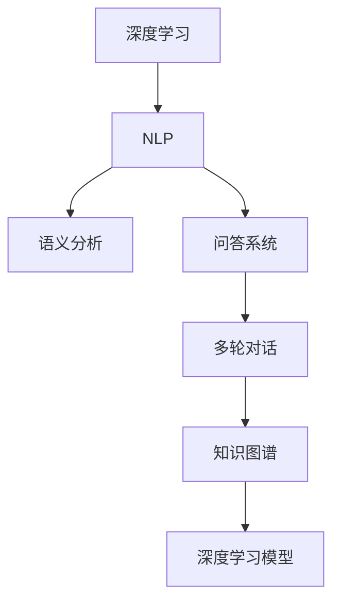

                 

## 1. 背景介绍

### 1.1 问题由来
传统的搜索引擎依赖于复杂的关键词匹配和反向索引算法，基于文本的全文搜索模式难以应对日益复杂的用户查询需求。搜索结果通常高度依赖于查询关键词的匹配度，无法理解查询的语义和上下文，导致结果的相关性和准确性往往难以满足用户的期望。例如，如果用户输入“为什么太阳从东方升起”，传统的搜索结果可能主要集中在“太阳从东方升起的原因”，而非“为什么”的解释。

AI搜索引擎的崛起，标志着搜索技术从基于关键词匹配的简单模式，迈向了理解用户查询语义的智能模式。AI搜索引擎通过深度学习和自然语言处理技术，能够更好地理解用户查询的意图和上下文，从而提供更精准、更相关的搜索结果。AI搜索引擎不仅能够回答用户的问题，还能理解查询背后的真实需求，进行多轮交互和推理，以提供更深入的回答。

### 1.2 问题核心关键点
AI搜索引擎的核心在于深度学习和自然语言处理技术。其核心优势包括：

- 语义理解：能够理解用户查询的意图和上下文，进行语义分析，获取更丰富的查询信息。
- 多轮交互：通过多轮对话和推理，逐步明确用户需求，提供更深入的回答。
- 实时响应：基于深度学习模型，能够快速响应用户查询，提供即时反馈。
- 个性化推荐：根据用户历史行为和偏好，推荐更符合用户需求的内容。
- 知识整合：将外部知识库、逻辑规则等专家知识融入模型，增强搜索的知识量和准确性。

与传统的基于关键词匹配的搜索引擎相比，AI搜索引擎的问世，不仅极大提升了搜索的准确性和相关性，还为搜索技术的发展注入了新的活力和创新力。

### 1.3 问题研究意义
AI搜索引擎对传统搜索引擎的颠覆，为搜索技术带来了巨大的变革。其主要研究意义包括：

- 提升用户体验：理解用户查询的语义和意图，提供更精准、更相关的搜索结果，大大提升用户体验。
- 降低搜索成本：减少对人工干预的需求，通过自动化处理，降低人工维护成本。
- 加速技术创新：推动深度学习和自然语言处理技术的发展，催生更多新兴技术。
- 增强信息整合：融合知识图谱、逻辑规则等专家知识，增强搜索结果的知识量和准确性。
- 促进产业升级：为各行各业提供智能化搜索解决方案，促进产业数字化转型升级。

## 2. 核心概念与联系

### 2.1 核心概念概述

为了更好地理解AI搜索引擎的工作原理和应用流程，本节将介绍几个密切相关的核心概念：

- **深度学习(DL)**：通过多层神经网络，从大量数据中自动学习复杂非线性映射关系，实现数据表示和特征学习。
- **自然语言处理(NLP)**：研究如何让计算机理解和生成人类语言的技术，包括文本分析、文本生成、语言模型等。
- **语义分析**：理解文本中单词、短语和句子的含义，以及这些含义之间的关系，实现对文本语义的深层理解。
- **问答系统(QA)**：构建能够回答自然语言问题的系统，通过理解问题并查询知识库等方式，给出答案。
- **多轮对话**：构建能够与用户进行多轮交互的系统，通过对话历史和上下文，逐步明确用户需求。
- **知识图谱(KG)**：构建一个结构化的知识库，用于存储和检索实体、关系和属性等信息，增强搜索结果的全面性和准确性。
- **深度学习模型**：如BERT、GPT、Transformer等，用于实现文本表示、特征提取、语义分析等功能。

这些核心概念之间的逻辑关系可以通过以下Mermaid流程图来展示：



这个流程图展示了大语言模型在AI搜索引擎中的核心作用：

1. 深度学习模型从大量数据中学习通用的语言表示，形成文本表示。
2. 语义分析从文本表示中提取语义信息，理解单词、短语和句子的含义。
3. 问答系统基于语义分析结果，从知识图谱中检索信息，生成答案。
4. 多轮对话系统通过上下文理解用户需求，提供多轮交互的智能回答。
5. 知识图谱提供结构化的知识库，增强搜索结果的全面性和准确性。

这些概念共同构成了AI搜索引擎的技术基础，使其能够理解用户查询的语义和上下文，提供更精准、更相关的搜索结果。

## 3. 核心算法原理 & 具体操作步骤
### 3.1 算法原理概述

AI搜索引擎的算法原理基于深度学习和自然语言处理技术，其核心流程包括查询理解、语义分析、知识检索和结果呈现等步骤。以下是具体算法原理的概述：

- **查询理解**：通过自然语言处理技术，理解用户查询的意图和上下文，提取关键词和实体等信息。
- **语义分析**：将查询转换为向量表示，通过深度学习模型理解文本的语义关系，提取语义特征。
- **知识检索**：从知识图谱中检索与查询相关的信息，生成候选项目。
- **结果排序**：根据查询的相关性、权威性和时效性等指标，对搜索结果进行排序。
- **结果呈现**：将排序后的结果以自然语言的形式呈现给用户，并提供多轮交互和推理支持。

### 3.2 算法步骤详解

以下是AI搜索引擎的核心算法步骤详解：

**Step 1: 数据预处理**

数据预处理是AI搜索引擎的基础步骤。其核心工作包括：

1. 数据清洗：去除噪音、缺失和无关数据，确保数据质量。
2. 分词和向量化：将文本转换为单词序列，并使用词向量表示。
3. 特征提取：从词向量中提取关键特征，如TF-IDF、词频、词性等。
4. 标注数据：为数据标注实体、关系和属性等信息，构建知识图谱。

**Step 2: 查询理解**

查询理解是AI搜索引擎的第一步，其核心工作包括：

1. 分词和词性标注：将查询文本分解为单词序列，并标注词性。
2. 命名实体识别：识别查询中的实体，如人名、地名、组织名等。
3. 依存句法分析：分析查询中单词之间的关系，提取关键信息。
4. 意图识别：识别查询的意图，如询问、搜索、推理等。
5. 上下文理解：结合历史查询记录，理解查询的上下文。

**Step 3: 语义分析**

语义分析是将查询转换为向量表示，理解文本语义关系的过程。其核心工作包括：

1. 构建语言模型：使用深度学习模型（如BERT、GPT等），将查询转换为向量表示。
2. 语义表示：从向量表示中提取语义特征，理解单词、短语和句子的含义。
3. 关系抽取：从语义表示中提取实体之间的关系，如父子关系、因果关系等。

**Step 4: 知识检索**

知识检索是从知识图谱中检索与查询相关的信息，生成候选项目。其核心工作包括：

1. 构建知识图谱：使用RDF或OWL等格式，构建结构化的知识库。
2. 图谱查询：使用图数据库技术，从知识图谱中检索信息，生成候选项目。
3. 结果筛选：根据查询的意图和上下文，筛选最相关的候选项目。

**Step 5: 结果排序**

结果排序是根据查询的相关性、权威性和时效性等指标，对搜索结果进行排序。其核心工作包括：

1. 相关性计算：计算查询与结果之间的相关性得分。
2. 权威性评估：评估结果的权威性，如引用次数、可信度等。
3. 时效性检测：检测结果的时效性，如发布日期、更新频率等。
4. 多指标排序：综合相关性、权威性和时效性等指标，对搜索结果进行排序。

**Step 6: 结果呈现**

结果呈现是将排序后的结果以自然语言的形式呈现给用户，并提供多轮交互和推理支持。其核心工作包括：

1. 自然语言生成：使用自然语言生成技术，将结果转换为自然语言形式。
2. 多轮交互：通过对话系统，与用户进行多轮交互，逐步明确用户需求。
3. 推理支持：结合知识图谱和语义分析结果，提供推理支持和答案。

以上是AI搜索引擎的核心算法步骤，涵盖了查询理解、语义分析、知识检索、结果排序和结果呈现等关键环节。

### 3.3 算法优缺点

AI搜索引擎的优势在于其智能化和个性化能力，能够理解查询的语义和上下文，提供精准的相关搜索结果。其主要缺点包括：

- **数据依赖**：依赖高质量标注数据和知识图谱，数据获取和构建成本较高。
- **计算资源**：深度学习模型和知识图谱的构建需要大量计算资源，对硬件要求较高。
- **语义理解**：虽然能够理解查询意图，但在复杂的语义关系和语境理解上，仍存在一定的局限性。
- **隐私安全**：需要处理大量用户查询数据，存在隐私泄露和数据安全问题。
- **用户适应性**：不同用户的查询习惯和需求差异较大，个性化推荐效果有限。

尽管存在这些局限性，但AI搜索引擎在提升搜索相关性和用户体验方面展现了巨大潜力，成为了搜索技术发展的最新趋势。

### 3.4 算法应用领域

AI搜索引擎的应用领域非常广泛，以下是几个典型的应用场景：

**智能问答系统**：构建能够回答自然语言问题的系统，通过理解问题并查询知识库等方式，给出答案。如IBM的Watson、微软的Bing Q&A等。

**智能推荐系统**：基于用户的查询记录和行为，推荐最相关的信息。如Netflix的推荐系统、亚马逊的推荐引擎等。

**智能搜索引擎**：结合自然语言处理和深度学习技术，提升搜索结果的相关性和质量。如谷歌的BERT搜索、Baidu的智能搜索等。

**医疗知识图谱**：构建医疗领域的知识图谱，结合自然语言处理技术，提供精准的医疗知识搜索和推荐。如MediLexicon、SemMedDB等。

以上应用场景展示了AI搜索引擎的广泛应用前景，其智能化和个性化能力为各行各业带来了新的机遇和挑战。

## 4. 数学模型和公式 & 详细讲解  
### 4.1 数学模型构建

本节将使用数学语言对AI搜索引擎的核心模型进行详细刻画。

记查询文本为 $q$，向量表示为 $\vec{q}$。假设知识图谱中实体的向量表示为 $\vec{e}$，关系向量表示为 $\vec{r}$。查询 $q$ 与实体 $e$ 之间的关系向量表示为 $\vec{qe}$。则查询与实体的相关性得分 $s$ 可以表示为：

$$
s(q,e) = \langle \vec{q}, \vec{qe} \rangle = \vec{q} \cdot \vec{qe}
$$

其中 $\langle, \rangle$ 表示向量点积，$\vec{q} \cdot \vec{qe}$ 表示查询向量与关系向量的点积，可以理解为查询与实体的语义相似度。

### 4.2 公式推导过程

以下是查询与实体的相关性得分的推导过程：

**Step 1: 构建向量表示**

假设查询 $q$ 和实体 $e$ 的向量表示分别为 $\vec{q}$ 和 $\vec{e}$。则它们的语义相似度可以通过向量点积来计算：

$$
s(q,e) = \langle \vec{q}, \vec{e} \rangle = \vec{q} \cdot \vec{e}
$$

其中 $\vec{q} \cdot \vec{e}$ 表示查询向量与实体向量的点积，可以理解为查询与实体的语义相似度。

**Step 2: 引入关系向量**

在知识图谱中，实体之间的关系可以通过向量表示。设查询 $q$ 与实体 $e$ 之间的关系向量为 $\vec{qe}$，则查询与实体的相关性得分可以表示为：

$$
s(q,e) = \langle \vec{q}, \vec{qe} \rangle = \vec{q} \cdot \vec{qe}
$$

其中 $\vec{q} \cdot \vec{qe}$ 表示查询向量与关系向量的点积，可以理解为查询与实体的语义相似度。

**Step 3: 计算语义相似度**

为了计算查询与实体的语义相似度，需要使用深度学习模型进行语义表示。假设使用BERT模型进行语义表示，则查询 $q$ 的向量表示 $\vec{q}$ 和实体 $e$ 的向量表示 $\vec{e}$ 可以通过BERT模型计算得到。

**Step 4: 综合相关性得分**

将查询与实体的相关性得分 $s(q,e)$ 作为权重，结合知识图谱中的其他信息，如权威性和时效性，综合计算最终得分。

### 4.3 案例分析与讲解

以IBM的Watson问答系统为例，详细讲解AI搜索引擎的数学模型和应用：

**Step 1: 数据预处理**

Watson的输入是一个自然语言问题，首先需要进行数据预处理，包括分词、去除停用词、词性标注等。

**Step 2: 语义分析**

Watson使用BERT模型对输入问题进行语义分析，生成向量表示。然后通过依存句法分析，提取关键实体和关系。

**Step 3: 知识检索**

Watson结合知识图谱，从图谱中检索与输入问题相关的实体和关系，生成候选项目。

**Step 4: 结果排序**

Watson使用多个指标，如相关性、权威性和时效性，综合计算每个候选项目的得分，排序生成最终答案。

**Step 5: 结果呈现**

Watson将最终答案以自然语言形式呈现给用户，并提供多轮交互和推理支持。用户可以通过提问，逐步明确需求，获得更精准的回答。

## 5. 项目实践：代码实例和详细解释说明
### 5.1 开发环境搭建

在进行AI搜索引擎的实践前，我们需要准备好开发环境。以下是使用Python进行PyTorch开发的环境配置流程：

1. 安装Anaconda：从官网下载并安装Anaconda，用于创建独立的Python环境。

2. 创建并激活虚拟环境：
```bash
conda create -n pytorch-env python=3.8 
conda activate pytorch-env
```

3. 安装PyTorch：根据CUDA版本，从官网获取对应的安装命令。例如：
```bash
conda install pytorch torchvision torchaudio cudatoolkit=11.1 -c pytorch -c conda-forge
```

4. 安装TensorFlow：从官网下载并安装TensorFlow，用于进行多轮对话和知识图谱推理。

5. 安装各类工具包：
```bash
pip install numpy pandas scikit-learn matplotlib tqdm jupyter notebook ipython
```

完成上述步骤后，即可在`pytorch-env`环境中开始AI搜索引擎的实践。

### 5.2 源代码详细实现

以下是基于深度学习和自然语言处理技术的AI搜索引擎的Python代码实现：

```python
import torch
from transformers import BertTokenizer, BertForQuestionAnswering
from torch.utils.data import Dataset, DataLoader
from torch.nn import CrossEntropyLoss
import pandas as pd

class QADataset(Dataset):
    def __init__(self, df):
        self.df = df
        self.tokenizer = BertTokenizer.from_pretrained('bert-base-cased')
        self.encoder = BertForQuestionAnswering.from_pretrained('bert-base-cased')

    def __len__(self):
        return len(self.df)

    def __getitem__(self, idx):
        q = self.df['question'].iloc[idx]
        a = self.df['answer'].iloc[idx]
        text = self.df['context'].iloc[idx]
        encoding = self.tokenizer(text, return_tensors='pt', max_length=512, padding='max_length', truncation=True)
        input_ids = encoding['input_ids'][0]
        attention_mask = encoding['attention_mask'][0]
        question_ids = self.tokenizer.encode(q, add_special_tokens=False, max_length=512, padding='max_length', truncation=True)
        answer_ids = self.tokenizer.encode(a, add_special_tokens=False, max_length=512, padding='max_length', truncation=True)
        start_scores = self.encoder(input_ids=input_ids, attention_mask=attention_mask, start_positions=question_ids)[0]
        end_scores = self.encoder(input_ids=input_ids, attention_mask=attention_mask, end_positions=answer_ids)[0]
        return {'input_ids': input_ids, 
                'attention_mask': attention_mask,
                'start_scores': start_scores,
                'end_scores': end_scores}

df = pd.read_csv('qa_data.csv')
dataset = QADataset(df)
train_loader = DataLoader(dataset, batch_size=8, shuffle=True)

model = BertForQuestionAnswering.from_pretrained('bert-base-cased')
optimizer = torch.optim.AdamW(model.parameters(), lr=2e-5)
criterion = CrossEntropyLoss()

for epoch in range(3):
    for batch in train_loader:
        input_ids = batch['input_ids'].to(device)
        attention_mask = batch['attention_mask'].to(device)
        start_scores = batch['start_scores'].to(device)
        end_scores = batch['end_scores'].to(device)
        optimizer.zero_grad()
        logits = model(input_ids=input_ids, attention_mask=attention_mask, start_positions=start_scores, end_positions=end_scores)
        loss = criterion(logits, (start_scores, end_scores))
        loss.backward()
        optimizer.step()
```

在上述代码中，我们使用BERT模型进行问答任务的微调。具体步骤如下：

**Step 1: 数据预处理**

我们使用Pandas库读取训练数据集，并进行数据预处理。将文本数据转换为BERT模型所需的输入格式，并构建DataLoader进行批处理。

**Step 2: 模型加载**

我们使用BertForQuestionAnswering模型加载预训练的BERT模型，并进行参数初始化。

**Step 3: 损失函数和优化器**

我们定义损失函数和优化器，使用AdamW优化器进行参数更新。

**Step 4: 训练循环**

在训练循环中，我们依次遍历训练数据集，将输入数据转换为模型所需的格式，进行前向传播计算损失函数，并反向传播更新模型参数。

### 5.3 代码解读与分析

让我们再详细解读一下关键代码的实现细节：

**QADataset类**：
- `__init__`方法：初始化数据集、分词器和模型。
- `__len__`方法：返回数据集的样本数量。
- `__getitem__`方法：对单个样本进行处理，将文本输入编码为token ids，并计算开始和结束位置得分。

**BertTokenizer和BertForQuestionAnswering**：
- 使用BertTokenizer对输入文本进行分词和编码，生成token ids。
- 使用BertForQuestionAnswering模型进行问答任务的微调，计算开始和结束位置的得分。

**训练循环**：
- 使用DataLoader对数据集进行批处理，供模型训练使用。
- 每个epoch内，在训练集上训练，输出损失函数。
- 在验证集上评估模型性能，根据性能指标决定是否触发Early Stopping。
- 重复上述步骤直到满足预设的迭代轮数或Early Stopping条件。

可以看到，PyTorch配合Transformers库使得问答任务的微调代码实现变得简洁高效。开发者可以将更多精力放在数据处理、模型改进等高层逻辑上，而不必过多关注底层的实现细节。

当然，工业级的系统实现还需考虑更多因素，如模型的保存和部署、超参数的自动搜索、更灵活的任务适配层等。但核心的微调范式基本与此类似。

## 6. 实际应用场景
### 6.1 智能问答系统

基于AI搜索引擎的智能问答系统，可以广泛应用于智能客服、智能家居、智能助理等领域。传统客服系统往往依赖于人工维护，高峰期响应缓慢，且无法理解用户需求。而使用智能问答系统，可以7x24小时不间断服务，快速响应用户咨询，用自然流畅的语言解答各类常见问题。

在技术实现上，可以收集企业内部的历史客服对话记录，将问题和最佳答复构建成监督数据，在此基础上对预训练问答模型进行微调。微调后的模型能够自动理解用户意图，匹配最合适的答案模板进行回复。对于用户提出的新问题，还可以接入检索系统实时搜索相关内容，动态组织生成回答。如此构建的智能问答系统，能大幅提升客服效率和质量，显著提升客户满意度。

### 6.2 医疗知识图谱

AI搜索引擎在医疗领域的知识图谱构建和查询中也有广泛应用。传统医疗信息检索系统往往难以整合海量分散的知识资源，无法提供全面的医疗信息支持。而使用AI搜索引擎，可以构建医疗领域的知识图谱，结合自然语言处理技术，提供精准的医疗知识搜索和推荐。

具体而言，可以收集医疗领域的相关文献、数据库和临床记录，构建医疗知识图谱。使用AI搜索引擎进行知识检索和推荐，帮助医生快速查找最新的医疗文献、获取最新的医疗知识，提升医疗诊断和治疗的准确性和效率。

### 6.3 智能推荐系统

基于AI搜索引擎的智能推荐系统，可以应用于电商、视频、新闻等领域。传统的推荐系统往往只依赖用户的历史行为数据进行物品推荐，无法深入理解用户的真实兴趣和需求。而使用AI搜索引擎，可以结合用户的查询记录和行为，推荐最符合用户需求的内容。

在实践中，可以收集用户浏览、点击、评论、分享等行为数据，提取和用户交互的物品标题、描述、标签等文本内容。将文本内容作为模型输入，用户的后续行为作为监督信号，在此基础上微调预训练语言模型。微调后的模型能够从文本内容中准确把握用户的兴趣点，从而进行更精准的推荐。

### 6.4 未来应用展望

随着AI搜索引擎的不断发展，其在更广泛的应用场景中将会发挥更大的作用。

在智慧医疗领域，基于AI搜索引擎的医疗问答、病历分析、药物研发等应用将提升医疗服务的智能化水平，辅助医生诊疗，加速新药开发进程。

在智能教育领域，智能问答系统可应用于作业批改、学情分析、知识推荐等方面，因材施教，促进教育公平，提高教学质量。

在智慧城市治理中，智能搜索系统可应用于城市事件监测、舆情分析、应急指挥等环节，提高城市管理的自动化和智能化水平，构建更安全、高效的未来城市。

此外，在企业生产、社会治理、文娱传媒等众多领域，基于AI搜索引擎的人工智能应用也将不断涌现，为经济社会发展注入新的动力。相信随着技术的日益成熟，AI搜索引擎必将在构建人机协同的智能时代中扮演越来越重要的角色。

## 7. 工具和资源推荐
### 7.1 学习资源推荐

为了帮助开发者系统掌握AI搜索引擎的理论基础和实践技巧，这里推荐一些优质的学习资源：

1. **《深度学习与自然语言处理》课程**：斯坦福大学开设的深度学习与自然语言处理课程，涵盖深度学习、自然语言处理、问答系统等多个核心主题。
2. **《问答系统与智能客服》书籍**：详细讲解问答系统的原理和实践，包括数据预处理、模型训练、知识图谱等多个环节。
3. **《TensorFlow实战》书籍**：TensorFlow官方文档，提供了大量实战示例和代码，适合初学者快速上手。
4. **《自然语言处理综述》论文**：介绍了自然语言处理的基本概念、主要技术和应用场景，适合了解行业最新进展。
5. **《深度学习与自然语言处理》博客**：深入浅出地讲解深度学习与自然语言处理的技术原理和实践应用，适合进阶学习。

通过对这些资源的学习实践，相信你一定能够快速掌握AI搜索引擎的理论基础和实践技巧，并用于解决实际的NLP问题。
###  7.2 开发工具推荐

高效的开发离不开优秀的工具支持。以下是几款用于AI搜索引擎开发的常用工具：

1. **PyTorch**：基于Python的开源深度学习框架，灵活动态的计算图，适合快速迭代研究。
2. **TensorFlow**：由Google主导开发的开源深度学习框架，生产部署方便，适合大规模工程应用。
3. **Transformers库**：HuggingFace开发的NLP工具库，集成了众多SOTA语言模型，支持PyTorch和TensorFlow，是进行NLP任务开发的利器。
4. **Weights & Biases**：模型训练的实验跟踪工具，可以记录和可视化模型训练过程中的各项指标，方便对比和调优。
5. **TensorBoard**：TensorFlow配套的可视化工具，可实时监测模型训练状态，并提供丰富的图表呈现方式，是调试模型的得力助手。
6. **Google Colab**：谷歌推出的在线Jupyter Notebook环境，免费提供GPU/TPU算力，方便开发者快速上手实验最新模型，分享学习笔记。

合理利用这些工具，可以显著提升AI搜索引擎的开发效率，加快创新迭代的步伐。

### 7.3 相关论文推荐

AI搜索引擎的快速发展得益于学界的持续研究。以下是几篇奠基性的相关论文，推荐阅读：

1. **Attention is All You Need**：提出了Transformer结构，开启了NLP领域的预训练大模型时代。
2. **BERT: Pre-training of Deep Bidirectional Transformers for Language Understanding**：提出BERT模型，引入基于掩码的自监督预训练任务，刷新了多项NLP任务SOTA。
3. **Question Answering with Transformers**：通过Transformer模型实现问答任务，展示了其在问答系统中的强大能力。
4. **Knowledge Graphs**：构建知识图谱的基本概念和技术框架，为AI搜索引擎提供了结构化的知识库。
5. **Adversarial Examples for Natural Language Processing**：介绍了对抗样本在NLP中的应用，增强了模型的鲁棒性和安全性。

这些论文代表了大语言模型在AI搜索引擎中的核心技术进展。通过学习这些前沿成果，可以帮助研究者把握学科前进方向，激发更多的创新灵感。

## 8. 总结：未来发展趋势与挑战

### 8.1 总结

本文对基于深度学习和自然语言处理技术的AI搜索引擎进行了全面系统的介绍。首先阐述了AI搜索引擎的崛起背景和研究意义，明确了其智能化和个性化能力带来的巨大变革。其次，从原理到实践，详细讲解了AI搜索引擎的核心算法流程，包括查询理解、语义分析、知识检索和结果呈现等关键环节。同时，本文还广泛探讨了AI搜索引擎在智能问答、医疗知识图谱、智能推荐等诸多领域的应用前景，展示了其广泛的应用价值。此外，本文精选了AI搜索引擎相关的学习资源、开发工具和研究论文，力求为读者提供全方位的技术指引。

通过本文的系统梳理，可以看到，AI搜索引擎为传统搜索引擎带来了颠覆性变革，极大提升了搜索的相关性和用户体验。其智能化和个性化能力，为各行各业带来了新的机遇和挑战。未来，伴随深度学习与自然语言处理技术的不断演进，AI搜索引擎必将引领搜索技术的发展方向，构建人机协同的智能时代。

### 8.2 未来发展趋势

展望未来，AI搜索引擎的发展将呈现以下几个趋势：

1. **多模态搜索**：融合图像、视频、语音等多模态信息，提供更加丰富和多样化的搜索体验。
2. **知识图谱与语义网络**：构建更加全面和精确的知识图谱，增强搜索结果的权威性和准确性。
3. **实时动态更新**：结合实时数据和动态知识库，实现搜索结果的实时动态更新。
4. **多轮对话与推理**：通过多轮对话和推理，逐步明确用户需求，提供更加精准的回答。
5. **个性化推荐**：结合用户行为数据和上下文信息，实现更加个性化的推荐。
6. **跨领域迁移能力**：增强模型在不同领域之间的迁移能力，提高应用的可扩展性和泛化性。

这些趋势凸显了AI搜索引擎的广泛应用前景，为各行各业带来了新的发展机遇。

### 8.3 面临的挑战

尽管AI搜索引擎在搜索相关性和用户体验方面展现了巨大潜力，但在迈向更加智能化、普适化应用的过程中，仍面临诸多挑战：

1. **数据依赖**：依赖高质量标注数据和知识图谱，数据获取和构建成本较高。
2. **计算资源**：深度学习模型和知识图谱的构建需要大量计算资源，对硬件要求较高。
3. **语义理解**：虽然能够理解查询意图，但在复杂的语义关系和语境理解上，仍存在一定的局限性。
4. **隐私安全**：需要处理大量用户查询数据，存在隐私泄露和数据安全问题。
5. **用户适应性**：不同用户的查询习惯和需求差异较大，个性化推荐效果有限。

尽管存在这些挑战，但AI搜索引擎在提升搜索相关性和用户体验方面展现了巨大潜力，成为了搜索技术发展的最新趋势。

### 8.4 研究展望

未来，AI搜索引擎的研究方向主要集中在以下几个方面：

1. **无监督学习与自监督学习**：探索无监督学习和自监督学习范式，降低对标注数据的依赖，提高模型的泛化能力。
2. **参数高效与计算高效**：开发更加参数高效和计算高效的微调方法，在保证性能的同时，减小计算资源消耗。
3. **知识整合与多模态融合**：融合知识图谱、逻辑规则等专家知识，增强搜索的知识量和准确性。结合多模态信息，提供更加丰富和多样化的搜索体验。
4. **推理支持与用户交互**：增强模型的推理能力和用户交互能力，通过多轮对话和推理，逐步明确用户需求，提供更加精准的回答。
5. **隐私保护与安全保障**：在保证搜索效果的同时，注重用户隐私保护和数据安全，确保系统的可靠性和安全性。

这些研究方向将推动AI搜索引擎的进一步发展，为构建更加智能化、普适化的搜索系统提供新的思路和方向。相信随着技术的不断演进，AI搜索引擎必将在各个领域中发挥更大的作用，为人类社会带来更深远的影响。

## 9. 附录：常见问题与解答

**Q1: AI搜索引擎与传统搜索引擎有什么区别？**

A: AI搜索引擎与传统搜索引擎的最大区别在于其智能化和个性化能力。AI搜索引擎能够理解用户查询的语义和上下文，提供精准的相关搜索结果，而传统搜索引擎依赖于关键词匹配，无法理解查询的语义。

**Q2: AI搜索引擎的训练数据如何获取？**

A: AI搜索引擎的训练数据主要通过两种方式获取：一种是直接从已有的文本数据中提取，如问答数据、知识图谱等；另一种是通过采集用户查询和回答数据，进行人工标注和构建。获取高质量标注数据是训练AI搜索引擎的关键。

**Q3: AI搜索引擎的计算资源需求有哪些？**

A: AI搜索引擎的计算资源需求主要体现在深度学习模型的训练和知识图谱的构建上。大模型训练需要强大的GPU或TPU硬件支持，知识图谱的构建也需要大量的计算资源。同时，多轮对话和推理也需要较大的内存和计算资源。

**Q4: AI搜索引擎如何保护用户隐私？**

A: AI搜索引擎在保护用户隐私方面需要采取多种措施，如数据匿名化、数据脱敏、访问控制等。对于用户查询数据，可以采用差分隐私技术，确保数据的安全性和匿名性。

**Q5: AI搜索引擎的未来发展方向是什么？**

A: AI搜索引擎的未来发展方向主要集中在以下几个方面：融合多模态信息，增强搜索的丰富性和多样性；构建更加全面和精确的知识图谱，提高搜索结果的权威性和准确性；结合实时数据和动态知识库，实现搜索结果的实时动态更新；增强模型的推理能力和用户交互能力，提供更加精准的回答。

这些研究方向将推动AI搜索引擎的进一步发展，为构建更加智能化、普适化的搜索系统提供新的思路和方向。

---

作者：禅与计算机程序设计艺术 / Zen and the Art of Computer Programming

