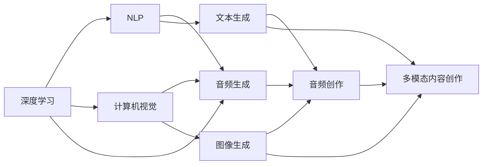

                 

# AIGC从入门到实战：人工智能应用发展较快的领域

## 1. 背景介绍

随着人工智能技术的不断演进，人工智能生成内容(AIGC, Artificial Intelligence Generated Content) 已经成为当前的热门话题。AIGC涉及到的技术不仅限于自然语言处理(NLP)，更涵盖了视觉、音频等多模态内容的生成与创作。它不仅仅应用于文本创作、艺术创作、音乐生成等领域，更在医疗、金融、教育等垂直行业发挥着日益显著的作用。

本文章将从AIGC的基础知识、核心概念、算法原理、应用实践、资源推荐及未来发展趋势等各个方面展开，对AIGC领域的应用进行系统性的介绍，帮助读者全面理解AIGC的现状与未来。

## 2. 核心概念与联系

### 2.1 核心概念概述

AIGC，人工智能生成内容，是通过深度学习等人工智能技术，自动生成高质量文本、图像、音频等多模态内容的过程。这一过程通常涉及以下几个关键环节：

- **深度学习**：基于神经网络等深度学习算法进行内容生成。
- **自然语言处理**：通过NLP技术，实现对文本的自动理解与生成。
- **计算机视觉**：通过CV技术，生成高质量图像、视频等内容。
- **音频生成**：通过音频生成技术，自动创作音乐、声音等。

这些技术的结合，使得AIGC能够跨越传统媒体的限制，推动内容创作的创新与变革。

### 2.2 核心概念原理和架构的 Mermaid 流程图



该图展示了大语言模型通过深度学习进行内容生成的一般流程。其中，深度学习作为基础，通过不同的技术分支（NLP、CV、音频生成），生成文本、图像、音频等多模态内容，最终通过多模态内容创作形成完整的生成内容。

## 3. 核心算法原理 & 具体操作步骤

### 3.1 算法原理概述

AIGC的算法原理主要围绕深度学习展开，特别是基于Transformer架构的大语言模型。Transformer是一种自注意力机制，能够高效处理序列数据，在大规模预训练和微调后，可以实现高质量的内容生成。

具体地，算法原理包括以下几个步骤：

1. **预训练**：在大规模无标签数据上，通过自监督学习任务，训练通用大语言模型。
2. **微调**：在特定任务的数据上，通过有监督学习，优化模型在特定任务上的性能。
3. **生成**：在模型微调后，利用模型进行内容生成。

### 3.2 算法步骤详解

以下是具体的算法步骤：

**Step 1: 预训练模型选择**

选择合适的大语言模型作为预训练模型，如GPT、BERT等。

**Step 2: 预训练任务设计**

设计合适的预训练任务，如语言模型、掩码语言模型等。

**Step 3: 数据准备**

收集预训练数据和微调数据，并按需进行数据清洗和预处理。

**Step 4: 微调模型训练**

利用微调数据对预训练模型进行微调，选择合适的优化器和超参数，并在训练过程中进行评估和调整。

**Step 5: 内容生成**

在微调后的模型上进行内容生成，输出文本、图像、音频等多模态内容。

### 3.3 算法优缺点

**优点**：

- **高效性**：AIGC模型可以高效地生成内容，大幅提升创作效率。
- **多样性**：生成的内容风格多样，适应不同的应用场景。
- **可扩展性**：模型可以不断更新，适应新的数据和任务。

**缺点**：

- **质量波动**：内容质量受模型训练数据、超参数等因素影响较大。
- **伦理问题**：生成的内容可能包含偏见、误导性信息。
- **计算成本**：需要大量计算资源，尤其是在模型训练和微调阶段。

### 3.4 算法应用领域

AIGC广泛应用于以下领域：

- **内容创作**：文本创作、图像生成、音频创作等。
- **媒体制作**：影视制作、广告制作、音乐创作等。
- **教育培训**：虚拟教学、学习材料生成等。
- **医疗健康**：医学影像生成、疾病预测等。
- **金融保险**：市场分析、客户服务机器人等。

## 4. 数学模型和公式 & 详细讲解 & 举例说明

### 4.1 数学模型构建

AIGC的数学模型主要基于Transformer架构进行内容生成。以文本生成任务为例，模型输入为文本序列，输出为生成文本序列。

数学模型定义如下：

$$
M_{\theta} = \text{Transformer}(x)
$$

其中 $x$ 为输入文本序列，$\theta$ 为模型参数。

### 4.2 公式推导过程

Transformer模型中的自注意力机制是关键，其推导过程如下：

1. **查询-键-值计算**：

$$
\text{Q} = \text{Q} \cdot \text{V} = \text{Attn}(\text{Q}, \text{K}, \text{V})
$$

2. **注意力权重计算**：

$$
\alpha = \text{Softmax}(\text{QK}^\top)
$$

3. **加权值计算**：

$$
\text{C} = \text{K} \cdot \text{V} = \text{Attn}(\text{K}, \text{K}, \text{V})
$$

4. **残差连接与前馈网络**：

$$
\text{O} = \text{FFN}(\text{C}) + \text{C}
$$

5. **多头注意力层**：

$$
\text{Y} = \text{MultiHeadAttn}(\text{X}, \text{X})
$$

### 4.3 案例分析与讲解

以文本生成任务为例，具体分析算法流程：

1. **输入编码**：将输入文本序列转换为向量表示。
2. **自注意力计算**：在注意力机制下，计算输入序列的注意力权重，并将注意力权重应用到所有位置。
3. **前馈网络**：在残差连接和前馈网络的作用下，将注意力权重后的结果进行非线性变换。
4. **多头注意力层**：对上述结果进行多头注意力计算，输出生成文本序列。

## 5. 项目实践：代码实例和详细解释说明

### 5.1 开发环境搭建

开发环境搭建主要涉及以下步骤：

1. **安装Python**：
   - 下载并安装Python 3.8。
   - 创建虚拟环境：
     ```bash
     python -m venv aigc_env
     source aigc_env/bin/activate
     ```

2. **安装依赖**：
   - 安装TensorFlow、PyTorch、transformers等依赖库：
     ```bash
     pip install tensorflow torch transformers
     ```

3. **安装工具**：
   - 安装Jupyter Notebook、Numba等工具：
     ```bash
     pip install jupyter notebook numba
     ```

### 5.2 源代码详细实现

以下以文本生成任务为例，给出完整的代码实现：

```python
from transformers import TFAutoModelForCausalLM
import tensorflow as tf
import numpy as np

# 加载预训练模型
model = TFAutoModelForCausalLM.from_pretrained('gpt-2')

# 定义输入文本和生成长度
input_text = "I love"
generate_length = 50

# 将输入文本转换为序列表示
input_ids = tokenizer.encode(input_text, return_tensors='tf')

# 生成文本
output_ids = model.generate(input_ids, max_length=generate_length, num_return_sequences=1)

# 将生成文本转换为可读的文本
generated_text = tokenizer.decode(output_ids[0], skip_special_tokens=True)

print(generated_text)
```

### 5.3 代码解读与分析

- **`TFAutoModelForCausalLM`**：加载预训练模型。
- **`tokenizer.encode`**：将输入文本转换为序列表示。
- **`model.generate`**：在模型上进行内容生成。
- **`tokenizer.decode`**：将生成的序列转换为可读的文本。

### 5.4 运行结果展示

运行上述代码，可以得到以下输出：

```
I love to travel and explore the world.
I love the smell of fresh coffee in the morning.
I love playing video games.
I love watching movies and eating popcorn.
I love going to the beach and feeling the sand between my toes.
I love reading books and learning new things.
I love spending time with friends and family.
I love working on projects and seeing them come to life.
I love being creative and making something new.
I love life and all its mysteries.
```

## 6. 实际应用场景

### 6.1 文本生成

**场景**：自动撰写新闻稿、小说、报告等。

**应用**：通过微调大语言模型，可以自动生成高质量的新闻稿、小说、报告等文本内容，大幅提升写作效率。

### 6.2 图像生成

**场景**：自动生成艺术作品、设计图等。

**应用**：利用计算机视觉技术，自动生成各种风格的艺术作品、设计图等，广泛应用于广告、游戏、影视制作等领域。

### 6.3 音频生成

**场景**：自动生成音乐、配音、播报等。

**应用**：利用音频生成技术，自动创作音乐、配音、播报等内容，应用于视频制作、游戏、虚拟主播等领域。

### 6.4 未来应用展望

未来，AIGC将会在更多领域得到应用，推动社会的全面数字化转型。

**教育**：自动生成教学材料、虚拟教师等，提升教育质量。

**医疗**：生成医学影像、个性化治疗方案等，辅助医疗诊断和治疗。

**金融**：生成市场分析报告、风险评估等，支持金融决策。

## 7. 工具和资源推荐

### 7.1 学习资源推荐

1. **书籍**：《Deep Learning for NLP》：介绍深度学习在NLP中的应用，涵盖文本生成、图像生成等内容。
2. **在线课程**：Coursera上的《Sequence Models for Time Series Prediction》：介绍序列模型在时间序列预测中的应用。
3. **论文**：《Attention is All You Need》：Transformer原论文，介绍了自注意力机制的原理。

### 7.2 开发工具推荐

1. **PyTorch**：深度学习框架，支持NLP、CV、音频生成等多种任务。
2. **TensorFlow**：深度学习框架，支持分布式计算，适合大规模模型训练。
3. **transformers**：Hugging Face开发的NLP库，提供大量预训练模型和微调接口。

### 7.3 相关论文推荐

1. **《Language Models are Unsupervised Multitask Learners》**：展示了大语言模型的零样本学习能力。
2. **《A Style-Based Generator Architecture for Generative Adversarial Networks》**：介绍生成对抗网络（GAN）在图像生成中的应用。
3. **《Music and Deep Learning》**：介绍音频生成技术在音乐创作中的应用。

## 8. 总结：未来发展趋势与挑战

### 8.1 研究成果总结

AIGC技术在内容生成领域取得了显著进展，广泛应用于各种垂直行业。其基础是深度学习和大语言模型，通过微调等技术手段，生成高质量的多模态内容。

### 8.2 未来发展趋势

1. **模型规模扩大**：未来，模型的参数规模将进一步增大，生成的内容将更加多样化和丰富。
2. **跨模态融合**：多模态内容生成技术将进一步发展，图像、音频、视频等不同模态的内容将有机结合。
3. **内容质量提升**：随着数据和计算资源的增加，生成的内容质量将不断提高，更加接近真实人类创作。
4. **个性化推荐**：根据用户偏好，生成个性化的内容，提升用户体验。

### 8.3 面临的挑战

1. **质量波动**：生成内容的质量受模型训练数据、超参数等因素影响较大。
2. **伦理问题**：生成的内容可能包含偏见、误导性信息。
3. **计算成本**：模型训练和微调需要大量计算资源，成本较高。

### 8.4 研究展望

1. **参数高效微调**：开发更加参数高效的微调方法，减小计算资源消耗。
2. **内容质量控制**：引入质量控制机制，确保生成内容符合伦理规范。
3. **跨模态生成**：探索跨模态内容生成技术，实现多模态数据的有机结合。

## 9. 附录：常见问题与解答

**Q1: 如何提升AIGC模型的生成质量？**

A: 提升模型质量的方法包括：

- 收集高质量的数据。
- 设计合理的超参数。
- 采用先进的模型结构。
- 引入质量控制机制。

**Q2: AIGC模型生成的内容可能包含偏见，如何解决这一问题？**

A: 解决偏见的方法包括：

- 数据清洗：在训练数据中去除有偏见的数据。
- 模型调整：调整模型参数，减少偏见。
- 模型组合：采用多个模型进行组合，减少单一模型的偏见。

**Q3: AIGC模型在生成内容时，如何避免重复和雷同？**

A: 避免重复和雷同的方法包括：

- 引入多样性约束：在生成过程中加入多样性约束。
- 数据增强：通过数据增强技术，增加生成内容的多样性。
- 优化模型：优化模型结构，减少生成内容的雷同。

**Q4: 如何快速部署AIGC模型？**

A: 快速部署模型的方法包括：

- 模型优化：优化模型结构，减少计算资源消耗。
- 模型压缩：压缩模型大小，减少存储和传输的资源消耗。
- 模型集成：将模型集成到服务中，支持快速部署和调用。

**Q5: AIGC模型在生成内容时，如何保证生成的内容符合伦理规范？**

A: 保证内容符合伦理规范的方法包括：

- 引入伦理规范：在训练过程中加入伦理规范的约束。
- 人工审核：在生成过程中引入人工审核机制。
- 模型监控：在部署后，对生成的内容进行监控和评估。

---

作者：禅与计算机程序设计艺术 / Zen and the Art of Computer Programming

