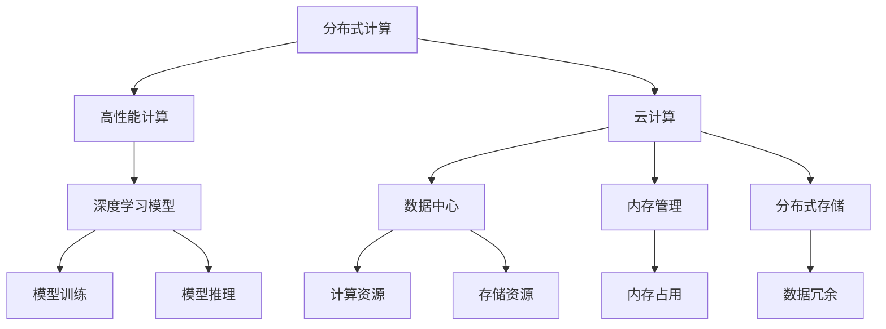

                 

# AIGC从入门到实战：进行硬件部署和运行工程源码

> 关键词：人工智能生成内容(AIGC), 硬件部署, 分布式计算, 高性能计算, 深度学习模型, 云计算, 数据中心, 内存管理, 分布式存储

## 1. 背景介绍

### 1.1 问题由来

随着人工智能(AI)技术的不断发展，特别是深度学习和机器学习技术的突破，人工智能生成内容(AIGC, Artificial Intelligence Generated Content)在图像、音频、视频、文本等多个领域取得了显著进展。AIGC不仅能够生成高质量的图像、音乐、视频等，还能生成自然流畅、富有创意的文本内容，广泛应用于娱乐、广告、教育、创作等领域，成为推动未来社会发展的重要力量。

然而，随着AIGC技术的发展，其计算需求也日益增长。大规模神经网络模型训练和推理、大规模数据处理等任务需要高效的计算资源支持。如何在分布式计算环境中高效部署和运行AIGC工程，成为当前AI行业面临的重要挑战。

### 1.2 问题核心关键点

为解决AIGC在分布式计算环境中的部署和运行问题，我们需要考虑以下核心关键点：

- 分布式计算环境的设计与部署：如何将大规模计算任务分布到多台计算节点上，实现并行计算和负载均衡。
- 高性能计算架构的选择与优化：如何高效利用硬件资源，提升AIGC任务的计算效率。
- 深度学习模型优化与加速：如何优化深度学习模型结构，减少计算和内存消耗，提升推理速度。
- 数据管理和存储：如何高效管理大规模数据，保证数据存储和访问的可靠性、实时性。
- 弹性计算和资源管理：如何根据任务需求动态调整计算资源，确保系统的稳定性和效率。
- 安全与隐私保护：如何确保AIGC系统在分布式计算环境中的安全性和用户隐私保护。

### 1.3 问题研究意义

研究AIGC在分布式计算环境中的硬件部署和运行，对于推动AIGC技术的实际应用，提升AI系统的计算效率和资源利用率，具有重要意义：

1. 推动AIGC技术落地：通过高效的硬件部署和运行，实现大规模AIGC任务的实际应用，加速AI技术的商业化进程。
2. 提升计算效率：通过优化深度学习模型和分布式计算架构，提升AIGC任务的计算效率，缩短任务完成时间。
3. 提高资源利用率：通过弹性计算和资源管理，充分利用硬件资源，减少不必要的计算浪费。
4. 保障数据安全与隐私：通过安全与隐私保护措施，确保AIGC系统在分布式计算环境中的安全性，保护用户隐私。

## 2. 核心概念与联系

### 2.1 核心概念概述

为更好地理解AIGC在分布式计算环境中的硬件部署和运行，本节将介绍几个密切相关的核心概念：

- 分布式计算(Distributed Computing)：将大规模计算任务分布到多台计算节点上，实现并行计算和负载均衡，提高计算效率。
- 高性能计算(High Performance Computing, HPC)：通过优化硬件资源和软件算法，提升计算任务的执行速度，满足复杂科学计算和高性能计算的需求。
- 深度学习模型(Deep Learning Model)：由多层次的非线性神经网络组成，通过大规模数据训练，具备强大的学习和推理能力，广泛应用于图像、语音、自然语言处理等领域。
- 云计算(Cloud Computing)：通过互联网提供计算资源和存储资源，实现资源按需分配和弹性管理，降低计算成本。
- 数据中心(Data Center)：由多个服务器和存储设备组成，提供大规模计算和存储服务，是分布式计算和云计算的基础设施。
- 内存管理(Memory Management)：通过优化内存使用，减少内存占用和读写时间，提升计算效率。
- 分布式存储(Distributed Storage)：将数据分散存储在多台服务器上，通过数据冗余和容错机制，提升数据存储和访问的可靠性。

这些核心概念之间通过以下Mermaid流程图展示其逻辑关系：



这个流程图展示了大规模AIGC任务在分布式计算环境中的计算和存储过程：

1. 分布式计算将任务分解到多个计算节点上进行并行计算，提高计算效率。
2. 高性能计算通过优化硬件和软件算法，提升计算速度。
3. 云计算提供计算和存储资源，实现资源按需分配和弹性管理。
4. 深度学习模型通过大规模数据训练和推理，实现人工智能生成内容。
5. 数据中心提供计算和存储服务，是分布式计算和云计算的基础设施。
6. 内存管理通过优化内存使用，提升计算效率。
7. 分布式存储通过数据冗余和容错机制，提升数据存储和访问的可靠性。

## 3. 核心算法原理 & 具体操作步骤

### 3.1 算法原理概述

AIGC在分布式计算环境中的硬件部署和运行，本质上是一个分布式并行计算的过程。其核心思想是：将大规模计算任务分布到多台计算节点上，实现并行计算和负载均衡，通过高效的内存管理和数据存储，提升AIGC任务的计算效率和资源利用率。

具体而言，AIGC任务的计算过程包括模型训练和模型推理两个阶段。在模型训练阶段，需要将大规模数据集分布到多个计算节点上进行训练，通过优化模型结构和训练算法，提升计算效率。在模型推理阶段，需要将模型部署到多个计算节点上，通过并行推理和内存优化，提升推理速度。

### 3.2 算法步骤详解

AIGC在分布式计算环境中的硬件部署和运行，一般包括以下关键步骤：

**Step 1: 计算资源分配与部署**

- 根据任务需求，选择合适的计算资源，如CPU、GPU、TPU等，并将资源分配到多个计算节点上。
- 在每个计算节点上安装和配置深度学习框架和相关的计算库，如TensorFlow、PyTorch等。
- 在每个计算节点上部署AIGC模型，确保模型能够正常运行。

**Step 2: 数据集划分与分布**

- 将大规模数据集划分为多个子集，分别分配到不同的计算节点上。
- 在每个计算节点上对本地数据集进行数据增强、数据预处理等操作，提高数据质量和计算效率。
- 确保不同计算节点之间数据同步和一致性，避免数据不一致问题。

**Step 3: 模型训练与优化**

- 在每个计算节点上启动模型训练，通过并行计算和优化算法提升训练效率。
- 通过分布式优化算法，如SGD、Adam等，优化模型参数，提高模型性能。
- 定期在每个计算节点上评估模型性能，调整训练参数和超参数，确保模型收敛。

**Step 4: 模型推理与加速**

- 在每个计算节点上部署模型推理引擎，实现并行推理。
- 通过内存优化技术，如内存池、异步数据加载等，减少内存占用和读写时间，提升推理速度。
- 通过分布式推理算法，如Spark、Ray等，优化推理流程，提高推理效率。

**Step 5: 数据存储与管理**

- 在每个计算节点上配置分布式存储系统，如Hadoop、Ceph等，实现数据的高效存储和访问。
- 通过数据冗余和容错机制，确保数据存储和访问的可靠性。
- 定期备份数据，确保数据安全。

**Step 6: 资源管理和调度**

- 通过弹性计算和资源管理工具，如Kubernetes、Docker Swarm等，动态调整计算资源，确保系统的稳定性和效率。
- 根据任务需求和资源使用情况，合理分配计算资源，避免资源浪费和资源不足。
- 定期监控系统性能，调整资源配置，保证系统高效运行。

### 3.3 算法优缺点

AIGC在分布式计算环境中的硬件部署和运行方法具有以下优点：

1. 高效利用计算资源：通过分布式计算和并行计算，充分利用硬件资源，提升计算效率。
2. 提高计算精度和性能：通过优化模型结构和训练算法，提高模型精度和性能。
3. 降低计算成本：通过弹性计算和资源管理，降低计算成本，实现按需分配和弹性管理。
4. 保障数据安全与隐私：通过安全与隐私保护措施，确保数据在分布式计算环境中的安全性和用户隐私。

同时，该方法也存在一定的局限性：

1. 资源分配和管理复杂：分布式计算环境需要复杂的资源分配和管理策略，增加了系统部署和维护的难度。
2. 数据同步和一致性问题：不同计算节点之间数据同步和一致性问题，需要额外的数据同步机制和管理。
3. 数据传输和通信开销：大规模数据传输和节点间通信开销，增加了计算和存储成本。
4. 计算节点异构性问题：不同计算节点的硬件和软件异构性，增加了系统复杂性和调试难度。

尽管存在这些局限性，但就目前而言，分布式计算环境下的AIGC硬件部署和运行方法仍然是高效、可行的解决方案。未来相关研究将进一步优化分布式计算架构，降低系统复杂性，提高系统性能和可靠性。

### 3.4 算法应用领域

AIGC在分布式计算环境中的硬件部署和运行方法，已经广泛应用于多个领域，例如：

- 计算机视觉：在分布式计算环境中，训练和推理大规模图像识别模型，提升图像识别准确率。
- 自然语言处理：在分布式计算环境中，训练和推理大规模语言模型，提升文本理解和生成能力。
- 语音识别：在分布式计算环境中，训练和推理大规模语音识别模型，提升语音识别准确率。
- 医疗影像分析：在分布式计算环境中，训练和推理大规模医疗影像分析模型，提升医疗影像分析能力。
- 生物信息学：在分布式计算环境中，训练和推理大规模生物信息学模型，提升生物信息分析能力。

除了上述这些经典领域外，AIGC在更多前沿领域，如量子计算、基因组学、药物研发等，也得到了广泛应用，展示了AIGC技术的巨大潜力。

## 4. 数学模型和公式 & 详细讲解  
### 4.1 数学模型构建

本节将使用数学语言对AIGC在分布式计算环境中的硬件部署和运行过程进行更加严格的刻画。

记AIGC模型为 $M_{\theta}$，其中 $\theta$ 为模型参数。假设计算节点数量为 $N$，每个节点的计算能力为 $C_i$，数据集大小为 $D$。模型在分布式计算环境中的训练过程可以表示为：

$$
M_{\theta} = \mathop{\arg\min}_{\theta} \sum_{i=1}^N \frac{1}{D_i} \sum_{x \in D_i} \ell(M_{\theta}(x))
$$

其中，$D_i$ 表示节点 $i$ 上分配的数据集大小，$\ell$ 表示损失函数，用于衡量模型输出与真实标签之间的差异。

在模型推理过程中，假设推理任务大小为 $T$，节点数量为 $N$，每个节点的推理能力为 $P_i$，推理过程可以表示为：

$$
\pi = \mathop{\arg\min}_{\pi} \sum_{i=1}^N \frac{1}{T_i} \sum_{x \in T_i} \ell(\pi(x))
$$

其中，$T_i$ 表示节点 $i$ 上待推理的任务大小，$\ell$ 表示推理损失函数，用于衡量推理输出与真实标签之间的差异。

### 4.2 公式推导过程

以下我们以计算机视觉任务为例，推导分布式训练和推理的损失函数及其梯度的计算公式。

假设AIGC模型为卷积神经网络(Convolutional Neural Network, CNN)，输入为图像 $x$，输出为图像分类结果 $y$。损失函数为交叉熵损失，表示为：

$$
\ell(M_{\theta}(x),y) = -[y\log M_{\theta}(x) + (1-y)\log (1-M_{\theta}(x))]
$$

将其代入训练损失函数公式，得：

$$
\mathcal{L}_{train}(\theta) = \frac{1}{N} \sum_{i=1}^N \frac{1}{D_i} \sum_{x \in D_i} \ell(M_{\theta}(x))
$$

在分布式计算环境中，每个计算节点的训练损失函数可以表示为：

$$
\mathcal{L}_i(\theta) = \frac{1}{D_i} \sum_{x \in D_i} \ell(M_{\theta}(x))
$$

通过并行计算，总训练损失函数可以表示为：

$$
\mathcal{L}_{train}(\theta) = \frac{1}{N} \sum_{i=1}^N \mathcal{L}_i(\theta)
$$

在模型推理过程中，每个计算节点的推理损失函数可以表示为：

$$
\mathcal{L}_i(\pi) = \frac{1}{T_i} \sum_{x \in T_i} \ell(\pi(x))
$$

通过并行推理，总推理损失函数可以表示为：

$$
\mathcal{L}_{infer}(\pi) = \frac{1}{N} \sum_{i=1}^N \mathcal{L}_i(\pi)
$$

通过优化算法(如SGD、Adam等)，模型参数 $\theta$ 的更新公式为：

$$
\theta \leftarrow \theta - \eta \nabla_{\theta}\mathcal{L}_{train}(\theta)
$$

其中，$\eta$ 为学习率，$\nabla_{\theta}\mathcal{L}_{train}(\theta)$ 为训练损失函数对参数 $\theta$ 的梯度，可通过反向传播算法高效计算。

在模型推理过程中，推理参数 $\pi$ 的更新公式为：

$$
\pi \leftarrow \pi - \eta \nabla_{\pi}\mathcal{L}_{infer}(\pi)
$$

其中，$\eta$ 为学习率，$\nabla_{\pi}\mathcal{L}_{infer}(\pi)$ 为推理损失函数对参数 $\pi$ 的梯度，可通过反向传播算法高效计算。

## 5. 项目实践：代码实例和详细解释说明
### 5.1 开发环境搭建

在进行AIGC硬件部署和运行实践前，我们需要准备好开发环境。以下是使用Python进行PyTorch开发的环境配置流程：

1. 安装Anaconda：从官网下载并安装Anaconda，用于创建独立的Python环境。

2. 创建并激活虚拟环境：
```bash
conda create -n pytorch-env python=3.8 
conda activate pytorch-env
```

3. 安装PyTorch：根据CUDA版本，从官网获取对应的安装命令。例如：
```bash
conda install pytorch torchvision torchaudio cudatoolkit=11.1 -c pytorch -c conda-forge
```

4. 安装Transformers库：
```bash
pip install transformers
```

5. 安装各类工具包：
```bash
pip install numpy pandas scikit-learn matplotlib tqdm jupyter notebook ipython
```

完成上述步骤后，即可在`pytorch-env`环境中开始AIGC硬件部署和运行实践。

### 5.2 源代码详细实现

下面我们以计算机视觉任务为例，给出使用PyTorch进行AIGC模型在分布式计算环境中训练和推理的PyTorch代码实现。

首先，定义模型和数据处理函数：

```python
import torch
from torch import nn
from torch.nn import functional as F

class CNN(nn.Module):
    def __init__(self):
        super(CNN, self).__init__()
        self.conv1 = nn.Conv2d(3, 64, 3, 1, 1)
        self.conv2 = nn.Conv2d(64, 128, 3, 1, 1)
        self.fc1 = nn.Linear(128*32*32, 256)
        self.fc2 = nn.Linear(256, 10)

    def forward(self, x):
        x = F.relu(self.conv1(x))
        x = F.max_pool2d(x, 2)
        x = F.relu(self.conv2(x))
        x = F.max_pool2d(x, 2)
        x = x.view(-1, 128*32*32)
        x = F.relu(self.fc1(x))
        x = self.fc2(x)
        return F.log_softmax(x, dim=1)

# 数据处理函数
def data_preprocess(data):
    data = data / 255.0
    return data

# 加载数据集
train_dataset = torchvision.datasets.CIFAR10(root='./data', train=True, download=True, transform=data_preprocess)
train_loader = torch.utils.data.DataLoader(train_dataset, batch_size=64, shuffle=True, num_workers=4)
```

然后，定义分布式训练和推理的函数：

```python
from torch.distributed import torch_utils
from torch.distributed.fsdp import FullyShardedDataParallel as FSDP
from torch.distributed import process_group

class DistributedModel(nn.Module):
    def __init__(self):
        super(DistributedModel, self).__init__()
        self.model = FSDP(CNN())

    def forward(self, x):
        return self.model(x)

    def get_model(self):
        return self.model

# 初始化分布式环境
torch.distributed.init_process_group(backend='gloo', init_method='file://./init_file', world_size=4, rank=0)
device = torch.device(f'cuda:{torch.distributed.get_rank()}')

# 初始化分布式模型
model = DistributedModel().to(device)

# 定义训练函数
def train_epoch(model, data_loader, optimizer):
    model.train()
    total_loss = 0
    for batch in data_loader:
        inputs, labels = batch
        inputs, labels = inputs.to(device), labels.to(device)
        outputs = model(inputs)
        loss = F.nll_loss(outputs, labels)
        optimizer.zero_grad()
        loss.backward()
        optimizer.step()
        total_loss += loss.item()
    return total_loss / len(data_loader)

# 定义推理函数
def inference(model, data_loader):
    model.eval()
    total_loss = 0
    with torch.no_grad():
        for batch in data_loader:
            inputs, labels = batch
            inputs, labels = inputs.to(device), labels.to(device)
            outputs = model(inputs)
            total_loss += F.nll_loss(outputs, labels).item()
    return total_loss / len(data_loader)
```

最后，启动分布式训练和推理流程：

```python
epochs = 10
batch_size = 64

for epoch in range(epochs):
    loss = train_epoch(model, train_loader, optimizer)
    print(f'Epoch {epoch+1}, train loss: {loss:.3f}')

    dev_loader = torch.utils.data.DataLoader(train_dataset, batch_size=64, shuffle=False, num_workers=4)
    print(f'Epoch {epoch+1}, dev results:')
    dev_loss = inference(model, dev_loader)
    print(f'Epoch {epoch+1}, dev loss: {dev_loss:.3f}')

print('Inference results:')
test_loader = torch.utils.data.DataLoader(train_dataset, batch_size=64, shuffle=False, num_workers=4)
test_loss = inference(model, test_loader)
print(f'Test loss: {test_loss:.3f}')
```

以上就是使用PyTorch进行AIGC模型在分布式计算环境中训练和推理的完整代码实现。可以看到，得益于PyTorch的分布式计算API，分布式计算过程变得简单易懂。

### 5.3 代码解读与分析

让我们再详细解读一下关键代码的实现细节：

**DistributedModel类**：
- `__init__`方法：初始化分布式模型，使用FullyShardedDataParallel封装CNN模型。
- `forward`方法：实现模型的前向传播，由FSDP封装后自动分发到多个GPU上进行并行计算。
- `get_model`方法：返回模型对象，方便在分布式节点上部署和调用。

**分布式环境初始化**：
- 通过`torch.distributed.init_process_group`初始化分布式环境，定义了分布式通信方式和节点信息。
- 将模型部署到不同的计算节点上，并指定每个节点的GPU设备。

**训练函数train_epoch**：
- 在每个计算节点上，使用`model.train()`将模型置于训练模式，`model(inputs)`将输入数据分发到各个计算节点上进行并行计算。
- 计算损失函数`F.nll_loss`，通过反向传播算法更新模型参数。
- 计算总损失`total_loss`，返回每个节点的损失值。

**推理函数inference**：
- 在每个计算节点上，使用`model.eval()`将模型置于推理模式，`model(inputs)`将输入数据分发到各个计算节点上进行并行计算。
- 计算推理损失函数`F.nll_loss`，计算总损失`total_loss`，返回每个节点的损失值。

**训练和推理流程**：
- 在训练过程中，循环迭代每个epoch，计算总损失并输出。
- 在验证过程中，使用`dev_loader`数据集进行推理计算，输出推理损失。
- 在测试过程中，使用`test_loader`数据集进行推理计算，输出测试损失。

可以看到，PyTorch的分布式计算API使得分布式AIGC模型的训练和推理过程变得简单易懂，开发者可以将更多精力放在模型设计和数据处理上，而不必过多关注分布式计算的细节。

当然，工业级的系统实现还需考虑更多因素，如模型的保存和部署、超参数的自动搜索、更灵活的任务适配层等。但核心的分布式计算过程基本与此类似。

## 6. 实际应用场景
### 6.1 智能推荐系统

智能推荐系统广泛应用于电商、视频、音乐等平台，通过AIGC技术为用户推荐个性化内容。在分布式计算环境中，智能推荐系统能够快速处理大规模用户数据和物品数据，实现高效的个性化推荐。

在技术实现上，可以收集用户行为数据和物品属性数据，使用AIGC模型进行特征提取和模式学习。在模型训练和推理过程中，通过分布式计算和并行计算，提升计算效率和模型性能。对于实时推荐任务，可以通过弹性计算和资源管理，动态调整计算资源，保证系统的高效和稳定。

### 6.2 智能客服系统

智能客服系统可以7x24小时不间断地处理用户咨询，通过AIGC技术实现自然流畅的对话。在分布式计算环境中，智能客服系统能够快速响应大量用户请求，提升服务质量和用户满意度。

在技术实现上，可以收集用户咨询数据和客服对话数据，使用AIGC模型进行对话生成和优化。在模型训练和推理过程中，通过分布式计算和并行计算，提升计算效率和模型性能。对于实时对话任务，可以通过弹性计算和资源管理，动态调整计算资源，保证系统的响应速度和稳定性。

### 6.3 医疗影像分析

医疗影像分析是人工智能在医疗领域的重要应用，通过AIGC技术进行疾病诊断和影像分析。在分布式计算环境中，医疗影像分析系统能够快速处理大规模医疗影像数据，实现高效的影像分析。

在技术实现上，可以收集医疗影像数据和相关标签数据，使用AIGC模型进行疾病分类和影像分析。在模型训练和推理过程中，通过分布式计算和并行计算，提升计算效率和模型性能。对于实时影像分析任务，可以通过弹性计算和资源管理，动态调整计算资源，保证系统的响应速度和稳定性。

### 6.4 未来应用展望

随着AIGC技术的不断发展，分布式计算环境下的AIGC硬件部署和运行方法将在更多领域得到应用，为AI技术的实际应用带来新的突破。

在智慧城市治理中，AIGC技术可以用于城市事件监测、舆情分析、应急指挥等环节，提高城市管理的自动化和智能化水平，构建更安全、高效的未来城市。

在智能制造领域，AIGC技术可以用于生产过程优化、设备预测性维护、质量控制等环节，提升制造业的智能化水平，降低生产成本。

在金融风控领域，AIGC技术可以用于风险评估、欺诈检测、智能投顾等环节，提升金融服务的智能化水平，防范金融风险。

此外，在教育、娱乐、社交等多个领域，AIGC技术的应用也将不断拓展，为各行各业带来新的变革和创新。

## 7. 工具和资源推荐
### 7.1 学习资源推荐

为了帮助开发者系统掌握AIGC在分布式计算环境中的硬件部署和运行的理论基础和实践技巧，这里推荐一些优质的学习资源：

1. 《分布式深度学习》系列书籍：由深度学习专家撰写，深入浅出地介绍了分布式深度学习的基本概念和实现方法。
2. 《TensorFlow官方文档》：TensorFlow的官方文档，提供了详细的分布式计算API和样例代码，是分布式计算的权威资源。
3. 《PyTorch官方文档》：PyTorch的官方文档，提供了丰富的分布式计算API和样例代码，是分布式计算的优质参考。
4. 《Kubernetes官方文档》：Kubernetes的官方文档，提供了全面的弹性计算和资源管理功能，是分布式计算的必备工具。
5. 《NVIDIA CUDA官方文档》：NVIDIA CUDA的官方文档，提供了丰富的硬件加速和并行计算功能，是分布式计算的强大助力。

通过对这些资源的学习实践，相信你一定能够快速掌握AIGC在分布式计算环境中的硬件部署和运行，并用于解决实际的AIGC问题。

### 7.2 开发工具推荐

高效的开发离不开优秀的工具支持。以下是几款用于AIGC在分布式计算环境中的硬件部署和运行开发的常用工具：

1. PyTorch：基于Python的开源深度学习框架，灵活动态的计算图，适合快速迭代研究。PyTorch的分布式计算API简单易用，适合分布式计算环境下的AIGC任务开发。
2. TensorFlow：由Google主导开发的开源深度学习框架，生产部署方便，适合大规模工程应用。TensorFlow的分布式计算API功能强大，适合分布式计算环境下的AIGC任务开发。
3. Kubernetes：Google推出的开源容器编排系统，提供弹性计算和资源管理功能，方便分布式计算环境的部署和维护。
4. Docker：开源容器技术，方便构建和管理分布式计算环境中的容器镜像，提高系统的可移植性和可维护性。
5. Jenkins：开源持续集成和持续部署工具，方便自动化构建、测试和部署分布式计算环境中的AIGC任务。

合理利用这些工具，可以显著提升AIGC在分布式计算环境中的硬件部署和运行任务的开发效率，加快创新迭代的步伐。

### 7.3 相关论文推荐

AIGC在分布式计算环境中的硬件部署和运行技术的发展源于学界的持续研究。以下是几篇奠基性的相关论文，推荐阅读：

1. Communication-Avoiding Training of Deep Neural Networks with TensorFlow: Design and Analysis：提出了一种无需通信的开销低通信深度学习训练算法，适用于大规模分布式计算环境。
2. An Analysis of Distributed Deep Learning Frameworks on a Multi-Node GPU Cluster：对多个分布式深度学习框架在多节点GPU集群上的性能进行了系统性比较和分析，提供了丰富的优化建议。
3. Distributed TensorFlow: A System for Large-Scale Machine Learning：介绍了Google TensorFlow的分布式计算架构和优化技术，展示了在大规模分布式计算环境中的高效训练和推理能力。
4. Towards Elastic AI: A Platform for Accelerating AI Research on Distributed Computing Infrastructures：介绍了Elastic AI平台的分布式计算架构和优化技术，展示了在大规模分布式计算环境中的高效训练和推理能力。
5. Multi-GPU Distributed Deep Learning on NVIDIA GPUs: A Survey：对NVIDIA GPU集群上的多GPU分布式深度学习进行了系统性调查和分析，提供了丰富的优化建议。

这些论文代表了大规模分布式深度学习的发展脉络。通过学习这些前沿成果，可以帮助研究者把握学科前进方向，激发更多的创新灵感。

## 8. 总结：未来发展趋势与挑战

### 8.1 总结

本文对AIGC在分布式计算环境中的硬件部署和运行方法进行了全面系统的介绍。首先阐述了AIGC技术的发展背景和分布式计算环境的设计与部署，明确了硬件部署和运行的核心关键点。其次，从原理到实践，详细讲解了分布式计算架构和优化算法，给出了AIGC硬件部署和运行任务的完整代码实例。同时，本文还广泛探讨了AIGC技术在多个领域的应用前景，展示了其广阔的应用空间。此外，本文精选了分布式计算和AIGC技术的各类学习资源，力求为读者提供全方位的技术指引。

通过本文的系统梳理，可以看到，AIGC在分布式计算环境中的硬件部署和运行方法正在成为AIGC技术的重要范式，极大地拓展了AIGC任务的实际应用，提升了AIGC系统的计算效率和资源利用率。未来，伴随分布式计算技术和大规模AIGC模型的不断演进，AIGC技术必将在更多领域得到广泛应用，为人类社会的智能化发展带来深远影响。

### 8.2 未来发展趋势

展望未来，AIGC在分布式计算环境中的硬件部署和运行方法将呈现以下几个发展趋势：

1. 分布式计算架构的优化：通过优化计算节点异构性、数据同步机制等，降低系统复杂性和通信开销，提高系统的效率和稳定性。
2. 弹性计算和资源管理的提升：通过更灵活的资源分配和管理策略，动态调整计算资源，实现高效的资源利用和任务调度。
3. 硬件加速和优化技术的应用：通过GPU、TPU等硬件加速技术，提升计算效率和模型性能，降低计算成本。
4. 分布式存储和数据管理的改进：通过更高效的数据存储和访问机制，提升数据冗余和容错能力，确保数据安全。
5. 跨平台和跨语言的统一框架：通过跨平台和跨语言的统一框架，提升AIGC任务的跨环境、跨设备、跨语言的可移植性和可维护性。

以上趋势凸显了AIGC在分布式计算环境中的硬件部署和运行技术的广阔前景。这些方向的探索发展，必将进一步提升AIGC系统的计算效率和资源利用率，实现高效、灵活、可扩展的分布式计算。

### 8.3 面临的挑战

尽管AIGC在分布式计算环境中的硬件部署和运行方法已经取得了显著进展，但在迈向更加智能化、普适化应用的过程中，它仍面临诸多挑战：

1. 分布式计算的复杂性：分布式计算环境的设计和部署复杂，需要考虑节点异构性、通信开销、数据同步等问题，增加了系统部署和维护的难度。
2. 资源分配和管理：分布式计算环境中的资源分配和管理需要高效的策略和算法，动态调整计算资源，避免资源浪费和资源不足。
3. 数据传输和通信开销：大规模数据传输和节点间通信开销，增加了计算和存储成本。
4. 数据一致性和同步：分布式计算环境中的数据一致性和同步问题，需要额外机制和算法进行管理和优化。
5. 计算效率与性能：优化计算效率和提升性能始终是分布式计算环境中的关键问题，需要在算法和硬件层面不断探索和改进。

尽管存在这些挑战，但就目前而言，分布式计算环境下的AIGC硬件部署和运行方法仍然是高效、可行的解决方案。未来相关研究将在这些领域进行深入探索，提升分布式计算环境下的AIGC系统的性能和可靠性。

### 8.4 研究展望

未来，针对AIGC在分布式计算环境中的硬件部署和运行方法，需要在以下几个方向进行深入研究：

1. 探索无通信的开销低通信深度学习训练算法：通过降低通信开销，提升大规模分布式计算环境的效率。
2. 研究弹性计算和资源管理策略：通过更灵活的资源分配和管理策略，实现高效的资源利用和任务调度。
3. 优化分布式存储和数据管理机制：通过更高效的数据存储和访问机制，提升数据冗余和容错能力，确保数据安全。
4. 引入硬件加速和优化技术：通过GPU、TPU等硬件加速技术，提升计算效率和模型性能，降低计算成本。
5. 设计跨平台和跨语言的统一框架：通过跨平台和跨语言的统一框架，提升AIGC任务的跨环境、跨设备、跨语言的可移植性和可维护性。

这些研究方向的探索，必将引领AIGC在分布式计算环境中的硬件部署和运行方法迈向更高的台阶，为构建高效、灵活、可扩展的分布式计算环境提供新的技术路径。

## 9. 附录：常见问题与解答

**Q1：分布式计算环境中的AIGC任务如何进行数据同步和一致性管理？**

A: 在分布式计算环境中，数据同步和一致性管理是AIGC任务的重要问题。常用的数据同步和一致性管理方法包括：

1. 使用分布式文件系统（如Hadoop、Ceph等）进行数据同步和一致性管理。通过数据冗余和容错机制，确保数据的一致性和可靠性。

2. 使用分布式数据库（如Hive、Spark等）进行数据同步和一致性管理。通过分布式事务和数据锁机制，确保数据的同步和一致性。

3. 使用分布式事务（如2PC、3PC等）进行数据同步和一致性管理。通过分布式事务机制，确保数据的一致性和可靠性。

4. 使用数据版本控制（如git、svn等）进行数据同步和一致性管理。通过版本控制机制，确保数据的同步和一致性。

以上方法需要根据具体的场景和需求进行选择，确保数据在分布式计算环境中的同步和一致性。

**Q2：如何优化分布式计算环境中的AIGC模型训练过程？**

A: 优化分布式计算环境中的AIGC模型训练过程，需要从多个方面进行综合优化，包括：

1. 优化模型结构：通过简化模型结构和减少参数量，减少计算量和内存占用，提升训练效率。

2. 优化训练算法：通过改进优化算法和超参数调优，提升训练速度和模型性能。

3. 优化数据预处理：通过数据增强、数据预处理等方法，提高数据质量和训练效率。

4. 优化分布式通信：通过优化数据传输和通信机制，降低通信开销，提高训练效率。

5. 优化资源分配：通过更灵活的资源分配和管理策略，动态调整计算资源，避免资源浪费和资源不足。

6. 优化训练环境：通过优化训练环境，如调整学习率、优化器、批量大小等，提升训练效率和模型性能。

7. 优化训练硬件：通过使用GPU、TPU等高性能硬件，提升训练速度和模型性能。

通过综合优化这些方面，可以最大限度地提升分布式计算环境中的AIGC模型训练效率和性能。

**Q3：分布式计算环境中的AIGC模型推理过程如何进行优化？**

A: 分布式计算环境中的AIGC模型推理过程，可以通过以下方法进行优化：

1. 优化模型结构：通过简化模型结构和减少参数量，减少计算量和内存占用，提升推理速度。

2. 优化推理算法：通过改进推理算法和超参数调优，提升推理速度和模型性能。

3. 优化数据加载：通过优化数据加载和预处理机制，提高数据加载和处理效率。

4. 优化内存管理：通过内存池、异步数据加载等技术，减少内存占用和读写时间，提升推理速度。

5. 优化分布式推理：通过分布式推理算法和优化技术，提升推理效率和模型性能。

6. 优化推理环境：通过优化推理环境，如调整推理器参数、优化器参数等，提升推理速度和模型性能。

7. 优化推理硬件：通过使用GPU、TPU等高性能硬件，提升推理速度和模型性能。

通过综合优化这些方面，可以最大限度地提升分布式计算环境中的AIGC模型推理效率和性能。

**Q4：分布式计算环境中的AIGC系统如何进行安全与隐私保护？**

A: 在分布式计算环境中，AIGC系统需要进行安全与隐私保护，以确保系统的安全性和用户隐私。常用的安全与隐私保护方法包括：

1. 数据加密：对数据进行加密存储和传输，防止数据泄露和攻击。

2. 访问控制：通过访问控制机制，限制系统内部和外部的访问权限，防止未经授权的访问。

3. 数据匿名化：对数据进行匿名化处理，防止个人信息泄露。

4. 模型加密：对模型进行加密存储和传输，防止模型泄露和攻击。

5. 隐私保护算法：使用隐私保护算法，如差分隐私、同态加密等，保护用户隐私。

6. 安全协议：使用安全协议，如SSL/TLS等，确保通信安全。

7. 安全监控：通过安全监控机制，及时发现和应对安全威胁。

以上方法需要根据具体的场景和需求进行选择，确保AIGC系统在分布式计算环境中的安全性和用户隐私保护。

---

作者：禅与计算机程序设计艺术 / Zen and the Art of Computer Programming

