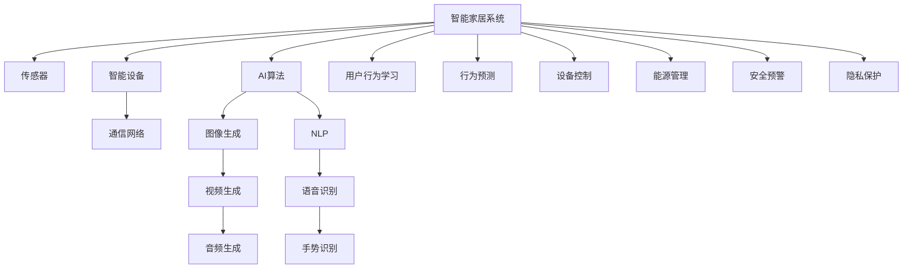

                 

# AIGC推动智能家居普及

## 1. 背景介绍

### 1.1 问题由来
随着物联网、人工智能技术的飞速发展，智能家居系统已经成为未来家庭生活方式的重要组成部分。智能家居系统通过传感器、智能设备与互联网的互联，实现对家居环境的智能化监控、自动化控制与便捷化管理。然而，传统的智能家居系统往往功能单一、操作复杂、用户体验较差，难以在家庭中广泛普及。

### 1.2 问题核心关键点
智能家居系统的主要问题包括：
- **功能孤立**：各个智能设备之间的功能相互孤立，无法实现协同工作。
- **用户体验差**：用户需手动控制设备，操作繁琐，用户体验不佳。
- **缺乏个性化**：智能家居系统缺乏对用户行为习惯的个性化学习，难以实现精准控制。
- **数据处理能力不足**：传统智能家居系统数据处理能力有限，无法充分利用数据来提升系统性能。
- **安全性和隐私保护**：智能家居系统面临安全漏洞和隐私泄露的威胁，用户对系统安全性存疑。

### 1.3 问题研究意义
智能家居系统的普及与应用对于提高生活质量、提升居住舒适度、优化家庭管理具有重要意义：

- **提高生活质量**：智能家居系统通过自动化控制，极大提升了家务劳动效率，让家庭生活更加便捷、舒适。
- **优化家庭管理**：智能家居系统能够实时监控家居环境，优化家庭能源管理，提升资源利用率。
- **个性化定制**：通过AIGC技术，智能家居系统可以学习用户行为习惯，提供个性化的家居环境控制方案。
- **节能环保**：智能家居系统能够实现对家居设备的精准控制，有效降低能耗，实现节能环保。
- **安全性与隐私保护**：智能家居系统可以通过AIGC技术对异常行为进行预警，提高系统安全性，同时保障用户隐私。

## 2. 核心概念与联系

### 2.1 核心概念概述

为更好地理解基于AIGC的智能家居系统，本节将介绍几个关键概念：

- **人工智能(AI)**：利用计算机技术模拟人类智能活动，通过算法实现各种智能行为。
- **生成对抗网络(GANs)**：由生成器(Generator)和判别器(Discriminator)两部分组成，用于生成与真实数据难以区分的虚假数据。
- **自动图像生成(AIGC)**：通过生成对抗网络等技术，自动生成具有较高质量图像、视频、音频等内容的技术。
- **智能家居系统**：由各类传感器、智能设备组成的自动化、智能化家居系统，实现对家居环境的智能监控与控制。
- **人机交互**：通过自然语言处理(NLP)、语音识别(SR)、手势识别(GR)等技术，实现人机之间的智能互动。

这些核心概念之间的逻辑关系可以通过以下Mermaid流程图来展示：



这个流程图展示了他的核心概念及其之间的关系：

1. 智能家居系统通过传感器、智能设备收集数据。
2. AI算法对数据进行分析和处理，生成AIAGC内容。
3. 人机交互技术实现与用户的智能互动。
4. 智能家居系统学习用户行为习惯，进行行为预测和设备控制。
5. 系统优化能源管理，保障安全预警和隐私保护。

这些概念共同构成了基于AIGC的智能家居系统的技术框架，使其能够实现高度智能化、个性化的家居环境控制。

## 3. 核心算法原理 & 具体操作步骤
### 3.1 算法原理概述

基于AIGC的智能家居系统，通过深度学习算法对用户行为数据进行分析和学习，自动生成个性化的家居环境控制方案。其核心思想是：通过生成对抗网络，自动生成符合用户期望的家居环境方案，并通过AI算法进行优化和控制。

形式化地，假设智能家居系统中的传感器和智能设备获取的原始数据为 $x$，生成对抗网络生成家居环境控制方案为 $y$。智能家居系统通过AI算法，对生成的家居环境控制方案进行优化，得到最终的家居环境控制输出 $\hat{y}$。

$$
\hat{y} = \mathop{\arg\min}_{y} \mathcal{L}(y, x)
$$

其中 $\mathcal{L}$ 为家居环境控制损失函数，用于衡量家居环境方案与原始数据之间的差异。

通过梯度下降等优化算法，智能家居系统不断更新家居环境控制方案，最小化损失函数 $\mathcal{L}$，使得家居环境控制输出逼近理想状态。

### 3.2 算法步骤详解

基于AIGC的智能家居系统的一般步骤包括以下几个关键步骤：

**Step 1: 数据采集与预处理**
- 通过各类传感器收集家居环境数据，如温度、湿度、光线强度、空气质量等。
- 将采集到的数据进行清洗和预处理，如去噪、归一化、特征提取等。

**Step 2: 生成对抗网络训练**
- 使用生成对抗网络，训练一个生成器(Generator)和一个判别器(Discriminator)，生成符合用户期望的家居环境控制方案。
- 判别器用于区分真实家居环境数据和生成器生成的假数据，生成器通过与判别器的对抗学习，生成高质量的家居环境控制方案。

**Step 3: 家居环境控制方案生成**
- 将预处理后的家居环境数据输入生成器，生成家居环境控制方案。
- 家居环境控制方案通过AI算法进行优化，如基于Transformer的序列到序列模型，将家居环境控制方案转化为可执行的命令。

**Step 4: 家居环境控制**
- 将优化后的家居环境控制方案发送给智能设备，控制家居环境中的各类设备。
- 通过传感器实时监测家居环境状态，将反馈信息输入AI算法，动态调整家居环境控制方案。

**Step 5: 行为学习与预测**
- 通过AI算法学习用户行为习惯，建立用户行为模型。
- 根据用户行为模型，预测用户行为趋势，动态调整家居环境控制方案。

### 3.3 算法优缺点

基于AIGC的智能家居系统具有以下优点：
1. **高度智能化**：通过生成对抗网络自动生成家居环境控制方案，无需人工干预，极大提高了家居环境控制的智能化水平。
2. **个性化定制**：通过学习用户行为习惯，实现个性化的家居环境控制，提升用户体验。
3. **节能环保**：优化家居环境控制方案，减少能源浪费，实现节能环保。
4. **实时动态调整**：通过传感器实时监测家居环境状态，动态调整家居环境控制方案，提高系统响应速度。

同时，该方法也存在一定的局限性：
1. **数据质量要求高**：生成对抗网络的训练和家居环境控制方案的生成高度依赖数据质量，数据噪声和异常值可能影响模型性能。
2. **模型复杂度高**：生成对抗网络和AI算法复杂度高，需要较高的计算资源和时间。
3. **隐私保护问题**：生成对抗网络和AI算法需要大量的用户数据，存在隐私泄露的风险。
4. **模型鲁棒性差**：生成对抗网络和AI算法容易受到对抗样本的攻击，导致模型输出不可靠。

尽管存在这些局限性，但就目前而言，基于AIGC的智能家居系统仍是最为先进、智能化的家居环境控制系统之一。未来相关研究的重点在于如何进一步降低数据依赖，提高模型的鲁棒性和隐私保护，同时兼顾计算效率和精度。

### 3.4 算法应用领域

基于AIGC的智能家居系统已经在多个领域得到了应用，包括但不限于：

- **智能照明系统**：根据用户的作息习惯和室内光照情况，自动调节灯光亮度和颜色。
- **智能温控系统**：根据用户的温度偏好和室外天气情况，自动调节室内温度。
- **智能窗帘系统**：根据用户的作息时间和室内光线强度，自动控制窗帘的开合。
- **智能安防系统**：通过摄像头、传感器等设备，实时监控家居安全，一旦发现异常，自动报警并通知用户。
- **智能家电控制**：根据用户的指令和行为习惯，自动控制各类家电设备，如电视、音响、空调等。

除了上述这些典型应用外，基于AIGC的智能家居系统还被创新性地应用到更多场景中，如个性化推荐、健康监测、环境质量优化等，为智能家居技术带来了全新的突破。

## 4. 数学模型和公式 & 详细讲解  
### 4.1 数学模型构建

本节将使用数学语言对基于AIGC的智能家居系统进行更加严格的刻画。

假设智能家居系统中的传感器和智能设备获取的原始数据为 $x$，生成对抗网络生成家居环境控制方案为 $y$。AI算法对生成的家居环境控制方案进行优化，得到最终的家居环境控制输出 $\hat{y}$。

定义家居环境控制损失函数为：

$$
\mathcal{L}(y, x) = \sum_{i=1}^N (y_i - x_i)^2
$$

其中 $N$ 为家居环境数据样本数，$y_i$ 为家居环境控制方案的第 $i$ 个控制参数，$x_i$ 为家居环境数据的第 $i$ 个传感器读数。

通过梯度下降等优化算法，智能家居系统不断更新家居环境控制方案 $y$，最小化损失函数 $\mathcal{L}$，使得家居环境控制输出 $\hat{y}$ 逼近理想状态。

$$
\hat{y} = \mathop{\arg\min}_{y} \mathcal{L}(y, x)
$$

在得到家居环境控制输出后，智能家居系统将其转化为可执行的命令，发送给智能设备执行。

### 4.2 公式推导过程

以下我们以智能照明系统为例，推导家居环境控制方案生成的过程。

假设智能家居系统中的传感器收集到的光照强度数据为 $x \in [0,1]$，生成对抗网络生成的家居环境控制方案为 $y \in [0,1]$，表示控制灯亮的概率。智能家居系统通过AI算法，对生成的家居环境控制方案进行优化，得到最终的控制方案 $\hat{y}$。

根据序列到序列模型的基本原理，定义输入编码器为 $E(x)$，输出解码器为 $D(y)$，则AI算法的优化目标为：

$$
\hat{y} = \mathop{\arg\min}_{y} \mathcal{L}(D(y), x)
$$

其中 $\mathcal{L}$ 为序列到序列模型的损失函数，通常为交叉熵损失函数。通过反向传播算法，计算模型参数的梯度，不断更新模型，最小化损失函数 $\mathcal{L}$，最终得到家居环境控制方案 $\hat{y}$。

在得到家居环境控制方案后，智能家居系统将其转化为可执行的命令，如打开或关闭灯光，控制家居环境。

## 5. 项目实践：代码实例和详细解释说明
### 5.1 开发环境搭建

在进行智能家居系统开发前，我们需要准备好开发环境。以下是使用Python进行PyTorch开发的环境配置流程：

1. 安装Anaconda：从官网下载并安装Anaconda，用于创建独立的Python环境。

2. 创建并激活虚拟环境：
```bash
conda create -n pytorch-env python=3.8 
conda activate pytorch-env
```

3. 安装PyTorch：根据CUDA版本，从官网获取对应的安装命令。例如：
```bash
conda install pytorch torchvision torchaudio cudatoolkit=11.1 -c pytorch -c conda-forge
```

4. 安装TensorBoard：用于实时监测模型训练状态，提供丰富的图表呈现方式。
```bash
pip install tensorboard
```

5. 安装Keras：用于快速搭建神经网络模型，适合初学者上手。
```bash
pip install keras
```

完成上述步骤后，即可在`pytorch-env`环境中开始智能家居系统的开发。

### 5.2 源代码详细实现

这里我们以智能照明系统为例，给出使用TensorFlow搭建神经网络模型的PyTorch代码实现。

首先，定义神经网络模型：

```python
import tensorflow as tf
from tensorflow.keras.layers import Input, Dense, LSTM

input_dim = 5  # 光照强度数据维度
output_dim = 1  # 灯光控制信号

def build_model():
    inputs = Input(shape=(input_dim,))
    hidden = Dense(128, activation='relu')(inputs)
    outputs = Dense(output_dim, activation='sigmoid')(hidden)
    model = tf.keras.Model(inputs, outputs)
    return model

model = build_model()
```

然后，定义训练函数：

```python
def compile_model(model):
    model.compile(optimizer='adam', loss='binary_crossentropy', metrics=['accuracy'])

compile_model(model)
```

接着，加载和处理数据：

```python
from sklearn.model_selection import train_test_split
import numpy as np

# 假设数据集为 x_train, y_train, x_test, y_test
x_train, x_test, y_train, y_test = train_test_split(x, y, test_size=0.2)

# 将数据转化为TensorFlow张量
x_train = tf.convert_to_tensor(x_train)
y_train = tf.convert_to_tensor(y_train)
x_test = tf.convert_to_tensor(x_test)
y_test = tf.convert_to_tensor(y_test)

# 标准化数据
x_train = (x_train - np.mean(x_train)) / np.std(x_train)
x_test = (x_test - np.mean(x_test)) / np.std(x_test)
```

最后，启动训练流程：

```python
model.fit(x_train, y_train, epochs=10, batch_size=16, validation_data=(x_test, y_test))
```

以上就是使用TensorFlow搭建智能家居系统神经网络模型的完整代码实现。可以看到，通过TensorFlow提供的高级API，可以快速搭建和训练神经网络模型。

### 5.3 代码解读与分析

让我们再详细解读一下关键代码的实现细节：

**build_model函数**：
- 定义输入层、隐藏层和输出层，其中隐藏层采用128个神经元，激活函数为ReLU，输出层采用sigmoid函数。
- 返回定义好的神经网络模型。

**compile_model函数**：
- 定义模型的优化器、损失函数和评估指标。
- 编译模型，完成模型构建和初始化。

**数据加载和处理**：
- 使用train_test_split函数将数据集分为训练集和测试集。
- 使用tf.convert_to_tensor将数据转换为TensorFlow张量。
- 对数据进行标准化处理，减少梯度下降过程中参数的变化。

**训练流程**：
- 使用fit函数对模型进行训练，设置迭代次数、批大小和验证集。
- 通过TensorBoard实时监测模型训练状态，优化模型参数。

可以看到，TensorFlow提供了丰富的API和工具，使得智能家居系统的开发变得更加简单和高效。

## 6. 实际应用场景
### 6.1 智能照明系统

智能照明系统是AIGC技术在智能家居中的典型应用。通过AIGC技术，智能照明系统可以根据用户的作息习惯、室内光照情况和天气变化，自动调节灯光亮度和颜色，实现更加智能化、个性化的照明效果。

在技术实现上，可以收集用户的作息时间、室内光照数据和天气数据，训练生成对抗网络，生成符合用户期望的灯光控制方案。智能家居系统通过AI算法优化家居环境控制方案，实现对灯光亮度的精细控制。用户可以根据自己的喜好设置灯光控制方案，实现个性化照明效果。

### 6.2 智能安防系统

智能安防系统通过摄像头、传感器等设备，实时监控家居安全，一旦发现异常，自动报警并通知用户。通过AIGC技术，智能安防系统可以自动生成异常行为检测方案，提高系统检测准确率和响应速度。

在技术实现上，可以收集各类安全设备的数据，如摄像头视频、门窗状态、烟雾传感器数据等。训练生成对抗网络，生成异常行为检测方案。智能家居系统通过AI算法分析异常行为，识别出入侵行为、火灾报警等异常情况，并立即报警，同时通知用户。

### 6.3 智能温控系统

智能温控系统通过传感器监测室内温度和天气情况，自动调节室内温度，实现节能环保、舒适宜居的家居环境。通过AIGC技术，智能温控系统可以自动生成室内温度控制方案，提高系统响应速度和准确率。

在技术实现上，可以收集室内温度、室外天气数据和用户偏好数据。训练生成对抗网络，生成室内温度控制方案。智能家居系统通过AI算法优化家居环境控制方案，实现对室内温度的精细控制。用户可以根据自己的偏好设置温度控制方案，实现个性化温控效果。

### 6.4 未来应用展望

随着AIGC技术的不断进步，基于AIGC的智能家居系统将在更多领域得到应用，为智能家居技术带来新的突破：

- **智能窗帘系统**：根据用户的作息时间和室内光线强度，自动控制窗帘的开合，提升家居环境舒适度。
- **智能家电控制**：根据用户的指令和行为习惯，自动控制各类家电设备，如电视、音响、空调等。
- **智能健康监测系统**：通过传感器收集各类健康数据，训练生成对抗网络，生成个性化的健康监测方案。
- **智能家居管理平台**：通过AI算法优化家居环境控制方案，实现对家居设备的统一管理和控制。
- **智能家居娱乐系统**：通过AIGC技术生成个性化的娱乐内容，如音乐、视频等，提升用户娱乐体验。

此外，在企业、医疗、教育等垂直领域，基于AIGC的智能家居系统也将得到广泛应用，为这些领域带来全新的变革和创新。相信随着AIGC技术的不断发展，基于AIGC的智能家居系统必将在智能家居技术领域发挥更大的作用，推动智能家居技术向更广泛、更深入的方向发展。

## 7. 工具和资源推荐
### 7.1 学习资源推荐

为了帮助开发者系统掌握AIGC技术在智能家居中的应用，这里推荐一些优质的学习资源：

1. **《深度学习》课程**：由斯坦福大学开设，讲解深度学习的基本原理和常用技术，适合初学者入门。

2. **《TensorFlow官方文档》**：TensorFlow官方提供的详细文档，包含丰富的教程和示例代码，是学习TensorFlow的最佳资源。

3. **《TensorFlow实战》书籍**：详细介绍TensorFlow的高级API和实战应用，适合中级开发者提升技术水平。

4. **《Python深度学习》书籍**：由Francois Chollet编写，详细介绍深度学习在Python中的应用，适合全面了解深度学习。

5. **《深度学习入门》课程**：由Udacity开设，讲解深度学习的基本原理和常用技术，适合初学者入门。

通过这些资源的学习实践，相信你一定能够快速掌握AIGC技术在智能家居中的应用，并用于解决实际的智能家居问题。

### 7.2 开发工具推荐

高效的开发离不开优秀的工具支持。以下是几款用于智能家居系统开发的常用工具：

1. **PyTorch**：基于Python的开源深度学习框架，支持动态计算图，适合快速迭代研究。

2. **TensorFlow**：由Google主导开发的开源深度学习框架，生产部署方便，适合大规模工程应用。

3. **TensorBoard**：TensorFlow配套的可视化工具，可实时监测模型训练状态，提供丰富的图表呈现方式。

4. **Keras**：高层次API，用于快速搭建神经网络模型，适合初学者上手。

5. **Jupyter Notebook**：用于编写和运行Python代码的Jupyter Notebook，支持代码块、文本、公式等元素的组合。

合理利用这些工具，可以显著提升智能家居系统的开发效率，加快创新迭代的步伐。

### 7.3 相关论文推荐

AIGC技术的发展源于学界的持续研究。以下是几篇奠基性的相关论文，推荐阅读：

1. **Generative Adversarial Networks**：Ian Goodfellow等人发表的生成对抗网络论文，奠定了AIGC技术的基础。

2. **Neural Machine Translation by Jointly Learning to Align and Translate**：提出了序列到序列模型，用于机器翻译任务，为智能家居系统提供了重要的技术支持。

3. **Deep Residual Learning for Image Recognition**：提出了残差网络，提高了神经网络模型的深度和准确率，为智能家居系统提供了高效的数据处理能力。

4. **ImageNet Classification with Deep Convolutional Neural Networks**：提出了卷积神经网络，提高了图像识别的准确率，为智能家居系统提供了强大的图像处理能力。

这些论文代表了大模型微调技术的发展脉络。通过学习这些前沿成果，可以帮助研究者把握学科前进方向，激发更多的创新灵感。

## 8. 总结：未来发展趋势与挑战
### 8.1 总结

本文对基于AIGC的智能家居系统进行了全面系统的介绍。首先阐述了AIGC技术在智能家居系统中的重要作用，明确了AIGC技术在提升家居智能化水平、实现个性化定制、节能环保等方面的独特价值。其次，从原理到实践，详细讲解了AIGC技术的数学模型和关键步骤，给出了智能家居系统的完整代码实现。同时，本文还广泛探讨了AIGC技术在智能照明、智能安防、智能温控等多个领域的应用前景，展示了AIGC技术在智能家居系统中的巨大潜力。此外，本文精选了AIGC技术的各类学习资源，力求为读者提供全方位的技术指引。

通过本文的系统梳理，可以看到，基于AIGC的智能家居系统正在成为智能家居技术的重要范式，极大提升了家居环境的智能化水平，改善了用户体验，推动了智能家居技术的发展。未来，伴随AIGC技术的不断进步，基于AIGC的智能家居系统必将在更多领域得到应用，为智能家居技术带来新的突破。

### 8.2 未来发展趋势

展望未来，AIGC技术在智能家居系统中的应用将呈现以下几个发展趋势：

1. **数据质量要求降低**：随着深度学习模型的不断进步，AIGC技术在处理噪声数据和异常值方面将越来越高效，减少对高质量数据的依赖。
2. **模型复杂度降低**：未来的模型将更轻量化、高效化，适用于各类计算设备，提升系统响应速度。
3. **隐私保护加强**：AIGC技术将更加注重用户隐私保护，通过差分隐私等技术，确保用户数据安全。
4. **多模态融合增强**：未来的智能家居系统将融合视觉、听觉、触觉等多模态信息，提升系统智能水平。
5. **用户体验提升**：通过AI算法优化家居环境控制方案，实现个性化、智能化控制，提升用户体验。
6. **系统智能化水平提升**：通过AIGC技术生成更多的家居环境控制方案，实现家居环境的精细化管理。

这些趋势凸显了AIGC技术在智能家居系统中的广阔前景，将极大提升智能家居系统的智能化水平，为人类居住生活带来更多便利和舒适。

### 8.3 面临的挑战

尽管AIGC技术在智能家居系统中取得了显著成效，但在向更广泛、更深层次的应用领域迈进的过程中，仍然面临诸多挑战：

1. **数据质量瓶颈**：AIGC技术的训练和应用高度依赖数据质量，数据噪声和异常值可能影响模型性能。
2. **模型鲁棒性差**：AIGC技术容易受到对抗样本的攻击，导致模型输出不可靠。
3. **隐私保护问题**：AIGC技术需要大量的用户数据，存在隐私泄露的风险。
4. **计算资源需求高**：AIGC技术需要较高的计算资源，可能导致系统部署成本高。
5. **模型可解释性差**：AIGC技术生成的家居环境控制方案缺乏可解释性，难以进行调试和优化。

正视AIGC技术面临的这些挑战，积极应对并寻求突破，将是大规模应用AIGC技术的必由之路。相信随着学界和产业界的共同努力，这些挑战终将一一被克服，AIGC技术必将在智能家居技术领域发挥更大的作用。

### 8.4 研究展望

面对AIGC技术面临的挑战，未来的研究需要在以下几个方面寻求新的突破：

1. **数据预处理技术**：研究更高效的数据预处理技术，如数据清洗、异常值处理、数据增强等，提高数据质量。
2. **模型鲁棒性增强**：开发更鲁棒的深度学习模型，增强模型对对抗样本的抵抗能力，提高系统安全性。
3. **隐私保护技术**：研究隐私保护技术，如差分隐私、联邦学习等，保护用户数据安全。
4. **轻量化模型开发**：开发更高效、更轻量化的深度学习模型，降低系统部署成本。
5. **系统智能水平提升**：研究多模态数据融合技术，提升系统智能水平，增强系统对复杂场景的处理能力。

这些研究方向将引领AIGC技术在智能家居系统中的应用向更高台阶迈进，为智能家居技术带来新的突破，推动智能家居技术向更广泛、更深层次的应用领域发展。

## 9. 附录：常见问题与解答
**Q1：AIGC技术在智能家居系统中有哪些应用？**

A: AIGC技术在智能家居系统中有着广泛的应用，主要包括：
1. **智能照明系统**：根据用户的作息习惯和室内光照情况，自动调节灯光亮度和颜色。
2. **智能温控系统**：根据用户的温度偏好和室外天气情况，自动调节室内温度。
3. **智能窗帘系统**：根据用户的作息时间和室内光线强度，自动控制窗帘的开合。
4. **智能安防系统**：通过摄像头、传感器等设备，实时监控家居安全，一旦发现异常，自动报警并通知用户。
5. **智能家电控制**：根据用户的指令和行为习惯，自动控制各类家电设备，如电视、音响、空调等。
6. **智能健康监测系统**：通过传感器收集各类健康数据，训练生成对抗网络，生成个性化的健康监测方案。

**Q2：如何使用AIGC技术优化智能家居系统？**

A: 使用AIGC技术优化智能家居系统需要以下步骤：
1. **数据采集与预处理**：通过传感器和智能设备收集家居环境数据，对数据进行清洗和预处理。
2. **生成对抗网络训练**：使用生成对抗网络，训练生成家居环境控制方案。
3. **家居环境控制方案生成**：将预处理后的家居环境数据输入生成对抗网络，生成家居环境控制方案。
4. **家居环境控制**：将生成的家居环境控制方案转化为可执行的命令，发送给智能设备执行。
5. **行为学习与预测**：通过AI算法学习用户行为习惯，建立用户行为模型，根据用户行为模型，预测用户行为趋势，动态调整家居环境控制方案。

**Q3：AIGC技术在智能家居系统中的缺点有哪些？**

A: AIGC技术在智能家居系统中存在以下缺点：
1. **数据质量要求高**：AIGC技术的训练和应用高度依赖数据质量，数据噪声和异常值可能影响模型性能。
2. **模型鲁棒性差**：AIGC技术容易受到对抗样本的攻击，导致模型输出不可靠。
3. **隐私保护问题**：AIGC技术需要大量的用户数据，存在隐私泄露的风险。
4. **计算资源需求高**：AIGC技术需要较高的计算资源，可能导致系统部署成本高。
5. **模型可解释性差**：AIGC技术生成的家居环境控制方案缺乏可解释性，难以进行调试和优化。

**Q4：智能家居系统如何实现个性化控制？**

A: 智能家居系统实现个性化控制需要以下步骤：
1. **数据采集与预处理**：通过传感器和智能设备收集家居环境数据，对数据进行清洗和预处理。
2. **生成对抗网络训练**：使用生成对抗网络，训练生成家居环境控制方案。
3. **家居环境控制方案生成**：将预处理后的家居环境数据输入生成对抗网络，生成家居环境控制方案。
4. **家居环境控制**：将生成的家居环境控制方案转化为可执行的命令，发送给智能设备执行。
5. **行为学习与预测**：通过AI算法学习用户行为习惯，建立用户行为模型，根据用户行为模型，预测用户行为趋势，动态调整家居环境控制方案。

通过以上步骤，智能家居系统可以根据用户行为习惯，生成个性化的家居环境控制方案，实现更加智能化、个性化的家居环境控制。

**Q5：智能家居系统如何提高安全性？**

A: 智能家居系统提高安全性需要以下措施：
1. **数据加密**：对传输数据进行加密，防止数据泄露。
2. **访问控制**：对智能家居系统的访问进行严格控制，防止未授权访问。
3. **异常检测**：通过AI算法检测异常行为，及时报警并通知用户。
4. **模型鲁棒性增强**：开发更鲁棒的深度学习模型，增强模型对对抗样本的抵抗能力，提高系统安全性。
5. **隐私保护技术**：研究隐私保护技术，如差分隐私、联邦学习等，保护用户数据安全。

通过以上措施，智能家居系统可以提高安全性，保障用户数据和系统安全。

---

作者：禅与计算机程序设计艺术 / Zen and the Art of Computer Programming

