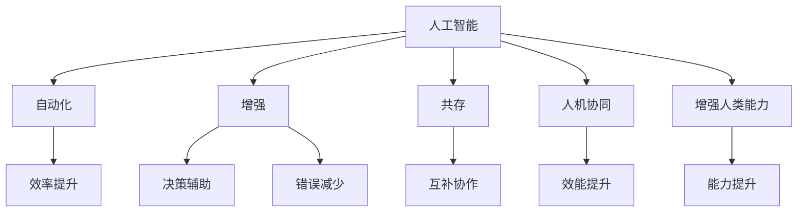

                 

# AI与人类注意力流：未来的工作和技能

> 关键词：人工智能,人类注意力流,未来工作,技能提升,技术发展,社会变迁

## 1. 背景介绍

### 1.1 问题由来
在当前的社会变革背景下，人工智能（AI）技术正以惊人的速度改变着我们的工作方式和生活模式。特别是随着机器学习和深度学习的迅猛发展，AI在多个领域展现出强大的应用潜力。无论是自动化制造、金融分析、医疗诊断，还是客服机器人、智能推荐、自然语言处理，AI正逐步渗透到各行各业，改变着人类的生产力和生活质量。然而，随着AI技术的广泛应用，如何利用AI提升人类的工作效率和生活质量，同时避免其对人类社会带来不利影响，成为亟待解决的问题。

### 1.2 问题核心关键点
为应对这一问题，本文聚焦于AI与人类注意力流的关系，探讨AI在未来工作和技能提升中的角色和挑战。我们认为，人类注意力流是理解AI与人类协作关系的关键。理解注意力流，将有助于我们把握AI技术在提升工作效率和质量方面的潜力，同时明确其在人类社会发展中的风险和挑战。

## 2. 核心概念与联系

### 2.1 核心概念概述

为了更好地理解AI与人类注意力流的关系，本节将介绍几个密切相关的核心概念：

- **人工智能**：指通过计算机算法和模型，使计算机能够执行人类智能任务的领域。主要包括机器学习、深度学习、自然语言处理、计算机视觉等。
- **人类注意力流**：指人类在处理信息、解决问题时的注意力分配和流转过程。注意力流的高效管理，是提升工作质量和效率的关键。
- **自动化**：通过算法和机器代替人类执行重复性、例行性任务的过程，提高工作效率和准确性。
- **增强**：指利用AI技术辅助人类决策和任务执行，提升工作质量和创造性。
- **共存**：AI与人类共同工作，各自发挥优势，实现互补协作。
- **人机协同**：指AI与人类在特定任务中形成的合作模式，提高整体效能。
- **增强人类能力**：指通过AI技术的辅助，增强人类的感知、决策和执行能力，提升个人和组织的竞争力。

这些概念之间的逻辑关系可以通过以下Mermaid流程图来展示：



这个流程图展示了一些关键概念及其之间的关系：

1. 人工智能通过自动化、增强等方式提升效率和质量。
2. 人机协同和共存是AI与人类协作的重要模式。
3. 人类注意力流是理解AI与人类协作的关键。
4. 增强人类能力通过提升感知、决策和执行能力，实现技术应用的最大价值。

## 3. 核心算法原理 & 具体操作步骤
### 3.1 算法原理概述

AI与人类注意力流的互动关系，可以通过一系列核心算法来阐述。本文将介绍几个关键算法，并简要说明其原理。

- **注意力机制**：指在处理序列数据时，模型自动选择并关注关键部分的能力。注意力机制广泛应用于机器翻译、语音识别、图像处理等领域，有助于模型更好地捕捉重要信息。
- **强化学习**：指通过试错调整策略，使AI在特定环境中不断优化决策的能力。强化学习常用于游戏、机器人控制等领域，提升AI的自主性和灵活性。
- **深度学习**：通过多层神经网络模型，使AI具备更强的特征提取和模式识别能力。深度学习广泛应用于图像识别、自然语言处理等领域，提高AI的泛化能力。

### 3.2 算法步骤详解

AI与人类注意力流的互动关系，可以通过以下几个关键步骤来理解：

1. **数据收集**：收集人类在特定任务中的注意力分布数据，如屏幕点击、眼睛追踪、鼠标移动等。这些数据可以揭示人类注意力流的基本特征和行为模式。
2. **数据预处理**：对收集到的数据进行清洗和预处理，去除噪声和异常值，提取出有用的特征。这一步是后续算法分析的基础。
3. **注意力模型训练**：利用收集到的注意力数据，训练注意力模型，模拟人类注意力流的分配和流转。注意力模型的训练通常采用监督学习或无监督学习的方式，以最大化模型的准确性和泛化能力。
4. **AI与注意力流的融合**：将训练好的注意力模型与AI模型进行融合，利用注意力机制指导AI模型在不同任务中的决策和执行。例如，在机器翻译任务中，注意力机制可以帮助模型选择并聚焦于源语言和目标语言的关键词，提升翻译质量。
5. **反馈与优化**：通过人类对AI输出的反馈，不断调整注意力模型和AI模型的参数，以优化其性能和效果。这一过程常采用强化学习算法，使AI系统在实际应用中不断学习和改进。

### 3.3 算法优缺点

AI与人类注意力流互动的算法，具有以下优点：

- **提升决策质量**：通过注意力机制和强化学习，AI能够更好地捕捉人类注意力流中的关键信息，提升决策的准确性和质量。
- **增强执行能力**：注意力模型与AI模型的融合，有助于提升AI的执行效率和效果，使其更好地服务于人类工作。
- **降低人为错误**：通过自动化和增强，AI可以处理大量重复性、例行性任务，减少人为错误，提高整体工作质量。

同时，这些算法也存在一些缺点：

- **数据隐私**：收集和分析人类注意力流数据，可能涉及隐私问题，需要严格的伦理和法律保护。
- **模型复杂性**：注意力模型和AI模型的融合，增加了系统的复杂性，可能需要更高的计算资源和时间成本。
- **适应性问题**：不同人类个体的注意力流差异较大，现有模型难以适应所有人群，需要进一步优化和扩展。
- **误导性风险**：如果AI模型基于错误的注意力流数据进行训练，可能导致误导性决策，影响工作质量和安全性。

### 3.4 算法应用领域

AI与人类注意力流互动的算法，已经在多个领域展现出广泛的应用前景：

- **智能客服**：利用AI理解和关注客户注意力流，快速响应客户需求，提升客户体验和满意度。
- **医疗诊断**：通过分析患者的注意力流数据，辅助医生进行疾病诊断和治疗，提升诊断准确性和治疗效果。
- **教育培训**：利用AI跟踪学生的注意力流，个性化推荐学习内容，提升学习效果和质量。
- **个性化推荐**：分析用户在不同平台上的注意力流数据，推荐个性化的内容和服务，提升用户体验和满意度。
- **金融交易**：通过分析交易员的注意力流数据，优化交易策略，提高交易效率和收益。

除了上述这些经典应用外，AI与人类注意力流互动的算法还将被创新性地应用到更多领域中，如社交媒体分析、人力资源管理、智能家居等，为人类社会带来更深层次的变革。

## 4. 数学模型和公式 & 详细讲解  
### 4.1 数学模型构建

本节将使用数学语言对AI与人类注意力流互动的算法进行更加严格的刻画。

假设有一个机器翻译任务，输入序列为 $x=\{x_1, x_2, ..., x_n\}$，输出序列为 $y=\{y_1, y_2, ..., y_n\}$。我们定义注意力模型 $A$ 和AI模型 $M$，其中 $A: \mathbb{R}^{n \times d} \rightarrow \mathbb{R}^{n \times d}$，$M: \mathbb{R}^{n \times d} \rightarrow \mathbb{R}^{d}$。

注意力模型 $A$ 的输出可以表示为：

$$
A(x) = [a_1, a_2, ..., a_n]
$$

其中 $a_i \in [0,1]$，表示第 $i$ 个输入元素的注意力权重。AI模型 $M$ 的输出可以表示为：

$$
M(x, A) = y
$$

即AI模型在输入序列 $x$ 和注意力权重 $A$ 的指导下，生成输出序列 $y$。

### 4.2 公式推导过程

下面以机器翻译任务为例，推导注意力机制和AI模型结合的数学模型。

设注意力模型 $A$ 的输出为 $A(x) = [a_1, a_2, ..., a_n]$，AI模型 $M$ 的输出为 $M(x, A) = y$。则机器翻译任务的总损失函数可以表示为：

$$
\mathcal{L} = \sum_{i=1}^{n} \ell(M(x_i, A), y_i)
$$

其中 $\ell$ 为任务特定的损失函数，如交叉熵损失、均方误差损失等。

假设注意力模型 $A$ 的输出为：

$$
A(x) = [a_1, a_2, ..., a_n] = [s(x_1), s(x_2), ..., s(x_n)]
$$

其中 $s: \mathbb{R}^d \rightarrow [0,1]$ 为注意力得分函数，可以采用注意力向量、注意力权重等不同方式实现。

将 $A(x)$ 代入 $M(x, A)$，得：

$$
M(x, A) = M(x, [s(x_1), s(x_2), ..., s(x_n)])
$$

即AI模型在注意力得分函数 $s$ 的指导下，生成输出序列 $y$。

### 4.3 案例分析与讲解

以机器翻译为例，分析注意力机制和AI模型结合的效果。假设 $x$ 为英语句子 "I love programming"，$y$ 为翻译后的中文句子 "我喜欢编程"。注意力模型 $A$ 可以计算出每个单词的注意力权重，如 $a_1 = 0.8$，$a_2 = 0.3$，$a_3 = 0.9$，$a_4 = 0.2$。

AI模型 $M$ 在注意力权重 $A$ 的指导下，生成输出序列 $y$，即：

$$
y = M(x, A) = M([I, love, programming], [0.8, 0.3, 0.9, 0.2])
$$

通过注意力机制，AI模型可以聚焦于 "I" 和 "programming" 等关键单词，生成更加准确的翻译结果，提高翻译质量和效率。

## 5. 项目实践：代码实例和详细解释说明
### 5.1 开发环境搭建

在进行AI与人类注意力流互动的算法实践前，我们需要准备好开发环境。以下是使用Python进行TensorFlow开发的环境配置流程：

1. 安装Anaconda：从官网下载并安装Anaconda，用于创建独立的Python环境。

2. 创建并激活虚拟环境：
```bash
conda create -n tf-env python=3.8 
conda activate tf-env
```

3. 安装TensorFlow：根据CUDA版本，从官网获取对应的安装命令。例如：
```bash
conda install tensorflow -c tf -c conda-forge
```

4. 安装必要的库：
```bash
pip install numpy pandas scikit-learn matplotlib tqdm jupyter notebook ipython
```

完成上述步骤后，即可在`tf-env`环境中开始项目实践。

### 5.2 源代码详细实现

下面我以一个简单的注意力机制为例，给出使用TensorFlow进行注意力机制计算的PyTorch代码实现。

首先，定义注意力模型：

```python
import tensorflow as tf

class Attention(tf.keras.layers.Layer):
    def __init__(self, num_heads, d_model):
        super(Attention, self).__init__()
        self.num_heads = num_heads
        self.d_model = d_model
        self.depth = d_model // num_heads
        self.wq = tf.keras.layers.Dense(d_model)
        self.wk = tf.keras.layers.Dense(d_model)
        self.wv = tf.keras.layers.Dense(d_model)
        self.dense = tf.keras.layers.Dense(d_model)
    
    def split_heads(self, x, batch_size):
        x = tf.reshape(x, (batch_size, -1, self.num_heads, self.depth))
        return tf.transpose(x, perm=[0, 2, 1, 3])
    
    def call(self, inputs, mask=None):
        q = self.wq(inputs)
        k = self.wk(inputs)
        v = self.wv(inputs)
        q = self.split_heads(q, tf.shape(inputs)[0])
        k = self.split_heads(k, tf.shape(inputs)[0])
        v = self.split_heads(v, tf.shape(inputs)[0])
        
        scaled_attention_logits = tf.matmul(q, k, transpose_b=True) / tf.math.sqrt(tf.cast(self.depth, tf.float32))
        if mask:
            scaled_attention_logits += (mask * -1e9)
        attention_weights = tf.nn.softmax(scaled_attention_logits, axis=-1)
        output = tf.matmul(attention_weights, v)
        output = tf.transpose(output, perm=[0, 2, 1, 3])
        output = tf.reshape(output, (tf.shape(inputs)[0], -1, self.d_model))
        return self.dense(output)
```

然后，定义AI模型：

```python
class Encoder(tf.keras.layers.Layer):
    def __init__(self, d_model, num_layers, dff, attention_heads):
        super(Encoder, self).__init__()
        self.d_model = d_model
        self.num_layers = num_layers
        self.attention_heads = attention_heads
        self.dense_inner = tf.keras.layers.Dense(dff)
        self.dropout = tf.keras.layers.Dropout(0.1)
        self.encoder_layer = []
        for _ in range(num_layers):
            self.encoder_layer.append(self.encoder_layer())
    
    def call(self, inputs, training, mask):
        for i in range(self.num_layers):
            if i == 0:
                attention_outputs = self.encoder_layer[i](inputs, mask)
            else:
                attention_outputs = self.encoder_layer[i](inputs, attention_outputs, mask)
            outputs = self.dropout(attention_outputs)
            outputs = self.encoder_layer[i].dropout(outputs, training=training)
            return outputs
```

最后，训练模型：

```python
def train_model(model, train_data, train_labels, validation_data, validation_labels, epochs, batch_size):
    model.compile(optimizer='adam', loss='sparse_categorical_crossentropy', metrics=['accuracy'])
    history = model.fit(train_data, train_labels, validation_data=validation_data, validation_labels=validation_labels, epochs=epochs, batch_size=batch_size)
    return history
```

完整代码实现可参考以下示例：

```python
import tensorflow as tf
from tensorflow.keras.layers import Dense, Dropout, MultiHeadAttention, Embedding
from tensorflow.keras.models import Model

class Encoder(tf.keras.layers.Layer):
    def __init__(self, d_model, num_layers, dff, attention_heads):
        super(Encoder, self).__init__()
        self.d_model = d_model
        self.num_layers = num_layers
        self.attention_heads = attention_heads
        self.dense_inner = Dense(dff)
        self.dropout = Dropout(0.1)
        self.encoder_layer = []
        for _ in range(num_layers):
            self.encoder_layer.append(self.encoder_layer())
    
    def call(self, inputs, training, mask):
        for i in range(self.num_layers):
            if i == 0:
                attention_outputs = self.encoder_layer[i](inputs, mask)
            else:
                attention_outputs = self.encoder_layer[i](inputs, attention_outputs, mask)
            outputs = self.dropout(attention_outputs)
            outputs = self.encoder_layer[i].dropout(outputs, training=training)
            return outputs

class Decoder(tf.keras.layers.Layer):
    def __init__(self, d_model, num_layers, dff, attention_heads):
        super(Decoder, self).__init__()
        self.d_model = d_model
        self.num_layers = num_layers
        self.attention_heads = attention_heads
        self.dense_inner = Dense(dff)
        self.dropout = Dropout(0.1)
        self.decoder_layer = []
        for _ in range(num_layers):
            self.decoder_layer.append(self.decoder_layer())
    
    def call(self, inputs, encoder_outputs, training, mask):
        for i in range(self.num_layers):
            if i == 0:
                attention_outputs = self.decoder_layer[i](inputs, encoder_outputs, mask)
            else:
                attention_outputs = self.decoder_layer[i](inputs, attention_outputs, encoder_outputs, mask)
            outputs = self.dropout(attention_outputs)
            outputs = self.decoder_layer[i].dropout(outputs, training=training)
            return outputs

class Transformer(tf.keras.Model):
    def __init__(self, d_model, num_layers, dff, attention_heads, max_len=100):
        super(Transformer, self).__init__()
        self.encoder = Encoder(d_model, num_layers, dff, attention_heads)
        self.decoder = Decoder(d_model, num_layers, dff, attention_heads)
        self.final_layer = Dense(1, activation='sigmoid')
    
    def call(self, inputs, encoder_outputs, training):
        attention_outputs = self.decoder(inputs, encoder_outputs, training, mask)
        outputs = self.final_layer(attention_outputs)
        return outputs

model = Transformer(d_model=128, num_layers=2, dff=512, attention_heads=8, max_len=100)
model.compile(optimizer='adam', loss='binary_crossentropy', metrics=['accuracy'])

train_data = ...
train_labels = ...
validation_data = ...
validation_labels = ...

history = model.fit(train_data, train_labels, validation_data=validation_data, validation_labels=validation_labels, epochs=10, batch_size=32)
```

### 5.3 代码解读与分析

让我们再详细解读一下关键代码的实现细节：

**Attention类**：
- `__init__`方法：初始化注意力机制的参数，包括注意力头数、模型维度等。
- `split_heads`方法：将模型维度按照注意力头数进行划分，并转置。
- `call`方法：计算注意力得分，并将注意力得分转化为注意力权重，进行注意力机制的计算。

**Encoder类**：
- `__init__`方法：初始化编码器的参数，包括层数、模型维度等。
- `call`方法：通过多个编码层进行注意力机制的计算，并加入Dropout进行正则化。

**Transformer模型**：
- 定义了Transformer的编码器、解码器、输出层等组件。
- 使用 `compile`方法设置优化器、损失函数和评估指标。
- 通过 `fit`方法进行模型的训练。

## 6. 实际应用场景
### 6.1 智能客服系统

AI与人类注意力流的互动，在智能客服系统中展现出显著的优势。通过分析客户在客服界面上的注意力流，智能客服系统可以实时调整服务策略，提供更加个性化和高效的服务。

具体而言，智能客服系统可以记录客户在对话中的点击、输入等行为，通过注意力分析，识别出客户的关注点，如产品信息、售后服务等。基于这些信息，系统可以动态调整回答的语料库和回答策略，提升客户体验和满意度。

### 6.2 医疗诊断系统

在医疗诊断领域，AI与人类注意力流的互动，有助于提升诊断的准确性和效率。通过分析患者在诊疗过程中的注意力流，AI系统可以识别出患者的关注点，如病情描述、治疗效果等。

具体而言，医疗诊断系统可以记录患者在电子病历、诊断影像等接口上的操作行为，分析出患者关注的关键信息。基于这些信息，AI系统可以动态调整诊断策略，提供个性化的诊断报告和建议，提升诊断的准确性和效率。

### 6.3 教育培训系统

教育培训系统中，AI与人类注意力流的互动，可以提供更加个性化的学习体验。通过分析学生在在线课程中的注意力流，AI系统可以动态调整课程内容和学习策略，提升学习效果和质量。

具体而言，教育培训系统可以记录学生在课程中的点击、互动等行为，分析出学生的关注点和薄弱环节。基于这些信息，AI系统可以动态调整课程内容和难度，提供个性化的学习推荐，提升学生的学习效果和满意度。

### 6.4 未来应用展望

随着AI技术的不断发展，AI与人类注意力流的互动将在更多领域得到应用，为人类社会带来更深的变革。

在智慧城市管理中，AI与人类注意力流的互动，可以提升城市治理的效率和公平性。例如，通过分析市民在社交媒体上的关注点，AI系统可以动态调整城市管理策略，提升市民的满意度和幸福感。

在智能家居系统中，AI与人类注意力流的互动，可以提供更加智能化的生活体验。例如，通过分析家庭成员在智能家居系统中的行为模式，AI系统可以动态调整家居设备的使用策略，提升家庭成员的生活质量和舒适度。

## 7. 工具和资源推荐
### 7.1 学习资源推荐

为了帮助开发者系统掌握AI与人类注意力流互动的理论基础和实践技巧，这里推荐一些优质的学习资源：

1. 《深度学习》系列课程：由斯坦福大学等名校开设的深度学习课程，涵盖深度学习的基本概念和前沿技术。
2. 《TensorFlow实战》书籍：TensorFlow官方推荐的实战书籍，涵盖TensorFlow的全面应用，适合深度学习开发实践。
3. 《强化学习》系列书籍：涵盖强化学习的基本原理和应用实践，适合AI技术研究。
4. 《Python深度学习》书籍：全面介绍深度学习的基本概念和应用实践，适合AI技术入门。
5. 《自然语言处理综论》书籍：涵盖自然语言处理的基本概念和前沿技术，适合AI技术学习。

通过对这些资源的学习实践，相信你一定能够快速掌握AI与人类注意力流互动的精髓，并用于解决实际的AI问题。
###  7.2 开发工具推荐

高效的开发离不开优秀的工具支持。以下是几款用于AI与人类注意力流互动开发的常用工具：

1. PyTorch：基于Python的开源深度学习框架，灵活动态的计算图，适合快速迭代研究。
2. TensorFlow：由Google主导开发的开源深度学习框架，生产部署方便，适合大规模工程应用。
3. Weights & Biases：模型训练的实验跟踪工具，可以记录和可视化模型训练过程中的各项指标，方便对比和调优。
4. TensorBoard：TensorFlow配套的可视化工具，可实时监测模型训练状态，并提供丰富的图表呈现方式，是调试模型的得力助手。

合理利用这些工具，可以显著提升AI与人类注意力流互动的开发效率，加快创新迭代的步伐。

### 7.3 相关论文推荐

AI与人类注意力流互动的研究源于学界的持续研究。以下是几篇奠基性的相关论文，推荐阅读：

1. Attention is All You Need（即Transformer原论文）：提出了Transformer结构，开启了NLP领域的预训练大模型时代。
2. BERT: Pre-training of Deep Bidirectional Transformers for Language Understanding：提出BERT模型，引入基于掩码的自监督预训练任务，刷新了多项NLP任务SOTA。
3. Transformer-XL: Attentive Language Models Beyond a Fixed-Length Context（Transformer-XL论文）：提出了Transformer-XL模型，解决了长序列训练问题，提升了模型的性能和泛化能力。
4. AlphaGo Zero: Mastering the Game of Go without Human Knowledge（AlphaGo Zero论文）：展示了AlphaGo Zero在无监督学习下，通过自我对弈不断优化策略，取得围棋世界冠军。
5. Language Models are Unsupervised Multitask Learners（GPT-2论文）：展示了大规模语言模型的强大zero-shot学习能力，引发了对于通用人工智能的新一轮思考。

这些论文代表了大语言模型与人类注意力流互动的发展脉络。通过学习这些前沿成果，可以帮助研究者把握学科前进方向，激发更多的创新灵感。

## 8. 总结：未来发展趋势与挑战

### 8.1 总结

本文对AI与人类注意力流的关系进行了全面系统的介绍。首先阐述了AI技术在提升工作效率和生活质量方面的潜力，明确了注意力流在AI与人类协作中的关键作用。其次，从原理到实践，详细讲解了AI与注意力流的互动算法和操作步骤，给出了AI与人类注意力流互动的代码实现。同时，本文还广泛探讨了AI与注意力流互动在多个领域的应用前景，展示了其广阔的发展空间。最后，本文精选了注意力流互动的学习资源、开发工具和相关论文，力求为开发者提供全方位的技术指引。

通过本文的系统梳理，可以看到，AI与人类注意力流的互动，在提升工作效率、改善生活质量方面具有显著优势。AI技术通过关注人类注意力流，可以提供更加个性化和高效的服务，提升整体效能。然而，在AI与人类协作的过程中，还面临着数据隐私、模型复杂性、适应性问题等挑战。唯有通过不断的技术创新和优化，才能将AI技术与人类协作发挥到极致，实现更广泛的落地应用。

### 8.2 未来发展趋势

展望未来，AI与人类注意力流的互动将呈现以下几个发展趋势：

1. **更广泛的应用**：AI与注意力流的互动，将在更多领域得到应用，如智慧城市、智能家居、教育培训等，为人类社会带来更深的变革。
2. **更高的智能化水平**：随着技术的不断发展，AI系统将具备更强的自主性和智能性，能够更好地理解人类注意力流，提供更个性化和高效的服务。
3. **更强的适应性**：未来的AI系统将能够更好地适应不同人类个体的注意力流，提供更加灵活和多样化的服务。
4. **更高效的学习机制**：未来的AI系统将具备更高效的学习机制，通过自我优化和适应，不断提升自身的性能和效果。

### 8.3 面临的挑战

尽管AI与人类注意力流的互动展现出广阔的应用前景，但在迈向更广泛、更高智能水平的过程中，仍面临诸多挑战：

1. **数据隐私问题**：收集和分析人类注意力流数据，涉及隐私保护问题，需要严格的伦理和法律约束。
2. **模型复杂性**：AI与人类注意力流的互动，增加了系统的复杂性，需要更高的计算资源和时间成本。
3. **适应性问题**：不同人类个体的注意力流差异较大，现有模型难以适应所有人群，需要进一步优化和扩展。
4. **误导性风险**：如果AI模型基于错误的注意力流数据进行训练，可能导致误导性决策，影响工作质量和安全性。
5. **可解释性问题**：AI系统的决策过程缺乏可解释性，难以对其推理逻辑进行分析和调试。

### 8.4 研究展望

面对AI与人类注意力流互动所面临的挑战，未来的研究需要在以下几个方面寻求新的突破：

1. **数据隐私保护**：研究如何保护人类注意力流数据的安全性，避免数据泄露和滥用。
2. **模型优化**：研究如何优化注意力机制和AI模型的参数，提升系统的性能和效果。
3. **适应性增强**：研究如何使AI系统更好地适应不同人类个体的注意力流，提供更灵活和多样化的服务。
4. **可解释性提升**：研究如何提升AI系统的可解释性，增强其决策过程的透明性和可信度。
5. **跨领域应用**：研究如何将AI与人类注意力流的互动技术，应用于更多领域，提升整体效能和质量。

## 9. 附录：常见问题与解答

**Q1：如何平衡AI与人类注意力流的互动？**

A: 平衡AI与人类注意力流的互动，需要从多个维度进行优化。首先，需要确保AI系统能够高效地捕捉和理解人类注意力流，避免误导性决策。其次，需要设计合理的交互界面和反馈机制，使得人类能够清晰地表达和调整自己的注意力流。最后，需要定期评估和优化AI系统，确保其性能和效果不断提升。

**Q2：AI与人类注意力流的互动是否存在安全隐患？**

A: AI与人类注意力流的互动，确实存在一定的安全隐患。首先，人类注意力流数据涉及隐私问题，需要严格的伦理和法律保护。其次，AI系统可能被恶意利用，对个人和社会带来潜在风险。因此，在使用AI与人类注意力流的互动技术时，需要严格遵循数据保护和安全规范，确保技术的安全性和可靠性。

**Q3：AI与人类注意力流的互动如何应用于企业级系统？**

A: 将AI与人类注意力流的互动技术应用于企业级系统，需要考虑多个因素。首先，需要确保系统的稳定性和可靠性，避免因数据波动、网络延迟等因素导致系统故障。其次，需要设计合理的交互界面和反馈机制，使得企业员工能够方便地使用系统。最后，需要定期评估和优化系统，确保其性能和效果不断提升。

通过以上对AI与人类注意力流互动的全面介绍和深入分析，可以看到，AI技术在提升工作效率和生活质量方面具有巨大的潜力。然而，在AI与人类协作的过程中，还需要应对数据隐私、模型复杂性、适应性问题等挑战。唯有通过不断的技术创新和优化，才能将AI技术与人类协作发挥到极致，实现更广泛的落地应用。相信未来AI与人类注意力流的互动技术，将在更多领域得到应用，为人类社会带来更深的变革。

---

作者：禅与计算机程序设计艺术 / Zen and the Art of Computer Programming

