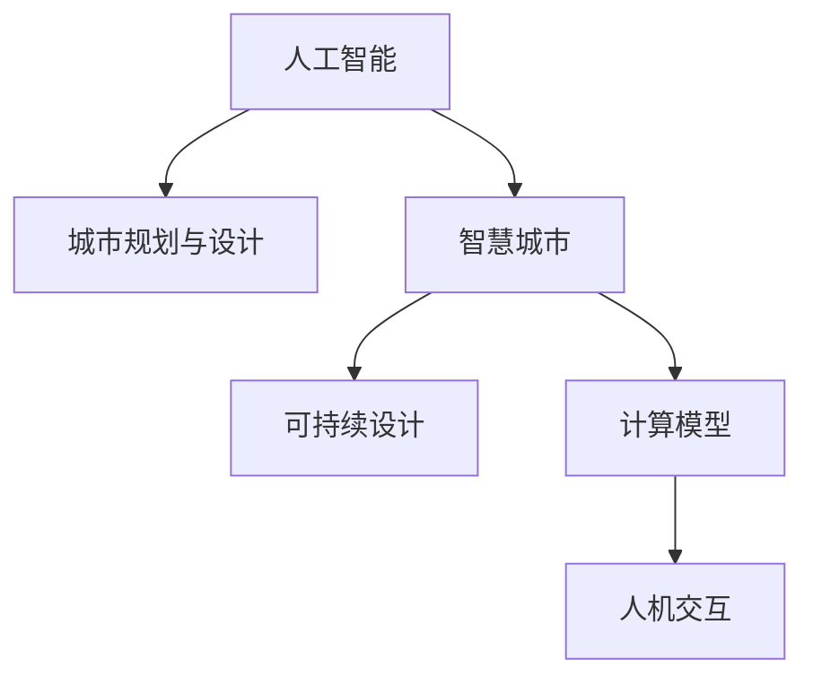

                 

# AI与人类计算：打造可持续发展的城市生活方式与设计

> 关键词：人工智能,城市规划,智慧城市,可持续设计,计算模型,人机交互

## 1. 背景介绍

在快速城市化的今天，人口密集、资源紧张和环境恶化的城市问题日益突出。传统的城市规划和设计已无法满足可持续发展的需求，亟需引入新兴技术手段进行创新与转型。**人工智能(AI)**，作为一种强大的计算工具，正逐步进入城市规划与设计的各个环节，带来革命性的改变。

### 1.1 问题由来

城市问题主要包括：交通拥堵、能源消耗、住房短缺、环境污染等。这些问题不仅仅是由城市规模扩大引起，更多是由于现有城市规划和设计的缺陷。过去几十年，城市化带来的信息爆炸、经济增长与人口激增导致城市发展失衡，资源分配不合理，环境污染严重。这些问题亟需新的技术手段来解决。

### 1.2 问题核心关键点

城市问题解决的关键在于以下几点：

- **多目标优化**：在交通、环境、住房等方面综合考虑，实现多目标的优化和平衡。
- **数据驱动决策**：利用大数据、物联网等技术，对城市系统进行全面监测，形成基于数据驱动的决策体系。
- **智能设计**：采用AI技术，对建筑、道路、绿化等城市设计进行优化和自动化设计。
- **可持续性评估**：引入绿色建筑、节能减排等理念，评估和优化城市设计的可持续性。
- **人机协同**：实现人与AI的良好互动，提升城市生活的智能化和人性化。

## 2. 核心概念与联系

### 2.1 核心概念概述

为更好地理解人工智能在城市规划与设计中的应用，本节将介绍几个核心概念：

- **人工智能**：一种能够模拟人类智能的计算机系统，通过学习、推理、自我修正等方式进行问题求解。
- **城市规划与设计**：基于城市发展目标，通过规划、设计、管理等方式，优化城市资源配置，提升城市居民生活质量。
- **智慧城市**：利用物联网、大数据、云计算等新兴技术，构建全面感知、高效管理、智能决策的城市。
- **可持续设计**：在设计过程中考虑环境、经济、社会等方面的影响，追求资源节约、环境友好、社会和谐的目标。
- **计算模型**：建立数学模型和算法，用于描述和求解城市系统问题，是AI在城市规划与设计中的关键工具。
- **人机交互**：城市中人与AI的互动，实现信息共享、智能决策、用户参与等功能。

这些核心概念之间的逻辑关系可以通过以下Mermaid流程图来展示：



这个流程图展示了大语言模型的核心概念及其之间的关系：

1. 人工智能提供强大的计算能力，助力城市规划与设计。
2. 智慧城市利用AI技术，实现全面感知和智能决策。
3. 可持续设计引入AI技术，提升设计的环保、节能水平。
4. 计算模型为AI在城市应用提供数学基础。
5. 人机交互优化城市居民的参与感与使用体验。

这些概念共同构成了人工智能在城市规划与设计中的应用框架，使得城市智能化、可持续化成为可能。

## 3. 核心算法原理 & 具体操作步骤

### 3.1 算法原理概述

人工智能在城市规划与设计中的应用，主要基于以下几个核心算法：

1. **机器学习与深度学习**：通过数据驱动，优化城市系统性能。
2. **强化学习**：在复杂的决策问题中，通过试错优化，找到最佳方案。
3. **模拟与仿真**：通过模型建立城市系统的仿真环境，进行实验验证。
4. **计算几何**：优化空间布局和设计方案。
5. **自然语言处理(NLP)**：实现城市规划方案的自动生成与优化。

这些算法通过各自的优势，共同解决城市规划与设计中的各类问题。

### 3.2 算法步骤详解

城市规划与设计的AI应用大致分为以下几个步骤：

1. **数据收集与处理**：利用传感器、大数据、物联网等技术，收集城市各个方面的数据。
2. **模型构建与训练**：基于收集的数据，建立城市模型并进行训练，获取优化的方案。
3. **仿真与验证**：使用仿真工具进行虚拟测试，验证方案的可行性。
4. **实施与评估**：将优化后的方案应用于实际城市环境中，并进行效果评估。
5. **持续改进**：根据反馈结果，进行模型更新和优化，实现可持续性发展。

### 3.3 算法优缺点

人工智能在城市规划与设计中的算法，具有以下优缺点：

**优点**：

- **效率高**：通过自动化处理大量数据，大幅提升规划和设计效率。
- **精度高**：通过深度学习等技术，能够进行精确的预测和决策。
- **灵活性强**：根据不同场景，可以灵活调整算法模型和参数。

**缺点**：

- **数据依赖性大**：模型效果依赖于数据的质量和量。
- **复杂度高**：构建和优化模型需要较高技术门槛。
- **可解释性差**：部分AI算法模型难以解释决策过程。

### 3.4 算法应用领域

人工智能在城市规划与设计中的应用范围十分广泛，具体包括：

- **智能交通**：通过AI优化交通信号、路线规划，减少拥堵，提高效率。
- **智慧能源**：利用AI进行能源消耗监测和优化，实现节能减排。
- **绿色建筑**：采用AI进行建筑设计优化，提升建筑能效和舒适度。
- **城市安全**：使用AI进行城市监控和安全预警，提升公共安全。
- **垃圾处理**：通过AI优化垃圾分类和回收流程，减少环境污染。
- **公共设施管理**：采用AI进行公共设施的智能管理与维护，提升服务水平。

## 4. 数学模型和公式 & 详细讲解 & 举例说明

### 4.1 数学模型构建

城市规划与设计中的数学模型，通常包括以下几个部分：

1. **交通模型**：描述交通流量、道路容量、交通需求等，主要基于优化理论（如线性规划、非线性规划等）。
2. **环境模型**：描述大气、水体、土壤等环境参数，主要基于生态学和环境科学知识。
3. **经济模型**：描述城市资源配置、经济活动等，主要基于经济学理论。
4. **人口模型**：描述人口分布、增长、流动等，主要基于社会学和统计学知识。
5. **城市形态模型**：描述城市结构、用地布局等，主要基于城市规划知识。

### 4.2 公式推导过程

以下以交通模型为例，推导线性规划模型的基本公式。

假设某城市交通网络有 $n$ 个节点，$m$ 条边，交通流量为 $x_{ij}$，单位时间为 $t_{ij}$，交通需求为 $d_i$，约束条件为非负且总流量相等。则交通模型的线性规划问题可以表示为：

$$
\min \sum_{i=1}^n \sum_{j=1}^n c_{ij}x_{ij} \\
s.t. \sum_{i=1}^m x_{ij} = d_i, j=1,...,n \\
\sum_{i=1}^m x_{ij} = d_j, i=1,...,n \\
x_{ij} \geq 0, i=1,...,n, j=1,...,m
$$

其中 $c_{ij}$ 为单位时间内的费用或收益，目标函数为最小化总成本或最大化总效益。

### 4.3 案例分析与讲解

在实际应用中，线性规划模型可以用于优化城市交通流量。例如，假设有 $n$ 条道路，每个交叉口交通需求为 $d_i$，每条道路单位时间费用为 $c_{ij}$。通过求解线性规划问题，可以计算出最优交通流量分配方案。

## 5. 项目实践：代码实例和详细解释说明

### 5.1 开发环境搭建

在进行AI项目实践前，需要先搭建好开发环境。以下是使用Python进行城市规划与设计的开发环境配置流程：

1. 安装Python：下载并安装最新版本的Python，例如安装3.8或3.9版本。
2. 安装必要的包：安装Pandas、NumPy、SciPy等数据处理包，安装matplotlib、seaborn等数据可视化包。
3. 安装城市规划与设计相关的包：安装networkx用于建立城市交通网络，安装pyproj用于地理坐标转换，安装openpyxl用于读取和写入Excel文件。

### 5.2 源代码详细实现

下面以智能交通为例，给出使用Pandas进行交通流量优化分析的Python代码实现。

```python
import pandas as pd
import numpy as np
import networkx as nx
from scipy.optimize import linprog

# 构建交通网络
G = nx.Graph()
edges = [(1, 2), (1, 3), (2, 3), (2, 4), (3, 4)]
G.add_edges_from(edges)

# 定义流量与费用矩阵
A = np.array([[1, 0, 0, 0, 1, 0, 0, 0],
              [0, 1, 0, 0, 0, 1, 0, 0],
              [0, 0, 1, 0, 0, 0, 1, 0],
              [0, 0, 0, 1, 0, 0, 0, 1],
              [1, 0, 0, 0, 1, 0, 0, 0],
              [0, 1, 0, 0, 0, 1, 0, 0],
              [0, 0, 1, 0, 0, 0, 1, 0],
              [0, 0, 0, 1, 0, 0, 0, 1]])
c = np.array([10, 20, 30, 40, 50, 60, 70, 80])
b = np.array([100, 120, 140, 160, 180, 200, 220, 240])

# 求解线性规划问题
res = linprog(c, A_ub=A, b_ub=b, bounds=(0, None))

# 打印最优解
print(res)
```

### 5.3 代码解读与分析

这里我们详细解读一下代码的关键实现细节：

1. **网络构建**：使用networkx库构建城市交通网络，定义节点和边。
2. **流量与费用矩阵**：根据交通网络的拓扑结构，构建线性规划问题的约束矩阵 $A$ 和向量 $b$。
3. **目标函数**：定义单位时间内的费用向量 $c$，作为优化目标。
4. **求解线性规划**：使用SciPy库中的linprog函数求解线性规划问题，得到最优解。
5. **输出结果**：打印线性规划问题的最优解，显示交通流量的分配情况。

## 6. 实际应用场景

### 6.1 智能交通系统

智能交通系统是城市规划与设计中的重要应用。通过AI技术，可以对交通信号、路线规划等进行优化，减少交通拥堵，提升城市交通效率。具体应用场景包括：

1. **交通信号优化**：使用AI分析实时交通流量，自动调整交通信号配时，实现动态交通信号控制。
2. **路线规划与导航**：利用AI进行实时路线规划，为驾驶员和乘客提供最佳路径。
3. **停车管理**：通过AI监控城市停车位，实现动态调整和智能收费。
4. **公交系统优化**：使用AI优化公交路线和时间表，提高公共交通效率。

### 6.2 智慧能源系统

智慧能源系统通过AI技术优化能源使用和管理，提升城市的能源利用效率，减少能源消耗。具体应用场景包括：

1. **能源需求预测**：利用AI进行能源需求预测，调整能源供应策略。
2. **智能电网管理**：使用AI进行电网负荷优化，提升电网稳定性。
3. **能源监控与调优**：采用AI进行能源消耗监控和优化，减少浪费。
4. **可再生能源利用**：通过AI优化可再生能源的采集和使用，实现绿色能源供应。

### 6.3 绿色建筑

绿色建筑通过AI技术优化建筑设计和施工，提升建筑能效和舒适度。具体应用场景包括：

1. **能效优化**：利用AI优化建筑能耗设计，实现节能减排。
2. **室内环境监测**：使用AI进行室内环境监测，提升居住舒适度。
3. **智能控制**：通过AI进行智能控制，实现自动化管理。
4. **建筑维护**：利用AI进行建筑维护和检测，延长建筑寿命。

### 6.4 未来应用展望

未来，AI在城市规划与设计中的应用将更加广泛，具体展望如下：

1. **全域感知**：利用AI进行城市全域感知，构建城市“神经系统”，实现智能决策。
2. **智能设计**：采用AI进行自动化设计，提升城市设计的效率和质量。
3. **跨领域融合**：将AI与物联网、大数据、区块链等技术融合，实现跨领域的智能化应用。
4. **城市治理**：利用AI进行城市治理和公共服务优化，提升城市治理水平。
5. **公众参与**：通过AI实现公众参与和互动，提升城市治理的透明性和民主性。
6. **可持续发展**：利用AI进行城市可持续发展评估和优化，实现绿色、环保的城市发展。

## 7. 工具和资源推荐

### 7.1 学习资源推荐

为了帮助开发者系统掌握人工智能在城市规划与设计中的应用，这里推荐一些优质的学习资源：

1. **城市规划与设计课程**：各大高校开设的课程，涵盖城市规划、建筑设计、交通规划等领域。
2. **AI在城市应用案例**：相关书籍和论文，展示AI在实际城市应用中的具体实现和效果。
3. **在线课程平台**：如Coursera、Udacity等，提供大量与AI相关的课程，涵盖从基础到进阶的各种内容。
4. **AI竞赛与挑战**：如Kaggle竞赛平台，提供与城市规划与设计相关的数据集和挑战，锻炼实战能力。
5. **开源项目与代码**：如GitHub上的城市规划与设计开源项目，学习先进的技术和实现方式。

### 7.2 开发工具推荐

高效的开发离不开优秀的工具支持。以下是几款用于城市规划与设计开发的常用工具：

1. **Pandas**：数据处理与分析的Python库，支持大规模数据处理和分析。
2. **NetworkX**：用于建立和分析网络拓扑结构。
3. **SciPy**：科学计算库，提供各种优化和统计工具。
4. **Matplotlib与Seaborn**：数据可视化库，支持高质量的图表展示。
5. **PyProj**：地理坐标转换库，用于处理地理位置数据。
6. **ArcGIS**：地理信息系统软件，支持城市规划与设计的空间分析。

### 7.3 相关论文推荐

人工智能在城市规划与设计中的应用研究，涵盖多个领域，以下是几篇具有代表性的论文：

1. **"Smart Cities: Ideas, Experience, and Future Directions"**：美国土木工程师学会（ASCE）的综述文章，介绍了智慧城市的概念、技术和应用。
2. **"Artificial Intelligence for Smart Cities"**：IEEE的综述文章，讨论了AI在智慧城市中的应用前景和挑战。
3. **"Deep Learning for Urban Planning and Design"**：知名期刊《Computers, Environment & Urban Systems》发表的文章，介绍了深度学习在城市规划中的应用。
4. **"Smart Cities with AI and Big Data"**：《IEEE Internet of Things Journal》发表的文章，讨论了AI和物联网技术在智慧城市中的应用。

## 8. 总结：未来发展趋势与挑战

### 8.1 总结

本文对人工智能在城市规划与设计中的应用进行了全面系统的介绍。首先阐述了AI在城市规划中的研究背景和意义，明确了AI在优化城市系统中的核心作用。其次，从原理到实践，详细讲解了AI在城市规划与设计中的关键算法和操作步骤，给出了具体代码实现和实例分析。同时，本文还广泛探讨了AI在智能交通、智慧能源、绿色建筑等多个城市应用场景中的实际应用，展示了AI技术的强大潜力。此外，本文精选了相关的学习资源和开发工具，力求为读者提供全方位的技术指引。

通过本文的系统梳理，可以看到，人工智能在城市规划与设计中的应用，不仅提升了城市管理的智能化和高效性，也推动了城市的绿色、环保和可持续发展。未来，随着AI技术的不断进步，其在城市规划与设计中的应用将更加广泛和深入，为构建可持续发展的城市生活方式与设计提供更多可能。

### 8.2 未来发展趋势

展望未来，人工智能在城市规划与设计中的应用将呈现以下几个发展趋势：

1. **全域感知与智能决策**：通过AI实现城市全域感知，构建智能决策系统，提升城市治理的科学性和效率。
2. **人机协同与公众参与**：利用AI优化人机交互，提升公众参与度，实现更加民主和透明的治理方式。
3. **跨领域融合与智能化**：将AI与其他技术进行深度融合，实现跨领域的智能化应用，提升城市的整体智能化水平。
4. **绿色与可持续发展**：利用AI进行绿色建筑设计、能源优化和环境监测，实现城市的可持续发展。
5. **实时性与自适应**：提升AI的实时性和自适应能力，实现城市系统的动态优化。
6. **开放性与共享性**：推动AI应用的标准化和开放共享，促进数据的流通与协同创新。

这些趋势将引领城市规划与设计迈向更加智能化、可持续化的新阶段。

### 8.3 面临的挑战

尽管人工智能在城市规划与设计中的应用前景广阔，但在实际落地过程中，仍面临以下挑战：

1. **数据隐私与安全**：城市数据涉及个人隐私，需要建立完善的数据隐私保护机制。
2. **算力与资源消耗**：AI在处理大规模数据和复杂问题时，需要较高的计算资源，需要优化算力消耗。
3. **模型复杂性与可解释性**：部分AI模型过于复杂，难以解释其决策过程，需要提高模型的可解释性。
4. **跨领域协同**：城市规划涉及多个领域，需要跨领域的协同与融合，提升综合治理能力。
5. **政策与法规**：AI在城市治理中的应用需要相应的政策与法规支持，确保其合法合规。

这些挑战需要从技术、政策、社会等多个维度进行综合应对。

### 8.4 研究展望

未来，需要在以下几个方面进行深入研究：

1. **数据隐私保护**：研究数据隐私保护技术，确保城市数据的安全性和合规性。
2. **高效计算方法**：研究高效的计算方法和优化算法，提升AI的实时性和自适应能力。
3. **可解释AI**：研究可解释AI技术，提升模型的可解释性和透明性。
4. **跨领域协同**：研究跨领域协同技术，推动AI与各领域技术的深度融合。
5. **政策与法规**：研究AI在城市治理中的政策与法规，确保其合法合规。

这些研究方向的探索，将推动AI在城市规划与设计中的应用向更深层次发展，为构建可持续发展的城市生活方式与设计提供更多技术保障。

## 9. 附录：常见问题与解答

**Q1：如何构建城市模型？**

A: 城市模型的构建需要从多个维度考虑，主要包括交通网络、建筑空间、环境参数、人口分布等方面。可以使用网络拓扑结构、地理信息系统、统计数据等进行建模。

**Q2：AI在城市规划中的优缺点是什么？**

A: AI在城市规划中的优点包括：高效、精度高、灵活性高。缺点包括：数据依赖性大、复杂度高、可解释性差。

**Q3：如何评估城市模型的效果？**

A: 城市模型的评估可以从多个维度进行，包括交通流量、能源消耗、环境质量、经济指标等。通常使用优化目标函数和约束条件，进行模型效果评估。

**Q4：如何在城市中实现人机协同？**

A: 人机协同可以通过智能应用接口、用户交互界面、智能推荐系统等技术实现。用户可以通过语音、手势等方式进行交互，提升城市服务的智能化水平。

**Q5：未来AI在城市规划中的发展方向是什么？**

A: 未来AI在城市规划中的发展方向包括全域感知、智能决策、人机协同、绿色设计、实时优化、政策支持等。目标是构建更加智能化、绿色化的城市生活环境。

---

作者：禅与计算机程序设计艺术 / Zen and the Art of Computer Programming

