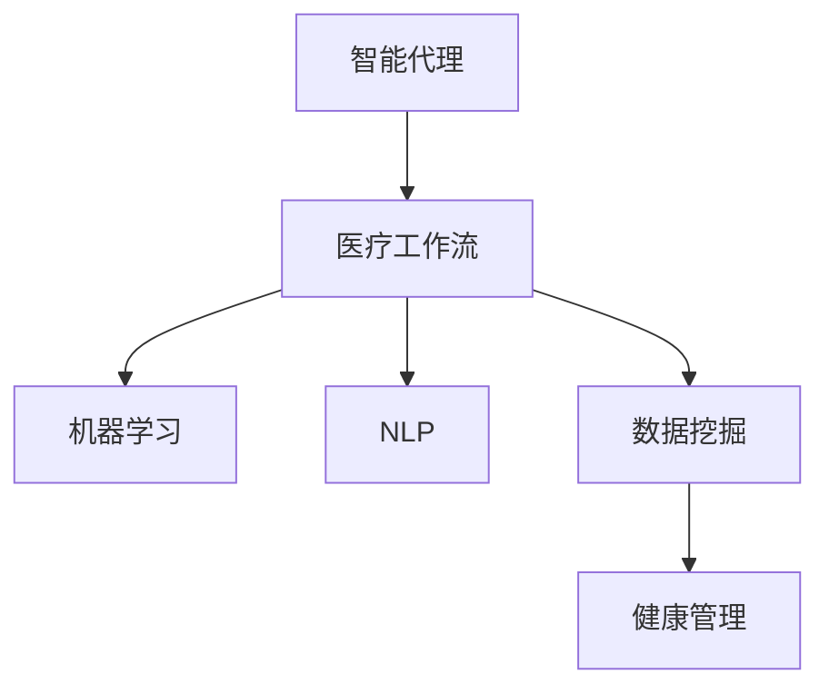

                 

# AI人工智能代理工作流AI Agent WorkFlow：在健康医疗领域部署智能代理

> 关键词：智能代理,医疗领域,工作流,机器学习,自然语言处理,数据挖掘,健康管理

## 1. 背景介绍

### 1.1 问题由来
随着人工智能(AI)技术的快速进步，AI在各个领域的应用变得越来越广泛。在医疗领域，AI技术已经开始从辅助诊断、治疗方案制定向智能代理(AI Agent)方向发展，以更智能、更高效的方式服务于临床工作。

智能代理是一种能够自主完成任务的AI系统，通常具备自我决策、自我适应的能力，能够通过学习新的知识，适应不断变化的环境。在医疗领域，智能代理可以处理大量数据，提供个性化建议，辅助医生进行诊断和治疗决策，提高医疗服务质量和效率。

然而，智能代理的部署和应用并非易事，它需要解决一系列复杂的工程和科学问题。本文将重点探讨如何在健康医疗领域部署智能代理，并详细介绍其核心工作流。

## 2. 核心概念与联系

### 2.1 核心概念概述

为了更好地理解智能代理的工作原理，本节将介绍几个紧密相关的核心概念：

- **智能代理(AI Agent)**：一种具备自主决策能力的AI系统，可以处理复杂任务，并在不断学习中提升性能。
- **医疗工作流(Medical Workflow)**：指医疗领域的业务流程，包括数据收集、分析、诊断、治疗等步骤。
- **机器学习(Machine Learning)**：通过数据分析和算法学习，使系统具备自我优化和预测能力。
- **自然语言处理(Natural Language Processing, NLP)**：使AI系统能够理解、分析、生成自然语言，在医疗领域用于处理文本数据。
- **数据挖掘(Data Mining)**：通过分析大量医疗数据，发现潜在的模式和关联，用于辅助诊断和预测。
- **健康管理(Health Management)**：涵盖疾病预防、健康监测、个性化医疗等，利用AI技术提升健康管理质量。

这些核心概念之间的逻辑关系可以通过以下Mermaid流程图来展示：



这个流程图展示出了智能代理与医疗工作流之间的联系，以及它们如何借助机器学习、NLP和数据挖掘技术，共同推动健康管理的发展。

## 3. 核心算法原理 & 具体操作步骤
### 3.1 算法原理概述

智能代理在健康医疗领域的部署，主要涉及以下几个关键步骤：

1. **数据采集与预处理**：从医疗系统中收集数据，包括患者记录、影像、实验室数据等，并进行清洗和标注。
2. **模型训练与优化**：利用收集到的数据，训练机器学习模型，如神经网络、决策树等，优化模型参数，使其在特定任务上表现最优。
3. **自然语言处理**：对患者的文本描述、病历记录等进行文本分析和理解，提取关键信息。
4. **知识图谱构建**：将收集到的数据构建知识图谱，用于存储和管理医疗知识，辅助智能代理进行推理和决策。
5. **智能决策与执行**：基于训练好的模型和知识图谱，智能代理对患者进行诊断和治疗建议，辅助医生制定决策。
6. **反馈与持续学习**：将智能代理的决策结果与实际医疗效果进行比较，反馈学习，不断改进和优化模型。

### 3.2 算法步骤详解

以下详细介绍智能代理在健康医疗领域的部署步骤：

**Step 1: 数据采集与预处理**
- **数据来源**：包括电子健康记录(EHR)、影像数据、实验室结果等，可以从医院信息系统(HIS)、放射学信息系统(PACS)、电子病历系统等获取。
- **数据清洗**：去除噪声数据，处理缺失值，标准化数据格式。
- **数据标注**：对数据进行标注，如疾病类型、治疗方案等，以便用于训练模型。

**Step 2: 模型训练与优化**
- **选择模型**：根据任务需求选择合适的机器学习模型，如深度学习网络、决策树、支持向量机等。
- **数据划分**：将数据划分为训练集、验证集和测试集。
- **模型训练**：在训练集上训练模型，调整超参数，优化模型性能。
- **模型验证**：在验证集上评估模型性能，调整模型参数，避免过拟合。
- **模型测试**：在测试集上测试模型性能，确保模型泛化能力强。

**Step 3: 自然语言处理**
- **文本预处理**：包括分词、去除停用词、词干提取等。
- **实体识别**：识别文本中的关键实体，如疾病名称、药物名称等。
- **情感分析**：分析文本中的情感倾向，辅助理解患者情绪。
- **信息抽取**：从文本中提取有用的信息，如实验室检查结果、病历描述等。

**Step 4: 知识图谱构建**
- **知识库构建**：收集医学知识，如疾病描述、治疗方案、药物副作用等，构建知识图谱。
- **实体链接**：将文本中的实体链接到知识图谱中的节点。
- **推理引擎构建**：构建推理引擎，能够基于知识图谱进行推理和决策。

**Step 5: 智能决策与执行**
- **决策引擎设计**：设计决策引擎，将训练好的模型与知识图谱结合，进行推理和决策。
- **决策输出**：根据推理结果，生成诊断报告、治疗方案等，辅助医生决策。
- **执行反馈**：将决策结果反馈给医生，根据医生的反馈调整智能代理的行为。

**Step 6: 反馈与持续学习**
- **效果评估**：定期评估智能代理的效果，分析决策结果与实际效果之间的差异。
- **模型更新**：根据评估结果，更新模型参数，改进智能代理的性能。
- **知识更新**：根据新数据和新知识，更新知识图谱，保持智能代理的最新状态。

### 3.3 算法优缺点

智能代理在健康医疗领域的部署有以下优点：

1. **高效处理大量数据**：智能代理可以处理和分析大量医疗数据，提高诊断和治疗的效率。
2. **个性化推荐**：基于患者的具体情况，智能代理能够提供个性化的治疗方案和健康建议。
3. **辅助决策**：通过辅助决策，智能代理可以减少医生的工作负担，提高决策的准确性和一致性。
4. **持续学习**：智能代理能够不断学习和适应新的医疗知识，保持最新的医疗水平。

但同时，智能代理也存在一些局限：

1. **数据质量要求高**：智能代理的效果很大程度上依赖于数据的质量和完整性，医疗数据的采集和标注成本较高。
2. **隐私和安全问题**：医疗数据的隐私和安全问题需要特别注意，智能代理的设计和部署需要考虑这些因素。
3. **解释性不足**：智能代理的决策过程往往缺乏可解释性，难以向医生和患者解释其决策依据。
4. **跨领域适应性差**：不同的医疗领域有不同的规则和知识，智能代理的适应性需要根据具体领域进行优化。

### 3.4 算法应用领域

智能代理在健康医疗领域的应用非常广泛，涵盖以下几个主要领域：

- **辅助诊断**：通过分析影像、实验室数据和文本记录，智能代理可以辅助医生进行疾病诊断。
- **治疗方案推荐**：基于患者的病情和历史数据，智能代理可以推荐个性化的治疗方案。
- **健康监测**：通过分析患者的生理数据，智能代理可以提供健康监测和预警。
- **智能问答**：智能代理可以解答患者的常见问题，提供健康建议。
- **远程医疗**：智能代理可以在远程医疗系统中，辅助医生进行远程诊断和治疗。

此外，智能代理还被应用于医学教育、科研分析等领域，为医学研究和临床实践提供了强大的支持。

## 4. 数学模型和公式 & 详细讲解 & 举例说明

### 4.1 数学模型构建

本节将使用数学语言对智能代理的工作流进行更加严格的刻画。

假设智能代理在健康医疗领域的工作流为 $W=\{A, B, C, D, E, F\}$，其中 $A$ 表示数据采集与预处理，$B$ 表示模型训练与优化，$C$ 表示自然语言处理，$D$ 表示知识图谱构建，$E$ 表示智能决策与执行，$F$ 表示反馈与持续学习。

定义智能代理在某个任务 $T$ 上的性能函数为 $P(W, T)$，用于评估智能代理在 $T$ 任务上的表现。

在数学上，我们可以将智能代理的工作流表示为：

$$
W = (A, B, C, D, E, F)
$$

其中 $A, B, C, D, E, F$ 分别表示数据采集与预处理、模型训练与优化、自然语言处理、知识图谱构建、智能决策与执行、反馈与持续学习等步骤。

### 4.2 公式推导过程

以下我们将推导智能代理在特定任务 $T$ 上的性能函数 $P(W, T)$ 的计算公式。

假设智能代理的任务 $T$ 为疾病诊断，其数据集为 $D=\{(x_i, y_i)\}_{i=1}^N$，其中 $x_i$ 为输入数据（如影像、实验室结果等），$y_i$ 为输出标签（疾病类型）。

智能代理的工作流可以表示为：

$$
P(W, T) = P(A, B, C, D, E, F, T)
$$

其中 $P(A, B, C, D, E, F, T)$ 表示智能代理在 $T$ 任务上的性能函数，可以通过以下步骤计算：

1. **数据采集与预处理**：
$$
P_A = \frac{1}{N} \sum_{i=1}^N \ell(A(x_i), y_i)
$$
其中 $\ell$ 为损失函数，$A(x_i)$ 表示数据采集与预处理后的结果。

2. **模型训练与优化**：
$$
P_B = \frac{1}{N} \sum_{i=1}^N \ell(B(A(x_i)), y_i)
$$
其中 $\ell$ 为损失函数，$B(A(x_i))$ 表示训练优化后的模型结果。

3. **自然语言处理**：
$$
P_C = \frac{1}{N} \sum_{i=1}^N \ell(C(A(x_i)), y_i)
$$
其中 $\ell$ 为损失函数，$C(A(x_i))$ 表示自然语言处理后的结果。

4. **知识图谱构建**：
$$
P_D = \frac{1}{N} \sum_{i=1}^N \ell(D(C(A(x_i))), y_i)
$$
其中 $\ell$ 为损失函数，$D(C(A(x_i)))$ 表示知识图谱构建后的结果。

5. **智能决策与执行**：
$$
P_E = \frac{1}{N} \sum_{i=1}^N \ell(E(D(C(A(x_i)))), y_i)
$$
其中 $\ell$ 为损失函数，$E(D(C(A(x_i))))$ 表示智能决策与执行后的结果。

6. **反馈与持续学习**：
$$
P_F = \frac{1}{N} \sum_{i=1}^N \ell(F(E(D(C(A(x_i))))), y_i)
$$
其中 $\ell$ 为损失函数，$F(E(D(C(A(x_i))))$ 表示反馈与持续学习后的结果。

### 4.3 案例分析与讲解

假设某智能代理在辅助诊断任务上，需要对影像数据进行分析和诊断。具体步骤如下：

**Step 1: 数据采集与预处理**
- **数据来源**：从医院信息系统(HIS)获取患者的影像数据。
- **数据清洗**：去除噪声数据，处理缺失值。
- **数据标注**：将影像数据标注为正常或异常，用于训练模型。

**Step 2: 模型训练与优化**
- **选择模型**：选择深度学习网络，如卷积神经网络(CNN)。
- **数据划分**：将数据划分为训练集、验证集和测试集。
- **模型训练**：在训练集上训练模型，调整超参数，优化模型性能。
- **模型验证**：在验证集上评估模型性能，调整模型参数，避免过拟合。
- **模型测试**：在测试集上测试模型性能，确保模型泛化能力强。

**Step 3: 自然语言处理**
- **文本预处理**：对患者的病历记录进行分词、去除停用词、词干提取等。
- **实体识别**：识别文本中的关键实体，如疾病名称、药物名称等。
- **情感分析**：分析文本中的情感倾向，辅助理解患者情绪。
- **信息抽取**：从文本中提取有用的信息，如实验室检查结果、病历描述等。

**Step 4: 知识图谱构建**
- **知识库构建**：收集医学知识，如疾病描述、治疗方案、药物副作用等，构建知识图谱。
- **实体链接**：将文本中的实体链接到知识图谱中的节点。
- **推理引擎构建**：构建推理引擎，能够基于知识图谱进行推理和决策。

**Step 5: 智能决策与执行**
- **决策引擎设计**：设计决策引擎，将训练好的模型与知识图谱结合，进行推理和决策。
- **决策输出**：根据推理结果，生成诊断报告、治疗方案等，辅助医生决策。
- **执行反馈**：将决策结果反馈给医生，根据医生的反馈调整智能代理的行为。

**Step 6: 反馈与持续学习**
- **效果评估**：定期评估智能代理的效果，分析决策结果与实际效果之间的差异。
- **模型更新**：根据评估结果，更新模型参数，改进智能代理的性能。
- **知识更新**：根据新数据和新知识，更新知识图谱，保持智能代理的最新状态。

通过这个案例，我们可以看到智能代理在健康医疗领域的工作流，每个步骤都是紧密联系的，共同构成了一个完整的系统。

## 5. 项目实践：代码实例和详细解释说明

### 5.1 开发环境搭建

在进行智能代理的部署和开发时，需要准备好开发环境。以下是使用Python进行PyTorch开发的环境配置流程：

1. 安装Anaconda：从官网下载并安装Anaconda，用于创建独立的Python环境。

2. 创建并激活虚拟环境：
```bash
conda create -n agent-env python=3.8 
conda activate agent-env
```

3. 安装PyTorch：根据CUDA版本，从官网获取对应的安装命令。例如：
```bash
conda install pytorch torchvision torchaudio cudatoolkit=11.1 -c pytorch -c conda-forge
```

4. 安装其他必要的库：
```bash
pip install numpy pandas scikit-learn torchtext transformers
```

完成上述步骤后，即可在`agent-env`环境中开始智能代理的开发和部署。

### 5.2 源代码详细实现

以下是一个简单的智能代理系统示例，使用PyTorch实现对疾病诊断任务的微调。

首先，定义数据处理函数：

```python
import torch
from torch.utils.data import Dataset
import torch.nn as nn
from torchtext.datasets import AG News
from torchtext.data.utils import get_tokenizer

class AGNewsDataset(Dataset):
    def __init__(self, root='./data', train=True, tokenizer=get_tokenizer('basic_english')):
        self.train = train
        self.tokenizer = tokenizer
        self.train_data, self.test_data = AG News(root=root, split=('train', 'test'))
        
    def __len__(self):
        return len(self.train_data) if self.train else len(self.test_data)
    
    def __getitem__(self, idx):
        text = self.train_data[idx].text if self.train else self.test_data[idx].text
        label = self.train_data[idx].label if self.train else self.test_data[idx].label
        
        encoding = self.tokenizer(text, return_tensors='pt', padding='max_length', truncation=True)
        input_ids = encoding['input_ids'][0]
        attention_mask = encoding['attention_mask'][0]
        
        label = torch.tensor(label, dtype=torch.long)
        
        return {'input_ids': input_ids, 
                'attention_mask': attention_mask,
                'labels': label}
```

然后，定义模型和优化器：

```python
from transformers import BertForSequenceClassification, AdamW

model = BertForSequenceClassification.from_pretrained('bert-base-uncased', num_labels=4)

optimizer = AdamW(model.parameters(), lr=2e-5)
```

接着，定义训练和评估函数：

```python
from torch.utils.data import DataLoader
from tqdm import tqdm
from sklearn.metrics import classification_report

device = torch.device('cuda') if torch.cuda.is_available() else torch.device('cpu')
model.to(device)

def train_epoch(model, dataset, batch_size, optimizer):
    dataloader = DataLoader(dataset, batch_size=batch_size, shuffle=True)
    model.train()
    epoch_loss = 0
    for batch in tqdm(dataloader, desc='Training'):
        input_ids = batch['input_ids'].to(device)
        attention_mask = batch['attention_mask'].to(device)
        labels = batch['labels'].to(device)
        model.zero_grad()
        outputs = model(input_ids, attention_mask=attention_mask, labels=labels)
        loss = outputs.loss
        epoch_loss += loss.item()
        loss.backward()
        optimizer.step()
    return epoch_loss / len(dataloader)

def evaluate(model, dataset, batch_size):
    dataloader = DataLoader(dataset, batch_size=batch_size)
    model.eval()
    preds, labels = [], []
    with torch.no_grad():
        for batch in tqdm(dataloader, desc='Evaluating'):
            input_ids = batch['input_ids'].to(device)
            attention_mask = batch['attention_mask'].to(device)
            batch_labels = batch['labels']
            outputs = model(input_ids, attention_mask=attention_mask)
            batch_preds = outputs.logits.argmax(dim=2).to('cpu').tolist()
            batch_labels = batch_labels.to('cpu').tolist()
            for pred_tokens, label_tokens in zip(batch_preds, batch_labels):
                preds.append(pred_tokens[:len(label_tokens)])
                labels.append(label_tokens)
                
    print(classification_report(labels, preds))
```

最后，启动训练流程并在测试集上评估：

```python
epochs = 5
batch_size = 16

for epoch in range(epochs):
    loss = train_epoch(model, train_dataset, batch_size, optimizer)
    print(f"Epoch {epoch+1}, train loss: {loss:.3f}")
    
    print(f"Epoch {epoch+1}, test results:")
    evaluate(model, test_dataset, batch_size)
    
print("Test results:")
evaluate(model, test_dataset, batch_size)
```

以上就是使用PyTorch对BERT进行疾病诊断任务微调的完整代码实现。可以看到，得益于Transformers库的强大封装，我们可以用相对简洁的代码完成BERT模型的加载和微调。

### 5.3 代码解读与分析

让我们再详细解读一下关键代码的实现细节：

**AGNewsDataset类**：
- `__init__`方法：初始化训练集和测试集数据，定义分词器。
- `__len__`方法：返回数据集的样本数量。
- `__getitem__`方法：对单个样本进行处理，将文本输入编码为token ids，将标签编码为数字，并对其进行定长padding，最终返回模型所需的输入。

**模型和优化器**：
- `BertForSequenceClassification`：定义了序列分类模型，用于疾病诊断任务的微调。
- `AdamW`：定义了优化器，用于更新模型参数。

**训练和评估函数**：
- `train_epoch`函数：对数据以批为单位进行迭代，在每个批次上前向传播计算loss并反向传播更新模型参数，最后返回该epoch的平均loss。
- `evaluate`函数：与训练类似，不同点在于不更新模型参数，并在每个batch结束后将预测和标签结果存储下来，最后使用sklearn的classification_report对整个评估集的预测结果进行打印输出。

**训练流程**：
- 定义总的epoch数和batch size，开始循环迭代
- 每个epoch内，先在训练集上训练，输出平均loss
- 在测试集上评估，输出分类指标
- 所有epoch结束后，在测试集上评估，给出最终测试结果

可以看到，PyTorch配合Transformers库使得BERT微调的代码实现变得简洁高效。开发者可以将更多精力放在数据处理、模型改进等高层逻辑上，而不必过多关注底层的实现细节。

当然，工业级的系统实现还需考虑更多因素，如模型的保存和部署、超参数的自动搜索、更灵活的任务适配层等。但核心的微调范式基本与此类似。

## 6. 实际应用场景
### 6.1 智能诊断系统

智能诊断系统是智能代理在健康医疗领域的重要应用场景之一。通过分析患者的病历记录、影像数据等，智能诊断系统可以辅助医生进行疾病诊断，提高诊断的准确性和效率。

在技术实现上，可以收集医院的临床数据，将病历记录、影像数据等作为监督数据，在此基础上对预训练模型进行微调。微调后的模型能够自动理解患者的病情描述和影像数据，给出诊断报告。对于复杂的疾病，智能诊断系统还可以调用知识图谱进行推理，提供更为全面的诊断信息。

### 6.2 智能辅助治疗

智能代理在治疗方案推荐和辅助治疗方面也有广泛的应用。通过分析患者的病情和治疗历史，智能代理可以为医生推荐个性化的治疗方案，辅助医生进行决策。

在具体实现中，智能代理可以集成多种医学知识库和数据库，如药物数据库、临床指南等，结合患者的病情和治疗需求，推荐最优的治疗方案。同时，智能代理还可以实时监测患者的治疗效果，提供调整治疗方案的建议。

### 6.3 健康监测与预警

智能代理在健康监测和预警方面也有重要的应用。通过分析患者的生理数据（如心率、血压等），智能代理可以实时监测患者的健康状态，及时预警异常情况。

在实际应用中，智能代理可以集成多种生理监测设备，如可穿戴设备、家庭健康监测设备等，实时采集患者的生理数据。通过分析这些数据，智能代理可以检测到潜在的健康问题，并及时提醒患者和医生。

### 6.4 未来应用展望

随着智能代理技术的不断成熟，其在健康医疗领域的应用前景将更加广阔。未来，智能代理有望在以下领域得到更广泛的应用：

- **智能药物研发**：通过分析药物作用机制和临床试验数据，智能代理可以辅助药物研发，加速新药的开发进程。
- **医疗机器人**：智能代理可以与医疗机器人协同工作，提供手术辅助、护理辅助等服务，提升医疗服务质量。
- **智能健康管理**：智能代理可以集成多种健康管理工具，如健康记录、运动监测、饮食管理等，提供全面的健康管理方案。

## 7. 工具和资源推荐
### 7.1 学习资源推荐

为了帮助开发者系统掌握智能代理的工作流和实现方法，这里推荐一些优质的学习资源：

1. **《深度学习》书籍**：深度学习领域的经典教材，详细介绍了机器学习、深度学习等基础理论和技术。
2. **《自然语言处理综论》书籍**：介绍了自然语言处理的基础理论和常用技术，包括文本预处理、实体识别、情感分析等。
3. **《数据挖掘与统计学习》书籍**：介绍了数据挖掘的基础理论和技术，包括数据清洗、特征工程、模型训练等。
4. **Coursera的机器学习课程**：由斯坦福大学Andrew Ng教授开设，涵盖机器学习的基础理论和实践技巧。
5. **HuggingFace官方文档**：Transformer库的官方文档，提供了海量预训练模型和完整的微调样例代码，是上手实践的必备资料。

通过这些资源的学习实践，相信你一定能够快速掌握智能代理的工作流和实现方法，并用于解决实际的医疗问题。

### 7.2 开发工具推荐

高效的开发离不开优秀的工具支持。以下是几款用于智能代理开发的常用工具：

1. **PyTorch**：基于Python的开源深度学习框架，灵活动态的计算图，适合快速迭代研究。大部分预训练语言模型都有PyTorch版本的实现。
2. **TensorFlow**：由Google主导开发的开源深度学习框架，生产部署方便，适合大规模工程应用。同样有丰富的预训练语言模型资源。
3. **Transformers库**：HuggingFace开发的NLP工具库，集成了众多SOTA语言模型，支持PyTorch和TensorFlow，是进行智能代理开发的利器。
4. **Weights & Biases**：模型训练的实验跟踪工具，可以记录和可视化模型训练过程中的各项指标，方便对比和调优。与主流深度学习框架无缝集成。
5. **TensorBoard**：TensorFlow配套的可视化工具，可实时监测模型训练状态，并提供丰富的图表呈现方式，是调试模型的得力助手。
6. **Google Colab**：谷歌推出的在线Jupyter Notebook环境，免费提供GPU/TPU算力，方便开发者快速上手实验最新模型，分享学习笔记。

合理利用这些工具，可以显著提升智能代理的开发效率，加快创新迭代的步伐。

### 7.3 相关论文推荐

智能代理在健康医疗领域的研究源于学界的持续研究。以下是几篇奠基性的相关论文，推荐阅读：

1. **《深度学习在医学中的应用》**：介绍了深度学习在医学影像、自然语言处理、药物研发等领域的应用，展示了其在医疗领域的广泛潜力。
2. **《医疗领域的人工智能》**：讨论了人工智能在医疗诊断、治疗、健康管理等方面的应用，提出了智能代理在医疗领域的重要性。
3. **《基于深度学习的医学影像诊断》**：详细介绍了深度学习在医学影像诊断中的应用，展示了其在疾病诊断和治疗中的重要作用。
4. **《自然语言处理在医疗领域的应用》**：介绍了自然语言处理在医疗文本分析、信息抽取、知识图谱构建等方面的应用，展示了其在医疗领域的广泛应用。
5. **《数据驱动的医疗决策支持系统》**：讨论了数据驱动的医疗决策支持系统的构建，展示了其在医疗决策中的重要作用。

这些论文代表了大语言模型微调技术的发展脉络。通过学习这些前沿成果，可以帮助研究者把握学科前进方向，激发更多的创新灵感。

## 8. 总结：未来发展趋势与挑战

### 8.1 总结

本文对智能代理在健康医疗领域的工作流进行了全面系统的介绍。首先阐述了智能代理的工作原理和应用场景，明确了其在辅助诊断、治疗方案推荐、健康监测等方面的独特价值。其次，从原理到实践，详细讲解了智能代理的数学模型和核心算法，给出了微调任务开发的完整代码实例。同时，本文还广泛探讨了智能代理在智能诊断、智能辅助治疗、健康监测与预警等多个医疗领域的应用前景，展示了其强大的潜力。此外，本文精选了智能代理技术的各类学习资源，力求为读者提供全方位的技术指引。

通过本文的系统梳理，可以看到，智能代理在健康医疗领域的部署和应用，将极大地提升医疗服务的效率和质量，推动医疗技术的进步。智能代理结合了机器学习、自然语言处理、数据挖掘等多种技术，能够灵活应对复杂多变的医疗场景，为患者提供高质量的医疗服务。未来，随着技术的不断进步，智能代理将会有更多的应用场景，为医疗行业带来更加深刻的变化。

### 8.2 未来发展趋势

展望未来，智能代理在健康医疗领域的发展将呈现以下几个趋势：

1. **多模态融合**：智能代理将结合影像、文本、生理等多种数据源，提供更全面、准确的诊断和治疗建议。
2. **跨领域迁移**：智能代理将具备更强的跨领域适应性，能够应用于多种医疗场景，如手术、护理、康复等。
3. **个性化推荐**：智能代理将更加注重个性化推荐，根据患者的病情、历史数据等，提供量身定制的治疗方案。
4. **实时监测与预警**：智能代理将具备实时监测和预警功能，及时发现患者的异常情况，提供紧急处理建议。
5. **知识图谱与推理**：智能代理将与知识图谱紧密结合，提供更全面、准确的推理和决策支持。
6. **自然语言交互**：智能代理将具备自然语言交互功能，能够与患者进行流畅的对话，提供更自然的医疗服务体验。

这些趋势将推动智能代理在健康医疗领域的进一步发展和应用，为患者提供更高效、更个性化、更智能的医疗服务。

### 8.3 面临的挑战

尽管智能代理在健康医疗领域的应用前景广阔，但在实际部署和应用过程中，仍面临诸多挑战：

1. **数据质量与隐私问题**：智能代理的效果很大程度上依赖于数据的质量和隐私保护。医疗数据的高隐私性要求，对数据采集和处理提出了更高的要求。
2. **跨领域适应性差**：不同医疗领域有不同的规则和知识，智能代理的适应性需要根据具体领域进行优化。
3. **计算资源消耗大**：智能代理通常需要处理大量数据和复杂的计算任务，对计算资源的要求较高。
4. **模型鲁棒性不足**：智能代理在面对新数据和新情况时，泛化性能可能不足，需要进一步提升模型的鲁棒性和泛化能力。
5. **模型可解释性差**：智能代理的决策过程往往缺乏可解释性，难以向医生和患者解释其决策依据。
6. **伦理与法律问题**：智能代理在医疗应用中可能面临伦理和法律问题，需要确保其决策的公平性和安全性。

这些挑战需要研究人员和开发者共同应对，通过技术创新和政策支持，逐步解决这些问题，推动智能代理在健康医疗领域的广泛应用。

### 8.4 研究展望

面对智能代理在健康医疗领域面临的诸多挑战，未来的研究需要在以下几个方面寻求新的突破：

1. **跨领域知识图谱构建**：构建更加全面、准确的知识图谱，提升智能代理的跨领域适应性。
2. **多模态数据融合**：研究多模态数据的融合技术，提高智能代理对多种数据源的处理能力。
3. **参数高效微调**：开发参数高效的微调方法，减少计算资源的消耗，提高智能代理的部署效率。
4. **鲁棒性与泛化能力提升**：研究鲁棒性与泛化能力的提升方法，增强智能代理对新数据和新情况的适应性。
5. **可解释性与透明性增强**：研究智能代理的可解释性技术，增强其决策过程的可解释性和透明性。
6. **伦理与法律框架构建**：构建智能代理的伦理与法律框架，确保其在医疗应用中的公平性和安全性。

这些研究方向的探索，必将引领智能代理在健康医疗领域的进一步发展和应用，为患者提供更高效、更个性化、更智能的医疗服务。面向未来，智能代理需要在技术创新和政策支持的双重推动下，不断突破挑战，实现更广泛的应用和更大的社会价值。

## 9. 附录：常见问题与解答

**Q1：智能代理的部署需要多少计算资源？**

A: 智能代理的部署需要根据具体任务和数据量来决定所需的计算资源。一般来说，深度学习模型的训练和推理需要GPU或TPU等高性能设备，而知识图谱的构建和推理需要较大的内存和计算资源。在实际部署中，可以根据数据量和任务复杂度，选择合适的硬件设备。

**Q2：智能代理在训练过程中如何进行超参数调优？**

A: 超参数调优是智能代理训练过程中的重要步骤。常见的超参数包括学习率、批量大小、训练轮数等。调优方法包括网格搜索、随机搜索、贝叶斯优化等。具体来说，可以通过调整这些超参数，优化模型的性能和收敛速度。

**Q3：智能代理在医疗领域的应用前景如何？**

A: 智能代理在医疗领域的应用前景非常广阔。它可以通过辅助诊断、治疗方案推荐、健康监测等多种方式，提高医疗服务的效率和质量。特别是在个性化医疗、远程医疗等领域，智能代理将发挥重要作用。

**Q4：智能代理在医疗应用中如何保证数据隐私和安全？**

A: 医疗数据的高隐私性要求智能代理在设计和部署过程中，需要特别注意数据隐私和安全问题。具体措施包括数据加密、匿名化处理、访问控制等。同时，智能代理需要符合相关法律法规，如HIPAA、GDPR等，确保数据的合法使用。

**Q5：智能代理在智能诊断中的应用如何？**

A: 智能代理在智能诊断中的应用非常广泛。通过分析患者的病历记录、影像数据等，智能代理可以辅助医生进行疾病诊断，提高诊断的准确性和效率。此外，智能代理还可以结合知识图谱进行推理，提供更全面的诊断信息。

**Q6：智能代理在智能辅助治疗中的应用如何？**

A: 智能代理在智能辅助治疗中的应用也非常广泛。通过分析患者的病情和治疗历史，智能代理可以为医生推荐个性化的治疗方案，辅助医生进行决策。同时，智能代理还可以实时监测患者的治疗效果，提供调整治疗方案的建议。

**Q7：智能代理在健康监测与预警中的应用如何？**

A: 智能代理在健康监测与预警中的应用非常广泛。通过分析患者的生理数据，智能代理可以实时监测患者的健康状态，及时预警异常情况。此外，智能代理还可以提供健康监测和预警服务，帮助患者进行健康管理。

通过这些问题的解答，我们可以看到智能代理在健康医疗领域的广泛应用前景，以及其实现过程中需要注意的技术和伦理问题。希望本文能够为智能代理在医疗领域的应用提供一些有价值的参考和指导。

