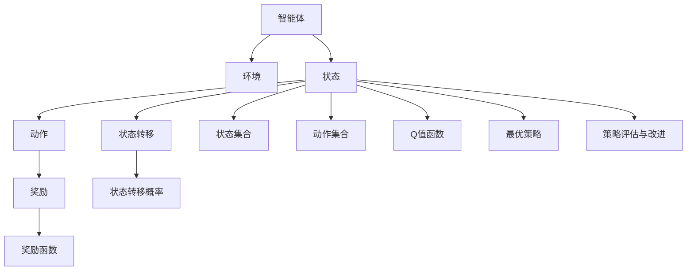

                 

# AI人工智能核心算法原理与代码实例讲解：Q-learning

> 关键词：Q-learning, 强化学习, 奖励函数, 策略评估与改进, 马尔可夫决策过程, 深度强化学习, 神经网络

## 1. 背景介绍

### 1.1 问题由来
强化学习（Reinforcement Learning, RL）是人工智能研究中的一个重要分支，旨在让智能体在不断与环境交互的过程中，通过试错学习，逐渐优化策略，达到某个目标。在强化学习中，智能体依据环境状态采取行动，每次行动后会得到环境反馈，即奖励信号，智能体通过最大化累计奖励，最终找到最优策略。

### 1.2 问题核心关键点
Q-learning算法是强化学习中最经典的算法之一，用于解决马尔可夫决策过程（Markov Decision Process, MDP）问题。其核心思想是通过迭代更新Q值（即状态-动作对的价值函数），最终找到最优策略。Q-learning算法简单高效，理论基础扎实，被广泛应用于机器人控制、游戏AI、推荐系统等多个领域。

## 2. 核心概念与联系

### 2.1 核心概念概述

为更好地理解Q-learning算法，本节将介绍几个密切相关的核心概念：

- 强化学习(Reinforcement Learning, RL)：通过与环境的交互，智能体不断调整自身策略，以最大化累积奖励为目标的学习过程。
- 马尔可夫决策过程(Markov Decision Process, MDP)：描述智能体与环境互动的基本框架，包括状态集合、动作集合、状态转移概率和奖励函数。
- Q值函数(Q-value function)：用于评估某个状态下，采取某个动作后，到达下一个状态所期望获得的累积奖励。
- 最优策略(Optimal Policy)：在给定状态下，选取动作使得累积奖励最大的策略。
- 策略评估与改进（Policy Evaluation & Improvement, PEI）：通过迭代更新Q值，逐步优化智能体的策略。

这些核心概念之间的逻辑关系可以通过以下Mermaid流程图来展示：



这个流程图展示强化学习的核心概念及其之间的关系：

1. 智能体通过与环境交互，观察当前状态，采取动作，获得奖励。
2. 环境状态转移，产生下一个状态，并再次产生奖励。
3. Q值函数用于评估每个状态-动作对的价值，通过策略评估与改进逐步优化。
4. 最优策略是每个状态下，使Q值最大的行动策略。

## 3. 核心算法原理 & 具体操作步骤
### 3.1 算法原理概述

Q-learning算法通过迭代更新状态-动作对的Q值，实现策略评估与改进。其核心原理如下：

- 定义状态-动作对的Q值：

$$
Q(s, a) = r + \gamma \max_{a'} Q(s', a')
$$

其中，$s$ 为当前状态，$a$ 为当前动作，$r$ 为即时奖励，$\gamma$ 为折扣因子，$s'$ 为下一个状态，$a'$ 为下一个动作，$\max_{a'} Q(s', a')$ 表示在$s'$状态下，所有可能动作中，选择使Q值最大的动作对应的Q值。

- Q值更新规则：

$$
Q(s, a) \leftarrow Q(s, a) + \alpha [r + \gamma \max_{a'} Q(s', a') - Q(s, a)]
$$

其中，$\alpha$ 为学习率，表示每次更新Q值时的步长大小。更新公式的含义是，当前Q值加上学习率乘以（下一个状态-动作对的Q值减去当前Q值）的差值。

### 3.2 算法步骤详解

Q-learning算法的具体执行步骤如下：

1. 初始化状态集合 $S$，动作集合 $A$，Q值函数 $Q$，折扣因子 $\gamma$，学习率 $\alpha$。

2. 选择一个初始状态 $s_0$，从状态集合 $S$ 中随机选择一个动作 $a_0$。

3. 执行动作 $a_0$，观察环境反馈的即时奖励 $r_0$ 和下一个状态 $s_1$。

4. 根据状态 $s_0$ 和动作 $a_0$，使用更新规则（3.1中的公式）计算Q值更新。

5. 将当前状态更新为下一个状态 $s_1$，重复步骤3-4，直至到达终止状态。

6. 记录每一步的策略，并输出最终选择的策略。

### 3.3 算法优缺点

Q-learning算法具有以下优点：

- 算法简单，易于实现。只需要基于状态-动作对进行Q值更新，不需要显式地计算最优策略。
- 不需要环境模型，可以用于任何MDP问题。
- 收敛速度快，可以在线学习，无需大量存储。

然而，Q-learning算法也存在一些局限性：

- 对于连续状态和动作的MDP问题，Q-learning难以处理。
- 对于复杂的MDP问题，Q-learning容易陷入局部最优解。
- 在稀疏奖励的MDP问题中，Q-learning的表现不佳。

### 3.4 算法应用领域

Q-learning算法在强化学习领域得到了广泛应用，主要用于解决以下几类问题：

- 游戏AI：如AlphaGo、DQN等，通过强化学习训练深度神经网络，使智能体能够在复杂的围棋和Atari游戏中战胜人类。
- 机器人控制：如Q-Learning for Robot Arm Control，训练机器人控制模型，使其能够执行各种复杂的动作。
- 推荐系统：如Reinforcement Learning for Recommender Systems，训练推荐模型，使用户能够得到更符合自己兴趣的推荐结果。
- 自然语言处理：如Seq2Seq for Chatbots，训练对话模型，使智能体能够自动生成对话，提高人机交互体验。
- 自动化交易：如Reinforcement Learning for Financial Trading，训练交易模型，实现自动化的交易决策。

## 4. 数学模型和公式 & 详细讲解 & 举例说明

### 4.1 数学模型构建

Q-learning算法主要涉及Q值函数的构建和更新，其数学模型如下：

1. 初始化Q值函数：

$$
Q(s, a) = 0
$$

2. 状态-动作对的Q值更新：

$$
Q(s, a) \leftarrow Q(s, a) + \alpha [r + \gamma \max_{a'} Q(s', a') - Q(s, a)]
$$

其中，$s$ 为当前状态，$a$ 为当前动作，$r$ 为即时奖励，$\gamma$ 为折扣因子，$s'$ 为下一个状态，$a'$ 为下一个动作，$\max_{a'} Q(s', a')$ 表示在$s'$状态下，所有可能动作中，选择使Q值最大的动作对应的Q值。

### 4.2 公式推导过程

我们以一个简单的马尔可夫决策过程为例，进行Q值函数的推导。

假设智能体处于状态 $s$，采取动作 $a$，到达下一个状态 $s'$，并获得即时奖励 $r$。根据Q-learning算法的Q值更新公式：

$$
Q(s, a) \leftarrow Q(s, a) + \alpha [r + \gamma \max_{a'} Q(s', a') - Q(s, a)]
$$

将 $s'$ 作为当前状态，$max_{a'} Q(s', a')$ 作为Q值函数在 $s'$ 下的最大值，可得：

$$
Q(s, a) \leftarrow Q(s, a) + \alpha [r + \gamma Q(s', \max_{a'} Q(s', a')) - Q(s, a)]
$$

根据状态转移概率 $p_{s \rightarrow s'}$ 和奖励函数 $R(s, a)$，可得：

$$
Q(s, a) \leftarrow Q(s, a) + \alpha [R(s, a) + \gamma \sum_{s'} p_{s \rightarrow s'} Q(s', \max_{a'} Q(s', a')) - Q(s, a)]
$$

化简得：

$$
Q(s, a) \leftarrow \alpha R(s, a) + \alpha \gamma \sum_{s'} p_{s \rightarrow s'} Q(s', \max_{a'} Q(s', a'))
$$

即为Q-learning算法的Q值更新公式。

### 4.3 案例分析与讲解

以AlphaGo为例，讨论Q-learning算法的实际应用。AlphaGo使用了深度强化学习的方法，通过Q-learning算法训练神经网络，使其能够在围棋中战胜人类。其具体步骤如下：

1. 构建围棋游戏状态和动作空间。状态空间为棋盘上所有可能的状态，动作空间为每次可能的落子位置。

2. 使用蒙特卡罗树搜索（Monte Carlo Tree Search, MCTS）生成游戏树，遍历所有可能的落子位置。

3. 利用Q-learning算法，训练神经网络，使得每次落子位置的选择最大化累计奖励。

4. 在对抗过程中，AlphaGo通过多次蒙特卡罗树搜索，选择最优落子位置，完成游戏。

AlphaGo的成功在于其结合了深度神经网络和Q-learning算法，使得智能体能够在复杂的环境中通过试错学习，逐步优化策略，达到人类水平。

## 5. 项目实践：代码实例和详细解释说明
### 5.1 开发环境搭建

在进行Q-learning项目实践前，我们需要准备好开发环境。以下是使用Python进行PyTorch开发的环境配置流程：

1. 安装Anaconda：从官网下载并安装Anaconda，用于创建独立的Python环境。

2. 创建并激活虚拟环境：
```bash
conda create -n pytorch-env python=3.8 
conda activate pytorch-env
```

3. 安装PyTorch：根据CUDA版本，从官网获取对应的安装命令。例如：
```bash
conda install pytorch torchvision torchaudio cudatoolkit=11.1 -c pytorch -c conda-forge
```

4. 安装TensorFlow：如果不需要使用，不需要安装，因为Q-learning算法使用PyTorch即可实现。

5. 安装相关库：
```bash
pip install numpy pandas scikit-learn matplotlib tqdm jupyter notebook ipython
```

完成上述步骤后，即可在`pytorch-env`环境中开始Q-learning的实践。

### 5.2 源代码详细实现

下面我们以Q-learning在简单迷宫问题上的应用为例，给出使用PyTorch实现Q-learning的代码。

首先，定义迷宫问题的状态集合、动作集合和奖励函数：

```python
import numpy as np
import torch
import torch.nn as nn
import torch.optim as optim
import torch.nn.functional as F

S = np.array([(i, j) for i in range(3) for j in range(3)])
A = np.array([[0, 1], [1, 0]])
R = np.array([[0, -1, -1], [1, 0, -1], [-1, 1, 0]])
```

然后，定义Q-learning算法的模型和优化器：

```python
class QNetwork(nn.Module):
    def __init__(self):
        super(QNetwork, self).__init__()
        self.linear1 = nn.Linear(len(S), 16)
        self.linear2 = nn.Linear(16, len(A))

    def forward(self, x):
        x = self.linear1(x)
        x = F.relu(x)
        x = self.linear2(x)
        return x

model = QNetwork()
optimizer = optim.Adam(model.parameters(), lr=0.1)
```

接着，定义Q-learning算法的训练和评估函数：

```python
def train_qlearning(model, optimizer, num_episodes, num_steps, gamma=0.9):
    rewards = []
    for i in range(num_episodes):
        state = np.random.randint(0, len(S))
        done = False
        total_reward = 0
        for j in range(num_steps):
            state = torch.tensor(state, dtype=torch.long)
            actions = model(state)
            action = torch.argmax(actions, dim=1).item()
            next_state = R[action].copy()
            if np.array_equal(next_state, [0, 0, 0]):
                done = True
            else:
                total_reward += R[action][next_state]
                next_state = next_state.copy()
            state = next_state
            if done:
                break
        rewards.append(total_reward)
    return np.mean(rewards)

def evaluate_qlearning(model, num_episodes, num_steps, gamma=0.9):
    rewards = []
    for i in range(num_episodes):
        state = np.random.randint(0, len(S))
        done = False
        total_reward = 0
        for j in range(num_steps):
            state = torch.tensor(state, dtype=torch.long)
            actions = model(state)
            action = torch.argmax(actions, dim=1).item()
            next_state = R[action].copy()
            if np.array_equal(next_state, [0, 0, 0]):
                done = True
            else:
                total_reward += R[action][next_state]
                next_state = next_state.copy()
            state = next_state
            if done:
                break
        rewards.append(total_reward)
    return np.mean(rewards)
```

最后，启动Q-learning训练和评估：

```python
num_episodes = 1000
num_steps = 10
rewards = []
for i in range(num_episodes):
    rewards.append(train_qlearning(model, optimizer, num_episodes, num_steps))
    rewards.append(evaluate_qlearning(model, num_episodes, num_steps))
```

以上就是使用PyTorch实现Q-learning的完整代码实现。可以看到，通过定义状态集合、动作集合和奖励函数，以及构建Q-learning模型，即可实现Q-learning算法。

### 5.3 代码解读与分析

让我们再详细解读一下关键代码的实现细节：

**QNetwork类**：
- `__init__`方法：定义神经网络模型结构，包含两个全连接层。
- `forward`方法：定义模型前向传播过程，计算Q值。

**train_qlearning函数**：
- 在每轮训练中，随机初始化一个状态，执行num_steps步Q-learning算法，记录累计奖励。
- 使用Adam优化器更新模型参数，最小化Q值误差。

**evaluate_qlearning函数**：
- 在每轮评估中，随机初始化一个状态，执行num_steps步Q-learning算法，记录累计奖励。
- 记录每次评估的累计奖励，计算平均值。

**训练和评估流程**：
- 每轮训练和评估后，记录累计奖励，并输出平均值。
- 多次训练和评估后，得出最终结果。

可以看到，PyTorch提供了灵活的神经网络建模接口，可以方便地实现Q-learning算法。开发者可以根据自己的需求，进一步优化模型结构和训练策略。

## 6. 实际应用场景

### 6.1 游戏AI

Q-learning算法在游戏AI领域有着广泛应用，如AlphaGo、DQN等。AlphaGo通过结合深度神经网络和Q-learning算法，成功在围棋中战胜了人类。DQN算法则通过Q-learning算法，训练深度神经网络，使得智能体能够在Atari游戏中表现出色。

### 6.2 机器人控制

Q-learning算法也被用于机器人控制。例如，Q-Learning for Robot Arm Control利用Q-learning算法，训练机器人控制模型，使其能够执行各种复杂的动作。通过不断调整控制策略，机器人可以在不同环境下表现出良好的适应能力。

### 6.3 推荐系统

在推荐系统领域，Q-learning算法也被用于训练推荐模型。Reinforcement Learning for Recommender Systems通过Q-learning算法，训练推荐模型，使用户能够得到更符合自己兴趣的推荐结果。通过不断优化推荐策略，可以显著提升用户的满意度和留存率。

### 6.4 自然语言处理

在自然语言处理领域，Q-learning算法也被用于训练对话模型。Seq2Seq for Chatbots通过Q-learning算法，训练对话模型，使智能体能够自动生成对话，提高人机交互体验。通过不断优化对话策略，可以显著提升对话的流畅性和准确性。

## 7. 工具和资源推荐

### 7.1 学习资源推荐

为了帮助开发者系统掌握Q-learning算法，这里推荐一些优质的学习资源：

1. 《强化学习入门》书籍：由Nando de Freitas撰写，介绍了强化学习的原理和经典算法。

2. Coursera强化学习课程：斯坦福大学开设的强化学习课程，由Andrew Ng主讲，涵盖了强化学习的理论和实践。

3. Deep Q-Networks for Humanoid Robots论文：DeepMind发表的论文，介绍了如何使用Q-learning算法训练人形机器人控制模型。

4. Reinforcement Learning for Sequential Decision Making论文：作者提出了一种基于Q-learning的强化学习框架，适用于序列决策问题。

5. OpenAI博客：OpenAI的博客介绍了如何使用Q-learning算法进行多臂赌博机问题求解。

通过对这些资源的学习实践，相信你一定能够快速掌握Q-learning算法的精髓，并用于解决实际的强化学习问题。

### 7.2 开发工具推荐

高效的开发离不开优秀的工具支持。以下是几款用于Q-learning开发的常用工具：

1. PyTorch：基于Python的开源深度学习框架，灵活动态的计算图，适合快速迭代研究。

2. TensorFlow：由Google主导开发的开源深度学习框架，生产部署方便，适合大规模工程应用。

3. Gym：OpenAI开发的Python环境，用于测试和训练强化学习算法。

4. Ray：用于分布式训练的Python库，支持多种深度学习框架，适合大规模实验。

5. TensorBoard：TensorFlow配套的可视化工具，可实时监测模型训练状态，并提供丰富的图表呈现方式。

6. Jupyter Notebook：基于IPython的Web开发环境，适合编写和共享研究代码。

合理利用这些工具，可以显著提升Q-learning任务的开发效率，加快创新迭代的步伐。

### 7.3 相关论文推荐

Q-learning算法在强化学习领域得到了广泛研究，以下是几篇奠基性的相关论文，推荐阅读：

1. Q-learning: Algorithms for Maximal Satisfisability and Cartesian Game Scheduling论文：提出Q-learning算法，用于解决最大满足性和图调度问题。

2. Deep Q-Learning for Vision-Based Navigation in Robotic Arm论文：作者提出使用Q-learning算法，训练机器人臂的视觉导航模型。

3. Deep Reinforcement Learning for Phishing Email Classification论文：作者提出使用Q-learning算法，训练深度神经网络，用于电子邮件分类。

4. Deep Reinforcement Learning for System Maintenance论文：作者提出使用Q-learning算法，训练系统维护模型，优化运维策略。

5. AlphaGo论文：DeepMind发表的论文，介绍AlphaGo使用的深度强化学习算法，包括Q-learning算法。

这些论文代表了大模型微调技术的发展脉络。通过学习这些前沿成果，可以帮助研究者把握学科前进方向，激发更多的创新灵感。

## 8. 总结：未来发展趋势与挑战

### 8.1 总结

本文对Q-learning算法进行了全面系统的介绍。首先阐述了Q-learning算法的研究背景和意义，明确了其在解决马尔可夫决策过程问题上的独特价值。其次，从原理到实践，详细讲解了Q-learning算法的数学模型和关键步骤，给出了Q-learning算法在实际应用中的代码实现。同时，本文还探讨了Q-learning算法在多个实际场景中的应用，展示了其在强化学习领域的重要地位。

通过本文的系统梳理，可以看到，Q-learning算法在强化学习中发挥了重要作用，为智能体在复杂环境中通过试错学习，逐步优化策略提供了有力工具。Q-learning算法简单高效，易于实现，被广泛应用于游戏AI、机器人控制、推荐系统、自然语言处理等多个领域。未来，随着深度强化学习技术的发展，Q-learning算法仍将发挥重要作用，推动智能技术不断向前发展。

### 8.2 未来发展趋势

展望未来，Q-learning算法的发展趋势主要体现在以下几个方面：

1. 深度强化学习。深度神经网络与强化学习的结合，将使智能体在复杂环境中表现更好。深度Q-learning算法（DQN）已经取得了很好的效果，未来将有更多深度强化学习算法出现，提升智能体的学习效率和效果。

2. 多智能体系统。在多智能体系统中，智能体之间可以通过通信和协作，实现更优的策略。多智能体Q-learning算法（MARL）将成为未来研究的重要方向。

3. 强化学习与自然语言处理结合。通过将强化学习应用于自然语言处理任务，如对话生成、文本摘要等，可以实现更高效、更智能的模型。

4. 强化学习在机器人控制中的应用。随着机器人和人形机器人的发展，强化学习在机器人控制中的应用将越来越广泛。

5. 强化学习在推荐系统中的应用。通过将强化学习应用于推荐系统，可以提升推荐的个性化和准确性。

6. 强化学习在医疗和金融领域的应用。通过将强化学习应用于医疗和金融领域，可以提升这些领域的自动化水平和决策能力。

### 8.3 面临的挑战

尽管Q-learning算法已经取得了瞩目成就，但在迈向更加智能化、普适化应用的过程中，它仍面临诸多挑战：

1. 环境复杂度。Q-learning算法在复杂环境中难以应用，智能体容易陷入局部最优解。

2. 稀疏奖励问题。在稀疏奖励的MDP问题中，Q-learning的表现不佳。

3. 高维状态空间。在状态空间高维的问题中，Q-learning算法难以处理。

4. 计算资源消耗。深度强化学习模型需要大量的计算资源，在训练和推理过程中，容易出现资源瓶颈。

5. 模型可解释性。强化学习模型通常是一个黑盒，难以解释其决策过程和推理逻辑。

6. 模型稳定性。在多智能体系统中，智能体之间的协作和通信可能导致模型不稳定。

7. 模型可扩展性。Q-learning算法在复杂的MDP问题中，难以扩展。

### 8.4 研究展望

未来，Q-learning算法的研究方向主要集中在以下几个方面：

1. 深度强化学习：结合深度神经网络与强化学习，提升智能体在复杂环境中的学习能力和效果。

2. 多智能体系统：研究多智能体系统中的协作和通信，提升系统的稳定性和可扩展性。

3. 模型可解释性：通过引入可解释性技术，如因果推断、知识图谱等，提升模型的可解释性和可理解性。

4. 模型稳定性：通过引入稳定性技术，如分布式训练、动态调整等，提升模型的稳定性和鲁棒性。

5. 模型可扩展性：通过引入可扩展性技术，如模型压缩、分布式训练等，提升模型的可扩展性和效率。

这些研究方向将推动Q-learning算法不断向前发展，提升其在复杂环境中的应用能力，为人工智能技术的发展提供有力支持。

## 9. 附录：常见问题与解答

**Q1：Q-learning算法如何处理稀疏奖励问题？**

A: Q-learning算法在稀疏奖励问题中表现不佳。一种解决方案是引入ε-greedy策略，即在每次决策时，以一定概率随机选择一个动作，以避免陷入局部最优解。此外，还可以通过引入奖励衰减策略，使模型更加关注长期的奖励。

**Q2：Q-learning算法在复杂环境中如何避免局部最优解？**

A: Q-learning算法在复杂环境中容易陷入局部最优解。一种解决方案是使用蒙特卡罗树搜索（Monte Carlo Tree Search, MCTS）算法，通过模拟策略树的方式，探索更优的决策路径。此外，还可以通过引入多智能体系统，通过协作和通信，提升策略的稳定性和可扩展性。

**Q3：Q-learning算法在状态空间高维问题中如何处理？**

A: Q-learning算法在状态空间高维问题中难以处理。一种解决方案是使用函数逼近方法，如深度神经网络，将高维状态空间映射到低维空间。此外，还可以通过引入模型压缩、分布式训练等技术，提升模型的可扩展性和效率。

**Q4：Q-learning算法在计算资源有限的情况下如何优化？**

A: Q-learning算法在计算资源有限的情况下，可以通过分布式训练、模型压缩等技术优化。此外，还可以通过引入模型压缩技术，如剪枝、量化等，减少模型的计算量。

**Q5：Q-learning算法如何处理多智能体系统中的通信问题？**

A: 在多智能体系统中，通信和协作是关键。Q-learning算法可以通过引入通信机制，如共享状态、共享奖励等，提升系统的稳定性和可扩展性。此外，还可以通过引入通信协议，如分布式强化学习，提升系统的协作能力和效果。

这些解决方案将帮助开发者更好地应对Q-learning算法在实际应用中遇到的各种问题，提升其应用效果和性能。

---

作者：禅与计算机程序设计艺术 / Zen and the Art of Computer Programming

