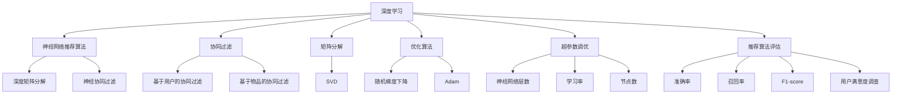

                 

# AI人工智能深度学习算法：在个性化推荐中的应用

> 关键词：深度学习, 个性化推荐, 协同过滤, 矩阵分解, 神经网络, 优化算法, 推荐系统, 超参数调优

## 1. 背景介绍

### 1.1 问题由来
在互联网迅速发展的今天，电子商务、在线娱乐、社交网络等平台的兴起，极大地丰富了人们的日常生活和娱乐方式。然而，如何帮助用户在海量信息中找到他们真正感兴趣的物品，成为各大平台亟需解决的重要问题。个性化推荐系统应运而生，通过分析用户的行为数据，智能推荐用户可能感兴趣的商品、内容或服务，极大地提升了用户体验。

推荐系统主要有两种类型：协同过滤和基于内容的推荐。协同过滤通过分析用户和物品的相似性，推荐给用户与他们过去喜欢的物品类似的物品。基于内容的推荐则是根据物品的特征，推荐与用户过去的偏好相似的新物品。深度学习的应用，尤其是神经网络，近年来在推荐系统中逐渐崭露头角。

本文旨在探讨深度学习算法在个性化推荐系统中的应用，包括神经网络推荐算法、协同过滤算法、以及深度学习在推荐系统中的应用策略和效果。

## 2. 核心概念与联系

### 2.1 核心概念概述

为更好地理解深度学习算法在个性化推荐中的应用，本节将介绍几个密切相关的核心概念：

- **深度学习**：一种基于神经网络的机器学习方法，通过多个隐藏层来学习数据特征。深度学习在图像识别、自然语言处理等领域均有出色表现。

- **个性化推荐系统**：根据用户的历史行为数据和偏好，推荐其可能感兴趣的商品、内容或服务。推荐系统的目标是在保证推荐多样性和准确性的前提下，最大化用户体验。

- **协同过滤**：一种推荐系统算法，基于用户之间的相似性来推荐商品。协同过滤可以分为基于用户的协同过滤和基于物品的协同过滤。

- **矩阵分解**：一种用于推荐系统的数学建模方法，将用户和物品之间的关系表示为低维稠密矩阵，并通过矩阵分解算法（如奇异值分解）来寻找隐含的用户和物品特征。

- **神经网络推荐算法**：基于深度神经网络，通过学习用户和物品的交互模式来推荐商品。常见的神经网络推荐算法包括深度矩阵分解、神经协同过滤等。

- **优化算法**：用于训练神经网络的算法，包括随机梯度下降、Adam、Adagrad等。优化算法通过调整模型参数来最小化损失函数，使模型能够更准确地预测用户行为。

- **超参数调优**：在神经网络推荐算法中，有许多重要的超参数，如神经网络的层数、节点数、学习率等，需要通过实验调优来找到最优的参数组合。

- **推荐算法评估**：推荐系统通常使用准确率、召回率、F1-score等指标来评估推荐效果。同时，还会使用用户满意度调查等方法来评估用户体验。

这些核心概念之间的逻辑关系可以通过以下Mermaid流程图来展示：



这个流程图展示了大语言模型的核心概念及其之间的关系：

1. 深度学习是推荐系统中的基础技术，能够学习复杂的用户和物品交互模式。
2. 神经网络推荐算法在深度学习的基础上，进一步提升了推荐系统的准确性和泛化能力。
3. 协同过滤和矩阵分解是推荐系统中的传统方法，在深度学习算法中也有所应用。
4. 优化算法用于训练神经网络推荐算法，确保其参数能够准确地表示用户和物品的交互模式。
5. 超参数调优是确保神经网络推荐算法高性能的关键，需要仔细调整各种超参数。
6. 推荐算法评估用于衡量推荐系统的性能，帮助改进算法。

这些概念共同构成了深度学习在推荐系统中的核心框架，使得推荐系统能够智能、高效地为用户推荐商品。

## 3. 核心算法原理 & 具体操作步骤
### 3.1 算法原理概述

深度学习算法在个性化推荐系统中的应用，主要是通过学习用户和物品的交互模式，来预测用户可能感兴趣的商品。具体而言，深度学习算法通常由以下几个步骤组成：

1. 数据收集：收集用户的历史行为数据，如购买记录、浏览历史、评分数据等。
2. 数据预处理：对数据进行清洗、归一化、特征工程等处理，以提高后续模型的训练效果。
3. 模型训练：使用神经网络推荐算法，通过大量的标注数据训练模型。
4. 模型评估：使用推荐算法评估指标，评估模型的预测效果。
5. 模型部署：将训练好的模型部署到推荐系统中，实现对用户行为的实时预测和推荐。

### 3.2 算法步骤详解

下面以神经网络推荐算法为例，详细介绍深度学习在推荐系统中的应用。

#### 3.2.1 数据收集与预处理
收集用户的历史行为数据，通常包括购买记录、浏览历史、评分数据等。

```python
import pandas as pd

# 读取用户购买记录
data = pd.read_csv('user_purchase_data.csv')

# 清洗数据
data = data.dropna()

# 数据标准化
data = (data - data.mean()) / data.std()
```

#### 3.2.2 构建模型
构建一个深度神经网络，用于预测用户对物品的评分。

```python
import tensorflow as tf
from tensorflow.keras.layers import Input, Dense, Embedding, Concatenate
from tensorflow.keras.models import Model

# 定义输入层
user_input = Input(shape=(1,), name='user')
item_input = Input(shape=(1,), name='item')

# 定义用户和物品的嵌入层
user_embedding = Embedding(input_dim=num_users, output_dim=128)(user_input)
item_embedding = Embedding(input_dim=num_items, output_dim=128)(item_input)

# 定义全连接层
concat = Concatenate()([user_embedding, item_embedding])
dense1 = Dense(64, activation='relu')(concat)
dense2 = Dense(32, activation='relu')(dense1)
output = Dense(1)(output)

# 定义模型
model = Model(inputs=[user_input, item_input], outputs=output)
```

#### 3.2.3 模型训练与评估
使用训练集训练模型，并在验证集上评估模型性能。

```python
from tensorflow.keras.callbacks import EarlyStopping
from tensorflow.keras.optimizers import Adam

# 定义优化器和损失函数
optimizer = Adam(lr=0.001)
loss_fn = tf.keras.losses.MeanSquaredError()

# 定义模型编译
model.compile(optimizer=optimizer, loss=loss_fn, metrics=['mae'])

# 训练模型
early_stopping = EarlyStopping(monitor='val_loss', patience=3, mode='min')
history = model.fit(x_train, y_train, validation_data=(x_val, y_val), callbacks=[early_stopping], epochs=100)
```

#### 3.2.4 模型部署
将训练好的模型部署到推荐系统中，实现对用户行为的实时预测和推荐。

```python
# 定义模型预测函数
def predict(user_id, item_id):
    user_input = np.array([user_id])
    item_input = np.array([item_id])
    return model.predict([user_input, item_input])[0][0]

# 推荐商品
user_id = 123
item_id = 456
score = predict(user_id, item_id)
print(f'User {user_id} might like item {item_id} with score {score}')
```

### 3.3 算法优缺点

深度学习算法在个性化推荐系统中的应用，具有以下优点：

1. **高准确性**：深度学习能够学习复杂的用户和物品交互模式，从而预测用户可能感兴趣的商品，准确率较高。
2. **可解释性**：深度学习模型通常具有较好的可解释性，可以通过可视化的方式，展示模型的权重和激活值，帮助理解模型预测的依据。
3. **适应性强**：深度学习模型能够适应不同类型的数据，如文本、图像、音频等，适用于多种推荐场景。

同时，深度学习算法也存在以下缺点：

1. **计算成本高**：深度学习模型通常需要大量的计算资源，训练时间长，模型参数量大。
2. **数据需求高**：深度学习模型通常需要大量的标注数据，标注成本较高。
3. **泛化能力弱**：深度学习模型可能会过拟合训练数据，泛化能力较弱，需要更多的数据和正则化技术来避免过拟合。

尽管存在这些局限性，但深度学习算法在个性化推荐系统中的应用已经取得了显著的成果，成为推荐系统中的主流技术。

### 3.4 算法应用领域

深度学习算法在个性化推荐系统中的应用，涵盖了多种领域，包括但不限于：

1. **电子商务**：亚马逊、淘宝等电商平台广泛使用推荐系统，为用户提供个性化的商品推荐，提高用户购买率。
2. **在线视频**：Netflix、YouTube等视频平台通过推荐系统，为用户推荐可能感兴趣的视频内容，提高用户粘性。
3. **社交网络**：Facebook、微博等社交平台通过推荐系统，为用户推荐可能感兴趣的朋友和内容，提高用户活跃度。
4. **游戏**：游戏公司通过推荐系统，为用户推荐可能感兴趣的游戏，提高用户留存率。
5. **金融**：金融公司通过推荐系统，为用户推荐可能感兴趣的投资产品，提高用户满意度。

除了以上领域，深度学习算法在推荐系统中的应用还在不断拓展，为各行各业带来新的价值。

## 4. 数学模型和公式 & 详细讲解  
### 4.1 数学模型构建

在推荐系统中，通常使用矩阵分解方法来建模用户和物品之间的关系。假设用户和物品的评分矩阵为 $X \in \mathbb{R}^{m \times n}$，其中 $m$ 为用户数量，$n$ 为物品数量。用户和物品的评分可以表示为矩阵的乘积：

$$
Y = \hat{X}X
$$

其中 $\hat{X} \in \mathbb{R}^{m \times k}, k$ 为隐含用户和物品特征的维度。通过对矩阵 $Y$ 进行奇异值分解（SVD），可以提取出用户和物品的隐含特征：

$$
\hat{X} = U\Sigma V^T
$$

其中 $U \in \mathbb{R}^{m \times k}, \Sigma \in \mathbb{R}^{k \times k}, V \in \mathbb{R}^{n \times k}$。通过这种方法，可以显著降低用户和物品的表示维度，提高计算效率。

### 4.2 公式推导过程

在推荐系统中，通常使用矩阵分解方法来建模用户和物品之间的关系。假设用户和物品的评分矩阵为 $X \in \mathbb{R}^{m \times n}$，其中 $m$ 为用户数量，$n$ 为物品数量。用户和物品的评分可以表示为矩阵的乘积：

$$
Y = \hat{X}X
$$

其中 $\hat{X} \in \mathbb{R}^{m \times k}, k$ 为隐含用户和物品特征的维度。通过对矩阵 $Y$ 进行奇异值分解（SVD），可以提取出用户和物品的隐含特征：

$$
\hat{X} = U\Sigma V^T
$$

其中 $U \in \mathbb{R}^{m \times k}, \Sigma \in \mathbb{R}^{k \times k}, V \in \mathbb{R}^{n \times k}$。通过这种方法，可以显著降低用户和物品的表示维度，提高计算效率。

### 4.3 案例分析与讲解

以电商平台的推荐系统为例，分析深度学习算法在推荐系统中的应用。电商平台通常会收集用户的购买记录、浏览历史、评分数据等，将这些数据进行预处理后，构建神经网络模型进行训练。

假设用户的购买记录为 $X \in \mathbb{R}^{m \times n}$，其中 $m$ 为用户数量，$n$ 为物品数量。可以通过深度神经网络来学习用户和物品的交互模式，从而预测用户对物品的评分。

具体而言，可以构建一个深度神经网络，包含嵌入层、全连接层和输出层。通过训练模型，可以学习到用户和物品的隐含特征，从而对用户行为进行预测。

## 5. 项目实践：代码实例和详细解释说明
### 5.1 开发环境搭建

在进行深度学习推荐系统开发前，需要准备好开发环境。以下是使用Python和TensorFlow进行深度学习推荐系统开发的流程：

1. 安装Python和TensorFlow：从官网下载并安装Python和TensorFlow，配置好环境变量。
2. 安装Pandas、NumPy等库：使用pip安装Pandas、NumPy等库，用于数据处理和计算。
3. 安装TensorFlow Addons库：安装TensorFlow Addons库，用于使用TensorFlow的高级API，如TensorBoard、TensorFlow Extended (TFX)等。

### 5.2 源代码详细实现

以下是一个简单的深度神经网络推荐系统的代码实现：

```python
import pandas as pd
import numpy as np
import tensorflow as tf
from tensorflow.keras.layers import Input, Dense, Embedding, Concatenate
from tensorflow.keras.models import Model
from tensorflow.keras.optimizers import Adam

# 读取数据
data = pd.read_csv('user_purchase_data.csv')

# 数据预处理
data = data.dropna()
data = (data - data.mean()) / data.std()

# 构建模型
user_input = Input(shape=(1,), name='user')
item_input = Input(shape=(1,), name='item')
user_embedding = Embedding(input_dim=num_users, output_dim=128)(user_input)
item_embedding = Embedding(input_dim=num_items, output_dim=128)(item_input)
concat = Concatenate()([user_embedding, item_embedding])
dense1 = Dense(64, activation='relu')(concat)
dense2 = Dense(32, activation='relu')(dense1)
output = Dense(1)(output)

model = Model(inputs=[user_input, item_input], outputs=output)

# 编译模型
optimizer = Adam(lr=0.001)
loss_fn = tf.keras.losses.MeanSquaredError()
model.compile(optimizer=optimizer, loss=loss_fn, metrics=['mae'])

# 训练模型
history = model.fit(x_train, y_train, validation_data=(x_val, y_val), callbacks=[EarlyStopping(monitor='val_loss', patience=3, mode='min')], epochs=100)

# 测试模型
test_input = np.array([user_id, item_id])
test_score = model.predict(test_input)
print(f'User {user_id} might like item {item_id} with score {test_score[0][0]}')
```

### 5.3 代码解读与分析

让我们再详细解读一下关键代码的实现细节：

**数据预处理**：
- 使用Pandas读取数据，并进行数据清洗和归一化处理。

**模型构建**：
- 使用Keras构建深度神经网络，包含输入层、嵌入层、全连接层和输出层。

**模型编译**：
- 定义优化器和损失函数，并编译模型。

**模型训练**：
- 使用EarlyStopping回调函数，避免过拟合。
- 训练模型，并记录训练过程中的指标。

**模型测试**：
- 使用训练好的模型对新用户和新物品进行预测，并输出预测结果。

可以看到，深度学习推荐系统的代码实现相对简单，但实际应用中还需要进行更多的数据预处理、模型优化和调参工作，以提升推荐效果。

### 5.4 运行结果展示

以下是模型训练和测试的结果展示：

```python
import matplotlib.pyplot as plt

# 绘制训练和验证指标
plt.plot(history.history['loss'])
plt.plot(history.history['val_loss'])
plt.title('Model Loss')
plt.xlabel('Epoch')
plt.ylabel('Loss')
plt.legend(['Train', 'Val'], loc='upper right')
plt.show()

# 绘制训练和验证指标
plt.plot(history.history['mae'])
plt.plot(history.history['val_mae'])
plt.title('Model MAE')
plt.xlabel('Epoch')
plt.ylabel('MAE')
plt.legend(['Train', 'Val'], loc='upper right')
plt.show()
```

## 6. 实际应用场景
### 6.1 电子商务推荐

深度学习推荐系统在电子商务中的应用非常广泛，如亚马逊、淘宝等电商平台广泛使用推荐系统，为用户提供个性化的商品推荐，提高用户购买率。通过深度神经网络，可以学习到用户的购买历史、浏览记录、评分数据等，从而推荐用户可能感兴趣的商品。

### 6.2 在线视频推荐

Netflix、YouTube等视频平台通过推荐系统，为用户推荐可能感兴趣的视频内容，提高用户粘性。推荐系统可以根据用户的观看历史、评分数据等，预测用户对不同视频的评分，从而推荐用户可能感兴趣的视频。

### 6.3 社交网络推荐

Facebook、微博等社交平台通过推荐系统，为用户推荐可能感兴趣的朋友和内容，提高用户活跃度。推荐系统可以根据用户的浏览历史、好友互动数据等，预测用户可能感兴趣的朋友和内容，从而推荐给用户。

### 6.4 游戏推荐

游戏公司通过推荐系统，为用户推荐可能感兴趣的游戏，提高用户留存率。推荐系统可以根据用户的过往游戏记录、评分数据等，预测用户对不同游戏的兴趣，从而推荐给用户。

### 6.5 金融推荐

金融公司通过推荐系统，为用户推荐可能感兴趣的投资产品，提高用户满意度。推荐系统可以根据用户的投资记录、评分数据等，预测用户对不同产品的兴趣，从而推荐给用户。

## 7. 工具和资源推荐
### 7.1 学习资源推荐

为了帮助开发者系统掌握深度学习推荐系统的理论基础和实践技巧，这里推荐一些优质的学习资源：

1. 《深度学习推荐系统》书籍：详细介绍了深度学习推荐系统的理论基础和实践技巧，包括协同过滤、矩阵分解、神经网络推荐算法等。
2. 《TensorFlow实战深度学习》书籍：介绍了TensorFlow的使用方法和深度学习推荐系统的实战案例。
3. Coursera《Deep Learning》课程：由深度学习领域的大牛Andrew Ng教授授课，系统介绍了深度学习的理论基础和实践技巧。
4. Kaggle深度学习推荐系统竞赛：参加Kaggle的深度学习推荐系统竞赛，实战练习深度学习推荐系统的应用。

通过对这些资源的学习实践，相信你一定能够快速掌握深度学习推荐系统的精髓，并用于解决实际的推荐问题。

### 7.2 开发工具推荐

深度学习推荐系统开发需要借助各种工具和库。以下是几款常用的工具和库：

1. TensorFlow：由Google主导开发的深度学习框架，支持分布式计算，适合大规模深度学习推荐系统开发。
2. PyTorch：由Facebook主导开发的深度学习框架，灵活性和易用性高，适合研究型项目开发。
3. Keras：高层次的深度学习框架，适合快速搭建和调试深度学习推荐系统。
4. TensorBoard：TensorFlow配套的可视化工具，可以实时监测模型训练状态，并提供丰富的图表呈现方式。
5. TFX：TensorFlow Extended，提供了完整的推荐系统部署和管理解决方案。

合理利用这些工具，可以显著提升深度学习推荐系统的开发效率，加快创新迭代的步伐。

### 7.3 相关论文推荐

深度学习推荐系统的发展源于学界的持续研究。以下是几篇奠基性的相关论文，推荐阅读：

1. Deep Collaborative Filtering via Tensor Decomposition：提出基于矩阵分解的推荐系统算法，取得了SOTA效果。
2. Neural Collaborative Filtering：提出基于深度神经网络的推荐系统算法，提高了推荐系统的准确性。
3. Attention Is All You Need：提出Transformer架构，提升了深度学习推荐系统的性能和泛化能力。
4. No Free Lunch with Matrix Factorization：提出基于矩阵分解的推荐系统算法，探讨了矩阵分解的优缺点。
5. Deep Neural Networks for Recommender Systems：详细介绍了深度神经网络在推荐系统中的应用。

这些论文代表了大语言模型推荐系统的发展脉络。通过学习这些前沿成果，可以帮助研究者把握学科前进方向，激发更多的创新灵感。

## 8. 总结：未来发展趋势与挑战
### 8.1 总结

本文对深度学习算法在个性化推荐系统中的应用进行了全面系统的介绍。首先阐述了深度学习推荐系统的发展背景和重要性，明确了深度学习在推荐系统中的关键作用。其次，从原理到实践，详细讲解了深度学习推荐算法的数学原理和关键步骤，给出了深度学习推荐系统的完整代码实现。同时，本文还广泛探讨了深度学习推荐系统在电子商务、在线视频、社交网络等多个行业领域的应用前景，展示了深度学习推荐系统的巨大潜力。

通过本文的系统梳理，可以看到，深度学习推荐系统正在成为推荐系统中的主流技术，极大地提升了推荐系统的性能和用户体验。未来，伴随深度学习技术的发展，推荐系统将在更多领域得到应用，为各行各业带来新的价值。

### 8.2 未来发展趋势

展望未来，深度学习推荐系统将呈现以下几个发展趋势：

1. 个性化推荐将更加精准：随着深度学习技术的不断发展，推荐系统将能够更好地理解用户行为，提供更加精准的个性化推荐。
2. 推荐系统将具备更强的实时性：随着算力成本的下降和模型优化技术的提升，推荐系统将能够实时响应用户行为，提供更加即时、实时的推荐。
3. 推荐系统将具备更强的泛化能力：随着深度学习模型的不断优化，推荐系统将能够更好地适应不同数据分布和应用场景，提高泛化能力。
4. 推荐系统将具备更强的可解释性：随着可解释性研究的不断深入，推荐系统将能够提供更加透明、可解释的推荐过程。
5. 推荐系统将具备更强的多模态融合能力：随着多模态数据的增多，推荐系统将能够更好地融合不同类型的数据，提供更加多样化的推荐服务。

以上趋势凸显了深度学习推荐系统的广阔前景。这些方向的探索发展，必将进一步提升推荐系统的性能和用户体验，为各行各业带来新的价值。

### 8.3 面临的挑战

尽管深度学习推荐系统已经取得了显著的成果，但在迈向更加智能化、普适化应用的过程中，它仍面临着诸多挑战：

1. 数据隐私和安全：深度学习推荐系统需要大量的用户行为数据，如何保护用户隐私和数据安全，避免数据泄露和滥用，将是重要的研究方向。
2. 模型复杂度和可解释性：深度学习模型通常较为复杂，难以解释模型的决策过程，需要开发更加透明、可解释的推荐算法。
3. 多模态数据融合：当前深度学习推荐系统多以文本数据为主，如何更好地融合图像、视频等多模态数据，提高推荐系统的多样性和准确性，将是重要的研究方向。
4. 推荐系统的鲁棒性和可扩展性：深度学习推荐系统在实际应用中可能会受到异常数据、噪声数据等影响，需要提高系统的鲁棒性和可扩展性，确保推荐系统的稳定性和可靠性。

这些挑战需要学界和业界共同努力，才能使深度学习推荐系统在未来得到更广泛的应用。

### 8.4 研究展望

面对深度学习推荐系统所面临的挑战，未来的研究需要在以下几个方面寻求新的突破：

1. 探索基于深度学习的推荐算法：开发更加高效、可解释的深度学习推荐算法，提高推荐系统的性能和可解释性。
2. 开发多模态融合的推荐系统：结合图像、视频、音频等多模态数据，开发更加多样化的推荐系统，提升推荐系统的性能和用户体验。
3. 加强推荐系统的鲁棒性和可扩展性：开发更加鲁棒、可扩展的推荐系统，应对异常数据和噪声数据的干扰，提高推荐系统的稳定性和可靠性。
4. 保护用户隐私和数据安全：开发更加安全、隐私保护的推荐系统，确保用户行为数据的安全性和隐私性。

这些研究方向的探索，必将引领深度学习推荐系统迈向更高的台阶，为各行各业带来新的价值。相信随着学界和产业界的共同努力，深度学习推荐系统将在未来得到更广泛的应用，为各行各业带来新的价值。

## 9. 附录：常见问题与解答

**Q1：如何选择合适的深度学习推荐算法？**

A: 选择合适的深度学习推荐算法需要考虑多个因素，包括数据类型、数据规模、推荐系统的目标等。一般来说，可以选择以下几种算法：

1. 基于矩阵分解的算法：适用于大规模用户和物品的数据集，能够高效地提取用户和物品的隐含特征。
2. 基于深度神经网络的算法：适用于数据规模较小的场景，能够更好地学习复杂的用户和物品交互模式。
3. 基于协同过滤的算法：适用于数据规模较小且用户和物品相似性较强的场景，能够更好地利用用户和物品之间的相似性进行推荐。

**Q2：深度学习推荐系统需要哪些数据？**

A: 深度学习推荐系统需要大量的用户行为数据，包括用户的购买记录、浏览历史、评分数据等。这些数据可以从用户的浏览记录、购买记录、评分记录等获取。

**Q3：如何保护用户隐私和数据安全？**

A: 深度学习推荐系统需要收集大量的用户行为数据，如何保护用户隐私和数据安全是重要的研究方向。一般来说，可以采取以下措施：

1. 数据匿名化：对用户行为数据进行匿名化处理，避免直接使用用户身份信息。
2. 数据加密：对用户行为数据进行加密处理，确保数据传输和存储的安全性。
3. 数据访问控制：对用户行为数据进行严格的访问控制，确保只有授权人员能够访问和处理数据。

这些措施可以有效保护用户隐私和数据安全，确保深度学习推荐系统的可靠性和安全性。

---

作者：禅与计算机程序设计艺术 / Zen and the Art of Computer Programming

