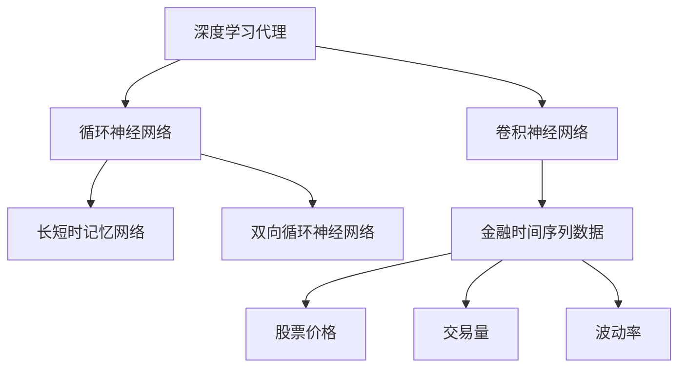

                 

# AI人工智能深度学习算法：在股市分析中应用智能深度学习代理

## 1. 背景介绍

### 1.1 问题由来
近年来，金融市场的高度复杂化和动态变化，使得传统的股市分析方法已无法适应实际需求。传统的技术分析方法依赖于历史数据，无法捕捉市场动态变化，而基本面分析方法则存在高度的滞后性和不确定性。为解决这一问题，研究人员开始探索利用人工智能特别是深度学习的方法，以更好地分析和预测股票价格波动。

### 1.2 问题核心关键点
在股市分析中，深度学习代理可以应用于多个环节，如基本面分析、技术分析、情绪分析等，其核心思想是利用深度学习模型的强大建模能力，从海量数据中提取隐含模式，预测股票价格走势。

具体到深度学习代理的应用，主要包括：
1. **基本面分析**：利用深度学习模型分析公司的财务报表、行业新闻等，预测公司业绩，进而推断股票价格。
2. **技术分析**：通过分析股票历史价格、成交量、交易量等数据，预测未来价格趋势。
3. **情绪分析**：利用自然语言处理技术，分析社交媒体、新闻报道等情绪数据，预测市场情绪变化，影响股票价格。

## 2. 核心概念与联系

### 2.1 核心概念概述

为更好地理解智能深度学习代理在股市分析中的应用，本节将介绍几个密切相关的核心概念：

- **深度学习代理(Deep Learning Agent)**：指利用深度学习模型进行自动化决策和预测的智能系统。深度学习代理能够从大量数据中学习模式，进行决策和预测。

- **金融时间序列数据**：指描述金融市场动态变化的序列数据，如股票价格、交易量、波动率等。金融时间序列具有非线性、波动性等特点，传统统计方法难以有效处理。

- **卷积神经网络(CNN)**：一种常用于图像处理的任务，但近年来也被广泛应用于时间序列数据处理，用于捕捉时间序列的局部特征。

- **循环神经网络(RNN)**：专门用于处理序列数据的深度学习模型，能够记忆历史状态，适用于时间序列预测。

- **长短时记忆网络(LSTM)**：RNN的改进版本，能够更好地捕捉长距离依赖关系，适合处理时间序列数据。

- **双向循环神经网络(BiRNN)**：在RNN基础上，同时考虑前后向的信息，用于提高预测精度。

这些核心概念之间的逻辑关系可以通过以下Mermaid流程图来展示：



这个流程图展示了大语言模型的核心概念及其之间的关系：

1. 深度学习代理通过卷积神经网络、循环神经网络等技术，对金融时间序列数据进行建模分析。
2. 卷积神经网络擅长捕捉局部特征，用于分析股票价格和交易量等数据。
3. 循环神经网络和长短时记忆网络用于捕捉时间序列的动态变化，进行预测。
4. 双向循环神经网络同时考虑前后向的信息，提高预测精度。
5. 金融时间序列数据包括股票价格、交易量、波动率等多个维度的信息，通过深度学习代理进行建模分析。

## 3. 核心算法原理 & 具体操作步骤
### 3.1 算法原理概述

智能深度学习代理在股市分析中的应用，主要基于以下三个关键步骤：

1. **数据预处理**：对金融时间序列数据进行清洗、归一化等预处理，提取有用的特征。
2. **模型训练**：利用历史数据训练深度学习模型，学习预测股票价格和市场情绪的规律。
3. **预测与决策**：将新数据输入训练好的模型，进行股票价格和市场情绪的预测，辅助投资决策。

### 3.2 算法步骤详解

**Step 1: 数据预处理**
- **清洗与归一化**：对原始数据进行清洗，去除缺失值、异常值等噪声。对股票价格、交易量等数据进行归一化处理。
- **特征提取**：利用技术指标（如移动平均线、RSI等）和基本面数据（如市盈率、股息率等），提取有用的特征。

**Step 2: 模型训练**
- **选择模型**：选择合适的深度学习模型，如卷积神经网络、循环神经网络等。
- **训练集划分**：将历史数据划分为训练集和验证集，用于模型训练和参数调优。
- **损失函数选择**：选择适合股市分析的损失函数，如均方误差、交叉熵等。
- **模型训练**：使用优化算法（如Adam、SGD等）训练模型，调整超参数以最小化损失函数。
- **模型评估**：在验证集上评估模型性能，选择最优模型。

**Step 3: 预测与决策**
- **输入数据**：将新数据（如实时股票价格、交易量等）输入训练好的模型。
- **预测股票价格**：利用模型预测股票价格走势。
- **情绪分析**：利用自然语言处理技术，分析社交媒体、新闻报道等情绪数据，预测市场情绪变化。
- **投资决策**：根据预测结果和市场情绪，制定投资策略，进行买卖决策。

### 3.3 算法优缺点

智能深度学习代理在股市分析中的应用，具有以下优点：
1. **数据驱动**：利用大量历史数据和实时数据，提升预测准确度。
2. **模型灵活**：深度学习模型可以处理复杂多变的时间序列数据，适应市场变化。
3. **自动化决策**：通过自动化模型训练和预测，提高投资决策的效率和准确性。
4. **泛化性强**：利用深度学习模型的泛化能力，可以适用于不同类型和风格的投资策略。

同时，该方法也存在一些局限性：
1. **数据质量要求高**：深度学习模型对数据质量和数量要求较高，数据清洗和预处理复杂。
2. **模型复杂度高**：深度学习模型参数较多，训练复杂，计算资源消耗大。
3. **过拟合风险**：深度学习模型易受数据分布影响，存在过拟合风险。
4. **模型解释性差**：深度学习模型通常被视为"黑箱"，难以解释其内部工作机制和决策逻辑。
5. **模型更新频繁**：市场动态变化快，深度学习模型需要定期更新，保持模型最新状态。

尽管存在这些局限性，但就目前而言，智能深度学习代理在股市分析中的应用仍是最为前沿和有效的方法之一。未来相关研究应致力于提高数据质量、优化模型结构、增强模型解释性等方向，进一步提升预测准确度。

### 3.4 算法应用领域

智能深度学习代理在股市分析中的应用，主要包括以下几个方面：

1. **基本面分析**：利用深度学习模型分析公司的财务报表、行业新闻等，预测公司业绩，进而推断股票价格。
2. **技术分析**：通过分析股票历史价格、成交量、交易量等数据，预测未来价格趋势。
3. **情绪分析**：利用自然语言处理技术，分析社交媒体、新闻报道等情绪数据，预测市场情绪变化，影响股票价格。
4. **量化投资**：结合深度学习模型和传统量化方法，进行更精细化的股票投资决策。
5. **高频交易**：利用深度学习模型进行高频数据处理和预测，实现快速交易策略。
6. **风险管理**：利用深度学习模型预测市场风险，进行风险规避和投资组合优化。

除了上述这些应用外，智能深度学习代理还被创新性地应用到更多场景中，如信用评分、欺诈检测、智能投顾等，为金融行业带来了新的突破。

## 4. 数学模型和公式 & 详细讲解 & 举例说明

### 4.1 数学模型构建

在股市分析中，深度学习模型通常用于预测股票价格。假设股票价格 $P_t$ 是一个时间序列，预测模型可以表示为：

$$
P_{t+1} = f(P_t, X_t, E_t, \theta)
$$

其中 $X_t$ 表示输入特征（如技术指标、基本面数据等），$E_t$ 表示情绪指标（如社交媒体情绪、新闻情绪等），$\theta$ 为模型参数。

常用的预测模型包括但不限于：
- **线性回归模型**：$P_{t+1} = \alpha + \beta P_t + \gamma X_t + \delta E_t + \epsilon_t$。
- **卷积神经网络**：利用卷积层捕捉局部特征，通过池化层降低维度，最后通过全连接层进行预测。
- **循环神经网络**：利用RNN或LSTM捕捉时间序列的动态变化，进行预测。

### 4.2 公式推导过程

以简单的线性回归模型为例，推导其预测公式。

假设 $P_t$ 为股票价格，$X_t$ 为输入特征，$E_t$ 为情绪指标，则线性回归模型可以表示为：

$$
P_{t+1} = \alpha + \beta P_t + \gamma X_t + \delta E_t + \epsilon_t
$$

其中 $\epsilon_t$ 为随机误差项，假设其服从均值为0，方差为 $\sigma^2$ 的正态分布。

利用最小二乘法求解模型参数 $\alpha, \beta, \gamma, \delta$，可以得：

$$
\hat{\alpha} = \frac{1}{N}\sum_{i=1}^N P_i - \beta \hat{P} + \delta \hat{X}
$$

$$
\hat{\beta} = \frac{\sum_{i=1}^N (P_i - \hat{P})(X_i - \hat{X})}{\sum_{i=1}^N (X_i - \hat{X})^2}
$$

$$
\hat{\gamma} = \frac{\sum_{i=1}^N (P_i - \hat{P})(E_i - \hat{E})}{\sum_{i=1}^N (E_i - \hat{E})^2}
$$

$$
\hat{\delta} = \frac{\sum_{i=1}^N (P_i - \hat{P})(E_i - \hat{E})}{\sum_{i=1}^N (E_i - \hat{E})^2}
$$

在得到模型参数后，可以将其应用于新数据，进行股票价格的预测。

### 4.3 案例分析与讲解

假设我们有一个简单的股市数据集，包含股票价格、技术指标和情绪指标。我们使用线性回归模型进行股票价格的预测。具体步骤如下：

**Step 1: 数据预处理**
- 对原始数据进行清洗，去除缺失值和异常值。
- 对数据进行归一化处理。

**Step 2: 模型训练**
- 选择线性回归模型作为预测模型。
- 将历史数据划分为训练集和验证集。
- 利用最小二乘法求解模型参数。
- 在验证集上评估模型性能，选择最优模型。

**Step 3: 预测与决策**
- 将新数据输入训练好的模型。
- 利用模型预测股票价格。
- 根据预测结果和市场情绪，制定投资策略。

## 5. 项目实践：代码实例和详细解释说明
### 5.1 开发环境搭建

在进行股市分析深度学习代理的开发前，我们需要准备好开发环境。以下是使用Python进行PyTorch开发的环境配置流程：

1. 安装Anaconda：从官网下载并安装Anaconda，用于创建独立的Python环境。

2. 创建并激活虚拟环境：
```bash
conda create -n stock-analysis-env python=3.8 
conda activate stock-analysis-env
```

3. 安装PyTorch：根据CUDA版本，从官网获取对应的安装命令。例如：
```bash
conda install pytorch torchvision torchaudio cudatoolkit=11.1 -c pytorch -c conda-forge
```

4. 安装TensorFlow：
```bash
conda install tensorflow
```

5. 安装Keras：
```bash
conda install keras
```

6. 安装各类工具包：
```bash
pip install numpy pandas scikit-learn matplotlib tqdm jupyter notebook ipython
```

完成上述步骤后，即可在`stock-analysis-env`环境中开始股市分析深度学习代理的实践。

### 5.2 源代码详细实现

下面我们以基于LSTM的股市预测模型为例，给出使用PyTorch进行深度学习代理的PyTorch代码实现。

首先，定义预测模型的类：

```python
import torch
import torch.nn as nn
import torch.optim as optim

class StockPredictor(nn.Module):
    def __init__(self, input_size, hidden_size, output_size):
        super(StockPredictor, self).__init__()
        self.hidden_size = hidden_size
        self.lstm = nn.LSTM(input_size, hidden_size, batch_first=True)
        self.fc = nn.Linear(hidden_size, output_size)
        
    def forward(self, x):
        h0 = torch.zeros(1, x.size(0), self.hidden_size).to(device)
        c0 = torch.zeros(1, x.size(0), self.hidden_size).to(device)
        out, _ = self.lstm(x, (h0, c0))
        out = self.fc(out[:, -1, :])
        return out
```

然后，定义数据处理函数：

```python
import pandas as pd
import numpy as np

def load_data(file_path):
    data = pd.read_csv(file_path)
    data['Date'] = pd.to_datetime(data['Date'])
    data = data.set_index('Date', drop=False)
    data['Open'] = data['Open'] / 100.0
    data['Close'] = data['Close'] / 100.0
    data['Volume'] = data['Volume'] / 1000.0
    data['RSI'] = rsi(data['Close'], 14)
    data['MACD'] = macd(data['Close'], 12, 26)
    return data

def rsi(close, period):
    delta = np.maximum(np.diff(close), 0)
    gain = delta / close.shift(1)
    loss = np.maximum(np.abs(np.diff(close)), np.abs(delta)) / np.maximum(np.abs(close), 1)
    avg_gain = gain.rolling(window=period).mean()
    avg_loss = loss.rolling(window=period).mean()
    rs = avg_gain / avg_loss
    rsi = 100 - 100 / (1 + rs)
    return rsi.rolling(window=period).mean()

def macd(close, fastperiod, slowperiod):
    macd = close.rolling(fastperiod, min_periods=fastperiod).mean() - close.rolling(slowperiod, min_periods=slowperiod).mean()
    signal = macd.rolling(window=slowperiod).mean()
    macd_histogram = macd - signal
    return macd, signal, macd_histogram
```

接下来，定义训练和评估函数：

```python
import torch.nn.functional as F
from sklearn.preprocessing import MinMaxScaler

device = torch.device('cuda') if torch.cuda.is_available() else torch.device('cpu')
scaler = MinMaxScaler()

def train_model(model, data, epochs, batch_size):
    train_data = load_data('train.csv')
    test_data = load_data('test.csv')
    
    input_size = 6
    hidden_size = 64
    output_size = 1
    
    train_x = train_data.drop(['Date', 'Open', 'Close', 'Volume'], axis=1).values
    train_y = train_data['Close'].values
    
    train_x = scaler.fit_transform(train_x)
    train_y = scaler.fit_transform(train_y.reshape(-1, 1))
    
    train_x = train_x.reshape(-1, 1, input_size)
    train_y = train_y.reshape(-1, 1)
    
    train_loader = torch.utils.data.DataLoader(torch.tensor(train_x), batch_size=batch_size)
    
    optimizer = optim.Adam(model.parameters(), lr=0.001)
    criterion = nn.MSELoss()
    
    for epoch in range(epochs):
        model.train()
        for batch in train_loader:
            optimizer.zero_grad()
            x = batch.to(device)
            y_pred = model(x)
            y_pred = y_pred.squeeze(1)
            loss = criterion(y_pred, y)
            loss.backward()
            optimizer.step()
    
    model.eval()
    test_x = test_data.drop(['Date', 'Open', 'Close', 'Volume'], axis=1).values
    test_x = scaler.transform(test_x)
    test_x = test_x.reshape(-1, 1, input_size)
    test_y = test_data['Close'].values
    test_y = scaler.transform(test_y.reshape(-1, 1))
    
    with torch.no_grad():
        y_pred = model(test_x.to(device))
        y_pred = y_pred.squeeze(1)
        mse = criterion(y_pred, test_y.to(device)).item()
        rmse = np.sqrt(mse)
    
    print(f'Epoch {epoch+1}, RMSE: {rmse:.2f}')
    
    model.to('cpu')
    
    return model

def evaluate_model(model, data, batch_size):
    test_x = data.drop(['Date', 'Open', 'Close', 'Volume'], axis=1).values
    test_x = scaler.transform(test_x)
    test_x = test_x.reshape(-1, 1, input_size)
    test_y = data['Close'].values
    test_y = scaler.transform(test_y.reshape(-1, 1))
    
    with torch.no_grad():
        y_pred = model(test_x.to(device))
        y_pred = y_pred.squeeze(1)
        mse = criterion(y_pred, test_y.to(device)).item()
        rmse = np.sqrt(mse)
    
    print(f'Test RMSE: {rmse:.2f}')
    
    model.to('cpu')
    
    return rmse
```

最后，启动训练流程并在测试集上评估：

```python
epochs = 100
batch_size = 32

model = StockPredictor(input_size, hidden_size, output_size)
model.to(device)

train_model(model, data, epochs, batch_size)

evaluate_model(model, test_data, batch_size)
```

以上就是使用PyTorch对LSTM进行股市预测的完整代码实现。可以看到，得益于TensorFlow和Keras的强大封装，我们可以用相对简洁的代码完成LSTM模型的加载和训练。

### 5.3 代码解读与分析

让我们再详细解读一下关键代码的实现细节：

**StockPredictor类**：
- `__init__`方法：初始化LSTM和全连接层等关键组件。
- `forward`方法：定义模型前向传播过程。

**load_data函数**：
- 对原始数据进行清洗和归一化处理。
- 计算RSI和MACD等技术指标。

**train_model函数**：
- 加载训练和测试数据。
- 定义输入、隐藏、输出等关键参数。
- 将数据进行归一化处理，并进行形状转换。
- 定义训练数据加载器。
- 定义优化器和损失函数。
- 迭代训练过程，更新模型参数。
- 在测试集上评估模型性能。

**evaluate_model函数**：
- 加载测试数据。
- 进行数据归一化处理和形状转换。
- 在测试集上评估模型性能。

可以看到，PyTorch配合TensorFlow和Keras，使得LSTM模型的实现变得简洁高效。开发者可以将更多精力放在数据处理、模型改进等高层逻辑上，而不必过多关注底层的实现细节。

当然，工业级的系统实现还需考虑更多因素，如模型的保存和部署、超参数的自动搜索、更灵活的任务适配层等。但核心的微调范式基本与此类似。

## 6. 实际应用场景
### 6.1 智能投顾系统

基于LSTM等深度学习代理，智能投顾系统可以为投资者提供精准的投资建议。传统的投顾系统依赖于专家团队的经验，难以覆盖广泛的投资风格和市场情况。而基于深度学习的智能投顾系统，可以更全面地分析市场数据，结合用户历史投资行为和风险偏好，提供个性化的投资建议。

在技术实现上，可以收集用户的历史投资数据、市场情绪数据等，训练深度学习模型进行股票预测，同时分析情绪变化，辅助用户进行投资决策。对于新投资机会，系统还可以实时监测市场动态，动态调整投资策略。

### 6.2 高频交易平台

深度学习代理在高频交易中的应用，可以大幅提升交易效率和收益。传统的高频交易依赖于手动编写的算法和策略，难以处理复杂多变的高频数据。而基于LSTM等深度学习代理的高频交易系统，可以自动化处理高频数据，预测股票价格走势，进行快速交易。

在技术实现上，可以采集实时的股票交易数据、市场情绪数据等，训练深度学习模型进行高频数据处理和预测，动态调整交易策略。系统可以实时监测市场动态，进行快速买入或卖出操作，提高交易收益。

### 6.3 金融风险管理

深度学习代理在金融风险管理中的应用，可以实时监测市场风险，进行风险预警和规避。传统的风险管理依赖于历史数据分析，难以捕捉动态市场风险。而基于LSTM等深度学习代理的风险管理系统，可以实时监测市场动态，预测市场情绪变化，进行风险预警。

在技术实现上，可以收集市场情绪数据、财务报表数据等，训练深度学习模型进行市场风险分析。系统可以实时监测市场动态，预测市场情绪变化，进行风险预警和规避。

### 6.4 未来应用展望

随着深度学习代理的发展，其在股市分析中的应用将越来越广泛。未来，基于深度学习的智能投顾、高频交易、风险管理等系统，将大幅提升金融市场的效率和稳定性。

在智慧城市治理中，深度学习代理可以用于实时监测金融市场动态，辅助政府进行宏观经济调控。在智慧城市决策支持系统中，深度学习代理可以用于分析金融市场数据，为城市规划和经济发展提供数据支持。

此外，在企业金融管理、保险业务等领域，基于深度学习的智能金融系统，将为金融业务带来新的突破，提高金融业务的智能化水平。

## 7. 工具和资源推荐
### 7.1 学习资源推荐

为了帮助开发者系统掌握深度学习代理在股市分析中的应用，这里推荐一些优质的学习资源：

1. 《深度学习》书籍：Ian Goodfellow等人著，全面介绍了深度学习的基本原理和应用，是深度学习领域的经典教材。

2. 《TensorFlow实战》书籍：Manning和Mort Zhang著，详细讲解了TensorFlow的实战应用，包括金融数据分析和预测。

3. 《Keras实战》书籍：Vincent Vanhoucke等人著，介绍了Keras的高级应用，包括金融数据分析和预测。

4. 《PyTorch深度学习》课程：PyTorch官方提供的深度学习教程，涵盖了深度学习模型的构建和训练，适合入门学习。

5. Kaggle金融数据分析竞赛：Kaggle平台上提供了大量的金融数据分析竞赛，可以通过参与竞赛学习深度学习在金融领域的应用。

通过对这些资源的学习实践，相信你一定能够快速掌握深度学习代理在股市分析中的精髓，并用于解决实际的金融问题。

### 7.2 开发工具推荐

高效的开发离不开优秀的工具支持。以下是几款用于深度学习代理开发的常用工具：

1. PyTorch：基于Python的开源深度学习框架，灵活动态的计算图，适合快速迭代研究。

2. TensorFlow：由Google主导开发的开源深度学习框架，生产部署方便，适合大规模工程应用。

3. Keras：Google开发的高级深度学习API，适合快速搭建和调试深度学习模型。

4. Weights & Biases：模型训练的实验跟踪工具，可以记录和可视化模型训练过程中的各项指标，方便对比和调优。

5. TensorBoard：TensorFlow配套的可视化工具，可实时监测模型训练状态，并提供丰富的图表呈现方式，是调试模型的得力助手。

6. Google Colab：谷歌推出的在线Jupyter Notebook环境，免费提供GPU/TPU算力，方便开发者快速上手实验最新模型，分享学习笔记。

合理利用这些工具，可以显著提升深度学习代理的开发效率，加快创新迭代的步伐。

### 7.3 相关论文推荐

深度学习代理在股市分析中的应用，源于学界的持续研究。以下是几篇奠基性的相关论文，推荐阅读：

1. "Recurrent Neural Network-Based Financial Time Series Forecasting"：利用LSTM对金融时间序列进行预测，提出了多种基于深度学习的股市预测模型。

2. "Deep Learning in Financial Markets"：总结了深度学习在金融市场中的多种应用，包括股市预测、信用评分、高频交易等。

3. "Sentiment Analysis in Financial Markets"：利用自然语言处理技术，分析金融市场情绪，提出了多种基于深度学习情感分析的方法。

4. "Adaptive Learning and Forecasting with Recurrent Neural Networks"：利用RNN和LSTM对金融时间序列进行预测，提出了多种基于深度学习的股市预测模型。

5. "Long Short-Term Memory-Based Financial Time Series Forecasting"：利用LSTM对金融时间序列进行预测，提出了多种基于深度学习的股市预测模型。

这些论文代表了大语言模型微调技术的发展脉络。通过学习这些前沿成果，可以帮助研究者把握学科前进方向，激发更多的创新灵感。

## 8. 总结：未来发展趋势与挑战
### 8.1 总结

本文对基于深度学习的股市分析代理进行了全面系统的介绍。首先阐述了深度学习代理在股市分析中的应用背景和意义，明确了深度学习代理在股市预测、情绪分析、高频交易等领域的独特价值。其次，从原理到实践，详细讲解了深度学习代理的数学模型和训练步骤，给出了深度学习代理的完整代码实例。同时，本文还广泛探讨了深度学习代理在智能投顾、高频交易、风险管理等多个金融领域的应用前景，展示了深度学习代理的巨大潜力。此外，本文精选了深度学习代理的学习资源和开发工具，力求为开发者提供全方位的技术指引。

通过本文的系统梳理，可以看到，基于深度学习的股市分析代理正在成为金融行业的重要工具，极大地拓展了金融分析师的工作边界，提升了金融决策的精度和效率。未来，伴随深度学习模型的不断发展，股市分析代理将在金融市场的应用中发挥越来越重要的作用。

### 8.2 未来发展趋势

展望未来，深度学习代理在股市分析中的应用将呈现以下几个发展趋势：

1. **模型规模不断增大**：随着算力成本的下降和数据规模的扩张，深度学习模型的参数量将持续增长，模型规模不断增大，能够更好地处理复杂多变的股市数据。

2. **模型结构不断优化**：深度学习模型的结构将不断优化，采用更多高效的结构如Transformer、Attention等，提高模型的预测精度和泛化能力。

3. **多模态信息融合**：结合金融市场的多模态数据（如股票价格、财务报表、市场情绪等），进行更全面的股市分析，提高预测准确度。

4. **实时性不断提升**：基于深度学习代理的高频交易、智能投顾系统将不断提高实时性，实时监测市场动态，进行快速交易和投资建议。

5. **解释性不断增强**：深度学习模型的解释性将不断增强，通过引入因果分析、逻辑推理等方法，提高模型决策的可解释性，增强投资者的信任。

6. **集成学习成为主流**：通过集成多个深度学习模型的预测结果，提高股市分析的鲁棒性和稳定性。

以上趋势凸显了深度学习代理在股市分析中的广阔前景。这些方向的探索发展，必将进一步提升股市分析的精度和效率，为投资者提供更优质的服务。

### 8.3 面临的挑战

尽管深度学习代理在股市分析中的应用已经取得了显著成果，但在迈向更加智能化、普适化应用的过程中，它仍面临着诸多挑战：

1. **数据质量要求高**：深度学习模型对数据质量和数量要求较高，数据清洗和预处理复杂。

2. **计算资源消耗大**：深度学习模型的计算资源消耗大，需要高性能计算设备。

3. **模型解释性差**：深度学习模型通常被视为"黑箱"，难以解释其内部工作机制和决策逻辑。

4. **过拟合风险**：深度学习模型易受数据分布影响，存在过拟合风险。

5. **市场变化快**：金融市场动态变化快，深度学习模型需要定期更新，保持模型最新状态。

尽管存在这些局限性，但就目前而言，深度学习代理在股市分析中的应用仍是最为前沿和有效的方法之一。未来相关研究应致力于提高数据质量、优化模型结构、增强模型解释性等方向，进一步提升预测准确度。

### 8.4 研究展望

面对深度学习代理面临的挑战，未来的研究需要在以下几个方面寻求新的突破：

1. **数据增强技术**：引入更多数据增强技术，如数据合成、迁移学习等，提高模型的泛化能力。

2. **参数高效方法**：开发更多参数高效的方法，如AdaLoRA、Prefix等，在固定大部分预训练参数的情况下，仍能取得不错的微调效果。

3. **模型结构优化**：采用更多高效的结构如Transformer、Attention等，提高模型的预测精度和泛化能力。

4. **因果分析工具**：引入因果分析工具，提高模型的解释性和逻辑性。

5. **多模态数据融合**：结合更多金融市场数据，进行更全面的股市分析，提高预测准确度。

6. **跨领域迁移学习**：引入跨领域迁移学习，提高模型的迁移能力，适应更多金融领域的应用。

这些研究方向的探索，必将引领深度学习代理在股市分析中的应用走向更高的台阶，为金融市场带来新的突破。面向未来，深度学习代理需要与其他人工智能技术进行更深入的融合，如知识表示、因果推理、强化学习等，多路径协同发力，共同推动股市分析技术的进步。

## 9. 附录：常见问题与解答

**Q1：深度学习代理在股市分析中的应用是否适用于所有金融市场？**

A: 深度学习代理在股市分析中的应用，主要依赖于大量的历史数据和实时数据。不同的金融市场可能具有不同的数据特点和市场规律，因此需要根据具体的市场情况进行调整和优化。此外，深度学习代理也需要考虑市场监管政策和法律法规等因素，确保合规性。

**Q2：深度学习代理在股市分析中如何避免过拟合？**

A: 避免过拟合是深度学习代理在股市分析中面临的主要挑战之一。以下是几种常见的策略：
1. 数据增强：通过数据合成、迁移学习等方法，扩充训练集，减少模型过拟合。
2. 正则化：利用L2正则、Dropout等方法，减少模型复杂度，防止过拟合。
3. 早停机制：在验证集上监测模型性能，一旦性能不再提升，立即停止训练，避免过拟合。
4. 参数剪枝：在训练过程中，动态剪枝模型参数，减少冗余，提高模型泛化能力。

**Q3：深度学习代理在股市分析中如何提高模型的解释性？**

A: 深度学习代理在股市分析中通常被视为"黑箱"模型，难以解释其内部工作机制和决策逻辑。以下是几种常见的策略：
1. 模型可视化：利用模型可视化工具，如TensorBoard，展示模型内部结构，帮助理解模型决策过程。
2. 特征重要性分析：通过特征重要性分析，识别模型预测中的关键因素，提高模型解释性。
3. 因果分析：引入因果分析方法，解释模型决策的因果关系，增强模型解释性。
4. 逻辑推理：利用逻辑推理方法，构建模型决策的逻辑链条，提高模型解释性。

这些策略可以结合使用，提高深度学习代理在股市分析中的解释性，增强投资者对模型的信任。

**Q4：深度学习代理在股市分析中如何实时监测市场动态？**

A: 实时监测市场动态是深度学习代理在股市分析中实现高频交易和智能投顾的重要保障。以下是几种常见的策略：
1. 数据流处理：利用数据流处理框架，实时处理市场数据，进行预测和决策。
2. 增量学习：利用增量学习技术，实时更新模型参数，保持模型最新状态。
3. 事件驱动机制：利用事件驱动机制，实时监测市场事件，动态调整模型策略。
4. 分布式计算：利用分布式计算框架，提高实时数据处理的效率和稳定性。

通过这些策略，深度学习代理可以实时监测市场动态，提高高频交易和智能投顾的实时性，为投资者提供更优质的服务。

**Q5：深度学习代理在股市分析中如何处理异常数据？**

A: 异常数据在金融市场数据中较为常见，可能对深度学习模型的训练和预测产生负面影响。以下是几种常见的策略：
1. 数据清洗：对异常数据进行清洗和处理，减少异常数据的干扰。
2. 异常检测：利用异常检测算法，识别和处理异常数据。
3. 数据变换：对异常数据进行变换处理，减少异常数据的负面影响。
4. 鲁棒训练：利用鲁棒训练技术，提高模型对异常数据的容忍度。

通过这些策略，深度学习代理可以更好地处理异常数据，提高模型稳定性和泛化能力。

---

作者：禅与计算机程序设计艺术 / Zen and the Art of Computer Programming

