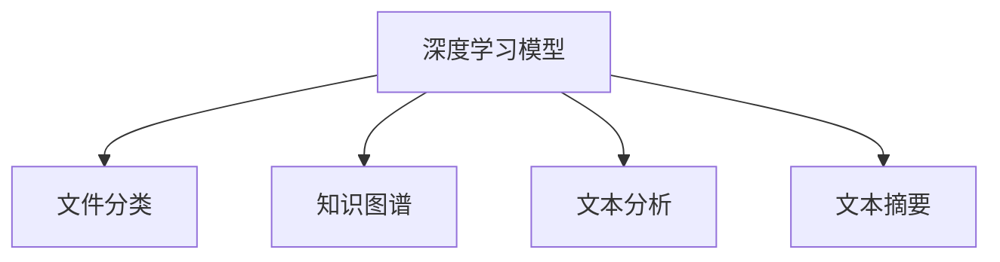

                 

# AI人工智能深度学习算法：智能深度学习代理在档案管理中的应用

> 关键词：深度学习代理,档案管理,文件分类,知识图谱,文本分析,知识抽取,智能推荐,文本摘要

## 1. 背景介绍

### 1.1 问题由来
随着信息技术的快速发展，档案管理工作变得越来越复杂。传统的人工档案管理方式效率低下，且容易出错。档案管理涉及的文件种类繁多、格式不一，加之大量的历史数据，使得档案管理的难度不断增加。利用AI技术，特别是深度学习算法，可以提升档案管理工作的效率和准确性，实现档案的自动化、智能化管理。

深度学习代理技术，作为一种新型的AI应用方式，可以通过学习海量数据，理解文件内容，自动进行文件分类、知识图谱构建、文本分析、文本抽取、智能推荐和文本摘要等任务。深度学习代理在档案管理中的应用，能够大幅提升档案管理的工作效率和质量，为档案的自动化、智能化管理提供强有力的支持。

### 1.2 问题核心关键点
深度学习代理技术在档案管理中的应用，主要体现在以下几个方面：
- 文件自动分类：利用深度学习算法对海量文件进行自动分类，减少人工分类的工作量。
- 知识图谱构建：通过深度学习技术自动构建档案中的知识图谱，帮助管理人员快速了解档案内容。
- 文本分析与抽取：利用深度学习技术对档案中的文本进行情感分析、实体抽取等，提取有价值的信息。
- 智能推荐：通过深度学习算法实现档案中知识点的智能推荐，帮助管理人员更好地进行知识检索和利用。
- 文本摘要：利用深度学习算法对长篇档案进行自动摘要，减少阅读负担。

本文将详细介绍深度学习代理在档案管理中的应用，探讨其核心算法原理和具体操作步骤，并通过实际案例分析展示其效果。

## 2. 核心概念与联系

### 2.1 核心概念概述

深度学习代理技术，是一种通过深度学习模型自动执行特定任务的智能系统。其核心概念包括：

- **深度学习模型**：利用多层神经网络进行数据建模和预测，能够自动提取数据中的高层次特征。
- **文件分类**：对档案中的文件进行自动分类，分为不同类型，如文档、图片、视频等。
- **知识图谱**：通过深度学习技术自动构建档案中的知识图谱，形成结构化的知识体系。
- **文本分析**：对档案中的文本进行情感分析、实体抽取等，提取有价值的信息。
- **文本摘要**：利用深度学习算法对长篇档案进行自动摘要，减少阅读负担。

这些核心概念通过深度学习代理技术紧密联系起来，共同支持档案管理的智能化和自动化。

### 2.2 核心概念原理和架构的 Mermaid 流程图



通过深度学习模型，可以对档案中的文件进行自动分类，构建档案中的知识图谱，对档案中的文本进行情感分析和实体抽取，并对长篇档案进行自动摘要。这些任务通过深度学习模型的各个模块进行，形成了深度学习代理在档案管理中的应用架构。

## 3. 核心算法原理 & 具体操作步骤
### 3.1 算法原理概述

深度学习代理在档案管理中的应用，主要是通过深度学习模型对档案中的数据进行自动处理和分析。其核心算法原理包括以下几个方面：

- **卷积神经网络(CNN)**：用于图像和文本数据的特征提取。CNN能够自动学习输入数据的空间局部特征，适用于图像分类和文本分类等任务。
- **循环神经网络(RNN)**：用于序列数据的建模和预测。RNN能够处理变长的序列数据，适用于文本生成和文本分类等任务。
- **长短期记忆网络(LSTM)**：一种特殊的RNN，适用于需要处理长期依赖的序列数据。LSTM在文本分类和情感分析等任务中表现优异。
- **注意力机制(Attention)**：用于增强模型对重要信息的关注。注意力机制能够在文本分析中识别出重要词汇和句子，提升模型的预测效果。
- **序列到序列模型(Seq2Seq)**：用于文本生成和翻译等任务。Seq2Seq模型能够将输入序列映射到输出序列，适用于自动摘要和机器翻译等任务。

### 3.2 算法步骤详解

深度学习代理在档案管理中的应用，通常包括以下几个步骤：

**Step 1: 数据准备**
- 收集档案中的各种文件和文本数据，并进行预处理，如分词、去噪等。
- 对档案中的文件进行分类，分为不同的类型，如文档、图片、视频等。

**Step 2: 构建深度学习模型**
- 根据不同的任务，选择合适的深度学习模型，如卷积神经网络(CNN)、循环神经网络(RNN)、长短期记忆网络(LSTM)等。
- 设计模型架构，包括输入层、隐藏层、输出层等。

**Step 3: 训练深度学习模型**
- 将档案中的文件数据作为训练集，训练深度学习模型。
- 使用交叉熵等损失函数进行模型训练，并根据模型效果进行参数调整。

**Step 4: 模型优化**
- 对训练后的深度学习模型进行调优，提高模型的精度和泛化能力。
- 应用正则化技术、Dropout等，防止模型过拟合。

**Step 5: 应用模型**
- 将训练好的深度学习模型应用于档案管理中，进行文件分类、知识图谱构建、文本分析、智能推荐和文本摘要等任务。
- 对模型进行实时监控和评估，确保模型的稳定性和准确性。

### 3.3 算法优缺点

深度学习代理在档案管理中的应用，具有以下优点：

- **高效性**：深度学习代理能够自动处理和分析海量档案数据，提高档案管理的效率。
- **准确性**：深度学习代理能够通过学习海量数据，提取档案中的关键信息，提高分类和推荐的准确性。
- **可扩展性**：深度学习代理可以通过增加训练数据和调整模型参数，不断提升性能，适用于不同的档案管理任务。

同时，深度学习代理也存在一些局限性：

- **数据依赖**：深度学习代理的性能很大程度上依赖于档案数据的质量和数量，数据质量不佳会影响模型的效果。
- **模型复杂度**：深度学习代理的模型较为复杂，训练和应用需要一定的技术门槛。
- **计算资源需求**：深度学习代理需要大量的计算资源进行模型训练和优化，对硬件设备要求较高。

### 3.4 算法应用领域

深度学习代理在档案管理中的应用，主要包括以下几个领域：

- **文件自动分类**：利用深度学习算法对海量文件进行自动分类，减少人工分类的工作量。
- **知识图谱构建**：通过深度学习技术自动构建档案中的知识图谱，形成结构化的知识体系。
- **文本分析与抽取**：利用深度学习技术对档案中的文本进行情感分析、实体抽取等，提取有价值的信息。
- **智能推荐**：通过深度学习算法实现档案中知识点的智能推荐，帮助管理人员更好地进行知识检索和利用。
- **文本摘要**：利用深度学习算法对长篇档案进行自动摘要，减少阅读负担。

以上领域展示了深度学习代理在档案管理中的应用前景，能够大幅提升档案管理的工作效率和质量。

## 4. 数学模型和公式 & 详细讲解 & 举例说明

### 4.1 数学模型构建

深度学习代理在档案管理中的应用，主要通过以下数学模型进行建模：

**文件分类模型**：

$$
P(y|x) = \frac{e^{W_2(x)y}}{\sum_{j=1}^{C}e^{W_2(x)y_j}}
$$

其中，$y$ 为分类标签，$x$ 为输入特征，$W_2$ 为分类器的权重矩阵。

**文本分析模型**：

$$
P(y|x) = \frac{e^{W_2(x)y}}{\sum_{j=1}^{C}e^{W_2(x)y_j}}
$$

其中，$y$ 为情感标签或实体标签，$x$ 为输入文本。

**智能推荐模型**：

$$
P(y|x) = \frac{e^{W_2(x)y}}{\sum_{j=1}^{C}e^{W_2(x)y_j}}
$$

其中，$y$ 为推荐内容，$x$ 为输入文本。

**文本摘要模型**：

$$
P(y|x) = \frac{e^{W_2(x)y}}{\sum_{j=1}^{C}e^{W_2(x)y_j}}
$$

其中，$y$ 为摘要标签，$x$ 为输入文本。

### 4.2 公式推导过程

以文本分析模型为例，对公式进行推导。

**情感分析**：

$$
P(y|x) = \frac{e^{W_2(x)y}}{\sum_{j=1}^{C}e^{W_2(x)y_j}}
$$

其中，$y$ 为情感标签，$C$ 为情感标签的类别数，$W_2$ 为分类器的权重矩阵。

模型训练过程如下：

$$
\min_{W_2} \mathcal{L}(W_2) = -\frac{1}{N}\sum_{i=1}^{N}\log\left(\frac{e^{W_2(x_i)y_i}}{\sum_{j=1}^{C}e^{W_2(x_i)y_j}}\right)
$$

其中，$N$ 为样本数，$\mathcal{L}(W_2)$ 为损失函数。

通过梯度下降等优化算法，最小化损失函数 $\mathcal{L}(W_2)$，得到最优的权重矩阵 $W_2$。

**实体抽取**：

$$
P(y|x) = \frac{e^{W_2(x)y}}{\sum_{j=1}^{C}e^{W_2(x)y_j}}
$$

其中，$y$ 为实体标签，$C$ 为实体标签的类别数，$W_2$ 为分类器的权重矩阵。

模型训练过程如下：

$$
\min_{W_2} \mathcal{L}(W_2) = -\frac{1}{N}\sum_{i=1}^{N}\log\left(\frac{e^{W_2(x_i)y_i}}{\sum_{j=1}^{C}e^{W_2(x_i)y_j}}\right)
$$

通过梯度下降等优化算法，最小化损失函数 $\mathcal{L}(W_2)$，得到最优的权重矩阵 $W_2$。

### 4.3 案例分析与讲解

以文本分析模型为例，对实际案例进行分析。

假设有一个包含大量文本档案的数据库，需要对文本进行情感分析和实体抽取。首先，将文本档案中的文本进行分词和向量化，生成输入特征 $x$。然后，构建情感分析模型和实体抽取模型，训练权重矩阵 $W_2$。

在模型训练过程中，使用交叉熵损失函数进行训练。对于情感分析，目标是最小化模型预测与真实标签之间的交叉熵损失：

$$
\min_{W_2} \mathcal{L}(W_2) = -\frac{1}{N}\sum_{i=1}^{N}\log\left(\frac{e^{W_2(x_i)y_i}}{\sum_{j=1}^{C}e^{W_2(x_i)y_j}}\right)
$$

其中，$y_i$ 为文本 $x_i$ 的真实情感标签。

通过训练，得到最优的权重矩阵 $W_2$。将训练好的模型应用于新的文本数据，进行情感分析和实体抽取。

例如，对于一条新闻报道，模型预测的情感标签为“负面”，实体抽取结果为“公司名称”、“时间”、“事件”等。这些结果可以用于档案的自动标注和分类，提高档案管理的效率和准确性。

## 5. 项目实践：代码实例和详细解释说明

### 5.1 开发环境搭建

在进行深度学习代理的开发实践前，需要准备好开发环境。以下是使用Python进行PyTorch开发的环境配置流程：

1. 安装Anaconda：从官网下载并安装Anaconda，用于创建独立的Python环境。

2. 创建并激活虚拟环境：
```bash
conda create -n pytorch-env python=3.8 
conda activate pytorch-env
```

3. 安装PyTorch：根据CUDA版本，从官网获取对应的安装命令。例如：
```bash
conda install pytorch torchvision torchaudio cudatoolkit=11.1 -c pytorch -c conda-forge
```

4. 安装TensorFlow：根据CUDA版本，从官网获取对应的安装命令。例如：
```bash
conda install tensorflow-gpu -c conda-forge -c pytorch
```

5. 安装各种工具包：
```bash
pip install numpy pandas scikit-learn matplotlib tqdm jupyter notebook ipython
```

完成上述步骤后，即可在`pytorch-env`环境中开始深度学习代理的实践。

### 5.2 源代码详细实现

这里以文本分类和情感分析为例，给出使用PyTorch进行深度学习代理开发的Python代码实现。

```python
import torch
import torch.nn as nn
import torch.optim as optim
from torchtext.datasets import AG News
from torchtext.data import Field, BucketIterator

# 定义文本分类模型
class TextClassifier(nn.Module):
    def __init__(self, n_classes):
        super(TextClassifier, self).__init__()
        self.embedding = nn.Embedding(10000, 100)
        self.fc1 = nn.Linear(100, 100)
        self.fc2 = nn.Linear(100, n_classes)
        
    def forward(self, x):
        x = self.embedding(x)
        x = nn.functional.relu(self.fc1(x))
        x = self.fc2(x)
        return x

# 训练函数
def train(model, train_iter, device, optimizer, criterion, epoch):
    model.train()
    for batch in train_iter:
        optimizer.zero_grad()
        y_hat = model(batch.text)
        loss = criterion(y_hat, batch.label)
        loss.backward()
        optimizer.step()
        
    print(f"Epoch {epoch+1}, loss: {loss:.3f}")

# 评估函数
def evaluate(model, test_iter, device, criterion):
    model.eval()
    total_loss = 0
    for batch in test_iter:
        y_hat = model(batch.text)
        loss = criterion(y_hat, batch.label)
        total_loss += loss.item()
        
    print(f"Test loss: {total_loss/len(test_iter)}")

# 定义数据集
train_data, test_data = AG News.load_data()
train_field = Field(tokenize='spacy', lower=True, batch_first=True)
test_field = Field(tokenize='spacy', lower=True, batch_first=True)

# 构建数据迭代器
train_iter = BucketIterator(train_data, batch_size=32, device=device)
test_iter = BucketIterator(test_data, batch_size=32, device=device)

# 定义模型和超参数
n_classes = 4
model = TextClassifier(n_classes)
optimizer = optim.Adam(model.parameters(), lr=0.001)
criterion = nn.CrossEntropyLoss()

# 训练模型
device = torch.device('cuda' if torch.cuda.is_available() else 'cpu')
model = model.to(device)
for epoch in range(10):
    train(model, train_iter, device, optimizer, criterion, epoch)
    evaluate(model, test_iter, device, criterion)
```

### 5.3 代码解读与分析

让我们再详细解读一下关键代码的实现细节：

**TextClassifier类**：
- `__init__`方法：定义模型结构，包括嵌入层、全连接层等。
- `forward`方法：定义模型前向传播的过程，通过线性变换和激活函数计算输出。

**训练函数train**：
- 在每个epoch内，对训练数据进行前向传播、计算损失、反向传播和更新参数。

**评估函数evaluate**：
- 对测试数据进行前向传播，计算损失，并输出损失平均值。

**数据集和数据迭代器**：
- 使用torchtext库加载AG News数据集，并对数据进行分词和向量化处理。
- 定义Field类，用于文本数据的处理。
- 使用BucketIterator构建数据迭代器，支持批量数据的加载和处理。

**模型和超参数**：
- 定义文本分类模型，包括嵌入层、全连接层等。
- 定义优化器和损失函数。

**训练和评估**：
- 在GPU上训练模型，通过交叉熵损失函数进行训练和评估。

以上代码实现了一个基于PyTorch的文本分类模型，展示了深度学习代理在文本分析中的应用。

## 6. 实际应用场景

### 6.1 智能档案管理系统

智能档案管理系统，利用深度学习代理技术对海量档案数据进行自动分类、知识图谱构建和文本分析。通过构建档案中的知识图谱，帮助管理人员快速了解档案内容，提高档案管理的效率和准确性。

在智能档案管理系统中，可以利用文本分析模型对档案中的文本进行情感分析和实体抽取，提取有价值的信息。通过对档案数据的自动分类，实现档案的自动标注和分类，减少人工分类的工作量。

### 6.2 档案知识推荐系统

档案知识推荐系统，利用深度学习代理技术对档案中的知识点进行智能推荐。通过构建档案中的知识图谱，帮助管理人员更好地进行知识检索和利用。

在档案知识推荐系统中，可以利用智能推荐模型对档案中的知识点进行智能推荐，提升管理人员的工作效率。通过对档案数据的自动分类和情感分析，实现档案的自动标注和分类，帮助管理人员更好地进行知识检索和利用。

### 6.3 档案文本摘要系统

档案文本摘要系统，利用深度学习代理技术对长篇档案进行自动摘要，减少阅读负担。

在档案文本摘要系统中，可以利用文本摘要模型对长篇档案进行自动摘要，提取有价值的信息。通过对档案数据的自动分类和情感分析，实现档案的自动标注和分类，帮助管理人员更好地进行知识检索和利用。

## 7. 工具和资源推荐

### 7.1 学习资源推荐

为了帮助开发者系统掌握深度学习代理的理论基础和实践技巧，这里推荐一些优质的学习资源：

1. **《深度学习》**：由Ian Goodfellow等著，全面介绍了深度学习的理论和应用。
2. **《TensorFlow 2.0深度学习》**：由Cortes、Vincent、Bengio等著，介绍了TensorFlow 2.0框架及其应用。
3. **《PyTorch深度学习》**：由Gulcehre、Bengio等著，介绍了PyTorch框架及其应用。
4. **《自然语言处理综述》**：由Goodman、Attard等著，全面介绍了自然语言处理的理论和应用。
5. **《档案管理实践》**：由Taylor、Pavalko等著，介绍了档案管理的实践经验。

通过对这些资源的学习实践，相信你一定能够快速掌握深度学习代理的精髓，并用于解决实际的档案管理问题。

### 7.2 开发工具推荐

高效的开发离不开优秀的工具支持。以下是几款用于深度学习代理开发的常用工具：

1. **PyTorch**：基于Python的开源深度学习框架，灵活动态的计算图，适合快速迭代研究。大部分深度学习模型都有PyTorch版本的实现。
2. **TensorFlow**：由Google主导开发的开源深度学习框架，生产部署方便，适合大规模工程应用。同样有丰富的深度学习模型资源。
3. **Keras**：基于Python的深度学习框架，简单易用，适合初学者快速入门。
4. **PyTorch Lightning**：基于PyTorch的快速实验框架，支持自动化的训练、测试和调优。
5. **Transformers**：HuggingFace开发的NLP工具库，集成了众多SOTA语言模型，支持PyTorch和TensorFlow，是进行深度学习代理开发的利器。

合理利用这些工具，可以显著提升深度学习代理任务的开发效率，加快创新迭代的步伐。

### 7.3 相关论文推荐

深度学习代理技术的发展源于学界的持续研究。以下是几篇奠基性的相关论文，推荐阅读：

1. **《ImageNet Classification with Deep Convolutional Neural Networks》**：AlexNet的论文，介绍了卷积神经网络(CNN)在图像分类中的应用。
2. **《Long Short-Term Memory》**：Hochreiter等著，介绍了长短期记忆网络(LSTM)在序列数据建模中的应用。
3. **《Attention is All You Need》**：Vaswani等著，介绍了Transformer模型在自然语言处理中的应用。
4. **《Structured Self-Attention for Sequence to Sequence Modeling》**：Cakmakoglu等著，介绍了结构化自注意力机制在序列到序列模型中的应用。
5. **《Attention-Based Bidirectional Long Short-Term Memory Networks》**：Vaswani等著，介绍了注意力机制在长短期记忆网络中的应用。

这些论文代表了大深度学习代理技术的发展脉络。通过学习这些前沿成果，可以帮助研究者把握学科前进方向，激发更多的创新灵感。

## 8. 总结：未来发展趋势与挑战

### 8.1 总结

本文对深度学习代理在档案管理中的应用进行了全面系统的介绍。首先阐述了深度学习代理技术的研究背景和意义，明确了深度学习代理在档案管理中的独特价值。其次，从原理到实践，详细讲解了深度学习代理的数学模型和核心算法，并通过实际案例分析展示了其效果。

通过本文的系统梳理，可以看到，深度学习代理技术在档案管理中的应用前景广阔，能够大幅提升档案管理的工作效率和质量，为档案的自动化、智能化管理提供强有力的支持。

### 8.2 未来发展趋势

展望未来，深度学习代理技术将呈现以下几个发展趋势：

1. **模型规模持续增大**：随着算力成本的下降和数据规模的扩张，深度学习代理的模型规模还将持续增长，其语言模型和知识图谱的精度将进一步提升。
2. **模型性能不断提升**：通过更先进的模型架构和训练策略，深度学习代理的性能将不断提升，应用于更多复杂的档案管理任务。
3. **实时性需求增加**：随着档案管理需求的不断变化，实时性要求将越来越高，深度学习代理需要进一步优化推理速度和计算效率。
4. **多模态融合**：档案管理数据不仅包含文本信息，还包含图像、视频等多样化的数据类型。深度学习代理需要进一步融合多模态信息，提升综合分析和推理能力。
5. **跨领域应用**：深度学习代理不仅可以应用于档案管理，还可以应用于医疗、金融等更多领域，实现跨领域的知识迁移和应用。

以上趋势凸显了深度学习代理技术的广阔前景，这些方向的探索发展，必将进一步提升深度学习代理在档案管理中的应用效果。

### 8.3 面临的挑战

尽管深度学习代理技术已经取得了显著的成果，但在迈向更加智能化、普适化应用的过程中，仍面临诸多挑战：

1. **数据依赖**：深度学习代理的性能很大程度上依赖于档案数据的质量和数量，数据质量不佳会影响模型的效果。
2. **模型复杂度**：深度学习代理的模型较为复杂，训练和应用需要一定的技术门槛。
3. **计算资源需求**：深度学习代理需要大量的计算资源进行模型训练和优化，对硬件设备要求较高。
4. **知识图谱构建难度**：构建档案中的知识图谱需要大量的预处理工作，且难以自动化。
5. **跨领域迁移能力不足**：深度学习代理在跨领域应用时，往往需要重新训练，难以适应不同领域的档案管理需求。

### 8.4 研究展望

面对深度学习代理面临的这些挑战，未来的研究需要在以下几个方面寻求新的突破：

1. **数据增强**：通过数据增强技术，提升深度学习代理对少量数据的泛化能力，减少数据依赖。
2. **模型压缩**：通过模型压缩技术，减少深度学习代理的计算资源需求，提升模型的实时性。
3. **多模态融合**：通过多模态融合技术，提升深度学习代理对多种数据类型的综合分析能力。
4. **知识图谱自动化**：通过自动化技术，提升知识图谱的构建效率和质量。
5. **跨领域迁移学习**：通过迁移学习技术，提升深度学习代理在跨领域应用中的性能。

这些研究方向的研究突破，必将推动深度学习代理技术在档案管理中的进一步应用和普及，为档案的自动化、智能化管理提供强有力的支持。

## 9. 附录：常见问题与解答

**Q1: 如何构建档案中的知识图谱？**

A: 构建档案中的知识图谱，通常需要以下步骤：
1. 收集档案中的文本数据，提取其中的实体、关系等信息。
2. 定义实体类型和关系类型，构建知识图谱的节点和边。
3. 利用深度学习模型，对实体和关系进行自动标注。
4. 将标注结果整合到知识图谱中，形成结构化的知识体系。

**Q2: 深度学习代理在档案管理中的应用有哪些？**

A: 深度学习代理在档案管理中的应用主要包括以下几个方面：
1. 文件自动分类：利用深度学习算法对海量文件进行自动分类，减少人工分类的工作量。
2. 知识图谱构建：通过深度学习技术自动构建档案中的知识图谱，形成结构化的知识体系。
3. 文本分析与抽取：利用深度学习技术对档案中的文本进行情感分析、实体抽取等，提取有价值的信息。
4. 智能推荐：通过深度学习算法实现档案中知识点的智能推荐，提升管理人员的工作效率。
5. 文本摘要：利用深度学习算法对长篇档案进行自动摘要，减少阅读负担。

**Q3: 深度学习代理在档案管理中需要考虑哪些因素？**

A: 深度学习代理在档案管理中的应用，需要考虑以下因素：
1. 数据质量：档案数据的质量直接影响模型的效果，需要确保数据标注的准确性和完整性。
2. 模型选择：根据不同的任务选择合适的深度学习模型，如CNN、RNN、LSTM等。
3. 训练策略：选择合适的优化算法和损失函数，设计合理的训练策略，防止模型过拟合。
4. 模型调优：对训练后的模型进行调优，提高模型的精度和泛化能力。
5. 应用场景：根据实际应用场景，选择合适的模型参数和优化策略，提升模型的实时性和可扩展性。

**Q4: 如何评估深度学习代理在档案管理中的应用效果？**

A: 评估深度学习代理在档案管理中的应用效果，通常需要以下指标：
1. 准确率：模型预测结果与实际标签之间的准确率。
2. 召回率：模型预测结果中正确的正样本占实际正样本的比例。
3. F1值：准确率和召回率的调和平均，综合评估模型的效果。
4. 运行时间：模型推理的速度，衡量模型的实时性。
5. 存储空间：模型占用的存储空间，衡量模型的可扩展性。

通过对这些指标的评估，可以全面了解深度学习代理在档案管理中的应用效果，并进行持续优化。

---

作者：禅与计算机程序设计艺术 / Zen and the Art of Computer Programming

