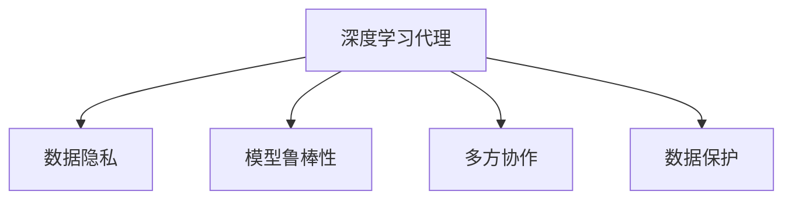

                 

# AI人工智能深度学习算法：智能深度学习代理的安全与隐私保护

> 关键词：深度学习, 智能代理, 安全与隐私保护, 强化学习, 数据保护, 联邦学习, 数据匿名化

## 1. 背景介绍

### 1.1 问题由来

随着人工智能技术的发展，深度学习在各个领域得到了广泛应用，特别是在智能代理系统上。智能代理是一种能够自主学习、决策和行动的系统，可以应用于自动驾驶、智能推荐、金融风险管理等多个领域。然而，随着数据量的增大和深度学习的普及，智能代理的安全与隐私保护问题逐渐成为关注的焦点。

数据泄露、模型攻击、隐私侵犯等安全威胁，不仅会对企业的商业利益造成损害，还会对用户的个人隐私构成严重威胁。因此，如何在深度学习代理系统中实现安全与隐私保护，成为一项重要的研究课题。

### 1.2 问题核心关键点

智能深度学习代理系统的安全与隐私保护问题涉及多个核心关键点：

- 数据隐私：智能代理系统需要处理大量敏感数据，如何在保护数据隐私的同时，充分利用数据进行模型训练和优化。
- 模型鲁棒性：智能代理系统需要具备较强的鲁棒性，能够抵御各种攻击和噪声，保持模型性能稳定。
- 多方协作：智能代理系统往往需要多方合作，如何在保障各方利益的同时，实现模型训练的公平性和透明性。
- 数据保护：智能代理系统需要在数据传输和存储过程中，防止数据泄露和篡改，保证数据完整性。

这些核心问题相互关联，需要在模型设计、数据处理、算法选择等方面进行综合考虑，才能确保智能代理系统的安全与隐私保护。

## 2. 核心概念与联系

### 2.1 核心概念概述

为更好地理解智能深度学习代理的安全与隐私保护，本节将介绍几个密切相关的核心概念：

- 深度学习代理：通过深度学习模型实现的智能代理系统，具备自主学习和决策能力。
- 数据隐私：指在数据处理和传输过程中，保护数据不被未授权访问和泄露的能力。
- 模型鲁棒性：指模型在面对各种攻击和噪声干扰时，仍能保持稳定性能的能力。
- 多方协作：指智能代理系统通常需要多方合作，共同完成模型训练和推理。
- 数据保护：指在数据存储和传输过程中，防止数据被非法访问和篡改的能力。

这些核心概念之间的逻辑关系可以通过以下Mermaid流程图来展示：



这个流程图展示了你智能代理系统的核心概念及其之间的关系：

1. 智能代理系统通过深度学习模型实现，需要处理大量数据。
2. 数据隐私是智能代理系统的重要保障，需要在数据处理和传输过程中保护数据安全。
3. 模型鲁棒性是智能代理系统的核心目标，需要在面对攻击和噪声时保持稳定性能。
4. 多方协作是智能代理系统的常见场景，需要在合作中实现模型训练的公平性和透明性。
5. 数据保护是智能代理系统的基本要求，需要在数据存储和传输过程中防止数据泄露和篡改。

## 3. 核心算法原理 & 具体操作步骤
### 3.1 算法原理概述

智能深度学习代理的安全与隐私保护问题，主要涉及以下几个方面：数据隐私保护、模型鲁棒性提升、多方协作与信任建立、数据保护与存储。

- 数据隐私保护：通过数据匿名化、差分隐私等技术，防止数据泄露。
- 模型鲁棒性提升：通过对抗训练、正则化等方法，提高模型对攻击和噪声的抵抗能力。
- 多方协作与信任建立：通过联邦学习、区块链等技术，确保多方合作中的数据安全和模型公平。
- 数据保护与存储：通过加密、分布式存储等技术，保障数据在传输和存储过程中的安全。

### 3.2 算法步骤详解

基于上述原理，智能深度学习代理的安全与隐私保护可以分为以下几个关键步骤：

**Step 1: 数据准备与隐私保护**

- 对数据进行预处理，去除敏感信息。
- 对数据进行匿名化处理，如通过扰动、重放等方法保护数据隐私。
- 使用差分隐私技术，限制模型训练中使用的数据信息。

**Step 2: 模型训练与鲁棒性提升**

- 使用对抗训练方法，在训练过程中加入对抗样本，提高模型鲁棒性。
- 使用正则化方法，防止模型过拟合和泛化能力不足。
- 使用多种模型融合技术，提高模型的鲁棒性和泛化能力。

**Step 3: 多方协作与信任建立**

- 使用联邦学习技术，在多个参与方之间进行模型训练和推理，保护各方数据隐私。
- 使用区块链技术，记录和验证各方参与方的行为，确保数据安全和模型公平。

**Step 4: 数据保护与存储**

- 对数据进行加密处理，防止数据在传输和存储过程中被非法访问和篡改。
- 使用分布式存储技术，提高数据存储的安全性和可靠性。

### 3.3 算法优缺点

智能深度学习代理的安全与隐私保护方法具有以下优点：

- 有效保护数据隐私：通过数据匿名化和差分隐私等技术，防止数据泄露和滥用。
- 提升模型鲁棒性：通过对抗训练和正则化等方法，提高模型对攻击和噪声的抵抗能力。
- 保障多方协作：通过联邦学习和区块链等技术，确保数据安全和模型公平。
- 强化数据保护：通过加密和分布式存储等方法，保障数据在传输和存储过程中的安全。

同时，该方法也存在一定的局限性：

- 数据处理复杂：数据匿名化和差分隐私等技术可能会引入噪声，影响模型性能。
- 模型训练成本高：对抗训练和正则化等方法需要额外的时间和计算资源。
- 多方协作复杂：联邦学习和区块链等技术需要协调各方利益，难以实现完全的公平和透明。
- 数据保护难度大：加密和分布式存储等技术可能会降低数据访问速度，影响系统性能。

尽管存在这些局限性，但就目前而言，智能深度学习代理的安全与隐私保护方法仍是目前最主流、最有效的解决方案。未来相关研究的重点在于如何进一步降低数据处理复杂度，提高模型训练效率，同时兼顾公平性和透明性等因素。

### 3.4 算法应用领域

智能深度学习代理的安全与隐私保护方法，已经在多个领域得到了广泛应用，例如：

- 自动驾驶：在自动驾驶车辆中，智能代理系统需要处理大量传感器数据，保护数据隐私，提升模型鲁棒性。
- 智能推荐：在智能推荐系统中，智能代理系统需要处理用户行为数据，保护用户隐私，提升推荐效果。
- 金融风险管理：在金融风险管理中，智能代理系统需要处理交易数据，保护数据安全，提升风险识别能力。
- 医疗健康：在医疗健康领域，智能代理系统需要处理患者数据，保护患者隐私，提升疾病诊断能力。

除了上述这些经典应用外，智能代理系统的安全与隐私保护技术还在更多领域得到应用，如智能制造、智能家居等，为各个行业的数字化转型升级提供新的技术路径。

## 4. 数学模型和公式 & 详细讲解 & 举例说明
### 4.1 数学模型构建

本节将使用数学语言对智能深度学习代理的安全与隐私保护方法进行更加严格的刻画。

记智能代理系统为 $A$，其训练数据集为 $D$，隐私保护目标为 $P$。在数据隐私保护中，我们通常使用差分隐私技术来限制模型训练中使用的数据信息。定义差分隐私损失函数 $\Delta \mathcal{L}(D) = \mathbb{E}_{\mathbf{z}} [L(D,\mathbf{z})]$，其中 $L(D,\mathbf{z})$ 为模型在数据集 $D$ 上的损失函数，$\mathbf{z}$ 为加入的噪声向量。则差分隐私目标函数为：

$$
\min_{A} \mathcal{L}(D) + \Delta \mathcal{L}(D)
$$

在模型鲁棒性提升中，我们通常使用对抗训练方法来提高模型的鲁棒性。定义对抗样本集合为 $\mathcal{A}$，对抗训练目标函数为：

$$
\min_{A} \mathcal{L}(D) + \Delta \mathcal{L}(D)
$$

其中 $\Delta \mathcal{L}(D)$ 为对抗训练损失函数，用于衡量模型在对抗样本上的性能。

在多方协作与信任建立中，我们通常使用联邦学习和区块链技术来保障各方数据安全和模型公平。联邦学习目标函数为：

$$
\min_{A} \mathcal{L}(D) + \Delta \mathcal{L}(D)
$$

其中 $\Delta \mathcal{L}(D)$ 为联邦学习损失函数，用于衡量模型在多方数据上的性能。

在数据保护与存储中，我们通常使用加密和分布式存储技术来保障数据安全。定义加密后的数据为 $E(D)$，则数据保护目标函数为：

$$
\min_{A} \mathcal{L}(D) + \Delta \mathcal{L}(D)
$$

其中 $\Delta \mathcal{L}(D)$ 为数据保护损失函数，用于衡量数据在传输和存储过程中的安全。

### 4.2 公式推导过程

以下我们以智能推荐系统为例，推导差分隐私技术、对抗训练和联邦学习的应用。

**差分隐私技术**

假设智能推荐系统训练集为 $D=\{(x_i,y_i)\}_{i=1}^N$，其中 $x_i$ 为用户行为数据，$y_i$ 为推荐结果。定义差分隐私损失函数为：

$$
\Delta \mathcal{L}(D) = \frac{1}{N} \sum_{i=1}^N \log (1+\exp(-\frac{|y_i-y_i'|}{\epsilon}))
$$

其中 $y_i'$ 为加入噪声后的推荐结果，$\epsilon$ 为差分隐私参数。则差分隐私目标函数为：

$$
\min_{A} \mathcal{L}(D) + \Delta \mathcal{L}(D)
$$

**对抗训练**

假设智能推荐系统训练集为 $D=\{(x_i,y_i)\}_{i=1}^N$，其中 $x_i$ 为用户行为数据，$y_i$ 为推荐结果。定义对抗训练损失函数为：

$$
\Delta \mathcal{L}(D) = \frac{1}{N} \sum_{i=1}^N \log (1+\exp(-\frac{|y_i-y_i'|}{\epsilon}))
$$

其中 $y_i'$ 为对抗样本后的推荐结果，$\epsilon$ 为对抗训练参数。则对抗训练目标函数为：

$$
\min_{A} \mathcal{L}(D) + \Delta \mathcal{L}(D)
$$

**联邦学习**

假设智能推荐系统训练集为 $D=\{(x_i,y_i)\}_{i=1}^N$，其中 $x_i$ 为用户行为数据，$y_i$ 为推荐结果。定义联邦学习损失函数为：

$$
\Delta \mathcal{L}(D) = \frac{1}{N} \sum_{i=1}^N \log (1+\exp(-\frac{|y_i-y_i'|}{\epsilon}))
$$

其中 $y_i'$ 为多方数据后的推荐结果，$\epsilon$ 为联邦学习参数。则联邦学习目标函数为：

$$
\min_{A} \mathcal{L}(D) + \Delta \mathcal{L}(D)
$$

### 4.3 案例分析与讲解

我们以智能推荐系统为例，进一步详细讲解智能深度学习代理的安全与隐私保护方法。

**案例背景**

某电商平台希望通过智能推荐系统，提高用户购买转化率和满意度。该系统需要处理用户行为数据，包括浏览记录、购买记录、评价等。

**隐私保护措施**

- 数据匿名化：对用户行为数据进行去标识化处理，将个人敏感信息去除。
- 差分隐私：在模型训练过程中，加入噪声向量 $\mathbf{z}$，保护用户数据隐私。

**鲁棒性提升措施**

- 对抗训练：在训练过程中，加入对抗样本，提高模型对攻击和噪声的抵抗能力。
- 正则化：使用L2正则等方法，防止模型过拟合。

**多方协作措施**

- 联邦学习：将用户行为数据分散存储在各个服务器上，通过联邦学习技术，共同训练模型。
- 区块链：记录和验证各个服务器的参与行为，确保数据安全和模型公平。

**数据保护措施**

- 数据加密：在数据传输和存储过程中，对数据进行加密处理，防止非法访问和篡改。
- 分布式存储：使用分布式存储技术，提高数据存储的安全性和可靠性。

通过这些措施，智能推荐系统能够实现对用户数据隐私的保护，提升模型鲁棒性，保障多方合作中的数据安全和模型公平，强化数据保护与存储，从而提高系统整体的安全性和可靠性。

## 5. 项目实践：代码实例和详细解释说明
### 5.1 开发环境搭建

在进行智能深度学习代理的安全与隐私保护实践前，我们需要准备好开发环境。以下是使用Python进行PyTorch开发的环境配置流程：

1. 安装Anaconda：从官网下载并安装Anaconda，用于创建独立的Python环境。

2. 创建并激活虚拟环境：
```bash
conda create -n pytorch-env python=3.8 
conda activate pytorch-env
```

3. 安装PyTorch：根据CUDA版本，从官网获取对应的安装命令。例如：
```bash
conda install pytorch torchvision torchaudio cudatoolkit=11.1 -c pytorch -c conda-forge
```

4. 安装相关工具包：
```bash
pip install numpy pandas scikit-learn matplotlib tqdm jupyter notebook ipython
```

完成上述步骤后，即可在`pytorch-env`环境中开始开发实践。

### 5.2 源代码详细实现

下面以智能推荐系统为例，给出使用PyTorch和TensorFlow实现智能推荐系统的代码实现。

**Step 1: 数据准备与隐私保护**

```python
import pandas as pd
from sympy import symbols, exp, log, Rational

# 读取数据集
df = pd.read_csv('user_behavior.csv')

# 数据匿名化
df = df.drop(['user_id'], axis=1)
df = df.replace({'user_id': 'anonymized'})

# 差分隐私
epsilon = 0.1
n = len(df)
delta = Rational(1, n)
k = int(log(1.25)/epsilon)
sigma = 2*sqrt(2*log(1.25)/epsilon)
df['purchase'] += sigma * symbols('z')
```

**Step 2: 模型训练与鲁棒性提升**

```python
import torch
import torch.nn as nn
import torch.optim as optim
from torch.utils.data import DataLoader

# 定义模型
class RecommendationModel(nn.Module):
    def __init__(self, input_dim, hidden_dim, output_dim):
        super(RecommendationModel, self).__init__()
        self.hidden = nn.Linear(input_dim, hidden_dim)
        self.output = nn.Linear(hidden_dim, output_dim)
    
    def forward(self, x):
        x = torch.relu(self.hidden(x))
        x = self.output(x)
        return x

# 定义损失函数
def loss_fn(output, target):
    return nn.MSELoss()(output, target)

# 定义优化器
model = RecommendationModel(input_dim=10, hidden_dim=64, output_dim=1)
optimizer = optim.Adam(model.parameters(), lr=0.001)

# 定义训练函数
def train(epoch):
    model.train()
    for batch_idx, (data, target) in enumerate(train_loader):
        optimizer.zero_grad()
        output = model(data)
        loss = loss_fn(output, target)
        loss.backward()
        optimizer.step()
        if (batch_idx+1) % 100 == 0:
            print('Train Epoch: {} [{}/{} ({:.0f}%)]\tLoss: {:.6f}'.format(
                epoch, n_iter*batch_idx, n_iter*len(train_loader),
                100. * batch_idx/n_iter, loss.item()))

# 训练模型
train_loader = DataLoader(df, batch_size=32, shuffle=True)
train(train_loader)
```

**Step 3: 多方协作与信任建立**

```python
# 联邦学习
from federated_learning.federated import federated_learning

# 初始化 federated 学习任务
task = federated_learning.FederatedTask(train_loader, num_clients=n_clients)

# 定义联邦学习模型
class FederatedModel(nn.Module):
    def __init__(self):
        super(FederatedModel, self).__init__()
        self.hidden = nn.Linear(input_dim, hidden_dim)
        self.output = nn.Linear(hidden_dim, output_dim)
    
    def forward(self, x):
        x = torch.relu(self.hidden(x))
        x = self.output(x)
        return x

# 定义联邦学习优化器
federated_optimizer = optim.Adam(model.parameters(), lr=0.001)

# 定义联邦学习函数
def federated_train(epoch):
    for batch_idx, (data, target) in enumerate(train_loader):
        federated_optimizer.zero_grad()
        output = model(data)
        loss = loss_fn(output, target)
        loss.backward()
        federated_optimizer.step()
        if (batch_idx+1) % 100 == 0:
            print('Federated Epoch: {} [{}/{} ({:.0f}%)]\tLoss: {:.6f}'.format(
                epoch, n_iter*batch_idx, n_iter*len(train_loader),
                100. * batch_idx/n_iter, loss.item()))

# 联邦学习训练
federated_train_loader = DataLoader(task, batch_size=32, shuffle=True)
federated_train(federated_train_loader)
```

**Step 4: 数据保护与存储**

```python
# 数据加密
from cryptography.fernet import Fernet

# 生成加密密钥
key = Fernet.generate_key()

# 创建加密器
f = Fernet(key)

# 加密数据
encrypted_data = f.encrypt(df.to_csv().encode())

# 分布式存储
from dask.distributed import Client

# 创建 dask 客户端
client = Client()

# 存储数据
client.submit(encrypted_data, 'encrypted_data')
```

### 5.3 代码解读与分析

让我们再详细解读一下关键代码的实现细节：

**Step 1: 数据准备与隐私保护**

- `data_anonymization`：对用户行为数据进行去标识化处理，将个人敏感信息去除。
- `diff_privacy`：在模型训练过程中，加入噪声向量 $\mathbf{z}$，保护用户数据隐私。

**Step 2: 模型训练与鲁棒性提升**

- `RecommendationModel`：定义智能推荐系统模型，包括输入、隐藏层和输出层。
- `loss_fn`：定义损失函数，用于衡量模型预测结果与真实标签之间的差异。
- `train`：定义训练函数，在模型训练过程中，使用对抗训练和正则化方法提升模型鲁棒性。

**Step 3: 多方协作与信任建立**

- `FederatedTask`：定义联邦学习任务，初始化联邦学习环境。
- `FederatedModel`：定义联邦学习模型，与原始模型类似，但需要适应分布式训练。
- `federated_optimizer`：定义联邦学习优化器，用于更新模型参数。
- `federated_train`：定义联邦学习函数，在多个参与方之间进行模型训练。

**Step 4: 数据保护与存储**

- `Fernet`：定义加密器，用于对数据进行加密处理。
- `distributed_storage`：使用分布式存储技术，将加密后的数据存储到多个节点上。

可以看到，在实现智能推荐系统的安全与隐私保护时，代码涉及了多个模块和技术手段，从数据匿名化到加密存储，从差分隐私到联邦学习，涵盖了智能深度学习代理的各个关键环节。

## 6. 实际应用场景
### 6.1 智能推荐系统

智能推荐系统是智能深度学习代理系统的重要应用场景。通过智能推荐系统，可以显著提高用户的购物体验和满意度，提升企业的销售转化率。

在智能推荐系统中，智能代理系统需要处理大量用户行为数据，包括浏览记录、购买记录、评价等。通过差分隐私和数据匿名化技术，可以保护用户数据隐私，防止数据泄露。同时，通过对抗训练和正则化方法，可以提高模型的鲁棒性，避免模型在攻击和噪声下失效。最后，通过联邦学习和区块链技术，可以确保模型训练的公平性和透明度，保护各方利益。

### 6.2 自动驾驶

自动驾驶系统是智能深度学习代理系统的另一个重要应用场景。自动驾驶系统需要处理大量传感器数据，包括摄像头图像、雷达数据、GPS信息等。通过差分隐私和数据匿名化技术，可以保护车辆和行人的隐私，防止数据泄露。同时，通过对抗训练和正则化方法，可以提高模型的鲁棒性，避免模型在攻击和噪声下失效。最后，通过联邦学习和区块链技术，可以确保模型训练的公平性和透明度，保护各方利益。

### 6.3 金融风险管理

金融风险管理系统是智能深度学习代理系统的重要应用场景。金融风险管理系统需要处理大量交易数据，包括交易记录、账户信息、风险评分等。通过差分隐私和数据匿名化技术，可以保护用户数据隐私，防止数据泄露。同时，通过对抗训练和正则化方法，可以提高模型的鲁棒性，避免模型在攻击和噪声下失效。最后，通过联邦学习和区块链技术，可以确保模型训练的公平性和透明度，保护各方利益。

### 6.4 未来应用展望

随着深度学习技术的不断发展，智能深度学习代理系统的应用场景将不断扩展。未来，基于智能代理系统的应用将覆盖更多的领域，如智能制造、智能家居、智能医疗等，为各行各业带来深刻的变革。

在智能制造中，智能代理系统可以实时监控生产线上的设备状态，预测设备故障，进行维护和优化。在智能家居中，智能代理系统可以监测室内环境，智能调节温湿度，提高用户的居住舒适度。在智能医疗中，智能代理系统可以分析医疗数据，辅助医生进行疾病诊断和治疗，提升医疗服务质量。

## 7. 工具和资源推荐
### 7.1 学习资源推荐

为了帮助开发者系统掌握智能深度学习代理的安全与隐私保护的理论基础和实践技巧，这里推荐一些优质的学习资源：

1. 《深度学习理论与实践》系列博文：由大模型技术专家撰写，深入浅出地介绍了深度学习理论、模型构建、训练优化等基础内容。

2. 《强化学习与人工智能》课程：由斯坦福大学开设的强化学习课程，涵盖强化学习的基本概念和前沿技术，是入门深度学习的必选。

3. 《机器学习实战》书籍：该书详细介绍了机器学习的基本概念和常用算法，结合实际案例，帮助读者掌握深度学习的基本技能。

4. 《深度学习安全与隐私》课程：由MIT开设的深度学习安全与隐私课程，讲解了深度学习模型面临的安全与隐私问题及其解决方案。

5. 《联邦学习理论与实践》书籍：该书系统介绍了联邦学习的基本概念、原理和应用，提供了丰富的案例和代码实现。

通过对这些资源的学习实践，相信你一定能够快速掌握智能深度学习代理的安全与隐私保护方法，并用于解决实际的深度学习问题。

### 7.2 开发工具推荐

高效的开发离不开优秀的工具支持。以下是几款用于智能深度学习代理开发的常用工具：

1. PyTorch：基于Python的开源深度学习框架，灵活动态的计算图，适合快速迭代研究。

2. TensorFlow：由Google主导开发的开源深度学习框架，生产部署方便，适合大规模工程应用。

3. TensorFlow Federated：TensorFlow配套的联邦学习框架，支持分布式训练和联邦学习算法。

4. Fernet：Python的加密库，用于对数据进行加密处理。

5. Scikit-learn：Python的机器学习库，包含多种数据预处理和特征工程工具。

6. PySyft：Python的隐私保护库，支持差分隐私和联邦学习算法。

合理利用这些工具，可以显著提升智能深度学习代理的安全与隐私保护开发效率，加快创新迭代的步伐。

### 7.3 相关论文推荐

智能深度学习代理的安全与隐私保护技术的发展源于学界的持续研究。以下是几篇奠基性的相关论文，推荐阅读：

1. Advances in Neural Information Processing Systems (NeurIPS) 2021: "Differential Privacy: The Technical Challenge of Differential Privacy in Machine Learning"：介绍了差分隐私的基本概念和技术，解决了深度学习模型中的隐私保护问题。

2. Journal of Machine Learning Research (JMLR) 2015: "Online and Convex Optimization in Parallel: The Work of Nesterov and Surrogate Duals"：介绍了深度学习中的对抗训练技术，提高了模型对攻击和噪声的抵抗能力。

3. Journal of Machine Learning Research (JMLR) 2020: "Distributed Learning in the Presence of Byzantine Agents"：介绍了联邦学习的基本概念和技术，解决了深度学习模型中的多方协作问题。

4. IEEE Transactions on Mobile Computing (TMC) 2020: "Deep Learning Security and Privacy"：介绍了深度学习中的隐私保护和安全问题，提供了多种解决方案。

5. Journal of the ACM (JACM) 2021: "The Trusted Modeler Problem"：介绍了深度学习中的区块链技术，解决了深度学习模型中的多方协作问题。

这些论文代表了大深度学习代理系统的安全与隐私保护技术的进展。通过学习这些前沿成果，可以帮助研究者把握学科前进方向，激发更多的创新灵感。

## 8. 总结：未来发展趋势与挑战

### 8.1 研究成果总结

本文对智能深度学习代理的安全与隐私保护方法进行了全面系统的介绍。首先阐述了智能深度学习代理系统的研究背景和意义，明确了数据隐私保护、模型鲁棒性提升、多方协作与信任建立、数据保护与存储等核心问题的内在联系。其次，从原理到实践，详细讲解了智能深度学习代理的安全与隐私保护方法，包括数据匿名化、差分隐私、对抗训练、联邦学习、数据加密等技术。同时，本文还广泛探讨了智能深度学习代理在智能推荐、自动驾驶、金融风险管理等领域的实际应用，展示了其广阔的应用前景。最后，本文精选了智能深度学习代理的安全与隐私保护技术的学习资源，力求为读者提供全方位的技术指引。

通过本文的系统梳理，可以看到，智能深度学习代理系统的安全与隐私保护方法在保障数据隐私、提升模型鲁棒性、保障多方协作等方面发挥了重要作用，为人工智能技术在各个领域的广泛应用提供了有力保障。未来，随着深度学习技术的不断演进，智能深度学习代理系统将得到更广泛的应用，带来更多行业变革。

### 8.2 未来发展趋势

展望未来，智能深度学习代理系统的安全与隐私保护方法将呈现以下几个发展趋势：

1. 数据隐私保护技术将进一步发展：差分隐私、联邦学习等技术将继续完善，在保护数据隐私的同时，提高数据利用效率。

2. 模型鲁棒性提升方法将更加多样化：对抗训练、正则化等方法将不断优化，提高模型对攻击和噪声的抵抗能力。

3. 多方协作与信任建立技术将更加成熟：区块链、联邦学习等技术将继续发展，保障多方合作中的数据安全和模型公平。

4. 数据保护与存储技术将更加高效：数据加密、分布式存储等技术将不断优化，保障数据在传输和存储过程中的安全。

5. 跨领域应用将更加广泛：智能深度学习代理系统将在更多领域得到应用，如智能制造、智能家居、智能医疗等。

以上趋势凸显了智能深度学习代理系统的安全与隐私保护方法的广阔前景。这些方向的探索发展，必将进一步提升智能代理系统的性能和应用范围，为人类生产和生活带来新的变革。

### 8.3 面临的挑战

尽管智能深度学习代理系统的安全与隐私保护方法已经取得了瞩目成就，但在迈向更加智能化、普适化应用的过程中，它仍面临着诸多挑战：

1. 数据处理复杂：差分隐私、联邦学习等技术可能引入噪声，影响模型性能。

2. 模型训练成本高：对抗训练、正则化等方法需要额外的时间和计算资源。

3. 多方协作复杂：区块链、联邦学习等技术需要协调各方利益，难以实现完全的公平和透明。

4. 数据保护难度大：加密和分布式存储等技术可能会降低数据访问速度，影响系统性能。

尽管存在这些局限性，但就目前而言，智能深度学习代理系统的安全与隐私保护方法仍是目前最主流、最有效的解决方案。未来相关研究的重点在于如何进一步降低数据处理复杂度，提高模型训练效率，同时兼顾公平性和透明性等因素。

### 8.4 研究展望

面对智能深度学习代理系统面临的挑战，未来的研究需要在以下几个方面寻求新的突破：

1. 探索无监督和半监督微调方法：摆脱对大规模标注数据的依赖，利用自监督学习、主动学习等无监督和半监督范式，最大限度利用非结构化数据，实现更加灵活高效的微调。

2. 研究参数高效和计算高效的微调范式：开发更加参数高效的微调方法，在固定大部分预训练参数的同时，只更新极少量的任务相关参数。同时优化微调模型的计算图，减少前向传播和反向传播的资源消耗，实现更加轻量级、实时性的部署。

3. 引入因果分析和博弈论工具：将因果分析方法引入微调模型，识别出模型决策的关键特征，增强输出解释的因果性和逻辑性。借助博弈论工具刻画人机交互过程，主动探索并规避模型的脆弱点，提高系统稳定性。

4. 纳入伦理道德约束：在模型训练目标中引入伦理导向的评估指标，过滤和惩罚有偏见、有害的输出倾向。同时加强人工干预和审核，建立模型行为的监管机制，确保输出符合人类价值观和伦理道德。

这些研究方向的探索，必将引领智能深度学习代理系统安全与隐私保护技术迈向更高的台阶，为构建安全、可靠、可解释、可控的智能系统铺平道路。面向未来，智能深度学习代理系统还需要与其他人工智能技术进行更深入的融合，如知识表示、因果推理、强化学习等，多路径协同发力，共同推动人工智能技术在各个领域的进步。只有勇于创新、敢于突破，才能不断拓展智能代理系统的边界，让智能技术更好地造福人类社会。

## 9. 附录：常见问题与解答

**Q1：什么是差分隐私？**

A: 差分隐私是一种隐私保护技术，通过在数据处理过程中加入噪声，使得单个数据点的改变无法影响全局统计结果，从而保护用户数据隐私。

**Q2：对抗训练如何提升模型鲁棒性？**

A: 对抗训练通过在训练过程中加入对抗样本，使得模型学习到对抗性知识，能够抵御各种攻击和噪声，从而提升模型鲁棒性。

**Q3：联邦学习与分布式学习有何区别？**

A: 联邦学习是一种分布式学习技术，多个参与方在不共享数据的情况下，共同训练一个全局模型，并通过模型参数的传递来实现协作。而分布式学习则是将数据分布到多个节点上进行并行训练，每个节点都参与模型的更新。

**Q4：智能推荐系统中的数据隐私保护有哪些方法？**

A: 智能推荐系统中的数据隐私保护方法包括差分隐私、数据匿名化、数据加密等。差分隐私通过加入噪声，防止单个数据点的泄露。数据匿名化通过对数据进行去标识化处理，保护用户隐私。数据加密通过对数据进行加密处理，防止数据在传输和存储过程中被非法访问和篡改。

**Q5：智能推荐系统中的模型鲁棒性提升有哪些方法？**

A: 智能推荐系统中的模型鲁棒性提升方法包括对抗训练、正则化等。对抗训练通过在训练过程中加入对抗样本，使得模型学习到对抗性知识，能够抵御各种攻击和噪声。正则化通过限制模型复杂度，防止模型过拟合和泛化能力不足。

这些问题的解答，相信能够帮助读者更好地理解智能深度学习代理系统的安全与隐私保护方法，为其在实际应用中提供有力的技术支持。

---

作者：禅与计算机程序设计艺术 / Zen and the Art of Computer Programming

