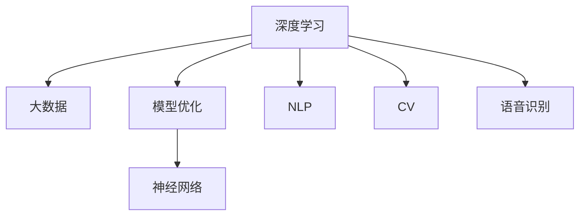

                 

## 1. 背景介绍

### 1.1 问题由来

近年来，人工智能（AI）技术迅猛发展，正在迎来“奇点大爆炸”的时代。在深度学习、大数据、神经网络等技术的驱动下，AI在自然语言处理、计算机视觉、语音识别等众多领域取得了革命性的突破。

然而，尽管AI技术取得了诸多成就，但在应用落地时仍面临诸多难题。其中，如何构建高效、可靠、可解释的AI系统，成为目前研究的核心挑战之一。本文将系统介绍AI系统的构建原则，通过实例分析来阐述AI“奇点大爆炸”时代的到来，并展望未来AI技术的发展方向。

### 1.2 问题核心关键点

1. **高效性**：AI系统需要具备高效的计算能力和模型优化能力，能够在较短时间内处理大规模数据。
2. **可靠性**：AI系统需要在各种环境和场景下保持稳定、可靠，避免出现误识别、误操作等问题。
3. **可解释性**：AI系统需要具备良好的解释能力，便于理解模型的决策过程，提升用户信任度。
4. **通用性**：AI系统需要具备较强的泛化能力，能够在不同的领域和任务中应用。
5. **实时性**：AI系统需要具备实时响应能力，能够快速处理实时数据，提升用户体验。

这些核心关键点共同构成了构建高效、可靠、可解释的AI系统的基础框架。本文将详细探讨这些关键点，并通过实例分析，阐述AI“奇点大爆炸”时代的到来。

## 2. 核心概念与联系

### 2.1 核心概念概述

为更好地理解AI系统的构建，本节将介绍几个密切相关的核心概念：

- **深度学习**：通过构建多层神经网络，实现数据的复杂映射关系。深度学习是当前AI技术的主流范式。
- **大数据**：指规模庞大、类型多样的数据集，是深度学习模型训练的基础。
- **模型优化**：指通过反向传播、梯度下降等技术，对模型参数进行优化，提升模型性能。
- **神经网络**：由大量节点和连接构成的计算模型，能够实现数据的特征提取和分类。
- **自然语言处理（NLP）**：指使计算机能够理解和处理人类语言的技术，广泛应用于智能客服、智能翻译等场景。
- **计算机视觉（CV）**：指使计算机能够理解和处理图像和视频的技术，广泛应用于自动驾驶、医疗影像等领域。
- **语音识别**：指使计算机能够理解和处理人类语音的技术，广泛应用于智能助手、语音控制等场景。

这些核心概念之间的逻辑关系可以通过以下Mermaid流程图来展示：



这个流程图展示了几类核心概念的相互关系：

1. 深度学习和大数据是模型优化的基础。
2. 神经网络是深度学习模型的核心组件。
3. 自然语言处理、计算机视觉和语音识别是深度学习在特定领域的典型应用。

这些概念共同构成了AI技术的基本框架，使其能够在各种场景下发挥强大的计算能力。通过理解这些核心概念，我们可以更好地把握AI技术的本质和工作原理。

## 3. 核心算法原理 & 具体操作步骤

### 3.1 算法原理概述

AI系统的构建，本质上是一个复杂的计算和优化过程。其核心思想是通过大量数据和计算资源，训练出一个高性能的模型，并不断优化该模型以适应不同的应用场景。

形式化地，假设AI系统由神经网络模型 $M_{\theta}$ 构成，其中 $\theta$ 为模型参数。给定训练集 $D=\{(x_i,y_i)\}_{i=1}^N$，模型的优化目标是最小化经验风险，即找到最优参数：

$$
\theta^* = \mathop{\arg\min}_{\theta} \mathcal{L}(M_{\theta},D)
$$

其中 $\mathcal{L}$ 为损失函数，用于衡量模型预测输出与真实标签之间的差异。常见的损失函数包括交叉熵损失、均方误差损失等。

通过梯度下降等优化算法，模型不断更新参数 $\theta$，最小化损失函数 $\mathcal{L}$，使得模型输出逼近真实标签。由于神经网络模型的复杂性，训练过程往往需要耗费大量计算资源和时间。

### 3.2 算法步骤详解

AI系统的构建通常包括以下几个关键步骤：

**Step 1: 数据准备**
- 收集并清洗大规模数据集，如自然语言文本、图像、语音等。
- 划分训练集、验证集和测试集，确保数据的分布与实际应用场景相符。

**Step 2: 模型选择与设计**
- 选择合适的神经网络架构，如卷积神经网络（CNN）、循环神经网络（RNN）、Transformer等。
- 设计合适的模型层数、节点数和激活函数等，确保模型的计算能力和泛化能力。

**Step 3: 模型训练与优化**
- 使用反向传播算法和梯度下降技术，对模型参数进行优化。
- 通过正则化技术（如L2正则、Dropout等）避免过拟合，提高模型泛化能力。
- 应用数据增强技术（如数据回译、数据扩充等）提高模型对新数据的适应能力。

**Step 4: 模型评估与调整**
- 在测试集上评估模型性能，如准确率、召回率、F1值等。
- 根据评估结果调整模型参数，如调整学习率、优化器等。
- 重复训练与评估过程，直至模型性能满足预期。

**Step 5: 模型部署与应用**
- 将训练好的模型部署到生产环境中，提供API接口供应用系统调用。
- 实时监控模型性能，确保其在实际应用场景中稳定运行。
- 不断收集新数据，持续优化模型，保持其高效性和可靠性。

以上是AI系统构建的一般流程。在实际应用中，还需要根据具体任务的需求，对各个环节进行优化和改进，以实现最佳性能。

### 3.3 算法优缺点

AI系统的构建方法具有以下优点：
1. 灵活性高。通过选择合适的模型和设计，可以适应各种不同的应用场景。
2. 泛化能力强。通过大规模数据训练，模型能够泛化到新的数据和场景。
3. 可解释性强。深度学习模型可以通过可视化技术，展示模型的决策过程。
4. 应用广泛。AI技术在自然语言处理、计算机视觉、语音识别等多个领域得到了广泛应用。

同时，该方法也存在一定的局限性：
1. 资源消耗大。训练深度学习模型需要大量计算资源和时间，资源消耗大。
2. 过拟合风险高。大规模数据训练可能引发过拟合问题，模型泛化性能降低。
3. 可解释性不足。深度学习模型通常缺乏可解释性，难以理解其内部工作机制。
4. 应用难度高。AI系统的构建和优化需要较高的技术门槛，对开发人员的要求较高。

尽管存在这些局限性，但就目前而言，基于深度学习的AI系统构建范式仍是最主流的方法。未来相关研究的重点在于如何进一步降低资源消耗，提高模型的可解释性和泛化能力，同时兼顾应用难度和技术门槛。

### 3.4 算法应用领域

AI系统的构建方法在多个领域得到了广泛应用，例如：

- 自然语言处理（NLP）：如智能客服、智能翻译、智能摘要等。
- 计算机视觉（CV）：如图像分类、物体检测、图像生成等。
- 语音识别：如语音识别、语音合成、语音翻译等。
- 自动驾驶：如目标检测、行为预测、路径规划等。
- 医疗影像：如病变检测、图像分割、诊断预测等。
- 智能推荐：如个性化推荐、内容推荐、广告推荐等。

除了这些经典应用外，AI系统还被创新性地应用于更多领域，如智能家居、智慧城市、金融风控等，为各行各业带来了革命性的变化。随着AI技术的不断进步，相信其在更多领域的应用前景将更加广阔。

## 4. 数学模型和公式 & 详细讲解 & 举例说明

### 4.1 数学模型构建

本节将使用数学语言对AI系统的构建过程进行更加严格的刻画。

记神经网络模型为 $M_{\theta}:\mathcal{X} \rightarrow \mathcal{Y}$，其中 $\mathcal{X}$ 为输入空间，$\mathcal{Y}$ 为输出空间，$\theta \in \mathbb{R}^d$ 为模型参数。假设训练集为 $D=\{(x_i,y_i)\}_{i=1}^N, x_i \in \mathcal{X}, y_i \in \mathcal{Y}$。

定义模型 $M_{\theta}$ 在输入 $x$ 上的损失函数为 $\ell(M_{\theta}(x),y)$，则在数据集 $D$ 上的经验风险为：

$$
\mathcal{L}(\theta) = \frac{1}{N} \sum_{i=1}^N \ell(M_{\theta}(x_i),y_i)
$$

模型的优化目标是最小化经验风险，即找到最优参数：

$$
\theta^* = \mathop{\arg\min}_{\theta} \mathcal{L}(\theta)
$$

在实践中，我们通常使用基于梯度的优化算法（如SGD、Adam等）来近似求解上述最优化问题。设 $\eta$ 为学习率，$\lambda$ 为正则化系数，则参数的更新公式为：

$$
\theta \leftarrow \theta - \eta \nabla_{\theta}\mathcal{L}(\theta) - \eta\lambda\theta
$$

其中 $\nabla_{\theta}\mathcal{L}(\theta)$ 为损失函数对参数 $\theta$ 的梯度，可通过反向传播算法高效计算。

### 4.2 公式推导过程

以下我们以分类任务为例，推导交叉熵损失函数及其梯度的计算公式。

假设模型 $M_{\theta}$ 在输入 $x$ 上的输出为 $\hat{y}=M_{\theta}(x) \in [0,1]$，表示样本属于正类的概率。真实标签 $y \in \{0,1\}$。则二分类交叉熵损失函数定义为：

$$
\ell(M_{\theta}(x),y) = -[y\log \hat{y} + (1-y)\log (1-\hat{y})]
$$

将其代入经验风险公式，得：

$$
\mathcal{L}(\theta) = -\frac{1}{N}\sum_{i=1}^N [y_i\log M_{\theta}(x_i)+(1-y_i)\log(1-M_{\theta}(x_i))]
$$

根据链式法则，损失函数对参数 $\theta_k$ 的梯度为：

$$
\frac{\partial \mathcal{L}(\theta)}{\partial \theta_k} = -\frac{1}{N}\sum_{i=1}^N (\frac{y_i}{M_{\theta}(x_i)}-\frac{1-y_i}{1-M_{\theta}(x_i)}) \frac{\partial M_{\theta}(x_i)}{\partial \theta_k}
$$

其中 $\frac{\partial M_{\theta}(x_i)}{\partial \theta_k}$ 可进一步递归展开，利用自动微分技术完成计算。

在得到损失函数的梯度后，即可带入参数更新公式，完成模型的迭代优化。重复上述过程直至收敛，最终得到适应下游任务的最优模型参数 $\theta^*$。

## 5. 项目实践：代码实例和详细解释说明

### 5.1 开发环境搭建

在进行AI系统构建实践前，我们需要准备好开发环境。以下是使用Python进行PyTorch开发的环境配置流程：

1. 安装Anaconda：从官网下载并安装Anaconda，用于创建独立的Python环境。

2. 创建并激活虚拟环境：
```bash
conda create -n pytorch-env python=3.8 
conda activate pytorch-env
```

3. 安装PyTorch：根据CUDA版本，从官网获取对应的安装命令。例如：
```bash
conda install pytorch torchvision torchaudio cudatoolkit=11.1 -c pytorch -c conda-forge
```

4. 安装TensorFlow：由Google主导开发的开源深度学习框架，生产部署方便，适合大规模工程应用。同样有丰富的预训练语言模型资源。

5. 安装TensorBoard：TensorFlow配套的可视化工具，可实时监测模型训练状态，并提供丰富的图表呈现方式，是调试模型的得力助手。

完成上述步骤后，即可在`pytorch-env`环境中开始AI系统构建实践。

### 5.2 源代码详细实现

这里我们以图像分类任务为例，给出使用PyTorch和TensorFlow构建卷积神经网络（CNN）的代码实现。

首先，定义CNN模型的层级结构：

```python
import torch.nn as nn

class Net(nn.Module):
    def __init__(self):
        super(Net, self).__init__()
        self.conv1 = nn.Conv2d(3, 16, kernel_size=3, stride=1, padding=1)
        self.relu1 = nn.ReLU()
        self.pool1 = nn.MaxPool2d(kernel_size=2, stride=2)
        self.conv2 = nn.Conv2d(16, 32, kernel_size=3, stride=1, padding=1)
        self.relu2 = nn.ReLU()
        self.pool2 = nn.MaxPool2d(kernel_size=2, stride=2)
        self.fc1 = nn.Linear(7 * 7 * 32, 512)
        self.relu3 = nn.ReLU()
        self.fc2 = nn.Linear(512, 10)
    
    def forward(self, x):
        x = self.conv1(x)
        x = self.relu1(x)
        x = self.pool1(x)
        x = self.conv2(x)
        x = self.relu2(x)
        x = self.pool2(x)
        x = x.view(-1, 7 * 7 * 32)
        x = self.fc1(x)
        x = self.relu3(x)
        x = self.fc2(x)
        return x
```

然后，定义模型训练和评估函数：

```python
import torch.optim as optim
from torch.utils.data import DataLoader
from torchvision import datasets, transforms

device = torch.device('cuda' if torch.cuda.is_available() else 'cpu')

def train_epoch(model, data_loader, optimizer):
    model.train()
    running_loss = 0.0
    for batch_idx, (inputs, labels) in enumerate(data_loader):
        inputs, labels = inputs.to(device), labels.to(device)
        optimizer.zero_grad()
        outputs = model(inputs)
        loss = nn.functional.cross_entropy(outputs, labels)
        loss.backward()
        optimizer.step()
        running_loss += loss.item()
    return running_loss / len(data_loader)

def evaluate(model, data_loader):
    model.eval()
    running_loss = 0.0
    correct = 0
    with torch.no_grad():
        for batch_idx, (inputs, labels) in enumerate(data_loader):
            inputs, labels = inputs.to(device), labels.to(device)
            outputs = model(inputs)
            loss = nn.functional.cross_entropy(outputs, labels)
            running_loss += loss.item()
            _, predicted = torch.max(outputs.data, 1)
            correct += (predicted == labels).sum().item()
    return running_loss / len(data_loader), correct / len(data_loader.dataset)
```

接着，准备数据集和模型训练：

```python
transform = transforms.Compose([
    transforms.ToTensor(),
    transforms.Normalize((0.5, 0.5, 0.5), (0.5, 0.5, 0.5))
])

train_dataset = datasets.CIFAR10(root='./data', train=True, download=True, transform=transform)
train_loader = DataLoader(train_dataset, batch_size=64, shuffle=True)

model = Net().to(device)
optimizer = optim.SGD(model.parameters(), lr=0.01, momentum=0.9)

for epoch in range(10):
    train_loss = train_epoch(model, train_loader, optimizer)
    test_loss, accuracy = evaluate(model, train_loader)
    print(f'Epoch {epoch+1}, train loss: {train_loss:.4f}, test loss: {test_loss:.4f}, accuracy: {accuracy:.4f}')
```

以上就是使用PyTorch构建图像分类任务的代码实现。可以看到，借助PyTorch的高级API，模型构建和训练过程变得简洁高效。

### 5.3 代码解读与分析

让我们再详细解读一下关键代码的实现细节：

**Net类**：
- `__init__`方法：定义了模型的层级结构，包括卷积层、激活函数、池化层、全连接层等。
- `forward`方法：定义了模型的前向传播过程，从输入到输出。

**train_epoch函数**：
- 在训练模式下，对输入数据进行前向传播，计算损失函数，并反向传播更新参数。

**evaluate函数**：
- 在评估模式下，对输入数据进行前向传播，计算损失函数和分类准确率，并将结果记录下来。

**train流程**：
- 定义训练集数据集和加载器，设置模型、优化器和训练轮数。
- 在每个epoch内，对训练集数据进行训练，并输出训练损失和评估结果。

可以看到，PyTorch和TensorFlow等深度学习框架提供了丰富的工具和库，使得AI系统的构建过程变得更加快捷和高效。

## 6. 实际应用场景

### 6.1 智能客服系统

AI系统的构建在智能客服系统中的应用，可以大幅提升客户咨询体验和问题解决效率。传统客服往往需要配备大量人力，高峰期响应缓慢，且一致性和专业性难以保证。而使用构建好的AI系统，可以7x24小时不间断服务，快速响应客户咨询，用自然流畅的语言解答各类常见问题。

在技术实现上，可以收集企业内部的历史客服对话记录，将问题和最佳答复构建成监督数据，在此基础上对预训练语言模型进行微调。微调后的语言模型能够自动理解用户意图，匹配最合适的答案模板进行回复。对于客户提出的新问题，还可以接入检索系统实时搜索相关内容，动态组织生成回答。如此构建的智能客服系统，能大幅提升客户咨询体验和问题解决效率。

### 6.2 金融舆情监测

金融机构需要实时监测市场舆论动向，以便及时应对负面信息传播，规避金融风险。传统的人工监测方式成本高、效率低，难以应对网络时代海量信息爆发的挑战。基于AI系统的构建，金融舆情监测得以实现更加高效、精准的自动化。

具体而言，可以收集金融领域相关的新闻、报道、评论等文本数据，并对其进行主题标注和情感标注。在此基础上对构建好的语言模型进行微调，使其能够自动判断文本属于何种主题，情感倾向是正面、中性还是负面。将构建好的模型应用到实时抓取的网络文本数据，就能够自动监测不同主题下的情感变化趋势，一旦发现负面信息激增等异常情况，系统便会自动预警，帮助金融机构快速应对潜在风险。

### 6.3 个性化推荐系统

当前的推荐系统往往只依赖用户的历史行为数据进行物品推荐，无法深入理解用户的真实兴趣偏好。基于AI系统的构建，个性化推荐系统可以更好地挖掘用户行为背后的语义信息，从而提供更精准、多样的推荐内容。

在实践中，可以收集用户浏览、点击、评论、分享等行为数据，提取和用户交互的物品标题、描述、标签等文本内容。将文本内容作为模型输入，用户的后续行为（如是否点击、购买等）作为监督信号，在此基础上构建好的语言模型进行微调。微调后的模型能够从文本内容中准确把握用户的兴趣点。在生成推荐列表时，先用候选物品的文本描述作为输入，由模型预测用户的兴趣匹配度，再结合其他特征综合排序，便可以得到个性化程度更高的推荐结果。

### 6.4 未来应用展望

随着AI系统的不断完善，未来其应用场景将更加广阔，带来更加深远的影响：

- **医疗诊断**：基于AI系统的构建，医疗影像分析和诊断系统得以实现。构建好的模型可以自动判断影像中的病变情况，提高诊断效率和准确性。
- **自动驾驶**：基于AI系统的构建，自动驾驶系统得以实现。构建好的模型可以自动感知环境、规划路径，提升驾驶安全性。
- **智慧城市**：基于AI系统的构建，智慧城市管理系统得以实现。构建好的模型可以实时监测交通流量、优化资源配置，提升城市运行效率。
- **智能家居**：基于AI系统的构建，智能家居系统得以实现。构建好的模型可以自动控制家电、优化生活环境，提升生活质量。
- **金融风控**：基于AI系统的构建，金融风险预测和控制系统得以实现。构建好的模型可以实时监测市场风险，提前预警，规避损失。

## 7. 工具和资源推荐

### 7.1 学习资源推荐

为了帮助开发者系统掌握AI系统的构建技术，这里推荐一些优质的学习资源：

1. 《深度学习》（Deep Learning）书籍：Ian Goodfellow等著，系统介绍了深度学习的理论基础和实践技术。
2. 《动手学深度学习》（Dive into Deep Learning）：李沐等著，结合PyTorch实现深度学习模型训练和优化。
3. 《计算机视觉：模型、学习和推理》（Computer Vision: Models, Learning, and Inference）：Jitendra Malik等著，系统介绍了计算机视觉的各个方面。
4. 《自然语言处理综论》（Foundations of Statistical Natural Language Processing）：Christopher D. Manning等著，系统介绍了自然语言处理的理论基础和实践技术。
5. 《Python深度学习》（Python Deep Learning）：Francois Chollet著，系统介绍了TensorFlow和Keras框架的深度学习模型构建和训练。

通过对这些资源的学习实践，相信你一定能够快速掌握AI系统的构建技术，并用于解决实际的AI问题。

### 7.2 开发工具推荐

高效的开发离不开优秀的工具支持。以下是几款用于AI系统构建开发的常用工具：

1. PyTorch：基于Python的开源深度学习框架，灵活动态的计算图，适合快速迭代研究。
2. TensorFlow：由Google主导开发的开源深度学习框架，生产部署方便，适合大规模工程应用。
3. Jupyter Notebook：用于数据科学和机器学习的交互式笔记本，方便开发者进行实验和调试。
4. Weights & Biases：模型训练的实验跟踪工具，可以记录和可视化模型训练过程中的各项指标，方便对比和调优。
5. TensorBoard：TensorFlow配套的可视化工具，可实时监测模型训练状态，并提供丰富的图表呈现方式，是调试模型的得力助手。

合理利用这些工具，可以显著提升AI系统构建的开发效率，加快创新迭代的步伐。

### 7.3 相关论文推荐

AI系统的构建方法得益于学界的持续研究。以下是几篇奠基性的相关论文，推荐阅读：

1. 《ImageNet Classification with Deep Convolutional Neural Networks》（AlexNet论文）：提出了卷积神经网络（CNN）结构，开创了深度学习在计算机视觉领域的应用。
2. 《Deep Residual Learning for Image Recognition》（ResNet论文）：提出了残差网络（ResNet）结构，解决了深度网络中的梯度消失问题，提高了模型的训练效率和性能。
3. 《Attention is All You Need》：提出了Transformer结构，实现了自然语言处理领域的革命性突破。
4. 《Image Captioning with Visual Attention》：提出了基于视觉注意力机制的图像描述生成模型，提升了图像描述的质量。
5. 《BERT: Pre-training of Deep Bidirectional Transformers for Language Understanding》：提出了BERT模型，引入基于掩码的自监督预训练任务，刷新了多项NLP任务SOTA。

这些论文代表了大模型构建技术的发展脉络。通过学习这些前沿成果，可以帮助研究者把握学科前进方向，激发更多的创新灵感。

## 8. 总结：未来发展趋势与挑战

### 8.1 总结

本文对AI系统的构建方法进行了全面系统的介绍。首先阐述了AI系统的构建背景和应用场景，明确了AI系统高效、可靠、可解释性的重要性。其次，从原理到实践，详细讲解了AI系统的构建过程和关键技术，给出了AI系统构建的完整代码实例。同时，本文还广泛探讨了AI系统在智能客服、金融舆情、个性化推荐等多个领域的应用前景，展示了AI系统构建的广泛潜力。此外，本文精选了AI系统的学习资源、开发工具和相关论文，力求为开发者提供全方位的技术指引。

通过本文的系统梳理，可以看到，AI系统的构建方法正在引领AI技术迈向“奇点大爆炸”的时代，极大地提升了AI系统的性能和应用范围。未来，伴随AI技术的不断进步，AI系统的构建方法和应用场景将更加多样化和智能化，为各个行业带来革命性的变革。

### 8.2 未来发展趋势

展望未来，AI系统的构建方法将呈现以下几个发展趋势：

1. **模型复杂度提升**：随着算力成本的下降和数据量的增大，构建的模型将越来越复杂，具备更强的计算能力和泛化能力。
2. **多模态融合**：AI系统将融合视觉、语音、文本等多种模态数据，提升对现实世界的理解能力。
3. **联邦学习**：构建AI系统时，将采用联邦学习技术，在多个节点上进行分布式训练，提升模型泛化能力。
4. **自动化学习**：构建AI系统时，将引入自动化学习技术，自动调整模型参数，优化模型性能。
5. **模型压缩和优化**：构建AI系统时，将采用模型压缩和优化技术，减小模型尺寸，提升推理速度。

这些趋势将使AI系统具备更强的计算能力、泛化能力和自适应能力，能够在更广泛的应用场景下实现智能化和自动化。

### 8.3 面临的挑战

尽管AI系统的构建方法已经取得了显著成就，但在迈向更加智能化、普适化应用的过程中，仍面临诸多挑战：

1. **数据获取难度大**：高质量的数据获取和处理难度大，数据质量问题严重。
2. **过拟合风险高**：构建AI系统时，模型复杂度增加，过拟合风险也随之增加，泛化性能降低。
3. **可解释性不足**：构建的AI系统缺乏可解释性，难以理解其内部工作机制。
4. **资源消耗大**：构建AI系统需要大量计算资源和时间，资源消耗大。
5. **安全性和隐私保护**：AI系统在应用过程中，涉及大量个人隐私数据，如何保护数据安全和用户隐私是一个重要问题。

尽管存在这些挑战，但随着学界和产业界的共同努力，AI系统的构建方法将不断进步，最终实现高效、可靠、可解释的AI系统。

### 8.4 研究展望

面对AI系统构建所面临的挑战，未来的研究需要在以下几个方面寻求新的突破：

1. **无监督和半监督学习**：摆脱对大规模标注数据的依赖，利用自监督学习、主动学习等无监督和半监督范式，最大限度利用非结构化数据。
2. **模型压缩和优化**：开发更加参数高效的模型，在固定大部分预训练参数的情况下，只更新极少量的任务相关参数。
3. **联邦学习和分布式训练**：引入联邦学习和分布式训练技术，在多个节点上进行分布式训练，提升模型泛化能力。
4. **自动化学习和自适应学习**：引入自动化学习和自适应学习技术，自动调整模型参数，优化模型性能。
5. **模型压缩和优化**：采用模型压缩和优化技术，减小模型尺寸，提升推理速度。
6. **可解释性增强**：引入可解释性增强技术，提高AI系统的可解释性和透明性。
7. **数据安全和隐私保护**：研究数据安全和隐私保护技术，确保AI系统在应用过程中的数据安全和用户隐私。

这些研究方向的探索，将引领AI系统的构建方法迈向更高的台阶，为构建安全、可靠、可解释、可控的智能系统铺平道路。面向未来，AI系统的构建方法还需要与其他人工智能技术进行更深入的融合，如知识表示、因果推理、强化学习等，多路径协同发力，共同推动AI技术的进步。只有勇于创新、敢于突破，才能不断拓展AI系统的边界，让智能技术更好地造福人类社会。

## 9. 附录：常见问题与解答

**Q1：AI系统构建的主要难点是什么？**

A: AI系统构建的主要难点包括：

1. 数据获取难度大：高质量的数据获取和处理难度大，数据质量问题严重。
2. 模型复杂度提升：随着算力成本的下降和数据量的增大，构建的模型将越来越复杂，泛化性能降低。
3. 过拟合风险高：模型复杂度增加，过拟合风险也随之增加，泛化性能降低。
4. 可解释性不足：缺乏可解释性，难以理解其内部工作机制。
5. 资源消耗大：构建AI系统需要大量计算资源和时间，资源消耗大。

**Q2：AI系统在构建过程中如何避免过拟合？**

A: 避免过拟合的方法包括：

1. 数据增强：通过数据扩充、数据增强等技术，丰富训练集的多样性。
2. 正则化：使用L2正则、Dropout、Early Stopping等正则化技术，避免过拟合。
3. 模型压缩和优化：采用模型压缩和优化技术，减小模型尺寸，提升泛化能力。
4. 联邦学习和分布式训练：在多个节点上进行分布式训练，提升模型泛化能力。
5. 自动化学习和自适应学习：引入自动化学习和自适应学习技术，自动调整模型参数，优化模型性能。

**Q3：AI系统在构建过程中如何提高可解释性？**

A: 提高AI系统可解释性的方法包括：

1. 可视化技术：使用可视化技术，展示模型的决策过程。
2. 可解释性增强：引入可解释性增强技术，提高AI系统的透明性和可解释性。
3. 符号表示和逻辑推理：引入符号表示和逻辑推理技术，提高模型的可解释性。

**Q4：AI系统在构建过程中如何保证数据安全和用户隐私？**

A: 保证数据安全和用户隐私的方法包括：

1. 数据脱敏：对敏感数据进行脱敏处理，保护用户隐私。
2. 数据加密：对数据进行加密处理，防止数据泄露。
3. 访问控制：设置访问权限，限制数据访问权限，保护数据安全。
4. 安全审计：定期进行安全审计，发现并修复潜在的安全漏洞。

通过这些方法的综合应用，可以有效保护AI系统在构建和应用过程中的数据安全和用户隐私。

---

作者：禅与计算机程序设计艺术 / Zen and the Art of Computer Programming

