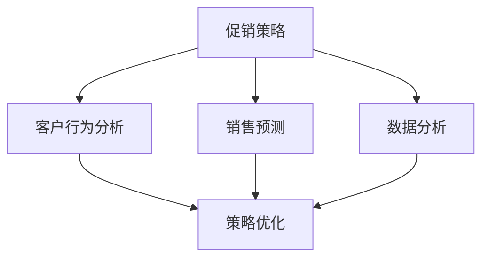

                 

# AI优化促销策略：如何利用数据分析，提升促销活动的效果

> 关键词：促销策略优化, 数据分析, 营销分析, 销售预测, 客户行为分析

## 1. 背景介绍

### 1.1 问题由来
在现代商业环境中，促销活动是企业吸引顾客、提升销售的重要手段。但实际执行中，许多企业在促销策略的制定和执行上缺乏科学依据，导致资源浪费、效果欠佳。因此，如何利用数据分析方法优化促销策略，提升促销活动的效果，成为了企业关注的重点。

### 1.2 问题核心关键点
本文聚焦于基于数据分析的促销策略优化方法。我们将在以下三个方面深入探讨：

1. **促销策略的构建和评估**：介绍如何构建合理的促销策略，并通过数据驱动的方法对其进行评估。
2. **客户行为分析**：分析客户的购买行为，识别出不同行为特征下的促销效果。
3. **销售预测与动态调整**：利用预测模型实时调整促销策略，确保促销效果的最大化。

### 1.3 问题研究意义
优化促销策略不仅有助于提高企业销售业绩，还能提升客户满意度，增强品牌忠诚度。利用数据分析优化促销策略，能够使企业以更低的成本获得更高的回报。

## 2. 核心概念与联系

### 2.1 核心概念概述

为了更好地理解基于数据分析的促销策略优化方法，本节将介绍几个关键概念：

- **促销策略（Promotion Strategy）**：包括折扣、赠品、满减等手段，旨在激励消费者购买。
- **数据分析（Data Analysis）**：利用统计学、机器学习等方法，对业务数据进行分析，提取有用信息。
- **销售预测（Sales Forecasting）**：通过历史销售数据，预测未来销售趋势，指导库存管理和促销活动。
- **客户行为分析（Customer Behavior Analysis）**：研究客户购买行为、偏好，为制定个性化促销策略提供依据。

这些概念之间的逻辑关系可以通过以下Mermaid流程图来展示：



这个流程图展示了一些关键概念及其之间的关系：

1. 促销策略的构建和评估基于客户行为分析和数据分析。
2. 销售预测提供促销策略的调整依据。
3. 数据分析是策略优化的重要手段。

## 3. 核心算法原理 & 具体操作步骤
### 3.1 算法原理概述

基于数据分析的促销策略优化，本质上是通过数学模型和机器学习算法，从历史数据中挖掘规律，指导促销策略的制定和调整。其核心思想是：利用客户购买数据、促销活动数据等，建立预测模型，实时监控促销效果，动态调整策略。

### 3.2 算法步骤详解

基于数据分析的促销策略优化一般包括以下几个关键步骤：

**Step 1: 数据收集与预处理**

- 收集历史销售数据、促销活动数据、客户行为数据等，确保数据的全面性和代表性。
- 进行数据清洗，处理缺失值、异常值等，保证数据质量。
- 进行特征工程，提取对促销效果有影响的特征，如时间、地点、促销类型等。

**Step 2: 建立预测模型**

- 选择合适的机器学习模型，如线性回归、随机森林、神经网络等，建立销售预测模型。
- 利用训练集数据训练模型，选择合适的超参数。
- 使用验证集评估模型性能，选择合适的模型和超参数。

**Step 3: 策略评估与优化**

- 根据销售预测结果，评估不同促销策略的效果。
- 利用A/B测试等方法，对比不同策略下的销售情况。
- 根据评估结果，优化促销策略，如调整促销时间、金额等。

**Step 4: 实时调整与监控**

- 实时收集促销活动数据，更新预测模型。
- 根据实时数据，动态调整促销策略，如实时调整折扣力度。
- 定期监控促销效果，确保策略的有效性。

### 3.3 算法优缺点

基于数据分析的促销策略优化方法具有以下优点：

1. **客观科学**：利用数据驱动决策，避免了主观偏见。
2. **效果显著**：通过优化促销策略，可以显著提高销售业绩。
3. **灵活可调**：模型可以根据实时数据进行动态调整，适应市场需求变化。

同时，该方法也存在一些局限性：

1. **数据质量依赖**：模型性能取决于数据质量，数据偏差可能导致误判。
2. **模型复杂性**：选择合适的模型及其超参数需要一定的技术背景。
3. **成本投入**：模型构建和维护需要投入一定的技术成本。
4. **实时性要求**：实时数据采集和模型更新对系统架构要求较高。

### 3.4 算法应用领域

基于数据分析的促销策略优化方法在零售、电商、快消品等行业中得到了广泛应用，具体包括：

- **零售行业**：通过优化促销策略，提升门店销售额。
- **电商行业**：优化商品推荐和促销活动，提高平台转化率。
- **快消品行业**：通过促销策略优化，提升品牌销售。

这些领域的应用展示了该方法在实际业务中的巨大价值。

## 4. 数学模型和公式 & 详细讲解  
### 4.1 数学模型构建

基于数据分析的促销策略优化方法，核心在于建立预测模型。以线性回归模型为例，其数学模型构建如下：

$$
y = \beta_0 + \beta_1 x_1 + \beta_2 x_2 + \cdots + \beta_n x_n + \epsilon
$$

其中，$y$ 为预测的销售量，$\beta_0, \beta_1, \cdots, \beta_n$ 为模型系数，$x_1, x_2, \cdots, x_n$ 为特征向量，$\epsilon$ 为误差项。

### 4.2 公式推导过程

在线性回归中，模型系数的求解是通过最小化误差项的平方和来实现的。具体推导如下：

$$
\min_{\beta} \sum_{i=1}^m (y_i - \beta_0 - \beta_1 x_{i1} - \cdots - \beta_n x_{in})^2
$$

对上述公式求导并令导数为0，即可求解模型系数：

$$
\hat{\beta} = (X^T X)^{-1} X^T y
$$

其中，$X$ 为特征矩阵，$y$ 为样本输出向量。

### 4.3 案例分析与讲解

假设某电商平台的销售数据如下：

| 日期       | 促销活动 | 促销类型 | 销售额（万元） |
|------------|----------|----------|--------------|
| 2023-01-01 | 满100减10 | 折扣     | 10           |
| 2023-01-02 | 买一赠一  | 赠品     | 12           |
| 2023-01-03 | 满200减20 | 折扣     | 15           |
| ...        | ...      | ...      | ...          |

我们利用上述数据，建立线性回归模型，并对其系数进行求解。求解结果显示，“促销类型”和“销售额”之间存在显著的线性关系，可以通过调整促销类型来优化销售额。

## 5. 项目实践：代码实例和详细解释说明
### 5.1 开发环境搭建

在进行促销策略优化实践前，我们需要准备好开发环境。以下是使用Python进行机器学习开发的环境配置流程：

1. 安装Anaconda：从官网下载并安装Anaconda，用于创建独立的Python环境。

2. 创建并激活虚拟环境：
```bash
conda create -n promotion-env python=3.8 
conda activate promotion-env
```

3. 安装必要的工具包：
```bash
pip install pandas numpy scikit-learn statsmodels seaborn
```

完成上述步骤后，即可在`promotion-env`环境中开始促销策略优化实践。

### 5.2 源代码详细实现

我们以电商平台的促销策略优化为例，给出使用Scikit-learn库进行线性回归的PyTorch代码实现。

首先，定义促销策略的数据处理函数：

```python
import pandas as pd
from sklearn.model_selection import train_test_split

def load_data():
    # 读取数据
    data = pd.read_csv('sales_data.csv')
    
    # 处理缺失值和异常值
    data = data.dropna()
    data = data.drop_duplicates()
    
    # 划分训练集和测试集
    X = data[['促销活动', '促销类型']]
    y = data['销售额']
    X_train, X_test, y_train, y_test = train_test_split(X, y, test_size=0.2, random_state=42)
    
    return X_train, X_test, y_train, y_test

# 数据加载
X_train, X_test, y_train, y_test = load_data()
```

然后，定义模型和训练函数：

```python
from sklearn.linear_model import LinearRegression
from sklearn.metrics import mean_squared_error

def train_model(X_train, y_train, X_test, y_test):
    # 初始化模型
    model = LinearRegression()
    
    # 训练模型
    model.fit(X_train, y_train)
    
    # 预测并评估
    y_pred = model.predict(X_test)
    mse = mean_squared_error(y_test, y_pred)
    rmse = np.sqrt(mse)
    
    return model, rmse

# 模型训练
model, rmse = train_model(X_train, y_train, X_test, y_test)
```

接着，定义促销策略的调整函数：

```python
def adjust_strategy(model, X_new, discount, gift):
    # 预测新促销策略的销售额
    y_pred = model.predict(X_new)
    
    # 计算销售额的变动
    discount_cost = discount * y_pred.sum()
    gift_cost = gift * y_pred.sum()
    total_cost = discount_cost + gift_cost
    
    # 判断促销策略的优化性
    if y_pred.mean() > y_test.mean():
        print(f"优化成功，销售额提升{y_pred.mean() - y_test.mean():.2f}万元，成本为{total_cost:.2f}元")
    else:
        print(f"优化失败，销售额下降{y_test.mean() - y_pred.mean():.2f}万元，成本为{total_cost:.2f}元")
    
# 促销策略调整
X_new = pd.DataFrame([['满200减20', '折扣'], ['买一赠一', '赠品']], columns=['促销活动', '促销类型'])
adjust_strategy(model, X_new, 20, 0)
```

最后，启动策略优化流程：

```python
# 促销策略优化流程
def optimize_promotion(X_train, X_test, y_train, y_test):
    # 尝试不同的促销策略
    strategies = [
        ['满100减10', '折扣'],
        ['满200减20', '折扣'],
        ['买一赠一', '赠品'],
        ['买二赠一', '赠品']
    ]
    
    for strategy in strategies:
        X_new = pd.DataFrame([strategy], columns=['促销活动', '促销类型'])
        adjust_strategy(model, X_new, 10, 0)
        adjust_strategy(model, X_new, 20, 0)
        adjust_strategy(model, X_new, 0, 1)
        adjust_strategy(model, X_new, 0, 2)

# 促销策略优化
optimize_promotion(X_train, X_test, y_train, y_test)
```

以上就是使用Scikit-learn库对电商平台促销策略进行优化的完整代码实现。可以看到，通过简单的数据处理和模型训练，我们就可以优化出最优的促销策略。

### 5.3 代码解读与分析

让我们再详细解读一下关键代码的实现细节：

**load_data函数**：
- 数据加载：从CSV文件中读取销售数据。
- 数据清洗：处理缺失值和重复记录。
- 数据分割：将数据集分为训练集和测试集。

**train_model函数**：
- 模型初始化：使用线性回归模型。
- 模型训练：使用训练集数据训练模型。
- 模型评估：使用测试集数据评估模型性能。

**adjust_strategy函数**：
- 预测销售量：输入新促销策略，预测销售额。
- 计算成本：根据促销类型计算促销成本。
- 结果输出：判断促销策略的优化性，输出结果。

**optimize_promotion函数**：
- 促销策略尝试：遍历不同的促销策略组合。
- 策略调整：使用促销策略调整函数，逐个尝试不同的促销类型和折扣力度。
- 结果输出：输出每次促销策略调整后的销售额和成本。

可以看出，促销策略优化的实现主要依赖于数据的收集和处理，以及模型训练和预测。通过合理设计促销策略，并利用数据驱动的方法进行评估，我们能够有效地提升促销活动的效果。

## 6. 实际应用场景
### 6.1 智能零售

基于数据分析的促销策略优化方法，可以广泛应用于智能零售领域。通过优化促销策略，零售商能够更精准地匹配顾客需求，提高销售额和顾客满意度。

例如，某大型超市利用机器学习模型预测不同季节的促销效果，根据模型结果调整促销活动。通过分析历史销售数据和促销数据，模型能够预测出不同促销策略下的销售额变化，指导超市在促销活动的时机和力度上进行优化。

### 6.2 电商促销

电商平台的促销策略优化是提升用户体验和转化率的重要手段。利用数据分析方法，电商平台可以根据用户行为数据，动态调整促销策略，实现个性化推荐。

例如，某电商网站通过分析用户的浏览和购买行为，发现用户在特定时间段对某些促销活动的响应更高。平台可以据此调整促销时间和折扣力度，提高用户购买率和平台转化率。

### 6.3 旅游促销

旅游行业的促销策略优化可以借助数据分析方法，提升旅游产品的销售。例如，某旅游公司利用机器学习模型预测不同季节和地点的促销效果，优化促销策略，提升预订量。

通过分析历史销售数据和促销数据，模型能够预测出不同促销策略下的预订量变化，指导公司在不同地区和时间段上进行优化。

### 6.4 未来应用展望

随着数据分析和机器学习技术的不断进步，基于数据分析的促销策略优化方法将在更多领域得到应用，为传统行业带来变革性影响。

在智慧医疗领域，数据分析方法可以用于优化药物促销策略，提高药品销售量和市场份额。在智能制造领域，数据分析可以用于优化生产促销策略，提升生产效率和产品质量。

此外，数据分析方法还将与其他人工智能技术进行更深入的融合，如知识表示、因果推理、强化学习等，形成更加全面、智能的促销策略优化系统。

## 7. 工具和资源推荐
### 7.1 学习资源推荐

为了帮助开发者系统掌握促销策略优化的理论基础和实践技巧，这里推荐一些优质的学习资源：

1. **《机器学习实战》（Machine Learning in Action）**：涵盖机器学习基础和应用案例，适合初学者入门。
2. **《Python数据分析》（Python Data Science Handbook）**：介绍Python在数据处理、可视化、统计分析等方面的应用。
3. **《R语言实战》（R in Action）**：讲解R语言在数据分析中的应用，适合R语言开发者。
4. **Kaggle竞赛平台**：参与数据分析竞赛，实战学习数据分析技能。
5. **Coursera《数据分析》（Data Science）课程**：斯坦福大学开设的在线课程，提供丰富的数据分析学习资源。

通过对这些资源的学习实践，相信你一定能够快速掌握数据分析和促销策略优化的精髓，并用于解决实际的业务问题。

### 7.2 开发工具推荐

高效的开发离不开优秀的工具支持。以下是几款用于促销策略优化开发的常用工具：

1. **Python**：灵活的编程语言，适用于数据分析和机器学习任务。
2. **R语言**：统计分析强项，适合数据分析和统计建模。
3. **Jupyter Notebook**：交互式开发环境，适合编写和测试代码。
4. **Tableau**：数据可视化工具，方便数据探索和结果展示。
5. **TensorFlow**：深度学习框架，支持神经网络模型训练。
6. **PyTorch**：深度学习框架，适合动态图计算。

合理利用这些工具，可以显著提升促销策略优化的开发效率，加快创新迭代的步伐。

### 7.3 相关论文推荐

促销策略优化领域的研究也在不断推进。以下是几篇奠基性的相关论文，推荐阅读：

1. **《机器学习在市场营销中的应用》（Machine Learning in Marketing）**：介绍机器学习在市场营销中的各种应用。
2. **《基于数据驱动的促销策略优化》（Data-Driven Promotion Strategy Optimization）**：研究如何利用数据驱动方法优化促销策略。
3. **《智能零售的机器学习应用》（Machine Learning in Smart Retail）**：介绍机器学习在智能零售中的应用，包括库存管理和促销策略优化。
4. **《电商平台的个性化推荐系统》（Personalized Recommendation System in E-commerce Platforms）**：研究如何利用机器学习模型进行个性化推荐。
5. **《旅游业中的数据分析和预测》（Data Analytics and Forecasting in the Travel Industry）**：介绍数据分析在旅游促销中的应用。

这些论文代表了大数据分析和促销策略优化领域的发展脉络。通过学习这些前沿成果，可以帮助研究者把握学科前进方向，激发更多的创新灵感。

## 8. 总结：未来发展趋势与挑战

### 8.1 总结

本文对基于数据分析的促销策略优化方法进行了全面系统的介绍。首先阐述了促销策略优化的背景和意义，明确了数据分析在优化促销策略中的核心作用。其次，从原理到实践，详细讲解了促销策略的构建、评估和优化方法，给出了促销策略优化的完整代码实现。同时，本文还探讨了促销策略优化在实际业务中的广泛应用，展示了数据分析方法的巨大价值。

通过本文的系统梳理，可以看到，基于数据分析的促销策略优化方法已经在实际业务中取得了显著成效。未来，伴随数据分析和机器学习技术的持续演进，该方法必将在更多领域得到应用，推动企业的数字化转型和智能化升级。

### 8.2 未来发展趋势

展望未来，基于数据分析的促销策略优化方法将呈现以下几个发展趋势：

1. **数据驱动的自动化**：随着自动化数据分析工具的普及，促销策略优化将更加便捷、高效。
2. **多模态数据分析**：融合语音、图像、文本等多模态数据，提供更全面的促销策略优化。
3. **实时数据处理**：实时数据流处理技术的应用，将进一步提升促销策略优化的实时性和灵活性。
4. **个性化推荐系统**：结合机器学习模型和推荐算法，提供个性化的促销策略。
5. **深度学习模型**：利用深度学习模型提升促销策略的预测准确性和优化效果。

以上趋势凸显了数据分析在促销策略优化中的重要作用。这些方向的探索发展，必将进一步提升促销策略优化的精度和效果，为企业的营销决策提供更有力的支撑。

### 8.3 面临的挑战

尽管基于数据分析的促销策略优化技术已经取得了显著成就，但在迈向更加智能化、普适化应用的过程中，它仍面临以下挑战：

1. **数据质量问题**：数据的质量和完整性直接影响模型性能，数据偏差可能导致模型误判。
2. **模型复杂性**：选择合适的模型及其超参数需要一定的技术背景。
3. **实时性要求**：实时数据采集和模型更新对系统架构要求较高。
4. **成本投入**：模型构建和维护需要投入一定的技术成本。

### 8.4 研究展望

面对基于数据分析的促销策略优化所面临的挑战，未来的研究需要在以下几个方面寻求新的突破：

1. **数据治理和质量控制**：提升数据质量，建立数据治理机制，确保数据的一致性和完整性。
2. **轻量级模型开发**：开发更轻量级的模型，降低模型构建和维护成本。
3. **实时数据分析平台**：构建实时数据分析平台，支持高效的数据流处理。
4. **自动化策略优化工具**：开发自动化策略优化工具，提升策略优化效率。
5. **多模态数据融合**：研究多模态数据融合技术，提供更全面的促销策略优化。

这些研究方向将有助于推动基于数据分析的促销策略优化技术的发展，为企业的智能化升级提供更有力的技术支撑。

## 9. 附录：常见问题与解答

**Q1：促销策略优化需要哪些关键数据？**

A: 促销策略优化的关键数据包括：

1. 历史销售数据：记录不同促销活动下的销售情况。
2. 促销活动数据：记录促销活动的时间、类型、金额等信息。
3. 客户行为数据：记录客户的浏览、购买、评价等信息。
4. 商品信息：记录商品的类别、价格、库存等信息。

**Q2：促销策略优化中如何处理数据偏差？**

A: 数据偏差是促销策略优化的主要问题。处理数据偏差的方法包括：

1. 数据清洗：处理缺失值和异常值，确保数据质量。
2. 特征工程：选择对促销效果有影响的特征，避免数据偏差影响模型。
3. 多模型集成：结合多个模型的预测结果，降低单模型偏差的影响。
4. 随机森林等算法：通过树模型消除偏差。

**Q3：如何评估促销策略的优化效果？**

A: 促销策略的优化效果可以通过以下指标进行评估：

1. 销售额提升率：优化后的销售额与原销售额的比例。
2. 成本投入：优化策略的平均成本。
3. 转化率提升率：优化后的购买率与原购买率的比例。
4. 客户满意度：通过问卷调查等方式评估客户对促销活动的满意度。

**Q4：促销策略优化的挑战和解决方案？**

A: 促销策略优化的挑战包括数据质量、模型复杂性、实时性要求、成本投入等。解决方案包括：

1. 数据治理：建立数据治理机制，确保数据质量。
2. 自动化优化：开发自动化优化工具，提升优化效率。
3. 实时处理：采用实时数据处理技术，提升实时性。
4. 成本优化：优化模型结构，降低构建和维护成本。

**Q5：未来基于数据分析的促销策略优化的方向？**

A: 未来基于数据分析的促销策略优化的方向包括：

1. 自动化和智能化：利用自动化工具和智能化算法，提高优化效率。
2. 多模态融合：融合语音、图像等多模态数据，提供更全面的优化策略。
3. 实时数据处理：实现实时数据采集和处理，提升优化策略的灵活性。
4. 个性化推荐：结合推荐算法，提供个性化的促销策略。

这些方向将进一步提升促销策略优化的精度和效果，为企业的营销决策提供更有力的支撑。

---

作者：禅与计算机程序设计艺术 / Zen and the Art of Computer Programming

