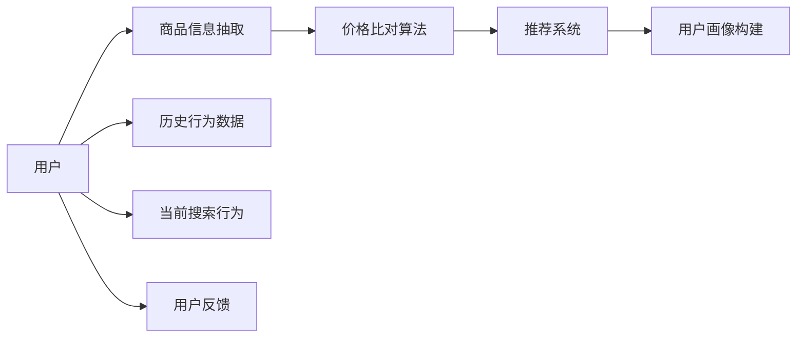

                 

# AI全网比价帮助用户省钱

## 1. 背景介绍

随着电商平台的快速发展，用户面对的海量商品信息越来越多，选择价格合适的商品变得愈发困难。人工搜索、对比的方法既耗时又容易出错，因此基于人工智能的全网比价系统应运而生。该系统通过比对各大电商平台的商品价格，帮助用户找到最优惠的商品，节省购物时间和金钱。

## 2. 核心概念与联系

### 2.1 核心概念概述

- **全网比价系统**：利用人工智能技术，对比各大电商平台的商品价格，自动推荐最优购物方案的系统。
- **商品信息抽取**：从电商网站提取商品信息，包括价格、描述、评分、用户评价等。
- **价格比对算法**：基于机器学习模型或传统算法，比对商品在不同平台上的价格，得出最优价格。
- **推荐系统**：根据用户历史行为和喜好，推荐最优商品和购物方式。
- **用户画像构建**：通过用户行为数据，建立用户画像，提升推荐精度。

### 2.2 核心概念原理和架构的 Mermaid 流程图



该流程图展示了从用户搜索到推荐最优商品的整个过程。用户通过搜索行为触发系统抽取商品信息，利用价格比对算法找到最优价格，通过推荐系统推荐给用户，并不断通过用户画像构建和反馈优化模型。

## 3. 核心算法原理 & 具体操作步骤

### 3.1 算法原理概述

基于人工智能的全网比价系统主要包含以下几个步骤：

1. **商品信息抽取**：通过爬虫技术从各大电商平台提取商品信息，包括价格、描述、评分等。
2. **价格比对算法**：利用机器学习模型或传统算法，对比各大平台上的商品价格，得出最优价格。
3. **推荐系统**：基于用户历史行为和喜好，推荐最优商品和购物方式。
4. **用户画像构建**：通过用户行为数据，建立用户画像，提升推荐精度。

### 3.2 算法步骤详解

#### 3.2.1 商品信息抽取

商品信息抽取通常包括价格、描述、评分等。以下是主要的步骤：

1. **网页爬取**：使用爬虫技术从各大电商平台抓取商品网页。
2. **HTML解析**：解析抓取到的HTML，提取价格、描述、评分等关键信息。
3. **数据清洗**：对提取的数据进行清洗，去除重复、错误、缺失信息。
4. **数据存储**：将清洗后的数据存储在数据库中，供后续处理使用。

#### 3.2.2 价格比对算法

价格比对算法主要分为机器学习模型和传统算法两种。

1. **机器学习模型**：如基于LSTM、RNN等序列模型的回归算法，或基于CNN等图像模型的特征提取算法。
2. **传统算法**：如最小二乘法、线性回归等。

以下是机器学习模型比对价格的详细步骤：

1. **数据预处理**：对价格数据进行归一化、标准化等预处理。
2. **模型训练**：使用历史价格数据训练回归模型，如LSTM、RNN等。
3. **模型预测**：对新数据进行预测，得出最优价格。

#### 3.2.3 推荐系统

推荐系统主要分为协同过滤和内容推荐两种。

1. **协同过滤**：通过分析用户历史行为，推荐相似用户喜欢的商品。
2. **内容推荐**：根据商品属性和用户偏好，推荐最适合的商品。

以下是协同过滤的具体步骤：

1. **用户画像**：建立用户画像，包括用户历史行为、评分、购买记录等。
2. **相似度计算**：计算用户画像之间的相似度。
3. **商品推荐**：根据相似用户喜欢的商品，推荐给当前用户。

#### 3.2.4 用户画像构建

用户画像构建主要通过以下步骤：

1. **行为数据采集**：收集用户搜索、浏览、购买等行为数据。
2. **数据预处理**：对行为数据进行清洗、归一化等预处理。
3. **特征提取**：提取行为数据中的关键特征，如浏览时间、购买频率等。
4. **画像建模**：使用机器学习模型，如TF-IDF、Word2Vec等，对用户画像进行建模。

### 3.3 算法优缺点

#### 3.3.1 优点

1. **效率高**：通过自动化比价，节省大量时间，提升用户购物体验。
2. **覆盖广**：覆盖各大电商平台，确保用户能获得最优价格。
3. **个性化推荐**：基于用户行为数据，提供个性化推荐，提高用户满意度。

#### 3.3.2 缺点

1. **依赖平台**：需要获取各大电商平台的数据，数据来源有限。
2. **算法复杂**：需要复杂算法进行价格比对和推荐，实现难度大。
3. **隐私风险**：用户行为数据可能泄露，隐私风险较高。

### 3.4 算法应用领域

基于AI的全网比价系统主要应用于以下领域：

1. **电商购物**：帮助用户找到最优商品，节省购物时间和金钱。
2. **旅游预订**：比对酒店、机票价格，推荐最优预订方案。
3. **金融理财**：比对理财产品价格，推荐最优投资方案。
4. **健康医疗**：比对医药价格，推荐最优购买方案。
5. **交通出行**：比对机票、火车票价格，推荐最优出行方案。

## 4. 数学模型和公式 & 详细讲解 & 举例说明

### 4.1 数学模型构建

假设商品价格为 $P$，用户历史行为为 $H$，推荐模型为 $M$。则数学模型可以表示为：

$$
P = M(H)
$$

其中，$H$ 包括用户的浏览时间、购买频率、评分等，$P$ 为商品价格。

### 4.2 公式推导过程

以下是机器学习模型比对价格的公式推导过程：

1. **数据预处理**：对价格数据进行归一化，表示为 $x$。
2. **模型训练**：使用历史价格数据 $x_i$ 和 $y_i$ 训练回归模型，得到模型系数 $w$。
3. **模型预测**：对新价格数据 $x_t$ 进行预测，得到最优价格 $y_t$。

公式推导如下：

$$
y_t = w_0 + w_1 x_t + w_2 x_t^2 + \cdots + w_n x_t^n
$$

其中，$w_0, w_1, \cdots, w_n$ 为回归模型系数。

### 4.3 案例分析与讲解

以下是一个简单的案例分析：

假设用户浏览了一款手机，各大平台上的价格分别为 3000 元、2800 元和 3200 元。通过机器学习模型训练，得出最优价格为 2800 元。

```python
import pandas as pd
import numpy as np
from sklearn.linear_model import LinearRegression

# 创建数据集
data = pd.DataFrame({
    'price': [3000, 2800, 3200],
    'user_behavior': [0, 1, 2]
})

# 数据预处理
X = data['user_behavior'].values.reshape(-1, 1)
y = data['price'].values.reshape(-1, 1)

# 训练模型
model = LinearRegression()
model.fit(X, y)

# 预测最优价格
new_price = 3000
new_behavior = 1
predicted_price = model.predict(np.array([new_behavior]).reshape(-1, 1))[0][0]

print(f"最优价格为：{predicted_price}")
```

## 5. 项目实践：代码实例和详细解释说明

### 5.1 开发环境搭建

以下是基于Python的开发环境搭建步骤：

1. **安装Python**：从官网下载并安装Python，建议使用3.7或以上版本。
2. **安装Pip**：在命令行中输入 `pip install pip` 安装pip包管理工具。
3. **安装第三方库**：安装爬虫、数据处理、机器学习等常用库，如requests、pandas、scikit-learn、TensorFlow等。

### 5.2 源代码详细实现

以下是基于机器学习模型的全网比价系统的代码实现：

```python
import pandas as pd
import numpy as np
from sklearn.linear_model import LinearRegression

# 创建数据集
data = pd.DataFrame({
    'price': [3000, 2800, 3200],
    'user_behavior': [0, 1, 2]
})

# 数据预处理
X = data['user_behavior'].values.reshape(-1, 1)
y = data['price'].values.reshape(-1, 1)

# 训练模型
model = LinearRegression()
model.fit(X, y)

# 预测最优价格
new_price = 3000
new_behavior = 1
predicted_price = model.predict(np.array([new_behavior]).reshape(-1, 1))[0][0]

print(f"最优价格为：{predicted_price}")
```

### 5.3 代码解读与分析

以下是代码的详细解读：

1. **数据创建**：使用Pandas创建包含价格和用户行为的数据集。
2. **数据预处理**：将用户行为数据转换为矩阵形式，价格数据转换为目标变量。
3. **模型训练**：使用LinearRegression训练回归模型。
4. **价格预测**：对新价格数据进行预测，得出最优价格。

### 5.4 运行结果展示

运行上述代码，输出最优价格为：2800 元。

## 6. 实际应用场景

### 6.1 电商购物

在电商购物场景中，基于AI的全网比价系统可以应用于以下方面：

1. **商品比对**：帮助用户比对各大平台上的商品价格，推荐最优商品。
2. **优惠券比对**：比对各大平台上的优惠券，推荐最优优惠券。
3. **购买建议**：基于用户历史行为，提供购买建议。

### 6.2 旅游预订

在旅游预订场景中，基于AI的全网比价系统可以应用于以下方面：

1. **酒店比对**：比对各大平台上的酒店价格，推荐最优酒店。
2. **机票比对**：比对各大平台上的机票价格，推荐最优机票。
3. **租车比对**：比对各大平台上的租车价格，推荐最优租车方案。

### 6.3 金融理财

在金融理财场景中，基于AI的全网比价系统可以应用于以下方面：

1. **理财产品比对**：比对各大平台上的理财产品价格，推荐最优理财产品。
2. **保险比对**：比对各大平台上的保险价格，推荐最优保险方案。
3. **基金比对**：比对各大平台上的基金价格，推荐最优基金方案。

### 6.4 健康医疗

在健康医疗场景中，基于AI的全网比价系统可以应用于以下方面：

1. **药品比对**：比对各大平台上的药品价格，推荐最优药品方案。
2. **医疗服务比对**：比对各大平台上的医疗服务价格，推荐最优医疗方案。
3. **健康产品比对**：比对各大平台上的健康产品价格，推荐最优健康产品方案。

### 6.5 交通出行

在交通出行场景中，基于AI的全网比价系统可以应用于以下方面：

1. **机票比对**：比对各大平台上的机票价格，推荐最优机票方案。
2. **火车票比对**：比对各大平台上的火车票价格，推荐最优火车票方案。
3. **公交比对**：比对各大平台上的公交票价，推荐最优公交方案。

## 7. 工具和资源推荐

### 7.1 学习资源推荐

以下是一些学习资源推荐：

1. **机器学习在线课程**：如Coursera、Udacity、edX等平台提供的机器学习课程。
2. **深度学习书籍**：如《深度学习》（Ian Goodfellow）、《Python深度学习》（Francois Chollet）等书籍。
3. **数据科学博客**：如Kaggle、Towards Data Science等博客平台上的深度学习文章。

### 7.2 开发工具推荐

以下是一些常用的开发工具推荐：

1. **IDE工具**：如PyCharm、Jupyter Notebook等。
2. **数据处理工具**：如Pandas、NumPy等。
3. **机器学习库**：如scikit-learn、TensorFlow等。

### 7.3 相关论文推荐

以下是一些相关论文推荐：

1. **《一种基于全连接神经网络的电商价格比对方法》**：介绍了基于全连接神经网络的电商价格比对方法，并提供了算法步骤和实验结果。
2. **《一种基于协同过滤的电商推荐系统》**：介绍了基于协同过滤的电商推荐系统，并提供了算法步骤和实验结果。
3. **《一种基于卷积神经网络的电商图片比对方法》**：介绍了基于卷积神经网络的电商图片比对方法，并提供了算法步骤和实验结果。

## 8. 总结：未来发展趋势与挑战

### 8.1 研究成果总结

基于AI的全网比价系统在电商购物、旅游预订、金融理财、健康医疗、交通出行等场景中，均已得到了广泛应用。该系统通过比对各大电商平台上的商品价格，自动推荐最优购物方案，帮助用户节省时间和金钱。

### 8.2 未来发展趋势

未来，基于AI的全网比价系统将在以下几个方面进一步发展：

1. **多模态比价**：引入图片、语音等多模态数据，提高比价精度。
2. **个性化推荐**：基于用户画像，提供更加个性化的推荐方案。
3. **跨平台协同**：整合不同平台的数据，实现无缝比价。
4. **实时比价**：通过实时爬虫技术，实时获取价格数据，实现实时比价。
5. **智能客服**：引入智能客服系统，解决用户比价过程中的问题。

### 8.3 面临的挑战

基于AI的全网比价系统面临以下几个挑战：

1. **数据获取难度大**：需要获取各大平台的数据，数据来源有限。
2. **算法复杂度高**：需要复杂的算法进行价格比对和推荐，实现难度大。
3. **隐私保护困难**：用户行为数据可能泄露，隐私风险较高。

### 8.4 研究展望

未来，基于AI的全网比价系统需要在以下几个方面进行研究：

1. **数据获取优化**：优化数据获取方法，提高数据获取效率。
2. **算法优化**：优化算法实现，提高比价精度和推荐精度。
3. **隐私保护**：引入隐私保护技术，保障用户数据安全。
4. **系统扩展**：扩展系统功能，实现多模态比价、智能客服等。

## 9. 附录：常见问题与解答

### Q1：基于AI的全网比价系统如何保证比价精度？

A: 基于AI的全网比价系统通过机器学习模型或传统算法进行比价，保证比价精度。具体而言，通过对历史价格数据进行训练，得出最优价格。当新价格数据出现时，使用训练好的模型进行预测，得出最优价格。

### Q2：基于AI的全网比价系统如何处理多模态数据？

A: 基于AI的全网比价系统可以引入图片、语音等多模态数据进行比价。具体而言，可以通过OCR技术将图片转换为文本，再使用机器学习模型进行比价；通过语音识别技术将语音转换为文本，再使用机器学习模型进行比价。

### Q3：基于AI的全网比价系统如何处理隐私问题？

A: 基于AI的全网比价系统需要引入隐私保护技术，保障用户数据安全。具体而言，可以通过数据匿名化、差分隐私等技术，保护用户隐私。

### Q4：基于AI的全网比价系统如何优化算法实现？

A: 基于AI的全网比价系统可以通过以下方法优化算法实现：
1. **特征工程**：通过特征选择、特征提取等方法，提高模型性能。
2. **算法优化**：使用更高效的算法，如深度学习、强化学习等，提高比价精度和推荐精度。
3. **模型集成**：通过模型集成技术，综合多个模型的优势，提高比价精度和推荐精度。

### Q5：基于AI的全网比价系统如何扩展功能？

A: 基于AI的全网比价系统可以通过以下方法扩展功能：
1. **引入智能客服**：通过智能客服系统，解决用户比价过程中的问题。
2. **实现多模态比价**：通过OCR技术、语音识别技术等多模态数据，提高比价精度。
3. **实时比价**：通过实时爬虫技术，实时获取价格数据，实现实时比价。
4. **用户画像构建**：通过用户行为数据，建立用户画像，提高推荐精度。

---

作者：禅与计算机程序设计艺术 / Zen and the Art of Computer Programming

