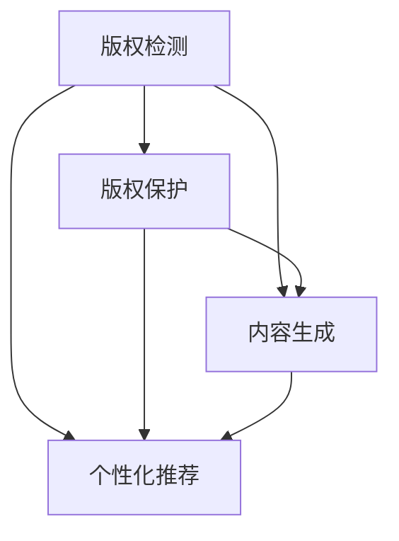

                 

## 1. 背景介绍

### 1.1 问题由来

近年来，出版业面临着严峻的挑战，如数字化转型、市场竞争加剧、版权问题等。在数字化时代，传统的纸质出版物面临着数字内容的冲击，众多电子书、在线期刊等数字产品迅速崛起。此外，出版行业还面临着版权侵权、假冒出版等法律风险，这进一步加大了其运营难度。

与此同时，人工智能技术的进步为出版业带来了新的机遇。人工智能可以在版权检测、版权保护、内容生成、个性化推荐等多个方面发挥作用，提高出版业的运营效率和内容质量。然而，如何有效地整合人工智能技术，克服数字化出版所面临的壁垒，成为出版业需要解决的重要课题。

### 1.2 问题核心关键点

在数字化出版的背景下，AI技术的应用场景主要包括版权检测、版权保护、内容生成、个性化推荐等。这些应用场景的核心关键点在于如何充分利用数据、算法与场景的协同作用，实现高质量、高效率的出版业务。

- **数据**：高质量的训练数据是实现AI技术的基础。出版行业积累了丰富的版权数据、读者数据和内容数据，是AI技术发挥作用的前提。
- **算法**：选择合适的算法模型是实现AI技术应用的核心。出版行业需要选择适用于版权检测、版权保护、内容生成、个性化推荐等任务的算法。
- **场景**：选择合适的应用场景是实现AI技术价值的关键。出版行业需要选择适合自己业务需求的应用场景，如版权检测、版权保护、内容生成、个性化推荐等。

以上三个关键点缺一不可，必须充分协同，才能发挥出AI技术在出版业中的最大价值。

## 2. 核心概念与联系

### 2.1 核心概念概述

为更好地理解数据、算法与场景的协同作用，本节将介绍几个密切相关的核心概念：

- **版权检测**：通过人工智能技术，自动识别出数字内容中的版权信息，如作者、版权日期、出版社等。
- **版权保护**：通过人工智能技术，对数字内容进行加密、水印等操作，防止版权侵犯和假冒出版。
- **内容生成**：通过人工智能技术，自动生成高质量的出版内容，如文章、电子书等。
- **个性化推荐**：通过人工智能技术，根据读者的阅读历史和偏好，推荐个性化的出版物，提高用户满意度和粘性。

这些核心概念之间的逻辑关系可以通过以下Mermaid流程图来展示：



这个流程图展示了大语言模型微调的核心概念及其之间的关系：

1. 版权检测通过识别版权信息，保护数字内容不被侵犯。
2. 版权保护通过加密和水印等手段，防止版权侵犯和假冒出版。
3. 内容生成通过自动生成高质量出版物，丰富数字内容库。
4. 个性化推荐根据读者偏好，推荐适合的出版物，提高用户粘性。

这些核心概念共同构成了AI技术在出版业的应用框架，使其能够在版权保护、内容生成、个性化推荐等多个环节发挥作用。

## 3. 核心算法原理 & 具体操作步骤
### 3.1 算法原理概述

AI技术在出版业的应用，主要是通过数据、算法与场景的协同来实现。核心思想是：利用人工智能技术对数据进行处理和分析，通过算法模型进行预测和推理，最终应用于出版业的各个场景，提高运营效率和内容质量。

### 3.2 算法步骤详解

AI技术在出版业的应用一般包括以下几个关键步骤：

**Step 1: 数据收集与预处理**
- 收集版权信息、读者数据、内容数据等，作为训练数据。
- 对数据进行清洗、去重、归一化等预处理，确保数据质量。

**Step 2: 选择算法模型**
- 根据应用场景选择适合的算法模型，如卷积神经网络、循环神经网络、Transformer等。
- 确定模型的参数、结构等，并进行超参数优化。

**Step 3: 模型训练与优化**
- 将预处理后的数据划分为训练集、验证集和测试集，使用训练集进行模型训练。
- 根据验证集的表现进行模型优化，调整超参数，提高模型性能。

**Step 4: 模型部署与应用**
- 将优化后的模型部署到实际出版系统中，如版权检测系统、版权保护系统、内容生成系统等。
- 在实际应用中，根据场景需要，对模型进行微调，确保模型输出符合业务需求。

### 3.3 算法优缺点

AI技术在出版业的应用，具有以下优点：

1. **自动化程度高**：AI技术可以自动处理大量数据，减少人工干预，提高效率。
2. **准确率高**：AI技术在版权检测、版权保护、内容生成等方面，具有较高的准确率，能够有效防止侵权和假冒出版。
3. **个性化推荐**：AI技术可以根据读者的阅读历史和偏好，提供个性化的出版物推荐，提高用户满意度和粘性。

同时，该方法也存在一些局限性：

1. **数据依赖性强**：AI技术的应用效果依赖于高质量的训练数据，数据采集和处理成本较高。
2. **模型复杂度高**：复杂的算法模型需要较高的计算资源，可能会带来较高的运营成本。
3. **隐私风险**：AI技术的应用可能会涉及用户隐私数据的收集和使用，需要采取相应的隐私保护措施。
4. **伦理问题**：AI技术的应用需要考虑伦理问题，避免出现歧视、偏见等不公平现象。

尽管存在这些局限性，但就目前而言，AI技术在出版业的应用，依然具有重要的现实意义。未来相关研究的重点在于如何进一步降低数据依赖，提高模型效率，加强隐私保护，并解决伦理问题。

### 3.4 算法应用领域

AI技术在出版业的应用场景非常广泛，主要包括：

- **版权检测**：自动识别数字内容中的版权信息，如作者、版权日期、出版社等。
- **版权保护**：通过加密、水印等手段，保护数字内容不被侵犯和假冒出版。
- **内容生成**：自动生成高质量的出版物，如文章、电子书等。
- **个性化推荐**：根据读者的阅读历史和偏好，推荐个性化的出版物。
- **编辑辅助**：自动进行文本编辑、校对等工作，提高编辑效率。
- **市场需求预测**：通过数据分析，预测市场趋势，指导出版决策。

这些应用场景覆盖了出版业的各个环节，有助于提高运营效率和内容质量，推动数字化出版的健康发展。

## 4. 数学模型和公式 & 详细讲解  
### 4.1 数学模型构建

在出版业的应用中，常见的AI算法模型包括卷积神经网络（CNN）、循环神经网络（RNN）、Transformer等。这些模型在版权检测、版权保护、内容生成等方面具有不同的优势。

- **卷积神经网络（CNN）**：适用于处理图像、文本等结构化数据，适用于版权保护等任务。
- **循环神经网络（RNN）**：适用于处理序列数据，适用于内容生成、个性化推荐等任务。
- **Transformer**：适用于处理长序列数据，适用于版权检测、市场需求预测等任务。

### 4.2 公式推导过程

以版权检测为例，我们以卷积神经网络为例，推导其版权检测模型的公式。

版权检测的输入为数字内容，输出为版权信息。版权检测的过程可以表示为如下公式：

$$
y = f(x; \theta)
$$

其中，$x$ 为输入的数字内容，$y$ 为输出版权信息，$f(\cdot)$ 为卷积神经网络模型，$\theta$ 为模型参数。

在卷积神经网络中，版权检测模型可以表示为：

$$
y = \sigma\left(W^c x + b^c\right)
$$

其中，$\sigma$ 为激活函数，$W^c$ 和 $b^c$ 为卷积层和全连接层的参数。

卷积层的公式为：

$$
h_{c, i, j} = W_{c, i, j} \ast x_{i, j} + b_{c, i, j}
$$

其中，$h_{c, i, j}$ 为卷积层的输出，$W_{c, i, j}$ 为卷积核参数，$x_{i, j}$ 为输入数据，$b_{c, i, j}$ 为偏置项。

### 4.3 案例分析与讲解

**案例：版权检测**

版权检测是AI技术在出版业的重要应用之一。通过版权检测，出版商可以自动识别数字内容中的版权信息，防止版权侵犯和假冒出版。

具体实现步骤如下：

1. 收集版权数据，包括作者、版权日期、出版社等信息。
2. 使用卷积神经网络对数字内容进行特征提取，生成特征向量。
3. 将特征向量输入到全连接层，得到版权信息预测结果。
4. 通过比较预测结果和实际版权信息，评估模型的准确率。

**案例：内容生成**

内容生成是AI技术在出版业的另一重要应用。通过内容生成，出版商可以自动生成高质量的出版物，提高内容生产的效率和质量。

具体实现步骤如下：

1. 收集已有的出版物数据，如文章、电子书等。
2. 使用循环神经网络对出版物进行序列建模，生成出版物的文本。
3. 通过模型的训练和优化，生成高质量的出版物。
4. 对生成的出版物进行质量评估，确保内容质量符合出版标准。

## 5. 项目实践：代码实例和详细解释说明
### 5.1 开发环境搭建

在进行项目实践前，我们需要准备好开发环境。以下是使用Python进行TensorFlow开发的环境配置流程：

1. 安装Anaconda：从官网下载并安装Anaconda，用于创建独立的Python环境。

2. 创建并激活虚拟环境：
```bash
conda create -n tensorflow-env python=3.8 
conda activate tensorflow-env
```

3. 安装TensorFlow：根据CUDA版本，从官网获取对应的安装命令。例如：
```bash
conda install tensorflow -c tf -c conda-forge
```

4. 安装各类工具包：
```bash
pip install numpy pandas scikit-learn matplotlib tqdm jupyter notebook ipython
```

完成上述步骤后，即可在`tensorflow-env`环境中开始项目实践。

### 5.2 源代码详细实现

下面我们以内容生成为例，给出使用TensorFlow对RNN模型进行内容生成的PyTorch代码实现。

首先，定义RNN模型：

```python
import tensorflow as tf
from tensorflow.keras.layers import Input, LSTM, Dense

input_dim = 100
output_dim = 20
batch_size = 64
num_epochs = 20

# 定义输入和输出
input = Input(shape=(input_dim, ), name='input')
output = Dense(output_dim, activation='softmax', name='output')(input)
model = tf.keras.Model(inputs=input, outputs=output)
```

然后，定义训练数据和优化器：

```python
# 加载训练数据
train_data = ...
train_labels = ...

# 定义优化器
optimizer = tf.keras.optimizers.Adam(learning_rate=0.001)
```

接着，定义训练和评估函数：

```python
# 定义训练函数
def train_step(model, data, labels):
    with tf.GradientTape() as tape:
        predictions = model(data)
        loss = tf.keras.losses.sparse_categorical_crossentropy(labels, predictions, from_logits=True)
    gradients = tape.gradient(loss, model.trainable_variables)
    optimizer.apply_gradients(zip(gradients, model.trainable_variables))

# 定义评估函数
def evaluate(model, data, labels):
    predictions = model(data)
    loss = tf.keras.losses.sparse_categorical_crossentropy(labels, predictions, from_logits=True)
    return loss.numpy()
```

最后，启动训练流程并在测试集上评估：

```python
# 训练模型
for epoch in range(num_epochs):
    for i in range(len(train_data)//batch_size):
        train_step(model, train_data[i*batch_size:(i+1)*batch_size], train_labels[i*batch_size:(i+1)*batch_size])
    
    # 评估模型
    loss = evaluate(model, test_data, test_labels)
    print('Epoch {} Loss: {}'.format(epoch+1, loss))
```

以上就是使用TensorFlow对RNN进行内容生成的完整代码实现。可以看到，得益于TensorFlow的强大封装，我们可以用相对简洁的代码完成RNN模型的训练和评估。

### 5.3 代码解读与分析

让我们再详细解读一下关键代码的实现细节：

**RNN模型定义**：
- `Input`层定义输入，`Dense`层定义输出。
- 模型结构为输入层->LSTM层->输出层，每个LSTM层包含64个神经元。

**训练数据和优化器**：
- `train_data`和`train_labels`为训练数据和标签。
- `Adam`优化器，学习率为0.001。

**训练和评估函数**：
- `train_step`函数定义一个训练步骤，包括前向传播、损失计算、反向传播和参数更新。
- `evaluate`函数定义评估模型的损失函数，返回评估结果。

**训练流程**：
- 定义总训练轮数和批大小，开始循环迭代
- 每个epoch内，在训练集上迭代，每个batch中计算损失并更新模型参数
- 在测试集上评估模型，输出损失

可以看到，TensorFlow配合Keras库使得RNN模型的代码实现变得简洁高效。开发者可以将更多精力放在数据处理、模型改进等高层逻辑上，而不必过多关注底层的实现细节。

当然，工业级的系统实现还需考虑更多因素，如模型的保存和部署、超参数的自动搜索、更灵活的任务适配层等。但核心的微调范式基本与此类似。

## 6. 实际应用场景
### 6.1 版权检测系统

版权检测系统是AI技术在出版业的重要应用之一。通过版权检测，出版商可以自动识别数字内容中的版权信息，防止版权侵犯和假冒出版。

**系统架构**：
- **数据收集与预处理**：收集版权数据，包括作者、版权日期、出版社等信息。对数据进行清洗、去重、归一化等预处理。
- **模型训练与优化**：使用卷积神经网络对数字内容进行特征提取，生成特征向量。将特征向量输入到全连接层，得到版权信息预测结果。通过模型的训练和优化，提高模型准确率。
- **系统部署与应用**：将优化后的模型部署到实际系统中，自动检测数字内容中的版权信息。

**实际应用**：
- 出版商可以自动检测新出版的电子书、文章等，防止版权侵犯和假冒出版。
- 版权检测系统还可以用于版权授权管理，方便版权的分配和使用。

**技术难点**：
- 如何准确识别版权信息，防止误判和漏判。
- 如何处理复杂的版权数据，确保数据质量。
- 如何部署模型，确保系统的稳定性和响应速度。

**未来展望**：
- 引入更多先进技术，如深度学习、自然语言处理等，提高版权检测的准确率。
- 与其他系统协同工作，如出版管理系统、版权登记系统等，提高版权保护的整体效果。

### 6.2 版权保护系统

版权保护系统是AI技术在出版业的另一重要应用。通过版权保护，出版商可以防止数字内容的侵权和假冒出版，保护版权权益。

**系统架构**：
- **数据收集与预处理**：收集版权数据，包括作者、版权日期、出版社等信息。对数据进行清洗、去重、归一化等预处理。
- **模型训练与优化**：使用卷积神经网络对数字内容进行特征提取，生成特征向量。将特征向量输入到全连接层，得到版权信息预测结果。通过模型的训练和优化，提高模型准确率。
- **系统部署与应用**：将优化后的模型部署到实际系统中，自动检测数字内容中的版权信息，并进行版权保护。

**实际应用**：
- 出版商可以自动检测新出版的电子书、文章等，防止版权侵犯和假冒出版。
- 版权保护系统还可以用于版权授权管理，方便版权的分配和使用。

**技术难点**：
- 如何防止数字内容的侵权和假冒出版，保护版权权益。
- 如何处理复杂的版权数据，确保数据质量。
- 如何部署模型，确保系统的稳定性和响应速度。

**未来展望**：
- 引入更多先进技术，如深度学习、自然语言处理等，提高版权保护的效果。
- 与其他系统协同工作，如出版管理系统、版权登记系统等，提高版权保护的整体效果。

### 6.3 内容生成系统

内容生成系统是AI技术在出版业的另一重要应用。通过内容生成，出版商可以自动生成高质量的出版物，提高内容生产的效率和质量。

**系统架构**：
- **数据收集与预处理**：收集已有的出版物数据，如文章、电子书等。对数据进行清洗、去重、归一化等预处理。
- **模型训练与优化**：使用循环神经网络对出版物进行序列建模，生成出版物的文本。通过模型的训练和优化，生成高质量的出版物。
- **系统部署与应用**：将优化后的模型部署到实际系统中，自动生成高质量的出版物。

**实际应用**：
- 出版商可以自动生成高质量的电子书、文章等，提高内容生产的效率和质量。
- 内容生成系统还可以用于编辑辅助，减少人工编辑的工作量。

**技术难点**：
- 如何生成高质量的出版物，确保内容质量符合出版标准。
- 如何处理复杂的出版物数据，确保数据质量。
- 如何部署模型，确保系统的稳定性和响应速度。

**未来展望**：
- 引入更多先进技术，如深度学习、自然语言处理等，提高内容生成的效果。
- 与其他系统协同工作，如出版管理系统、版权登记系统等，提高内容生成的整体效果。

### 6.4 个性化推荐系统

个性化推荐系统是AI技术在出版业的另一重要应用。通过个性化推荐，出版商可以推荐个性化的出版物，提高用户满意度和粘性。

**系统架构**：
- **数据收集与预处理**：收集读者的阅读历史、偏好等信息。对数据进行清洗、去重、归一化等预处理。
- **模型训练与优化**：使用循环神经网络对读者的阅读历史进行建模，生成读者的兴趣特征。将兴趣特征输入到全连接层，得到推荐结果。通过模型的训练和优化，提高推荐效果。
- **系统部署与应用**：将优化后的模型部署到实际系统中，自动推荐个性化的出版物。

**实际应用**：
- 出版商可以自动推荐个性化的电子书、文章等，提高用户满意度和粘性。
- 个性化推荐系统还可以用于内容优化，调整出版策略，提高销量。

**技术难点**：
- 如何根据读者的阅读历史和偏好，推荐个性化的出版物。
- 如何处理复杂的读者数据，确保数据质量。
- 如何部署模型，确保系统的稳定性和响应速度。

**未来展望**：
- 引入更多先进技术，如深度学习、自然语言处理等，提高个性化推荐的准确率。
- 与其他系统协同工作，如出版管理系统、版权登记系统等，提高个性化推荐的整体效果。

## 7. 工具和资源推荐
### 7.1 学习资源推荐

为了帮助开发者系统掌握大语言模型微调的理论基础和实践技巧，这里推荐一些优质的学习资源：

1. **《深度学习》系列书籍**：由深度学习领域权威人士撰写，系统讲解深度学习的基本概念、模型、应用等。
2. **《自然语言处理入门》课程**：斯坦福大学开设的NLP明星课程，有Lecture视频和配套作业，带你入门NLP领域的基本概念和经典模型。
3. **《自然语言处理中的深度学习》书籍**：详细讲解深度学习在自然语言处理中的应用，包括版权检测、版权保护、内容生成等任务。
4. **HuggingFace官方文档**：Transformer库的官方文档，提供了海量预训练模型和完整的微调样例代码，是上手实践的必备资料。
5. **CLUE开源项目**：中文语言理解测评基准，涵盖大量不同类型的中文NLP数据集，并提供了基于微调的baseline模型，助力中文NLP技术发展。

通过对这些资源的学习实践，相信你一定能够快速掌握大语言模型微调的精髓，并用于解决实际的NLP问题。

### 7.2 开发工具推荐

高效的开发离不开优秀的工具支持。以下是几款用于大语言模型微调开发的常用工具：

1. **TensorFlow**：由Google主导开发的开源深度学习框架，生产部署方便，适合大规模工程应用。同样有丰富的预训练语言模型资源。
2. **PyTorch**：基于Python的开源深度学习框架，灵活动态的计算图，适合快速迭代研究。大部分预训练语言模型都有PyTorch版本的实现。
3. **Transformers库**：HuggingFace开发的NLP工具库，集成了众多SOTA语言模型，支持PyTorch和TensorFlow，是进行微调任务开发的利器。
4. **Weights & Biases**：模型训练的实验跟踪工具，可以记录和可视化模型训练过程中的各项指标，方便对比和调优。与主流深度学习框架无缝集成。
5. **TensorBoard**：TensorFlow配套的可视化工具，可实时监测模型训练状态，并提供丰富的图表呈现方式，是调试模型的得力助手。
6. **Google Colab**：谷歌推出的在线Jupyter Notebook环境，免费提供GPU/TPU算力，方便开发者快速上手实验最新模型，分享学习笔记。

合理利用这些工具，可以显著提升大语言模型微调任务的开发效率，加快创新迭代的步伐。

### 7.3 相关论文推荐

大语言模型和微调技术的发展源于学界的持续研究。以下是几篇奠基性的相关论文，推荐阅读：

1. **Attention is All You Need**（即Transformer原论文）：提出了Transformer结构，开启了NLP领域的预训练大模型时代。
2. **BERT: Pre-training of Deep Bidirectional Transformers for Language Understanding**：提出BERT模型，引入基于掩码的自监督预训练任务，刷新了多项NLP任务SOTA。
3. **Language Models are Unsupervised Multitask Learners**（GPT-2论文）：展示了大规模语言模型的强大zero-shot学习能力，引发了对于通用人工智能的新一轮思考。
4. **Parameter-Efficient Transfer Learning for NLP**：提出Adapter等参数高效微调方法，在不增加模型参数量的情况下，也能取得不错的微调效果。
5. **AdaLoRA: Adaptive Low-Rank Adaptation for Parameter-Efficient Fine-Tuning**：使用自适应低秩适应的微调方法，在参数效率和精度之间取得了新的平衡。
6. **Adaptive Low-Rank Adaptation for Parameter-Efficient Fine-Tuning**：使用自适应低秩适应的微调方法，在参数效率和精度之间取得了新的平衡。

这些论文代表了大语言模型微调技术的发展脉络。通过学习这些前沿成果，可以帮助研究者把握学科前进方向，激发更多的创新灵感。

## 8. 总结：未来发展趋势与挑战
### 8.1 总结

本文对基于数据、算法与场景协同的AI出版业应用进行了全面系统的介绍。首先阐述了AI技术在出版业的应用场景，明确了版权检测、版权保护、内容生成、个性化推荐等任务的关键点。其次，从原理到实践，详细讲解了这些任务的数据、算法与场景协同过程，给出了具体的应用实例。最后，总结了AI技术在出版业未来发展的趋势和面临的挑战。

通过本文的系统梳理，可以看到，AI技术在出版业的应用，可以通过数据、算法与场景的协同，实现版权检测、版权保护、内容生成、个性化推荐等目标。这些应用场景不仅有助于提高出版业的运营效率和内容质量，还能为数字化出版的健康发展提供有力支持。

### 8.2 未来发展趋势

展望未来，AI技术在出版业的应用将呈现以下几个发展趋势：

1. **数据采集与处理技术**：随着数据的不断增长，数据采集与处理技术将不断完善，提高数据的准确性和多样性。
2. **算法模型与优化**：更多先进的算法模型将出现，优化技术也将不断改进，提高模型的精度和效率。
3. **场景应用与融合**：AI技术将在出版业的各个环节中发挥作用，形成完善的生态系统。
4. **用户需求与个性化**：出版商将更加关注用户需求，提供更加个性化和定制化的服务。
5. **智能化与自动化**：AI技术将进一步智能化和自动化，提高出版业的运营效率。

以上趋势凸显了AI技术在出版业的应用前景。这些方向的探索发展，必将进一步推动出版业向智能化、自动化、个性化方向发展，为数字化出版的健康发展提供有力支持。

### 8.3 面临的挑战

尽管AI技术在出版业的应用前景广阔，但在迈向更加智能化、普适化应用的过程中，它仍面临着诸多挑战：

1. **数据依赖性强**：AI技术的应用效果依赖于高质量的训练数据，数据采集和处理成本较高。
2. **模型复杂度高**：复杂的算法模型需要较高的计算资源，可能会带来较高的运营成本。
3. **隐私风险**：AI技术的应用可能会涉及用户隐私数据的收集和使用，需要采取相应的隐私保护措施。
4. **伦理问题**：AI技术的应用需要考虑伦理问题，避免出现歧视、偏见等不公平现象。

尽管存在这些挑战，但相信随着学界和产业界的共同努力，这些挑战终将一一被克服，AI技术在出版业中的应用将不断成熟和完善。

### 8.4 研究展望

面对AI技术在出版业所面临的挑战，未来的研究需要在以下几个方面寻求新的突破：

1. **数据采集与处理技术**：如何高效、准确地采集和处理高质量的训练数据，将是未来研究的重要方向。
2. **算法模型与优化**：如何设计更简单、更高效的算法模型，优化技术将进一步改进，提高模型的精度和效率。
3. **场景应用与融合**：如何将AI技术与出版业各个环节更好地融合，形成完善的生态系统。
4. **用户需求与个性化**：如何更好地理解用户需求，提供更加个性化和定制化的服务。
5. **智能化与自动化**：如何进一步智能化和自动化，提高出版业的运营效率。

这些研究方向将有助于推动AI技术在出版业的应用，为数字化出版的健康发展提供有力支持。

## 9. 附录：常见问题与解答

**Q1：如何确保数据采集与处理的准确性？**

A: 确保数据采集与处理的准确性，需要从以下几个方面入手：
1. **数据来源**：选择可信的数据源，如权威的出版商、政府部门等。
2. **数据清洗**：对数据进行清洗、去重、归一化等处理，确保数据质量。
3. **数据标注**：对数据进行标注，确保标注的准确性。
4. **数据验证**：通过人工或自动化方法，对数据进行验证，确保数据的一致性和完整性。

**Q2：如何选择适合的算法模型？**

A: 选择适合的算法模型需要考虑以下几个方面：
1. **任务类型**：根据任务类型选择适合的算法模型，如版权检测选择卷积神经网络，内容生成选择循环神经网络。
2. **数据特点**：根据数据特点选择适合的算法模型，如版权检测需要处理图像数据，选择卷积神经网络；内容生成需要处理序列数据，选择循环神经网络。
3. **模型性能**：根据模型的性能选择适合的算法模型，选择准确率、效率、稳定性等指标。
4. **资源限制**：根据资源限制选择适合的算法模型，选择参数量、计算资源等。

**Q3：如何防止数据泄露和隐私侵害？**

A: 防止数据泄露和隐私侵害，需要从以下几个方面入手：
1. **数据加密**：对数据进行加密，确保数据在传输和存储过程中的安全性。
2. **访问控制**：对数据进行访问控制，确保只有授权人员才能访问数据。
3. **数据匿名化**：对数据进行匿名化处理，确保数据不泄露用户隐私。
4. **隐私保护技术**：采用隐私保护技术，如差分隐私、联邦学习等，保护数据隐私。

**Q4：如何解决伦理问题？**

A: 解决伦理问题需要从以下几个方面入手：
1. **数据使用透明**：确保数据使用的透明性，让用户知道数据的用途和处理方式。
2. **公平性**：确保算法的公平性，避免出现歧视、偏见等不公平现象。
3. **隐私保护**：确保数据的隐私保护，避免侵犯用户隐私。
4. **伦理审查**：进行伦理审查，确保算法的伦理合规性。

**Q5：如何提高系统的稳定性与响应速度？**

A: 提高系统的稳定性和响应速度需要从以下几个方面入手：
1. **优化算法**：优化算法模型，提高模型效率。
2. **硬件升级**：升级硬件设备，如使用GPU/TPU等高性能设备，提高系统响应速度。
3. **负载均衡**：采用负载均衡技术，提高系统并发处理能力。
4. **缓存技术**：采用缓存技术，提高系统响应速度。

这些措施可以帮助提高系统的稳定性与响应速度，确保系统的高效运行。

---

作者：禅与计算机程序设计艺术 / Zen and the Art of Computer Programming

