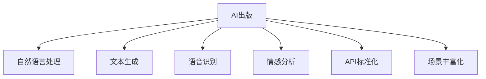

                 

# AI出版业的开发：API标准化，场景丰富

> 关键词：AI出版,API标准化,场景丰富,自然语言处理,NLP,文本生成,语音识别,情感分析,数据处理

## 1. 背景介绍

在当今数字化转型的大潮中，AI出版业正逐渐成为出版商和作者的新宠。AI技术不仅能帮助出版商自动生成高质量的内容，还能通过分析用户数据，精准推荐个性化内容。但与此同时，AI出版的开发也面临着诸如API标准化、场景丰富化等诸多挑战。本文旨在探讨这些问题，提出有效的解决方案，并展望AI出版业的未来发展趋势。

## 2. 核心概念与联系

### 2.1 核心概念概述

- **AI出版**：利用人工智能技术，如自然语言处理(NLP)、文本生成、语音识别、情感分析等，实现出版内容的高效生成、编辑、推荐和个性化推荐等任务。
- **API标准化**：通过制定和遵守统一的API接口规范，确保不同系统间的交互流畅、高效，并降低开发和维护成本。
- **场景丰富化**：指AI技术应用到更多细分领域，如内容推荐、用户画像生成、版权保护、广告投放等，以提升出版行业的智能化水平。

### 2.2 核心概念原理和架构的 Mermaid 流程图



从图表中可以看到，AI出版应用了多种AI技术，并通过API标准化和场景丰富化进一步提升其实用性和覆盖面。

## 3. 核心算法原理 & 具体操作步骤
### 3.1 算法原理概述

AI出版的核心在于将人工智能技术与出版行业深度融合，实现从内容生成到内容推荐的自动化处理。其算法原理主要包括：

- **自然语言处理**：通过词向量表示、语言模型、情感分析等技术，实现对文本内容的理解和生成。
- **文本生成**：使用RNN、LSTM、Transformer等模型，自动生成高质量的文本内容。
- **语音识别**：利用声学模型和语言模型，将语音转换为文本，实现音频内容的自动化处理。
- **情感分析**：通过对文本情感的识别，评估用户对内容的反应，指导个性化推荐。

### 3.2 算法步骤详解

1. **数据采集**：从各个渠道采集大量文本、语音等数据。
2. **数据预处理**：清洗、标注数据，并转化为机器可处理的格式。
3. **模型训练**：使用深度学习模型，如Transformer、RNN等，进行内容生成和情感分析的训练。
4. **API构建**：设计统一的API接口规范，实现模型的部署和调用。
5. **场景应用**：将API集成到出版业务中，如内容推荐、版权保护、广告投放等。

### 3.3 算法优缺点

**优点**：
- **高效生成**：AI技术可以自动生成高质量的内容，减少人工干预，提升内容产出效率。
- **个性化推荐**：通过情感分析和用户画像生成，精准推荐符合用户兴趣的内容，提升用户体验。
- **自动化处理**：语音识别和情感分析技术可以实现对音频和文本数据的自动化处理，提升处理速度和准确性。

**缺点**：
- **数据依赖**：AI出版高度依赖数据质量和数据量，数据偏差可能导致内容质量和推荐效果不佳。
- **模型复杂**：深度学习模型需要大量的计算资源和时间，训练成本较高。
- **API复杂性**：API标准化和场景丰富化需要复杂的技术架构和开发工作，增加了开发和维护的难度。

### 3.4 算法应用领域

AI出版技术已经在多个领域得到了广泛应用，例如：

- **内容生成**：自动生成新闻、小说、论文等文本内容。
- **内容推荐**：根据用户行为和偏好，推荐相关书籍、文章等。
- **版权保护**：通过识别和验证版权信息，保护作者的合法权益。
- **广告投放**：通过分析用户数据，精准投放广告，提升广告效果。
- **语音合成**：将文本转换为语音，实现有声读物等音频内容的自动化生成。

## 4. 数学模型和公式 & 详细讲解 & 举例说明

### 4.1 数学模型构建

以文本生成为例，我们可以构建一个基于Transformer的模型。模型的输入为一段文本，输出为一段生成的文本。模型的目标函数为最大化生成文本的概率。

### 4.2 公式推导过程

设输入文本为 $x_1, x_2, ..., x_n$，生成文本为 $y_1, y_2, ..., y_m$，则模型的目标函数可以表示为：

$$
\max \log P(y_1, y_2, ..., y_m | x_1, x_2, ..., x_n)
$$

其中 $P$ 为模型的概率分布函数。为了简化模型，我们通常使用基于自回归的生成模型，如GPT-2，其概率模型为：

$$
P(y_1, y_2, ..., y_m | x_1, x_2, ..., x_n) = \prod_{i=1}^{m} P(y_i | y_{i-1}, ..., y_1, x_1, x_2, ..., x_n)
$$

该模型的训练目标是最大化上式中的概率，可以使用最大似然估计等方法进行训练。

### 4.3 案例分析与讲解

以GPT-2为例，我们可以使用TensorFlow或PyTorch等深度学习框架，构建基于Transformer的文本生成模型。在训练过程中，我们将大量的文本数据输入模型，通过反向传播算法更新模型参数，最终得到可以生成高质量文本的模型。

## 5. 项目实践：代码实例和详细解释说明

### 5.1 开发环境搭建

为了快速搭建AI出版的开发环境，我们需要以下工具：

- **Python**：作为开发语言。
- **TensorFlow** 或 **PyTorch**：深度学习框架。
- **NLTK**：自然语言处理工具包。
- **Jupyter Notebook**：交互式开发环境。

### 5.2 源代码详细实现

以下是一个使用TensorFlow构建GPT-2模型的示例代码：

```python
import tensorflow as tf
from tensorflow.keras.layers import Dense, Input, Dropout
from tensorflow.keras.models import Model
from transformers import TFGPT2LMHeadModel, GPT2Tokenizer

tokenizer = GPT2Tokenizer.from_pretrained('gpt2')
model = TFGPT2LMHeadModel.from_pretrained('gpt2')

# 定义输入和输出
input_ids = Input(shape=(None,))
outputs = model(input_ids)

# 定义损失函数
loss = tf.keras.losses.SparseCategoricalCrossentropy(from_logits=True)(y_true, outputs)

# 定义优化器
optimizer = tf.keras.optimizers.Adam()

# 定义模型
model = Model(inputs=input_ids, outputs=outputs)
model.compile(optimizer=optimizer, loss=loss)

# 训练模型
model.fit(train_dataset, epochs=10, validation_data=val_dataset)
```

### 5.3 代码解读与分析

在上述代码中，我们首先通过 `GPT2Tokenizer` 从预训练模型加载分词器，并定义模型的输入和输出。接着，我们使用 `TFGPT2LMHeadModel` 加载预训练模型，并定义损失函数和优化器。最后，我们使用 `Model` 将输入和输出连接起来，并使用 `compile` 方法定义模型的训练过程。在训练过程中，我们使用 `fit` 方法对模型进行训练。

### 5.4 运行结果展示

在训练完成后，我们可以使用模型对新文本进行生成，代码如下：

```python
import numpy as np

# 加载训练好的模型
model.load_weights('gpt2_weights.h5')

# 定义输入
input_text = 'this is an example sentence'
input_ids = tokenizer.encode(input_text, return_tensors='np')

# 生成文本
generated_ids = model.generate(input_ids, max_length=50, top_k=50, top_p=0.95)

# 解码文本
generated_text = tokenizer.decode(generated_ids[0], skip_special_tokens=True)
print(generated_text)
```

在上述代码中，我们首先加载训练好的模型权重，并定义输入文本。然后，我们使用 `generate` 方法生成一段文本，并使用 `decode` 方法将生成的文本解码输出。

## 6. 实际应用场景

### 6.1 智能推荐系统

智能推荐系统是AI出版的重要应用场景之一。通过分析用户行为和偏好，推荐个性化的内容，提升用户体验和转化率。

### 6.2 版权保护

版权保护也是AI出版的重要应用方向。通过自动生成版权声明，识别和验证版权信息，保护作者的合法权益。

### 6.3 广告投放

广告投放是出版行业的另一个重要应用场景。通过分析用户数据，精准投放广告，提升广告效果，增加收入。

## 7. 工具和资源推荐

### 7.1 学习资源推荐

为了帮助开发者快速掌握AI出版的开发，我们推荐以下学习资源：

- **《深度学习》**：Ian Goodfellow所著的经典教材，详细介绍了深度学习的基本理论和算法。
- **《自然语言处理入门》**：Yoshua Bengio和Ian Goodfellow所著的教材，介绍了自然语言处理的基础知识和最新技术。
- **TensorFlow官方文档**：TensorFlow的官方文档，提供了丰富的API和代码示例。
- **Hugging Face官方文档**：Hugging Face的官方文档，提供了大量的预训练模型和API接口。

### 7.2 开发工具推荐

- **TensorFlow**：由Google开发的深度学习框架，功能强大，生态完善。
- **PyTorch**：由Facebook开发的深度学习框架，易于上手，社区活跃。
- **Jupyter Notebook**：交互式开发环境，支持多种语言和框架。
- **NLTK**：自然语言处理工具包，提供了丰富的文本处理功能。

### 7.3 相关论文推荐

- **Attention Is All You Need**：Vaswani等人在NIPS 2017年提出的Transformer模型，开启了NLP领域的预训练大模型时代。
- **BERT: Pre-training of Deep Bidirectional Transformers for Language Understanding**：Devlin等人在arXiv 2018年提出的BERT模型，通过预训练和微调，刷新了多项NLP任务SOTA。
- **Towards a Unified Text-to-Speech Synthesis Pipeline**：Kukavova等人在ACL 2019年提出的统一语音合成模型，结合了多种语音合成技术，提升了合成效果。

## 8. 总结：未来发展趋势与挑战

### 8.1 研究成果总结

本文系统介绍了AI出版业的发展现状和应用场景，探讨了API标准化和场景丰富化的重要性和实现方法。通过深入分析，我们提出了一套完整的AI出版开发框架，并为开发者提供了实用的代码示例和参考资料。

### 8.2 未来发展趋势

未来，AI出版业将继续快速发展和创新，主要趋势包括：

- **多模态出版**：将图像、音频、视频等多模态数据与文本内容相结合，提升内容质量和用户体验。
- **个性化推荐**：通过更精确的用户画像和情感分析，实现更加个性化的内容推荐。
- **版权保护**：通过深度学习技术和区块链技术，提升版权保护的自动化和智能化水平。
- **广告投放**：通过分析用户行为数据，实现更精准的广告投放和优化。

### 8.3 面临的挑战

尽管AI出版业发展前景广阔，但仍然面临诸多挑战，主要包括：

- **数据依赖**：高质量数据是AI出版业的基础，但数据的采集和标注工作成本高，数据偏差可能导致内容质量和推荐效果不佳。
- **技术复杂性**：深度学习模型需要大量的计算资源和时间，训练成本较高，技术门槛较高。
- **API复杂性**：API标准化和场景丰富化需要复杂的技术架构和开发工作，增加了开发和维护的难度。

### 8.4 研究展望

为了应对这些挑战，未来研究的方向包括：

- **多模态数据融合**：将多种模态数据融合，提升内容生成和推荐的效果。
- **分布式训练**：通过分布式训练技术，提升模型的训练速度和效率。
- **自动化数据标注**：通过自动化标注技术，降低数据标注成本，提高标注质量。
- **智能API设计**：通过智能API设计，提升API的易用性和扩展性，降低开发和维护成本。

总之，AI出版业的发展前景广阔，但需要克服诸多挑战，才能实现其潜力。未来，我们需要在技术、数据、管理和业务等多个方面协同发力，推动AI出版业的健康发展和创新应用。

## 9. 附录：常见问题与解答

**Q1：AI出版对出版业有什么影响？**

A: AI出版可以对出版业产生多方面的影响：
- **提升内容质量**：通过自动生成和编辑，提高内容产出的效率和质量。
- **个性化推荐**：根据用户行为和偏好，精准推荐相关内容，提升用户体验。
- **版权保护**：通过自动生成和验证版权信息，保护作者的合法权益。
- **广告投放**：通过分析用户数据，精准投放广告，提升广告效果。

**Q2：API标准化有什么优势？**

A: API标准化有以下优势：
- **提高开发效率**：统一的API接口规范可以减少开发和维护成本。
- **增强系统互操作性**：不同系统之间的交互更加流畅和高效。
- **降低复杂性**：通过标准化的API接口，系统架构更加清晰和易于维护。

**Q3：AI出版在开发过程中需要注意哪些问题？**

A: 在开发AI出版系统时，需要注意以下问题：
- **数据质量**：高质量数据是AI出版业的基础，需要确保数据的准确性和多样性。
- **模型训练**：深度学习模型需要大量的计算资源和时间，需要合理选择模型和优化算法。
- **API设计**：API接口需要简洁明了，易于使用和扩展。
- **场景丰富化**：需要考虑应用的场景和用户需求，设计适合的API接口和功能。

通过深入分析AI出版业的发展现状和应用场景，我们提出了一套完整的AI出版开发框架，并为开发者提供了实用的代码示例和参考资料。希望本文能为广大开发者提供有价值的参考和指导，推动AI出版业的健康发展和创新应用。

---

作者：禅与计算机程序设计艺术 / Zen and the Art of Computer Programming

