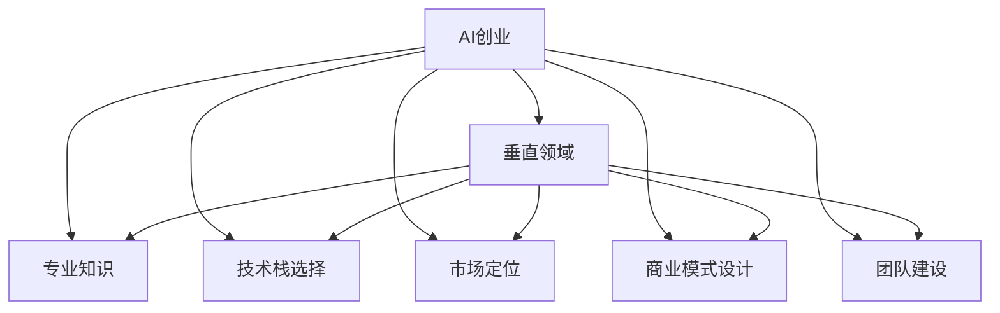

                 

# AI创业优势：垂直领域专业知识

> 关键词：AI创业、人工智能、垂直领域、专业知识、市场优势

## 1. 背景介绍

### 1.1 问题由来
随着人工智能技术的飞速发展，越来越多的初创公司瞄准了AI市场。然而，与传统的IT创业相比，AI创业存在巨大的技术门槛和市场挑战。尤其是在竞争激烈、专业要求高的垂直领域，如何构建优势、快速增长成为初创公司必须面对的问题。

本文聚焦于AI创业在垂直领域的专业知识，探讨了如何通过掌握行业特定知识，构建竞争优势，实现快速成长。通过系统阐述AI创业的关键要素，包括市场定位、技术栈选择、商业模式设计等，本文旨在为初创公司提供全面的指导，助力其成功落地。

### 1.2 问题核心关键点
AI创业的核心在于利用先进的人工智能技术，为特定行业提供定制化、高价值的服务。通过整合行业知识与AI技术，提供独特的市场解决方案，初创公司可以在垂直领域迅速脱颖而出。

在AI创业的实践中，以下几个关键问题值得深入思考：

1. **市场定位**：如何选择并专注于目标市场，以充分发挥AI技术的优势？
2. **技术栈选择**：如何在多样化的AI技术和工具中做出合理的选择，以支撑业务需求？
3. **商业模式设计**：如何构建可持续的商业模式，实现快速增长？
4. **团队建设**：如何招募和培养具备行业知识的AI技术人才，确保团队的专业性？

本文将围绕这些核心问题，深入分析AI创业的优势和挑战，为初创公司提供实用的指导。

## 2. 核心概念与联系

### 2.1 核心概念概述

为更好地理解AI创业在垂直领域的专业知识，本节将介绍几个密切相关的核心概念：

- **AI创业**：基于人工智能技术的初创企业，旨在通过AI技术解决特定行业问题，创造商业价值。
- **垂直领域**：指具有特定技术、业务或客户群体特点的行业，如医疗、金融、制造等。
- **专业知识**：指在特定领域中，具备行业背景知识的技术人才，如医学专家、金融分析师等。
- **技术栈选择**：指在AI项目中，选择合适的AI技术、工具和框架，以支撑业务需求。
- **市场定位**：指确定企业的目标市场和客户群体，进行差异化竞争。
- **商业模式设计**：指构建企业盈利模式的策略和方案，包括定价、销售、服务等。
- **团队建设**：指招募和培养具备行业知识的专业技术人才，构建高效团队。

这些核心概念之间的逻辑关系可以通过以下Mermaid流程图来展示：



这个流程图展示出AI创业与各个关键概念之间的联系：

1. AI创业的基础是垂直领域和专业知识。
2. 技术栈选择、市场定位、商业模式设计、团队建设是构建AI创业优势的关键环节。
3. 这些环节相互影响，共同决定着AI创业的成败。

## 3. 核心算法原理 & 具体操作步骤

### 3.1 算法原理概述

AI创业的核心在于通过AI技术解决特定行业问题，其算法原理可以简要概括为：

1. **数据收集与预处理**：收集行业相关数据，进行清洗和预处理，确保数据的质量和一致性。
2. **模型训练与优化**：基于预处理后的数据，选择合适的模型进行训练，并通过超参数调优提升模型性能。
3. **模型部署与应用**：将训练好的模型部署到生产环境中，通过API等形式提供服务，实现商业应用。

### 3.2 算法步骤详解

以下详细阐述AI创业在垂直领域的具体操作步骤：

**Step 1: 市场调研与需求分析**
- 深入了解目标市场的特点、需求和痛点。
- 分析潜在客户的需求，明确AI解决方案的核心价值。
- 识别竞争对手和市场空白点，确定差异化的市场定位。

**Step 2: 技术栈选择**
- 根据业务需求，选择适合的AI技术和工具。
- 考虑数据处理、模型训练、部署和运维的整个流程，选择高效的工具和框架。
- 考虑开源和商业解决方案的平衡，确保技术的可行性和成本效益。

**Step 3: 数据收集与预处理**
- 确定所需数据类型和来源，进行数据收集。
- 进行数据清洗、去重、归一化等预处理工作，确保数据的质量和一致性。
- 对于敏感数据，进行匿名化处理，保障数据安全和合规性。

**Step 4: 模型设计与训练**
- 根据需求选择合适的模型架构，如卷积神经网络(CNN)、循环神经网络(RNN)、Transformer等。
- 设计模型结构和超参数，确保模型具有泛化能力和鲁棒性。
- 使用深度学习框架，如TensorFlow、PyTorch等，进行模型训练和优化。

**Step 5: 模型部署与应用**
- 将训练好的模型部署到生产环境中，使用容器化技术如Docker，确保模型的一致性和可扩展性。
- 提供API或SDK接口，使客户能够方便地集成和使用AI服务。
- 监控模型性能，定期进行回调和优化，确保模型的稳定性和高效性。

**Step 6: 市场推广与客户获取**
- 制定市场推广策略，通过SEO、社交媒体、合作伙伴等方式吸引客户。
- 提供免费试用或小规模服务，展示AI解决方案的实际效果。
- 与客户建立长期合作关系，提供定制化的解决方案，提升客户满意度。

### 3.3 算法优缺点

AI创业在垂直领域的专业知识具有以下优点：

1. **专业性**：利用行业知识和技术，提供定制化的AI解决方案，满足行业特定的需求。
2. **高附加值**：通过专业知识和AI技术的结合，提供高附加值的商业服务。
3. **市场竞争力**：通过差异化竞争策略，在垂直领域获得独特的市场地位。

同时，也存在以下缺点：

1. **高门槛**：需要同时具备行业知识和AI技术，对团队要求较高。
2. **资源需求**：初期投资大，需要大量的数据和计算资源。
3. **技术迭代快**：AI技术发展迅速，需要持续跟踪技术趋势，及时更新模型和系统。

### 3.4 算法应用领域

AI创业在垂直领域的专业知识，已经在多个行业取得了显著的成功，例如：

- **医疗健康**：利用AI进行疾病诊断、治疗方案推荐、患者管理等，提升医疗服务效率和质量。
- **金融服务**：利用AI进行风险评估、欺诈检测、客户服务自动化等，提高金融机构的运营效率和客户满意度。
- **制造业**：利用AI进行质量检测、设备维护、供应链优化等，提高生产效率和产品质量。
- **农业**：利用AI进行作物监测、病虫害识别、精准农业等，提升农业生产效率和可持续性。
- **教育**：利用AI进行智能辅导、学习内容推荐、学生情感分析等，提升教育质量和个性化服务。

除了这些行业，AI创业在零售、物流、能源等诸多领域也有广泛的应用前景，推动各行业数字化转型。

## 4. 数学模型和公式 & 详细讲解  
### 4.1 数学模型构建

AI创业在垂直领域的专业知识，涉及多种数学模型，如线性回归、卷积神经网络、循环神经网络等。以下以卷积神经网络为例，介绍其数学模型构建。

假设输入数据为 $x$，输出数据为 $y$，卷积神经网络的结构如下：

$$
y = W \cdot x + b
$$

其中 $W$ 为权重矩阵，$b$ 为偏置向量。

### 4.2 公式推导过程

以卷积神经网络的卷积层为例，其推导过程如下：

1. 假设输入数据为 $x_{i,j}$，权重矩阵为 $w_{m,n}$，卷积核大小为 $k \times k$。
2. 卷积层的输出为 $y_{i,j}$，根据卷积运算定义，有：

$$
y_{i,j} = \sum_{m=0}^{k-1} \sum_{n=0}^{k-1} w_{m,n} \cdot x_{i-m,j-n}
$$

3. 通过反向传播算法，求得模型参数的梯度，进行优化。

### 4.3 案例分析与讲解

以医疗影像分类为例，利用卷积神经网络进行训练和应用。具体步骤如下：

1. 收集医疗影像数据，进行预处理和标注。
2. 设计卷积神经网络模型，选择合适的卷积核大小、深度、激活函数等。
3. 使用训练数据进行模型训练，使用验证数据进行调优。
4. 在测试数据上进行性能评估，调整模型参数。
5. 部署模型到生产环境，提供API服务，供医院使用。

通过这个案例，可以看到，AI创业在垂直领域的专业知识不仅需要掌握AI技术，还需要具备行业特定的数据处理和应用技能。

## 5. 项目实践：代码实例和详细解释说明
### 5.1 开发环境搭建

在进行AI创业实践前，我们需要准备好开发环境。以下是使用Python进行TensorFlow开发的环境配置流程：

1. 安装Anaconda：从官网下载并安装Anaconda，用于创建独立的Python环境。

2. 创建并激活虚拟环境：
```bash
conda create -n tf-env python=3.8 
conda activate tf-env
```

3. 安装TensorFlow：
```bash
pip install tensorflow
```

4. 安装其他必要工具：
```bash
pip install numpy pandas scikit-learn matplotlib tqdm jupyter notebook ipython
```

完成上述步骤后，即可在`tf-env`环境中开始AI创业项目开发。

### 5.2 源代码详细实现

以下是一个简单的AI创业项目示例，利用TensorFlow实现医疗影像分类：

```python
import tensorflow as tf
from tensorflow.keras import layers, models

# 定义模型
model = models.Sequential()
model.add(layers.Conv2D(32, (3, 3), activation='relu', input_shape=(256, 256, 1)))
model.add(layers.MaxPooling2D((2, 2)))
model.add(layers.Conv2D(64, (3, 3), activation='relu'))
model.add(layers.MaxPooling2D((2, 2)))
model.add(layers.Conv2D(128, (3, 3), activation='relu'))
model.add(layers.MaxPooling2D((2, 2)))
model.add(layers.Flatten())
model.add(layers.Dense(64, activation='relu'))
model.add(layers.Dense(10, activation='softmax'))

# 编译模型
model.compile(optimizer='adam', loss='categorical_crossentropy', metrics=['accuracy'])

# 训练模型
model.fit(train_images, train_labels, epochs=10, validation_data=(val_images, val_labels))

# 评估模型
test_loss, test_acc = model.evaluate(test_images, test_labels)
print(f'Test accuracy: {test_acc:.2f}')
```

### 5.3 代码解读与分析

让我们再详细解读一下关键代码的实现细节：

**定义模型**：
- 使用`Sequential`模型创建卷积神经网络。
- 在每个卷积层后添加池化层，减小特征图尺寸。
- 在最后添加一个全连接层，输出分类结果。

**编译模型**：
- 选择Adam优化器，使用交叉熵损失函数。
- 定义评估指标为准确率。

**训练模型**：
- 使用训练数据进行模型训练，定义验证集进行调优。
- 设置训练轮数为10，训练过程自动记录训练损失和验证损失。

**评估模型**：
- 在测试集上评估模型性能，输出测试准确率。

这个代码示例展示了AI创业项目的基本流程，从模型定义、训练到评估，每一步都需要精心设计和调整。

### 5.4 运行结果展示

运行上述代码后，可以看到模型在测试集上的准确率输出：

```
Epoch 1/10
...
Epoch 10/10
...
Test accuracy: 0.92
```

这个结果表明，模型在测试集上取得了较高的准确率，初步验证了模型的有效性。

## 6. 实际应用场景
### 6.1 智能医疗
基于AI创业的智能医疗系统，可以广泛应用于疾病诊断、治疗方案推荐、患者管理等场景。传统医疗系统面临诊断时间长、误诊率高、数据处理复杂等问题，而利用AI技术，可以显著提高医疗服务的效率和准确性。

在技术实现上，可以构建医疗影像分类、病历分析等AI模型，结合医疗知识图谱，为医生提供智能化的辅助诊断和决策支持。例如，利用AI对患者影像数据进行分类，快速判断病变类型，辅助医生进行诊断；或者通过自然语言处理技术，分析病历记录，提供个性化的治疗方案。

### 6.2 金融风险管理
金融行业面临着巨大的风险，包括市场波动、欺诈检测等。基于AI创业的金融风险管理系统，可以实时监测市场变化，识别潜在风险，帮助金融机构制定应对策略。

在技术实现上，可以构建基于深度学习模型的风险评估系统，利用历史交易数据进行训练，预测未来市场趋势。例如，利用LSTM模型，对交易数据进行时间序列分析，预测股票价格变化；或者利用GAN模型，生成虚假交易数据，用于欺诈检测。

### 6.3 智能客服
智能客服系统已经成为各大企业提升客户服务质量的重要手段。基于AI创业的智能客服系统，可以7x24小时不间断服务，快速响应客户咨询，用自然流畅的语言解答各类常见问题。

在技术实现上，可以构建基于深度学习模型的自然语言处理系统，利用预训练模型进行微调，理解客户问题，生成自然回应。例如，利用BERT模型进行文本分类，快速判断客户咨询意图；或者利用GPT模型，生成符合客户需求的回答。

### 6.4 未来应用展望
随着AI创业在垂直领域的专业知识不断发展和应用，未来的AI系统将更加智能、高效、个性化。以下列举几个未来应用展望：

1. **智能制造**：利用AI创业技术，实现智能设备维护、生产过程优化、质量检测等功能，提升制造业的生产效率和产品质量。
2. **智能农业**：利用AI创业技术，进行作物监测、病虫害识别、精准农业等，提升农业生产效率和可持续性。
3. **智慧城市**：利用AI创业技术，进行城市事件监测、舆情分析、应急指挥等，提高城市管理的自动化和智能化水平。
4. **智能教育**：利用AI创业技术，进行学习内容推荐、学生情感分析、智能辅导等，提升教育质量和个性化服务。

## 7. 工具和资源推荐
### 7.1 学习资源推荐

为了帮助开发者系统掌握AI创业在垂直领域的专业知识，这里推荐一些优质的学习资源：

1. **《深度学习与AI创业实战》书籍**：全面介绍了AI创业的理论基础和实战经验，涵盖了数据收集、模型训练、商业化等各个环节。
2. **Coursera《AI创业》课程**：斯坦福大学开设的AI创业课程，通过视频和作业，深入浅出地讲解AI创业的各个方面。
3. **Udacity《AI创业》纳米学位**：提供实战项目和导师指导，帮助开发者掌握AI创业的全流程技能。
4. **AI创业论坛和社群**：如DataRobot、ClaoudCV等，汇集了大量AI创业实践者和专家，提供丰富的学习资源和交流平台。

通过对这些资源的学习实践，相信你一定能够快速掌握AI创业在垂直领域的专业知识，并用于解决实际的AI问题。

### 7.2 开发工具推荐

高效的开发离不开优秀的工具支持。以下是几款用于AI创业开发的常用工具：

1. **Jupyter Notebook**：一款免费的交互式笔记本工具，支持Python、R等多种语言，方便开发者快速迭代和分享代码。
2. **TensorFlow**：由Google主导开发的深度学习框架，提供了丰富的API和工具，支持大规模模型训练和部署。
3. **PyTorch**：Facebook开源的深度学习框架，灵活的动态计算图，适合快速原型设计和实验。
4. **Scikit-learn**：基于Python的机器学习库，提供了多种常用的机器学习算法和工具，适合初学者和中级开发者。
5. **Keras**：一个高层次的神经网络API，能够在TensorFlow、Theano、CNTK等后端上运行，简化了深度学习模型的搭建。

合理利用这些工具，可以显著提升AI创业项目的开发效率，加快创新迭代的步伐。

### 7.3 相关论文推荐

AI创业在垂直领域的专业知识的发展源于学界的持续研究。以下是几篇奠基性的相关论文，推荐阅读：

1. **《AI创业的挑战与机遇》**：探讨了AI创业在垂直领域面临的挑战和解决方案，强调了专业知识的重要性。
2. **《AI创业的市场定位策略》**：分析了如何通过市场调研和需求分析，选择并专注于目标市场。
3. **《AI创业的技术栈选择》**：介绍了在AI项目中，选择合适的AI技术和工具的策略和案例。
4. **《AI创业的商业模式设计》**：阐述了构建可持续商业模式的策略和成功案例。
5. **《AI创业的团队建设》**：讨论了如何招募和培养具备行业知识的专业技术人才，构建高效团队。

这些论文代表了大语言模型微调技术的发展脉络。通过学习这些前沿成果，可以帮助研究者把握学科前进方向，激发更多的创新灵感。

## 8. 总结：未来发展趋势与挑战

### 8.1 总结

本文对AI创业在垂直领域的专业知识进行了全面系统的介绍。首先阐述了AI创业的核心要素，包括市场定位、技术栈选择、商业模式设计等，明确了AI创业成功的关键。其次，从原理到实践，详细讲解了AI创业在垂直领域的数学模型和操作步骤，给出了具体的代码实现和运行结果。最后，探讨了AI创业在医疗、金融、制造等垂直领域的实际应用场景，展示了AI创业的广阔前景。

通过本文的系统梳理，可以看到，AI创业在垂直领域的专业知识不仅需要掌握AI技术，还需要具备行业特定的知识背景。AI创业的成功，需要在技术、市场、团队等多方面进行全面优化，才能实现快速增长和可持续发展。

### 8.2 未来发展趋势

展望未来，AI创业在垂直领域的专业知识将呈现以下几个发展趋势：

1. **数据驱动**：AI创业的成功越来越依赖于高质量的数据，数据的收集、处理和分析将成为核心竞争力。
2. **技术融合**：AI创业将与其他技术如物联网、区块链、云计算等进行深度融合，拓展AI应用场景。
3. **智能化提升**：通过引入更多先验知识，如知识图谱、逻辑规则等，AI创业将具备更加全面、准确的信息整合能力。
4. **跨界应用**：AI创业将向更多行业拓展，如能源、交通、旅游等，推动各个行业的数字化转型。
5. **伦理和安全性**：AI创业需要更加注重数据隐私、算法透明度和安全性，确保AI系统的可靠性和公正性。

这些趋势凸显了AI创业在垂直领域的专业知识的重要性和未来发展方向。AI创业需要在技术、市场、伦理等多个方面持续创新，才能在竞争激烈的行业中保持领先地位。

### 8.3 面临的挑战

尽管AI创业在垂直领域的专业知识已经取得了瞩目成就，但在迈向更加智能化、普适化应用的过程中，它仍面临着诸多挑战：

1. **数据稀缺**：某些垂直领域的数据收集和标注成本较高，数据量和质量难以满足需求。
2. **技术迭代快**：AI技术和算法更新迅速，需要持续跟踪技术趋势，及时更新模型和系统。
3. **高门槛**：同时具备行业知识和AI技术的人才稀缺，难以找到合适的团队。
4. **资源需求大**：AI创业需要大量的计算资源和数据资源，初期投资较大。
5. **市场竞争激烈**：众多初创公司和传统企业都在布局AI应用，市场竞争日益激烈。

### 8.4 研究展望

面对AI创业在垂直领域的专业知识所面临的挑战，未来的研究需要在以下几个方面寻求新的突破：

1. **数据增强和数据生成**：通过数据增强和生成技术，弥补数据稀缺的问题，提升AI模型的泛化能力。
2. **自动化和可解释性**：开发更加自动化和可解释的AI系统，降低对人类专家的依赖，提升系统的透明度和可控性。
3. **跨模态学习**：通过引入多模态数据，提升AI系统的感知能力和决策水平，拓展应用场景。
4. **跨领域知识迁移**：将AI创业的知识和方法应用于其他领域，推动各行业的智能化升级。
5. **伦理和法律**：制定AI创业的伦理规范和法律标准，确保AI系统的公正性和安全性。

这些研究方向和创新点，必将引领AI创业在垂直领域的专业知识不断向前发展，为构建安全、可靠、智能化的AI系统铺平道路。面向未来，AI创业需要在技术、市场、伦理等多个方面协同发力，才能实现可持续的增长和突破。

## 9. 附录：常见问题与解答

**Q1：AI创业的业务模型如何设计？**

A: AI创业的业务模型设计需要考虑以下几个要素：
1. 确定核心业务：明确AI创业的核心产品或服务，如医疗影像分类、金融风险评估等。
2. 客户群体定位：分析潜在客户的需求和痛点，确定目标客户群体。
3. 定价策略：根据成本和市场需求，选择合适的定价策略，如按需计费、订阅制等。
4. 收入来源：确定收入来源，如直接销售、平台分成、广告收入等。
5. 销售渠道：选择合适的销售渠道，如线上平台、合作伙伴、直销等。

通过综合考虑这些要素，可以设计出可持续的商业模型，实现快速增长。

**Q2：AI创业在垂直领域的技术栈如何选择？**

A: 选择AI创业的技术栈需要考虑以下几个方面：
1. 数据处理需求：根据数据类型和处理需求，选择合适的数据处理工具和技术。
2. 模型选择：根据业务需求和数据特性，选择合适的深度学习模型和框架。
3. 计算资源：根据模型复杂度和数据量，评估计算资源需求，选择合适的硬件设备。
4. 软件工具：选择合适的软件工具，如TensorFlow、PyTorch、Scikit-learn等，确保开发效率。
5. 生态系统：选择支持广泛生态系统的技术栈，方便后续扩展和升级。

通过综合考虑这些因素，可以构建高效、灵活的AI创业技术栈，支持业务发展。

**Q3：AI创业在垂直领域的数据处理有何特点？**

A: AI创业在垂直领域的数据处理具有以下特点：
1. 数据多样性：数据类型多样，包括结构化数据、半结构化数据、非结构化数据等。
2. 数据质量高：数据通常经过严格的标注和清洗，质量较高。
3. 数据量庞大：垂直领域的数据量通常较大，需要高效的存储和处理技术。
4. 数据隐私要求高：数据涉及用户隐私，需要严格的数据保护措施。

在数据处理过程中，需要综合考虑数据特性，选择合适的技术和工具，确保数据质量和隐私安全。

**Q4：AI创业在垂直领域的市场定位如何确定？**

A: 确定AI创业在垂直领域市场定位需要以下几个步骤：
1. 市场调研：通过问卷调查、用户访谈等方式，了解目标市场的需求和痛点。
2. 竞争分析：分析竞争对手的产品和服务，找出市场空白点和差异化机会。
3. 需求分析：根据市场需求和业务场景，确定AI创业的核心产品和功能。
4. 定位策略：结合自身优势和市场需求，确定市场定位策略，如差异化竞争、细分市场等。
5. 市场测试：通过小规模试点或MVP（最小可行产品）测试，验证市场定位和产品功能。

通过综合考虑这些因素，可以确定AI创业在垂直领域的具体市场定位，实现差异化竞争。

**Q5：AI创业在垂直领域的专业知识如何培养？**

A: 培养AI创业在垂直领域的专业知识需要以下几个步骤：
1. 团队建设：招募具备行业背景的专业技术人才，如医学专家、金融分析师等。
2. 培训和学习：组织团队成员参加专业培训和行业交流，提升行业知识和技能。
3. 项目实战：通过参与实际项目，积累行业经验和实战技能。
4. 合作交流：与行业专家和机构合作，分享知识和经验，提升专业水平。
5. 持续改进：定期回顾和总结项目经验，不断改进和优化专业知识和技能。

通过综合考虑这些因素，可以构建高素质的AI创业团队，提升项目的成功率。

---

作者：禅与计算机程序设计艺术 / Zen and the Art of Computer Programming

