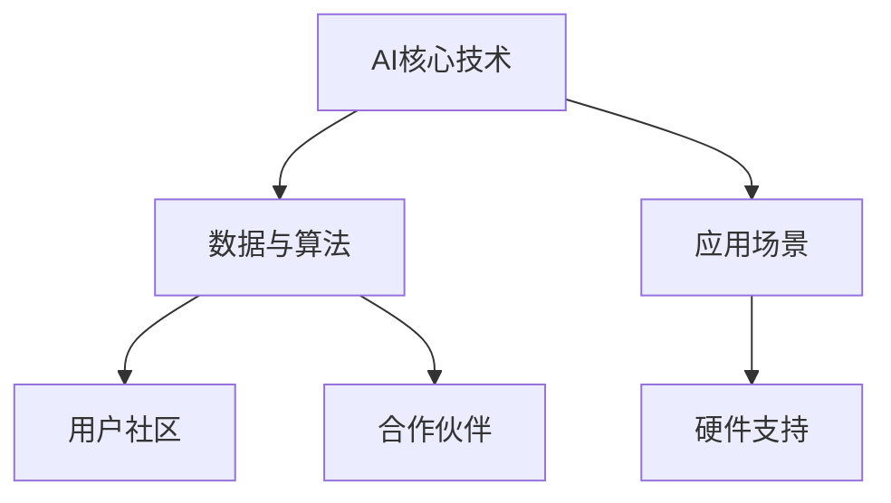

                 

# AI创业公司如何打造生态系统?

在人工智能时代，AI创业公司要想在激烈的市场竞争中脱颖而出，仅仅拥有核心技术是不够的，还需构建一个涵盖硬件、软件、数据、应用等多维度的一体化生态系统。本文将围绕AI创业公司生态系统的构建，从核心概念、算法原理、具体步骤、应用案例等方面，系统阐述打造AI生态系统的关键要素和具体方法，希望能为AI创业者提供有价值的参考。

## 1. 背景介绍

随着人工智能技术的快速发展和广泛应用，AI创业公司如雨后春笋般涌现，这些公司致力于利用前沿技术解决实际问题，推动各行各业的数字化转型。但与此同时，AI创业公司也面临着巨大的挑战，如何在市场竞争中生存、发展，成为当下亟需解答的问题。

**背景分析：**
1. **技术成熟度**：AI技术逐渐成熟，应用场景愈发广泛，但大规模部署和普及仍面临诸多挑战。
2. **市场需求**：企业对于智能化解决方案的需求日益增长，AI创业公司需快速响应市场需求，不断创新迭代。
3. **资源制约**：AI创业公司通常资金有限，资源紧缺，需高效利用各种资源。
4. **市场竞争**：AI领域竞争激烈，创业公司需构建生态系统，提升整体竞争力。

## 2. 核心概念与联系

### 2.1 核心概念概述

构建AI创业公司的生态系统，需要围绕以下几个关键概念：

- **AI核心技术**：AI创业公司须具备核心的AI技术，包括机器学习、深度学习、自然语言处理、计算机视觉等。
- **数据与算法**：大量高质量数据是AI技术的基石，高效算法是提升模型性能的关键。
- **应用场景**：针对特定应用场景进行优化，使AI技术真正落地。
- **硬件支持**：高性能计算硬件是AI算法运行的基础，如GPU、TPU、边缘计算等。
- **用户社区**：建立用户社区，通过用户反馈不断优化产品，形成良性循环。
- **合作伙伴**：与上下游合作伙伴建立紧密合作关系，共同推动AI技术的应用与发展。

这些概念相互关联，共同构成AI生态系统的关键要素，通过合理配置和优化，可以构建一个高效、稳定、可持续发展的AI生态系统。

### 2.2 核心概念原理和架构的 Mermaid 流程图



这个流程图展示了AI创业公司生态系统的核心要素及其相互关系，反映了构建生态系统的基本结构。

## 3. 核心算法原理 & 具体操作步骤

### 3.1 算法原理概述

构建AI生态系统，核心在于如何将AI技术、数据、算法、应用场景、硬件、用户社区、合作伙伴等多维度的要素进行有效整合。这一过程需要深入理解AI算法原理和实际操作流程，通过合理的算法设计和优化，实现各要素的协同工作。

### 3.2 算法步骤详解

1. **需求分析**：明确目标用户群体的需求，选择相应的应用场景。
2. **数据收集与处理**：根据应用场景，收集、清洗和标注数据。
3. **模型训练与优化**：选择合适的算法，进行模型训练，并通过交叉验证、调参等手段优化模型性能。
4. **应用集成**：将训练好的模型集成到实际应用中，确保其稳定运行。
5. **生态系统构建**：通过合作伙伴、用户社区等多渠道，不断收集反馈，优化产品，形成良性生态循环。

### 3.3 算法优缺点

**优点：**
1. **全面覆盖**：整合了AI技术、数据、算法、应用场景、硬件、用户社区、合作伙伴等多维度要素，形成全面的生态系统。
2. **协同工作**：各要素之间相互协同，形成整体优势，提升产品竞争力。
3. **快速迭代**：通过用户反馈和合作伙伴的协助，不断优化产品，保持市场竞争力。

**缺点：**
1. **复杂度高**：构建和维护生态系统涉及多个环节，需要跨学科知识和多方协作。
2. **资源消耗大**：需要投入大量的人力、物力和财力。
3. **风险多变**：各要素之间相互依赖，某一环节出现问题可能影响整体。

### 3.4 算法应用领域

构建AI生态系统的算法原理和操作步骤，在多个领域中得到了广泛应用，例如：

- **医疗领域**：构建AI医疗生态系统，整合数据、算法、硬件、应用场景等，为医院、医生、患者提供智能化医疗服务。
- **金融领域**：通过构建AI金融生态系统，实现智能投顾、风险控制、金融市场预测等功能。
- **智能制造**：整合AI技术和工业互联网平台，实现智能生产、质量控制、供应链管理等功能。
- **智能交通**：构建AI交通生态系统，实现智能导航、自动驾驶、交通管理等功能。

## 4. 数学模型和公式 & 详细讲解 & 举例说明

### 4.1 数学模型构建

构建AI生态系统的数学模型，需要综合考虑数据集、算法模型、目标函数等要素。以智能制造为例，构建数学模型如下：

1. **数据集**：收集生产设备的运行数据、产品质量数据、供应链数据等。
2. **算法模型**：选择合适的机器学习算法，如回归模型、分类模型等。
3. **目标函数**：确定优化目标，如最小化生产成本、提高产品质量等。

### 4.2 公式推导过程

以机器学习算法中的线性回归模型为例，其公式推导如下：

$$ y = \hat{y} = w_0 + w_1x_1 + w_2x_2 + \ldots + w_nx_n + \epsilon $$

其中，$y$为预测结果，$\hat{y}$为模型输出，$w_i$为模型参数，$x_i$为输入特征，$\epsilon$为随机噪声。

### 4.3 案例分析与讲解

某智能制造企业，通过构建AI生态系统，实现了生产效率的大幅提升。具体步骤如下：

1. **数据收集**：收集生产设备的运行数据、产品质量数据、供应链数据等。
2. **模型训练**：使用线性回归模型，对数据进行训练和优化。
3. **应用集成**：将训练好的模型集成到生产调度系统中，实现智能生产。
4. **生态系统构建**：通过合作伙伴、用户社区等多渠道，不断收集反馈，优化产品，形成良性生态循环。

通过上述案例，可以看到，构建AI生态系统需要从数据、算法、应用场景、硬件、用户社区、合作伙伴等多维度进行全面考量，才能实现预期效果。

## 5. 项目实践：代码实例和详细解释说明

### 5.1 开发环境搭建

构建AI生态系统的开发环境，需要具备以下条件：

1. **硬件资源**：高性能计算硬件，如GPU、TPU等。
2. **软件环境**：深度学习框架，如TensorFlow、PyTorch等，数据处理工具，如Pandas、NumPy等。

### 5.2 源代码详细实现

以智能制造为例，使用TensorFlow进行模型训练和应用集成的代码实现如下：

```python
import tensorflow as tf
import pandas as pd
import numpy as np

# 数据预处理
data = pd.read_csv('data.csv')
features = data.drop('target', axis=1)
target = data['target']

# 构建模型
model = tf.keras.Sequential([
    tf.keras.layers.Dense(64, activation='relu'),
    tf.keras.layers.Dense(64, activation='relu'),
    tf.keras.layers.Dense(1)
])

# 编译模型
model.compile(optimizer=tf.keras.optimizers.Adam(0.001), loss='mse')

# 训练模型
model.fit(features, target, epochs=100, batch_size=32)

# 应用集成
predictions = model.predict(features)

# 生态系统构建
# 通过合作伙伴、用户社区等多渠道，不断收集反馈，优化产品，形成良性生态循环
```

### 5.3 代码解读与分析

上述代码实现了智能制造场景中的数据预处理、模型训练、应用集成和生态系统构建。具体分析如下：

1. **数据预处理**：使用Pandas库对数据进行读取和预处理，去除无用特征，标准化数据格式。
2. **模型构建**：使用TensorFlow搭建线性回归模型，包含两个全连接层和输出层。
3. **模型编译**：设置优化器、损失函数等参数，进行模型编译。
4. **模型训练**：使用训练数据对模型进行训练，调整模型参数。
5. **应用集成**：使用训练好的模型进行预测，集成到生产调度系统中。
6. **生态系统构建**：通过合作伙伴、用户社区等多渠道，收集反馈，优化产品，形成良性生态循环。

## 6. 实际应用场景

### 6.1 医疗领域

构建AI医疗生态系统，可以为医院、医生、患者提供智能化医疗服务。具体应用场景包括：

- **智能诊断**：利用AI技术，辅助医生进行疾病诊断，提高诊断准确率。
- **医疗影像**：通过AI算法，对医学影像进行分析和诊断，提高疾病检测率。
- **个性化治疗**：基于患者数据，生成个性化治疗方案，提升治疗效果。

### 6.2 金融领域

构建AI金融生态系统，实现智能投顾、风险控制、金融市场预测等功能。具体应用场景包括：

- **智能投顾**：利用AI技术，为投资者提供个性化投资建议，提升投资回报率。
- **风险控制**：通过AI算法，预测金融市场波动，降低风险。
- **金融市场预测**：利用AI模型，分析历史数据，预测金融市场走势。

### 6.3 智能制造

构建AI制造生态系统，实现智能生产、质量控制、供应链管理等功能。具体应用场景包括：

- **智能生产**：通过AI算法，优化生产调度，提高生产效率。
- **质量控制**：利用AI技术，实时监控产品质量，提高产品质量。
- **供应链管理**：通过AI算法，优化供应链管理，降低成本。

### 6.4 未来应用展望

未来，AI生态系统的应用场景将更加多样化，涵盖更多行业和领域。预计未来几年，AI生态系统的应用将逐渐从实验室走向产业化，成为各行各业的重要基础设施。

## 7. 工具和资源推荐

### 7.1 学习资源推荐

1. **《AI创业实战》**：深入浅出地介绍了AI创业公司的生态系统构建、核心技术、市场策略等方面的内容。
2. **《深度学习入门》**：详细讲解了深度学习算法原理、实践应用等方面的知识，帮助开发者掌握AI核心技术。
3. **《Python深度学习》**：提供了丰富的代码示例和案例分析，帮助开发者快速上手深度学习技术。
4. **《机器学习实战》**：通过实战案例，帮助开发者掌握机器学习算法的应用和优化。
5. **《自然语言处理基础》**：深入浅出地介绍了自然语言处理技术的基础知识和应用场景。

### 7.2 开发工具推荐

1. **TensorFlow**：基于Google的深度学习框架，支持分布式训练和高效推理。
2. **PyTorch**：Facebook开发的深度学习框架，支持动态图和静态图两种计算模型。
3. **Pandas**：数据分析工具，支持数据清洗、处理和分析。
4. **NumPy**：科学计算库，支持高效的数学运算和矩阵操作。
5. **TensorBoard**：可视化工具，帮助开发者监控模型训练过程，优化模型性能。

### 7.3 相关论文推荐

1. **《构建AI生态系统的挑战与策略》**：详细分析了构建AI生态系统面临的挑战和解决策略。
2. **《跨行业AI生态系统构建的实践与思考》**：介绍了跨行业AI生态系统的构建经验和实践案例。
3. **《AI创业公司生态系统设计》**：探讨了AI创业公司生态系统的设计思路和实践方法。
4. **《AI生态系统的可持续性研究》**：研究了AI生态系统的可持续性问题，提出了相应的解决方案。
5. **《AI生态系统中的数据治理》**：探讨了AI生态系统中的数据治理问题，提出了相应的治理策略。

## 8. 总结：未来发展趋势与挑战

### 8.1 研究成果总结

本文系统介绍了构建AI创业公司生态系统的关键要素和操作步骤，详细阐述了AI生态系统的构建方法和应用场景。通过理论与实践的结合，展示了AI生态系统的构建过程和未来发展方向。

### 8.2 未来发展趋势

1. **AI技术的进步**：随着AI技术的不断进步，AI生态系统的构建将更加高效、智能。
2. **数据的多元化**：大数据、人工智能、物联网等技术的融合，将带来更加多样化的数据源。
3. **应用场景的扩展**：AI生态系统将应用于更多行业和领域，推动各行各业的数字化转型。
4. **生态系统的融合**：AI生态系统将与云计算、物联网、区块链等技术融合，形成更完善的生态系统。

### 8.3 面临的挑战

1. **数据隐私与安全**：如何在保证数据隐私和安全的前提下，构建AI生态系统。
2. **跨领域协作**：不同行业、不同领域的合作将面临复杂的协调问题。
3. **技术标准化**：AI生态系统中的技术标准和接口规范需要进一步统一。
4. **人才培养**：AI生态系统构建需要跨学科人才，如何培养相关人才是重要挑战。

### 8.4 研究展望

1. **多模态数据融合**：探索多模态数据融合技术，提升AI生态系统的综合能力。
2. **自适应学习算法**：研究自适应学习算法，提高AI生态系统的自我优化能力。
3. **自动化与智能化**：探索自动化与智能化技术，提高AI生态系统的运行效率和智能化水平。
4. **伦理与合规**：探索AI伦理与合规问题，确保AI生态系统的健康发展。

## 9. 附录：常见问题与解答

**Q1：构建AI生态系统需要投入哪些资源？**

A: 构建AI生态系统需要投入大量资源，包括资金、技术、人才、硬件、软件、数据等方面。需要制定详细的资源规划，明确各环节的资源需求，合理分配资源。

**Q2：构建AI生态系统面临的最大挑战是什么？**

A: 构建AI生态系统面临的最大挑战是跨领域协作。不同行业、不同领域的合作伙伴需要协同工作，如何协调各方利益、整合资源、形成统一的标准是关键。

**Q3：如何确保AI生态系统的数据安全？**

A: 确保AI生态系统的数据安全，需要采取多种措施，如数据加密、访问控制、安全审计等。同时，建立数据治理机制，明确数据使用规范，确保数据安全和合规。

**Q4：构建AI生态系统的关键是什么？**

A: 构建AI生态系统的关键在于构建全面的生态系统，整合AI技术、数据、算法、应用场景、硬件、用户社区、合作伙伴等多维度要素，形成整体优势。

通过本文的系统介绍，希望能为AI创业者提供有价值的参考，帮助他们构建高效、稳定、可持续发展的AI生态系统。在AI技术不断发展的今天，构建生态系统将是AI创业公司的重要战略方向。相信随着技术的不断进步，AI生态系统的构建将更加成熟，为各行各业带来更多的创新和价值。

