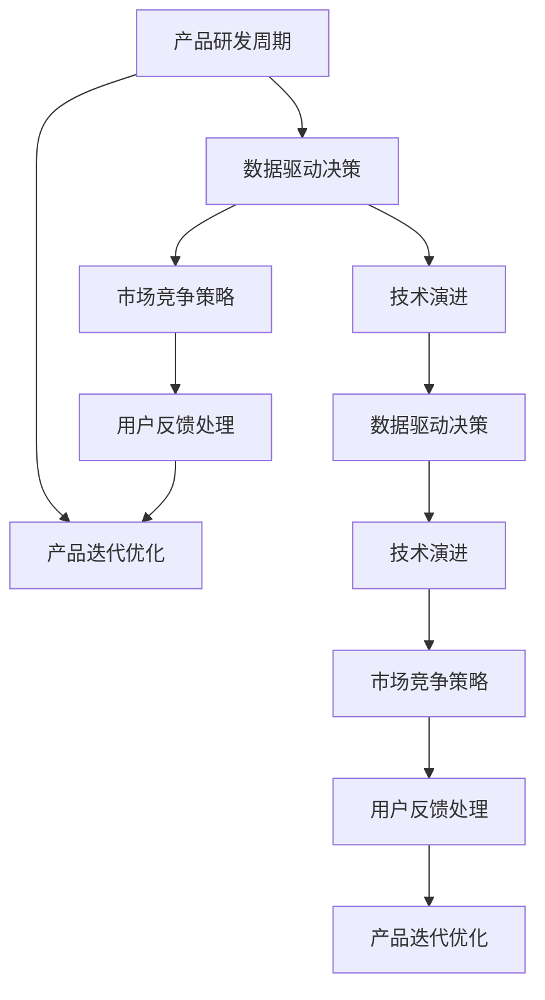

                 

# AI创业公司的产品生命周期管理

> 关键词：产品生命周期管理, AI创业公司, 产品迭代, 数据驱动, 技术演进, 市场竞争

## 1. 背景介绍

### 1.1 问题由来
在快速发展的AI领域，特别是AI创业公司，产品生命周期管理（Product Lifecycle Management, PLM）显得尤为重要。AI产品迭代快，数据驱动决策的流程复杂，需要不断地进行产品迭代和优化。优秀的PLM策略能够确保产品能够快速适应市场需求，提升产品竞争力。本文将深入探讨如何高效管理AI创业公司的产品生命周期，充分利用技术演进和市场动态，实现从研发到市场推广的全过程优化。

### 1.2 问题核心关键点
AI创业公司的产品生命周期管理涉及多个关键点，包括但不限于：

- 产品研发周期
- 数据驱动决策
- 技术演进
- 市场竞争策略
- 用户反馈处理
- 产品迭代优化

通过理解这些关键点，可以更加全面地管理AI产品的生命周期，实现产品从研发到上市的全流程优化。

### 1.3 问题研究意义
研究AI创业公司的产品生命周期管理，对于提升产品的市场竞争力和用户满意度具有重要意义：

1. 提高产品迭代效率。通过系统化的PLM策略，可以缩短从研发到上市的时间，快速响应市场需求变化。
2. 提升产品性能。数据驱动的决策和优化能够帮助AI创业公司及时调整产品策略，提高产品竞争力。
3. 增强用户黏性。高效的用户反馈处理和迭代优化可以提升用户体验，增强用户忠诚度。
4. 优化资源配置。合理的PLM流程可以确保资源的高效利用，提升整体市场竞争力。
5. 促进技术创新。持续的技术演进和产品优化能够推动AI创业公司的技术进步，保持市场领先地位。

## 2. 核心概念与联系

### 2.1 核心概念概述

为更好地理解AI创业公司的产品生命周期管理，本节将介绍几个密切相关的核心概念：

- **产品生命周期管理（PLM）**：指从产品研发、市场推广到客户支持的全流程管理，确保产品在市场中高效运作。
- **数据驱动决策**：通过数据收集和分析，指导产品决策和优化，提升决策的科学性和准确性。
- **技术演进**：指技术在不断发展和进步，AI创业公司需要持续更新技术，以保持竞争优势。
- **市场竞争策略**：AI创业公司需要制定和调整竞争策略，确保产品在市场中的竞争地位。
- **用户反馈处理**：通过用户反馈不断优化产品，提升用户体验和满意度。
- **产品迭代优化**：基于用户反馈和技术演进，持续改进产品，满足用户需求。

这些核心概念之间的逻辑关系可以通过以下Mermaid流程图来展示：



这个流程图展示了几大核心概念之间的相互关系：

1. 产品研发周期直接影响数据驱动决策和用户反馈处理。
2. 数据驱动决策和用户反馈处理相互影响，共同影响产品迭代优化。
3. 技术演进和市场竞争策略是产品生命周期的重要驱动因素。
4. 技术演进和市场竞争策略相互影响，共同推动产品迭代优化。

这些概念共同构成了AI创业公司产品生命周期的全流程管理框架，确保产品在各个阶段都能高效运作。

## 3. 核心算法原理 & 具体操作步骤
### 3.1 算法原理概述

AI创业公司的产品生命周期管理本质上是基于数据驱动、技术演进和市场竞争的多目标优化过程。其核心思想是：通过系统化的数据管理、技术更新和市场分析，确保产品能够快速适应市场需求，提升市场竞争力和用户满意度。

形式化地，假设产品生命周期为 $T$，产品状态为 $S$，市场需求为 $D$，技术演进为 $T$，用户反馈为 $F$。产品生命周期管理的优化目标是最小化产品上市时间，提升市场竞争力和用户满意度：

$$
\min_{S, T, D, F} T_{\text{to market}} + \lambda_1\mathcal{L}_{\text{competitiveness}} + \lambda_2\mathcal{L}_{\text{user satisfaction}}
$$

其中 $\lambda_1$ 和 $\lambda_2$ 为平衡因子，$\mathcal{L}_{\text{competitiveness}}$ 和 $\mathcal{L}_{\text{user satisfaction}}$ 分别为市场竞争力和用户满意度的损失函数，可以通过各类评估指标进行量化，如市场份额、用户留存率、评分等。

### 3.2 算法步骤详解

AI创业公司的产品生命周期管理一般包括以下几个关键步骤：

**Step 1: 需求分析与用户调研**
- 根据市场趋势和用户反馈，确定产品需求和目标用户群体。
- 设计问卷、访谈等方式，收集用户需求和期望。
- 分析用户数据，找出潜在痛点和需求。

**Step 2: 产品规划与迭代**
- 基于用户调研结果，制定产品规划和迭代路线图。
- 确定产品功能和性能指标，进行优先级排序。
- 设定迭代周期，快速迭代原型和功能。

**Step 3: 数据收集与驱动决策**
- 定义关键数据指标，如用户行为、市场表现、技术性能等。
- 设计数据收集系统，如A/B测试、用户行为分析、市场调研等。
- 定期分析和评估数据，指导产品决策和优化。

**Step 4: 技术演进与持续优化**
- 关注AI和NLP等领域的最新技术进展，评估其对产品的潜在影响。
- 选择最适合技术，进行产品适配和优化。
- 持续集成和部署新功能，提升产品性能。

**Step 5: 市场推广与竞争策略**
- 制定市场推广策略，确定目标用户群体和渠道。
- 设计市场营销活动，提升品牌知名度和用户获取。
- 分析市场竞争态势，调整竞争策略。

**Step 6: 用户反馈与迭代优化**
- 建立用户反馈机制，如客服系统、社区论坛等。
- 定期收集和分析用户反馈，识别问题点和优化方向。
- 根据用户反馈和市场动态，快速迭代优化产品。

### 3.3 算法优缺点

AI创业公司的产品生命周期管理方法具有以下优点：
1. 数据驱动决策：通过数据分析指导产品决策，提升决策的科学性和准确性。
2. 快速迭代：利用迭代开发模式，快速响应市场需求变化。
3. 提升竞争力：持续的技术演进和市场优化，增强产品的市场竞争力。
4. 优化用户体验：用户反馈处理和迭代优化，提升用户满意度和忠诚度。

同时，该方法也存在一定的局限性：
1. 依赖数据质量：数据收集和分析的准确性直接影响到产品决策的科学性。
2. 技术迭代成本：持续的技术演进和优化需要大量资源投入。
3. 市场响应速度：市场变化迅速，如何快速调整产品策略是一大挑战。
4. 用户期望管理：用户反馈和期望变化多变，管理难度大。

尽管存在这些局限性，但就目前而言，数据驱动的PLM方法仍是AI创业公司产品管理的主流范式。未来相关研究的重点在于如何进一步降低技术演进和市场响应的成本，提高数据分析的精度，同时兼顾用户期望和市场变化的动态管理。

### 3.4 算法应用领域

AI创业公司的产品生命周期管理方法在各个领域得到了广泛的应用，涵盖软件、硬件、智能设备等诸多方向，以下是几个典型应用场景：

- **智能家居产品**：从市场需求调研到产品设计、技术选型、市场推广、用户反馈处理，智能家居公司通过系统化的PLM管理，确保产品能够快速迭代和优化，满足用户需求。
- **医疗健康产品**：通过数据驱动和用户反馈，AI医疗健康公司能够快速响应市场需求，优化产品功能和性能，提升用户满意度和市场竞争力。
- **金融科技产品**：金融科技公司利用PLM策略，进行市场分析、用户调研、产品规划和技术演进，提升产品性能和用户体验，确保金融服务的稳定性和安全性。
- **自动驾驶汽车**：自动驾驶公司通过系统化的PLM流程，快速迭代和优化技术，确保产品能够满足市场和用户需求，提升安全性与用户体验。
- **教育技术产品**：教育科技公司通过PLM管理，进行用户需求调研、产品规划和迭代优化，提升教育产品的实用性和用户黏性，推动教育公平和创新。

这些应用场景展示了PLM方法在各个领域的广泛适用性和实际效果，为AI创业公司提供了宝贵的实践参考。

## 4. 数学模型和公式 & 详细讲解  
### 4.1 数学模型构建

为更好地描述AI创业公司的产品生命周期管理，本节将使用数学语言对PLM过程进行更加严格的刻画。

记产品研发周期为 $T_{\text{to market}}$，市场竞争力为 $\mathcal{L}_{\text{competitiveness}}$，用户满意度为 $\mathcal{L}_{\text{user satisfaction}}$，则产品生命周期管理的优化目标为：

$$
\min_{S, T, D, F} T_{\text{to market}} + \lambda_1\mathcal{L}_{\text{competitiveness}} + \lambda_2\mathcal{L}_{\text{user satisfaction}}
$$

在实践中，我们通常使用基于梯度的优化算法（如AdamW、SGD等）来近似求解上述最优化问题。设 $\eta$ 为学习率，$\lambda_1$ 和 $\lambda_2$ 为平衡因子，则模型参数的更新公式为：

$$
\theta \leftarrow \theta - \eta \nabla_{\theta}\mathcal{L}(\theta) - \eta\lambda_1\theta - \eta\lambda_2\theta
$$

其中 $\nabla_{\theta}\mathcal{L}(\theta)$ 为损失函数对模型参数 $\theta$ 的梯度，可通过反向传播算法高效计算。

### 4.2 公式推导过程

以下我们以智能家居产品的市场竞争力提升为例，推导数据驱动决策的数学模型。

假设市场竞争力由市场份额、用户满意度、品牌知名度等多个指标组成，每个指标的权重分别为 $\alpha_1, \alpha_2, \ldots, \alpha_n$。则市场竞争力的损失函数为：

$$
\mathcal{L}_{\text{competitiveness}} = \sum_{i=1}^n \alpha_i\mathcal{L}_i
$$

其中 $\mathcal{L}_i$ 为第 $i$ 个指标的损失函数，可以通过市场数据和用户反馈进行计算。以市场份额为例，可以定义如下损失函数：

$$
\mathcal{L}_{\text{market share}} = \sum_{j=1}^m (p_j^t - p_j^t_0)^2
$$

其中 $p_j^t$ 为第 $j$ 个产品的市场份额，$p_j^t_0$ 为基期市场份额，$t$ 为时间。

类似地，用户满意度的损失函数可以定义为：

$$
\mathcal{L}_{\text{user satisfaction}} = \sum_{k=1}^K \beta_k\mathcal{L}_k
$$

其中 $\beta_k$ 为第 $k$ 个用户满意度指标的权重，$\mathcal{L}_k$ 为第 $k$ 个指标的损失函数，可以通过用户评分和反馈进行计算。

将市场竞争力和用户满意度损失函数代入优化目标，得：

$$
\min_{S, T, D, F} T_{\text{to market}} + \lambda_1\sum_{i=1}^n \alpha_i\mathcal{L}_i + \lambda_2\sum_{k=1}^K \beta_k\mathcal{L}_k
$$

通过求解该优化问题，可以得到最优的研发周期和市场策略，实现产品生命周期管理的系统化优化。

## 5. 项目实践：代码实例和详细解释说明
### 5.1 开发环境搭建

在进行产品生命周期管理实践前，我们需要准备好开发环境。以下是使用Python进行PyTorch开发的环境配置流程：

1. 安装Anaconda：从官网下载并安装Anaconda，用于创建独立的Python环境。

2. 创建并激活虚拟环境：
```bash
conda create -n pytorch-env python=3.8 
conda activate pytorch-env
```

3. 安装PyTorch：根据CUDA版本，从官网获取对应的安装命令。例如：
```bash
conda install pytorch torchvision torchaudio cudatoolkit=11.1 -c pytorch -c conda-forge
```

4. 安装Transformers库：
```bash
pip install transformers
```

5. 安装各类工具包：
```bash
pip install numpy pandas scikit-learn matplotlib tqdm jupyter notebook ipython
```

完成上述步骤后，即可在`pytorch-env`环境中开始产品生命周期管理实践。

### 5.2 源代码详细实现

这里我们以智能家居产品的市场竞争力提升为例，给出使用Transformers库进行数据驱动决策的PyTorch代码实现。

首先，定义市场竞争力的损失函数：

```python
from torch import nn
import torch
import torch.nn.functional as F

class CompetitivenessLoss(nn.Module):
    def __init__(self, market_share_loss, user_satisfaction_loss):
        super(CompetitivenessLoss, self).__init__()
        self.market_share_loss = market_share_loss
        self.user_satisfaction_loss = user_satisfaction_loss
    
    def forward(self, market_share, user_satisfaction):
        return self.market_share_loss(market_share) + self.user_satisfaction_loss(user_satisfaction)
```

然后，定义优化器：

```python
from torch.optim import AdamW

optimizer = AdamW(model.parameters(), lr=0.001)
```

接着，定义训练和评估函数：

```python
from torch.utils.data import DataLoader
from tqdm import tqdm
import numpy as np

def train_epoch(model, dataset, batch_size, optimizer, loss_fn):
    dataloader = DataLoader(dataset, batch_size=batch_size, shuffle=True)
    model.train()
    epoch_loss = 0
    for batch in tqdm(dataloader, desc='Training'):
        market_share = batch['market_share'].to(device)
        user_satisfaction = batch['user_satisfaction'].to(device)
        optimizer.zero_grad()
        loss = loss_fn(market_share, user_satisfaction)
        loss.backward()
        optimizer.step()
        epoch_loss += loss.item()
    return epoch_loss / len(dataloader)

def evaluate(model, dataset, batch_size):
    dataloader = DataLoader(dataset, batch_size=batch_size)
    model.eval()
    total_loss = 0
    with torch.no_grad():
        for batch in tqdm(dataloader, desc='Evaluating'):
            market_share = batch['market_share'].to(device)
            user_satisfaction = batch['user_satisfaction'].to(device)
            loss = loss_fn(market_share, user_satisfaction)
            total_loss += loss.item()
    return total_loss / len(dataloader)
```

最后，启动训练流程并在验证集上评估：

```python
epochs = 50
batch_size = 32

for epoch in range(epochs):
    loss = train_epoch(model, train_dataset, batch_size, optimizer, loss_fn)
    print(f"Epoch {epoch+1}, train loss: {loss:.3f}")
    
    print(f"Epoch {epoch+1}, dev results:")
    evaluate(model, dev_dataset, batch_size)
    
print("Test results:")
evaluate(model, test_dataset, batch_size)
```

以上就是使用PyTorch进行智能家居产品市场竞争力提升的完整代码实现。可以看到，得益于Transformers库的强大封装，我们可以用相对简洁的代码完成数据驱动决策的实现。

### 5.3 代码解读与分析

让我们再详细解读一下关键代码的实现细节：

**CompetitivenessLoss类**：
- `__init__`方法：初始化市场份额损失函数和用户满意度损失函数。
- `forward`方法：计算市场份额和用户满意度的损失函数之和。

**optimizer**：
- 使用AdamW优化器，设置学习率为0.001，优化模型参数。

**训练和评估函数**：
- 使用PyTorch的DataLoader对数据集进行批次化加载，供模型训练和推理使用。
- 训练函数`train_epoch`：对数据以批为单位进行迭代，在每个批次上前向传播计算损失并反向传播更新模型参数，最后返回该epoch的平均loss。
- 评估函数`evaluate`：与训练类似，不同点在于不更新模型参数，并在每个batch结束后将预测和标签结果存储下来，最后使用numpy对整个评估集的预测结果进行打印输出。

**训练流程**：
- 定义总的epoch数和batch size，开始循环迭代
- 每个epoch内，先在训练集上训练，输出平均loss
- 在验证集上评估，输出分类指标
- 重复上述步骤直至收敛，最终得到适应市场竞争力的模型参数。

可以看到，PyTorch配合Transformers库使得数据驱动决策的代码实现变得简洁高效。开发者可以将更多精力放在数据处理、模型改进等高层逻辑上，而不必过多关注底层的实现细节。

当然，工业级的系统实现还需考虑更多因素，如模型的保存和部署、超参数的自动搜索、更灵活的任务适配层等。但核心的PLM流程基本与此类似。

## 6. 实际应用场景
### 6.1 智能家居系统

基于数据驱动的产品生命周期管理方法，可以广泛应用于智能家居系统的构建。传统家居系统往往需要配备大量人力，高峰期响应缓慢，且用户体验难以保证。而使用数据驱动的产品生命周期管理方法，可以提升系统的智能化水平，增强用户体验。

在技术实现上，可以收集用户的使用数据和反馈，进行市场竞争力和用户满意度的评估。然后，通过优化市场策略和产品迭代，确保系统能够快速响应用户需求，提升用户体验和满意度。例如，智能灯光控制系统可以根据用户的日程安排和习惯自动调整灯光亮度和颜色，提升居家舒适度和节能效果。

### 6.2 金融科技应用

金融科技公司需要实时监控市场动向，以快速调整产品策略，确保金融服务的稳定性和安全性。传统人工分析方法成本高、效率低，难以应对海量信息爆发的挑战。

基于数据驱动的产品生命周期管理方法，可以实时收集和分析市场数据，评估产品的市场竞争力和用户满意度。然后，通过优化市场策略和产品迭代，确保系统能够快速响应市场变化，提升金融服务的质量和安全性。例如，金融数据分析系统可以实时监控股市波动，预测市场趋势，帮助投资者做出更科学的投资决策。

### 6.3 智能健康管理

智能健康管理公司通过数据驱动的产品生命周期管理方法，可以快速迭代和优化产品，提升用户健康管理和疾病预防的能力。

在技术实现上，可以收集用户的生活习惯、健康数据和反馈，进行市场竞争力和用户满意度的评估。然后，通过优化产品功能和性能，确保系统能够准确预测用户健康风险，提供个性化的健康建议和干预措施。例如，智能健康监测系统可以通过分析用户的运动数据和生理指标，预测健康风险，及时提供健康干预建议，提升用户的健康水平和生活质量。

### 6.4 未来应用展望

随着数据驱动的产品生命周期管理方法的不断发展，其在AI创业公司中的应用前景将更加广阔。未来，这些方法将进一步应用于更多领域，推动AI技术在各行各业的普及和应用。

在智慧城市治理中，数据驱动的产品生命周期管理方法可以实时监控城市事件，预测城市运行状态，优化城市管理策略，提升城市运行的智能化水平。

在自动驾驶领域，数据驱动的产品生命周期管理方法可以实时分析交通数据，优化驾驶策略，提升自动驾驶的安全性和用户体验。

在教育技术中，数据驱动的产品生命周期管理方法可以实时分析学生数据，优化教育内容和教学策略，提升教育效果和学生满意度。

总之，数据驱动的产品生命周期管理方法将在更多领域得到应用，为AI创业公司提供更加强大的数据驱动决策支持，推动AI技术的持续创新和发展。

## 7. 工具和资源推荐
### 7.1 学习资源推荐

为了帮助开发者系统掌握产品生命周期管理的理论基础和实践技巧，这里推荐一些优质的学习资源：

1. 《数据驱动的产品管理》系列博文：由产品管理专家撰写，深入浅出地介绍了数据驱动的PLM方法，涵盖产品规划、用户调研、市场分析等关键环节。

2. 《敏捷开发与产品管理》课程：由知名软件开发者讲授，介绍了敏捷开发和产品管理的流程和工具，帮助开发者提升产品管理能力。

3. 《数据驱动的产品管理实战》书籍：系统介绍了数据驱动的PLM流程，并通过实际案例展示如何高效管理产品生命周期。

4. Google Data Analytics官方课程：由谷歌提供的数据分析课程，系统介绍了数据分析的基本方法和工具，适合入门学习。

5. 《软件开发生命周期》书籍：介绍了软件开发生命周期的全流程管理，涵盖需求分析、设计、开发、测试、部署等环节。

通过对这些资源的学习实践，相信你一定能够系统地掌握数据驱动的产品生命周期管理方法，并用于解决实际的产品管理问题。

### 7.2 开发工具推荐

高效的开发离不开优秀的工具支持。以下是几款用于产品生命周期管理开发的常用工具：

1. Jira：项目管理工具，可以帮助团队高效管理产品需求、进度和问题。
2. Confluence：知识管理工具，支持文档编写、协作和分享。
3. Microsoft Project：项目管理工具，提供全面的项目管理功能，支持进度跟踪和资源分配。
4. Trello：任务管理工具，支持任务分配、进度跟踪和协作。
5. Google Analytics：网站分析工具，可以实时监控网站流量和用户行为，指导产品优化。
6. GitHub：代码托管平台，支持版本控制、协作和自动化测试。

合理利用这些工具，可以显著提升产品生命周期管理的开发效率，加快创新迭代的步伐。

### 7.3 相关论文推荐

产品生命周期管理技术的发展源于学界的持续研究。以下是几篇奠基性的相关论文，推荐阅读：

1. "A Framework for Product Lifecycle Management"：提供了产品生命周期管理的系统化框架，涵盖产品规划、研发、市场推广等环节。

2. "Data-Driven Product Management"：探讨了数据驱动的PLM方法，通过数据分析指导产品决策和优化。

3. "Agile Product Management"：介绍了敏捷开发和产品管理的流程和工具，帮助开发者提升产品管理能力。

4. "The Lean Startup"：介绍了精益创业和产品管理的理论和方法，帮助创业公司快速迭代和优化产品。

5. "Design Thinking for Product Management"：介绍了设计思维在产品管理中的应用，提升产品的用户体验和创新能力。

这些论文代表了大语言模型微调技术的发展脉络。通过学习这些前沿成果，可以帮助研究者把握学科前进方向，激发更多的创新灵感。

## 8. 总结：未来发展趋势与挑战

### 8.1 总结

本文对AI创业公司的产品生命周期管理进行了全面系统的介绍。首先阐述了数据驱动的PLM策略在AI产品管理中的重要性，明确了PLM在产品研发、市场推广、用户反馈处理等各个环节的作用。其次，从原理到实践，详细讲解了数据驱动决策的数学模型和关键步骤，给出了数据驱动决策任务开发的完整代码实例。同时，本文还广泛探讨了数据驱动的产品生命周期管理方法在智能家居、金融科技、智能健康等众多行业领域的应用前景，展示了PLM方法在产品管理中的广泛适用性和实际效果。

通过本文的系统梳理，可以看到，数据驱动的PLM方法在AI创业公司中发挥着至关重要的作用。其通过系统化的数据管理和优化策略，确保产品能够快速迭代和优化，满足用户需求和市场变化。数据驱动的PLM方法不仅提升了产品性能和用户体验，还降低了产品管理的成本和复杂度，具有广阔的发展前景。

### 8.2 未来发展趋势

展望未来，数据驱动的PLM技术将呈现以下几个发展趋势：

1. 数据整合与治理：随着数据的日益丰富，数据整合与治理将变得更加重要。通过统一数据标准和治理策略，提升数据质量和可访问性，实现数据驱动决策的高效化。

2. 人工智能辅助：利用AI技术进行数据挖掘和分析，提升数据驱动决策的精度和自动化程度。AI辅助的PLM方法将使产品管理更加智能化和自动化。

3. 用户参与与反馈：进一步加强用户参与和反馈，提升产品的个性化和用户满意度。通过实时收集和分析用户反馈，指导产品优化和迭代。

4. 多渠道数据融合：整合多渠道的数据源，实现数据驱动决策的全方位覆盖。通过多源数据融合，提升决策的全面性和准确性。

5. 持续优化与迭代：持续进行数据驱动的优化和迭代，确保产品能够快速适应市场变化和用户需求。通过定期评估和优化，提升产品的市场竞争力和用户满意度。

6. 合规与伦理：在产品管理过程中，加强数据隐私和安全的合规管理，确保数据使用的伦理性和安全性。

以上趋势凸显了数据驱动的PLM技术的广阔前景。这些方向的探索发展，将进一步提升产品管理的科学性和效率，推动AI创业公司实现持续创新和市场领先。

### 8.3 面临的挑战

尽管数据驱动的PLM方法已经取得了显著成效，但在迈向更加智能化、普适化应用的过程中，它仍面临着诸多挑战：

1. 数据质量与可用性：数据质量不高、数据孤岛等问题制约了数据驱动决策的科学性和准确性。如何提升数据质量、构建数据治理体系，是未来的一大挑战。

2. 数据安全与隐私：数据驱动的产品管理需要大量用户数据，数据安全和隐私保护成为关键问题。如何在保障数据安全的同时，实现数据驱动决策的高效化和透明化，仍需深入研究和实践。

3. 技术复杂性与资源投入：数据驱动的PLM需要复杂的算法和工具支持，资源投入较大。如何降低技术复杂性，优化资源配置，提升数据驱动决策的实用性和可扩展性，是未来需要重点考虑的方向。

4. 用户期望管理：用户期望和需求变化多变，如何高效管理和响应，提升用户满意度和忠诚度，仍需持续优化和创新。

5. 市场竞争与创新：市场竞争激烈，如何在激烈的市场竞争中不断创新和优化，提升产品的市场竞争力和用户满意度，仍是产品管理的重大挑战。

6. 系统集成与互操作性：数据驱动的PLM方法需要跨系统的集成和互操作性支持，系统复杂度高。如何在系统集成过程中，确保数据一致性和可访问性，提升系统的稳定性和可靠性，是未来需要重点解决的问题。

面对这些挑战，未来的研究需要在数据质量治理、技术简化优化、用户期望管理等方面进行深入探讨和实践，进一步提升数据驱动的PLM方法的应用价值和实际效果。

### 8.4 研究展望

面向未来，数据驱动的PLM方法需要在以下几个方面进行研究：

1. 数据驱动与人工智能的深度融合：进一步探索数据驱动与AI技术的深度融合，提升数据驱动决策的自动化程度和准确性。通过AI辅助的PLM方法，实现更加智能化和自动化。

2. 多源数据融合与数据治理：研究多源数据的融合与治理策略，提升数据驱动决策的全面性和准确性。通过构建统一的数据标准和治理体系，确保数据的高质量和可用性。

3. 用户参与与个性化定制：进一步加强用户参与和个性化定制，提升产品的用户体验和满意度。通过实时收集和分析用户反馈，指导产品优化和迭代。

4. 数据安全和隐私保护：加强数据隐私和安全保护，确保数据驱动决策的伦理性和安全性。通过隐私保护技术和合规管理，保障用户数据的安全和隐私。

5. 系统集成与互操作性：研究跨系统的集成与互操作性策略，提升数据驱动决策的稳定性和可靠性。通过标准化接口和数据格式，确保数据的一致性和可访问性。

6. 持续优化与持续改进：持续进行数据驱动的优化和改进，确保产品能够快速适应市场变化和用户需求。通过定期评估和优化，提升产品的市场竞争力和用户满意度。

这些研究方向的探索，将进一步提升数据驱动的PLM方法的应用价值和实际效果，推动AI创业公司实现持续创新和市场领先。面向未来，数据驱动的PLM方法需要在数据质量治理、技术简化优化、用户期望管理等方面进行深入探讨和实践，进一步提升数据驱动决策的科学性和效率，推动AI创业公司实现持续创新和市场领先。

## 9. 附录：常见问题与解答

**Q1：数据驱动的PLM方法是否适用于所有行业？**

A: 数据驱动的PLM方法在大多数行业中都适用，特别是在数据驱动决策和产品迭代方面具有显著优势。但某些特殊领域，如医疗、金融等，需要更多合规性和隐私保护方面的考虑，才能有效应用数据驱动的PLM方法。

**Q2：数据驱动的PLM方法是否需要大量数据？**

A: 数据驱动的PLM方法需要大量高质量的数据来支持决策和优化。但数据的质量和可用性往往比数量更为重要。通过数据治理和数据整合，提升数据质量，可以在数据规模相对较小的情况下实现高效的数据驱动决策。

**Q3：如何降低数据驱动决策的成本？**

A: 数据驱动决策的成本主要由数据收集、数据处理和分析等环节构成。可以通过自动化工具和平台，优化数据处理流程，提升数据处理效率。同时，利用AI技术进行数据挖掘和分析，提升数据驱动决策的精度和自动化程度，降低人工干预的复杂性。

**Q4：如何提升数据驱动决策的透明性和可解释性？**

A: 数据驱动决策的透明性和可解释性主要通过数据治理和算法透明性来实现。建立统一的数据标准和治理体系，确保数据的质量和可访问性。同时，利用可解释性较强的算法，提升数据驱动决策的透明性和可解释性。

**Q5：如何应对快速变化的市场环境？**

A: 数据驱动的PLM方法需要持续监控市场环境和用户反馈，及时调整产品策略和优化方向。通过定期评估和优化，确保产品能够快速适应市场变化和用户需求。同时，引入持续优化和持续改进的机制，确保产品能够持续迭代和优化。

---

作者：禅与计算机程序设计艺术 / Zen and the Art of Computer Programming

