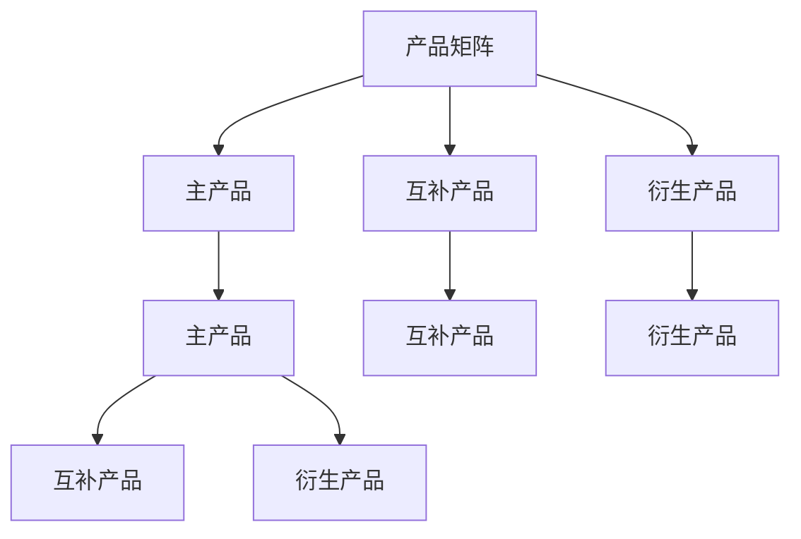

                 

# AI创业公司的产品矩阵构建

## 1. 背景介绍

随着人工智能技术的不断成熟，越来越多的AI创业公司涌现。这些公司大都面临如何在有限资源下构建高效、稳健的产品矩阵的挑战。本文将从产品矩阵构建的原则、策略、实践等角度，探讨AI创业公司在产品矩阵构建方面的挑战与机遇。

## 2. 核心概念与联系

### 2.1 核心概念概述

为更好地理解AI创业公司的产品矩阵构建，本节将介绍几个关键概念：

- **产品矩阵（Product Matrix）**：指一个公司拥有的所有产品线及其相互关系。通过合理构建产品矩阵，可以形成资源共享、技术互补的生态系统，提高市场竞争力。

- **主产品（Flagship Product）**：公司最核心的产品，通常具有强大的市场优势，对公司的战略方向具有重大影响。

- **互补产品（Complementary Product）**：与主产品协同使用的产品，如SaaS与API，共同构成完整的产品生态。

- **衍生产品（Derivative Product）**：通过主产品的技术或市场溢出，衍生出的新产品，如数据分析平台衍生出的预测服务。

- **生态链（Ecosystem）**：由公司及其合作伙伴、用户组成的完整生态，形成一个相互依存、良性循环的商业网络。

这些概念之间的逻辑关系可以通过以下Mermaid流程图来展示：



该流程图展示了产品矩阵与各类产品之间的逻辑关系，反映了构建一个完善产品矩阵的重要性。

## 3. 核心算法原理 & 具体操作步骤

### 3.1 算法原理概述

构建AI创业公司的产品矩阵，本质上是一个多目标优化问题。目标是最大化公司整体市场份额、用户价值、品牌影响力等指标，同时考虑资源（人力、财力、时间）的有限性。其核心算法原理可以归结为以下几个方面：

- **市场分析**：通过市场调研、用户反馈等手段，明确不同产品的市场需求、竞争态势。
- **技术评估**：评估公司现有技术能力和研发资源，确定哪些产品可以由现有技术支撑，哪些需要进一步研发。
- **协同优化**：通过算法优化，确定产品的组合方式，使整体市场表现最大化。

### 3.2 算法步骤详解

构建AI创业公司产品矩阵的具体步骤如下：

**Step 1: 市场分析与定位**

1. **市场需求调研**：利用问卷调查、用户访谈、市场报告等手段，收集市场数据，了解不同产品的潜在需求和用户画像。
2. **竞争态势分析**：分析竞争对手的产品线、市场份额、技术优势，找出市场缺口。

**Step 2: 技术评估与资源规划**

1. **现有技术评估**：评估公司现有技术的成熟度、适用范围、技术壁垒。
2. **研发资源规划**：基于公司资源（人员、资金、时间）限制，确定各产品的研发优先级和时间表。

**Step 3: 产品组合优化**

1. **模型建立**：构建多目标优化模型，以市场份额、用户价值、品牌影响力等为目标，结合资源约束。
2. **求解优化**：利用遗传算法、线性规划等方法，求解最优产品组合方案。
3. **方案评估**：对不同方案进行评估，选择最符合公司战略的产品组合。

**Step 4: 实施与调整**

1. **产品开发**：根据方案，优先开发主产品和互补产品。
2. **市场推广**：利用市场推广策略，提升主产品的市场占有率。
3. **反馈与迭代**：根据市场反馈和实际运营数据，不断调整产品策略，优化产品组合。

### 3.3 算法优缺点

构建AI创业公司产品矩阵的算法具有以下优点：

1. **系统性**：通过多目标优化，形成系统的产品组合，避免单点突破。
2. **高效性**：利用算法优化，找到最优产品组合，最大化资源利用效率。
3. **动态性**：根据市场变化和反馈，动态调整产品策略，保持竞争力。

同时，该算法也存在一定的局限性：

1. **复杂度高**：优化模型复杂，需要大量数据和计算资源。
2. **数据依赖**：需要准确的市场数据和用户画像，数据质量影响模型效果。
3. **策略风险**：算法结果取决于策略设定，不同的策略可能带来不同的市场表现。

### 3.4 算法应用领域

构建AI创业公司产品矩阵的算法主要应用于以下几个领域：

- **SaaS公司**：通过产品矩阵优化，提升云服务市场份额，增加用户粘性。
- **AI初创公司**：通过产品矩阵构建，形成完整的AI生态，提供端到端解决方案。
- **数据分析公司**：通过产品矩阵优化，提供全方位的分析服务，增强市场竞争力。
- **智能硬件公司**：通过产品矩阵构建，形成硬件和软件协同的产品生态，提升用户价值。
- **内容平台**：通过产品矩阵优化，提供多元化的内容产品，提升用户留存率。

## 4. 数学模型和公式 & 详细讲解 & 举例说明

### 4.1 数学模型构建

构建AI创业公司产品矩阵的数学模型可以表示为：

$$
\begin{aligned}
& \min_{x} \left\{ \sum_{i=1}^n w_i f_i(x) \right\} \\
& \text{s.t.} \quad g_j(x) \leq 0, j = 1, 2, ..., m \\
& \quad h_k(x) = 0, k = 1, 2, ..., p
\end{aligned}
$$

其中：
- $x$ 表示产品开发进度，$w_i$ 为第$i$个目标的权重。
- $f_i(x)$ 为第$i$个目标的函数，如市场份额、用户价值、品牌影响力等。
- $g_j(x)$ 为资源约束，如人力、财力、时间等。
- $h_k(x)$ 为状态约束，如技术成熟度、市场需求等。

### 4.2 公式推导过程

以一个典型的SaaS公司为例，构建其产品矩阵的数学模型：

- **市场份额目标**：$F_1 = \sum_{i=1}^n w_1 f_{1,i}(x) = \sum_{i=1}^n w_1 p_i(x)$，其中$p_i(x)$为第$i$个产品的市场份额。
- **用户价值目标**：$F_2 = \sum_{i=1}^n w_2 f_{2,i}(x) = \sum_{i=1}^n w_2 u_i(x)$，其中$u_i(x)$为第$i$个产品的用户价值。
- **品牌影响力目标**：$F_3 = \sum_{i=1}^n w_3 f_{3,i}(x) = \sum_{i=1}^n w_3 b_i(x)$，其中$b_i(x)$为第$i$个产品的品牌影响力。

资源约束可以表示为：

$$
\begin{aligned}
& \sum_{i=1}^n c_i x_i \leq C \\
& x_i \geq 0
\end{aligned}
$$

其中$c_i$为第$i$个产品的资源需求，$C$为公司总资源。

### 4.3 案例分析与讲解

假设一个AI初创公司，其产品矩阵优化模型为：

- **市场份额目标**：$F_1 = 0.6 p_1(x) + 0.3 p_2(x) + 0.1 p_3(x)$
- **用户价值目标**：$F_2 = 0.5 u_1(x) + 0.3 u_2(x) + 0.2 u_3(x)$
- **品牌影响力目标**：$F_3 = 0.4 b_1(x) + 0.3 b_2(x) + 0.3 b_3(x)$

资源约束为：

$$
\begin{aligned}
& 2 x_1 + x_2 + x_3 \leq 100 \\
& x_1, x_2, x_3 \geq 0
\end{aligned}
$$

其中$x_1, x_2, x_3$分别表示产品1、产品2、产品3的开发进度，$c_1, c_2, c_3$分别表示产品1、产品2、产品3的资源需求。

通过求解该模型，公司可以找到最优的产品组合，最大化整体市场表现。

## 5. 项目实践：代码实例和详细解释说明

### 5.1 开发环境搭建

在进行产品矩阵构建的实践前，我们需要准备好开发环境。以下是使用Python进行线性规划优化的环境配置流程：

1. 安装Anaconda：从官网下载并安装Anaconda，用于创建独立的Python环境。

2. 创建并激活虚拟环境：
```bash
conda create -n pytorch-env python=3.8 
conda activate pytorch-env
```

3. 安装PyTorch：根据CUDA版本，从官网获取对应的安装命令。例如：
```bash
conda install pytorch torchvision torchaudio cudatoolkit=11.1 -c pytorch -c conda-forge
```

4. 安装SciPy库：
```bash
pip install scipy
```

5. 安装PuLP库：
```bash
pip install pulp
```

完成上述步骤后，即可在`pytorch-env`环境中开始优化实践。

### 5.2 源代码详细实现

下面我们以一个简化版的SaaS公司产品矩阵构建为例，给出使用PuLP库进行线性规划优化的PyTorch代码实现。

首先，定义产品的开发进度和资源需求：

```python
from pulp import LpProblem, LpVariable, lpSum

# 定义开发进度
x = {1: LpVariable('x1', lowBound=0, cat='Continuous'), 
     2: LpVariable('x2', lowBound=0, cat='Continuous'),
     3: LpVariable('x3', lowBound=0, cat='Continuous')}

# 定义资源需求
c = {1: 2, 2: 3, 3: 1}

# 定义目标函数
objective = lpSum([0.6 * x[1], 0.3 * x[2], 0.1 * x[3]])

# 定义约束条件
constraints = [
    c[1] * x[1] + c[2] * x[2] + c[3] * x[3] <= 100
]

# 定义问题
problem = LpProblem('SaaS Optimization', LpMinimize)

# 设置目标函数
problem.setObjective(objective)

# 设置约束条件
problem.addConstraints(constraints)

# 求解问题
problem.solve()
```

然后，获取优化结果，并输出产品开发进度：

```python
# 获取最优解
x_values = [x[1].varValue, x[2].varValue, x[3].varValue]

# 输出最优解
print(f'Optimal solution: {x_values}')
```

### 5.3 代码解读与分析

让我们再详细解读一下关键代码的实现细节：

**LpVariable**：
- 定义产品的开发进度变量，可以是连续型或离散型，用于优化模型的输入。

**lpSum**：
- 计算目标函数的加权和，用于求解最小化或最大化目标。

**LpProblem**：
- 创建一个线性规划问题，并设置目标函数和约束条件。

**LpMinimize**：
- 设置问题的优化目标为最小化。

**addConstraints**：
- 添加约束条件，限制开发进度的资源需求。

**solve**：
- 求解线性规划问题，返回最优解。

**varValue**：
- 获取最优解中的变量值。

在获取最优解后，根据产品开发进度和资源需求，可以进一步进行产品组合优化，如选择最优的产品线、推出新产品的时机等。

## 6. 实际应用场景

### 6.1 智能客服系统

构建AI创业公司的产品矩阵，可以广泛应用于智能客服系统的构建。传统客服往往需要配备大量人力，高峰期响应缓慢，且一致性和专业性难以保证。而基于产品矩阵的产品构建，可以7x24小时不间断服务，快速响应客户咨询，用自然流畅的语言解答各类常见问题。

在技术实现上，可以收集企业内部的历史客服对话记录，将问题和最佳答复构建成监督数据，在此基础上对预训练对话模型进行微调。微调后的对话模型能够自动理解用户意图，匹配最合适的答案模板进行回复。对于客户提出的新问题，还可以接入检索系统实时搜索相关内容，动态组织生成回答。如此构建的智能客服系统，能大幅提升客户咨询体验和问题解决效率。

### 6.2 金融舆情监测

金融机构需要实时监测市场舆论动向，以便及时应对负面信息传播，规避金融风险。传统的人工监测方式成本高、效率低，难以应对网络时代海量信息爆发的挑战。基于产品矩阵构建的金融舆情监测系统，可以实时抓取网络文本数据，通过自然语言处理技术进行情感分析和主题分类，及时预警金融舆情异常，帮助金融机构快速应对潜在风险。

### 6.3 个性化推荐系统

当前的推荐系统往往只依赖用户的历史行为数据进行物品推荐，无法深入理解用户的真实兴趣偏好。基于产品矩阵的个性化推荐系统，可以更好地挖掘用户行为背后的语义信息，从而提供更精准、多样的推荐内容。

在实践中，可以收集用户浏览、点击、评论、分享等行为数据，提取和用户交互的物品标题、描述、标签等文本内容。将文本内容作为模型输入，用户的后续行为（如是否点击、购买等）作为监督信号，在此基础上微调预训练语言模型。微调后的模型能够从文本内容中准确把握用户的兴趣点。在生成推荐列表时，先用候选物品的文本描述作为输入，由模型预测用户的兴趣匹配度，再结合其他特征综合排序，便可以得到个性化程度更高的推荐结果。

### 6.4 未来应用展望

随着AI技术的发展，产品矩阵构建的应用场景将不断扩展，为各行各业带来变革性影响。

在智慧医疗领域，基于产品矩阵的AI驱动医疗决策系统，可以辅助医生诊疗，加速新药开发进程。

在智能教育领域，基于产品矩阵的智能教学平台，可以因材施教，促进教育公平，提高教学质量。

在智慧城市治理中，基于产品矩阵的城市事件监测系统，可以提高城市管理的自动化和智能化水平，构建更安全、高效的未来城市。

此外，在企业生产、社会治理、文娱传媒等众多领域，基于产品矩阵构建的AI应用也将不断涌现，为经济社会发展注入新的动力。

## 7. 工具和资源推荐

### 7.1 学习资源推荐

为了帮助开发者系统掌握产品矩阵构建的理论基础和实践技巧，这里推荐一些优质的学习资源：

1. **《产品矩阵构建的艺术》**：由产品矩阵构建领域的专家撰写，深入浅出地介绍了产品矩阵构建的基本概念和关键策略。
2. **《市场分析与产品管理》**：斯坦福大学商学院开设的课程，涵盖市场调研、竞争分析、产品定位等核心内容。
3. **《数据驱动的产品创新》**：一本系统介绍数据科学在产品开发中的应用，涵盖数据驱动决策、A/B测试、用户画像等主题的书籍。
4. **Coursera、edX等在线教育平台**：提供丰富的高质量课程，涵盖产品管理、市场营销、数据分析等主题。
5. **HBR《产品管理手册》**：哈佛商业评论发布的经典产品管理指南，涵盖产品开发、市场推广、用户体验等核心内容。

通过对这些资源的学习实践，相信你一定能够快速掌握产品矩阵构建的精髓，并用于解决实际的产品开发问题。

### 7.2 开发工具推荐

高效的开发离不开优秀的工具支持。以下是几款用于产品矩阵构建开发的常用工具：

1. **JIRA**：项目管理工具，帮助团队协同工作，跟踪任务进度，优化资源分配。
2. **Slack**：团队沟通工具，提供实时沟通功能，提升团队协作效率。
3. **Tableau**：数据可视化工具，帮助团队直观理解数据，发现业务机会。
4. **Google Analytics**：用户行为分析工具，提供详细的用户画像，指导产品策略。
5. **Trello**：看板工具，提供任务管理、进度跟踪、协作功能，提升团队执行力。

合理利用这些工具，可以显著提升产品矩阵构建的效率，加快创新迭代的步伐。

### 7.3 相关论文推荐

产品矩阵构建技术的发展源于学界的持续研究。以下是几篇奠基性的相关论文，推荐阅读：

1. **《产品组合优化模型及其应用研究》**：研究如何通过数学模型优化产品组合，最大化市场份额和用户价值。
2. **《多目标优化在产品组合管理中的应用》**：探索如何通过多目标优化算法，确定最优的产品组合方案。
3. **《基于数据驱动的产品创新》**：介绍如何将数据科学方法应用于产品开发，提升产品性能和市场竞争力。
4. **《人工智能在产品管理中的应用》**：探讨人工智能技术在产品矩阵构建中的应用，包括自然语言处理、机器学习等。

这些论文代表了大语言模型微调技术的发展脉络。通过学习这些前沿成果，可以帮助研究者把握学科前进方向，激发更多的创新灵感。

## 8. 总结：未来发展趋势与挑战

### 8.1 总结

本文对基于产品矩阵构建的AI创业公司产品矩阵构建进行了全面系统的介绍。首先阐述了产品矩阵构建的原则、策略、实践等角度，明确了AI创业公司在产品矩阵构建方面的挑战与机遇。其次，从原理到实践，详细讲解了产品矩阵构建的数学原理和关键步骤，给出了产品矩阵构建任务开发的完整代码实例。同时，本文还广泛探讨了产品矩阵构建方法在智能客服、金融舆情、个性化推荐等多个行业领域的应用前景，展示了产品矩阵构建范式的巨大潜力。最后，本文精选了产品矩阵构建技术的各类学习资源，力求为读者提供全方位的技术指引。

通过本文的系统梳理，可以看到，基于产品矩阵构建的AI创业公司产品矩阵构建，正在成为AI创业公司的核心竞争力，极大地拓展了AI技术的应用边界，催生了更多的落地场景。受益于产品矩阵构建技术的发展，AI创业公司能够更好地利用资源，提升产品性能，加速产品迭代，赢得市场竞争。未来，伴随产品矩阵构建方法的不断演进，相信AI创业公司将在更广阔的应用领域大放异彩，深刻影响人类的生产生活方式。

### 8.2 未来发展趋势

展望未来，产品矩阵构建技术将呈现以下几个发展趋势：

1. **智能化升级**：随着AI技术的不断成熟，产品矩阵构建将越来越多地利用AI技术，如自然语言处理、机器学习等，提高产品矩阵构建的精准度和效率。
2. **多模态融合**：产品矩阵构建将不再局限于单一的文本数据，而是融合视觉、听觉等多模态数据，提供更全面、更丰富的用户体验。
3. **实时性增强**：通过实时数据分析和优化，产品矩阵构建将更灵活、更高效，能够快速响应市场变化和用户需求。
4. **个性化定制**：基于用户行为数据的深入分析，产品矩阵构建将更注重个性化定制，提供更精准的产品推荐和用户体验。
5. **跨行业应用**：产品矩阵构建将更多地应用于不同行业，如医疗、金融、教育等，助力各行业数字化转型升级。

这些趋势凸显了产品矩阵构建技术的广阔前景。这些方向的探索发展，必将进一步提升AI创业公司的产品矩阵构建能力，为各行各业带来变革性影响。

### 8.3 面临的挑战

尽管产品矩阵构建技术已经取得了瞩目成就，但在迈向更加智能化、普适化应用的过程中，它仍面临着诸多挑战：

1. **数据质量瓶颈**：高质量市场数据和用户数据的获取与处理是产品矩阵构建的难点，数据质量直接影响模型的效果。
2. **算法复杂度提升**：随着数据量和目标多样性的增加，产品矩阵构建的算法复杂度将进一步提升，需要更高效的计算资源和算法优化。
3. **模型可解释性不足**：产品矩阵构建模型通常是"黑盒"系统，难以解释其内部工作机制和决策逻辑，对用户需求和市场变化的预测可能不够透明。
4. **策略风险增加**：产品矩阵构建的策略选择和调整需要谨慎，不同策略可能导致截然不同的市场表现，需要更多的经验积累。
5. **资源配置难度加大**：随着产品线数量的增加，资源配置的复杂性将增加，需要更精细化的管理和调度。

这些挑战需要AI创业公司在技术、管理、市场等多个方面协同发力，才能克服。只有通过不断创新和优化，产品矩阵构建技术才能更好地服务于业务，推动AI创业公司实现可持续发展。

### 8.4 研究展望

面对产品矩阵构建所面临的种种挑战，未来的研究需要在以下几个方面寻求新的突破：

1. **数据驱动的优化算法**：探索更高效、更稳健的数据驱动优化算法，提升产品矩阵构建的精度和效率。
2. **多模态数据融合技术**：研究多模态数据融合方法，提高产品矩阵构建的全面性和深度。
3. **实时动态优化**：探索实时动态优化方法，实现更灵活、更高效的产品矩阵构建。
4. **个性化推荐系统**：研究基于用户行为数据的个性化推荐系统，提供更精准的产品推荐。
5. **跨领域应用推广**：推广产品矩阵构建技术在更多行业的应用，推动各行业数字化转型升级。

这些研究方向将引领产品矩阵构建技术迈向更高的台阶，为AI创业公司提供更强大的工具和更广阔的发展空间。只有勇于创新、敢于突破，才能不断拓展产品矩阵构建技术的边界，让AI创业公司更好地服务于社会，推动经济社会发展。

## 9. 附录：常见问题与解答

**Q1：产品矩阵构建是否适用于所有AI创业公司？**

A: 产品矩阵构建在大多数AI创业公司都适用，尤其是那些产品线丰富、业务复杂的公司。通过合理的产品矩阵构建，可以最大化资源利用效率，提升整体市场表现。但对于那些产品线单一、业务简单的公司，可能过于复杂，难以实现。

**Q2：如何确定产品矩阵中的目标函数？**

A: 产品矩阵中的目标函数需要根据公司的战略目标和市场需求进行设定。一般来说，市场份额、用户价值、品牌影响力是常用的目标函数。在设定目标函数时，需要考虑各目标的相对重要性和优先级，权衡取舍。

**Q3：产品矩阵构建中如何处理资源约束？**

A: 资源约束是产品矩阵构建的核心挑战之一。在设定资源约束时，需要根据公司的实际资源状况，合理分配资源，避免资源浪费或不足。可以通过优先级排序、资源分配算法等方法，优化资源配置。

**Q4：产品矩阵构建中如何进行实时动态优化？**

A: 实时动态优化是未来产品矩阵构建的重要方向。通过实时数据分析和优化算法，可以及时调整产品策略，适应市场变化和用户需求。这需要建立实时数据采集和处理机制，使用高效的优化算法，并结合AI技术进行智能决策。

**Q5：产品矩阵构建中如何进行数据驱动的优化？**

A: 数据驱动的优化是产品矩阵构建的核心手段。通过收集和分析大量市场数据和用户数据，利用数据科学方法进行模型训练和优化，可以提升产品矩阵构建的精准度和效率。这需要建立完整的数据采集、存储、分析和应用体系，并不断优化模型和算法。

总之，产品矩阵构建需要AI创业公司根据自身情况，结合市场环境，灵活选择和优化策略，才能实现最佳效果。相信通过不断的探索和实践，产品矩阵构建技术将更好地服务于业务，推动AI创业公司实现可持续发展。

