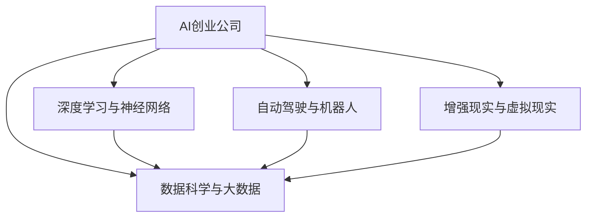

                 

# AI创业公司的发展方向

## 1. 背景介绍

在过去十年间，人工智能（AI）技术迅猛发展，推动了科技行业变革，催生了无数创新创业机会。AI公司如雨后春笋般涌现，从深度学习模型、机器学习算法到智能硬件，再到自然语言处理（NLP）和计算机视觉，各个领域均涌现出一大批领先企业。本文将深入探讨AI创业公司的发展方向，从核心技术到商业模式，分析其面临的机遇与挑战，展望未来发展趋势。

### 1.1 技术趋势

当前，AI创业公司正处于高速发展期，主要受以下技术趋势驱动：

- **深度学习与神经网络**：作为AI的核心技术，深度学习与神经网络已经广泛应用于图像识别、自然语言处理、语音识别等各个领域。
- **数据科学**：大数据与云计算技术的进步，为AI公司提供了海量的数据源与高效的计算资源。
- **自动驾驶与机器人**：自动驾驶与机器人技术日趋成熟，成为AI创业的新兴热点。
- **增强现实与虚拟现实**：AR/VR技术结合AI，为教育、娱乐、工业等领域带来革命性变化。

### 1.2 市场环境

AI创业公司不仅面临技术挑战，还需应对市场环境的复杂变化：

- **市场需求增长**：全球对AI技术的需求持续增长，特别是在医疗、金融、制造业等领域。
- **政策法规**：AI技术的快速发展也引发了诸多政策法规问题，包括数据隐私、算法透明度等。
- **资金竞争**：AI创业公司吸引了大量投资，但市场竞争也异常激烈。

## 2. 核心概念与联系

### 2.1 核心概念概述

理解AI创业公司的发展方向，首先需要掌握以下几个核心概念：

- **AI创业公司**：以AI技术为核心业务，旨在提供智能解决方案的公司。
- **深度学习与神经网络**：AI的核心技术，通过模拟人脑神经元工作方式实现复杂的模式识别与预测。
- **自动驾驶与机器人**：AI在交通、物流等领域的重要应用，是未来的潜在增长点。
- **增强现实与虚拟现实**：AR/VR技术与AI结合，为教育、娱乐、工业等领域带来革命性变化。
- **数据科学与大数据**：数据科学和大数据技术为AI提供强有力的数据支持，助力模型训练与优化。

这些概念之间的关系可以通过以下Mermaid流程图来展示：



这个流程图展示了AI创业公司与核心技术的关联性：

1. AI创业公司需要利用深度学习与神经网络技术开发产品。
2. 自动驾驶与机器人技术是AI的重要应用方向之一。
3. 增强现实与虚拟现实技术，结合AI能力，可以带来全新的应用场景。
4. 数据科学与大数据为AI提供数据支持，是实现AI技术的基础。

## 3. 核心算法原理 & 具体操作步骤

### 3.1 算法原理概述

AI创业公司依赖的核心算法包括深度学习、自然语言处理、计算机视觉、强化学习等。这些算法通过数据驱动，训练模型以完成特定任务。

以深度学习为例，其核心原理是通过多层神经网络对数据进行特征提取与分类。在训练过程中，模型通过反向传播算法不断优化自身参数，以最小化损失函数。

### 3.2 算法步骤详解

AI创业公司的算法步骤主要包括数据预处理、模型训练与优化、模型评估与部署。

**数据预处理**：包括数据清洗、特征提取、数据增强等步骤，确保数据质量与多样性。

**模型训练与优化**：采用合适的算法与优化器，如Adam、SGD等，进行模型训练，并通过正则化、Dropout等技术避免过拟合。

**模型评估与部署**：在测试集上评估模型性能，并将其部署到实际应用中，如移动应用、云服务、嵌入式系统等。

### 3.3 算法优缺点

深度学习等AI算法的优点在于能够处理大规模数据，自适应学习能力强，适用于复杂任务。但缺点包括训练时间长、计算资源需求大、模型复杂难以解释等。

### 3.4 算法应用领域

AI算法在各个领域都有广泛应用，包括：

- **医疗**：AI用于疾病诊断、药物研发、个性化医疗等。
- **金融**：AI用于信用评估、投资分析、风险管理等。
- **零售**：AI用于客户分析、库存管理、推荐系统等。
- **制造业**：AI用于质量控制、生产优化、供应链管理等。

## 4. 数学模型和公式 & 详细讲解

### 4.1 数学模型构建

深度学习模型通常采用多层神经网络结构，以实现复杂任务。以卷积神经网络（CNN）为例，其数学模型为：

$$
y = \sigma\left(\mathbf{W} \mathbf{x} + \mathbf{b}\right)
$$

其中，$y$ 为输出结果，$\sigma$ 为激活函数，$\mathbf{W}$ 为权重矩阵，$\mathbf{x}$ 为输入向量，$\mathbf{b}$ 为偏置向量。

### 4.2 公式推导过程

以反向传播算法为例，其推导过程如下：

$$
\frac{\partial \mathcal{L}}{\partial \mathbf{W}} = \frac{\partial \mathcal{L}}{\partial y} \frac{\partial y}{\partial \mathbf{x}} \frac{\partial \mathbf{x}}{\partial \mathbf{W}}
$$

其中，$\mathcal{L}$ 为损失函数，$\frac{\partial \mathcal{L}}{\partial y}$ 为损失函数对输出结果的梯度，$\frac{\partial y}{\partial \mathbf{x}}$ 为激活函数导数，$\frac{\partial \mathbf{x}}{\partial \mathbf{W}}$ 为权重矩阵的梯度。

### 4.3 案例分析与讲解

以图像识别为例，CNN模型通过卷积层提取特征，通过池化层减小数据维度，最终通过全连接层进行分类。在训练过程中，通过反向传播算法不断更新权重矩阵，以最小化损失函数。

## 5. 项目实践：代码实例和详细解释说明

### 5.1 开发环境搭建

AI创业公司的开发环境通常包括：

- **编程语言**：Python、C++等，Python因其强大的库支持而广泛使用。
- **深度学习框架**：TensorFlow、PyTorch、Keras等，TensorFlow因其强大的生态系统和性能优化而广泛应用。
- **数据处理工具**：Pandas、NumPy、Scikit-learn等，用于数据预处理、特征提取等。

### 5.2 源代码详细实现

以下是一个简单的图像分类项目代码实现：

```python
import tensorflow as tf
from tensorflow.keras import datasets, layers, models

# 加载数据集
(train_images, train_labels), (test_images, test_labels) = datasets.cifar10.load_data()

# 归一化数据
train_images, test_images = train_images / 255.0, test_images / 255.0

# 定义模型
model = models.Sequential([
    layers.Conv2D(32, (3, 3), activation='relu', input_shape=(32, 32, 3)),
    layers.MaxPooling2D((2, 2)),
    layers.Conv2D(64, (3, 3), activation='relu'),
    layers.MaxPooling2D((2, 2)),
    layers.Conv2D(64, (3, 3), activation='relu'),
    layers.Flatten(),
    layers.Dense(64, activation='relu'),
    layers.Dense(10)
])

# 编译模型
model.compile(optimizer='adam',
              loss=tf.keras.losses.SparseCategoricalCrossentropy(from_logits=True),
              metrics=['accuracy'])

# 训练模型
model.fit(train_images, train_labels, epochs=10, 
          validation_data=(test_images, test_labels))
```

### 5.3 代码解读与分析

代码中，我们使用TensorFlow实现了一个简单的卷积神经网络，用于CIFAR-10数据集的图像分类任务。具体步骤如下：

1. 加载数据集并归一化数据。
2. 定义模型，包括卷积层、池化层、全连接层等。
3. 编译模型，设置优化器、损失函数和评估指标。
4. 训练模型，设置训练轮数和验证数据集。

## 6. 实际应用场景

### 6.1 医疗领域

AI在医疗领域的应用潜力巨大，涉及疾病诊断、药物研发、个性化医疗等。AI可以分析医学影像、电子病历等数据，辅助医生进行诊断和治疗决策。例如，深度学习模型可以用于医学影像分类、病理切片分析等。

### 6.2 金融领域

AI在金融领域的应用包括信用评估、投资分析、风险管理等。通过分析海量金融数据，AI可以预测市场趋势、识别潜在风险，为金融机构提供决策支持。例如，深度学习模型可以用于股票价格预测、信用评分等。

### 6.3 零售领域

AI在零售领域的应用包括客户分析、库存管理、推荐系统等。通过分析用户行为数据，AI可以提供个性化推荐，优化库存管理，提升销售额。例如，深度学习模型可以用于推荐系统、用户行为分析等。

### 6.4 未来应用展望

未来，AI在自动驾驶、增强现实、虚拟现实等领域的应用前景广阔。例如，自动驾驶技术可以带来更安全的交通出行方式，增强现实和虚拟现实技术可以改变教育、娱乐和工业的形态。

## 7. 工具和资源推荐

### 7.1 学习资源推荐

以下是一些优秀的学习资源，有助于理解AI创业公司的核心技术和商业模式：

1. **《深度学习》（Ian Goodfellow等）**：该书系统介绍了深度学习的基本概念和应用，是深度学习领域的经典教材。
2. **《Python机器学习》（Sebastian Raschka）**：该书详细介绍了机器学习的算法和应用，是Python机器学习开发的入门指南。
3. **《动手学深度学习》**：由李沐等作者编写，提供了丰富的深度学习实践案例。
4. **Coursera《深度学习专项课程》**：由斯坦福大学Andrew Ng教授主讲，涵盖深度学习的基本理论与实践。
5. **Kaggle竞赛平台**：提供大量数据集和竞赛项目，有助于实践和提升AI技能。

### 7.2 开发工具推荐

以下是一些优秀的开发工具，有助于提升AI创业公司的开发效率：

1. **Jupyter Notebook**：免费的Python开发环境，支持多平台运行。
2. **PyCharm**：强大的Python IDE，提供代码自动补全、调试等功能。
3. **Visual Studio Code**：轻量级的代码编辑器，支持多语言开发。
4. **Git**：版本控制系统，支持代码协同开发和版本管理。
5. **Docker**：容器化技术，有助于部署和管理AI模型。

### 7.3 相关论文推荐

以下是一些具有影响力的相关论文，有助于深入理解AI创业公司的发展方向：

1. **ImageNet Classification with Deep Convolutional Neural Networks**：由Alex Krizhevsky等作者发表，提出了卷积神经网络（CNN）模型，在图像分类任务上取得了优异成绩。
2. **Deep Residual Learning for Image Recognition**：由Kaiming He等作者发表，提出了残差网络（ResNet）模型，进一步提升了图像分类的精度。
3. **Attention is All You Need**：由Ashish Vaswani等作者发表，提出了Transformer模型，革新了自然语言处理领域。
4. **BERT: Pre-training of Deep Bidirectional Transformers for Language Understanding**：由Jacob Devlin等作者发表，提出了BERT模型，提升了语言模型的效果。
5. **AlphaGo Zero**：由David Silver等作者发表，提出了AlphaGo Zero算法，在围棋领域取得了重大突破。

## 8. 总结：未来发展趋势与挑战

### 8.1 研究成果总结

AI创业公司自诞生以来，已经取得了一系列重要的研究成果和应用突破。从深度学习、自然语言处理到自动驾驶，AI技术正在深刻改变各个行业。

### 8.2 未来发展趋势

未来，AI创业公司的发展趋势包括：

1. **技术融合**：AI技术将与物联网、5G、量子计算等技术深度融合，提升AI系统的性能和应用范围。
2. **行业应用**：AI将进一步应用于医疗、金融、制造等各个领域，推动行业数字化转型。
3. **智能化升级**：AI系统将逐步实现智能化升级，具备更高的自主决策和适应能力。
4. **数据驱动**：AI的发展将越来越依赖于大规模数据，数据驱动的AI系统将更具有竞争力。
5. **伦理与安全**：AI技术的伦理与安全问题将受到更多关注，需要建立相应的监管机制。

### 8.3 面临的挑战

AI创业公司面临的挑战包括：

1. **技术瓶颈**：AI模型的复杂性带来了技术实现的挑战，需要更多技术突破和创新。
2. **数据隐私**：AI系统的训练和应用需要大量的数据，但数据隐私和安全问题不容忽视。
3. **成本问题**：AI模型的训练和部署需要高昂的计算资源和成本，需要更加高效的经济模型。
4. **伦理道德**：AI系统的应用可能带来伦理和道德问题，如偏见、歧视等，需要建立相应的监管机制。
5. **人机协同**：AI系统的智能化升级需要与人类进行更加紧密的协同，提升系统的用户体验和安全性。

### 8.4 研究展望

未来，AI创业公司需要在以下方面进行深入研究：

1. **高效模型训练**：提升模型的训练效率和性能，降低计算成本。
2. **智能算法优化**：开发更加智能化的算法，提升AI系统的自主决策能力。
3. **数据质量保障**：提升数据质量，确保数据的准确性和安全性。
4. **伦理与法律**：建立AI技术的伦理与安全规范，推动AI技术健康发展。
5. **跨领域应用**：推动AI技术在更多领域的应用，拓展AI技术的边界。

## 9. 附录：常见问题与解答

**Q1：如何构建高效的AI创业公司？**

A: 构建高效的AI创业公司需要：

1. **明确战略**：明确公司的核心业务和发展方向。
2. **招募人才**：招募具有行业背景和AI技术能力的优秀人才。
3. **重视数据**：注重数据的质量和安全性，建立数据管理机制。
4. **研发投入**：加大研发投入，持续创新，提升技术竞争力。
5. **市场需求**：深入了解市场需求，设计符合用户需求的AI产品。

**Q2：AI创业公司如何提升团队效率？**

A: 提升团队效率需要：

1. **工具支持**：使用高效的开发工具和平台，提升开发效率。
2. **流程优化**：优化项目管理流程，提高团队协作效率。
3. **知识共享**：建立知识共享平台，促进团队学习和创新。
4. **文化建设**：营造积极向上的企业文化，提升团队凝聚力。
5. **绩效管理**：建立科学的绩效管理体系，激励团队成员。

**Q3：AI创业公司如何应对市场竞争？**

A: 应对市场竞争需要：

1. **创新突破**：不断进行技术创新，提升产品竞争力。
2. **市场定位**：明确市场定位，找准目标用户群。
3. **品牌建设**：建立品牌知名度，提升市场影响力。
4. **合作联盟**：与其他公司建立战略合作，共同开拓市场。
5. **客户服务**：提供优质的客户服务，提升用户满意度。

**Q4：AI创业公司如何确保数据隐私和安全？**

A: 确保数据隐私和安全需要：

1. **数据管理**：建立数据管理机制，确保数据安全和隐私。
2. **合规性**：遵循相关法律法规，确保数据处理合规。
3. **加密技术**：使用加密技术，保护数据传输和存储安全。
4. **访问控制**：建立访问控制机制，限制数据访问权限。
5. **审计与监控**：建立审计和监控机制，及时发现并处理数据安全问题。

---

作者：禅与计算机程序设计艺术 / Zen and the Art of Computer Programming

