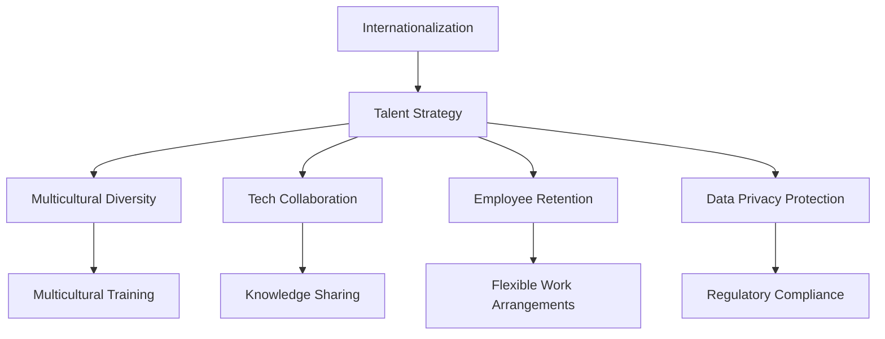

                 

# AI创业公司的国际化人才策略设计

> 关键词：国际化,人才策略,创业公司,招聘,多元文化,技术合作,员工培训,人才保留

## 1. 背景介绍

### 1.1 问题由来
近年来，随着人工智能技术的快速发展和全球化的深入推进，越来越多的AI创业公司希望扩展其国际市场，以期在全球范围内实现商业成功。然而，国际化进程中的人才挑战成为了一道亟待解决的难题。如何在多元文化背景下招聘、培养和保留人才，构建高效、协作的国际化团队，成为了AI创业公司国际化扩张的关键。

### 1.2 问题核心关键点
国际化人才策略设计涉及多个关键环节，包括但不限于：

1. **多元化招聘**：在全球范围内吸引和选拔具有多样化背景的优秀人才。
2. **跨文化培训**：通过培训提升团队成员对不同文化背景的理解和适应能力。
3. **技术合作**：建立国际合作伙伴关系，共享技术资源和市场机会。
4. **员工保留**：通过灵活的工作安排和良好的工作环境，提高员工的归属感和满意度。
5. **数据隐私保护**：确保在国际化运营中遵守各国的数据隐私法规。

## 2. 核心概念与联系

### 2.1 核心概念概述

为更好地理解AI创业公司的国际化人才策略设计，本节将介绍几个关键概念：

- **国际化（Internationalization）**：指公司将其产品、服务和业务扩展到国际市场，以实现全球化的运营和发展。
- **人才策略（Talent Strategy）**：指公司如何吸引、培养、保留和激励人才，以支持业务目标的实现。
- **创业公司（Startup）**：指初创阶段的企业，通常具有高风险和高速发展的特点。
- **多元化（Diversity）**：指团队成员在性别、种族、年龄、文化背景等方面的多样性。
- **跨文化（Inter-Cultural）**：指在不同文化背景下进行沟通和协作，处理文化差异带来的挑战。
- **技术合作（Technical Collaboration）**：指与其他公司或研究机构在技术层面的合作和交流。
- **员工保留（Employee Retention）**：指通过各种措施保持员工长期服务于公司。
- **数据隐私保护（Data Privacy Protection）**：指在收集、存储和使用数据时，遵守相关法律法规，保护个人隐私。

这些概念之间的逻辑关系可以通过以下Mermaid流程图来展示：



这个流程图展示了国际化人才策略的核心概念及其之间的关系：

1. 国际化是目标，驱动人才策略的制定和实施。
2. 人才策略涉及多元化、跨文化培训、技术合作、员工保留、数据隐私保护等多个方面。
3. 各策略之间相互支持，共同构成了一个完整的国际化人才策略体系。

## 3. 核心算法原理 & 具体操作步骤
### 3.1 算法原理概述

AI创业公司的国际化人才策略设计，本质上是针对公司内部的跨文化团队管理问题，通过一系列有针对性的策略和措施，确保团队的协同和高效工作。其核心思想是：

- **吸引全球人才**：通过多元化的招聘渠道和有吸引力的福利政策，吸引全球顶尖人才。
- **提升跨文化沟通**：通过跨文化培训和团队建设活动，提升团队成员的文化敏感性和协作能力。
- **促进技术创新**：通过建立国际合作伙伴关系，共享技术资源，推动技术创新。
- **提高员工满意度**：通过灵活的工作安排和良好的工作环境，提高员工的归属感和满意度。
- **保障数据安全**：通过严格的数据隐私保护措施，确保在国际业务运营中遵守各国法律法规。

### 3.2 算法步骤详解

基于上述核心思想，国际化人才策略设计通常包括以下关键步骤：

**Step 1: 制定国际化战略**

- 明确公司的国际化目标和方向。
- 识别目标市场和潜在客户群体。
- 分析市场竞争环境，确定差异化的竞争策略。

**Step 2: 多元化招聘**

- 在多个国家和文化背景中发布招聘信息。
- 利用全球人才招聘平台，如LinkedIn、Indeed等，吸引更多优秀人才。
- 设计多样化的面试流程，包括视频面试、跨文化评估等。

**Step 3: 跨文化培训**

- 开发跨文化培训课程，涵盖文化背景、沟通技巧、团队协作等方面。
- 组织团队建设活动，增进成员间的理解和信任。
- 设立跨文化导师制度，帮助新员工适应新环境。

**Step 4: 技术合作**

- 寻找并建立国际合作伙伴关系，共同开发新产品或技术。
- 参与国际技术论坛和研讨会，交流最新研究成果。
- 共享数据和模型，推动技术创新。

**Step 5: 员工保留**

- 提供灵活的工作安排，如远程办公、弹性工作时间等。
- 设计有竞争力的薪酬和福利体系，包括股票期权、医疗保险等。
- 设立员工发展计划，提供职业培训和发展机会。

**Step 6: 数据隐私保护**

- 制定数据隐私保护政策，确保数据收集、存储和使用的合法合规。
- 引入技术手段，如数据加密、访问控制等，保障数据安全。
- 定期进行隐私风险评估，更新保护措施。

### 3.3 算法优缺点

国际化人才策略设计具有以下优点：

1. **提升公司竞争力**：通过多元化的人才和跨文化协作，提升公司的创新能力和市场适应性。
2. **丰富知识资源**：来自不同文化背景的团队成员能够带来多样化的知识和经验，促进技术创新。
3. **增强品牌影响力**：国际化的团队能够在全球范围内提升公司的品牌知名度和市场份额。
4. **提高员工满意度**：通过灵活的工作安排和良好的福利政策，提升员工的幸福感和忠诚度。

同时，该方法也存在一定的局限性：

1. **管理复杂性增加**：跨国团队的协调和管理比本地团队更为复杂，需要更高的管理能力和技术支持。
2. **文化冲突风险**：不同文化背景的成员可能存在价值观、工作习惯等方面的差异，管理不当可能导致冲突。
3. **成本增加**：国际化人才策略设计需要投入更多资源，包括招聘、培训、技术合作等。
4. **数据隐私保护难度大**：需要同时遵循多个国家和地区的隐私法规，增加数据保护工作的复杂性。

尽管存在这些局限性，但国际化人才策略设计仍然是AI创业公司在全球化进程中不可或缺的一部分。通过科学设计和有效执行，可以有效克服管理挑战，充分发挥国际化人才的优势，推动公司发展。

### 3.4 算法应用领域

国际化人才策略设计在AI创业公司的国际化扩张中具有广泛的应用场景，如：

- **国际业务拓展**：在海外市场设立分支机构或办事处，需要招聘和培训国际化的团队。
- **技术研发合作**：与国际知名的研究机构和企业合作，进行联合研发和技术创新。
- **市场营销**：在国际市场上推广产品和服务，需要跨文化营销团队。
- **客户支持**：在海外提供客户支持和服务，需要熟悉当地语言和文化的客服团队。

## 4. 数学模型和公式 & 详细讲解 & 举例说明（备注：数学公式请使用latex格式，latex嵌入文中独立段落使用 $$，段落内使用 $)
### 4.1 数学模型构建

本节将使用数学语言对AI创业公司的国际化人才策略设计过程进行更加严格的刻画。

设公司需要在$n$个不同国家的市场中招聘员工，每个国家有$m$种职位需求。每个职位的理想人数为$x_i$，实际招聘人数为$y_i$。设$x_i$和$y_i$满足线性规划模型：

$$
\begin{aligned}
& \text{Minimize} \quad \sum_{i=1}^{n} c_i y_i \\
& \text{Subject to} \\
& \sum_{i=1}^{n} a_{ij} y_i \geq b_j, \quad j=1,2,\ldots,m \\
& y_i \geq 0, \quad i=1,2,\ldots,n
\end{aligned}
$$

其中，$c_i$为每个职位的招聘成本，$a_{ij}$和$b_j$为职位需求和实际招聘人数之间的关系。

### 4.2 公式推导过程

以下是线性规划模型的推导过程：

1. **目标函数**：最小化总招聘成本，即$\sum_{i=1}^{n} c_i y_i$。
2. **约束条件**：确保每个职位实际招聘人数不小于理想人数，即$\sum_{i=1}^{n} a_{ij} y_i \geq b_j$。

通过优化目标函数和约束条件，可以找到最优的招聘策略。

### 4.3 案例分析与讲解

假设一家AI创业公司在A国、B国和C国设立分支机构，需要招聘软件工程师、产品经理和市场经理三种职位。每种职位的理想人数和实际招聘人数如下：

| 职位     | A国 | B国 | C国 |
| -------- | --- | --- | --- |
| 软件工程师 | 10  | 8   | 12  |
| 产品经理  | 8   | 6   | 10  |
| 市场经理  | 6   | 8   | 10  |
| 实际招聘 | 10  | 8   | 12  |

招聘成本$c_i$如下：

| 职位     | 招聘成本 |
| -------- | -------- |
| 软件工程师 | $50,000$ |
| 产品经理  | $60,000$ |
| 市场经理  | $70,000$ |

职位需求和实际招聘人数之间的关系为：

| 职位     | 需求人数 |
| -------- | -------- |
| 软件工程师 | 5       |
| 产品经理  | 4       |
| 市场经理  | 4       |

根据上述数据，可以构建如下线性规划模型：

$$
\begin{aligned}
& \text{Minimize} \quad 50,000 y_{A软} + 60,000 y_{B产} + 70,000 y_{C市} \\
& \text{Subject to} \\
& 10 y_{A软} + 8 y_{B产} + 12 y_{C市} \geq 5 \\
& 8 y_{A软} + 6 y_{B产} + 10 y_{C市} \geq 4 \\
& 6 y_{A软} + 8 y_{B产} + 10 y_{C市} \geq 4 \\
& y_{A软} \geq 0 \\
& y_{B产} \geq 0 \\
& y_{C市} \geq 0
\end{aligned}
$$

通过求解该线性规划模型，可以得到最优的招聘策略。

## 5. 项目实践：代码实例和详细解释说明
### 5.1 开发环境搭建

在进行国际化人才策略设计项目实践前，我们需要准备好开发环境。以下是使用Python进行Pandas开发的环境配置流程：

1. 安装Anaconda：从官网下载并安装Anaconda，用于创建独立的Python环境。

2. 创建并激活虚拟环境：
```bash
conda create -n talent-env python=3.8 
conda activate talent-env
```

3. 安装Pandas：
```bash
conda install pandas
```

4. 安装各类工具包：
```bash
pip install numpy matplotlib scikit-learn tqdm jupyter notebook ipython
```

完成上述步骤后，即可在`talent-env`环境中开始项目实践。

### 5.2 源代码详细实现

这里我们以线性规划模型为例，给出使用Pandas库进行招聘策略优化的PyTorch代码实现。

首先，定义问题参数：

```python
import pandas as pd

# 职位需求和实际招聘人数
jobs = pd.DataFrame({
    'Country': ['A', 'B', 'C'],
    'Job': ['软件工程师', '产品经理', '市场经理'],
    'Desired': [10, 8, 6],
    'Actual': [10, 8, 12]
})

# 招聘成本
costs = pd.Series([50000, 60000, 70000], index=jobs['Job'])

# 职位需求和实际招聘人数之间的关系
requirements = pd.DataFrame({
    'Country': ['A', 'B', 'C'],
    'Job': ['软件工程师', '产品经理', '市场经理'],
    'Required': [5, 4, 4]
})
```

然后，构建线性规划模型：

```python
from scipy.optimize import linprog

# 构建约束矩阵
constraints = pd.DataFrame({
    'Country': ['A', 'B', 'C'],
    'Job': ['软件工程师', '产品经理', '市场经理'],
    'Constraint': [10, 8, 12, 8, 6, 10, 6, 8, 10]
})

# 目标函数系数
objective = [-50000, -60000, -70000]

# 求解线性规划模型
result = linprog(c=objective, A_eq=constraints.values, b_eq=requirements.values)
```

最后，输出最优的招聘策略：

```python
print("最优解：")
print(jobs.loc[result.x > 0, :])
print("总成本：", result.fun)
```

以上就是使用Pandas库对招聘策略进行优化的完整代码实现。可以看到，通过Pandas库，我们可以简洁高效地构建和求解线性规划模型，得到最优的招聘策略。

### 5.3 代码解读与分析

让我们再详细解读一下关键代码的实现细节：

**jobs变量**：
- 定义职位、国家和需求人数。
- 根据实际招聘人数进行筛选，保留满足需求条件的职位。

**costs变量**：
- 定义每种职位的招聘成本。

**requirements变量**：
- 定义职位需求和实际招聘人数之间的关系。

**constraints变量**：
- 构建约束矩阵，包括职位需求、实际招聘人数和需求人数之间的关系。

**objective变量**：
- 定义目标函数系数，即每种职位的招聘成本。

**linprog函数**：
- 使用scipy库的linprog函数求解线性规划模型，得到最优的招聘策略。

**result变量**：
- 存储求解结果，包括最优解和总成本。

通过以上代码，我们可以高效地求解最优的招聘策略，从而提升公司的招聘效率和成本控制能力。

## 6. 实际应用场景
### 6.1 国际业务拓展

在AI创业公司国际化业务拓展过程中，需要招聘熟悉当地市场和文化背景的国际化人才。通过跨文化培训和团队建设，提升团队成员的文化敏感性和协作能力，确保在国际市场上的顺利运营。

具体而言，可以设计针对性的跨文化培训课程，涵盖不同文化背景下的商务礼仪、沟通技巧、法律规范等。同时，设立跨文化导师制度，为新员工提供指导和支持，帮助其快速适应新环境。

### 6.2 技术研发合作

与国际知名研究机构和企业进行技术合作，是AI创业公司推动技术创新和市场扩张的重要途径。通过共享数据和模型，进行联合研发和技术攻关，能够加速新产品的开发和应用。

例如，一家AI创业公司可以与欧洲的顶尖研究机构合作，共享其在自然语言处理和计算机视觉方面的研究成果，共同开发下一代智能推荐系统。通过技术合作，不仅可以降低研发成本，还能获得更多的创新资源和技术支持。

### 6.3 市场营销

在国际市场上推广产品和服务，需要跨文化营销团队的支持。通过多元化的市场策略和本地化的营销活动，可以有效提升产品在国际市场的知名度和美誉度。

具体而言，可以组建本地化的营销团队，利用其对当地市场和文化的了解，制定有针对性的市场推广计划。同时，通过跨文化培训提升团队的文化敏感性，确保市场营销活动顺利进行。

### 6.4 客户支持

在海外提供客户支持和服务，需要熟悉当地语言和文化的客服团队。通过招聘具有国际背景的客服人员，可以更好地满足海外客户的需求，提升客户满意度。

具体而言，可以设立跨文化客服团队，为海外客户提供多语言支持。同时，通过定期培训提升客服团队的文化敏感性和沟通能力，确保客户服务的高效和高质量。

### 6.5 未来应用展望

随着AI创业公司的国际化进程不断推进，基于国际化人才策略设计的相关技术将进一步发展和完善。未来，我们可以预见到以下几个趋势：

1. **自动化招聘系统**：通过人工智能技术，自动化招聘流程，提升招聘效率和准确性。
2. **智能培训平台**：利用大数据和机器学习技术，开发智能培训平台，提供个性化的跨文化培训内容。
3. **远程团队协作**：通过先进的协作工具和技术，实现跨国团队的实时协作和高效沟通。
4. **全球数据治理**：建立全球数据治理框架，确保数据的安全和合规，促进国际业务的发展。

## 7. 工具和资源推荐
### 7.1 学习资源推荐

为了帮助开发者系统掌握国际化人才策略设计的相关知识，这里推荐一些优质的学习资源：

1. **《全球人才管理》（Global Talent Management）**：由知名管理学者编写的书籍，详细介绍了全球化背景下的招聘、培训和保留人才策略。

2. **LinkedIn Learning**：LinkedIn推出的在线学习平台，提供各类跨文化沟通、团队协作等课程，帮助你提升国际化管理能力。

3. **Coursera**：由斯坦福大学等顶尖学府开设的在线课程，涵盖多元文化管理、国际市场营销等方面的知识。

4. **Scipy官方文档**：scipy库的官方文档，提供了丰富的线性规划和优化算法，适用于项目实践和深入学习。

5. **Pandas官方文档**：Pandas库的官方文档，提供了详细的函数和方法，适用于数据处理和模型优化。

通过对这些资源的学习实践，相信你一定能够快速掌握国际化人才策略设计的精髓，并用于解决实际的国际化管理问题。

### 7.2 开发工具推荐

高效的开发离不开优秀的工具支持。以下是几款用于国际化人才策略设计开发的常用工具：

1. **Jupyter Notebook**：开源的交互式笔记本环境，支持Python和Pandas等语言的编写和运行。

2. **GitHub**：全球最大的代码托管平台，支持版本控制和协作开发，方便团队管理代码和文档。

3. **Scrapy**：Python的开源爬虫框架，用于爬取全球招聘信息，提升招聘效率。

4. **Tableau**：强大的数据可视化工具，用于生成跨文化培训和招聘报告，提升决策支持能力。

5. **Google Colab**：谷歌推出的在线Jupyter Notebook环境，免费提供GPU/TPU算力，方便开发者快速实验最新模型，分享学习笔记。

合理利用这些工具，可以显著提升国际化人才策略设计的开发效率，加快创新迭代的步伐。

### 7.3 相关论文推荐

国际化人才策略设计的研究源于学界的持续研究。以下是几篇奠基性的相关论文，推荐阅读：

1. **《国际团队管理：理论和实践》（International Team Management: Theory and Practice）**：详细介绍了国际团队管理的理论基础和实践方法，对国际化人才策略设计具有重要参考价值。

2. **《多元文化组织：理论、方法和案例》（Multicultural Organizations: Theory, Methods and Cases）**：从理论、方法和实际案例多个角度，探讨了多元文化背景下组织管理的问题和解决方案。

3. **《全球人才管理：实践指南》（Global Talent Management: A Practical Guide）**：提供了一系列实用的国际化人才管理工具和策略，帮助企业提升国际化运营能力。

这些论文代表了大语言模型微调技术的发展脉络。通过学习这些前沿成果，可以帮助研究者把握学科前进方向，激发更多的创新灵感。

## 8. 总结：未来发展趋势与挑战
### 8.1 总结

本文对AI创业公司的国际化人才策略设计进行了全面系统的介绍。首先阐述了国际化人才策略设计的背景和重要性，明确了其在全球化进程中的关键作用。其次，从原理到实践，详细讲解了国际化人才策略设计的数学模型和操作步骤，给出了具体的应用实例和代码实现。同时，本文还广泛探讨了国际化人才策略在多个行业领域的应用前景，展示了其广阔的应用潜力。此外，本文精选了相关学习资源和开发工具，力求为读者提供全方位的技术指引。

通过本文的系统梳理，可以看到，国际化人才策略设计是AI创业公司实现国际化扩张的重要保障。通过科学设计和有效执行，可以有效克服国际化管理中的各种挑战，充分发挥国际化人才的优势，推动公司发展。

### 8.2 未来发展趋势

展望未来，国际化人才策略设计将呈现以下几个发展趋势：

1. **自动化和智能化**：随着人工智能技术的不断发展，自动化招聘和智能培训平台将得到广泛应用，提升人才策略设计的效率和准确性。
2. **跨文化交流**：跨文化沟通和协作将成为国际化管理的重要组成部分，将进一步提升团队的文化敏感性和协作能力。
3. **全球数据治理**：建立全球数据治理框架，确保数据的安全和合规，将成为国际化业务的重要保障。
4. **混合工作模式**：灵活的工作安排和混合工作模式，将成为国际化团队管理的重要方向，提升员工的满意度和生产力。
5. **本地化市场推广**：本地化的市场推广策略，将成为国际市场拓展的关键，提升产品的市场竞争力。

这些趋势凸显了国际化人才策略设计的广阔前景。这些方向的探索发展，必将进一步提升AI创业公司的国际化管理水平，推动公司走向全球化。

### 8.3 面临的挑战

尽管国际化人才策略设计已经取得了瞩目成就，但在迈向更加智能化、普适化应用的过程中，它仍面临着诸多挑战：

1. **文化差异管理**：不同文化背景的成员可能存在价值观、工作习惯等方面的差异，管理不当可能导致冲突。
2. **语言障碍**：语言沟通不畅将影响团队的协作效率和信息交流，需要提供多语言支持。
3. **数据隐私保护**：在国际化运营中，需要遵守多个国家和地区的隐私法规，增加数据保护工作的复杂性。
4. **技术合作复杂**：跨国合作涉及不同的技术标准和知识产权问题，协调难度大。
5. **员工归属感**：跨国团队的成员可能面临文化隔离和归属感不足的问题，需要通过灵活的工作安排和团队建设活动加以解决。

尽管存在这些挑战，但国际化人才策略设计仍然是AI创业公司在全球化进程中不可或缺的一部分。通过科学设计和有效执行，可以有效克服管理挑战，充分发挥国际化人才的优势，推动公司发展。

### 8.4 研究展望

面对国际化人才策略设计所面临的挑战，未来的研究需要在以下几个方面寻求新的突破：

1. **跨文化沟通机制**：研究和设计更有效的跨文化沟通机制，减少文化冲突，提升团队协作效率。
2. **灵活工作安排**：开发智能化的工作安排工具，根据员工的地理位置和工作负荷，自动优化工作安排。
3. **全球数据治理框架**：建立全球数据治理框架，确保数据的安全和合规，提升数据治理能力。
4. **本地化市场推广**：研究本地化市场推广策略，提升产品在全球市场的竞争力。
5. **数据隐私保护技术**：开发先进的隐私保护技术，确保在国际化运营中遵守各国的隐私法规。

这些研究方向的探索，必将引领国际化人才策略设计技术迈向更高的台阶，为AI创业公司提供更加科学和高效的管理手段，推动国际化进程。总之，通过不断创新和优化，国际化人才策略设计必将在全球化进程中发挥更大的作用，助力AI创业公司实现可持续发展。

## 9. 附录：常见问题与解答

**Q1：国际化人才策略设计是否适用于所有类型的AI创业公司？**

A: 国际化人才策略设计适用于在全球化进程中希望扩展业务的AI创业公司。但需要注意的是，对于小型初创公司，由于资源和能力有限，可能无法立即实施复杂的人才策略设计。建议根据自身实际情况，逐步推进国际化人才策略设计，分阶段实现国际化目标。

**Q2：如何评估国际化人才策略的效果？**

A: 评估国际化人才策略的效果可以从以下几个方面入手：
1. 团队绩效：通过分析团队的工作效率和任务完成情况，评估策略的效果。
2. 员工满意度：通过调查问卷和员工访谈，了解员工对工作环境、文化适应度等方面的满意度。
3. 客户反馈：通过客户满意度调查和市场反馈，评估产品在国际市场的影响力和竞争力。
4. 成本效益：分析人才策略设计在招聘、培训、合作等方面的成本和效益，确保策略的可持续性。

**Q3：如何应对文化差异带来的管理挑战？**

A: 应对文化差异带来的管理挑战，可以通过以下措施：
1. 跨文化培训：设计跨文化培训课程，提升团队成员的文化敏感性和协作能力。
2. 多元文化团队：组建多元文化团队，通过成员间的文化交流，增进理解和信任。
3. 文化适应计划：为国际员工提供文化适应计划，帮助其更快地融入新环境。
4. 文化大使：设立文化大使，在团队中起到桥梁作用，帮助解决文化冲突。

**Q4：如何确保数据隐私保护在国际化运营中的合规性？**

A: 确保数据隐私保护在国际化运营中的合规性，需要：
1. 了解各国隐私法规：熟悉各国的隐私法规和数据保护标准，确保数据收集、存储和使用符合法律要求。
2. 数据加密技术：采用数据加密技术，确保数据在传输和存储过程中的安全。
3. 访问控制机制：建立访问控制机制，确保只有授权人员才能访问敏感数据。
4. 定期合规审查：定期进行隐私风险评估和合规审查，更新和优化隐私保护措施。

**Q5：如何设计有效的跨文化培训课程？**

A: 设计有效的跨文化培训课程，需要：
1. 确定培训目标：明确培训的目的是提升文化敏感性、沟通技巧、团队协作等。
2. 设计培训内容：涵盖文化背景、沟通技巧、法律规范等方面，具体包括语言文化、商务礼仪、法律法规等。
3. 采用互动式教学：通过模拟场景、角色扮演等互动式教学方法，提升培训效果。
4. 定期反馈和评估：定期收集培训反馈和评估结果，不断改进和优化培训内容。

通过以上措施，可以设计出效果显著的跨文化培训课程，提升团队的文化敏感性和协作能力。

---

作者：禅与计算机程序设计艺术 / Zen and the Art of Computer Programming

