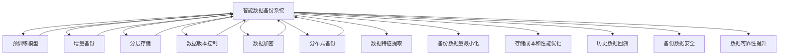

                 

# AI创业公司的数据备份策略

## 1. 背景介绍

### 1.1 问题由来
在当今的数字化时代，数据成为了企业的核心资产之一。随着AI技术的快速发展，AI创业公司在依赖数据进行模型训练、优化和部署的过程中，如何高效、安全地管理数据，特别是数据备份策略，显得尤为重要。

数据备份不仅是为了防止数据丢失，也是为了保证在数据意外损坏或网络攻击下，AI模型的持续稳定运行。一个良好的数据备份策略，可以确保公司能够在各种突发情况下迅速恢复数据，减少业务中断，降低损失。

然而，传统的备份策略，如全量备份和增量备份，往往耗时耗力，且备份数据量巨大，对存储资源和网络带宽都提出了较高的要求。因此，本文将介绍一种新兴的备份策略——智能数据备份，旨在通过先进的算法和工具，为AI创业公司提供更加高效、安全的数据备份方案。

## 2. 核心概念与联系

### 2.1 核心概念概述

- **智能数据备份**：一种新兴的数据备份策略，结合先进算法和现代技术，通过对数据的精细分析和管理，实现高效、安全的备份和恢复。

- **预训练模型**：在大量数据上预先训练好的模型，用于进行数据特征提取和分析。

- **增量备份**：仅备份数据的变化部分，而非全量备份，以节省存储和网络资源。

- **分层存储**：将数据存储在多个层次的存储介质上，如SSD、HDD、磁带等，以兼顾成本和性能。

- **数据版本控制**：记录数据的多个版本，便于回溯和恢复。

- **数据加密**：对备份数据进行加密，防止数据泄露和未经授权的访问。

- **分布式备份**：将数据备份到多个地点，提高数据的可靠性和安全性。

### 2.2 核心概念原理和架构的 Mermaid 流程图



这个流程图展示了一个智能数据备份系统的核心组件及其工作流程：

1. 预训练模型接收原始数据作为输入，提取数据特征。
2. 增量备份只备份数据的变化部分，最小化备份数据量。
3. 分层存储根据数据重要性分配存储空间，优化成本和性能。
4. 数据版本控制记录数据的历史版本，便于回溯。
5. 数据加密保护备份数据的隐私和安全。
6. 分布式备份将数据存储在多个地点，提升可靠性。
7. 数据特征提取用于分类和分析备份数据。

这些组件协同工作，共同构成了一个高效、安全的数据备份系统。

## 3. 核心算法原理 & 具体操作步骤

### 3.1 算法原理概述

智能数据备份系统基于以下算法原理：

- **增量备份算法**：只备份数据的变化部分，而非全量备份。通过计算当前数据与上一个备份版本的差异，减少备份数据量。

- **分层存储算法**：将数据根据其重要性和访问频率分配到不同层次的存储介质上，如SSD、HDD、磁带等，以优化成本和性能。

- **数据版本控制算法**：记录数据的多个版本，便于在数据损坏或误删的情况下进行回溯和恢复。

- **数据加密算法**：对备份数据进行加密，防止数据泄露和未经授权的访问。

- **分布式备份算法**：将数据备份到多个地点，提高数据的可靠性和安全性。

### 3.2 算法步骤详解

智能数据备份系统的具体操作步骤如下：

1. **数据收集与预处理**：收集所有需要备份的数据，并进行预处理，如去重、格式转换等。

2. **特征提取与分类**：使用预训练模型对数据进行特征提取，并根据特征的重要性进行分类。

3. **增量备份**：计算当前数据与上一个备份版本的差异，只备份数据的变化部分。

4. **分层存储**：根据数据的重要性和访问频率，分配到不同层次的存储介质上，如SSD、HDD、磁带等。

5. **数据版本控制**：记录数据的多个版本，便于回溯和恢复。

6. **数据加密**：对备份数据进行加密，防止数据泄露和未经授权的访问。

7. **分布式备份**：将数据备份到多个地点，提高数据的可靠性和安全性。

8. **定期检查与更新**：定期检查备份数据的完整性和可用性，根据需要更新备份版本。

### 3.3 算法优缺点

智能数据备份系统的优点包括：

- **高效性**：通过增量备份和分层存储，备份数据量最小化，节省存储空间和网络带宽。
- **安全性**：数据加密和分布式备份提高了数据的安全性和可靠性。
- **灵活性**：数据版本控制和定期检查与更新，使得数据备份策略更加灵活和可控。

缺点包括：

- **复杂性**：算法实现较为复杂，需要综合考虑数据特征、存储成本、访问频率等多个因素。
- **初始成本高**：预训练模型的训练和部署需要较高的初始投入。
- **技术门槛高**：需要具备一定的数据管理、算法设计和系统集成能力。

### 3.4 算法应用领域

智能数据备份系统广泛应用于以下几个领域：

- **金融科技**：在处理高价值金融数据时，保证数据的安全和可恢复性。
- **医疗健康**：对患者隐私数据进行加密和分布式备份，确保数据安全和合规性。
- **人工智能**：对模型训练和优化过程中的数据进行精细管理，保证模型稳定运行。
- **云计算**：在云存储环境中，实现高效、安全的数据备份，降低成本，提高可用性。

## 4. 数学模型和公式 & 详细讲解

### 4.1 数学模型构建

智能数据备份系统可以构建如下数学模型：

设 $D$ 为需要备份的数据集合，$V$ 为数据的版本集合，$S$ 为存储介质的集合，$E$ 为加密算法集合，$B$ 为备份操作集合。智能数据备份系统的目标函数为：

$$
\min_{D,V,S,E,B} \left( \sum_{d \in D} \sum_{v \in V} c_{d,v} + \sum_{s \in S} c_{s} + \sum_{e \in E} c_{e} + \sum_{b \in B} c_{b} \right)
$$

其中 $c_{d,v}$ 为备份每个数据版本 $v$ 的成本，$c_{s}$ 为每个存储介质的成本，$c_{e}$ 为每个加密算法的成本，$c_{b}$ 为每个备份操作的成本。

### 4.2 公式推导过程

推导上述目标函数的第一步是定义数据备份的各项成本函数。以增量备份为例，设当前备份时间为 $t$，上一个备份时间为 $t-1$，数据量为 $D_t$，备份量为 $B_t$，则增量备份的成本函数为：

$$
c_{d,v} = \begin{cases}
0, & \text{if } v = v_{t-1} \\
\Delta_t \cdot C, & \text{if } v \neq v_{t-1}
\end{cases}
$$

其中 $\Delta_t = \frac{D_t - D_{t-1}}{D_t}$ 表示数据的变化量，$C$ 为备份操作的成本。

对于分层存储，假设数据 $d$ 根据重要性分为 $k$ 个层次，第 $i$ 层的成本为 $c_i$，则分层存储的成本函数为：

$$
c_{d,v} = \sum_{i=1}^{k} p_i \cdot c_i
$$

其中 $p_i$ 表示数据 $d$ 在层次 $i$ 的分布概率。

### 4.3 案例分析与讲解

假设有一家金融科技公司，需要备份每天的交易数据。根据数据特征和访问频率，将数据分为3个层次：热数据、温数据和冷数据，分别存放在SSD、HDD和磁带上。根据历史数据，热数据每天变化量占总量的10%，温数据占20%，冷数据占70%。数据加密采用AES算法，备份操作采用增量备份。

根据上述成本函数，可以计算每天的数据备份总成本：

$$
c_{total} = 10\% \cdot C_{SSD} + 20\% \cdot C_{HDD} + 70\% \cdot C_{磁带} + \Delta_t \cdot C
$$

其中 $C_{SSD}$、$C_{HDD}$、$C_{磁带}$ 分别为SSD、HDD、磁带的成本，$C$ 为备份操作的成本，$\Delta_t$ 为数据变化量。

## 5. 项目实践：代码实例和详细解释说明

### 5.1 开发环境搭建

智能数据备份系统的开发环境需要以下工具和库：

1. **Python**：作为开发语言，具备丰富的数据处理和机器学习库。
2. **Scikit-learn**：用于数据预处理和特征提取。
3. **TensorFlow或PyTorch**：用于训练预训练模型。
4. **Rust**：用于底层存储和备份操作。
5. **AWS或Google Cloud**：用于分布式备份和存储管理。
6. **Encryption Library**：用于数据加密。

### 5.2 源代码详细实现

以下是智能数据备份系统的一个简化的代码实现示例，包含数据特征提取、增量备份、分层存储、数据版本控制、数据加密和分布式备份等关键组件：

```python
import numpy as np
import pandas as pd
from sklearn.feature_extraction.text import TfidfVectorizer
from sklearn.decomposition import PCA
from sklearn.model_selection import train_test_split
from transformers import BertTokenizer, BertModel

# 数据预处理
def preprocess_data(data):
    # 去重、格式转换等
    # ...
    return data

# 特征提取与分类
def extract_features(data):
    # 使用预训练模型提取特征，并进行分类
    # ...
    return features, labels

# 增量备份
def incremental_backup(data, previous_backup):
    # 计算当前数据与上一个备份的差异
    # ...
    return backup

# 分层存储
def layered_storage(data, storage_map):
    # 根据数据的重要性和访问频率，分配到不同层次的存储介质
    # ...
    return storage

# 数据版本控制
def version_control(data, previous_versions):
    # 记录数据的历史版本
    # ...
    return versioned_data

# 数据加密
def encrypt_data(data):
    # 对备份数据进行加密
    # ...
    return encrypted_data

# 分布式备份
def distributed_backup(data, backup_locations):
    # 将数据备份到多个地点
    # ...
    return distributed_backup

# 主函数
def main():
    # 数据收集与预处理
    data = preprocess_data(all_data)

    # 特征提取与分类
    features, labels = extract_features(data)

    # 增量备份
    backup = incremental_backup(features, previous_backup)

    # 分层存储
    storage = layered_storage(backup, storage_map)

    # 数据版本控制
    versioned_backup = version_control(storage, previous_versions)

    # 数据加密
    encrypted_backup = encrypt_data(versioned_backup)

    # 分布式备份
    distributed_backup = distributed_backup(encrypted_backup, backup_locations)

    # 定期检查与更新
    # ...
```

### 5.3 代码解读与分析

在上述代码实现中，每个函数负责一个特定的数据备份操作，相互协作完成整个备份过程。

- `preprocess_data` 函数：对原始数据进行去重、格式转换等预处理操作。
- `extract_features` 函数：使用预训练模型提取数据特征，并进行分类。
- `incremental_backup` 函数：计算当前数据与上一个备份的差异，只备份数据的变化部分。
- `layered_storage` 函数：根据数据的重要性和访问频率，分配到不同层次的存储介质上。
- `version_control` 函数：记录数据的历史版本，便于回溯和恢复。
- `encrypt_data` 函数：对备份数据进行加密，防止数据泄露和未经授权的访问。
- `distributed_backup` 函数：将数据备份到多个地点，提高数据的可靠性和安全性。
- `main` 函数：调用各个函数，完成整个数据备份过程。

## 6. 实际应用场景

### 6.1 金融科技

在金融科技领域，数据备份尤为重要。金融交易数据涉及高价值资产，任何数据丢失或篡改都可能带来巨大损失。智能数据备份系统可以保证数据的完整性和可用性，提升数据管理的可靠性。

### 6.2 医疗健康

医疗健康领域的数据备份需要考虑隐私保护和数据合规性。智能数据备份系统可以对患者隐私数据进行加密和分布式备份，确保数据安全和合规性。

### 6.3 人工智能

在人工智能领域，模型训练和优化过程中产生的数据量巨大，需要高效、安全的数据备份策略。智能数据备份系统可以优化存储资源，提高模型训练的效率。

### 6.4 云计算

在云计算环境中，数据备份需要考虑成本和性能。智能数据备份系统可以优化数据分层存储，降低备份成本，提高数据访问速度。

## 7. 工具和资源推荐

### 7.1 学习资源推荐

- **《深度学习基础》**：一本系统介绍深度学习原理和算法的书籍，适合入门学习。
- **《机器学习实战》**：实践性强，涵盖机器学习常用算法和工具的实战案例。
- **《数据备份与恢复技术》**：深入介绍数据备份和恢复的技术原理和最佳实践。
- **《分布式系统设计》**：介绍分布式系统的设计原理和实践方法，为分布式备份提供参考。
- **《数据安全与隐私保护》**：介绍数据加密和安全保护的技术，为数据备份提供安全保障。

### 7.2 开发工具推荐

- **AWS**：提供云存储、分布式备份和数据加密服务，支持多种语言和框架。
- **Google Cloud**：提供类似AWS的服务，具备强大的计算和存储能力。
- **Rust**：具备高性能和低内存占用的特点，适合底层存储和备份操作。
- **TensorFlow或PyTorch**：深度学习框架，用于训练预训练模型和特征提取。
- **Scikit-learn**：数据处理和机器学习库，用于数据预处理和特征提取。
- **Encryption Library**：数据加密库，提供多种加密算法和实现。

### 7.3 相关论文推荐

- **《基于深度学习的增量数据备份》**：介绍使用深度学习进行增量备份的方法。
- **《智能分层存储的优化算法》**：讨论智能分层存储的优化算法和技术。
- **《分布式数据备份系统》**：介绍分布式备份系统的设计和实现。
- **《数据备份与恢复技术的新进展》**：总结数据备份与恢复技术的最新进展。

## 8. 总结：未来发展趋势与挑战

### 8.1 研究成果总结

智能数据备份系统通过增量备份、分层存储、数据版本控制、数据加密和分布式备份等技术，实现了高效、安全的数据备份和恢复。该系统在金融科技、医疗健康、人工智能和云计算等多个领域得到广泛应用，极大地提升了数据管理的可靠性和安全性。

### 8.2 未来发展趋势

- **自动化的备份策略**：未来智能数据备份系统将更加自动化，根据数据特征和访问频率自动调整备份策略。
- **实时备份**：实现数据的实时备份和恢复，提高数据的可用性和稳定性。
- **区块链技术的应用**：利用区块链技术进行数据备份和版本控制，增强数据的不可篡改性和透明性。
- **边缘计算的结合**：在边缘计算环境中进行数据备份和处理，提高数据访问速度和系统响应时间。

### 8.3 面临的挑战

- **数据特征提取的准确性**：如何准确地提取数据特征，以便于进行分类和分析，仍是面临的挑战之一。
- **存储成本的优化**：如何在有限的存储资源下，实现高效的数据备份，仍是研究的难点。
- **数据安全和隐私保护**：如何保障备份数据的安全性和隐私性，防止数据泄露和未经授权的访问。

### 8.4 研究展望

未来的研究需要在以下几个方面寻求新的突破：

- **更高效的算法**：开发更高效的数据备份算法，提高备份速度和数据利用率。
- **更先进的存储技术**：研究新型的存储介质和存储技术，提高数据的可靠性和存储效率。
- **更安全的加密方法**：研究新的加密方法和算法，提升数据加密的安全性和效率。
- **更智能的决策机制**：引入机器学习和智能算法，实现更智能的备份策略决策。

通过以上研究和探索，智能数据备份系统必将实现更高效、安全、可靠的数据管理，为AI创业公司提供坚实的技术保障。

## 9. 附录：常见问题与解答

**Q1: 智能数据备份系统的主要优点是什么？**

A: 智能数据备份系统的优点包括：

1. **高效性**：通过增量备份和分层存储，备份数据量最小化，节省存储空间和网络带宽。
2. **安全性**：数据加密和分布式备份提高了数据的安全性和可靠性。
3. **灵活性**：数据版本控制和定期检查与更新，使得数据备份策略更加灵活和可控。

**Q2: 智能数据备份系统的实现过程中需要哪些工具和库？**

A: 智能数据备份系统的实现过程中需要以下工具和库：

1. **Python**：作为开发语言，具备丰富的数据处理和机器学习库。
2. **Scikit-learn**：用于数据预处理和特征提取。
3. **TensorFlow或PyTorch**：用于训练预训练模型。
4. **Rust**：用于底层存储和备份操作。
5. **AWS或Google Cloud**：用于分布式备份和存储管理。
6. **Encryption Library**：用于数据加密。

**Q3: 智能数据备份系统的主要应用场景有哪些？**

A: 智能数据备份系统的主要应用场景包括：

1. **金融科技**：在处理高价值金融数据时，保证数据的安全和可恢复性。
2. **医疗健康**：对患者隐私数据进行加密和分布式备份，确保数据安全和合规性。
3. **人工智能**：对模型训练和优化过程中的数据进行精细管理，保证模型稳定运行。
4. **云计算**：在云存储环境中，实现高效、安全的数据备份，降低成本，提高可用性。

**Q4: 智能数据备份系统的实现难度主要在哪里？**

A: 智能数据备份系统的实现难度主要在于以下几个方面：

1. **数据特征提取的准确性**：如何准确地提取数据特征，以便于进行分类和分析，仍是面临的挑战之一。
2. **存储成本的优化**：如何在有限的存储资源下，实现高效的数据备份，仍是研究的难点。
3. **数据安全和隐私保护**：如何保障备份数据的安全性和隐私性，防止数据泄露和未经授权的访问。

**Q5: 智能数据备份系统未来可能的发展方向有哪些？**

A: 智能数据备份系统未来可能的发展方向包括：

1. **自动化的备份策略**：未来智能数据备份系统将更加自动化，根据数据特征和访问频率自动调整备份策略。
2. **实时备份**：实现数据的实时备份和恢复，提高数据的可用性和稳定性。
3. **区块链技术的应用**：利用区块链技术进行数据备份和版本控制，增强数据的不可篡改性和透明性。
4. **边缘计算的结合**：在边缘计算环境中进行数据备份和处理，提高数据访问速度和系统响应时间。

作者：禅与计算机程序设计艺术 / Zen and the Art of Computer Programming

