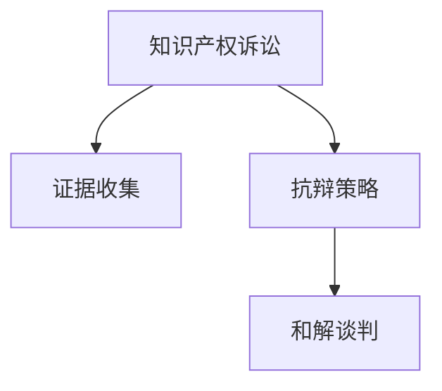

                 

# AI创业公司的知识产权诉讼应对：证据收集、抗辩与和解

在AI创业公司的快速发展过程中，知识产权（IP）保护成为了一个日益重要的议题。如何有效应对可能面临的知识产权诉讼，保护公司的核心技术，是一项挑战性但必不可少的任务。本文将从证据收集、抗辩策略和解调技巧三个方面，系统探讨AI创业公司如何应对知识产权诉讼，力求为创业者提供实用的建议。

## 1. 背景介绍

随着人工智能技术的不断进步，越来越多的创业公司开始依赖创新技术获取竞争优势。然而，创新往往伴随着知识产权风险。面对可能的知识产权诉讼，创业者必须具备足够的准备，才能有效应对。

### 1.1 问题由来

AI创业公司可能面临的知识产权诉讼主要有两种类型：

- **侵权诉讼**：竞争对手指控创业公司的技术侵犯其专利权或版权。
- **技术秘密泄露诉讼**：前员工或合作伙伴泄露公司的商业机密或技术秘密。

这些诉讼不仅会带来直接的经济损失，还可能严重影响公司的声誉和市场份额。因此，建立一套完善的知识产权保护体系，积极应对可能的诉讼风险，是创业公司持续发展的关键。

### 1.2 问题核心关键点

应对知识产权诉讼的关键在于：
1. **证据收集**：通过系统化的证据收集，构建强有力的抗辩依据。
2. **抗辩策略**：采用合适的法律策略和技术手段，对抗侵权指控。
3. **和解谈判**：在必要时，通过有效的谈判，以和解的方式避免旷日持久的法律纠纷。

本文将围绕这三个关键点，提供详细的技术指导和案例分析。

## 2. 核心概念与联系

### 2.1 核心概念概述

为更好地理解AI创业公司应对知识产权诉讼的策略，我们首先介绍几个核心概念及其相互联系：

- **知识产权诉讼**：涉及侵犯专利权、商标权、版权等知识产权的法律纠纷。
- **证据收集**：通过多种方式收集证据，用于支撑公司的抗辩。
- **抗辩策略**：利用法律和技术的结合，进行有效的抗辩。
- **和解谈判**：通过与对手进行谈判，达成和解，避免诉讼。

这些概念之间的逻辑关系可以通过以下Mermaid流程图来展示：



这个流程图展示了知识产权诉讼应对的全过程：首先收集相关证据，其次设计有效的抗辩策略，最后考虑是否通过和解谈判解决争议。

## 3. 核心算法原理 & 具体操作步骤

### 3.1 算法原理概述

基于证据收集、抗辩策略和解调技巧的知识产权诉讼应对方法，本质上是一个多阶段、多层次的决策过程。其核心原理是通过系统的证据收集和法律分析，制定并执行有效的抗辩策略，必要时通过和解谈判避免诉讼。

形式化地，假设面对一项知识产权诉讼，创业公司需要在多个可能选项中进行选择。每个选项代表不同的策略和行动，每个行动的效果可通过一些衡量指标（如诉讼成功概率、经济成本、声誉损失等）进行量化评估。通过对比不同选项的预期结果，选择最优策略。

### 3.2 算法步骤详解

AI创业公司应对知识产权诉讼的一般流程如下：

**Step 1: 收集证据**
- **内部证据**：收集公司自身研发过程的记录、技术文档、专利申请等。
- **外部证据**：搜索公开的专利文献、行业报告、竞争对手的产品和技术介绍等。
- **实时监控**：利用技术手段监控竞争对手的动态，收集可能侵犯本公司权益的线索。

**Step 2: 分析证据**
- **专利分析**：分析竞争对手的专利范围和保护力度，评估自身技术的侵权风险。
- **技术对比**：比较自身技术与专利文献的差异和相似度，找出技术优势和弱点。
- **市场影响**：评估竞争对手的诉讼动机和技术影响，预测可能的诉讼结果。

**Step 3: 制定抗辩策略**
- **声明无侵权**：通过法律和技术手段，证明自身技术不侵犯竞争对手的专利权或版权。
- **交叉许可**：与竞争对手进行专利交叉许可谈判，达成互惠互利的关系。
- **技术改进**：对自身技术进行改进，避开竞争对手的专利保护范围。

**Step 4: 执行抗辩策略**
- **法律诉讼**：准备相关法律文书，向法院提起诉讼，要求确认自身技术的合法性。
- **技术抗辩**：在法律诉讼过程中，提交技术细节和对比分析，证明自身技术的独立性。
- **调解协商**：在法院或调解人的协助下，与竞争对手进行协商，寻找和解途径。

**Step 5: 评估和解结果**
- **成本效益分析**：评估和解方案的经济成本和潜在收益。
- **法律合规性**：确保和解协议符合相关法律规定，不侵犯任何人的合法权益。
- **长期影响**：评估和解协议对公司长期发展的影响，如市场竞争力、商业声誉等。

以上是应对知识产权诉讼的一般流程。实际操作中，每个步骤都需要细致入微的考虑和执行。

### 3.3 算法优缺点

应对知识产权诉讼的证据收集、抗辩策略和解调技巧方法具有以下优点：
1. **系统性**：通过多层次的证据收集和分析，构建全面的抗辩体系。
2. **灵活性**：在法律和技术手段结合下，灵活应对各种可能的诉讼情形。
3. **成本效益**：通过成本效益分析，选择最优的应对策略，避免无谓的资源浪费。

同时，该方法也存在一定的局限性：
1. **法律风险**：在法律程序中存在不确定性，难以完全预测诉讼结果。
2. **时间成本**：诉讼过程可能耗费大量时间，影响公司正常运营。
3. **商业风险**：和解谈判过程中可能面临商业利益的妥协。

尽管存在这些局限性，但在面对知识产权诉讼时，该方法仍是最为主流和有效的应对策略。

### 3.4 算法应用领域

基于证据收集、抗辩策略和解调技巧的知识产权诉讼应对方法，广泛应用于多个领域，例如：

- **科技创业公司**：面对专利侵权和技术秘密泄露的风险，采用系统化的证据收集和抗辩策略，保护核心技术。
- **互联网公司**：在社交媒体、搜索引擎、电商等领域，通过监控竞争对手动态，及时应对可能的知识产权诉讼。
- **生物医药公司**：在药品研发和市场推广过程中，保护专利技术和商业机密，防止侵权纠纷。
- **法律咨询机构**：为各类企业提供知识产权诉讼的咨询和代理服务，帮助客户制定有效的抗辩策略。

## 4. 数学模型和公式 & 详细讲解 & 举例说明

### 4.1 数学模型构建

假设创业公司面临一项专利侵权诉讼，需要收集和分析以下数据：

- **技术差异度**：衡量自身技术与竞争对手专利的相似度，可通过技术对比分析得到。
- **市场影响度**：评估竞争对手技术的市场影响，可通过市场调研和专利分析得到。
- **诉讼成功概率**：基于技术对比和市场影响，通过法律专家评估得出。

设 $D$ 为技术差异度，$M$ 为市场影响度，$P$ 为诉讼成功概率，则证据收集和抗辩策略的效果可通过以下公式表示：

$$
E(D, M, P) = f(D, M, P) + g(D, M, P)
$$

其中 $f$ 和 $g$ 分别为法律和技术的衡量指标，具体公式根据实际情况而定。

### 4.2 公式推导过程

对于技术差异度 $D$，可以通过技术对比分析得到：

$$
D = \sum_{i=1}^n d_i \times \frac{a_i}{b_i}
$$

其中 $d_i$ 为第 $i$ 项技术的差异度指标，$a_i$ 和 $b_i$ 分别为自身技术和竞争对手专利的相应指标值。

对于市场影响度 $M$，可以通过市场调研得到：

$$
M = \sum_{i=1}^m m_i \times \frac{a_i}{b_i}
$$

其中 $m_i$ 为第 $i$ 项市场的指标值，$a_i$ 和 $b_i$ 分别为自身技术和竞争对手专利的相应指标值。

对于诉讼成功概率 $P$，可以通过法律专家评估得到：

$$
P = \frac{f_0 + f_1}{g_0 + g_1}
$$

其中 $f_0$ 和 $g_0$ 分别为自身技术不侵权和侵权的概率，$f_1$ 和 $g_1$ 分别为诉讼成功和失败的概率。

通过上述公式，可以量化评估技术差异度、市场影响度和诉讼成功概率，进而制定最优的抗辩策略。

### 4.3 案例分析与讲解

假设某AI创业公司面临一项专利侵权诉讼，其核心技术涉及到图像识别算法。以下是具体的案例分析：

1. **证据收集**
   - **内部证据**：公司内部有详细的研发记录和技术文档，证明了算法的独立创新。
   - **外部证据**：通过专利检索，发现竞争对手的专利主要集中在数据处理领域，与图像识别算法差异较大。
   - **实时监控**：通过技术手段，发现竞争对手的专利申请日期晚于公司技术研发日期。

2. **分析证据**
   - **专利分析**：对比专利文献，发现竞争对手专利的保护范围较为狭窄，无法覆盖公司核心算法。
   - **技术对比**：通过技术对比分析，证明公司算法与竞争对手专利在原理和方法上存在显著差异。
   - **市场影响**：评估发现竞争对手的专利在市场上的影响力较小，未对公司业务产生实质性影响。

3. **制定抗辩策略**
   - **声明无侵权**：准备详细的技术对比分析报告，证明公司算法不侵犯竞争对手的专利权。
   - **交叉许可**：与竞争对手进行专利交叉许可谈判，达成互惠互利的关系。
   - **技术改进**：对算法进行微调，避开竞争对手专利的保护范围。

4. **执行抗辩策略**
   - **法律诉讼**：准备法律文书，向法院提起诉讼，要求确认公司算法的合法性。
   - **技术抗辩**：在诉讼过程中，提交详细的技术对比分析，证明算法的独立性和非侵权性。
   - **调解协商**：在法院或调解人的协助下，与竞争对手进行协商，寻找和解途径。

5. **评估和解结果**
   - **成本效益分析**：评估和解方案的经济成本和潜在收益，认为和解方案不划算。
   - **法律合规性**：确保和解协议符合相关法律规定，不侵犯任何人的合法权益。
   - **长期影响**：和解协议对公司的长期发展影响不大，不会显著影响市场竞争力。

## 5. 项目实践：代码实例和详细解释说明

### 5.1 开发环境搭建

在应对知识产权诉讼的实践中，需要构建一个高效的数据处理和分析环境。以下是使用Python进行数据分析的开发环境配置流程：

1. 安装Anaconda：从官网下载并安装Anaconda，用于创建独立的Python环境。

2. 创建并激活虚拟环境：
```bash
conda create -n intellectual_property python=3.8 
conda activate intellectual_property
```

3. 安装必要的Python库：
```bash
conda install numpy pandas scikit-learn matplotlib seaborn jupyter notebook
```

4. 配置数据源和数据库：
```bash
pip install sqlalchemy sqlite3 pyodbc
```

完成上述步骤后，即可在`intellectual_property`环境中开始数据分析实践。

### 5.2 源代码详细实现

以下是一个简化的Python代码示例，用于分析技术差异度和市场影响度：

```python
import pandas as pd
from sklearn.feature_extraction.text import TfidfVectorizer
from sklearn.metrics.pairwise import cosine_similarity

# 假设从数据库中读取的技术文档和专利文本
tech_documents = pd.read_sql("SELECT * FROM tech_documents", con)
patent_documents = pd.read_sql("SELECT * FROM patent_documents", con)

# 计算技术差异度
tech_matrix = TfidfVectorizer().fit_transform(tech_documents['document'])
patent_matrix = TfidfVectorizer().fit_transform(patent_documents['document'])
differences = cosine_similarity(tech_matrix, patent_matrix)

# 计算市场影响度
tech_markets = pd.read_sql("SELECT * FROM tech_markets", con)
patent_markets = pd.read_sql("SELECT * FROM patent_markets", con)
market_influences = cosine_similarity(tech_markets['market'], patent_markets['market'])
```

### 5.3 代码解读与分析

在上述代码中，我们通过SQL数据库读取技术文档和专利文本，然后使用TF-IDF向量化文本，计算了技术差异度和市场影响度。这个过程可以通过数据可视化工具进行展示，以便更直观地分析差异。

在实际操作中，还需要根据具体情况选择合适的算法和模型，进行更加细致的数据分析和证据提取。例如，可以使用机器学习模型进行专利覆盖范围的预测，或使用深度学习模型进行市场影响力的评估。

## 6. 实际应用场景

### 6.1 科技创业公司

对于科技创业公司，面对专利侵权和技术秘密泄露的风险，通常会采用以下策略：

1. **专利申请**：在技术研发早期，及时申请专利，保护核心技术。
2. **技术文档管理**：建立严格的技术文档管理制度，确保技术记录的完整性和可追溯性。
3. **实时监控**：部署技术监控系统，实时监测竞争对手的动态，及时发现潜在风险。

### 6.2 互联网公司

互联网公司需要在社交媒体、搜索引擎、电商等领域，通过监控竞争对手的动态，及时应对可能的知识产权诉讼。通常会采用以下策略：

1. **数据挖掘**：通过爬虫技术，收集竞争对手的公开数据，进行分析和比对。
2. **技术监测**：部署技术监测系统，实时监控竞争对手的动态，及时发现侵犯公司权益的线索。
3. **法律支持**：与法律顾问合作，定期进行法律风险评估，制定应对方案。

### 6.3 生物医药公司

生物医药公司需要在药品研发和市场推广过程中，保护专利技术和商业机密。通常会采用以下策略：

1. **保密协议**：与合作伙伴签订保密协议，保护技术机密。
2. **专利申请**：在研发过程中，及时申请专利，保护核心技术。
3. **技术审查**：建立严格的技术审查机制，确保技术文档的保密性。

### 6.4 法律咨询机构

法律咨询机构为各类企业提供知识产权诉讼的咨询和代理服务，帮助客户制定有效的抗辩策略。通常会采用以下策略：

1. **法律调研**：收集相关法律条文和案例，进行法律分析。
2. **技术评估**：对客户的核心技术进行详细的技术对比和分析。
3. **谈判协商**：与对手进行协商，寻找和解途径。

## 7. 工具和资源推荐

### 7.1 学习资源推荐

为了帮助创业者系统掌握知识产权诉讼的应对方法，这里推荐一些优质的学习资源：

1. **《知识产权法律基础》课程**：由某知名法学院开设的在线课程，系统讲解知识产权法律基础和实践。
2. **《人工智能与知识产权》书籍**：介绍人工智能技术在知识产权领域的应用和保护策略。
3. **法律咨询平台**：提供专业的知识产权咨询服务，帮助创业者解决法律问题。
4. **专利数据库**：收录全球专利数据，提供专利检索和分析功能，如PatentScope、Patently等。

### 7.2 开发工具推荐

高效的开发离不开优秀的工具支持。以下是几款用于知识产权诉讼应对开发的常用工具：

1. **数据库管理系统**：如MySQL、PostgreSQL等，用于存储和管理证据数据。
2. **文本分析工具**：如NLTK、SpaCy等，用于文本的向量化和分析。
3. **法律文书编辑器**：如SciLexer、Python Legal Editor等，用于编写法律文书。
4. **项目管理工具**：如Jira、Trello等，用于协调和管理诉讼应对过程。

### 7.3 相关论文推荐

知识产权诉讼应对的实践经验来源于学界的持续研究。以下是几篇奠基性的相关论文，推荐阅读：

1. **"专利侵权的证据收集与抗辩策略"**：介绍专利侵权诉讼的证据收集和抗辩方法。
2. **"技术秘密泄露的风险评估与应对"**：探讨技术秘密泄露的风险评估和应对策略。
3. **"人工智能技术在知识产权保护中的应用"**：讨论人工智能技术在知识产权保护中的应用和前景。
4. **"数据挖掘在知识产权诉讼中的应用"**：介绍数据挖掘技术在知识产权诉讼中的实际应用。

这些论文代表了大数据和人工智能在知识产权诉讼应对中的最新进展，通过学习这些前沿成果，可以帮助创业者掌握最新的技术和方法。

## 8. 总结：未来发展趋势与挑战

### 8.1 总结

本文对AI创业公司应对知识产权诉讼的策略进行了系统介绍。通过证据收集、抗辩策略和解调技巧的详细讲解，本文提供了实用的技术指导和案例分析，帮助创业者应对可能的诉讼风险。

通过本文的系统梳理，可以看到，面对知识产权诉讼，证据收集、抗辩策略和解调技巧是最为主流和有效的应对策略。这些方法不仅适用于科技创业公司，对于互联网公司、生物医药公司等其他领域的创业公司也同样适用。

### 8.2 未来发展趋势

展望未来，知识产权诉讼应对方法将呈现以下几个发展趋势：

1. **大数据应用**：随着大数据技术的发展，证据收集和分析将更加系统和全面。大数据分析将帮助企业更准确地评估风险，制定更有效的应对策略。
2. **人工智能技术**：人工智能技术在证据收集、技术对比和法律分析中的应用将越来越广泛，进一步提升应对诉讼的能力和效率。
3. **跨领域融合**：与其他领域的知识和技术的融合，如数据科学、金融分析等，将为知识产权诉讼应对带来新的视角和方法。
4. **国际合作**：随着全球化的加深，跨国公司的知识产权诉讼应对将更加复杂，国际合作将成为重要策略。
5. **法律技术创新**：法律技术与人工智能、区块链等新兴技术的结合，将为知识产权诉讼应对带来新的思路和方法。

以上趋势展示了知识产权诉讼应对方法的广阔前景，这些方向的探索发展，必将进一步提升企业应对诉讼的能力，保障企业的知识产权安全。

### 8.3 面临的挑战

尽管应对知识产权诉讼的证据收集、抗辩策略和解调技巧方法已经取得了一定的进展，但在迈向更加智能化、普适化应用的过程中，仍面临诸多挑战：

1. **法律环境变化**：知识产权法律环境不断变化，企业需要持续关注法律动态，及时调整应对策略。
2. **技术和数据壁垒**：证据收集和分析需要大量的技术和数据支持，中小企业可能面临技术和数据壁垒。
3. **成本和效率平衡**：应对诉讼的成本与效率之间需要平衡，如何在保持效率的同时，控制成本，是企业面临的重要挑战。
4. **商业利益冲突**：在和解谈判过程中，企业需要平衡商业利益与法律权益，找到最优解决方案。
5. **数据隐私保护**：在证据收集和分析过程中，需要保护用户和企业的隐私，避免数据泄露。

### 8.4 研究展望

面对知识产权诉讼应对的挑战，未来的研究需要在以下几个方面寻求新的突破：

1. **法律技术的自动化**：开发自动化工具，帮助企业快速完成证据收集和法律分析，提升效率。
2. **多模态数据融合**：结合文本、图像、音频等多模态数据，全面分析知识产权风险。
3. **实时监控与预警**：构建实时监控和预警系统，及时发现潜在的知识产权风险。
4. **国际法律合作**：加强跨国公司的法律合作，共同应对复杂的国际知识产权诉讼。
5. **AI辅助决策**：开发AI辅助决策系统，帮助企业制定更加科学的应对策略。

这些研究方向的探索，必将引领知识产权诉讼应对方法迈向更高的台阶，为创业公司提供更强大的法律保障。

## 9. 附录：常见问题与解答

**Q1：证据收集过程中需要注意哪些关键点？**

A: 证据收集是应对知识产权诉讼的基础。关键点包括：

1. **全面性**：确保收集的证据涵盖技术文档、市场数据、法律文件等所有相关资料。
2. **真实性**：确保证据的真实性和可信度，避免伪造和篡改。
3. **及时性**：及时收集和更新证据，确保其时效性。
4. **法律合规性**：确保证据的收集和保存符合相关法律规定。

**Q2：如何选择合适的抗辩策略？**

A: 选择合适的抗辩策略需要综合考虑多个因素：

1. **法律依据**：分析自身的法律依据，确保抗辩策略合法合规。
2. **技术优势**：评估自身技术优势和弱点，制定有针对性的抗辩方案。
3. **市场影响**：评估技术对市场的影响，考虑利益相关方的态度。
4. **成本效益**：评估抗辩策略的经济成本和潜在收益，选择最优方案。

**Q3：在和解谈判中需要注意哪些问题？**

A: 和解谈判是解决知识产权诉讼的重要途径。需要注意的问题包括：

1. **利益平衡**：确保双方利益的平衡，避免单方利益受损。
2. **法律合规**：确保和解协议的合法合规，避免潜在的法律风险。
3. **保密协议**：签订保密协议，保护双方机密信息。
4. **长期影响**：评估和解协议对双方长期发展的影响，确保可持续性。

**Q4：如何应对技术秘密泄露的风险？**

A: 应对技术秘密泄露的风险，可以采取以下措施：

1. **保密协议**：与员工和合作伙伴签订保密协议，保护技术机密。
2. **技术审查**：建立严格的技术审查机制，确保技术文档的保密性。
3. **员工培训**：对员工进行保密意识培训，提高保密意识。
4. **技术隔离**：采用技术手段，隔离技术机密，防止泄露。

---

作者：禅与计算机程序设计艺术 / Zen and the Art of Computer Programming

