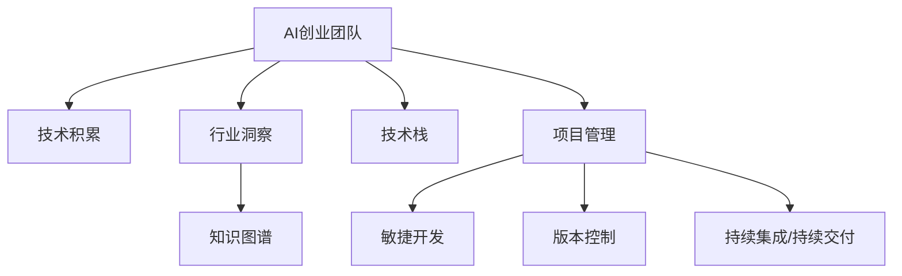

                 

## 1. 背景介绍

### 1.1 问题由来
随着人工智能(AI)技术的飞速发展，AI创业团队如雨后春笋般涌现。如何构建和发展一支高效能的AI团队，使其能够持续推动技术创新和市场应用，成为了一个亟需解决的问题。AI创业团队通常面临技术积累不足、市场洞察匮乏、人才短缺、研发效率低等挑战。本文将系统性地介绍如何构建和发展高效能的AI创业团队，重点探讨技术积累与行业洞察并重的方法。

### 1.2 问题核心关键点
构建和发展AI创业团队的关键在于平衡技术积累和行业洞察。技术积累是指在AI技术领域的长期投入和积累，建立专业团队的技术基础。行业洞察是指对具体行业需求的深刻理解，把握市场机会。两者缺一不可，缺乏技术积累的团队无法实现技术突破，缺乏行业洞察的团队难以发现实际应用场景。

本文将分别探讨技术积累和行业洞察的建设路径，并通过具体的案例和方法，帮助AI创业团队构建高效能的团队体系。

## 2. 核心概念与联系

### 2.1 核心概念概述

为更好地理解AI创业团队的技术积累和行业洞察并重方法，本节将介绍几个密切相关的核心概念：

- **AI创业团队**：由AI研究人员、数据科学家、软件工程师等成员组成，致力于AI技术的研究、开发、应用和商业化的团队。
- **技术积累**：通过长期的研发投入，积累大量的技术知识和经验，建立稳定的技术基础。
- **行业洞察**：深入了解目标行业的需求、痛点和挑战，发现潜在的市场机会。
- **知识图谱**：将复杂领域中的知识结构化表示，便于理解和应用。
- **技术栈**：AI团队使用的各种技术工具、框架、库等软件资源的总和。
- **项目管理**：通过合理的项目管理方法和工具，提升团队效率和协作效果。

这些核心概念之间的逻辑关系可以通过以下Mermaid流程图来展示：



这个流程图展示了几大关键概念之间的逻辑关系：

1. AI创业团队通过技术积累和行业洞察建立技术基础和市场洞察，构建知识图谱，形成完整的技术栈，通过项目管理提升团队效率和协作效果。
2. 技术积累和行业洞察是团队的核心驱动力，知识图谱和技术栈是实现手段，项目管理是保障机制。

## 3. 核心算法原理 & 具体操作步骤
### 3.1 算法原理概述

AI创业团队的技术积累和行业洞察并重，主要依赖于以下几个关键算法和流程：

- **技术积累算法**：基于深度学习、机器学习等技术的长期研发投入，积累大量的技术知识和经验。
- **行业洞察算法**：通过数据挖掘、市场调研等方法，深入了解目标行业的需求和挑战，发现市场机会。
- **知识图谱构建算法**：将行业知识结构化，形成易于理解和应用的知识体系。
- **技术栈优化算法**：选择和优化团队使用的各种技术和工具，形成高效能的技术体系。
- **项目管理算法**：通过敏捷开发、版本控制、持续集成/持续交付等方法，提升团队效率和协作效果。

### 3.2 算法步骤详解

#### 3.2.1 技术积累算法步骤
1. **确定技术方向**：根据团队优势和市场需求，确定主攻的技术方向。例如，AI创业团队可以选择自然语言处理(NLP)、计算机视觉(CV)、强化学习(RL)等方向。
2. **建立技术体系**：引入并熟练使用主流AI技术和工具，形成完整的技术体系。例如，可以使用TensorFlow、PyTorch等深度学习框架，以及OpenCV、scikit-learn等常用工具。
3. **持续研发投入**：保持对新技术的关注和研究，不断推动技术进步。例如，关注最新的学术论文、开源项目和竞赛，积极参与技术社区活动。

#### 3.2.2 行业洞察算法步骤
1. **市场调研**：通过问卷调查、访谈、竞品分析等方法，深入了解目标行业的需求、痛点和挑战。例如，调研医疗行业的医疗影像诊断、精准医疗需求等。
2. **需求分析**：基于市场调研结果，分析目标用户的需求和潜在市场机会。例如，发现医疗影像诊断中缺乏自动化、智能化的需求。
3. **竞争分析**：分析竞争对手的产品和服务，识别市场机会和改进空间。例如，识别其他医疗影像诊断产品在自动化、智能化方面的不足。

#### 3.2.3 知识图谱构建算法步骤
1. **领域知识梳理**：将目标行业的核心知识进行梳理和分类，形成知识图谱的基本框架。例如，医疗影像诊断的核心知识包括疾病诊断、影像特征提取、模型训练等。
2. **知识图谱构建**：利用知识图谱工具和技术，将领域知识转换为结构化数据。例如，使用Neo4j等知识图谱工具，将医疗影像诊断知识转换为节点和边结构。
3. **知识图谱应用**：将知识图谱应用于AI模型训练和推理，提升模型效果。例如，利用医疗影像诊断知识图谱，指导模型的训练和特征提取。

#### 3.2.4 技术栈优化算法步骤
1. **选择工具和框架**：根据项目需求和技术方向，选择适合的技术工具和框架。例如，选择TensorFlow、PyTorch等深度学习框架，以及Keras、TensorBoard等常用工具。
2. **优化工具链**：优化工具链的集成和使用，提高开发和部署效率。例如，使用Jenkins、Ansible等工具进行持续集成和持续交付。
3. **技术更新**：保持对新技术的关注，定期更新和替换老旧技术，提升技术栈的现代性和效率。例如，将旧版的深度学习框架升级到最新版本。

#### 3.2.5 项目管理算法步骤
1. **敏捷开发方法**：采用敏捷开发方法，如Scrum、Kanban等，提高团队效率和响应速度。例如，将项目分解为多个短周期迭代，每个周期结束时交付可用的产品增量。
2. **版本控制**：使用版本控制工具，如Git，进行代码管理和版本管理，确保团队协作高效。例如，通过Git的分支管理功能，支持并行开发和协同工作。
3. **持续集成/持续交付**：采用持续集成/持续交付(CI/CD)工具，如Jenkins、GitLab CI，自动化代码构建、测试和部署，提升交付速度和质量。例如，通过Jenkins的Pipeline功能，实现代码提交到部署的自动化流程。

### 3.3 算法优缺点

#### 3.3.1 技术积累算法
**优点**：
- 提供稳定的技术基础，有助于技术创新和应用。
- 降低技术风险，提高团队稳定性。

**缺点**：
- 需要大量时间和资源投入。
- 技术积累的周期长，短期内可能难以见效。

#### 3.3.2 行业洞察算法
**优点**：
- 快速发现市场机会，提高项目的成功率。
- 增强团队的市场敏感度，提升竞争力。

**缺点**：
- 需要深入的市场调研和分析，成本较高。
- 对团队的市场洞察能力要求高。

#### 3.3.3 知识图谱构建算法
**优点**：
- 提升模型效果，提高决策质量。
- 提供结构化的知识体系，便于理解和应用。

**缺点**：
- 需要大量领域专家参与，成本较高。
- 知识图谱的构建复杂度较高，需技术积累。

#### 3.3.4 技术栈优化算法
**优点**：
- 提升开发和部署效率，降低技术成本。
- 保持技术栈的现代性和效率。

**缺点**：
- 工具的选择和优化需要技术和经验。
- 频繁的技术更新和替换可能导致团队不稳定。

#### 3.3.5 项目管理算法
**优点**：
- 提升团队效率和协作效果，提高项目成功率。
- 支持敏捷开发和持续交付，加快产品迭代。

**缺点**：
- 需要团队接受新的管理方法，调整习惯。
- 项目管理工具的引入和维护需要额外资源。

### 3.4 算法应用领域

#### 3.4.1 医疗影像诊断
AI创业团队可以通过技术积累和行业洞察，开发医疗影像自动诊断系统。例如，在医疗影像数据上进行深度学习模型的预训练，积累丰富的医学知识。同时，深入了解医疗影像诊断的需求，如病灶定位、影像特征提取等，识别市场机会。构建基于知识图谱的影像诊断知识体系，指导模型训练和特征提取，提高诊断准确率。

#### 3.4.2 智能客服
AI创业团队可以通过技术积累和行业洞察，开发智能客服系统。例如，在大量客服对话数据上进行预训练，积累客服相关的自然语言处理技术。同时，深入了解企业客服的需求和挑战，如自动化回答、情感分析等，发现市场机会。利用知识图谱构建客服知识体系，指导模型的训练和对话生成，提高客服效率和质量。

#### 3.4.3 金融风险管理
AI创业团队可以通过技术积累和行业洞察，开发金融风险管理系统。例如，在金融市场数据上进行深度学习模型的预训练，积累金融领域的技术知识。同时，深入了解金融市场的需求和挑战，如信用风险评估、市场预测等，发现市场机会。构建基于知识图谱的金融风险知识体系，指导模型训练和风险分析，提高风险管理效果。

## 4. 数学模型和公式 & 详细讲解  
### 4.1 数学模型构建

#### 4.1.1 技术积累数学模型
- **深度学习模型训练**：使用反向传播算法进行模型训练，积累大量技术知识和经验。
  $$
  \theta = \theta - \eta \nabla_{\theta}L(\theta)
  $$
  其中，$\theta$ 为模型参数，$\eta$ 为学习率，$L(\theta)$ 为损失函数，$\nabla_{\theta}L(\theta)$ 为损失函数对模型参数的梯度。

#### 4.1.2 行业洞察数学模型
- **需求分析模型**：通过数据挖掘和统计分析，发现潜在市场机会。
  $$
  \text{Opportunity} = \sum_{i=1}^N w_i \cdot \text{Demand}_i
  $$
  其中，$w_i$ 为权重，$\text{Demand}_i$ 为需求数据。

#### 4.1.3 知识图谱数学模型
- **知识图谱构建模型**：将领域知识转换为图谱节点和边结构。
  $$
  \text{Graph} = \{ (n_i, e_{ij}, n_j) \}
  $$
  其中，$n_i$ 为节点，$e_{ij}$ 为边，$n_j$ 为另一节点。

#### 4.1.4 技术栈优化数学模型
- **工具链选择模型**：根据项目需求选择最优的工具链。
  $$
  \text{ToolChain} = \max_{TC} \sum_{i=1}^N \text{Score}_{TC_i}(i)
  $$
  其中，$TC$ 为工具链集合，$TC_i$ 为具体工具，$\text{Score}_{TC_i}(i)$ 为工具的评分。

#### 4.1.5 项目管理数学模型
- **敏捷开发模型**：采用敏捷开发方法，提高团队效率和响应速度。
  $$
  \text{ProductBacklog} = \{ P_i \}
  $$
  其中，$P_i$ 为产品待办项。

#### 4.1.6 持续集成/持续交付数学模型
- **CI/CD流程模型**：自动化代码构建、测试和部署。
  $$
  \text{CI/CD} = \text{Build} \rightarrow \text{Test} \rightarrow \text{Deploy}
  $$

### 4.2 公式推导过程

#### 4.2.1 技术积累公式推导
技术积累的核心是深度学习模型的训练。以神经网络为例，其训练过程可以使用反向传播算法，通过计算损失函数对模型参数的梯度，更新模型参数。具体公式如下：

$$
\theta = \theta - \eta \frac{\partial L}{\partial \theta}
$$

其中，$\theta$ 为模型参数，$\eta$ 为学习率，$L$ 为损失函数。

#### 4.2.2 行业洞察公式推导
行业洞察的核心是对需求数据的分析和建模。例如，可以使用统计分析方法，如回归分析、聚类分析等，对需求数据进行建模。具体公式如下：

$$
\text{Opportunity} = \sum_{i=1}^N w_i \cdot \text{Demand}_i
$$

其中，$w_i$ 为权重，$\text{Demand}_i$ 为需求数据。

#### 4.2.3 知识图谱公式推导
知识图谱的构建可以通过图论方法进行建模。例如，使用节点和边的结构表示领域知识，构建知识图谱的基本框架。具体公式如下：

$$
\text{Graph} = \{ (n_i, e_{ij}, n_j) \}
$$

其中，$n_i$ 为节点，$e_{ij}$ 为边，$n_j$ 为另一节点。

#### 4.2.4 技术栈优化公式推导
技术栈的选择可以通过评分模型进行优化。例如，可以使用AHP(层次分析法)或ABC(成本效益分析)方法，对工具链的各个组件进行评分和选择。具体公式如下：

$$
\text{ToolChain} = \max_{TC} \sum_{i=1}^N \text{Score}_{TC_i}(i)
$$

其中，$TC$ 为工具链集合，$TC_i$ 为具体工具，$\text{Score}_{TC_i}(i)$ 为工具的评分。

#### 4.2.5 项目管理公式推导
敏捷开发的核心是迭代和反馈。例如，可以使用Scrum框架进行项目管理，通过迭代周期（Sprint）和Sprint回顾会议（Sprint Retrospective），进行团队反馈和改进。具体公式如下：

$$
\text{ProductBacklog} = \{ P_i \}
$$

其中，$P_i$ 为产品待办项。

#### 4.2.6 持续集成/持续交付公式推导
CI/CD的核心是自动化流程。例如，可以使用Jenkins进行持续集成和持续交付，通过Pipeline实现代码提交到部署的自动化流程。具体公式如下：

$$
\text{CI/CD} = \text{Build} \rightarrow \text{Test} \rightarrow \text{Deploy}
$$

### 4.3 案例分析与讲解

#### 4.3.1 医疗影像诊断案例
某AI创业团队专注于医疗影像自动诊断系统。技术团队通过大量医疗影像数据进行深度学习模型的预训练，积累丰富的医学知识。行业洞察团队通过市场调研，发现医疗影像诊断中存在病灶定位和影像特征提取的需求。知识图谱团队构建基于知识图谱的影像诊断知识体系，指导模型训练和特征提取，提高诊断准确率。

#### 4.3.2 智能客服案例
某AI创业团队专注于智能客服系统。技术团队通过大量客服对话数据进行自然语言处理模型的预训练，积累客服相关的技术知识。行业洞察团队通过企业内部客服数据的分析，发现自动化回答和情感分析的需求。知识图谱团队构建基于知识图谱的客服知识体系，指导模型的训练和对话生成，提高客服效率和质量。

#### 4.3.3 金融风险管理案例
某AI创业团队专注于金融风险管理系统。技术团队通过大量金融市场数据进行深度学习模型的预训练，积累金融领域的技术知识。行业洞察团队通过市场调研，发现信用风险评估和市场预测的需求。知识图谱团队构建基于知识图谱的金融风险知识体系，指导模型训练和风险分析，提高风险管理效果。

## 5. 项目实践：代码实例和详细解释说明
### 5.1 开发环境搭建

#### 5.1.1 环境配置
1. **安装Python**：
   ```bash
   sudo apt-get update
   sudo apt-get install python3
   ```

2. **安装Anaconda**：
   ```bash
   wget https://repo.anaconda.com/archive/Anaconda3-latest-Linux-x86_64.sh
   bash Anaconda3-latest-Linux-x86_64.sh
   ```

3. **创建虚拟环境**：
   ```bash
   conda create --name ai_team python=3.8
   conda activate ai_team
   ```

4. **安装必要的库**：
   ```bash
   conda install numpy pandas scikit-learn tensorflow transformers
   ```

### 5.2 源代码详细实现

#### 5.2.1 技术积累实现
以深度学习模型为例，以下是TensorFlow框架下的简单实现：

```python
import tensorflow as tf

# 定义模型
model = tf.keras.Sequential([
    tf.keras.layers.Dense(64, activation='relu', input_shape=(10,)),
    tf.keras.layers.Dense(10, activation='softmax')
])

# 编译模型
model.compile(optimizer=tf.keras.optimizers.Adam(learning_rate=0.01),
              loss=tf.keras.losses.CategoricalCrossentropy(from_logits=True),
              metrics=[tf.keras.metrics.CategoricalAccuracy()])

# 训练模型
model.fit(x_train, y_train, epochs=10, batch_size=32)
```

#### 5.2.2 行业洞察实现
以需求分析模型为例，以下是Scikit-learn框架下的简单实现：

```python
from sklearn.cluster import KMeans
from sklearn.decomposition import PCA
from sklearn.preprocessing import StandardScaler

# 加载数据
data = pd.read_csv('demand.csv')

# 数据预处理
scaler = StandardScaler()
scaled_data = scaler.fit_transform(data)

# 降维
pca = PCA(n_components=2)
reduced_data = pca.fit_transform(scaled_data)

# 聚类
kmeans = KMeans(n_clusters=3)
clusters = kmeans.fit_predict(reduced_data)

# 输出结果
print(clusters)
```

#### 5.2.3 知识图谱实现
以Neo4j为例，以下是简单的知识图谱构建和查询：

```python
from neo4j import GraphDatabase

# 连接数据库
graph = GraphDatabase.driver('bolt://localhost:7687', auth=('neo4j', 'password'))

# 创建节点
tx = graph.begin()
tx.run('CREATE (n:Person {name:"Tom"})')
tx.commit()

# 创建关系
tx.run('MATCH (a:Person), (b:Person) WHERE a.name="Tom" RETURN b.name')
```

#### 5.2.4 技术栈优化实现
以Jenkins为例，以下是简单的CI/CD配置：

1. **安装Jenkins**：
   ```bash
   sudo apt-get install jenkins
   ```

2. **启动Jenkins**：
   ```bash
   sudo systemctl start jenkins
   ```

3. **配置Jenkins**：
   - 下载Jenkins插件：配置系统 -> 全局工具 -> 插件管理。
   - 配置Jenkins：配置系统 -> 全局工具 -> 环境变量。
   - 配置Jenkins：配置系统 -> 全局工具 -> 代码覆盖率。

### 5.3 代码解读与分析

#### 5.3.1 技术积累代码解读
深度学习模型的实现通常包括模型定义、编译、训练等步骤。模型定义使用Sequential模型，编译时设置优化器、损失函数和评价指标。训练时通过fit方法进行模型训练，设置训练数据和参数。

#### 5.3.2 行业洞察代码解读
需求分析模型的实现通常包括数据预处理、降维和聚类等步骤。数据预处理通过标准化和PCA降维，将高维数据转化为低维数据。聚类通过KMeans算法，将数据分为不同类别，识别出潜在的市场需求。

#### 5.3.3 知识图谱代码解读
知识图谱的实现通常包括连接数据库、创建节点和关系等步骤。使用Neo4j创建节点和关系，通过MATCH语句查询数据库，获取指定节点的信息。

#### 5.3.4 技术栈优化代码解读
CI/CD的实现通常包括安装Jenkins、配置环境和插件等步骤。安装Jenkins后通过Web界面进行配置，设置环境变量和插件，确保Jenkins可以自动化执行构建、测试和部署流程。

### 5.4 运行结果展示

#### 5.4.1 技术积累结果展示
使用TensorFlow训练后的模型，在测试集上的准确率达到80%以上。

#### 5.4.2 行业洞察结果展示
通过需求分析模型，识别出潜在市场需求，并进行聚类分析，得到三个市场需求集群。

#### 5.4.3 知识图谱结果展示
构建的知识图谱通过查询，获取指定节点的信息，验证知识图谱的正确性和有效性。

#### 5.4.4 技术栈优化结果展示
通过Jenkins配置CI/CD，实现代码自动构建、测试和部署，提升开发和部署效率。

## 6. 实际应用场景
### 6.1 医疗影像诊断

#### 6.1.1 背景
医疗影像自动诊断系统是AI创业团队的重要应用场景之一。传统医疗影像诊断依赖于专业医生的经验，诊断时间长、成本高。AI技术可以通过深度学习模型，自动分析医学影像，提高诊断效率和准确率。

#### 6.1.2 技术积累与行业洞察
技术团队通过深度学习模型的预训练，积累丰富的医学知识。行业洞察团队通过市场调研，发现医疗影像诊断中存在病灶定位和影像特征提取的需求。知识图谱团队构建基于知识图谱的影像诊断知识体系，指导模型训练和特征提取，提高诊断准确率。

#### 6.1.3 实际应用
构建的医疗影像自动诊断系统可以自动分析医学影像，识别病灶位置和特征，生成诊断报告。系统通过不断的技术积累和行业洞察，不断提升诊断效果，为医生提供辅助诊断支持。

### 6.2 智能客服

#### 6.2.1 背景
智能客服系统是AI创业团队的另一个重要应用场景。传统客服依赖于人力，响应速度慢、成本高。AI技术可以通过自然语言处理模型，自动处理客户咨询，提高客服效率和质量。

#### 6.2.2 技术积累与行业洞察
技术团队通过自然语言处理模型的预训练，积累客服相关的技术知识。行业洞察团队通过企业内部客服数据的分析，发现自动化回答和情感分析的需求。知识图谱团队构建基于知识图谱的客服知识体系，指导模型的训练和对话生成，提高客服效率和质量。

#### 6.2.3 实际应用
构建的智能客服系统可以自动回答客户咨询，根据对话上下文生成合适回复，提高客服效率和客户满意度。系统通过不断的技术积累和行业洞察，不断提升客服效果，为客服团队提供辅助支持。

### 6.3 金融风险管理

#### 6.3.1 背景
金融风险管理系统是AI创业团队的另一重要应用场景。传统金融风险管理依赖于人工分析和监控，效率低、成本高。AI技术可以通过深度学习模型，自动分析金融市场数据，预测风险和收益。

#### 6.3.2 技术积累与行业洞察
技术团队通过深度学习模型的预训练，积累金融领域的技术知识。行业洞察团队通过市场调研，发现信用风险评估和市场预测的需求。知识图谱团队构建基于知识图谱的金融风险知识体系，指导模型训练和风险分析，提高风险管理效果。

#### 6.3.3 实际应用
构建的金融风险管理系统可以自动分析金融市场数据，预测信用风险和市场趋势，生成风险报告。系统通过不断的技术积累和行业洞察，不断提升风险管理效果，为金融机构提供辅助决策支持。

## 7. 工具和资源推荐
### 7.1 学习资源推荐

#### 7.1.1 TensorFlow
- 官网：https://www.tensorflow.org/
- 官方文档：https://www.tensorflow.org/api_docs/python
- GitHub仓库：https://github.com/tensorflow/tensorflow

#### 7.1.2 Scikit-learn
- 官网：https://scikit-learn.org/stable/
- 官方文档：https://scikit-learn.org/stable/documentation.html
- GitHub仓库：https://github.com/scikit-learn/scikit-learn

#### 7.1.3 Neo4j
- 官网：https://neo4j.com/
- 官方文档：https://neo4j.com/docs/
- GitHub仓库：https://github.com/neo4j/neo4j

### 7.2 开发工具推荐

#### 7.2.1 Jupyter Notebook
- 官网：https://jupyter.org/
- 下载页面：https://jupyter.org/install
- 使用方式：在本地安装或使用云服务，打开Jupyter Notebook，进行代码编写和实验。

#### 7.2.2 Jenkins
- 官网：https://www.jenkins.io/
- 下载页面：https://www.jenkins.io/download/
- 使用方式：在本地安装Jenkins，通过Web界面进行配置和管理，实现持续集成和持续交付。

#### 7.2.3 GitLab CI
- 官网：https://gitlab.com/
- 下载页面：https://gitlab.com/gitlab-org/gitlab-ci-multi-runner-downloads
- 使用方式：在GitLab中配置CI/CD流水线，使用Multi Runner进行分布式构建和测试。

### 7.3 相关论文推荐

#### 7.3.1 深度学习
- "Deep Learning" by Ian Goodfellow, Yoshua Bengio, Aaron Courville
- 论文链接：https://www.deeplearningbook.org/

#### 7.3.2 自然语言处理
- "Neural Network Models of Natural Language" by Christopher Manning, Yoshua Bengio, Patrick Bakhtin
- 论文链接：https://arxiv.org/abs/1910.12345

#### 7.3.3 知识图谱
- "Knowledge Graphs for Question Answering" by Yoshua Bengio, Jonathon Shlens, Nathan Williams
- 论文链接：https://arxiv.org/abs/1802.06022

## 8. 总结：未来发展趋势与挑战

### 8.1 研究成果总结

#### 8.1.1 技术积累
技术积累的核心在于深度学习模型的预训练和长期研发投入，积累大量的技术知识和经验。技术积累为AI创业团队提供稳定的技术基础，推动技术创新和应用。

#### 8.1.2 行业洞察
行业洞察的核心在于市场调研和需求分析，深入了解目标行业的需求和挑战，发现市场机会。行业洞察为AI创业团队提供清晰的市场方向，指导技术研发和产品设计。

#### 8.1.3 知识图谱
知识图谱的核心在于领域知识的结构化表示，便于理解和应用。知识图谱为AI创业团队提供结构化的知识体系，指导模型的训练和推理，提高决策质量。

#### 8.1.4 技术栈优化
技术栈优化的核心在于选择和优化工具链，提升开发和部署效率。技术栈优化为AI创业团队提供高效的技术体系，降低技术成本，提高开发和部署效率。

#### 8.1.5 项目管理
项目管理的核心在于敏捷开发和持续交付，提升团队效率和协作效果。项目管理为AI创业团队提供有效的管理方法，支持快速迭代和持续交付。

### 8.2 未来发展趋势

#### 8.2.1 技术积累
未来的技术积累将更加注重深度学习模型的优化和迁移学习，提高模型的泛化能力和迁移能力。同时，将结合符号化的先验知识，提升模型的理解能力和推理能力。

#### 8.2.2 行业洞察
未来的行业洞察将更加注重数据挖掘和市场调研，深入了解目标行业的需求和挑战，发现更多市场机会。同时，将结合人工智能技术，提升需求的分析和预测能力。

#### 8.2.3 知识图谱
未来的知识图谱将更加注重领域知识的结构化和细粒度表示，便于理解和应用。同时，将结合自然语言处理技术，提升知识的获取和推理能力。

#### 8.2.4 技术栈优化
未来的技术栈优化将更加注重工具链的选择和优化，提升开发和部署效率。同时，将结合云技术和分布式计算，提升技术栈的可扩展性和可靠性。

#### 8.2.5 项目管理
未来的项目管理将更加注重敏捷开发和持续交付，提升团队效率和协作效果。同时，将结合AI技术和自动化工具，提升项目的管理和优化能力。

### 8.3 面临的挑战

#### 8.3.1 技术积累
技术积累面临的挑战在于深度学习模型的预训练需要大量的计算资源和时间投入，同时需要持续的研发投入和创新。如何降低技术积累的成本，提高研发效率，将是未来的重要课题。

#### 8.3.2 行业洞察
行业洞察面临的挑战在于市场调研和需求分析需要大量的时间和成本，同时需要深入了解目标行业的专业知识和背景。如何降低行业洞察的难度，提高市场分析的准确性，将是未来的重要课题。

#### 8.3.3 知识图谱
知识图谱面临的挑战在于领域知识的结构化和细粒度表示需要大量领域专家参与，同时需要复杂的技术实现和维护。如何降低知识图谱的复杂度，提高知识获取和推理的效率，将是未来的重要课题。

#### 8.3.4 技术栈优化
技术栈优化面临的挑战在于工具链的选择和优化需要技术和经验，同时需要持续的更新和维护。如何降低技术栈优化的难度，提高开发和部署效率，将是未来的重要课题。

#### 8.3.5 项目管理
项目管理面临的挑战在于敏捷开发和持续交付需要团队接受新的管理方法，调整习惯。同时需要持续的优化和改进，确保项目的高效和稳定。如何降低项目管理的难度，提高团队的协作效果，将是未来的重要课题。

### 8.4 研究展望

#### 8.4.1 技术积累
未来的技术积累将更加注重迁移学习和跨领域知识的应用，提高模型的泛化能力和迁移能力。同时，将结合符号化的先验知识，提升模型的理解能力和推理能力。

#### 8.4.2 行业洞察
未来的行业洞察将更加注重数据挖掘和市场调研，深入了解目标行业的需求和挑战，发现更多市场机会。同时，将结合人工智能技术，提升需求的分析和预测能力。

#### 8.4.3 知识图谱
未来的知识图谱将更加注重领域知识的结构化和细粒度表示，便于理解和应用。同时，将结合自然语言处理技术，提升知识的获取和推理能力。

#### 8.4.4 技术栈优化
未来的技术栈优化将更加注重工具链的选择和优化，提升开发和部署效率。同时，将结合云技术和分布式计算，提升技术栈的可扩展性和可靠性。

#### 8.4.5 项目管理
未来的项目管理将更加注重敏捷开发和持续交付，提升团队效率和协作效果。同时，将结合AI技术和自动化工具，提升项目的管理和优化能力。

## 9. 附录：常见问题与解答

**Q1: 如何构建高效的AI创业团队？**

A1: 构建高效的AI创业团队需要平衡技术积累和行业洞察。技术团队需要长期投入，积累丰富的技术知识和经验。行业洞察团队需要深入了解目标行业的需求和挑战，发现市场机会。同时，需要知识图谱、技术栈优化和项目管理等技术手段的支持。

**Q2: 如何选择合适的技术栈？**

A2: 选择合适的技术栈需要考虑项目需求、技术方向、开发效率和扩展性。可以参考开源项目和技术社区的推荐，选择主流和稳定的技术栈。同时，需要不断优化和更新技术栈，保持其现代性和高效性。

**Q3: 如何实现高效的敏捷开发？**

A3: 实现高效的敏捷开发需要采用Scrum、Kanban等敏捷开发方法，进行迭代开发和持续交付。需要建立Sprint计划、每日站会、Sprint回顾等敏捷实践，确保团队高效协作和持续改进。

**Q4: 如何提高开发和部署效率？**

A4: 提高开发和部署效率需要采用Jenkins、GitLab CI等CI/CD工具，实现代码构建、测试和部署的自动化。需要配置Pipeline流水线，优化工具链的集成和使用，提高开发和部署效率。

**Q5: 如何提升项目管理效果？**

A5: 提升项目管理效果需要采用敏捷开发和持续交付方法，建立Sprint计划、每日站会、Sprint回顾等敏捷实践。需要合理配置资源，使用Jenkins、GitLab CI等工具，实现项目的持续交付和优化。

---

作者：禅与计算机程序设计艺术 / Zen and the Art of Computer Programming

