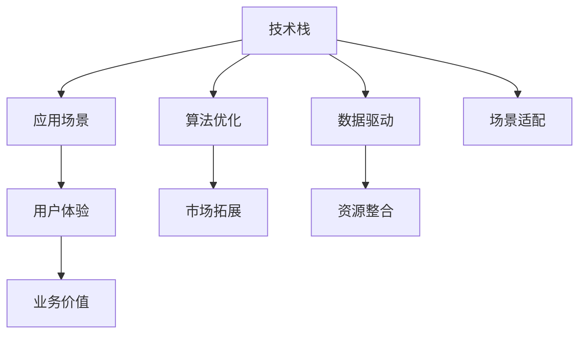

                 

## 1. 背景介绍

### 1.1 问题由来

随着人工智能(AI)技术的迅猛发展，越来越多的AI创业者在各行各业崭露头角。然而，AI创业的复杂性远超人们想象。仅靠技术研发已无法应对市场和用户需求的变化，需要在技术、应用、场景等各个层面进行全面平衡。

从技术层面看，AI创业需要深度学习、自然语言处理(NLP)、计算机视觉、强化学习等先进技术支持，但如何通过这些技术实现商业应用，以及如何适配不同场景，仍存在诸多挑战。

从应用层面看，AI产品需要具备良好的用户体验、高效便捷的操作界面和可扩展的架构设计。但如何设计能够跨越不同领域和用户群体的应用场景，以及如何将技术优势转化为实际的用户价值，需要综合考虑。

从场景层面看，AI应用需要适应各种实际环境，包括不同的行业、设备和用户习惯。但如何将技术解决方案与特定场景完美结合，满足用户的实际需求，是需要深入思考的难题。

### 1.2 问题核心关键点

AI创业的核心关键点在于找到技术与应用的平衡，并适配特定场景。这需要考虑以下几个要素：

- **技术创新与业务需求**：如何结合业务需求创新AI技术，使技术推动业务增长。
- **算法优化与用户体验**：如何通过优化算法，提升用户体验，增强产品的吸引力。
- **场景适配与业务价值**：如何根据不同场景设计适配方案，实现商业价值最大化。
- **数据驱动与决策优化**：如何基于数据驱动，优化业务决策和产品迭代。
- **市场拓展与资源整合**：如何整合内外部资源，拓展市场，提升品牌影响力。

本文将从技术、应用、场景三个维度，详细介绍AI创业面临的挑战，并提出相应的解决方案。

## 2. 核心概念与联系

### 2.1 核心概念概述

为更好地理解AI创业过程中需要平衡的各个维度，本节将介绍几个核心概念：

- **技术栈**：包括深度学习、机器学习、自然语言处理等先进技术的组合，是AI创业的基础。
- **应用场景**：AI技术应用于特定业务或场景的能力，如智能客服、智能推荐、智能监控等。
- **用户体验**：用户在使用产品时的感知、认知和情感体验，是衡量产品成功与否的重要标准。
- **业务价值**：AI产品创造的商业价值，包括直接和间接效益，如用户增长、成本降低、收益提升等。
- **市场拓展**：通过产品和服务在市场中的推广和渗透，实现品牌和业务的双重提升。
- **资源整合**：整合内外部资源，形成合力，提升整体竞争力。

这些核心概念之间相互关联，共同构成了AI创业的生态体系。只有全面理解这些概念，才能在技术、应用、场景之间找到最佳的平衡点。

### 2.2 核心概念原理和架构的 Mermaid 流程图



这个流程图展示了技术栈如何通过算法优化和数据驱动，适配应用场景，并最终转化为用户体验和业务价值，同时通过市场拓展和资源整合提升品牌影响力。

## 3. 核心算法原理 & 具体操作步骤

### 3.1 算法原理概述

AI创业的算法优化与用户体验、业务价值紧密相关。在技术层面，深度学习、机器学习、强化学习等算法需要不断优化，才能实现更好的效果。在应用层面，如何利用这些算法适配特定场景，提升用户体验，是AI创业的关键。

深度学习通过构建多层神经网络，从数据中提取特征，进行分类、回归、生成等任务。算法优化涉及参数调优、网络结构设计、损失函数选择等方面，需要在保持模型精度的同时，提升训练和推理的效率。

机器学习通过构建特征空间，利用各类算法进行分类、聚类、关联规则挖掘等任务。算法优化主要关注特征选择、模型选择、参数调整等，以提升模型的泛化能力和预测精度。

强化学习通过智能体与环境的交互，不断调整策略，达到最优状态。算法优化主要关注奖励函数设计、策略更新方式、样本收集方法等，以提升智能体的学习效率和效果。

### 3.2 算法步骤详解

1. **数据准备**：收集相关数据，进行预处理，包括清洗、特征工程等。
2. **模型构建**：根据业务需求选择合适的算法模型，并进行超参数配置。
3. **训练与调优**：使用训练集进行模型训练，并根据验证集进行参数调优。
4. **评估与优化**：使用测试集评估模型性能，根据评估结果进行进一步优化。
5. **部署与监控**：将优化后的模型部署到实际应用中，并进行实时监控和反馈。

### 3.3 算法优缺点

深度学习具有强大的建模能力，但需要大量数据和计算资源，模型复杂度高，难以解释。机器学习算法相对简单，但需要良好的特征工程，且易过拟合。强化学习需要大量的试错，但能够自适应复杂环境。

### 3.4 算法应用领域

深度学习广泛应用于计算机视觉、语音识别、自然语言处理等任务，如图像分类、语音合成、机器翻译等。机器学习应用于推荐系统、风险评估、客户细分等业务场景。强化学习用于智能游戏、机器人控制、自动化交易等任务。

## 4. 数学模型和公式 & 详细讲解 & 举例说明

### 4.1 数学模型构建

以深度学习为例，我们通过构建卷积神经网络(CNN)进行图像分类任务。假设输入为$x$，输出为$y$，模型参数为$\theta$。模型的损失函数为交叉熵损失：

$$
L(\theta) = -\frac{1}{m} \sum_{i=1}^m y_i \log p(y_i|\theta)
$$

其中，$p(y_i|\theta)$为模型在输入$x_i$下预测为$y_i$的概率。

### 4.2 公式推导过程

以卷积神经网络为例，推导前向传播和反向传播的计算公式。

假设输入$x$的大小为$H \times W \times C$，卷积层的参数为$\theta$，包括卷积核和偏置项。卷积层的输出$o$计算公式为：

$$
o = g(\theta * x + b)
$$

其中，$*$表示卷积运算，$g$为激活函数，$b$为偏置项。

前向传播过程中，通过多层卷积和池化操作，得到最终的特征图$F$，再进行全连接层输出概率分布。反向传播过程中，通过链式法则计算梯度，更新模型参数$\theta$。

### 4.3 案例分析与讲解

以智能推荐系统为例，假设系统根据用户历史行为数据，推荐相关商品。使用协同过滤算法，构建用户-商品评分矩阵$R$，通过矩阵分解，得到用户隐向量$u_i$和商品隐向量$v_j$。

$$
R \approx u_i \times v_j^T
$$

通过求解最小二乘问题，得到用户和商品的隐向量。根据隐向量，计算用户对商品的兴趣得分，选择得分高的商品进行推荐。

## 5. 项目实践：代码实例和详细解释说明

### 5.1 开发环境搭建

进行AI创业的代码实践，需要先搭建好开发环境。以下是Python和TensorFlow的搭建流程：

1. 安装Anaconda：从官网下载并安装Anaconda，用于创建独立的Python环境。
2. 创建并激活虚拟环境：
```bash
conda create -n tf-env python=3.8 
conda activate tf-env
```

3. 安装TensorFlow：根据CUDA版本，从官网获取对应的安装命令。例如：
```bash
pip install tensorflow
```

4. 安装TensorBoard：TensorFlow配套的可视化工具，可实时监测模型训练状态，并提供丰富的图表呈现方式。
```bash
pip install tensorboard
```

5. 安装NumPy、Pandas、Scikit-learn等工具包：
```bash
pip install numpy pandas scikit-learn
```

完成上述步骤后，即可在`tf-env`环境中开始代码实践。

### 5.2 源代码详细实现

以下是一个基于TensorFlow的图像分类模型的实现示例：

```python
import tensorflow as tf
from tensorflow.keras import layers

# 构建模型
model = tf.keras.Sequential([
    layers.Conv2D(32, (3, 3), activation='relu', input_shape=(28, 28, 1)),
    layers.MaxPooling2D((2, 2)),
    layers.Flatten(),
    layers.Dense(10, activation='softmax')
])

# 编译模型
model.compile(optimizer='adam', loss='sparse_categorical_crossentropy', metrics=['accuracy'])

# 训练模型
model.fit(x_train, y_train, epochs=10, validation_data=(x_test, y_test))

# 评估模型
model.evaluate(x_test, y_test)
```

### 5.3 代码解读与分析

**模型构建**：
- 使用`tf.keras.Sequential`搭建模型，包含卷积层、池化层和全连接层。
- 卷积层采用$32$个$3 \times 3$的卷积核，使用ReLU激活函数。
- 池化层采用$2 \times 2$的最大池化。
- 全连接层采用$10$个神经元，使用softmax激活函数。

**模型编译**：
- 使用Adam优化器，交叉熵损失函数，准确率作为评估指标。

**模型训练**：
- 使用训练集`x_train`和`y_train`进行10个epoch的训练，验证集`x_test`和`y_test`进行验证。

**模型评估**：
- 使用测试集`x_test`和`y_test`进行模型评估，输出测试集上的损失和准确率。

## 6. 实际应用场景

### 6.1 智能客服系统

智能客服系统通过自然语言处理技术，自动化处理客户咨询，提升客户满意度。

- **技术层面**：使用预训练的BERT模型，微调成特定领域的客服对话模型。
- **应用层面**：设计自然语言处理接口，提供问答、意图识别、情感分析等功能。
- **场景层面**：适配不同行业和企业的客服场景，如电商、金融、医疗等。

### 6.2 金融舆情监测

金融舆情监测通过自然语言处理技术，实时监测市场舆情，预测市场动态。

- **技术层面**：使用预训练的GPT模型，微调成金融领域的舆情分析模型。
- **应用层面**：提供舆情分析报告、情绪预测等功能。
- **场景层面**：适配金融机构，如银行、券商、保险公司等。

### 6.3 个性化推荐系统

个性化推荐系统通过机器学习技术，根据用户行为数据，推荐相关产品。

- **技术层面**：使用协同过滤算法，构建用户-商品评分矩阵，进行隐向量分解。
- **应用层面**：提供个性化推荐列表，提升用户购买率和满意度。
- **场景层面**：适配电商、视频、音乐等平台。

### 6.4 未来应用展望

未来AI创业将面临更多的技术挑战和市场需求，需要不断探索新的应用场景和解决方案。

- **技术发展**：深度学习、强化学习、自然语言处理等技术将持续发展，推动AI创业的创新和进步。
- **应用拓展**：AI技术将更多应用于医疗、教育、交通等领域，带来新的商业机遇和价值。
- **场景适配**：AI创业将更多关注垂直行业的应用场景，设计更具针对性的产品和服务。

## 7. 工具和资源推荐

### 7.1 学习资源推荐

为了帮助AI创业者全面掌握AI创业的知识，推荐以下学习资源：

1. Coursera《机器学习》课程：由斯坦福大学教授Andrew Ng主讲，全面介绍机器学习的基本概念和算法。
2. Udacity《深度学习》课程：由Google Brain团队成员主讲，深入讲解深度学习的理论和实践。
3. CS224N《自然语言处理与深度学习》课程：斯坦福大学开设的NLP课程，涵盖NLP的前沿技术。
4. 《Python深度学习》书籍：Francois Chollet撰写的书籍，详细介绍TensorFlow等深度学习框架的使用。
5. 《TensorFlow实战》书籍：Aurélien Géron撰写的书籍，提供TensorFlow实战案例和最佳实践。

### 7.2 开发工具推荐

以下是几款常用的AI创业开发工具：

1. Jupyter Notebook：交互式编程环境，适合快速迭代和代码分享。
2. TensorBoard：TensorFlow配套的可视化工具，实时监测模型训练状态。
3. PyTorch：深度学习框架，灵活高效，适合研究型项目。
4. Google Colab：谷歌提供的在线Jupyter Notebook环境，免费提供GPU/TPU算力。
5. AWS SageMaker：亚马逊提供的云端AI平台，方便模型部署和应用。

### 7.3 相关论文推荐

以下是几篇具有代表性的AI创业相关论文，推荐阅读：

1. "Diving Into the Deep End: A Case Study on Deep Neural Networks"：DeepMind的研究论文，详细介绍深度学习的基本原理和应用案例。
2. "AutoML: Automating Machine Learning"：Google的研究论文，介绍自动化机器学习的理论和实践。
3. "Natural Language Processing with Transformers"：Hugging Face的研究论文，介绍Transformer在NLP领域的应用。
4. "Towards Explainable Deep Learning"：卡内基梅隆大学的研究论文，探讨深度学习的可解释性问题。
5. "The Science of Robust Learning"：DeepMind的研究论文，探讨机器学习的鲁棒性和泛化能力。

## 8. 总结：未来发展趋势与挑战

### 8.1 研究成果总结

AI创业面临技术、应用、场景等多方面的挑战，需要全面平衡和优化。本文从技术、应用、场景三个维度，介绍了AI创业的核心要素和优化策略。通过技术创新和应用优化，不断适应新的市场需求和场景，才能在竞争激烈的AI领域中脱颖而出。

### 8.2 未来发展趋势

未来AI创业的发展趋势如下：

1. **技术创新**：深度学习、机器学习、自然语言处理等技术将持续发展，推动AI创业的创新和进步。
2. **应用拓展**：AI技术将更多应用于医疗、教育、交通等领域，带来新的商业机遇和价值。
3. **场景适配**：AI创业将更多关注垂直行业的应用场景，设计更具针对性的产品和服务。
4. **数据驱动**：AI创业将更多依赖数据驱动决策，优化产品设计和业务流程。
5. **市场拓展**：AI创业将更多关注全球市场，提升品牌影响力和国际竞争力。

### 8.3 面临的挑战

AI创业面临以下挑战：

1. **数据获取**：获取高质量的数据是AI创业的重要挑战，需要构建有效的数据采集和清洗机制。
2. **技术复杂度**：AI技术的复杂性较高，需要跨学科人才的支持。
3. **用户需求**：用户需求的多样性要求AI产品具备灵活性和可扩展性。
4. **市场竞争**：AI创业面临激烈的竞争环境，需要不断创新和迭代。
5. **伦理道德**：AI技术的伦理和道德问题需要重视，避免技术滥用。

### 8.4 研究展望

未来AI创业需要从以下几个方向进行研究：

1. **数据融合**：将多种数据源融合，提升数据的质量和多样性。
2. **技术融合**：将不同技术融合，提升AI产品的综合能力。
3. **应用融合**：将AI技术应用于不同行业，提升业务的综合竞争力。
4. **市场融合**：将AI产品推向全球市场，提升品牌影响力和用户认可度。
5. **伦理融合**：将伦理道德融入AI技术，提升技术的社会价值。

总之，AI创业需要在技术、应用、场景等多个维度进行全面优化和创新，才能在未来的市场中占据优势地位。通过不断探索和实践，相信AI创业能够实现更多的商业价值和社会价值。

## 9. 附录：常见问题与解答

**Q1: AI创业如何平衡技术、应用和场景？**

A: AI创业需要在技术、应用和场景之间找到最佳的平衡点。这需要：
1. **技术栈选择**：根据应用需求选择合适的技术栈，如深度学习、机器学习、自然语言处理等。
2. **应用设计**：设计具有良好用户体验和高效便捷操作界面的应用场景，如智能客服、智能推荐等。
3. **场景适配**：适配特定场景，如医疗、金融、教育等，提升产品的市场竞争力。

**Q2: AI创业如何降低数据获取成本？**

A: AI创业需要降低数据获取成本，可以采用以下方法：
1. **数据共享**：通过开放数据平台，共享和利用已有数据资源。
2. **数据合成**：使用生成对抗网络等技术，生成模拟数据。
3. **数据增强**：通过数据增强技术，扩充训练数据集。
4. **数据众包**：利用众包平台，获取用户生成数据。

**Q3: AI创业如何提升模型鲁棒性？**

A: 提升模型鲁棒性需要考虑以下几个方面：
1. **数据多样性**：增加数据的多样性和覆盖范围，避免模型过拟合。
2. **正则化**：使用L2正则、Dropout等技术，防止模型过拟合。
3. **对抗训练**：引入对抗样本，提高模型的鲁棒性。
4. **模型融合**：使用多个模型的融合技术，提升模型的泛化能力和鲁棒性。

**Q4: AI创业如何提升产品用户体验？**

A: 提升产品用户体验需要考虑以下几个方面：
1. **界面设计**：设计简洁直观、易用的界面，提升用户操作体验。
2. **功能优化**：不断优化产品功能，提升用户体验。
3. **交互设计**：设计自然流畅的交互流程，提升用户使用体验。
4. **用户反馈**：收集用户反馈，不断改进产品。

**Q5: AI创业如何拓展市场？**

A: AI创业需要拓展市场，可以采用以下方法：
1. **渠道合作**：与合作伙伴进行渠道合作，扩大市场覆盖面。
2. **品牌建设**：通过营销和推广，提升品牌知名度和美誉度。
3. **用户体验**：提升用户体验，吸引用户口碑传播。
4. **服务保障**：提供优质的售后服务，增强用户黏性。

**Q6: AI创业如何处理伦理道德问题？**

A: AI创业需要处理伦理道德问题，可以采用以下方法：
1. **数据合规**：确保数据采集和使用符合相关法规和伦理标准。
2. **隐私保护**：保护用户隐私，避免数据滥用。
3. **伦理审查**：建立伦理审查机制，避免技术滥用。
4. **透明公开**：公开算法和决策过程，提升透明度。

作者：禅与计算机程序设计艺术 / Zen and the Art of Computer Programming

