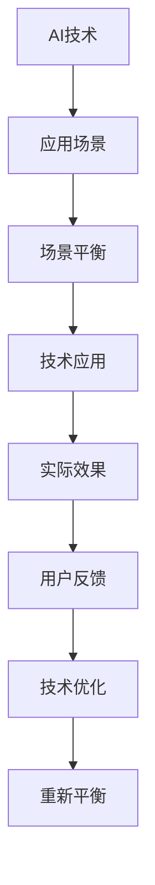

                 

# AI创业者面临的挑战：技术，应用和场景的平衡

## 1. 背景介绍

随着人工智能技术的飞速发展，越来越多的创业者被人工智能的潜力所吸引，希望通过AI技术实现突破。然而，技术、应用和场景之间的平衡成为制约AI创业成功的关键因素。本文将深入探讨AI创业者在技术、应用和场景平衡过程中所面临的挑战，并给出相应的解决方案。

## 2. 核心概念与联系

### 2.1 核心概念概述

在探讨AI创业者的挑战之前，首先需要理解几个核心概念：

- **AI技术**：包括机器学习、深度学习、自然语言处理、计算机视觉等领域的先进技术。
- **应用场景**：AI技术在不同行业中的应用，如医疗、金融、教育、智能家居等。
- **场景平衡**：将AI技术与特定应用场景相结合，最大化技术优势，最小化技术难度，并确保技术在应用场景中的实际效果。

这三大概念之间有着密切的联系。AI技术为应用场景提供了可能，而应用场景则决定了AI技术的具体应用方向和形式。场景平衡则是确保AI技术有效应用的关键。

### 2.2 核心概念原理和架构的 Mermaid 流程图



## 3. 核心算法原理 & 具体操作步骤

### 3.1 算法原理概述

场景平衡的算法原理是：通过选择合适的AI技术和优化技术应用，结合具体的应用场景，使得技术在实际应用中达到最佳效果。这个过程通常分为以下几个步骤：

1. **需求分析**：分析应用场景中的需求，确定需要解决的核心问题。
2. **技术选型**：根据需求分析结果，选择最适合的AI技术和模型。
3. **技术应用**：将选定的技术应用于具体的应用场景中。
4. **效果评估**：评估技术应用的效果，根据实际结果进行调整。
5. **持续优化**：不断优化技术应用，提升实际效果。

### 3.2 算法步骤详解

#### 3.2.1 需求分析

需求分析是场景平衡的第一步。创业者需要深入了解目标应用场景的需求，明确问题的核心，如数据质量、计算资源、用户需求等。需求分析可以通过以下步骤进行：

1. **数据调研**：收集目标应用场景下的数据，了解数据的特征、质量和可用性。
2. **用户访谈**：与目标用户进行访谈，了解他们的需求、期望和痛点。
3. **市场调研**：了解市场竞争情况，分析竞争对手的技术应用和效果。

#### 3.2.2 技术选型

技术选型是场景平衡的关键步骤。选择合适的技术不仅需要考虑其技术先进性，还需要结合应用场景的具体需求和资源限制。技术选型可以从以下几个方面进行：

1. **技术成熟度**：选择已经经过广泛应用和验证的技术，避免选择过于前沿但成熟度不足的技术。
2. **技术适配性**：选择与目标应用场景高度适配的技术，确保技术的适用性和可行性。
3. **技术成本**：综合考虑技术的开发成本、维护成本和实施成本，选择性价比最高的技术方案。

#### 3.2.3 技术应用

技术应用是将选定的技术实际应用于目标应用场景中的过程。技术应用需要考虑以下几个方面：

1. **数据预处理**：对目标数据进行清洗、归一化、特征工程等预处理操作，确保数据质量。
2. **模型训练**：根据选定的技术方案，对模型进行训练和优化，确保模型性能。
3. **模型部署**：将训练好的模型部署到实际应用环境中，并进行测试和验证。

#### 3.2.4 效果评估

效果评估是评估技术应用效果的关键步骤。效果评估可以从以下几个方面进行：

1. **指标设定**：根据应用场景的具体需求，设定合适的评估指标，如准确率、召回率、F1分数等。
2. **数据测试**：使用测试集对模型进行测试，评估模型的性能。
3. **用户反馈**：收集用户对模型效果的反馈，了解模型的实际效果和用户体验。

#### 3.2.5 持续优化

持续优化是确保技术应用效果不断提升的过程。持续优化可以从以下几个方面进行：

1. **反馈机制**：建立用户反馈机制，及时获取用户反馈，了解模型的不足之处。
2. **数据更新**：定期更新训练数据，确保模型能够应对新的数据变化。
3. **技术迭代**：根据用户反馈和技术发展，不断迭代和优化模型，提升模型性能。

### 3.3 算法优缺点

#### 3.3.1 优点

场景平衡算法的主要优点包括：

1. **最大化技术优势**：通过选择合适的技术和优化技术应用，最大化技术在应用场景中的优势。
2. **最小化技术难度**：通过需求分析和技术选型，最小化技术应用的难度和复杂度。
3. **提升实际效果**：通过效果评估和持续优化，确保技术在应用场景中的实际效果。

#### 3.3.2 缺点

场景平衡算法的主要缺点包括：

1. **技术选型难度大**：选择适合特定应用场景的技术需要综合考虑多个因素，难度较大。
2. **需求变化风险**：需求分析可能会受到市场变化、用户反馈等因素的影响，存在需求变化的风险。
3. **技术更新速度快**：AI技术发展迅速，需要不断关注新技术的发展和应用，增加维护和优化的难度。

### 3.4 算法应用领域

场景平衡算法在AI创业中具有广泛的应用领域，包括但不限于：

1. **医疗**：通过机器学习技术，实现疾病诊断、药物研发等。
2. **金融**：通过自然语言处理技术，实现智能客服、风险控制等。
3. **教育**：通过计算机视觉技术，实现智能辅导、学习推荐等。
4. **智能家居**：通过语音识别技术，实现智能音箱、智能安防等。
5. **自动驾驶**：通过计算机视觉和深度学习技术，实现车辆自动导航等。

## 4. 数学模型和公式 & 详细讲解 & 举例说明

### 4.1 数学模型构建

为了更好地理解场景平衡的算法原理，我们引入一个简单的数学模型。假设目标应用场景为医疗诊断，AI技术为深度学习模型，设定的评估指标为准确率（Accuracy）和召回率（Recall）。

模型构建过程如下：

1. **输入数据**：从医疗数据库中收集患者的病历数据，作为模型的输入。
2. **模型训练**：使用深度学习模型对病历数据进行训练，学习患者的疾病特征。
3. **模型测试**：使用测试集对训练好的模型进行测试，评估其准确率和召回率。
4. **模型优化**：根据测试结果，对模型进行优化，提升其性能。

### 4.2 公式推导过程

以准确率和召回率的计算公式为例：

准确率（Accuracy）定义为：

$$
Accuracy = \frac{TP+TN}{TP+TN+FP+FN}
$$

召回率（Recall）定义为：

$$
Recall = \frac{TP}{TP+FN}
$$

其中，TP表示真阳性（True Positive），TN表示真阴性（True Negative），FP表示假阳性（False Positive），FN表示假阴性（False Negative）。

### 4.3 案例分析与讲解

以医疗诊断为例，模型的准确率和召回率可以通过以下步骤进行计算：

1. **数据集划分**：将病历数据集划分为训练集、验证集和测试集。
2. **模型训练**：使用深度学习模型对训练集进行训练，得到模型参数。
3. **模型测试**：使用测试集对训练好的模型进行测试，计算准确率和召回率。
4. **结果分析**：根据测试结果，分析模型的优缺点，决定是否需要调整模型参数或重新训练模型。

## 5. 项目实践：代码实例和详细解释说明

### 5.1 开发环境搭建

在进行项目实践之前，需要搭建好开发环境。以下是一个典型的Python开发环境搭建过程：

1. **安装Python**：从官网下载并安装Python。
2. **安装Pip**：使用以下命令安装Pip：`python -m pip install pip`
3. **创建虚拟环境**：使用以下命令创建虚拟环境：`pip install virtualenv`
4. **激活虚拟环境**：使用以下命令激活虚拟环境：`source env/bin/activate`
5. **安装依赖库**：使用以下命令安装项目所需的依赖库：`pip install -r requirements.txt`

### 5.2 源代码详细实现

以下是一个简单的医疗诊断项目实现示例：

```python
# 导入依赖库
import pandas as pd
import numpy as np
from sklearn.model_selection import train_test_split
from sklearn.ensemble import RandomForestClassifier
from sklearn.metrics import accuracy_score, recall_score

# 读取数据集
data = pd.read_csv('patient_data.csv')

# 数据预处理
# 数据清洗、特征选择、数据归一化等

# 划分数据集
train_data, test_data, train_labels, test_labels = train_test_split(data, labels, test_size=0.2)

# 模型训练
model = RandomForestClassifier()
model.fit(train_data, train_labels)

# 模型测试
predictions = model.predict(test_data)
accuracy = accuracy_score(test_labels, predictions)
recall = recall_score(test_labels, predictions)

# 输出结果
print('Accuracy:', accuracy)
print('Recall:', recall)
```

### 5.3 代码解读与分析

在这个简单的医疗诊断项目中，代码实现了以下步骤：

1. **数据读取**：使用Pandas库读取病历数据集。
2. **数据预处理**：包括数据清洗、特征选择、数据归一化等步骤。
3. **数据划分**：使用Scikit-learn库将数据集划分为训练集和测试集。
4. **模型训练**：使用随机森林算法对训练集进行训练，得到模型参数。
5. **模型测试**：使用测试集对训练好的模型进行测试，计算准确率和召回率。

## 6. 实际应用场景

### 6.1 医疗

在医疗领域，场景平衡技术可以用于疾病诊断、药物研发等方面。例如，通过深度学习技术，对患者的病历数据进行建模，可以预测患者的疾病类型，提高诊断的准确率和效率。

### 6.2 金融

在金融领域，场景平衡技术可以用于风险控制、智能客服等方面。例如，通过自然语言处理技术，分析客户的金融交易记录，预测其未来的交易行为，实现风险预警和智能客服。

### 6.3 教育

在教育领域，场景平衡技术可以用于智能辅导、学习推荐等方面。例如，通过计算机视觉技术，分析学生的学习行为，为其推荐适合的课程和学习资源，提升学习效果。

### 6.4 未来应用展望

未来，场景平衡技术将会在更多领域得到应用，为各行各业带来变革性影响。例如，在智能家居、自动驾驶、智能制造等领域，通过场景平衡技术，可以更好地实现智能化、自动化，提升用户体验和效率。

## 7. 工具和资源推荐

### 7.1 学习资源推荐

为了帮助AI创业者掌握场景平衡技术，推荐以下学习资源：

1. **《机器学习实战》**：一本介绍机器学习算法的经典书籍，适合初学者入门。
2. **Coursera《机器学习》课程**：由斯坦福大学教授Andrew Ng开设的机器学习课程，内容系统全面，讲解深入浅出。
3. **Kaggle竞赛**：参加Kaggle机器学习竞赛，积累实战经验，提升技术水平。
4. **GitHub开源项目**：关注GitHub上的开源机器学习项目，学习优秀代码，提升技术能力。

### 7.2 开发工具推荐

以下推荐几个常用的开发工具，适合AI创业者使用：

1. **Jupyter Notebook**：一个免费的交互式笔记本环境，支持Python代码的编写和运行。
2. **Google Colab**：Google提供的在线Jupyter Notebook环境，可以免费使用GPU计算资源。
3. **PyCharm**：一款流行的Python IDE，支持代码编辑、调试和测试等功能。

### 7.3 相关论文推荐

以下是几篇关于场景平衡技术的经典论文，推荐阅读：

1. **《Deep Learning for Healthcare》**：介绍深度学习在医疗领域的应用，涵盖疾病诊断、药物研发等方面。
2. **《NLP-Based Financial Services》**：介绍自然语言处理技术在金融领域的应用，涵盖智能客服、风险控制等方面。
3. **《AI in Education》**：介绍AI技术在教育领域的应用，涵盖智能辅导、学习推荐等方面。

## 8. 总结：未来发展趋势与挑战

### 8.1 研究成果总结

场景平衡技术在AI创业中已经得到了广泛应用，取得了显著的效果。未来，场景平衡技术将继续发展，在更多领域发挥重要作用。

### 8.2 未来发展趋势

未来，场景平衡技术将呈现以下几个发展趋势：

1. **技术自动化**：通过自动化工具，减少人工干预，提升技术应用的效率。
2. **模型集成**：将多种技术模型进行集成，提升技术应用的灵活性和适用性。
3. **数据驱动**：通过大数据技术，提供更精准、更全面的数据支持，提升技术应用的性能。
4. **跨领域应用**：将场景平衡技术应用于更多领域，推动各行各业的智能化发展。

### 8.3 面临的挑战

尽管场景平衡技术在AI创业中取得了显著的效果，但仍面临以下几个挑战：

1. **技术难度高**：选择适合特定应用场景的技术需要综合考虑多个因素，难度较大。
2. **数据质量差**：部分应用场景下的数据质量较差，需要进一步清洗和处理。
3. **模型过拟合**：部分模型可能存在过拟合问题，需要进一步优化和调整。

### 8.4 研究展望

未来，场景平衡技术需要在以下几个方面进行深入研究：

1. **自动化技术**：开发更多的自动化工具，减少人工干预，提升技术应用的效率。
2. **跨领域应用**：将场景平衡技术应用于更多领域，推动各行各业的智能化发展。
3. **数据质量提升**：提升数据质量，确保数据的真实性和完整性。
4. **模型优化**：进一步优化模型，减少过拟合，提升模型性能。

## 9. 附录：常见问题与解答

**Q1：场景平衡技术的核心是什么？**

A: 场景平衡技术的核心在于将AI技术与具体的应用场景相结合，最大化技术优势，最小化技术难度，确保技术在实际应用中的效果。

**Q2：如何选择合适的AI技术？**

A: 选择合适的AI技术需要考虑技术成熟度、适配性、成本等多个因素。可以通过需求分析和技术调研，综合评估各种技术的优劣，选择最适合的技术。

**Q3：场景平衡技术在应用场景中的实际效果如何？**

A: 场景平衡技术在实际应用中已经取得了显著的效果，但也需要不断优化和调整，以适应不同应用场景的需求。

**Q4：场景平衡技术的未来发展方向是什么？**

A: 场景平衡技术的未来发展方向包括技术自动化、模型集成、数据驱动、跨领域应用等多个方面，需要不断探索和创新。

---

作者：禅与计算机程序设计艺术 / Zen and the Art of Computer Programming

