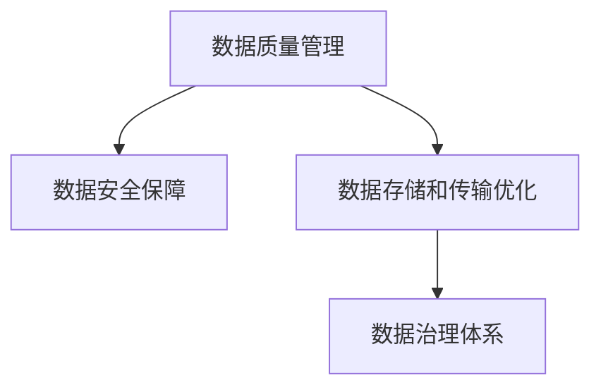

                 

# AI创业：数据管理的实战方案

> 关键词：AI创业,数据管理,实战方案,大数据,数据安全,数据治理

## 1. 背景介绍

### 1.1 问题由来
在AI创业领域，数据管理的复杂性和重要性日益凸显。数据是AI技术的核心资产，高质量的数据可以大幅提升模型性能，加速产品迭代。但随着数据量的指数级增长，数据管理面临的挑战也愈发严峻。如何高效、安全、可靠地管理大规模数据，成为AI创业公司的核心问题。

数据管理不当会导致诸多问题：
- **数据质量低下**：数据错误、缺失、重复等问题影响模型性能。
- **数据安全风险**：隐私泄露、数据被滥用等问题带来法律和声誉风险。
- **数据存储和传输成本高**：传统存储方式成本昂贵，难以适应快速数据增长。
- **数据可追溯性和可控性差**：缺乏系统化的数据生命周期管理，导致数据难以追踪和控制。

这些问题严重制约了AI创业公司的业务发展，甚至可能拖累公司核心竞争力。因此，探索和实践高效的数据管理方案，对于AI创业公司至关重要。

### 1.2 问题核心关键点
数据管理的关键在于建立一个完整、高效、可控的数据管理体系。其核心包括以下几个方面：

- **数据质量管理**：确保数据准确、完整、一致，提升模型性能。
- **数据安全保障**：保障数据隐私和安全，避免泄露和滥用。
- **数据存储和传输优化**：降低存储和传输成本，提高数据处理效率。
- **数据治理体系**：建立数据治理体系，规范数据生命周期管理。

这些核心问题共同构成了数据管理的全貌，需要通过系统的解决方案进行应对。本文将详细探讨这些关键点，并提出实用的实战方案。

## 2. 核心概念与联系

### 2.1 核心概念概述

为了更好地理解数据管理方案，本节将介绍几个密切相关的核心概念：

- **数据质量管理**：通过数据清洗、去重、标准化等手段，提升数据准确性和完整性。
- **数据安全保障**：包括数据加密、访问控制、隐私保护等措施，保障数据安全。
- **数据存储和传输优化**：通过分布式存储、数据压缩、网络优化等技术，降低存储和传输成本。
- **数据治理体系**：建立数据标准、流程、工具，规范数据生命周期管理，确保数据可追溯性和可控性。

这些核心概念之间的逻辑关系可以通过以下Mermaid流程图来展示：



这个流程图展示了大数据管理中的关键环节及其相互关系：

1. 数据质量管理提升数据准确性和完整性，是数据安全和管理的前提。
2. 数据安全保障通过加密、访问控制等措施，保障数据安全，防止数据泄露和滥用。
3. 数据存储和传输优化通过分布式存储、数据压缩等手段，降低成本，提高数据处理效率。
4. 数据治理体系通过规范数据标准和流程，保障数据可追溯性和可控性。

这些概念共同构成了大数据管理的完整框架，帮助AI创业公司全面应对数据管理挑战。

## 3. 核心算法原理 & 具体操作步骤
### 3.1 算法原理概述

数据管理方案的核心在于构建一个高效、可控的数据处理体系。该体系通过数据质量管理、数据安全保障、数据存储和传输优化、数据治理体系等模块，实现数据的完整、安全、高效管理。

### 3.2 算法步骤详解

数据管理的步骤大致包括以下几个环节：

1. **数据收集和预处理**：从不同数据源收集数据，并进行清洗、去重、标准化等预处理操作。
2. **数据质量评估**：使用数据质量评估指标（如准确率、完整性、一致性等）评估数据质量，识别和修正数据问题。
3. **数据存储和传输优化**：根据数据特点选择合适的存储方式（如Hadoop、AWS S3等），进行数据压缩、网络优化等操作。
4. **数据安全保障**：采用数据加密、访问控制、隐私保护等措施，保障数据安全。
5. **数据治理和监控**：建立数据标准和流程，使用数据治理工具进行数据生命周期管理，监控数据使用情况。

### 3.3 算法优缺点

数据管理方案的优势在于：
1. **提升数据质量**：通过数据清洗和质量评估，提升数据准确性和完整性。
2. **保障数据安全**：采用多重安全措施，保障数据隐私和安全。
3. **降低存储成本**：通过优化存储方式和数据压缩等手段，降低数据存储和传输成本。
4. **增强数据可控性**：建立数据治理体系，规范数据生命周期管理。

但其缺点同样不可忽视：
1. **技术复杂度**：数据管理涉及多个环节，需要综合考虑多种技术手段。
2. **人力成本**：数据质量管理和安全保障需要大量人力投入。
3. **时间成本**：数据处理和治理需要耗费较长时间。
4. **系统维护难度**：数据管理方案需要持续维护和优化。

尽管存在这些缺点，但只要科学规划和精细管理，这些挑战是可以被克服的。

### 3.4 算法应用领域

数据管理方案广泛应用于各种AI创业场景，例如：

- **金融科技**：数据质量管理、数据安全保障在金融科技中尤为重要，直接关系到客户资金安全和隐私保护。
- **智能医疗**：数据质量管理、数据治理体系对医疗数据的准确性和可追溯性有严格要求，保障医疗决策的科学性和有效性。
- **自动驾驶**：数据质量管理、数据安全保障对自动驾驶系统的安全性和可靠性至关重要，影响着人类生命安全。
- **电子商务**：数据存储和传输优化、数据治理体系对电商平台的运营效率和用户满意度有重要影响，决定着平台的竞争力。
- **智能制造**：数据质量管理、数据安全保障对工业数据的准确性和安全性要求极高，保障生产安全和数据隐私。

除了上述这些典型场景外，数据管理方案在更多行业领域也有广泛应用，为各类AI应用提供了坚实的支撑。

## 4. 数学模型和公式 & 详细讲解 & 举例说明（备注：数学公式请使用latex格式，latex嵌入文中独立段落使用 $$，段落内使用 $)
### 4.1 数学模型构建

数据管理涉及多个数学模型，本文以数据质量评估模型为例进行详细讲解。

数据质量评估通常使用多维数据质量指标，包括：
- **准确性(Accuracy)**：评估数据中正确信息的比例。
- **完整性(Completeness)**：评估数据中完整信息的比例。
- **一致性(Consistency)**：评估数据中一致信息的比例。
- **及时性(Timeliness)**：评估数据更新的及时性。
- **唯一性(Uniqueness)**：评估数据中唯一信息的数量。

设数据集为 $D=\{(x_i,y_i)\}_{i=1}^N$，其中 $x_i$ 为特征向量，$y_i$ 为标签。定义数据质量评估函数 $Q(D)$，包括：

$$
Q(D) = Q_{Accuracy}(D) + Q_{Completeness}(D) + Q_{Consistency}(D) + Q_{Timeliness}(D) + Q_{Uniqueness}(D)
$$

其中：

$$
Q_{Accuracy}(D) = \frac{\sum_{i=1}^N \text{Accuracy}(x_i)}{N}
$$

$$
Q_{Completeness}(D) = \frac{\sum_{i=1}^N \text{Completeness}(x_i)}{N}
$$

$$
Q_{Consistency}(D) = \frac{\sum_{i=1}^N \text{Consistency}(x_i)}{N}
$$

$$
Q_{Timeliness}(D) = \frac{\sum_{i=1}^N \text{Timeliness}(x_i)}{N}
$$

$$
Q_{Uniqueness}(D) = \frac{\sum_{i=1}^N \text{Uniqueness}(x_i)}{N}
$$

每个质量指标的具体计算方法根据实际需求而定，可以是基于统计的方法，也可以是基于机器学习的方法。

### 4.2 公式推导过程

以上公式的推导过程基于数据质量评估的基本定义。具体来说，数据准确性指标 $Q_{Accuracy}$ 可以通过计算数据集中正确信息的比例来评估；数据完整性指标 $Q_{Completeness}$ 可以通过计算数据集中完整信息的比例来评估；数据一致性指标 $Q_{Consistency}$ 可以通过计算数据集中一致信息的比例来评估；数据及时性指标 $Q_{Timeliness}$ 可以通过计算数据更新及时性的平均时间间隔来评估；数据唯一性指标 $Q_{Uniqueness}$ 可以通过计算数据中唯一信息的数量来评估。

### 4.3 案例分析与讲解

以下通过一个简单的案例来说明数据质量评估模型的应用：

假设有一个电商平台的数据集 $D=\{(x_i,y_i)\}_{i=1}^N$，其中 $x_i$ 包含用户ID、商品ID、购买时间等特征，$y_i$ 表示是否购买了该商品。我们希望评估该数据集的质量。

1. **准确性评估**：计算每个用户ID对应的购买记录中，实际购买记录与标记的购买记录的准确比例。
2. **完整性评估**：计算每个用户ID对应的购买记录中，有购买记录的比例。
3. **一致性评估**：计算每个用户ID对应的购买记录中，购买记录与用户历史购买记录是否一致。
4. **及时性评估**：计算每个用户ID对应的购买记录中，最近一次购买记录与当前时间的间隔时间。
5. **唯一性评估**：计算每个用户ID对应的购买记录中，每个商品ID的唯一性。

通过这些评估指标，我们可以对数据集的整体质量进行全面评估，并针对性地进行数据清洗和质量提升。

## 5. 项目实践：代码实例和详细解释说明
### 5.1 开发环境搭建

在进行数据管理实践前，我们需要准备好开发环境。以下是使用Python进行Pandas开发的环境配置流程：

1. 安装Anaconda：从官网下载并安装Anaconda，用于创建独立的Python环境。

2. 创建并激活虚拟环境：
```bash
conda create -n data-manage python=3.8 
conda activate data-manage
```

3. 安装Pandas：从官网获取对应的安装命令。例如：
```bash
conda install pandas
```

4. 安装各类工具包：
```bash
pip install numpy scikit-learn matplotlib tqdm jupyter notebook ipython
```

完成上述步骤后，即可在`data-manage`环境中开始数据管理实践。

### 5.2 源代码详细实现

这里我们以数据质量评估为例，给出使用Pandas库进行数据质量分析的Python代码实现。

首先，定义数据集并加载：

```python
import pandas as pd

data = pd.read_csv('data.csv')
```

然后，计算每个特征的统计指标：

```python
from scipy import stats

# 准确性评估
accuracy = data['purchased'].sum() / len(data)

# 完整性评估
completeness = (data['purchased'].isnull().sum() / len(data)).mean()

# 一致性评估
consistency = (data.groupby('user_id')['purchased'].sum() == data['purchased']).sum() / len(data)

# 及时性评估
timeliness = (pd.to_datetime(data['purchase_time']) - data['purchase_time'].shift()).median()

# 唯一性评估
unique = data['product_id'].nunique() / len(data)
```

最后，计算数据集的整体质量：

```python
quality = accuracy + completeness + consistency + timeliness + unique
```

以上就是使用Pandas进行数据质量评估的完整代码实现。可以看到，Pandas提供了强大的数据处理和分析功能，能够快速进行各种统计计算和指标评估。

### 5.3 代码解读与分析

让我们再详细解读一下关键代码的实现细节：

**数据集加载**：
- 使用`pd.read_csv()`方法从文件中读取数据集，并将其加载到Pandas DataFrame中。

**准确性评估**：
- 通过`data['purchased'].sum()`计算购买记录的数量，`len(data)`计算总记录数，进而计算购买记录的准确比例。

**完整性评估**：
- 使用`data['purchased'].isnull().sum()`计算购买记录中缺失的记录数，`len(data)`计算总记录数，进而计算购买记录的完整比例。

**一致性评估**：
- 使用`groupby('user_id')['purchased'].sum()`计算每个用户ID对应的购买记录总和，再与`data['purchased']`比较，计算一致性比例。

**及时性评估**：
- 使用`pd.to_datetime()`将购买时间转换为时间戳，计算每次购买记录与前一次记录的时间间隔，再计算中位数。

**唯一性评估**：
- 使用`data['product_id'].nunique()`计算每个商品ID的唯一数量，`len(data)`计算总记录数，进而计算唯一性比例。

**数据质量计算**：
- 将各项指标相加，得到数据集的整体质量。

通过Pandas的强大功能，我们能够快速、准确地评估数据质量，为后续数据清洗和治理提供有力支持。

## 6. 实际应用场景
### 6.1 智能客服系统

在智能客服系统中，数据管理的重要性不言而喻。客服系统需要实时处理大量的客户咨询，数据质量直接影响着客服响应速度和准确性。通过建立数据质量管理体系，可以有效提升客服系统性能。

具体而言，可以采用以下措施：
1. **数据清洗**：定期对客服对话记录进行清洗，去除错误和冗余信息，确保数据准确性。
2. **数据一致性保障**：通过数据一致性检查，避免数据不一致带来的问题，确保客户咨询记录的完整性和一致性。
3. **数据及时性优化**：通过数据存储和传输优化，确保客户咨询记录的及时性，提升客服响应速度。
4. **数据安全保护**：采用数据加密和访问控制措施，保障客户咨询记录的隐私和安全。

通过这些措施，可以有效提升智能客服系统的数据质量，提高客户满意度，增强企业竞争力。

### 6.2 金融科技

在金融科技领域，数据安全和管理尤为关键。金融数据涉及用户隐私和金融安全，一旦泄露将带来严重后果。通过建立数据安全保障体系，可以降低数据泄露风险，提升客户信任。

具体而言，可以采用以下措施：
1. **数据加密**：采用AES、RSA等加密算法，对金融数据进行加密保护。
2. **访问控制**：通过RBAC等访问控制机制，限制数据访问权限，防止数据被滥用。
3. **审计和监控**：建立数据访问日志和监控系统，实时监测数据访问行为，防止非法访问。
4. **隐私保护**：采用隐私计算技术，如多方安全计算、差分隐私等，保护用户隐私。

通过这些措施，可以构建一个安全可靠的数据管理体系，保障金融数据的隐私和安全。

### 6.3 智能医疗

在智能医疗领域，数据管理同样具有重要意义。医疗数据涉及患者隐私和医疗安全，必须严格管理和保护。通过建立数据质量管理体系，可以有效提升医疗决策的科学性和可靠性。

具体而言，可以采用以下措施：
1. **数据清洗和标准化**：定期对医疗数据进行清洗和标准化处理，确保数据准确性和一致性。
2. **数据治理体系**：建立数据标准和流程，规范数据生命周期管理，确保数据可追溯性和可控性。
3. **数据安全保护**：采用数据加密和访问控制措施，保障患者隐私和医疗数据安全。
4. **数据匿名化**：在数据使用过程中，采用数据匿名化技术，保护患者隐私。

通过这些措施，可以有效提升智能医疗系统数据质量，保障医疗决策的科学性和可靠性，增强患者信任。

## 7. 工具和资源推荐
### 7.1 学习资源推荐

为了帮助开发者系统掌握数据管理的理论基础和实践技巧，这里推荐一些优质的学习资源：

1. **《数据管理与大数据技术》系列书籍**：系统讲解数据管理的基本概念、技术和方法，适合深入学习。
2. **《数据科学与大数据技术》在线课程**：由知名大学和机构开设，覆盖数据管理、数据科学、大数据等广泛领域，适合系统学习。
3. **Kaggle竞赛**：参加Kaggle数据竞赛，实践数据清洗、数据处理、数据可视化等技能，提升实战能力。
4. **DataCamp平台**：提供数据管理和数据分析相关的在线课程和练习，适合快速上手。
5. **DataRobot平台**：提供自动化的数据治理和模型训练服务，适合快速部署和优化数据管理系统。

通过对这些资源的学习实践，相信你一定能够快速掌握数据管理的精髓，并用于解决实际的业务问题。

### 7.2 开发工具推荐

高效的开发离不开优秀的工具支持。以下是几款用于数据管理开发的常用工具：

1. **Pandas**：Python的强大数据处理库，提供丰富的数据清洗和分析功能，是数据管理的必备工具。
2. **Scikit-learn**：Python的数据分析和机器学习库，提供多种数据处理和模型训练算法。
3. **TensorFlow Data Validation (TFDV)**：Google提供的开源数据验证工具，支持多种数据格式和验证策略，适合大型数据集。
4. **Dask**：Python的分布式计算库，支持大规模数据处理和分析，适合大数据场景。
5. **Apache Hadoop**：分布式存储和计算框架，适合大规模数据存储和处理。
6. **AWS S3**：亚马逊提供的云存储服务，支持大规模数据存储和传输。

合理利用这些工具，可以显著提升数据管理的开发效率，加快创新迭代的步伐。

### 7.3 相关论文推荐

数据管理技术的发展源于学界的持续研究。以下是几篇奠基性的相关论文，推荐阅读：

1. **《数据清洗和处理技术》**：详细介绍数据清洗和处理的基本技术和方法，涵盖数据清洗、数据标准化、数据一致性等诸多方面。
2. **《大数据安全与隐私保护》**：探讨大数据时代的数据安全与隐私保护问题，提出多种数据安全技术和管理策略。
3. **《数据治理与数据管理》**：讲解数据治理的基本概念、技术和方法，强调数据生命周期管理和数据质量控制的重要性。
4. **《机器学习中的数据预处理技术》**：介绍机器学习中常用的数据预处理技术，包括数据清洗、数据标准化、数据增强等。
5. **《分布式数据存储与计算》**：探讨分布式存储和计算的基本技术和方法，适用于大规模数据管理场景。

这些论文代表了大数据管理技术的发展脉络。通过学习这些前沿成果，可以帮助研究者把握学科前进方向，激发更多的创新灵感。

## 8. 总结：未来发展趋势与挑战

### 8.1 总结

本文对数据管理方案进行了全面系统的介绍。首先阐述了数据管理的重要性和挑战，明确了数据质量管理、数据安全保障、数据存储和传输优化、数据治理体系等关键问题。其次，从原理到实践，详细讲解了数据管理的数学模型和具体操作步骤，给出了数据质量评估的完整代码实现。同时，本文还探讨了数据管理在智能客服、金融科技、智能医疗等多个行业领域的应用前景，展示了数据管理的广阔前景。

通过本文的系统梳理，可以看到，数据管理是大规模AI创业中不可或缺的重要环节。高效的数据管理可以提升模型性能，保障数据安全，降低成本，增强数据可控性，为AI应用提供坚实的基础。未来，伴随数据管理技术的不断进步，AI创业公司将能够更加高效地管理和利用数据资源，推动业务快速迭代和创新。

### 8.2 未来发展趋势

展望未来，数据管理技术将呈现以下几个发展趋势：

1. **数据质量自动化**：通过自动化工具和算法，自动进行数据清洗和质量评估，提高数据处理效率和准确性。
2. **数据安全保障升级**：采用最新的数据加密、访问控制、隐私保护技术，提升数据安全保障水平。
3. **分布式数据管理**：采用分布式存储和计算技术，支持大规模数据管理，降低成本和提升效率。
4. **数据治理体系完善**：建立更加完善的数据标准、流程和工具，规范数据生命周期管理。
5. **数据可视化增强**：通过数据可视化工具，实时监控数据使用情况，提升数据管理可视化水平。
6. **数据质量和性能双提升**：在保障数据质量的同时，优化数据存储和传输性能，提高数据管理效率。

以上趋势凸显了数据管理技术的广阔前景。这些方向的探索发展，必将进一步提升数据管理的效率和效果，为AI创业公司提供更加坚实的支撑。

### 8.3 面临的挑战

尽管数据管理技术已经取得了瞩目成就，但在迈向更加智能化、普适化应用的过程中，它仍面临诸多挑战：

1. **数据量大、复杂度高**：随着数据量的指数级增长，数据管理难度和复杂度也随之增加。如何高效管理海量数据，是数据管理的重要挑战。
2. **数据质量提升困难**：数据清洗和质量提升需要耗费大量时间和人力，尤其是在数据量大、质量差的情况下。如何自动化、智能化地提升数据质量，是数据管理的难点。
3. **数据安全和隐私保护**：数据安全和隐私保护是数据管理中的重要问题，尤其在大数据时代，数据泄露和滥用的风险更大。如何平衡数据使用和隐私保护，是数据管理的痛点。
4. **系统集成和互操作性**：数据管理涉及多种系统和工具，如何实现系统集成和互操作性，是数据管理的难点。
5. **数据治理和标准化**：数据治理和标准化是数据管理的核心，但如何制定统一的标准和规范，需要多方协作和协调。

这些挑战需要进一步深入研究和探索，才能更好地应对数据管理的复杂性和多样性。

### 8.4 研究展望

面向未来，数据管理技术还需要从多个方面进行突破：

1. **数据质量自动化**：开发更加智能化的数据质量管理工具，自动进行数据清洗、去重、标准化等操作，提升数据处理效率和准确性。
2. **数据安全保障强化**：采用最新的数据加密、访问控制、隐私保护技术，进一步提升数据安全保障水平。
3. **分布式数据管理优化**：优化分布式存储和计算技术，支持更大规模的数据管理，提高数据管理效率和可扩展性。
4. **数据治理体系完善**：建立更加完善的数据标准、流程和工具，规范数据生命周期管理，确保数据可追溯性和可控性。
5. **数据可视化工具升级**：开发更加高效的数据可视化工具，提升数据管理可视化水平，帮助管理者实时监控数据使用情况。
6. **数据治理与业务双融合**：将数据治理与业务需求紧密结合，提升数据管理的实用性和可操作性。

这些方向的探索发展，必将引领数据管理技术迈向更高的台阶，为AI创业公司提供更加坚实的支撑。

## 9. 附录：常见问题与解答

**Q1：数据质量管理如何提升数据准确性和完整性？**

A: 数据质量管理可以通过多种手段提升数据准确性和完整性，包括：
1. **数据清洗**：去除错误、重复、冗余数据，保留准确和完整的信息。
2. **数据标准化**：将不同来源的数据进行格式和结构统一，确保数据一致性。
3. **数据一致性检查**：通过比对不同数据源的数据，发现和修正不一致的信息。
4. **数据校验**：使用校验码、数字签名等技术，确保数据的完整性和准确性。

**Q2：数据安全保障有哪些措施？**

A: 数据安全保障可以通过以下措施：
1. **数据加密**：采用AES、RSA等加密算法，对数据进行加密保护。
2. **访问控制**：通过RBAC等访问控制机制，限制数据访问权限，防止数据滥用。
3. **审计和监控**：建立数据访问日志和监控系统，实时监测数据访问行为，防止非法访问。
4. **隐私保护**：采用隐私计算技术，如差分隐私、多方安全计算等，保护用户隐私。

**Q3：数据存储和传输优化有哪些方法？**

A: 数据存储和传输优化可以通过以下方法：
1. **分布式存储**：采用Hadoop、AWS S3等分布式存储技术，支持大规模数据存储和处理。
2. **数据压缩**：采用Gzip、Snappy等压缩算法，减少数据存储和传输成本。
3. **网络优化**：通过网络加速技术，如CDN、负载均衡等，提升数据传输速度。
4. **数据分片**：将大文件拆分成多个小文件，提高数据传输效率。

**Q4：数据治理体系如何建立？**

A: 数据治理体系可以通过以下步骤建立：
1. **数据标准制定**：制定统一的数据标准和规范，确保数据一致性和可比性。
2. **数据流程设计**：设计数据处理和管理的流程，明确数据生命周期管理。
3. **数据工具选择**：选择合适的数据治理工具，支持数据质量管理、数据清洗、数据安全保障等。
4. **数据监控和评估**：建立数据监控和评估机制，实时监控数据使用情况，及时发现和解决数据问题。

通过这些措施，可以有效建立数据治理体系，规范数据管理流程，确保数据可追溯性和可控性。

**Q5：数据管理的实际应用场景有哪些？**

A: 数据管理的实际应用场景包括：
1. **智能客服系统**：数据质量管理和安全保障，提升客服响应速度和准确性。
2. **金融科技**：数据安全和隐私保护，保障金融数据的安全性和隐私性。
3. **智能医疗**：数据质量管理和标准化，确保医疗数据的准确性和一致性。
4. **自动驾驶**：数据安全保护和隐私保护，保障自动驾驶系统的安全性和可靠性。
5. **电子商务**：数据存储和传输优化，提高电商平台的运营效率和用户体验。

除了这些典型场景外，数据管理在更多行业领域也有广泛应用，为各类AI应用提供坚实的数据基础。

---

作者：禅与计算机程序设计艺术 / Zen and the Art of Computer Programming

