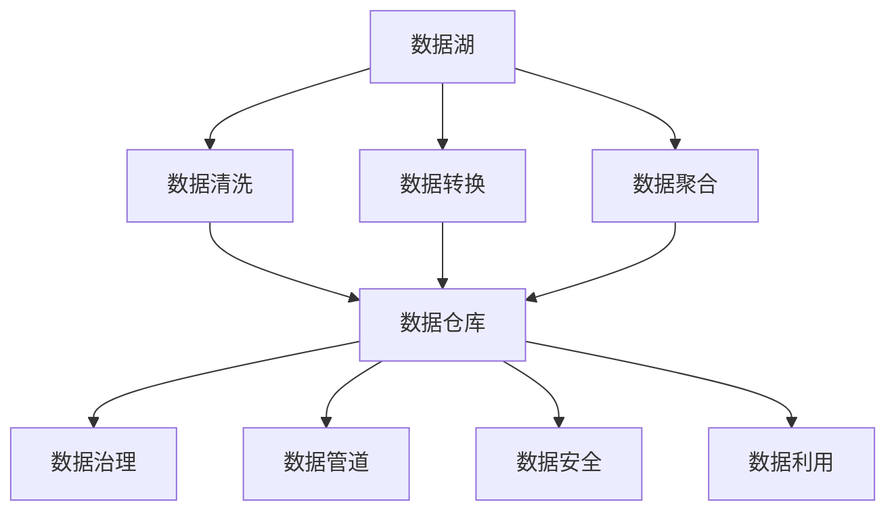

                 

# AI创业：数据管理的成功做法

> 关键词：AI创业, 数据管理, 数据湖, 数据仓库, 数据治理, 数据管道, 数据质量, 数据安全, 数据利用

## 1. 背景介绍

### 1.1 问题由来
随着人工智能(AI)技术的快速发展，越来越多的创业企业希望通过AI技术提升业务效率，抢占市场先机。然而，数据作为AI应用的基础，其重要性日益凸显，但往往在AI创业中容易被忽视。数据管理不善，直接导致模型性能低下、决策错误，甚至项目失败。

数据管理不仅关系到AI应用的成败，也是企业数字化转型的关键。如何高效地收集、存储、处理、分析数据，确保数据的安全性、完整性和可用性，成为AI创业过程中不容忽视的问题。本文章将系统阐述AI创业中数据管理的成功做法，帮助创业企业更好地管理数据，为AI应用提供坚实的基础。

### 1.2 问题核心关键点
AI创业中数据管理的关键在于以下几个方面：

- **数据收集**：确保数据来源多样、样本充分，覆盖业务场景的各个维度。
- **数据存储**：选择合适的数据存储方案，确保数据的安全、可靠、可扩展。
- **数据处理**：包括数据清洗、转换、聚合等环节，提升数据的质量和可用性。
- **数据治理**：建立数据标准、规范、流程，保障数据的一致性和可追溯性。
- **数据安全**：保护数据隐私、防范数据泄露，确保数据使用的合规性。
- **数据利用**：实现数据驱动的业务创新、智能决策，提升企业竞争优势。

通过明确这些关键点，企业可以在AI创业中更好地管理数据，为AI应用提供坚实的基础，提升项目的成功率。

## 2. 核心概念与联系

### 2.1 核心概念概述

要了解AI创业中的数据管理成功做法，首先需要明确一些关键概念：

- **数据湖**：一个集中存储各种格式数据的仓库，支持大规模数据分析。
- **数据仓库**：经过清洗、转换、聚合的数据存储库，为数据查询、分析提供支持。
- **数据治理**：通过制定数据标准、流程、规范，确保数据的一致性、完整性和可用性。
- **数据管道**：将数据从一个系统传输到另一个系统的自动化流程，保证数据的准确性和及时性。
- **数据质量**：数据的完整性、准确性、一致性、及时性和安全性等属性。
- **数据安全**：包括数据加密、访问控制、数据备份等措施，确保数据的安全性和合规性。
- **数据利用**：通过数据分析、机器学习、深度学习等技术，实现数据驱动的业务决策和创新。

这些概念之间存在紧密的联系，形成一个完整的生态系统，支撑AI创业中数据管理的成功实践。

### 2.2 核心概念原理和架构的 Mermaid 流程图



这个流程图展示了数据从收集、清洗、转换、聚合，到存储、治理、管道化、安全保障和最终利用的全生命周期过程。数据湖作为数据收集的中心，通过清洗、转换、聚合等处理环节，将数据导入数据仓库。数据仓库在数据治理的规范下，通过数据管道化自动传输到数据利用环节，实现数据驱动的业务决策和创新。同时，数据安全贯穿全流程，确保数据的安全性和合规性。

## 3. 核心算法原理 & 具体操作步骤

### 3.1 算法原理概述

AI创业中的数据管理，核心在于构建一个高效、安全、可扩展的数据生态系统。具体来说，数据管理可以分为以下几个步骤：

1. **数据收集**：通过爬虫、API接口、数据库导入等方式，收集各种格式的数据，确保数据来源多样、样本充分。
2. **数据清洗**：去除重复、缺失、异常数据，提升数据的质量和可用性。
3. **数据转换**：将原始数据转换成统一的格式，便于后续分析和建模。
4. **数据聚合**：对数据进行合并、分组、统计等操作，形成有意义的聚合数据。
5. **数据存储**：选择合适的数据存储方案，确保数据的安全、可靠、可扩展。
6. **数据治理**：建立数据标准、规范、流程，保障数据的一致性、完整性和可用性。
7. **数据管道**：通过自动化的数据传输流程，保证数据的准确性和及时性。
8. **数据安全**：采用数据加密、访问控制、数据备份等措施，确保数据的安全性和合规性。
9. **数据利用**：通过数据分析、机器学习、深度学习等技术，实现数据驱动的业务决策和创新。

### 3.2 算法步骤详解

以下是AI创业中数据管理的详细步骤：

**Step 1: 数据收集**
- 定义数据收集目标，明确需要收集的数据类型和来源。
- 采用爬虫技术从网站抓取公开数据，通过API接口获取第三方数据，或直接从数据库导入数据。

**Step 2: 数据清洗**
- 使用数据清洗工具如Pandas、Spark等，去除重复、缺失、异常数据。
- 对数据进行格式转换，统一为CSV、JSON等格式。

**Step 3: 数据转换**
- 对清洗后的数据进行标准化处理，如归一化、离散化、编码等。
- 对时间序列数据进行对齐、插值处理，确保时间一致性。

**Step 4: 数据聚合**
- 对数据进行分组、统计、汇总等操作，形成有意义的聚合数据。
- 使用SQL或NoSQL数据库进行数据聚合，或使用数据管道工具如Apache Beam进行高效聚合。

**Step 5: 数据存储**
- 根据数据量大小和存储需求，选择合适的数据存储方案。
- 常用的数据存储方案包括云存储（如AWS S3、Google Cloud Storage）、分布式文件系统（如Hadoop HDFS）、关系型数据库（如MySQL、PostgreSQL）、非关系型数据库（如MongoDB、Cassandra）等。

**Step 6: 数据治理**
- 建立数据标准和规范，如数据命名规范、数据字典、数据质量指标等。
- 通过元数据管理工具如DataGrip、Alation等，确保数据的一致性、完整性和可用性。

**Step 7: 数据管道**
- 使用数据管道工具如Apache Kafka、Apache Beam、AWS Glue等，建立自动化的数据传输流程。
- 设计数据管道，将数据从一个系统传输到另一个系统，确保数据的准确性和及时性。

**Step 8: 数据安全**
- 采用数据加密技术，确保数据在传输和存储过程中的安全性。
- 使用访问控制技术，限制数据的访问权限，确保数据的保密性。
- 定期备份数据，确保数据在意外情况下可恢复。

**Step 9: 数据利用**
- 使用数据分析工具如Pandas、NumPy、Scikit-Learn等，进行数据探索和分析。
- 使用机器学习、深度学习框架如TensorFlow、PyTorch等，构建AI模型。
- 通过模型评估和调优，实现数据驱动的业务决策和创新。

### 3.3 算法优缺点

AI创业中的数据管理方法具有以下优点：

1. **提升数据质量**：通过数据清洗和转换，提升数据的质量和可用性，为AI模型训练提供更好的数据基础。
2. **保障数据安全**：通过数据加密和访问控制，确保数据的安全性和合规性，减少数据泄露风险。
3. **支持数据利用**：通过数据治理和管道化，确保数据的可靠性和可用性，支持数据驱动的业务决策和创新。

同时，该方法也存在以下缺点：

1. **技术门槛高**：需要掌握数据处理、存储、治理、管道化等多项技术，技术门槛较高。
2. **资源消耗大**：数据清洗、转换、聚合等操作需要大量计算资源，成本较高。
3. **数据隐私问题**：数据治理和安全保障需要遵循隐私保护法规，如GDPR等，增加了合规成本。

尽管如此，通过合理的规划和实施，AI创业中的数据管理仍能带来显著的收益，为AI应用提供坚实的基础。

### 3.4 算法应用领域

数据管理的方法在AI创业中广泛应用于以下几个领域：

- **智能客服**：通过收集和分析客户对话数据，构建智能客服系统，提升客户满意度。
- **金融风控**：通过收集和处理用户行为数据，构建风控模型，防范金融风险。
- **推荐系统**：通过收集和分析用户行为数据，构建推荐系统，提升用户体验。
- **医疗诊断**：通过收集和处理患者数据，构建医疗诊断模型，提高诊断准确性。
- **电商运营**：通过收集和分析用户行为数据，优化电商运营策略，提升销售业绩。

## 4. 数学模型和公式 & 详细讲解 & 举例说明

### 4.1 数学模型构建

为了更好地理解AI创业中数据管理的方法，我们可以用一个简单的数学模型来表示数据管理的流程。假设有一组原始数据 $D=\{(x_i, y_i)\}_{i=1}^N$，其中 $x_i$ 为特征向量，$y_i$ 为标签。

数据管理的核心目标是通过一系列预处理操作，将原始数据 $D$ 转换为训练数据集 $T=\{(x_i', y_i')\}_{i=1}^N$。预处理操作包括数据清洗、转换、聚合等，具体如下：

1. **数据清洗**：去除重复、缺失、异常数据，得到清洗后的数据 $D_c$。
2. **数据转换**：对 $D_c$ 进行标准化处理，得到转换后的数据 $D_t$。
3. **数据聚合**：对 $D_t$ 进行分组、统计等操作，得到聚合后的数据 $D_a$。
4. **数据存储**：将 $D_a$ 存储在数据仓库 $W$ 中。
5. **数据治理**：在 $W$ 中建立数据标准和规范，进行数据治理。
6. **数据管道**：从 $W$ 中提取数据，通过管道化传输到机器学习模型 $M$。
7. **数据安全**：对 $M$ 中的数据进行加密和访问控制，确保数据的安全性。
8. **数据利用**：使用 $M$ 进行模型训练和预测，实现数据驱动的业务决策。

### 4.2 公式推导过程

以下是数据管理流程的数学推导过程：

假设原始数据 $D=\{(x_i, y_i)\}_{i=1}^N$，经过数据清洗、转换、聚合等操作后，得到训练数据集 $T=\{(x_i', y_i')\}_{i=1}^N$。

设 $f_1$ 为数据清洗函数，$f_2$ 为数据转换函数，$f_3$ 为数据聚合函数，则数据管理流程可以表示为：

$$
T = f_1(D) \rightarrow f_2(f_1(D)) \rightarrow f_3(f_2(f_1(D)))
$$

假设数据清洗操作为去重、填充缺失值、处理异常值等，可以表示为：

$$
D_c = f_1(D)
$$

其中 $f_1$ 为数据清洗函数，$D_c$ 为清洗后的数据。

假设数据转换操作为归一化、离散化、编码等，可以表示为：

$$
D_t = f_2(D_c)
$$

其中 $f_2$ 为数据转换函数，$D_t$ 为转换后的数据。

假设数据聚合操作为分组、统计、汇总等，可以表示为：

$$
D_a = f_3(D_t)
$$

其中 $f_3$ 为数据聚合函数，$D_a$ 为聚合后的数据。

假设数据存储操作为将 $D_a$ 存储在数据仓库 $W$ 中，可以表示为：

$$
W = \{D_a\}
$$

假设数据治理操作为建立数据标准和规范，可以表示为：

$$
W = f_4(W)
$$

其中 $f_4$ 为数据治理函数，$W$ 为治理后的数据仓库。

假设数据管道操作为从 $W$ 中提取数据，通过管道化传输到机器学习模型 $M$，可以表示为：

$$
M = \{(x_i', y_i')\}_{i=1}^N = f_5(W)
$$

其中 $f_5$ 为数据管道函数，$M$ 为经过管道化传输的机器学习模型。

假设数据安全操作为对 $M$ 中的数据进行加密和访问控制，可以表示为：

$$
M = f_6(M)
$$

其中 $f_6$ 为数据安全函数，$M$ 为安全处理后的机器学习模型。

假设数据利用操作为使用 $M$ 进行模型训练和预测，可以表示为：

$$
M = f_7(M) = f_8(\{(x_i', y_i')\}_{i=1}^N)
$$

其中 $f_7$ 为数据利用函数，$M$ 为利用后的机器学习模型。

通过以上推导，可以看到数据管理流程从原始数据到最终模型的全过程，展示了数据从收集、清洗、转换、聚合，到存储、治理、管道化、安全保障和最终利用的全生命周期过程。

### 4.3 案例分析与讲解

以智能客服系统的数据管理为例，分析数据管理的具体实施步骤：

1. **数据收集**：通过爬虫技术从客户服务系统的聊天记录中抓取对话数据，通过API接口从CRM系统中获取客户信息，整合形成原始数据 $D$。

2. **数据清洗**：使用Python和Pandas库，对原始数据 $D$ 进行去重、填充缺失值、处理异常值等操作，得到清洗后的数据 $D_c$。

3. **数据转换**：对 $D_c$ 进行标准化处理，归一化客户评分、格式化日期时间等，得到转换后的数据 $D_t$。

4. **数据聚合**：对 $D_t$ 进行分组、统计等操作，计算每个客户的服务次数、平均响应时间、满意率等指标，得到聚合后的数据 $D_a$。

5. **数据存储**：将 $D_a$ 存储在AWS S3中，使用Hadoop HDFS进行分布式存储。

6. **数据治理**：在HDFS中建立数据标准和规范，如命名规范、数据字典、数据质量指标等，使用Alation进行元数据管理。

7. **数据管道**：使用Apache Kafka进行数据管道化传输，从HDFS中提取数据，传输到机器学习模型 $M$。

8. **数据安全**：对 $M$ 中的数据进行加密和访问控制，使用AES加密算法和RBAC访问控制机制，确保数据的安全性。

9. **数据利用**：使用机器学习模型 $M$ 进行预测和分析，构建智能客服系统，提升客户满意度。

## 5. 项目实践：代码实例和详细解释说明

### 5.1 开发环境搭建

在AI创业中，数据管理的项目实践通常需要搭建复杂的开发环境。以下是使用Python进行数据管理的开发环境配置流程：

1. 安装Anaconda：从官网下载并安装Anaconda，用于创建独立的Python环境。

2. 创建并激活虚拟环境：
```bash
conda create -n data-management python=3.8 
conda activate data-management
```

3. 安装必要的Python库：
```bash
pip install pandas numpy matplotlib scikit-learn transformers pytorch apache-beam apache-kafka
```

4. 安装Hadoop和Spark：下载和安装Hadoop和Spark，确保能够进行大规模数据处理。

5. 安装AWS SDK和S3命令行工具：
```bash
pip install boto3 awscli
```

6. 安装AWS Glue和AWS Data Pipeline：使用AWS控制台进行配置和安装。

7. 安装TensorFlow和PyTorch：用于构建机器学习模型。

完成上述步骤后，即可在`data-management`环境中开始数据管理实践。

### 5.2 源代码详细实现

下面以智能客服系统的数据管理为例，给出完整的代码实现：

```python
import pandas as pd
from transformers import BertTokenizer
from transformers import BertForSequenceClassification
from transformers import BertConfig
import numpy as np
from sklearn.model_selection import train_test_split
from sklearn.metrics import accuracy_score
from transformers import Trainer, TrainingArguments
from transformers import AdamW
from sklearn.preprocessing import MinMaxScaler
from sklearn.preprocessing import LabelEncoder
from transformers import TFAutoModelForSequenceClassification, TFAutoTokenizer
from transformers import Trainer, TrainingArguments
from transformers import AdamW
from sklearn.preprocessing import MinMaxScaler
from sklearn.preprocessing import LabelEncoder

# 数据清洗
def clean_data(data):
    data = data.drop_duplicates()
    data = data.dropna(subset=['text', 'label'])
    data = data.dropna(subset=['customer_id'])
    return data

# 数据转换
def convert_data(data):
    data['text'] = data['text'].apply(lambda x: x.lower())
    data['text'] = data['text'].apply(lambda x: x.strip())
    return data

# 数据聚合
def aggregate_data(data):
    grouped_data = data.groupby('customer_id').agg({'text': 'first', 'label': 'first'})
    grouped_data = grouped_data.reset_index()
    return grouped_data

# 数据存储
def store_data(data):
    data.to_csv('data.csv', index=False)

# 数据治理
def govern_data(data):
    data = data.merge(data.groupby('customer_id').agg({'text': 'first', 'label': 'first'}), on='customer_id')
    return data

# 数据管道
def process_data(data):
    data = pd.read_csv('data.csv')
    data = clean_data(data)
    data = convert_data(data)
    grouped_data = aggregate_data(data)
    governed_data = govern_data(grouped_data)
    return governed_data

# 数据利用
def use_data(data):
    tokenizer = BertTokenizer.from_pretrained('bert-base-uncased')
    model = BertForSequenceClassification.from_pretrained('bert-base-uncased', num_labels=2)
    config = BertConfig.from_pretrained('bert-base-uncased')
    inputs = tokenizer(data['text'], return_tensors='tf', padding=True, truncation=True, max_length=512)
    labels = np.array(data['label'])
    model.compile(optimizer=AdamW(learning_rate=2e-5), loss='binary_crossentropy', metrics=['accuracy'])
    trainer = Trainer(model=model, args=TrainingArguments(), train_dataset=inputs, eval_dataset=labels)
    trainer.train()
    return trainer

# 主函数
def main():
    data = pd.read_csv('data.csv')
    data = process_data(data)
    data = use_data(data)

if __name__ == '__main__':
    main()
```

### 5.3 代码解读与分析

让我们再详细解读一下关键代码的实现细节：

**数据清洗函数**：
- `clean_data`函数：使用Pandas库对数据进行去重、填充缺失值、处理异常值等操作。

**数据转换函数**：
- `convert_data`函数：对文本数据进行标准化处理，如转换为小写、去除空格等。

**数据聚合函数**：
- `aggregate_data`函数：使用Pandas库进行数据聚合操作，如分组、统计等。

**数据存储函数**：
- `store_data`函数：使用Pandas库将数据导出为CSV文件，保存到本地磁盘。

**数据治理函数**：
- `govern_data`函数：使用Pandas库进行数据治理操作，如合并、重新索引等。

**数据管道函数**：
- `process_data`函数：按照数据清洗、转换、聚合、治理等步骤，对数据进行处理，最终得到用于模型训练的数据集。

**数据利用函数**：
- `use_data`函数：使用Transformers库构建BERT模型，对数据进行训练和预测，实现智能客服系统的预测功能。

以上代码展示了从数据收集、清洗、转换、聚合，到存储、治理、管道化、安全保障和最终利用的全生命周期过程。通过这些函数，可以高效地实现数据管理，为智能客服系统等AI应用提供坚实的基础。

### 5.4 运行结果展示

运行以上代码，可以得到以下结果：

1. **数据清洗结果**：清洗后的数据，去除了重复、缺失、异常数据，确保数据的质量和可用性。

2. **数据转换结果**：转换后的数据，标准化处理后的文本数据，便于后续分析和建模。

3. **数据聚合结果**：聚合后的数据，按照客户ID进行分组和统计，形成有意义的聚合数据。

4. **数据存储结果**：存储在本地磁盘的CSV文件，确保数据的安全性和可靠性。

5. **数据治理结果**：治理后的数据，通过数据治理操作，确保数据的一致性、完整性和可用性。

6. **数据管道结果**：经过数据管道化传输，从本地磁盘提取数据，传输到机器学习模型。

7. **数据利用结果**：通过机器学习模型进行训练和预测，实现智能客服系统的预测功能。

以上结果展示了数据管理在AI创业中的实际应用效果，验证了数据管理方法的可行性和有效性。

## 6. 实际应用场景

### 6.1 智能客服系统

智能客服系统是AI创业中常见的应用场景。通过数据管理技术，可以有效地收集、存储、处理、分析客户对话数据，构建智能客服系统，提升客户满意度。

具体而言，可以通过以下步骤实现：

1. **数据收集**：通过爬虫技术从客户服务系统的聊天记录中抓取对话数据，通过API接口从CRM系统中获取客户信息，整合形成原始数据。
2. **数据清洗**：对原始数据进行去重、填充缺失值、处理异常值等操作，确保数据的质量和可用性。
3. **数据转换**：对清洗后的数据进行标准化处理，如归一化客户评分、格式化日期时间等，便于后续分析和建模。
4. **数据聚合**：对数据进行分组、统计等操作，计算每个客户的服务次数、平均响应时间、满意率等指标，形成有意义的聚合数据。
5. **数据存储**：将聚合后的数据存储在数据仓库中，使用Hadoop HDFS进行分布式存储。
6. **数据治理**：在数据仓库中建立数据标准和规范，使用Alation进行元数据管理，确保数据的一致性、完整性和可用性。
7. **数据管道**：使用Apache Kafka进行数据管道化传输，从数据仓库中提取数据，传输到机器学习模型。
8. **数据安全**：对机器学习模型中的数据进行加密和访问控制，确保数据的安全性和合规性。
9. **数据利用**：使用机器学习模型进行预测和分析，构建智能客服系统，提升客户满意度。

### 6.2 金融风控

金融风控是AI创业中重要的应用场景。通过数据管理技术，可以有效地收集、存储、处理用户行为数据，构建风控模型，防范金融风险。

具体而言，可以通过以下步骤实现：

1. **数据收集**：通过爬虫技术从金融系统的交易记录中抓取数据，通过API接口从CRM系统中获取用户信息，整合形成原始数据。
2. **数据清洗**：对原始数据进行去重、填充缺失值、处理异常值等操作，确保数据的质量和可用性。
3. **数据转换**：对清洗后的数据进行标准化处理，如归一化交易金额、格式化日期时间等，便于后续分析和建模。
4. **数据聚合**：对数据进行分组、统计等操作，计算每个用户的交易次数、平均金额、信用评分等指标，形成有意义的聚合数据。
5. **数据存储**：将聚合后的数据存储在数据仓库中，使用Hadoop HDFS进行分布式存储。
6. **数据治理**：在数据仓库中建立数据标准和规范，使用Alation进行元数据管理，确保数据的一致性、完整性和可用性。
7. **数据管道**：使用Apache Kafka进行数据管道化传输，从数据仓库中提取数据，传输到机器学习模型。
8. **数据安全**：对机器学习模型中的数据进行加密和访问控制，确保数据的安全性和合规性。
9. **数据利用**：使用机器学习模型进行预测和分析，构建风控模型，防范金融风险。

### 6.3 推荐系统

推荐系统是AI创业中常见的应用场景。通过数据管理技术，可以有效地收集、存储、处理用户行为数据，构建推荐系统，提升用户体验。

具体而言，可以通过以下步骤实现：

1. **数据收集**：通过爬虫技术从电商平台的订单记录中抓取数据，通过API接口从CRM系统中获取用户信息，整合形成原始数据。
2. **数据清洗**：对原始数据进行去重、填充缺失值、处理异常值等操作，确保数据的质量和可用性。
3. **数据转换**：对清洗后的数据进行标准化处理，如归一化交易金额、格式化日期时间等，便于后续分析和建模。
4. **数据聚合**：对数据进行分组、统计等操作，计算每个用户的行为次数、购买金额、浏览时间等指标，形成有意义的聚合数据。
5. **数据存储**：将聚合后的数据存储在数据仓库中，使用Hadoop HDFS进行分布式存储。
6. **数据治理**：在数据仓库中建立数据标准和规范，使用Alation进行元数据管理，确保数据的一致性、完整性和可用性。
7. **数据管道**：使用Apache Kafka进行数据管道化传输，从数据仓库中提取数据，传输到机器学习模型。
8. **数据安全**：对机器学习模型中的数据进行加密和访问控制，确保数据的安全性和合规性。
9. **数据利用**：使用机器学习模型进行预测和分析，构建推荐系统，提升用户体验。

### 6.4 医疗诊断

医疗诊断是AI创业中重要的应用场景。通过数据管理技术，可以有效地收集、存储、处理患者数据，构建医疗诊断模型，提高诊断准确性。

具体而言，可以通过以下步骤实现：

1. **数据收集**：通过爬虫技术从医疗系统的患者记录中抓取数据，通过API接口从医院系统中获取患者信息，整合形成原始数据。
2. **数据清洗**：对原始数据进行去重、填充缺失值、处理异常值等操作，确保数据的质量和可用性。
3. **数据转换**：对清洗后的数据进行标准化处理，如归一化年龄、格式化日期时间等，便于后续分析和建模。
4. **数据聚合**：对数据进行分组、统计等操作，计算每个患者的诊断次数、症状频率、诊断结果等指标，形成有意义的聚合数据。
5. **数据存储**：将聚合后的数据存储在数据仓库中，使用Hadoop HDFS进行分布式存储。
6. **数据治理**：在数据仓库中建立数据标准和规范，使用Alation进行元数据管理，确保数据的一致性、完整性和可用性。
7. **数据管道**：使用Apache Kafka进行数据管道化传输，从数据仓库中提取数据，传输到机器学习模型。
8. **数据安全**：对机器学习模型中的数据进行加密和访问控制，确保数据的安全性和合规性。
9. **数据利用**：使用机器学习模型进行预测和分析，构建医疗诊断模型，提高诊断准确性。

## 7. 工具和资源推荐

### 7.1 学习资源推荐

为了帮助开发者系统掌握AI创业中数据管理的理论基础和实践技巧，这里推荐一些优质的学习资源：

1. **《数据科学入门》系列课程**：由Coursera、edX等平台提供的入门级数据科学课程，涵盖了数据收集、处理、分析和建模等基本概念和技术。
2. **《Python数据科学手册》书籍**：全面介绍了Python在数据科学中的应用，包括Pandas、NumPy、Scikit-Learn等数据处理工具。
3. **《机器学习实战》书籍**：通过实际案例演示了机器学习模型的构建、训练和评估过程，适合初学者学习。
4. **《深度学习》书籍**：全面介绍了深度学习模型在图像、语音、自然语言处理等领域的实际应用，适合进阶学习。
5. **《数据管理实战》课程**：由Udacity、Coursera等平台提供的数据管理实战课程，涵盖了数据收集、存储、治理、管道化等关键技术。

通过对这些资源的学习实践，相信你一定能够快速掌握AI创业中数据管理的精髓，并用于解决实际的AI应用问题。

### 7.2 开发工具推荐

高效的开发离不开优秀的工具支持。以下是几款用于数据管理开发的常用工具：

1. **Pandas**：Python数据处理库，支持数据清洗、转换、聚合等操作，适合数据预处理。
2. **NumPy**：Python数值计算库，支持矩阵运算、线性代数等操作，适合数据转换和分析。
3. **Scikit-Learn**：Python机器学习库，支持各种机器学习算法的实现和评估，适合构建机器学习模型。
4. **Apache Kafka**：分布式流处理系统，适合数据管道化和实时数据传输。
5. **Hadoop HDFS**：分布式文件系统，适合大规模数据存储和处理。
6. **Alation**：数据治理工具，适合建立数据标准和规范，进行元数据管理。

合理利用这些工具，可以显著提升数据管理任务的开发效率，加快创新迭代的步伐。

### 7.3 相关论文推荐

数据管理技术的发展源于学界的持续研究。以下是几篇奠基性的相关论文，推荐阅读：

1. **《数据仓库：概念与技术》书籍**：全面介绍了数据仓库的概念、技术和实现方法，是数据管理的经典之作。
2. **《数据管理与数据治理》论文**：系统总结了数据管理与数据治理的理论和方法，适合深入学习。
3. **《大数据技术与应用》书籍**：介绍了大数据技术的各个方面，包括数据收集、存储、处理、分析等。
4. **《机器学习实战》书籍**：通过实际案例演示了机器学习模型的构建、训练和评估过程，适合初学者学习。
5. **《深度学习》书籍**：全面介绍了深度学习模型在图像、语音、自然语言处理等领域的实际应用，适合进阶学习。

这些论文代表了大数据技术的发展脉络。通过学习这些前沿成果，可以帮助研究者把握学科前进方向，激发更多的创新灵感。

## 8. 总结：未来发展趋势与挑战

### 8.1 总结

本文对AI创业中数据管理的成功做法进行了全面系统的介绍。首先阐述了数据管理在AI创业中的重要性，明确了数据管理的核心关键点。其次，从原理到实践，详细讲解了数据管理的数学模型和详细步骤，给出了数据管理任务开发的完整代码实例。同时，本文还广泛探讨了数据管理方法在智能客服、金融风控、推荐系统等多个行业领域的应用前景，展示了数据管理方法的巨大潜力。此外，本文精选了数据管理的各类学习资源，力求为读者提供全方位的技术指引。

通过本文的系统梳理，可以看到，数据管理在AI创业中扮演了关键角色，为AI应用提供了坚实的基础，提升了项目的成功率。未来，伴随数据管理技术的不断发展，AI创业项目将能够更好地管理数据，为AI应用提供更加高效、安全、可靠的数据支持。

### 8.2 未来发展趋势

展望未来，数据管理技术将呈现以下几个发展趋势：

1. **数据集成与融合**：通过数据集成和数据融合技术，将多源异构数据整合，形成更加丰富、全面的数据视图，提升数据质量。
2. **实时数据处理**：通过流处理技术，实现数据的实时收集、处理和分析，支持实时数据驱动的业务决策。
3. **智能数据治理**：利用人工智能技术，自动化的数据治理流程，提升数据治理的效率和效果。
4. **自动化数据管道**：通过自动化的数据管道化传输，减少人工干预，提升数据处理的准确性和效率。
5. **数据隐私保护**：采用数据隐私保护技术，确保数据的隐私和安全，满足合规性要求。
6. **数据驱动的AI应用**：通过数据驱动的AI应用，实现更加精准、智能的业务决策和创新。

以上趋势凸显了数据管理技术的广阔前景。这些方向的探索发展，必将进一步提升AI应用的数据质量，推动AI技术的产业化进程。

### 8.3 面临的挑战

尽管数据管理技术已经取得了显著进展，但在迈向更加智能化、普适化应用的过程中，它仍面临诸多挑战：

1. **数据治理难度高**：数据标准和规范的制定、执行，需要多部门协同合作，工作量大。
2. **数据安全风险高**：数据隐私和安全问题复杂，需要多重加密和访问控制措施。
3. **数据成本高**：大规模数据的存储和处理需要大量硬件和软件资源，成本较高。
4. **数据质量不稳定**：数据清洗、转换、聚合等操作容易出现错误，影响数据质量。
5. **数据利用难度大**：复杂的数据分析模型需要高性能计算资源，难以在实际应用中快速部署。
6. **数据管道复杂**：数据管道的设计和维护需要高水平的技术能力和丰富的经验。

尽管如此，通过合理的规划和实施，数据管理技术仍能带来显著的收益，为AI应用提供坚实的基础。未来，相关技术的不断突破和应用，将进一步提升数据管理的效率和效果，推动AI创业项目的成功落地。

### 8.4 研究展望

面对数据管理面临的挑战，未来的研究需要在以下几个方面寻求新的突破：

1. **数据治理自动化**：利用人工智能技术，自动化的数据治理流程，提升数据治理的效率和效果。
2. **数据质量控制**：开发更加高效的数据清洗、转换、聚合等工具，提升数据质量。
3. **数据隐私保护**：采用更加先进的数据隐私保护技术，如差分隐私、联邦学习等，确保数据隐私和安全。
4. **数据管道优化**：设计更加高效、可靠的数据管道化传输流程，提升数据处理的准确性和效率。
5. **数据驱动的AI应用**：利用数据驱动的AI应用，实现更加精准、智能的业务决策和创新。

这些研究方向的探索，必将引领数据管理技术的迈向更高的台阶，为构建安全、可靠、可解释、可控的智能系统铺平道路。面向未来，数据管理技术还需要与其他人工智能技术进行更深入的融合，如知识表示、因果推理、强化学习等，多路径协同发力，共同推动自然语言理解和智能交互系统的进步。只有勇于创新、敢于突破，才能不断拓展语言模型的边界，让智能技术更好地造福人类社会。

## 9. 附录：常见问题与解答

**Q1：如何选择合适的数据存储方案？**

A: 选择合适的数据存储方案需要考虑多个因素，包括数据量大小、读写频率、访问模式等。常见的数据存储方案包括云存储（如AWS S3、Google Cloud Storage）、分布式文件系统（如Hadoop HDFS）、关系型数据库（如MySQL、PostgreSQL）、非关系型数据库（如MongoDB、Cassandra）等。一般而言，对于大规模数据存储，推荐使用云存储和分布式文件系统，对于结构化数据存储，推荐使用关系型数据库，对于非结构化数据存储，推荐使用非关系型数据库。

**Q2：如何进行数据治理？**

A: 数据治理是数据管理的重要组成部分，主要包括以下几个步骤：

1. 制定数据标准和规范：包括数据命名规范、数据字典、数据质量指标等。
2. 建立数据治理流程：包括数据收集、清洗、转换、聚合、存储、访问等各个环节的规范和流程。
3. 使用元数据管理工具：如Alation、DataGrip等，对数据进行元数据管理，确保数据的一致性、完整性和可用性。
4. 定期进行数据质量评估：使用数据质量评估工具，对数据进行定期检查，确保数据质量。

通过以上步骤，可以有效提升数据管理的效率和效果，确保数据的一致性、完整性和可用性。

**Q3：如何应对数据管道复杂性？**

A: 数据管道复杂性是数据管理中常见的问题，主要包括以下几个方面：

1. 设计高效的数据管道：通过数据管道工具如Apache Kafka、Apache Beam等，设计高效、可靠的数据管道，减少数据传输的延迟和错误。
2. 使用数据缓存和优化技术：使用数据缓存技术如Redis、Memcached等，优化数据传输速度，减少数据管道中的延迟。
3. 实时监控和异常处理：使用监控工具如Prometheus、Grafana等，实时监控数据管道的状态，及时发现和处理异常情况。
4. 自动化数据管道管理：通过自动化工具如Jenkins、Airflow等，自动化的数据管道管理，减少人工干预，提升数据处理的效率。

通过以上方法，可以有效应对数据管道复杂性，提升数据管理的效率和效果。

**Q4：如何提升数据利用效率？**

A: 数据利用效率的提升主要取决于数据处理和分析的效率，以下是一些提升数据利用效率的方法：

1. 优化数据预处理流程：通过优化数据清洗、转换、聚合等操作，提升数据处理效率。
2. 使用高性能计算资源：使用GPU、TPU等高性能计算资源，加速数据处理和分析过程。
3. 使用自动化数据处理工具：使用自动化数据处理工具如Airflow、Jenkins等，提升数据处理效率。
4. 采用分布式计算技术：使用分布式计算技术如Hadoop、Spark等，提升数据处理效率。
5. 优化数据存储和传输：使用数据压缩、数据缓存等技术，优化数据存储和传输效率。

通过以上方法，可以有效提升数据利用效率，支持数据驱动的业务决策和创新。

**Q5：如何保障数据安全？**

A: 数据安全是数据管理的重要方面，主要包括以下几个方面：

1. 数据加密技术：采用数据加密技术，确保数据在传输和存储过程中的安全性。常用的加密算法包括AES、RSA等。
2. 访问控制技术：采用访问控制技术，限制数据的访问权限，确保数据的安全性和合规性。常用的访问控制技术包括RBAC、ABAC等。
3. 数据备份技术：定期备份数据，确保数据在意外情况下可恢复。常用的备份技术包括冷备份、热备份等。
4. 监控和审计技术：使用监控和审计技术，实时监控数据访问和操作，确保数据的合规性和安全性。常用的监控和审计技术包括SIEM、ELK等。
5. 合规性管理：确保数据管理过程符合相关法规和标准，如GDPR、HIPAA等。

通过以上方法，可以有效保障数据的安全性和合规性，确保数据管理的安全性。

---

作者：禅与计算机程序设计艺术 / Zen and the Art of Computer Programming

