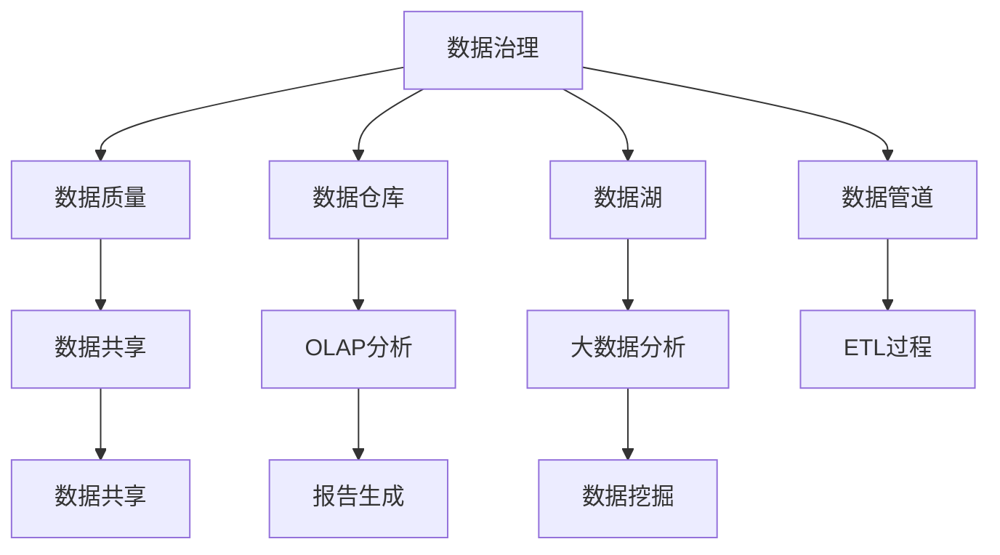

                 

# AI创业：数据管理的高效方法

> 关键词：AI创业, 数据管理, 高效方法, 数据治理, 大数据平台, 数据仓库, 数据湖, 数据管道, 数据质量, 数据安全, 数据治理工具

## 1. 背景介绍

### 1.1 问题由来
在人工智能(AI)领域，数据是驱动算法创新、提升模型性能的关键资源。随着AI技术的普及，越来越多的企业和创业公司开始将数据管理作为AI创业的核心。高效的数据管理不仅能够保证算法的可扩展性和可靠性，还能大幅提升项目的研发效率和市场竞争力。

然而，数据管理并非易事。特别是对于初创公司而言，由于资源和经验有限，往往面临数据分散、质量参差不齐、存储复杂等多重挑战。如何构建一个高效、灵活、安全的数据管理体系，成为每个AI创业者必须解决的问题。

### 1.2 问题核心关键点
高效的数据管理涉及到数据治理、数据仓库、数据湖、数据管道等多个方面。其主要难点在于：
- 数据质量控制：保证数据源的一致性、准确性和完整性。
- 数据集成与整合：将不同来源、不同格式的数据进行统一处理，构建统一的数据视图。
- 数据存储与检索：选择合适的数据存储方案，保证数据的可扩展性、可维护性和易用性。
- 数据安全与合规：确保数据隐私和合规，避免数据泄露和滥用。
- 数据共享与协作：建立数据共享机制，提升数据使用的透明度和可追溯性。

## 2. 核心概念与联系

### 2.1 核心概念概述

为更好地理解数据管理的高效方法，本节将介绍几个关键的概念和它们之间的联系：

- **数据治理(Data Governance)**：指对数据的规划、设计、创建、监管、维护和退休等全生命周期过程的管理。确保数据的质量、安全、合规和一致性。
- **数据仓库(Data Warehouse)**：一种用于存储、管理和分析企业数据的集中式数据存储系统。通常用于OLAP分析、报告生成和数据挖掘。
- **数据湖(Data Lake)**：一种更为灵活的数据存储架构，支持存储大量原始数据，包括结构化和非结构化数据，支持数据分析和挖掘。
- **数据管道(Data Pipeline)**：一种用于自动化数据流处理的技术，通过ETL过程，将数据从源系统抽取、转换、加载到目标系统。
- **数据质量(Data Quality)**：指数据的正确性、一致性、完整性、及时性和可用性。是数据治理的重要组成部分。
- **数据安全与合规(Data Security & Compliance)**：确保数据在使用过程中遵守法律法规和行业规范，保护数据隐私和安全。
- **数据共享与协作(Data Sharing & Collaboration)**：建立数据共享机制，提高数据使用的透明度和协作效率。

这些核心概念之间的逻辑关系可以通过以下Mermaid流程图来展示：



这个流程图展示了大数据管理的关键概念及其之间的关系：

1. 数据治理是数据管理的基础，确保数据的质量、安全与合规。
2. 数据仓库和数据湖是两种主要的数据存储架构，分别适用于结构化和非结构化数据。
3. 数据管道通过ETL过程，实现数据在源系统和目标系统之间的传输与转换。
4. 数据质量是数据治理的重要组成部分，保障数据的一致性和可靠性。
5. 数据共享与协作提高数据使用的透明度和效率。
6. 数据安全与合规保护数据隐私和合规，防止数据滥用。

## 3. 核心算法原理 & 具体操作步骤
### 3.1 算法原理概述

数据管理的高效方法，本质上是一种系统化的、工程化的数据治理策略。其核心思想是：通过定义明确的数据治理流程，结合先进的数据管理和分析工具，构建一个自上而下、无缝衔接的数据管理体系，确保数据的质量、安全、合规和一致性。

形式化地，假设数据管理流程包括数据采集、数据存储、数据处理、数据分析、数据共享等步骤，数据治理的目标是最小化数据管理成本，同时最大化数据的使用效率和价值。即：

$$
\text{数据治理} = \mathop{\arg\min}_{\text{流程}} \text{成本} + \text{时间} + \text{错误率} + \text{违规行为}
$$

其中成本包括硬件、软件、人力等投入，时间指数据管理流程的耗时，错误率指数据处理过程中的错误率，违规行为指数据处理过程中违反法规和规范的行为。

### 3.2 算法步骤详解

数据管理的高效方法主要包括以下几个关键步骤：

**Step 1: 数据治理框架设计**
- 设计数据治理框架，明确数据管理的目标、策略、流程和职责。
- 确定数据质量指标和监控机制，如数据一致性、准确性、完整性等。
- 制定数据安全与合规规范，包括数据分类、访问控制、审计记录等。

**Step 2: 数据仓库与数据湖建设**
- 选择合适的数据仓库和数据湖架构，如Apache Hive、Amazon Redshift、AWS Lake Formation等。
- 设计数据模型和表结构，确保数据的一致性和规范性。
- 建立数据导出和导入机制，保证数据的高效流动。

**Step 3: 数据管道设计与实现**
- 设计数据管道架构，明确数据源、数据流和数据目的。
- 选择适当的ETL工具，如Apache Nifi、AWS Glue等，进行数据抽取、转换和加载。
- 设置数据管道监控和告警机制，确保数据流动的稳定性和及时性。

**Step 4: 数据质量控制与优化**
- 定义数据质量指标，如数据一致性、完整性、准确性等。
- 设计数据清洗和验证规则，如缺失值处理、重复值检测、异常值剔除等。
- 使用数据质量工具，如IBM InfoSphere、Talend等，进行数据质量监控和优化。

**Step 5: 数据共享与协作**
- 设计数据共享机制，明确数据的访问权限和共享范围。
- 建立数据共享平台，如Airbyte、Stitch等，支持数据共享和协作。
- 实施数据共享协议和政策，确保数据使用的透明性和可追溯性。

**Step 6: 数据安全与合规**
- 制定数据安全策略，如加密存储、访问控制、审计记录等。
- 实施数据合规检查，确保数据处理符合法规和行业规范。
- 使用数据安全工具，如AWS GuardDuty、IBM Cloud Pak for Security等，提升数据安全性。

**Step 7: 数据治理工具部署**
- 选择合适的数据治理工具，如SAP Data Quality、Informatica Data Quality等。
- 部署和集成数据治理工具，确保数据治理流程的自动化和可控性。
- 实施数据治理流程的持续优化和改进，提升数据管理的效率和效果。

以上是数据管理高效方法的主要步骤，每个步骤都需要深入设计和实践，以构建一个全面、高效、灵活的数据管理体系。

### 3.3 算法优缺点

数据管理高效方法具有以下优点：
1. 系统化设计：通过制定明确的数据治理流程，系统化管理数据的全生命周期过程，避免数据混乱和冗余。
2. 自动化部署：使用先进的数据管理和分析工具，实现数据处理和分析的自动化，提升效率。
3. 可扩展性强：通过选择合适的数据仓库和数据湖架构，保证数据的可扩展性和可维护性。
4. 数据质量高：通过严格的数据质量控制，确保数据的准确性、一致性和完整性。
5. 安全性高：通过实施数据安全与合规策略，确保数据的安全性和合规性。

同时，该方法也存在一定的局限性：
1. 初始投入大：数据治理框架设计和工具部署需要较高的初始投入和专业技能。
2. 实施周期长：数据治理和优化需要持续的投入和改进，实施周期较长。
3. 灵活性不足：数据治理流程需要灵活应对数据分布和需求的变化，调整成本较高。

尽管存在这些局限性，但就目前而言，数据管理高效方法仍是最主流的数据治理范式。未来相关研究的重点在于如何进一步降低实施成本，提高数据管理的灵活性和效率。

### 3.4 算法应用领域

数据管理高效方法在AI创业中得到了广泛应用，主要体现在以下几个领域：

- **AI项目数据管理**：在AI项目开发过程中，通过系统化、工程化的数据治理，保证数据的质量、安全与合规，提升项目的研发效率和模型性能。
- **数据驱动的业务决策**：通过数据仓库和数据湖的建设，将大量原始数据转化为结构化数据，支持OLAP分析和报告生成，为业务决策提供数据支持。
- **大数据分析与挖掘**：通过数据管道的建设和优化，实现数据的自动化流动和转换，支持大规模数据分析和数据挖掘，发现数据中的潜在价值和知识。
- **数据共享与协作**：通过建立数据共享机制和协作平台，提高数据使用的透明度和效率，支持跨部门、跨项目的合作。
- **数据安全和合规**：通过制定和实施数据安全策略，保护数据隐私和安全，确保数据处理符合法规和规范，防范数据滥用和安全风险。

这些领域的数据管理实践，展示了数据管理高效方法的广泛应用和巨大潜力。

## 4. 数学模型和公式 & 详细讲解  
### 4.1 数学模型构建

本节将使用数学语言对数据管理的高效方法进行更加严格的刻画。

假设数据管理流程包含n个步骤，每个步骤的执行时间和成本为 $t_i$ 和 $c_i$，数据处理的错误率和违规行为的概率为 $e_i$ 和 $b_i$。则数据管理的总成本和总时间为：

$$
\text{总成本} = \sum_{i=1}^n c_i
$$

$$
\text{总时间} = \sum_{i=1}^n t_i
$$

$$
\text{错误率} = \sum_{i=1}^n e_i
$$

$$
\text{违规行为} = \sum_{i=1}^n b_i
$$

数据治理的目标是最大化数据的使用效率和价值，即：

$$
\text{数据治理} = \mathop{\arg\min}_{\text{流程}} \left(\sum_{i=1}^n c_i + \sum_{i=1}^n t_i + \sum_{i=1}^n e_i + \sum_{i=1}^n b_i\right)
$$

### 4.2 公式推导过程

以数据管道的设计为例，推导数据流处理时间的最小化公式。

假设数据管道包含m个节点，每个节点的处理时间为 $t_i$，数据传输时间为 $t_{\text{trans}}$，数据流量的单位流量为 $F$。则数据流处理时间 $T$ 可以表示为：

$$
T = \sum_{i=1}^m t_i + (m-1) t_{\text{trans}}
$$

其中，$\sum_{i=1}^m t_i$ 表示节点处理时间的总和，$(m-1) t_{\text{trans}}$ 表示数据传输时间的总和。

为了最小化数据流处理时间 $T$，需要优化节点处理时间和数据传输时间。一种简单的方法是优化节点的处理时间，即减少每个节点的处理时间 $t_i$，例如通过优化算法、改进硬件设备等。另一种方法是优化数据传输时间，例如通过增加传输带宽、优化传输协议等。

### 4.3 案例分析与讲解

以下以一个简单的数据管道案例，进一步分析数据流处理时间的优化过程。

**案例背景**：一个包含3个节点的数据管道，每个节点的处理时间和数据传输时间如下表所示：

| 节点编号 | 处理时间 $t_i$ | 数据传输时间 $t_{\text{trans}}$ |
| --- | --- | --- |
| 1 | 10秒 | 2秒 |
| 2 | 5秒 | 1秒 |
| 3 | 3秒 | 0.5秒 |

**计算数据流处理时间**：

$$
T = 10 + 5 + 3 + 2 \times 2 + 2 \times 1 + 2 \times 0.5 = 28秒
$$

**优化节点处理时间**：

假设通过优化算法将节点1的处理时间 $t_1$ 减少至5秒，其他节点保持不变，计算新的数据流处理时间：

$$
T = 5 + 5 + 3 + 2 \times 2 + 2 \times 1 + 2 \times 0.5 = 20秒
$$

优化后的数据流处理时间减少了8秒，提升了数据处理的效率。

## 5. 项目实践：代码实例和详细解释说明
### 5.1 开发环境搭建

在进行数据管理实践前，我们需要准备好开发环境。以下是使用Python进行Pyspark开发的环境配置流程：

1. 安装Anaconda：从官网下载并安装Anaconda，用于创建独立的Python环境。

2. 创建并激活虚拟环境：
```bash
conda create -n pyspark-env python=3.8 
conda activate pyspark-env
```

3. 安装Pyspark：根据CUDA版本，从官网获取对应的安装命令。例如：
```bash
conda install pyspark
```

4. 安装Spark SQL和MLlib：
```bash
conda install -c conda-forge pyspark=3.3.0=py3hdd6a16_0 pyspark-mllib=3.3.0=py3hdd6a16_0
```

5. 安装Spark DataFrames和MLlib：
```bash
conda install -c conda-forge pyspark=3.3.0=py3hdd6a16_0 pyspark-ml=3.3.0=py3hdd6a16_0
```

完成上述步骤后，即可在`pyspark-env`环境中开始数据管理实践。

### 5.2 源代码详细实现

下面我们以数据仓库和数据湖的建设为例，给出使用Pyspark进行数据管理的PyTorch代码实现。

首先，定义数据仓库和数据湖的创建函数：

```python
from pyspark.sql import SparkSession
from pyspark.sql.functions import create_table, column, desc
from pyspark.sql.types import StructType, StructField, StringType

spark = SparkSession.builder.appName("data_warehousing").getOrCreate()

# 创建数据仓库
def create_data_warehousing():
    # 创建数据仓库的Schema定义
    data_warehousing_schema = StructType([
        StructField("id", StringType(), True),
        StructField("name", StringType(), True),
        StructField("age", IntegerType(), True),
        StructField("gender", StringType(), True)
    ])
    
    # 创建数据仓库表
    spark.create_table("data_warehousing", data_warehousing_schema)
    
    # 插入数据
    spark.sql("INSERT INTO data_warehousing VALUES ('001', 'Tom', 25, 'M')")
    spark.sql("INSERT INTO data_warehousing VALUES ('002', 'Lucy', 28, 'F')")
    spark.sql("INSERT INTO data_warehousing VALUES ('003', 'John', 30, 'M')")
    
    # 查看数据仓库表
    spark.sql("SELECT * FROM data_warehousing")
```

然后，定义数据湖的创建和数据加载函数：

```python
# 创建数据湖
def create_data_lake():
    # 创建数据湖的Schema定义
    data_lake_schema = StructType([
        StructField("id", StringType(), True),
        StructField("name", StringType(), True),
        StructField("age", IntegerType(), True),
        StructField("gender", StringType(), True)
    ])
    
    # 创建数据湖表
    spark.create_table("data_lake", data_lake_schema)
    
    # 插入数据
    spark.sql("INSERT INTO data_lake VALUES ('001', 'Tom', 25, 'M')")
    spark.sql("INSERT INTO data_lake VALUES ('002', 'Lucy', 28, 'F')")
    spark.sql("INSERT INTO data_lake VALUES ('003', 'John', 30, 'M')")
    
    # 查看数据湖表
    spark.sql("SELECT * FROM data_lake")

# 加载数据到数据湖
def load_data_to_data_lake():
    # 从数据仓库导出数据
    data = spark.read.table("data_warehousing")
    
    # 加载到数据湖
    data.write.mode("overwrite").parquet("data_lake.parquet")
```

最后，启动数据仓库和数据湖的创建流程，并在数据湖上加载数据：

```python
create_data_warehousing()
create_data_lake()
load_data_to_data_lake()
```

以上就是使用Pyspark进行数据仓库和数据湖建设的完整代码实现。可以看到，Pyspark提供了丰富的数据管理功能，使得数据仓库和数据湖的建设和管理变得简单高效。

### 5.3 代码解读与分析

让我们再详细解读一下关键代码的实现细节：

**create_data_warehousing函数**：
- 定义数据仓库的Schema，包括字段类型和约束条件。
- 创建数据仓库表，插入示例数据。
- 查询数据仓库表，输出结果。

**create_data_lake函数**：
- 定义数据湖的Schema，与数据仓库的Schema类似。
- 创建数据湖表，插入示例数据。
- 查询数据湖表，输出结果。

**load_data_to_data_lake函数**：
- 从数据仓库导出数据。
- 将导出数据加载到数据湖。

以上代码展示了如何使用Pyspark进行数据仓库和数据湖的建设和管理。通过Pyspark的丰富功能，可以方便地进行数据采集、数据存储和数据处理，提升数据管理的效率和灵活性。

## 6. 实际应用场景
### 6.1 智能客服系统

基于数据管理高效方法，智能客服系统可以实现高效的数据治理和数据共享，提升系统的稳定性和可扩展性。具体而言，可以采用数据治理框架设计、数据管道设计和数据共享机制，来实现客户咨询数据的自动化处理和共享。

在技术实现上，可以设计一个包含多个节点的数据管道，实时收集和处理客户咨询数据，将处理后的数据存储到数据仓库或数据湖中。通过数据共享机制，将处理结果共享给不同的客服节点，支持多客服节点的协同工作。同时，使用数据治理工具进行数据质量监控和优化，保证数据的一致性和可靠性。

### 6.2 金融舆情监测

金融舆情监测系统需要实时监测大量的新闻、评论和社交媒体数据，从中提取有价值的信息。通过数据管理高效方法，可以实现数据的自动化采集、存储和分析，提升系统的实时性和准确性。

具体而言，可以设计一个包含数据采集、数据清洗、数据存储和数据分析等多个节点的数据管道，实时采集和处理金融数据。通过数据共享机制，将处理结果共享给舆情监测系统，支持实时舆情分析和预警。同时，使用数据治理工具进行数据质量监控和优化，确保数据的准确性和完整性。

### 6.3 个性化推荐系统

个性化推荐系统需要实时收集和处理用户行为数据，从中提取用户的兴趣和偏好。通过数据管理高效方法，可以实现数据的自动化处理和分析，提升推荐系统的准确性和个性化程度。

具体而言，可以设计一个包含数据采集、数据清洗、数据存储和数据分析等多个节点的数据管道，实时收集和处理用户行为数据。通过数据共享机制，将处理结果共享给推荐系统，支持实时推荐和个性化推荐。同时，使用数据治理工具进行数据质量监控和优化，确保数据的准确性和完整性。

### 6.4 未来应用展望

随着数据管理技术的不断发展，未来数据管理高效方法将呈现以下几个发展趋势：

1. **自动化与智能化**：自动化数据处理和分析将变得更加智能化，基于机器学习和人工智能技术，实现数据治理的自动化和智能化。
2. **数据治理平台化**：数据治理将变得更加平台化，通过统一的治理平台，实现数据的集中管理和统一处理。
3. **数据治理与云计算结合**：数据治理将与云计算平台深度结合，利用云计算的弹性和可扩展性，提升数据治理的效率和可靠性。
4. **数据治理与区块链结合**：数据治理将与区块链技术结合，实现数据的透明性、不可篡改性和可追溯性。
5. **数据治理与大数据分析结合**：数据治理将与大数据分析技术结合，实现数据的深度挖掘和知识发现。

以上趋势展示了数据管理高效方法的发展前景，通过不断创新和优化，数据管理技术将为AI创业提供更加高效、灵活、安全的数据治理支持。

## 7. 工具和资源推荐
### 7.1 学习资源推荐

为了帮助开发者系统掌握数据管理的高效方法，这里推荐一些优质的学习资源：

1. **《数据治理：理论与实践》系列博文**：由数据治理专家撰写，深入浅出地介绍了数据治理的理论基础和实践技巧。

2. **《数据仓库与数据湖》在线课程**：由知名大学和IT企业开设的在线课程，系统讲解数据仓库和数据湖的理论和应用。

3. **《数据管理基础》书籍**：详细介绍了数据管理的基本概念和核心技术，包括数据仓库、数据湖、数据管道等。

4. **《数据治理工具实战》书籍**：介绍了多种数据治理工具的实战应用，包括数据清洗、数据质量监控等。

5. **Kaggle数据治理竞赛**：参与数据治理竞赛，实践数据治理的最佳实践，提升数据治理技能。

通过对这些资源的学习实践，相信你一定能够快速掌握数据管理的高效方法，并用于解决实际的数据治理问题。

### 7.2 开发工具推荐

高效的数据管理离不开优秀的工具支持。以下是几款用于数据管理开发的常用工具：

1. **Pyspark**：Apache基金会开源的大数据处理框架，支持数据仓库和数据湖的构建和管理。

2. **AWS Data Pipeline**：Amazon Web Services提供的ETL服务，支持数据的自动化流动和转换。

3. **Informatica**：著名的数据治理工具，支持数据质量的监控和优化，提升数据治理的效率和效果。

4. **Talend**：开源的数据整合和数据治理工具，支持ETL和数据质量管理。

5. **Tableau**：可视化分析工具，支持数据的探索和可视化分析。

合理利用这些工具，可以显著提升数据管理的开发效率，加快数据治理的实施进程。

### 7.3 相关论文推荐

数据管理技术的发展源于学界的持续研究。以下是几篇奠基性的相关论文，推荐阅读：

1. **《数据治理框架设计与实践》**：介绍数据治理框架的设计和实现，系统讲解数据治理的理论和实践。

2. **《数据仓库与数据湖的构建与优化》**：详细讲解数据仓库和数据湖的构建和优化，提供丰富的案例和实战经验。

3. **《数据管道设计与优化》**：介绍数据管道的设计与优化，提供多种数据管道架构和实现方式。

4. **《数据质量控制与优化》**：详细介绍数据质量控制和优化的理论和方法，提供多种数据质量控制工具和实现方式。

5. **《数据治理与大数据分析结合》**：探索数据治理与大数据分析的结合方式，提供多种数据治理与大数据分析的实现方法。

这些论文代表了大数据管理的发展脉络。通过学习这些前沿成果，可以帮助研究者把握学科前进方向，激发更多的创新灵感。

## 8. 总结：未来发展趋势与挑战
### 8.1 总结

本文对数据管理的高效方法进行了全面系统的介绍。首先阐述了数据管理在AI创业中的重要性和挑战，明确了数据治理、数据仓库、数据湖、数据管道等关键概念及其之间的联系。其次，从原理到实践，详细讲解了数据治理的高效方法，给出了数据管理实践的完整代码实例。同时，本文还广泛探讨了数据管理方法在智能客服、金融舆情、个性化推荐等多个行业领域的应用前景，展示了数据管理方法的广泛应用和巨大潜力。此外，本文精选了数据管理技术的各类学习资源，力求为读者提供全方位的技术指引。

通过本文的系统梳理，可以看到，数据管理高效方法在AI创业中发挥了重要的作用，通过系统化、工程化的数据治理，保证数据的质量、安全与合规，提升数据管理的效率和效果。未来，伴随数据管理技术的不断演进，数据管理方法必将在更多领域得到应用，为AI创业带来更大的价值和潜力。

### 8.2 未来发展趋势

展望未来，数据管理高效方法将呈现以下几个发展趋势：

1. **自动化与智能化**：自动化数据处理和分析将变得更加智能化，基于机器学习和人工智能技术，实现数据治理的自动化和智能化。
2. **平台化与集成化**：数据治理将变得更加平台化，通过统一的治理平台，实现数据的集中管理和统一处理。
3. **云原生与分布式**：数据治理将与云计算平台深度结合，利用云计算的弹性和可扩展性，提升数据治理的效率和可靠性。
4. **区块链与透明度**：数据治理将与区块链技术结合，实现数据的透明性、不可篡改性和可追溯性。
5. **大数据与深度学习结合**：数据治理将与大数据分析技术结合，实现数据的深度挖掘和知识发现。

以上趋势凸显了数据管理高效方法的发展前景，通过不断创新和优化，数据管理技术将为AI创业提供更加高效、灵活、安全的数据治理支持。

### 8.3 面临的挑战

尽管数据管理高效方法已经取得了显著成果，但在迈向更加智能化、普适化应用的过程中，仍面临诸多挑战：

1. **初始成本高**：数据治理框架设计和工具部署需要较高的初始投入和专业技能，对中小型企业来说是一大挑战。
2. **实施周期长**：数据治理和优化需要持续的投入和改进，实施周期较长，影响项目的快速迭代。
3. **数据质量控制困难**：数据源多样、数据格式复杂，数据质量控制难度较大，需要投入大量时间和精力。
4. **数据隐私与安全**：数据隐私和安全问题不容忽视，如何在保障数据隐私的同时，提升数据使用的透明度和安全性，仍需深入探索。
5. **数据共享与协作复杂**：数据共享机制和协作平台的设计和实现较为复杂，需要考虑多个利益相关者的需求和利益。

尽管存在这些挑战，但通过不断优化和创新，数据管理高效方法必将在更多领域得到应用，为AI创业带来更大的价值和潜力。

### 8.4 研究展望

面对数据管理高效方法所面临的种种挑战，未来的研究需要在以下几个方面寻求新的突破：

1. **自动化与智能化**：开发更加自动化和智能化的数据治理工具，提升数据治理的效率和效果。
2. **数据质量控制**：研究更高效的数据质量控制方法，提升数据的一致性和可靠性。
3. **数据隐私与安全**：开发更加安全的数据治理工具，保障数据隐私和安全。
4. **数据共享与协作**：设计更加灵活和透明的数据共享机制，提升数据使用的透明度和协作效率。
5. **云原生与分布式**：探索云原生数据治理架构，利用云计算的弹性和可扩展性，提升数据治理的效率和可靠性。

这些研究方向将推动数据管理技术的不断演进，为AI创业提供更加高效、灵活、安全的数据治理支持。

## 9. 附录：常见问题与解答
**Q1：数据治理的高效方法如何保证数据的质量、安全与合规？**

A: 数据治理的高效方法通过系统化的数据治理流程，确保数据的完整性、一致性和安全性。具体措施包括：

1. **数据质量控制**：定义数据质量指标和监控机制，通过数据清洗、数据验证和异常值处理等方法，保证数据的一致性和准确性。

2. **数据安全与合规**：制定数据安全策略，如加密存储、访问控制、审计记录等，确保数据的安全性和合规性。

3. **数据治理工具**：使用先进的治理工具，如IBM InfoSphere、Informatica等，提升数据治理的效率和效果。

4. **数据共享与协作**：建立数据共享机制，明确数据的访问权限和共享范围，提高数据使用的透明度和可追溯性。

通过这些措施，可以有效地保障数据的质量、安全与合规，为数据驱动的AI应用提供可靠的数据支持。

**Q2：如何设计高效的数据管道？**

A: 设计高效的数据管道需要考虑以下几个关键因素：

1. **数据源与目标**：明确数据管道的数据源和目标系统，选择适合的数据抽取和加载工具。

2. **数据处理流程**：设计数据处理的流程和节点，合理分配处理任务，减少数据处理的延迟。

3. **数据传输机制**：优化数据传输机制，如使用压缩、分块传输等方法，提升数据传输效率。

4. **数据质量控制**：在数据管道中加入数据清洗和验证环节，保证数据的一致性和准确性。

5. **数据监控与告警**：实时监控数据管道的运行状态，设置告警机制，及时发现和处理异常情况。

6. **数据管道工具**：选择合适的数据管道工具，如Apache Nifi、AWS Glue等，提升数据处理的自动化和可控性。

通过这些步骤，可以设计出高效、可靠的数据管道，支持数据的自动化处理和分析。

**Q3：数据治理的高效方法是否适用于所有行业？**

A: 数据治理的高效方法适用于大多数行业，特别是数据密集型行业。例如金融、电商、医疗、制造等。但在一些特殊行业，如国防、政府、司法等，由于数据隐私和安全要求极高，需要更加严格的数据治理策略和合规措施。此外，对于一些特定领域的任务，如医疗诊断、法律咨询等，数据治理方法也需要针对性地进行设计和优化。

**Q4：数据治理的高效方法是否需要高成本的初始投入？**

A: 数据治理的高效方法需要一定的初始投入，包括数据治理框架的设计和工具的部署。但通过系统化、工程化的数据治理，可以在数据管理的全生命周期中大幅提升数据的使用效率和价值，最终实现更高的投资回报率。

**Q5：如何应对数据治理的实施周期长问题？**

A: 数据治理的实施周期长是一个常见问题，但通过合理规划和持续优化，可以缩短实施周期：

1. **分阶段实施**：将数据治理过程分为多个阶段，逐步实施，避免一次性的大规模改造。

2. **持续优化**：根据数据治理过程中的反馈和需求变化，持续进行优化和改进，提升数据治理的效率和效果。

3. **团队协作**：建立多部门协作机制，确保数据治理的顺利推进和实施。

4. **技术工具**：选择合适的数据治理工具，提升数据治理的自动化和可控性，减少人力投入。

通过这些措施，可以有效地应对数据治理的实施周期长问题，加快数据治理的实施进程。

---

作者：禅与计算机程序设计艺术 / Zen and the Art of Computer Programming

