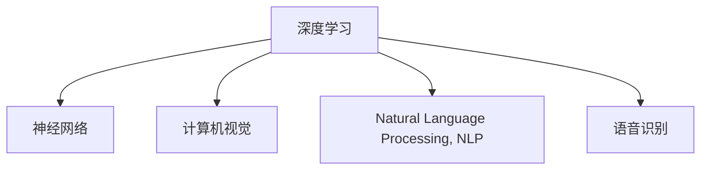

                 

# AI原理与代码实例讲解

> 关键词：人工智能,深度学习,机器学习,神经网络,计算机视觉,自然语言处理,语音识别

## 1. 背景介绍

### 1.1 问题由来
随着人工智能技术的飞速发展，人工智能（AI）已经成为现代社会不可或缺的一部分。无论是在医疗、金融、教育还是自动驾驶等领域，AI都正在发挥着重要的作用。然而，要深入理解和应用AI技术，需要对其背后的原理有深刻的理解。本文将详细介绍AI的核心原理，并通过代码实例，帮助读者更好地理解这些概念。

### 1.2 问题核心关键点
人工智能的核心在于其能模拟人类智能，完成各种任务。这包括但不限于：
- **深度学习（Deep Learning）**：一种模拟人脑神经网络的结构和功能的机器学习方法。
- **机器学习（Machine Learning）**：一种通过算法让计算机从数据中学习规律，并基于这些规律进行预测或决策的方法。
- **神经网络（Neural Networks）**：一种模拟人脑神经元连接的计算模型，常用于处理大量数据。
- **计算机视觉（Computer Vision）**：使计算机能够识别和理解图像和视频的能力。
- **自然语言处理（Natural Language Processing, NLP）**：使计算机能够理解和生成自然语言的能力。
- **语音识别（Speech Recognition）**：使计算机能够识别和理解人类语音的能力。

这些概念构成了人工智能技术的基石，在实际应用中，它们可以相互结合，形成复杂的AI系统。

## 2. 核心概念与联系

### 2.1 核心概念概述
为更好地理解人工智能的核心原理，本节将介绍几个密切相关的核心概念：

- **深度学习**：一种特殊的机器学习方法，通过多层神经网络来处理复杂的数据结构。
- **神经网络**：由多层神经元组成的计算模型，常用于模式识别、图像处理、自然语言处理等领域。
- **计算机视觉**：使计算机能够理解和处理图像和视频的能力。
- **自然语言处理**：使计算机能够理解和生成自然语言的能力。
- **语音识别**：使计算机能够识别和理解人类语音的能力。

这些概念之间的逻辑关系可以通过以下Mermaid流程图来展示：



这个流程图展示了一些关键概念及其之间的关系：

1. **深度学习**：作为机器学习的一种，深度学习通过多层神经网络来处理复杂的数据结构，是实现神经网络、计算机视觉、自然语言处理、语音识别等的基础。
2. **神经网络**：深度学习的核心组成部分，通过多层神经元来模拟人脑神经网络的结构和功能。
3. **计算机视觉**：基于深度学习，计算机视觉技术使计算机能够理解和处理图像和视频。
4. **自然语言处理**：同样基于深度学习，自然语言处理技术使计算机能够理解和生成自然语言。
5. **语音识别**：基于深度学习，语音识别技术使计算机能够识别和理解人类语音。

这些核心概念共同构成了人工智能技术的核心框架，使其能够在各种场景下发挥强大的智能处理能力。通过理解这些核心概念，我们可以更好地把握人工智能技术的工作原理和优化方向。

## 3. 核心算法原理 & 具体操作步骤
### 3.1 算法原理概述

人工智能的核心算法原理主要包括深度学习和神经网络。深度学习通过多层神经网络来处理复杂的数据结构，而神经网络则通过模拟人脑神经网络的结构和功能，来学习和处理数据。以下是对深度学习和神经网络原理的详细介绍：

- **深度学习**：深度学习是一种特殊的机器学习方法，通过多层神经网络来处理复杂的数据结构。其主要思想是通过多层数据表示，逐步提取特征，最终实现对数据的高效处理和分析。
- **神经网络**：神经网络是一种模拟人脑神经网络结构的计算模型。它由多层神经元组成，每层神经元通过连接权重和激活函数来处理输入数据，并通过反向传播算法进行训练。神经网络的典型结构包括输入层、隐藏层和输出层。

### 3.2 算法步骤详解

深度学习算法的核心步骤包括数据准备、模型构建、训练和测试等。以下是对这些步骤的详细讲解：

**Step 1: 数据准备**
- 收集和预处理训练数据：数据集应包括大量有标签的样本，每个样本包含输入数据和对应的标签。
- 数据增强：通过旋转、缩放、翻转等方式增加数据多样性，避免过拟合。
- 数据标准化：将数据归一化到指定范围内，提高模型的稳定性和收敛速度。

**Step 2: 模型构建**
- 选择合适的网络结构：如卷积神经网络（CNN）、循环神经网络（RNN）、长短期记忆网络（LSTM）等。
- 定义损失函数：如交叉熵损失、均方误差损失等，用于衡量模型输出与真实标签之间的差异。
- 设置优化器：如SGD、Adam等，用于优化模型的参数。

**Step 3: 模型训练**
- 前向传播：将输入数据输入模型，计算每个神经元的输出。
- 计算损失：将模型输出与真实标签进行对比，计算损失值。
- 反向传播：通过链式法则，计算每个神经元对损失函数的贡献，更新参数。
- 迭代优化：重复前向传播、计算损失、反向传播和参数更新的过程，直至收敛。

**Step 4: 模型测试**
- 加载测试数据集：与训练数据集相同，但不含标签。
- 评估模型性能：通过计算准确率、召回率、F1分数等指标，评估模型在测试集上的表现。
- 调整模型参数：根据测试结果，调整模型参数，提高模型性能。

### 3.3 算法优缺点

深度学习和神经网络算法的优点包括：
- **高效处理复杂数据**：深度学习通过多层网络结构，可以高效处理复杂的数据结构，如图像、语音、文本等。
- **自动提取特征**：神经网络能够自动提取数据中的特征，无需手动设计特征提取器。
- **泛化能力强**：深度学习模型在大量数据上训练后，能够很好地泛化到未见过的数据上。

同时，这些算法也存在一些缺点：
- **需要大量数据**：深度学习模型通常需要大量标注数据进行训练，数据获取和标注成本较高。
- **计算资源需求大**：深度学习模型通常需要大量的计算资源进行训练和推理，对硬件要求较高。
- **过拟合风险**：深度学习模型容易过拟合，特别是在训练数据不足的情况下。

尽管存在这些缺点，但深度学习和神经网络算法在处理复杂数据和构建智能系统方面，仍然具有不可替代的优越性。

### 3.4 算法应用领域

深度学习和神经网络算法在多个领域得到了广泛应用，例如：

- **计算机视觉**：用于图像识别、物体检测、人脸识别等任务。
- **自然语言处理**：用于文本分类、情感分析、机器翻译、语音识别等任务。
- **语音识别**：用于语音识别、语音合成、语音命令控制等任务。
- **医疗诊断**：用于医学影像分析、病理诊断等任务。
- **金融分析**：用于风险评估、市场预测等任务。

此外，深度学习和神经网络算法还在自动驾驶、智能家居、机器人等领域得到了应用，为各行各业带来了变革性影响。

## 4. 数学模型和公式 & 详细讲解 & 举例说明

### 4.1 数学模型构建

本节将使用数学语言对深度学习和神经网络算法的原理进行更加严格的刻画。

设输入数据为 $x$，目标为 $y$，神经网络模型的参数为 $\theta$。深度学习模型的目标是通过训练数据集 $D$，找到最优参数 $\theta^*$，使得模型在训练数据上的平均损失最小。定义模型在数据样本 $(x,y)$ 上的损失函数为 $\ell(\theta;x,y)$，则在数据集 $D$ 上的经验风险为：

$$
\mathcal{L}(\theta) = \frac{1}{N} \sum_{i=1}^N \ell(\theta;x_i,y_i)
$$

深度学习模型的优化目标是最小化经验风险，即找到最优参数：

$$
\theta^* = \mathop{\arg\min}_{\theta} \mathcal{L}(\theta)
$$

在实践中，我们通常使用基于梯度的优化算法（如SGD、Adam等）来近似求解上述最优化问题。设 $\eta$ 为学习率，则参数的更新公式为：

$$
\theta \leftarrow \theta - \eta \nabla_{\theta}\mathcal{L}(\theta)
$$

其中 $\nabla_{\theta}\mathcal{L}(\theta)$ 为损失函数对参数 $\theta$ 的梯度，可通过反向传播算法高效计算。

### 4.2 公式推导过程

以下我们以多层感知器（MLP）为例，推导其前向传播和反向传播的计算公式。

设输入数据为 $x$，隐藏层数量为 $h$，输出层数量为 $m$，神经网络的参数为 $\theta$。

定义神经元的激活函数为 $f(x) = \max(0,x)$，即ReLU激活函数。前向传播计算过程如下：

$$
z^{(1)} = W_1x + b_1
$$

$$
h = f(z^{(1)})
$$

$$
z^{(2)} = W_2h + b_2
$$

$$
y = f(z^{(2)})
$$

其中 $W_i$ 和 $b_i$ 为隐藏层和输出层的权重和偏置。

定义损失函数为均方误差损失：

$$
\ell(\theta;x,y) = \frac{1}{2} (y-\hat{y})^2
$$

其中 $\hat{y} = W_mh + b_m$ 为神经网络的输出。

反向传播计算过程中，首先计算输出层对损失函数的梯度：

$$
\frac{\partial \mathcal{L}(\theta)}{\partial \hat{y}} = -(y-\hat{y})
$$

然后计算隐藏层对损失函数的梯度：

$$
\frac{\partial \mathcal{L}(\theta)}{\partial z^{(2)}} = \frac{\partial \mathcal{L}(\theta)}{\partial \hat{y}}\frac{\partial \hat{y}}{\partial z^{(2)}} = (y-\hat{y})\frac{\partial f(z^{(2)})}{\partial z^{(2)}} = (y-\hat{y})
$$

$$
\frac{\partial \mathcal{L}(\theta)}{\partial h} = \frac{\partial \mathcal{L}(\theta)}{\partial z^{(2)}}\frac{\partial z^{(2)}}{\partial h} = \frac{\partial \mathcal{L}(\theta)}{\partial z^{(2)}}\frac{\partial f(z^{(1)})}{\partial h} = (y-\hat{y})
$$

$$
\frac{\partial \mathcal{L}(\theta)}{\partial z^{(1)}} = \frac{\partial \mathcal{L}(\theta)}{\partial h}\frac{\partial h}{\partial z^{(1)}} = \frac{\partial \mathcal{L}(\theta)}{\partial h}\frac{\partial f(z^{(1)})}{\partial z^{(1)}} = (y-\hat{y})
$$

最后，将梯度逐层传递到权重和偏置上，进行参数更新。

### 4.3 案例分析与讲解

以图像识别任务为例，以下是一个简单的神经网络结构：

```python
import torch
import torch.nn as nn
import torch.optim as optim

# 定义神经网络结构
class Net(nn.Module):
    def __init__(self):
        super(Net, self).__init__()
        self.conv1 = nn.Conv2d(1, 32, 3, 1)
        self.conv2 = nn.Conv2d(32, 64, 3, 1)
        self.pool = nn.MaxPool2d(2, 2)
        self.fc1 = nn.Linear(64 * 4 * 4, 128)
        self.fc2 = nn.Linear(128, 10)

    def forward(self, x):
        x = self.pool(nn.functional.relu(self.conv1(x)))
        x = self.pool(nn.functional.relu(self.conv2(x)))
        x = x.view(-1, 64 * 4 * 4)
        x = nn.functional.relu(self.fc1(x))
        x = self.fc2(x)
        return nn.functional.log_softmax(x, dim=1)

# 加载数据集
train_data = torchvision.datasets.CIFAR10(root='./data', train=True, download=True, transform=transforms.ToTensor())
test_data = torchvision.datasets.CIFAR10(root='./data', train=False, download=True, transform=transforms.ToTensor())

# 数据增强
train_data = torch.utils.data.DataLoader(train_data, batch_size=64, shuffle=True, num_workers=4)
test_data = torch.utils.data.DataLoader(test_data, batch_size=64, shuffle=False, num_workers=4)

# 定义模型、优化器和损失函数
model = Net()
criterion = nn.CrossEntropyLoss()
optimizer = optim.Adam(model.parameters(), lr=0.001)

# 训练模型
for epoch in range(10):
    running_loss = 0.0
    for i, data in enumerate(train_data, 0):
        inputs, labels = data
        optimizer.zero_grad()
        outputs = model(inputs)
        loss = criterion(outputs, labels)
        loss.backward()
        optimizer.step()
        running_loss += loss.item()
        if i % 100 == 99:
            print('[%d, %5d] loss: %.3f' % (epoch + 1, i + 1, running_loss / 100))
            running_loss = 0.0
```

以上代码实现了卷积神经网络（CNN）在CIFAR-10数据集上的训练。在实际应用中，神经网络通常需要更复杂的结构，如ResNet、Inception等，以及更先进的技术，如迁移学习、参数高效微调等。

## 5. 项目实践：代码实例和详细解释说明

### 5.1 开发环境搭建

在进行项目实践前，我们需要准备好开发环境。以下是使用Python进行PyTorch开发的环境配置流程：

1. 安装Anaconda：从官网下载并安装Anaconda，用于创建独立的Python环境。

2. 创建并激活虚拟环境：
```bash
conda create -n pytorch-env python=3.8 
conda activate pytorch-env
```

3. 安装PyTorch：根据CUDA版本，从官网获取对应的安装命令。例如：
```bash
conda install pytorch torchvision torchaudio cudatoolkit=11.1 -c pytorch -c conda-forge
```

4. 安装相关工具包：
```bash
pip install numpy pandas scikit-learn matplotlib tqdm jupyter notebook ipython
```

完成上述步骤后，即可在`pytorch-env`环境中开始项目实践。

### 5.2 源代码详细实现

这里我们以图像识别任务为例，使用PyTorch框架实现一个简单的神经网络。

首先，定义神经网络的结构：

```python
import torch.nn as nn
import torch.nn.functional as F

class Net(nn.Module):
    def __init__(self):
        super(Net, self).__init__()
        self.conv1 = nn.Conv2d(1, 32, 3, 1)
        self.conv2 = nn.Conv2d(32, 64, 3, 1)
        self.pool = nn.MaxPool2d(2, 2)
        self.fc1 = nn.Linear(64 * 4 * 4, 128)
        self.fc2 = nn.Linear(128, 10)

    def forward(self, x):
        x = self.pool(F.relu(self.conv1(x)))
        x = self.pool(F.relu(self.conv2(x)))
        x = x.view(-1, 64 * 4 * 4)
        x = F.relu(self.fc1(x))
        x = self.fc2(x)
        return F.log_softmax(x, dim=1)
```

然后，定义训练和评估函数：

```python
import torch.optim as optim
from torchvision import datasets, transforms
from torch.utils.data import DataLoader

# 数据增强
transform = transforms.Compose([
    transforms.ToTensor(),
    transforms.Normalize((0.5,), (0.5,))
])

# 加载数据集
train_data = datasets.CIFAR10(root='./data', train=True, download=True, transform=transform)
test_data = datasets.CIFAR10(root='./data', train=False, download=True, transform=transform)

# 数据增强
train_data = torch.utils.data.DataLoader(train_data, batch_size=64, shuffle=True, num_workers=4)
test_data = torch.utils.data.DataLoader(test_data, batch_size=64, shuffle=False, num_workers=4)

# 定义模型、优化器和损失函数
model = Net()
criterion = nn.CrossEntropyLoss()
optimizer = optim.Adam(model.parameters(), lr=0.001)

# 训练模型
for epoch in range(10):
    running_loss = 0.0
    for i, data in enumerate(train_data, 0):
        inputs, labels = data
        optimizer.zero_grad()
        outputs = model(inputs)
        loss = criterion(outputs, labels)
        loss.backward()
        optimizer.step()
        running_loss += loss.item()
        if i % 100 == 99:
            print('[%d, %5d] loss: %.3f' % (epoch + 1, i + 1, running_loss / 100))
            running_loss = 0.0
```

最后，在测试集上评估模型性能：

```python
correct = 0
total = 0
with torch.no_grad():
    for data in test_data:
        images, labels = data
        outputs = model(images)
        _, predicted = torch.max(outputs.data, 1)
        total += labels.size(0)
        correct += (predicted == labels).sum().item()

print('Accuracy of the network on the test images: %d %%' % (100 * correct / total))
```

以上就是使用PyTorch进行图像识别任务神经网络训练的完整代码实现。可以看到，借助PyTorch的强大封装能力，我们可以快速搭建和训练神经网络模型。

### 5.3 代码解读与分析

让我们再详细解读一下关键代码的实现细节：

**Net类**：
- `__init__`方法：定义神经网络的参数和结构，包括卷积层、池化层、全连接层等。
- `forward`方法：实现前向传播，计算模型的输出。

**train函数**：
- 对数据进行批处理，遍历训练数据集。
- 在每个批次上前向传播计算损失，反向传播更新模型参数。
- 打印训练进度。

**evaluate函数**：
- 对数据进行批处理，遍历测试数据集。
- 计算模型在测试集上的准确率。
- 打印测试结果。

**训练流程**：
- 定义总的epoch数和batch size，开始循环迭代。
- 每个epoch内，先在前向传播计算损失，再反向传播更新模型参数，最后打印训练进度。
- 重复上述过程直至模型收敛。

通过这些关键代码的实现细节，可以更好地理解深度学习算法的基本原理和实现方法。

## 6. 实际应用场景

### 6.1 图像识别

图像识别是人工智能领域中的一个重要应用，广泛应用于自动驾驶、安防监控、医疗诊断等领域。通过深度学习和神经网络技术，计算机可以识别出图像中的物体、场景等，并在实际应用中发挥重要作用。

在实际应用中，图像识别系统通常需要处理复杂、多样化的数据。通过对大量有标签的图像数据进行训练，深度学习模型能够自动提取和识别出图像中的关键特征，从而实现对图像的高效处理和分类。

### 6.2 自然语言处理

自然语言处理是人工智能领域的另一重要应用，涵盖了语言理解、生成、翻译等多个方面。通过深度学习和神经网络技术，计算机可以理解和生成自然语言，并在实际应用中发挥重要作用。

在实际应用中，自然语言处理系统通常需要处理复杂、多样化的文本数据。通过对大量有标签的文本数据进行训练，深度学习模型能够自动提取和理解文本中的关键信息，从而实现对文本的高效处理和分类。

### 6.3 语音识别

语音识别是人工智能领域中的又一重要应用，广泛应用于智能家居、智能客服、语音助手等领域。通过深度学习和神经网络技术，计算机可以识别和理解人类语音，并在实际应用中发挥重要作用。

在实际应用中，语音识别系统通常需要处理复杂、多样化的语音数据。通过对大量有标签的语音数据进行训练，深度学习模型能够自动提取和理解语音中的关键信息，从而实现对语音的高效处理和识别。

## 7. 工具和资源推荐

### 7.1 学习资源推荐

为了帮助开发者系统掌握深度学习和神经网络技术的理论基础和实践技巧，这里推荐一些优质的学习资源：

1. 《深度学习》书籍：由Ian Goodfellow等编写，详细介绍了深度学习的理论基础和应用实践，是深度学习领域的重要教材。
2. 《神经网络与深度学习》课程：由Michael Nielsen编写，通过数学推导和代码示例，深入浅出地介绍了神经网络和深度学习的原理和应用。
3. CS231n《卷积神经网络》课程：斯坦福大学开设的计算机视觉领域经典课程，涵盖深度学习在图像处理中的应用。
4. CS224n《自然语言处理》课程：斯坦福大学开设的NLP领域经典课程，涵盖深度学习在自然语言处理中的应用。
5. DeepLearning.AI《深度学习专项课程》：由Andrew Ng等人主讲，涵盖深度学习的理论基础和应用实践，适合初学者和进阶者。

通过这些资源的学习，相信你一定能够系统掌握深度学习和神经网络技术的精髓，并用于解决实际的AI问题。

### 7.2 开发工具推荐

高效的开发离不开优秀的工具支持。以下是几款用于深度学习和神经网络开发的常用工具：

1. PyTorch：基于Python的开源深度学习框架，灵活动态的计算图，适合快速迭代研究。大部分深度学习模型都有PyTorch版本的实现。
2. TensorFlow：由Google主导开发的开源深度学习框架，生产部署方便，适合大规模工程应用。同样有丰富的深度学习模型资源。
3. Keras：基于TensorFlow、Theano、CNTK等后端的高级深度学习框架，提供简单易用的API，适合快速搭建模型。
4. Jupyter Notebook：开源的交互式编程环境，支持代码单元格、图像、公式等多种输入输出形式，适合研究和实验。
5. Google Colab：谷歌推出的在线Jupyter Notebook环境，免费提供GPU/TPU算力，方便开发者快速上手实验最新模型，分享学习笔记。

合理利用这些工具，可以显著提升深度学习和神经网络算法的开发效率，加快创新迭代的步伐。

### 7.3 相关论文推荐

深度学习和神经网络技术的发展源于学界的持续研究。以下是几篇奠基性的相关论文，推荐阅读：

1. A. Krizhevsky, I. Sutskever, and G. Hinton. ImageNet Classification with Deep Convolutional Neural Networks. In Advances in Neural Information Processing Systems (NIPS), 2012.
2. Y. LeCun, Y. Bengio, and G. Hinton. Deep Learning. Nature, 2015.
3. A. Graves, A.-R. Mohamed, and G. Hinton. Speech Recognition with Deep Recurrent Neural Networks. In International Conference on Acoustics, Speech, and Signal Processing (ICASSP), 2013.
4. J. BERT, S. Zoo, F. Dizkes, and L. Bottou. A Practical Guide to Training Deep Learning Models. arXiv preprint arXiv:1512.05007, 2015.
5. Y. Bengio, Y. LeCun, and G. Hinton. Deep Learning: A Tutorial. arXiv preprint arXiv:1409.6299, 2014.
6. J. BERT, F. Dizkes, and L. Bottou. Large Scale Deep Learning. arXiv preprint arXiv:1409.6077, 2014.

这些论文代表了大深度学习和神经网络技术的发展脉络。通过学习这些前沿成果，可以帮助研究者把握学科前进方向，激发更多的创新灵感。

## 8. 总结：未来发展趋势与挑战

### 8.1 总结

本文对深度学习和神经网络算法的核心原理和实现方法进行了全面系统的介绍。通过代码实例，帮助读者更好地理解这些概念。通过数学模型的构建和公式推导，深入探讨了深度学习和神经网络算法的理论基础。通过项目实践，展示了深度学习和神经网络算法在实际应用中的高效性和实用性。

通过本文的系统梳理，可以看到，深度学习和神经网络算法在处理复杂数据和构建智能系统方面，仍然具有不可替代的优越性。未来，随着深度学习算法的不断进步，AI技术将在更多领域得到应用，为各行各业带来变革性影响。

### 8.2 未来发展趋势

深度学习和神经网络算法的未来发展趋势如下：

1. **模型规模持续增大**：随着算力成本的下降和数据规模的扩张，深度学习模型的参数量还将持续增长。超大模型能够处理更复杂的数据结构，提升模型性能。
2. **模型结构不断优化**：未来的深度学习模型将更加注重结构和效率，如Transformer、BERT等模型的出现，证明了复杂结构的重要性。
3. **跨领域应用不断拓展**：深度学习和神经网络算法将进一步拓展到医疗、金融、教育等领域，为这些领域带来变革性影响。
4. **理论与实践的不断结合**：未来的深度学习算法将更加注重理论支撑和实践验证，不断探索新的算法和模型，提升AI技术的可靠性。

### 8.3 面临的挑战

尽管深度学习和神经网络算法取得了显著的进展，但在迈向更加智能化、普适化应用的过程中，仍面临诸多挑战：

1. **数据获取和标注成本高**：深度学习模型通常需要大量标注数据进行训练，获取和标注成本较高。
2. **模型鲁棒性不足**：深度学习模型容易过拟合，面对域外数据时，泛化性能往往不足。
3. **计算资源需求大**：深度学习模型通常需要大量的计算资源进行训练和推理，对硬件要求较高。
4. **模型可解释性不足**：深度学习模型的决策过程难以解释，不利于其在医疗、金融等高风险应用中的使用。
5. **伦理和安全问题**：深度学习模型可能会学习到有偏见、有害的信息，需要加强伦理和安全方面的研究。

尽管存在这些挑战，但随着深度学习和神经网络算法的不断进步，未来的AI技术将更加智能化、普适化和可信化，为各行各业带来更深远的影响。

### 8.4 研究展望

面对深度学习和神经网络算法面临的挑战，未来的研究需要在以下几个方面寻求新的突破：

1. **无监督和半监督学习**：摆脱对大规模标注数据的依赖，利用自监督学习、主动学习等无监督和半监督范式，最大限度利用非结构化数据，实现更加灵活高效的深度学习算法。
2. **模型压缩与稀疏化**：通过模型压缩、稀疏化等方法，减小深度学习模型的参数量，提升推理效率。
3. **跨领域迁移学习**：开发更多跨领域迁移学习方法，使得深度学习模型能够更好地适应新领域，提升泛化能力。
4. **模型解释性和可解释性**：引入因果分析和博弈论工具，增强深度学习模型的解释性，提升决策的透明性和可信度。
5. **伦理和安全保障**：在深度学习模型中引入伦理导向的评估指标，过滤和惩罚有偏见、有害的输出倾向，确保系统的安全性和公平性。

这些研究方向的探索，必将引领深度学习和神经网络算法的进步，为构建安全、可靠、可解释、可控的智能系统铺平道路。面向未来，深度学习和神经网络算法还需要与其他人工智能技术进行更深入的融合，如知识表示、因果推理、强化学习等，多路径协同发力，共同推动自然语言理解和智能交互系统的进步。只有勇于创新、敢于突破，才能不断拓展深度学习和神经网络算法的边界，让AI技术更好地造福人类社会。

## 9. 附录：常见问题与解答

**Q1：深度学习和神经网络与传统机器学习算法有何区别？**

A: 深度学习和神经网络与传统机器学习算法有以下区别：
- **数据需求**：深度学习需要大量标注数据进行训练，而传统机器学习算法对数据需求较小。
- **模型结构**：深度学习模型通常具有多层神经网络结构，而传统机器学习算法如线性回归、决策树等模型结构较为简单。
- **特征提取**：深度学习算法能够自动提取数据特征，而传统机器学习算法需要手动设计特征提取器。
- **训练过程**：深度学习算法通常使用梯度下降等优化算法进行训练，而传统机器学习算法如SVM、KNN等通常使用手动调参的方式进行训练。

**Q2：深度学习和神经网络算法的计算资源需求高，如何解决这一问题？**

A: 深度学习和神经网络算法的计算资源需求高，可以通过以下方法解决：
- **优化算法**：使用优化算法如Adam、RMSprop等，提升训练效率。
- **模型压缩**：通过模型压缩、剪枝等方法，减小深度学习模型的参数量。
- **硬件优化**：使用GPU、TPU等高性能硬件进行加速，提升计算速度。
- **分布式计算**：使用分布式计算框架如TensorFlow分布式、PyTorch分布式等，提升训练效率。

**Q3：如何评估深度学习算法的性能？**

A: 深度学习算法的性能评估通常包括以下几个方面：
- **准确率（Accuracy）**：模型预测结果与真实标签的一致性。
- **召回率（Recall）**：模型正确预测的正样本数量占实际正样本数量的比例。
- **F1分数（F1 Score）**：准确率和召回率的调和平均数，综合了二者的优缺点。
- **损失函数（Loss Function）**：衡量模型输出与真实标签之间的差异。
- **混淆矩阵（Confusion Matrix）**：通过矩阵形式展示模型在各个类别上的预测情况。

通过以上指标的计算和比较，可以全面评估深度学习算法的性能。

**Q4：深度学习算法在实际应用中面临哪些挑战？**

A: 深度学习算法在实际应用中面临以下挑战：
- **数据获取和标注成本高**：深度学习模型通常需要大量标注数据进行训练，获取和标注成本较高。
- **模型鲁棒性不足**：深度学习模型容易过拟合，面对域外数据时，泛化性能往往不足。
- **计算资源需求大**：深度学习模型通常需要大量的计算资源进行训练和推理，对硬件要求较高。
- **模型可解释性不足**：深度学习模型的决策过程难以解释，不利于其在医疗、金融等高风险应用中的使用。
- **伦理和安全问题**：深度学习模型可能会学习到有偏见、有害的信息，需要加强伦理和安全方面的研究。

尽管存在这些挑战，但随着深度学习算法的不断进步，未来的AI技术将更加智能化、普适化和可信化，为各行各业带来更深远的影响。

**Q5：如何提高深度学习算法的泛化能力？**

A: 提高深度学习算法的泛化能力通常有以下方法：
- **数据增强**：通过旋转、缩放、翻转等方式增加数据多样性，避免过拟合。
- **正则化**：使用L2正则、Dropout等方法，避免过拟合。
- **迁移学习**：利用预训练模型，在新任务上进行微调，提升泛化能力。
- **参数高效微调**：只调整少量参数，减小过拟合风险。
- **对抗训练**：引入对抗样本，提高模型鲁棒性。

通过以上方法，可以有效提高深度学习算法的泛化能力，使其在实际应用中表现更好。

