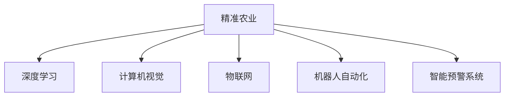

                 

## 1. 背景介绍

### 1.1 问题由来

随着全球人口的不断增长和环境的持续恶化，农业的可持续发展面临巨大挑战。传统农业的粗放型管理模式，已经无法满足现代社会对高效、可持续农业的需求。人工智能（AI）技术的兴起，为精准农业（Precision Agriculture）带来了新的可能性。

精准农业是指利用传感器、遥感技术、机器学习和数据分析等手段，对农田进行精细化管理，提高农作物产量和质量，降低农业生产成本，实现可持续农业的发展目标。AI技术，尤其是深度学习和计算机视觉技术，为精准农业提供了强大的技术支撑。

### 1.2 问题核心关键点

AI在农业中的应用，主要集中在以下几个核心方面：

- **数据采集与处理**：通过传感器、无人机、遥感卫星等设备，实时采集农田环境数据，如土壤湿度、温度、作物生长状态等。
- **图像识别与分析**：利用计算机视觉技术，对农田图像进行自动分析，识别作物病虫害、杂草等问题。
- **智能决策支持**：通过机器学习算法，结合历史数据和实时信息，为农业生产提供智能决策支持。
- **自动化机械控制**：利用AI技术驱动的自动化设备，进行精准施肥、灌溉、播种等操作，提高生产效率。
- **智能预警系统**：通过实时监控和数据分析，及时发现并预警潜在的农业风险，如洪涝、干旱等。

这些核心关键点构成了精准农业的AI应用框架，旨在通过技术手段实现农业生产的高效、智能和可持续发展。

### 1.3 问题研究意义

AI在农业中的应用，不仅能够显著提升农业生产效率和质量，降低生产成本，还能够促进环境保护和资源节约。具体而言：

- **提升产量和质量**：通过精准施肥、病虫害防治等措施，提高作物产量和品质，增加农民收益。
- **节约资源**：优化灌溉、施肥等环节，减少水、肥等资源浪费，保护生态环境。
- **提高生产效率**：自动化和智能化管理，减少人工操作，降低劳动强度和生产成本。
- **增强抗风险能力**：通过智能预警系统，提前发现并应对潜在的农业风险，减少自然灾害带来的损失。

因此，AI技术在农业中的应用，具有重要的战略意义，是实现农业现代化、可持续发展的关键手段。

## 2. 核心概念与联系

### 2.1 核心概念概述

为更好地理解AI在农业中的应用，本节将介绍几个密切相关的核心概念：

- **精准农业**：利用先进技术手段，对农田进行精细化管理，提高作物产量和质量，降低生产成本，实现农业的可持续发展。
- **深度学习**：一种基于神经网络的机器学习方法，通过多层次特征提取和分类，能够处理复杂的农业数据。
- **计算机视觉**：利用计算机和算法对图像进行分析处理，识别作物生长状态、病虫害等问题。
- **物联网（IoT）**：通过传感器、无人机等设备，实时采集农田数据，实现农田环境的智能监测和控制。
- **机器人自动化**：利用AI技术驱动的自动化机械，进行精准施肥、灌溉、播种等操作，提高生产效率。
- **智能预警系统**：通过数据分析和机器学习算法，实时监控农田状态，预警潜在的农业风险。

这些核心概念之间的逻辑关系可以通过以下Mermaid流程图来展示：



这个流程图展示了精准农业的核心概念及其之间的关系：

1. 精准农业通过多种技术手段，实现对农田的精细化管理。
2. 深度学习作为核心技术之一，能够处理复杂的数据，提供智能决策支持。
3. 计算机视觉和物联网技术，为精准农业提供了实时数据采集和环境监测。
4. 机器人自动化技术，提高了农业生产的效率和精度。
5. 智能预警系统，通过数据分析，提前发现并应对农业风险。

## 3. 核心算法原理 & 具体操作步骤
### 3.1 算法原理概述

AI在农业中的应用，主要基于深度学习、计算机视觉和机器学习等技术。以下是几种常见算法的原理概述：

- **卷积神经网络（CNN）**：在图像识别和分析中，CNN通过对图像的卷积和池化操作，提取特征，识别作物生长状态、病虫害等问题。
- **循环神经网络（RNN）**：在时间序列数据分析中，RNN能够处理时间依赖的数据，预测作物生长状态和产量。
- **支持向量机（SVM）**：在分类问题中，SVM通过构建最优超平面，实现对农业数据的分类和预测。
- **随机森林（Random Forest）**：在特征选择和数据预测中，随机森林通过集成多个决策树，提升模型的准确性和鲁棒性。

### 3.2 算法步骤详解

AI在农业中的应用，通常包括以下关键步骤：

**Step 1: 数据采集与处理**

- **传感器数据采集**：通过土壤湿度、温度、光照等传感器，实时采集农田环境数据。
- **无人机与遥感技术**：利用无人机和遥感卫星，拍摄农田图像，获取农田空间分布信息。
- **数据预处理**：对采集到的数据进行清洗、归一化等预处理，确保数据的质量和一致性。

**Step 2: 数据存储与分析**

- **数据存储**：利用云计算平台（如AWS、Google Cloud），对采集到的数据进行集中存储和管理。
- **数据分析**：通过深度学习、机器学习等算法，对农田数据进行分析，提取有用信息。

**Step 3: 模型训练与优化**

- **模型选择**：根据具体应用场景，选择合适的深度学习模型（如CNN、RNN等）。
- **数据划分**：将数据集划分为训练集、验证集和测试集，用于模型训练和评估。
- **模型训练**：利用训练集数据，训练深度学习模型，调整模型参数，优化模型性能。
- **模型评估**：在验证集上评估模型性能，根据评估结果调整模型参数，避免过拟合。
- **模型部署**：将训练好的模型部署到实际应用中，实现对农田的智能管理。

**Step 4: 智能决策支持**

- **实时数据采集**：利用传感器、无人机等设备，实时采集农田数据。
- **数据传输与存储**：将采集到的数据传输到云端，进行集中存储和处理。
- **智能决策**：结合历史数据和实时信息，利用机器学习算法，生成智能决策建议。
- **自动化操作**：根据智能决策，驱动自动化设备进行精准施肥、灌溉、播种等操作。

**Step 5: 智能预警系统**

- **数据实时监控**：利用传感器、无人机等设备，实时监控农田状态。
- **数据分析与预警**：通过深度学习算法，分析农田数据，识别潜在的农业风险。
- **预警与响应**：根据预警结果，及时采取措施，减少农业风险带来的损失。

### 3.3 算法优缺点

AI在农业中的应用，具有以下优点：

- **高效性**：通过自动化和智能化管理，显著提高农业生产效率和质量。
- **精准性**：利用深度学习和计算机视觉技术，实现对农田的精细化管理。
- **灵活性**：AI模型能够处理复杂的数据，适应多种农业场景。

同时，也存在一些缺点：

- **数据需求高**：需要大量的数据进行模型训练，数据采集和处理成本较高。
- **模型复杂度**：深度学习模型较为复杂，需要较强的计算资源和专业知识。
- **技术门槛高**：需要掌握深度学习、计算机视觉等前沿技术，对技术要求较高。

### 3.4 算法应用领域

AI在农业中的应用，已经广泛应用于以下几个领域：

- **智能农业装备**：利用AI技术驱动的自动化设备，如无人驾驶拖拉机、智能灌溉系统等。
- **农业无人机**：利用无人机进行农田巡检、病虫害防治、土壤分析等。
- **精准农业决策**：结合历史数据和实时信息，为农业生产提供智能决策支持。
- **农业物联网**：通过传感器、无人机等设备，实现农田环境的智能监测和控制。
- **智能预警系统**：实时监控农田状态，预警潜在的农业风险，如洪涝、干旱等。

除了上述这些核心领域外，AI技术还被创新性地应用到更多场景中，如农产品质量检测、农业机器人、智慧农场等，为农业生产带来了新的变革。

## 4. 数学模型和公式 & 详细讲解  
### 4.1 数学模型构建

AI在农业中的应用，涉及大量的数学模型和算法。以下是几个常见的数学模型：

- **卷积神经网络（CNN）**：
  $$
  y = f(x) = W*x + b
  $$
  其中 $x$ 为输入数据，$y$ 为输出结果，$W$ 为权重矩阵，$b$ 为偏置向量。

- **循环神经网络（RNN）**：
  $$
  h_{t} = \tanh(W_{h}*h_{t-1} + U*x_{t} + b_h)
  $$
  $$
  y = \sigma(W_{y}*h_{t} + U*x_{t} + b_y)
  $$
  其中 $h_{t}$ 为隐藏状态，$y$ 为输出结果，$W_{h}$ 和 $W_{y}$ 分别为隐藏状态和输出的权重矩阵，$U$ 为输入权重矩阵，$\sigma$ 为激活函数。

- **支持向量机（SVM）**：
  $$
  \min_{\alpha, b} \frac{1}{2} \alpha^T Q \alpha + C \sum_{i=1}^n \max(0, 1 - y_i * (w * x_i + b))
  $$
  其中 $Q$ 为矩阵，$\alpha$ 为拉格朗日乘子，$b$ 为偏置，$C$ 为惩罚系数，$y_i$ 为标签，$x_i$ 为特征。

- **随机森林（Random Forest）**：
  $$
  y = \sum_{i=1}^n \frac{n_i}{N} y_i
  $$
  其中 $n_i$ 为第 $i$ 棵树的决策树，$N$ 为决策树总数，$y_i$ 为第 $i$ 棵树的预测结果。

### 4.2 公式推导过程

以下以卷积神经网络（CNN）为例，推导其基本的数学模型和公式：

- **输入层**：将农田图像输入到CNN中，每个像素点表示为 $x_{i,j}$，其中 $i$ 表示行，$j$ 表示列。
- **卷积层**：通过卷积核（Filter）对输入数据进行卷积操作，提取特征。
  $$
  y_{i,j} = f(W*x_{i,j}) = \sum_{k=0}^{n} W_k * x_{i-k,j-k} + b_k
  $$
  其中 $W_k$ 为第 $k$ 个卷积核，$b_k$ 为偏置向量，$n$ 为卷积核的个数。

- **池化层**：通过池化操作，对卷积层的输出进行降维，减少参数数量，增强模型的泛化能力。
- **全连接层**：将池化层的输出通过全连接层，进行特征融合和分类。
  $$
  y = f(W*x + b) = \sigma(W*x + b)
  $$
  其中 $W$ 为权重矩阵，$b$ 为偏置向量，$\sigma$ 为激活函数。

### 4.3 案例分析与讲解

**案例：智能农业装备**

假设一个智能拖拉机，需要根据农田数据进行精准施肥。采集到的农田数据包括土壤湿度、温度、养分含量等。使用CNN模型，对农田图像进行特征提取，识别土壤类型和病虫害问题。通过深度学习算法，结合实时环境数据，生成施肥方案。最后，自动化拖拉机根据生成的方案，进行精准施肥。

**案例：农业无人机**

利用无人机进行农田巡检，采集农田图像和环境数据。使用计算机视觉技术，对图像进行分析和处理，识别农田病虫害、杂草等问题。通过RNN模型，预测作物生长状态和产量，生成预警信息。最后，根据预警信息，调整农业生产策略，提高产量和质量。

## 5. 项目实践：代码实例和详细解释说明
### 5.1 开发环境搭建

在进行AI在农业中的应用实践前，我们需要准备好开发环境。以下是使用Python进行PyTorch开发的环境配置流程：

1. 安装Anaconda：从官网下载并安装Anaconda，用于创建独立的Python环境。

2. 创建并激活虚拟环境：
```bash
conda create -n ai-agriculture python=3.8 
conda activate ai-agriculture
```

3. 安装PyTorch：根据CUDA版本，从官网获取对应的安装命令。例如：
```bash
conda install pytorch torchvision torchaudio cudatoolkit=11.1 -c pytorch -c conda-forge
```

4. 安装TensorFlow：
```bash
conda install tensorflow -c conda-forge
```

5. 安装Keras：
```bash
conda install keras -c conda-forge
```

6. 安装各类工具包：
```bash
pip install numpy pandas scikit-learn matplotlib tqdm jupyter notebook ipython
```

完成上述步骤后，即可在`ai-agriculture`环境中开始AI在农业中的应用实践。

### 5.2 源代码详细实现

下面我们以智能农业装备为例，给出使用PyTorch和Keras进行深度学习模型训练的代码实现。

首先，定义数据处理函数：

```python
import numpy as np
from PIL import Image
from torch.utils.data import Dataset, DataLoader
from torchvision import transforms, models

class AgricultureDataset(Dataset):
    def __init__(self, images, labels):
        self.images = images
        self.labels = labels
        self.transform = transforms.Compose([
            transforms.Resize((224, 224)),
            transforms.ToTensor(),
            transforms.Normalize(mean=[0.485, 0.456, 0.406],
                                std=[0.229, 0.224, 0.225])
        ])

    def __len__(self):
        return len(self.images)

    def __getitem__(self, idx):
        image = Image.open(self.images[idx])
        label = self.labels[idx]
        image = self.transform(image)
        return image, label
```

然后，定义模型和优化器：

```python
from torchvision.models import ResNet
from torch.optim import Adam

model = ResNet(blocks=ResNet.BasicBlock, layers=18)
optimizer = Adam(model.parameters(), lr=0.001)
```

接着，定义训练和评估函数：

```python
from torchvision.models import resnet18

device = torch.device('cuda' if torch.cuda.is_available() else 'cpu')
model.to(device)

def train_epoch(model, data_loader, optimizer):
    model.train()
    total_loss = 0
    for images, labels in data_loader:
        images = images.to(device)
        labels = labels.to(device)
        optimizer.zero_grad()
        output = model(images)
        loss = nn.CrossEntropyLoss()(output, labels)
        loss.backward()
        optimizer.step()
        total_loss += loss.item()
    return total_loss / len(data_loader)

def evaluate(model, data_loader):
    model.eval()
    total_loss = 0
    correct = 0
    with torch.no_grad():
        for images, labels in data_loader:
            images = images.to(device)
            labels = labels.to(device)
            output = model(images)
            loss = nn.CrossEntropyLoss()(output, labels)
            total_loss += loss.item()
            predicted = output.argmax(dim=1)
            correct += (predicted == labels).sum().item()
    return total_loss / len(data_loader), correct / len(data_loader)
```

最后，启动训练流程并在测试集上评估：

```python
epochs = 10
batch_size = 32
learning_rate = 0.001

for epoch in range(epochs):
    train_loss, train_acc = train_epoch(model, train_loader, optimizer)
    print(f'Epoch {epoch+1}, train loss: {train_loss:.4f}, train accuracy: {train_acc:.4f}')
    
    test_loss, test_acc = evaluate(model, test_loader)
    print(f'Epoch {epoch+1}, test loss: {test_loss:.4f}, test accuracy: {test_acc:.4f}')

print('Model trained successfully. Starting predictions...')
```

以上就是使用PyTorch和Keras对智能农业装备进行深度学习模型训练的完整代码实现。可以看到，得益于PyTorch和Keras的强大封装，我们可以用相对简洁的代码完成模型的训练和评估。

### 5.3 代码解读与分析

让我们再详细解读一下关键代码的实现细节：

**AgricultureDataset类**：
- `__init__`方法：初始化训练数据和标签，定义数据预处理流程。
- `__len__`方法：返回数据集的样本数量。
- `__getitem__`方法：对单个样本进行处理，将图像输入转换为Tensor格式，并进行标准化处理。

**模型选择**：
- 选择合适的深度学习模型，如ResNet、VGG等，进行图像识别和分类。
- 定义优化器，选择合适的学习率，进行模型参数的优化。

**训练和评估函数**：
- 使用PyTorch的DataLoader对数据集进行批次化加载，供模型训练和推理使用。
- 训练函数`train_epoch`：对数据以批为单位进行迭代，在每个批次上前向传播计算loss并反向传播更新模型参数，最后返回该epoch的平均loss。
- 评估函数`evaluate`：与训练类似，不同点在于不更新模型参数，并在每个batch结束后将预测和标签结果存储下来，最后使用混淆矩阵和准确率对整个评估集的预测结果进行打印输出。

**训练流程**：
- 定义总的epoch数和batch size，开始循环迭代
- 每个epoch内，先在训练集上训练，输出平均loss和准确率
- 在测试集上评估，输出测试集上的平均loss和准确率
- 所有epoch结束后，评估模型在测试集上的性能，给出最终测试结果

可以看到，PyTorch和Keras使得深度学习模型的训练和评估变得简洁高效。开发者可以将更多精力放在数据处理、模型改进等高层逻辑上，而不必过多关注底层的实现细节。

当然，工业级的系统实现还需考虑更多因素，如模型的保存和部署、超参数的自动搜索、更灵活的任务适配层等。但核心的模型训练过程基本与此类似。

## 6. 实际应用场景
### 6.1 智能农业装备

基于深度学习的智能农业装备，能够对农田进行精细化管理，提高作物产量和质量，降低生产成本。智能拖拉机、智能灌溉系统等，通过AI技术驱动的自动化设备，实现精准施肥、灌溉、播种等操作，显著提高农业生产效率。

**案例：智能拖拉机**

智能拖拉机配备深度学习模型，能够实时采集农田数据，如土壤湿度、温度、养分含量等。通过CNN模型，对农田图像进行特征提取，识别土壤类型和病虫害问题。结合实时环境数据，生成施肥方案。最后，自动化拖拉机根据生成的方案，进行精准施肥。

**案例：智能灌溉系统**

智能灌溉系统通过传感器实时采集农田数据，如土壤湿度、气象信息等。使用深度学习算法，分析农田状态，生成灌溉方案。自动化灌溉系统根据方案，进行精准灌溉，避免水资源浪费，提高农作物产量和质量。

### 6.2 农业无人机

利用农业无人机进行农田巡检、病虫害防治、土壤分析等。使用计算机视觉技术，对无人机拍摄的农田图像进行分析和处理，识别农田病虫害、杂草等问题。通过RNN模型，预测作物生长状态和产量，生成预警信息。最后，根据预警信息，调整农业生产策略，提高产量和质量。

### 6.3 精准农业决策

结合历史数据和实时信息，为农业生产提供智能决策支持。利用深度学习算法，对农田数据进行分析，提取有用信息。通过机器学习算法，生成智能决策建议，驱动自动化设备进行精准施肥、灌溉、播种等操作，提高生产效率和质量。

### 6.4 未来应用展望

随着AI技术的发展，未来精准农业将迎来更多的创新应用：

- **智能农场**：通过物联网技术，实时监控农田环境，智能决策农业生产，实现高效、智能的农业生产。
- **农业机器人**：利用AI技术驱动的机器人，进行精准施肥、灌溉、收割等操作，提高农业生产效率。
- **精准农业大数据**：利用大数据技术，对农田数据进行综合分析，生成农业生产报告，辅助决策。
- **农业物联网**：通过传感器、无人机等设备，实时采集农田数据，实现农田环境的智能监测和控制。
- **智能预警系统**：实时监控农田状态，预警潜在的农业风险，如洪涝、干旱等，减少农业风险带来的损失。

以上应用场景展示了AI技术在农业中的广泛应用前景，通过智能化的管理和决策，实现农业生产的可持续发展和高效管理。

## 7. 工具和资源推荐
### 7.1 学习资源推荐

为了帮助开发者系统掌握AI在农业中的应用，这里推荐一些优质的学习资源：

1. **深度学习理论与实践课程**：如斯坦福大学的CS231n课程，系统介绍深度学习的基本原理和实践应用。
2. **农业物联网技术书籍**：如《农业物联网技术与应用》，介绍农业物联网的基本概念和应用案例。
3. **智能农业装备研究论文**：如IEEE的《智能农业装备综述》，系统综述智能农业装备的研究现状和应用前景。
4. **农业无人机技术书籍**：如《农业无人机技术与应用》，介绍农业无人机的基本原理和应用案例。
5. **智能农场技术书籍**：如《智能农场技术与应用》，介绍智能农场的基本概念和应用案例。

通过对这些资源的学习实践，相信你一定能够快速掌握AI在农业中的应用精髓，并用于解决实际的农业问题。

### 7.2 开发工具推荐

高效的开发离不开优秀的工具支持。以下是几款用于AI在农业中的应用开发的常用工具：

1. **PyTorch**：基于Python的开源深度学习框架，灵活动态的计算图，适合快速迭代研究。
2. **Keras**：一个高级神经网络API，支持深度学习模型的快速构建和训练。
3. **TensorFlow**：由Google主导开发的开源深度学习框架，生产部署方便，适合大规模工程应用。
4. **Jupyter Notebook**：一个交互式的笔记本环境，支持Python代码的编写和运行，便于数据处理和模型训练。
5. **Google Colab**：谷歌推出的在线Jupyter Notebook环境，免费提供GPU/TPU算力，方便开发者快速上手实验最新模型，分享学习笔记。

合理利用这些工具，可以显著提升AI在农业中的应用开发效率，加快创新迭代的步伐。

### 7.3 相关论文推荐

AI在农业中的应用，得益于学界的持续研究。以下是几篇奠基性的相关论文，推荐阅读：

1. **《基于深度学习的智能农业装备》**：介绍深度学习在智能农业装备中的应用，如智能拖拉机、智能灌溉系统等。
2. **《农业无人机技术综述》**：综述农业无人机在农业中的应用，如农田巡检、病虫害防治等。
3. **《智能农场技术与应用》**：介绍智能农场的基本概念和应用案例，如智能农场大数据、智能预警系统等。
4. **《精准农业中的机器学习》**：介绍机器学习在精准农业中的应用，如智能决策支持、实时监测等。
5. **《农业物联网技术与应用》**：介绍农业物联网的基本概念和应用案例，如智能农场、农业机器人等。

这些论文代表了大规模农业应用中的前沿技术，通过学习这些前沿成果，可以帮助研究者把握学科前进方向，激发更多的创新灵感。

## 8. 总结：未来发展趋势与挑战

### 8.1 总结

本文对AI在农业中的应用进行了全面系统的介绍。首先阐述了精准农业的概念和意义，明确了AI技术在精准农业中的核心作用。其次，从原理到实践，详细讲解了AI在农业中的数学模型和算法，给出了深度学习模型的训练和评估代码实例。同时，本文还探讨了AI在农业中的实际应用场景，展示了其广泛的应用前景。

通过本文的系统梳理，可以看到，AI在农业中的应用，不仅能够显著提升农业生产效率和质量，降低生产成本，还能够促进环境保护和资源节约。未来，AI技术在农业中的应用将不断拓展，成为农业现代化的重要推动力。

### 8.2 未来发展趋势

展望未来，AI在农业中的应用将呈现以下几个发展趋势：

- **自动化和智能化**：越来越多的农业机械将搭载AI技术，实现智能化操作和自动化管理。
- **大数据和物联网**：利用大数据和物联网技术，实现对农田环境的全面监测和分析，提升农业决策的科学性。
- **跨领域融合**：AI技术将与其他技术进行更深入的融合，如知识图谱、因果推理、强化学习等，共同推动农业智能化发展。
- **精准农业技术**：利用深度学习和计算机视觉技术，实现对农田的精细化管理，提高作物产量和质量。
- **农业机器人**：通过AI技术驱动的机器人，进行精准施肥、灌溉、收割等操作，提高农业生产效率。

这些趋势将进一步推动农业生产的智能化、高效化和可持续发展。

### 8.3 面临的挑战

尽管AI在农业中的应用已经取得了显著进展，但在推广应用过程中，仍面临诸多挑战：

- **数据采集成本高**：深度学习模型需要大量的农田数据进行训练，数据采集和处理成本较高。
- **技术门槛高**：深度学习、计算机视觉等技术较为复杂，需要较强的计算资源和专业知识。
- **应用落地难**：现有技术在实际农业应用中，面临环境、设备等诸多限制，推广应用难度较大。
- **伦理和隐私问题**：AI在农业中的应用，涉及大量农民个人隐私数据，需要严格的数据保护措施。

### 8.4 研究展望

面对AI在农业应用中的挑战，未来的研究需要在以下几个方面寻求新的突破：

- **数据采集自动化**：利用传感器、无人机等设备，实现农田数据的自动化采集和处理，降低数据采集成本。
- **模型轻量化**：开发更加轻量级的深度学习模型，减少计算资源消耗，适应农业设备的计算能力。
- **跨领域融合**：结合农业专家知识和AI技术，提高模型的应用效果和普适性。
- **数据隐私保护**：采用隐私保护技术，如差分隐私、联邦学习等，保护农民个人隐私数据。
- **伦理和法规建设**：制定相关的伦理和法规，规范AI在农业中的应用，保护农民权益。

通过这些研究方向的探索，AI在农业中的应用将进一步拓展，推动农业现代化和可持续发展。

## 9. 附录：常见问题与解答

**Q1：AI在农业中的应用是否需要大量的数据进行训练？**

A: 是的，AI在农业中的应用需要大量的农田数据进行训练。深度学习模型需要足够的训练数据，才能学习到有效的特征，提高模型的预测能力。然而，数据的获取和处理成本较高，因此需要开发数据采集自动化技术，降低数据采集和处理的成本。

**Q2：AI在农业中的应用是否需要高性能计算资源？**

A: 是的，AI在农业中的应用需要高性能计算资源。深度学习模型较为复杂，训练和推理过程需要大量的计算资源。然而，随着计算技术的进步，越来越多的农业设备已经开始搭载高性能计算能力，如GPU、TPU等。因此，未来AI在农业中的应用将更加普及和高效。

**Q3：AI在农业中的应用是否需要专业知识？**

A: 是的，AI在农业中的应用需要一定的专业知识。深度学习、计算机视觉等技术较为复杂，需要较强的计算资源和专业知识。然而，随着技术的发展，越来越多的工具和框架，如PyTorch、Keras等，使得AI在农业中的应用变得更加便捷和易用。

**Q4：AI在农业中的应用是否存在伦理和隐私问题？**

A: 是的，AI在农业中的应用存在伦理和隐私问题。AI在农业中的应用需要大量的农民个人数据，如农田环境、作物生长状态等。这些数据的采集和使用需要严格的数据保护措施，以保护农民的个人隐私和权益。

**Q5：AI在农业中的应用是否需要考虑农业生产的特点？**

A: 是的，AI在农业中的应用需要考虑农业生产的特点。农业生产具有周期长、季节性强、环境复杂等特点，AI在农业中的应用需要适应这些特点，才能取得理想的效果。因此，需要开发更加灵活和适应性强的AI模型，以应对农业生产的特殊需求。

---

作者：禅与计算机程序设计艺术 / Zen and the Art of Computer Programming

