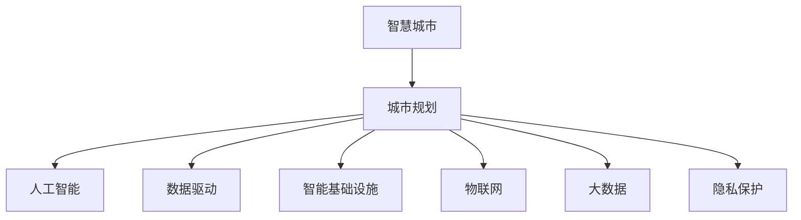

                 

# AI在城市规划中的作用：智慧城市的未来

> 关键词：智慧城市,城市规划,人工智能,数据驱动,智能基础设施,物联网,大数据,隐私保护

## 1. 背景介绍

### 1.1 问题由来
城市规划是一个涉及多学科的复杂系统工程，传统城市规划依赖于人类的经验和直觉，在实际操作中具有较高的不确定性和局限性。随着数据和算力的快速发展，人工智能(AI)在城市规划中的应用，正逐步改变这一现状，为智慧城市的建设提供了新的可能性。

### 1.2 问题核心关键点
AI在城市规划中的应用，主要集中在以下几个关键点：
1. 数据驱动决策：利用大数据和AI技术，分析和预测城市发展的趋势，指导决策。
2. 智能基础设施：部署基于AI的交通管理、能源管理系统，提高城市运行效率。
3. 精细化管理：通过AI算法优化城市规划和资源分配，实现资源的合理利用。
4. 智能决策支持：构建AI辅助的城市规划系统，提供决策参考和优化建议。

### 1.3 问题研究意义
AI在城市规划中的应用，可以显著提升规划的科学性和精准度，推动智慧城市的建设，实现高效、智能、可持续的城市发展。具体意义包括：
1. 提高决策质量：AI可以处理和分析海量数据，提供基于数据驱动的决策支持，减少人为错误。
2. 优化资源配置：AI可以自动优化城市交通、能源、环境等资源的分配和管理。
3. 提升服务质量：AI技术可以应用于公共服务，提升城市管理和服务的智能化水平。
4. 增强应急能力：AI可以快速分析海量数据，提供灾害预警和应急响应策略。
5. 促进公平发展：AI可以优化资源分配，改善低收入社区的环境和设施。

## 2. 核心概念与联系

### 2.1 核心概念概述

为更好地理解AI在城市规划中的作用，本节将介绍几个密切相关的核心概念：

- 智慧城市(Smart City)：利用新一代信息通信技术和AI技术，构建的便捷、绿色、智能的现代城市。
- 城市规划(Urban Planning)：对城市发展进行长远规划和系统安排，涉及土地利用、交通、能源、环境保护等众多方面。
- 人工智能(Artificial Intelligence)：模拟人类智能行为的技术，包括机器学习、深度学习、自然语言处理等。
- 数据驱动(Data-Driven)：基于数据的分析和决策，避免传统依赖经验和直觉的不确定性。
- 智能基础设施(Smart Infrastructure)：利用AI技术提升交通、能源、环保等基础设施的智能化水平。
- 物联网(IoT)：通过传感器、网络通信等技术，实现城市各系统的互联互通。
- 大数据(Big Data)：处理和分析海量数据的技术和手段，支持城市规划的精细化和智能化。
- 隐私保护(Privacy Protection)：在城市规划和AI应用中，保护个人和机构隐私的技术和法规。

这些核心概念之间的逻辑关系可以通过以下Mermaid流程图来展示：



这个流程图展示了他的核心概念及其之间的关系：

1. 智慧城市是利用AI等技术构建的现代城市。
2. 城市规划涉及多领域知识，与AI技术紧密相关。
3. 数据驱动和AI技术在城市规划中起到关键作用。
4. 智能基础设施和物联网技术支撑智慧城市建设。
5. 大数据技术为城市规划提供强有力的支持。
6. 隐私保护是智慧城市和AI应用中的重要考量因素。

## 3. 核心算法原理 & 具体操作步骤
### 3.1 算法原理概述

AI在城市规划中的应用，主要是通过大数据分析、机器学习和深度学习等技术，实现对城市各种数据的建模和预测，提供决策支持。具体来说，AI在城市规划中的应用流程包括以下几个步骤：

1. **数据采集与预处理**：收集城市发展的各项数据，如人口、交通流量、能源消耗、环境监测等，并进行清洗和归一化处理。
2. **模型训练与优化**：基于收集到的数据，训练各种AI模型，如时间序列预测模型、交通流量预测模型、环境质量预测模型等。
3. **预测与分析**：利用训练好的模型，进行未来城市发展的预测和分析，如交通拥堵预测、能源需求预测、环境污染预测等。
4. **决策支持与优化**：将预测和分析结果应用于城市规划和资源分配，提供决策支持和优化建议。

### 3.2 算法步骤详解

以下是AI在城市规划中的应用步骤详解：

**Step 1: 数据采集与预处理**
- 确定需要收集的城市发展数据类型，如人口统计数据、交通流量、能源消耗、环境监测等。
- 使用传感器、摄像头、智能终端等设备，采集实时数据。
- 对采集到的数据进行清洗、去重、归一化处理，去除噪声和异常值。
- 使用数据可视化工具，对数据进行初步分析和探索。

**Step 2: 模型训练与优化**
- 选择合适的AI模型，如时间序列模型、深度学习模型、决策树模型等。
- 使用训练数据，训练模型，并进行交叉验证和参数调优。
- 使用测试数据，评估模型的准确性和泛化能力。
- 使用正则化技术、Dropout等手段，避免过拟合。

**Step 3: 预测与分析**
- 将训练好的模型应用于实时数据，进行未来城市发展的预测和分析。
- 利用预测结果，分析城市运行中的潜在问题，如交通拥堵、能源浪费、环境污染等。
- 将预测结果可视化为图表和报告，供城市规划者和决策者参考。

**Step 4: 决策支持与优化**
- 基于预测和分析结果，提供决策支持建议，如交通流量调控、能源分配优化、环境治理等。
- 使用优化算法，对城市资源进行优化配置，提升城市运行效率。
- 定期更新模型和数据，保持模型的实时性和准确性。

### 3.3 算法优缺点

AI在城市规划中的应用，具有以下优点：
1. 数据驱动：基于大规模数据进行决策，提高决策的科学性和精准度。
2. 智能优化：通过AI模型自动优化资源配置，提高城市运行效率。
3. 实时分析：实时处理和分析数据，提供快速响应和决策支持。
4. 减少人为误差：减少传统规划中的人为错误和主观偏差。
5. 促进公平发展：优化资源配置，改善低收入社区的环境和设施。

同时，AI在城市规划中也可能存在一些局限性：
1. 数据质量问题：如果数据质量较差，AI模型的预测和分析结果可能不准确。
2. 模型复杂度：复杂的AI模型需要大量的计算资源和存储空间。
3. 隐私问题：在数据采集和使用过程中，存在隐私保护的风险。
4. 技术门槛：需要一定的技术背景和专业知识，非专业领域的人员难以理解和应用。
5. 成本问题：高昂的开发和维护成本可能限制其应用范围。

### 3.4 算法应用领域

AI在城市规划中的应用，覆盖了城市发展的各个方面，主要包括以下领域：

- **交通管理**：使用AI技术优化交通信号灯、智能交通系统、公共交通调度等。
- **能源管理**：利用AI技术优化电力、燃气、供热等能源的使用和分配，提升能源利用效率。
- **环境治理**：使用AI技术监测和预测环境质量，进行空气、水质等治理。
- **公共安全**：利用AI技术监测和预警公共安全事件，如灾害、恐怖袭击等。
- **城市治理**：使用AI技术进行城市运营监测和管理，如垃圾分类、智能停车、智能建筑等。
- **应急响应**：使用AI技术快速分析和预测灾害，提供应急响应策略。

这些领域的应用，使得AI在城市规划中展现出强大的潜力和广泛的应用前景。

## 4. 数学模型和公式 & 详细讲解  
### 4.1 数学模型构建

AI在城市规划中的应用，主要涉及到各种数学模型和算法。以下是几个典型模型的介绍：

- **时间序列预测模型**：如ARIMA、LSTM、GRU等，用于预测城市各项指标随时间变化的情况。
- **空间回归模型**：如空间自回归模型(SARIMA)，用于预测城市各区域的发展情况。
- **聚类分析模型**：如K-means、层次聚类等，用于分析和分类城市发展的不同区域。
- **优化算法**：如遗传算法、粒子群优化等，用于资源配置和优化。

### 4.2 公式推导过程

以下以时间序列预测模型为例，推导其数学公式。

假设城市某项指标 $X_t$ 随时间 $t$ 变化，可以构建时间序列预测模型进行预测。常用的时间序列模型是ARIMA模型，其基本形式为：

$$
X_t = c + \sum_{i=1}^p\alpha_iX_{t-i} + \sum_{i=1}^q\beta_i\epsilon_{t-i} + \epsilon_t
$$

其中，$c$ 为常数项，$\alpha_i$ 为自回归系数，$\beta_i$ 为差分系数，$\epsilon_t$ 为随机误差项。

对于LSTM模型，其时间序列预测形式为：

$$
\hat{X}_t = f(X_{t-1}, h_{t-1}, \theta)
$$

其中，$f$ 为LSTM网络的前向传播函数，$h_{t-1}$ 为前一时间步的隐藏状态，$\theta$ 为模型参数。

### 4.3 案例分析与讲解

以城市交通流量预测为例，分析如何使用AI模型进行预测和分析。

假设城市某条道路的交通流量 $X_t$ 随时间 $t$ 变化，可以收集历史交通流量数据，使用时间序列模型进行预测。首先，收集历史交通流量数据，并对其进行预处理，去除噪声和异常值。然后，使用时间序列模型对数据进行拟合和预测，得到未来交通流量的预测结果。最后，利用预测结果，进行交通流量调控和优化，如调整信号灯、增加车道等，提升交通效率。

## 5. 项目实践：代码实例和详细解释说明
### 5.1 开发环境搭建

在进行AI在城市规划中的应用开发前，需要准备好开发环境。以下是使用Python进行TensorFlow开发的环境配置流程：

1. 安装Anaconda：从官网下载并安装Anaconda，用于创建独立的Python环境。

2. 创建并激活虚拟环境：
```bash
conda create -n ai-env python=3.8 
conda activate ai-env
```

3. 安装TensorFlow：根据CUDA版本，从官网获取对应的安装命令。例如：
```bash
conda install tensorflow==2.4 -c tf -c conda-forge
```

4. 安装相关依赖包：
```bash
pip install pandas numpy matplotlib scikit-learn
```

5. 安装TensorBoard：用于可视化模型训练过程。
```bash
pip install tensorboard
```

完成上述步骤后，即可在`ai-env`环境中开始AI在城市规划中的应用开发。

### 5.2 源代码详细实现

下面我们以城市交通流量预测为例，给出使用TensorFlow进行AI模型开发的PyTorch代码实现。

首先，定义时间序列数据处理函数：

```python
import pandas as pd
import numpy as np
import matplotlib.pyplot as plt
import tensorflow as tf

def preprocess_data(data, window_size=24):
    X = []
    y = []
    for i in range(len(data)-window_size):
        X.append(data[i:(i+window_size)])
        y.append(data[i+window_size])
    X = np.array(X)
    y = np.array(y)
    return X, y
```

然后，定义模型和优化器：

```python
def build_model(window_size=24, n_epochs=100, learning_rate=0.001):
    model = tf.keras.Sequential([
        tf.keras.layers.SimpleRNN(units=32, input_shape=(None, 1), return_sequences=True),
        tf.keras.layers.SimpleRNN(units=32, return_sequences=True),
        tf.keras.layers.Dense(units=1)
    ])
    optimizer = tf.keras.optimizers.Adam(learning_rate=learning_rate)
    return model, optimizer
```

接着，定义训练和评估函数：

```python
def train_model(model, X, y, batch_size=32, epochs=100):
    model.compile(optimizer=optimizer, loss='mse')
    model.fit(X, y, batch_size=batch_size, epochs=epochs, validation_split=0.2)
    return model

def evaluate_model(model, X, y):
    y_pred = model.predict(X)
    mse = np.mean(np.square(y_pred - y))
    rmse = np.sqrt(mse)
    return rmse
```

最后，启动训练流程并在测试集上评估：

```python
# 加载数据
data = pd.read_csv('traffic_data.csv')
X, y = preprocess_data(data.values, window_size=24)

# 构建模型
model, optimizer = build_model()

# 训练模型
model = train_model(model, X, y)

# 评估模型
rmse = evaluate_model(model, X, y)
print(f'RMSE: {rmse:.3f}')
```

以上就是使用TensorFlow进行城市交通流量预测的完整代码实现。可以看到，TensorFlow提供了强大的API和工具，使得模型构建、训练和评估变得简单易行。

### 5.3 代码解读与分析

让我们再详细解读一下关键代码的实现细节：

**preprocess_data函数**：
- 定义了一个时间序列数据处理函数，将历史数据切分为滑动窗口，每个窗口包含24个时间步，预测下一个时间步的值。

**build_model函数**：
- 定义了一个简单的RNN模型，包括两个LSTM层和一个全连接层。
- 使用Adam优化器，设置学习率为0.001。

**train_model函数**：
- 使用MSE作为损失函数，训练模型。
- 设置训练轮数为100，每轮随机抽取20%的数据作为验证集。

**evaluate_model函数**：
- 使用测试集数据，评估模型的均方根误差(RMSE)。

**训练流程**：
- 加载交通流量数据，并进行预处理。
- 定义模型和优化器。
- 训练模型，并在测试集上评估模型效果。

可以看到，TensorFlow提供了丰富的API和工具，使得模型构建、训练和评估变得简单易行。开发者可以将更多精力放在数据处理和模型改进上，而不必过多关注底层的实现细节。

## 6. 实际应用场景
### 6.1 智能交通管理

基于AI在城市规划中的应用，智能交通管理系统可以实时监测和优化交通流量，提升道路通行效率。

智能交通管理系统通过在道路上安装传感器、摄像头等设备，采集交通流量、车速、事故等数据。利用AI算法，如深度学习、时间序列分析等，实时分析和预测交通状况，并自动调整信号灯、优化路线等，提升交通效率，减少拥堵和事故。

### 6.2 智能能源管理

智能能源管理系统可以优化电力、燃气、供热等能源的使用和分配，提高能源利用效率。

智能能源管理系统通过收集用电、用气、供热等数据，利用AI算法进行分析和预测，自动调整能源供应和分配策略。例如，根据天气和用户需求，智能调节供暖系统温度，优化电力负荷分配，减少能源浪费和成本。

### 6.3 环境质量监测

环境质量监测系统可以实时监测和预测环境质量，如空气、水质等，提升城市环境保护水平。

环境监测系统通过在城市关键位置安装传感器，实时采集空气质量、水质、噪音等数据。利用AI算法，如深度学习、空间回归等，实时分析和预测环境质量变化，提供预警和治理建议。例如，当空气质量突然恶化时，系统可以自动触发预警，并提出治理措施，如限制车辆通行、关闭工厂等。

### 6.4 未来应用展望

随着AI在城市规划中的应用不断深入，未来将出现更多创新应用，推动智慧城市建设：

1. **智能建筑**：使用AI技术优化建筑设计和资源配置，提升建筑能效和舒适性。
2. **智慧园区**：利用AI技术进行园区运营和管理，如智能停车、智能安防等。
3. **智能物流**：使用AI技术优化物流路线和资源配置，提升物流效率和安全性。
4. **智慧医疗**：利用AI技术进行医疗资源分配和疾病预测，提升医疗服务质量。
5. **智慧教育**：利用AI技术进行教育资源分配和个性化教育，提升教育质量。

AI在城市规划中的应用，将推动智慧城市的全面发展，带来更加智能、高效、绿色的城市生活。

## 7. 工具和资源推荐
### 7.1 学习资源推荐

为了帮助开发者系统掌握AI在城市规划中的应用，这里推荐一些优质的学习资源：

1. **《城市规划中的AI应用》书籍**：系统介绍AI在城市规划中的各类应用，涵盖交通、能源、环境等领域。
2. **Kaggle城市数据集**：包含各种城市数据集，如交通流量、能源消耗、环境质量等，可供学习和训练AI模型。
3. **城市规划开源项目**：如UrbanSim、SimParadise等，提供城市规划和AI应用的开源代码，便于学习和实践。
4. **CS231n课程**：斯坦福大学的计算机视觉课程，涵盖深度学习和计算机视觉等领域的基础知识。
5. **TensorFlow官方文档**：TensorFlow的官方文档，提供丰富的API和示例代码，便于学习和实践。

通过对这些资源的学习实践，相信你一定能够快速掌握AI在城市规划中的应用方法，并用于解决实际的NLP问题。

### 7.2 开发工具推荐

高效的开发离不开优秀的工具支持。以下是几款用于AI在城市规划中的应用开发的常用工具：

1. **TensorFlow**：谷歌开源的深度学习框架，提供丰富的API和工具，支持模型构建、训练和部署。
2. **PyTorch**：Facebook开源的深度学习框架，灵活高效，适合研究型应用。
3. **Jupyter Notebook**：开源的交互式编程环境，支持Python、R等多种语言，便于数据可视化、模型调试和展示。
4. **Google Colab**：谷歌提供的在线Jupyter Notebook环境，免费提供GPU/TPU算力，便于快速迭代实验。
5. **TensorBoard**：TensorFlow配套的可视化工具，可实时监测模型训练状态，提供丰富的图表呈现方式。

合理利用这些工具，可以显著提升AI在城市规划中的应用开发效率，加快创新迭代的步伐。

### 7.3 相关论文推荐

AI在城市规划中的应用涉及多个领域，以下是几篇奠基性的相关论文，推荐阅读：

1. **城市智能基础设施的AI应用**：探讨AI技术在城市基础设施中的广泛应用，如智能交通、智能电网等。
2. **城市规划中的数据驱动决策**：分析城市规划中数据驱动决策的原理和实践，提出AI技术的应用建议。
3. **智能建筑中的AI技术**：介绍AI技术在智能建筑设计和运营中的应用，提升建筑能效和舒适性。
4. **环境监测中的AI算法**：讨论AI算法在环境监测中的应用，如空气质量预测、水质监测等。
5. **智慧城市中的多模态信息融合**：探讨AI技术在智慧城市中的多模态信息融合，提升城市管理的智能化水平。

这些论文代表了大规模AI在城市规划中的应用方向，通过学习这些前沿成果，可以帮助研究者把握学科前进方向，激发更多的创新灵感。

## 8. 总结：未来发展趋势与挑战
### 8.1 总结

本文对AI在城市规划中的应用进行了全面系统的介绍。首先阐述了AI在城市规划中的应用背景和意义，明确了AI技术在提升城市运行效率和智能化水平方面的独特价值。其次，从原理到实践，详细讲解了AI在城市规划中的数学模型和操作步骤，给出了AI在城市规划中的应用代码实现。同时，本文还广泛探讨了AI在智慧城市建设中的未来应用前景，展示了AI技术在城市规划中的广阔前景。

通过本文的系统梳理，可以看到，AI在城市规划中的应用正在成为智慧城市建设的重要推动力，其多领域的应用前景和巨大潜力令人期待。未来，伴随AI技术的不断演进，城市规划和智慧城市建设将迎来更多创新和突破，为人类社会带来更美好的未来。

### 8.2 未来发展趋势

展望未来，AI在城市规划中的应用将呈现以下几个发展趋势：

1. **数据融合与共享**：随着数据量的不断增长，AI技术将更加注重数据的融合与共享，实现数据驱动的城市治理。
2. **多模态信息融合**：未来的AI系统将更加注重多模态信息的融合，提升城市管理的智能化水平。
3. **智能基础设施的扩展**：未来的智能基础设施将更加全面，涵盖交通、能源、环境等各个领域。
4. **隐私保护与安全**：随着数据和算力的不断发展，隐私保护和数据安全将更加重要，AI系统将更加注重隐私保护和数据安全。
5. **低成本部署与运行**：未来的AI系统将更加注重低成本部署和运行，降低城市管理成本，提升城市运行效率。
6. **人机协作与智能辅助**：未来的城市规划将更加注重人机协作，智能辅助系统将成为城市规划的重要工具。

这些趋势凸显了AI在城市规划中的广阔前景。这些方向的探索发展，必将进一步提升城市规划的科学性和智能化水平，为构建智慧城市奠定坚实基础。

### 8.3 面临的挑战

尽管AI在城市规划中的应用已经取得了显著进展，但在迈向更加智能化、普适化应用的过程中，仍面临诸多挑战：

1. **数据质量问题**：如果数据质量较差，AI模型的预测和分析结果可能不准确。
2. **技术复杂度**：AI技术的应用需要一定的技术背景和专业知识，非专业领域的人员难以理解和应用。
3. **成本问题**：高昂的开发和维护成本可能限制其应用范围。
4. **隐私问题**：在数据采集和使用过程中，存在隐私保护的风险。
5. **技术门槛**：需要一定的技术背景和专业知识，非专业领域的人员难以理解和应用。

正视AI在城市规划中所面临的这些挑战，积极应对并寻求突破，将是大规模AI技术走向成熟的必由之路。相信随着学界和产业界的共同努力，这些挑战终将一一被克服，AI技术必将在城市规划中发挥更大的作用。

### 8.4 研究展望

未来的AI在城市规划中的应用，需要在以下几个方面寻求新的突破：

1. **数据融合与共享**：开发更加高效的数据融合与共享技术，提高数据质量和可用性。
2. **隐私保护与安全**：开发更加智能的隐私保护和数据安全技术，保障数据安全和个人隐私。
3. **低成本部署与运行**：开发更加高效和低成本的AI部署与运行技术，降低城市管理成本。
4. **智能辅助系统**：开发更加智能和易用的智能辅助系统，提升城市规划和管理的智能化水平。
5. **多模态信息融合**：开发更加高效的多模态信息融合技术，提升城市管理的智能化水平。
6. **人机协作与智能辅助**：开发更加智能的人机协作与智能辅助系统，提升城市规划和管理的智能化水平。

这些研究方向的探索，必将引领AI在城市规划中的应用走向更高的台阶，为构建智能、高效、绿色的智慧城市铺平道路。面向未来，大规模AI技术在城市规划中的应用前景广阔，充满了无限的可能性。

## 9. 附录：常见问题与解答

**Q1：AI在城市规划中的应用有哪些？**

A: AI在城市规划中的应用主要包括以下几个方面：
1. 智能交通管理：使用AI技术优化交通信号灯、智能交通系统、公共交通调度等。
2. 智能能源管理：利用AI技术优化电力、燃气、供热等能源的使用和分配，提高能源利用效率。
3. 环境质量监测：使用AI技术实时监测和预测环境质量，如空气、水质等，提升城市环境保护水平。
4. 公共安全监测：利用AI技术监测和预警公共安全事件，如灾害、恐怖袭击等。
5. 智能建筑：使用AI技术优化建筑设计和资源配置，提升建筑能效和舒适性。
6. 智慧园区：利用AI技术进行园区运营和管理，如智能停车、智能安防等。

**Q2：AI在城市规划中如何实现数据驱动决策？**

A: 数据驱动决策是AI在城市规划中的核心应用之一。其基本流程如下：
1. 数据采集：通过传感器、摄像头、智能终端等设备，收集城市发展的各项数据，如人口、交通流量、能源消耗、环境监测等。
2. 数据预处理：对采集到的数据进行清洗、去重、归一化处理，去除噪声和异常值。
3. 模型训练：基于预处理后的数据，训练各种AI模型，如时间序列模型、空间回归模型、聚类分析模型等。
4. 模型评估：使用测试数据，评估模型的准确性和泛化能力。
5. 决策支持：将训练好的模型应用于实时数据，进行未来城市发展的预测和分析，提供决策支持建议。

通过数据驱动决策，AI可以处理和分析海量数据，提供基于数据驱动的决策支持，减少人为错误和主观偏差。

**Q3：AI在城市规划中的技术挑战有哪些？**

A: AI在城市规划中的应用，面临以下技术挑战：
1. 数据质量问题：如果数据质量较差，AI模型的预测和分析结果可能不准确。
2. 技术复杂度：AI技术的应用需要一定的技术背景和专业知识，非专业领域的人员难以理解和应用。
3. 成本问题：高昂的开发和维护成本可能限制其应用范围。
4. 隐私问题：在数据采集和使用过程中，存在隐私保护的风险。
5. 技术门槛：需要一定的技术背景和专业知识，非专业领域的人员难以理解和应用。

**Q4：未来AI在城市规划中的研究热点有哪些？**

A: 未来AI在城市规划中的研究热点包括：
1. 数据融合与共享：开发更加高效的数据融合与共享技术，提高数据质量和可用性。
2. 隐私保护与安全：开发更加智能的隐私保护和数据安全技术，保障数据安全和个人隐私。
3. 低成本部署与运行：开发更加高效和低成本的AI部署与运行技术，降低城市管理成本。
4. 智能辅助系统：开发更加智能和易用的智能辅助系统，提升城市规划和管理的智能化水平。
5. 多模态信息融合：开发更加高效的多模态信息融合技术，提升城市管理的智能化水平。
6. 人机协作与智能辅助：开发更加智能的人机协作与智能辅助系统，提升城市规划和管理的智能化水平。

这些研究方向的探索，必将引领AI在城市规划中的应用走向更高的台阶，为构建智能、高效、绿色的智慧城市铺平道路。

