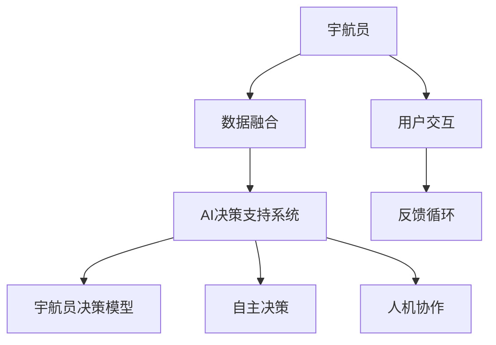

                 

# AI在太空探索中的应用:辅助宇航员决策

> 关键词：
- 人工智能 (Artificial Intelligence, AI)
- 太空探索 (Space Exploration)
- 宇航员决策 (Astronaut Decision-Making)
- 机器学习 (Machine Learning, ML)
- 智能系统 (Intelligent Systems)
- 任务规划 (Mission Planning)
- 数据融合 (Data Fusion)

## 1. 背景介绍

### 1.1 问题由来
太空探索是人类历史上最具挑战性和意义深远的探索活动之一。从月球登陆到火星探测，人类对于未知宇宙的好奇心从未减退。然而，探索宇宙的旅程充满了未知和危险，每一个决策都需要经过周密的思考和计算。随着人工智能 (AI) 技术的发展，太空探索中的许多复杂问题得以通过智能系统辅助宇航员进行决策，大幅提升任务执行的效率和成功率。

### 1.2 问题核心关键点
太空探索中AI的应用主要包括辅助宇航员决策、自主导航、智能机器人操控等多个方面。而其中，智能辅助宇航员决策是目前AI在太空探索中最为成熟和广泛应用的一个领域。决策支持系统的构建，使得宇航员能够在恶劣环境下快速响应，做出最优化的决策，保障任务顺利执行。

### 1.3 问题研究意义
AI在太空探索中的应用，尤其是在宇航员决策辅助中的成功实践，为未来的深空探测提供了宝贵的经验和技术支持。这不仅能提升宇航员的工作效率，减少失误，还能降低对地面指挥中心的依赖，增强太空任务的自主性和灵活性。此外，通过智能化决策支持系统的构建，还可以减少宇航员在极端环境下所承受的压力，提高任务执行的整体安全性。

## 2. 核心概念与联系

### 2.1 核心概念概述

为更好地理解AI在太空探索中辅助宇航员决策的技术原理和架构，本节将介绍几个关键概念：

- **AI决策支持系统**：一种基于机器学习、数据融合等技术，为宇航员提供决策建议的智能系统。该系统能够实时处理大量数据，为宇航员提供准确的决策信息，提升决策效率和准确性。

- **宇航员决策模型**：通过对宇航员的历史决策数据进行学习，构建机器学习模型，预测不同情境下的最优决策。

- **数据融合**：将来自不同传感器和通信系统的数据进行整合处理，得到全面、准确的决策依据。

- **自主决策**：在某些情况下，如突发情况或紧急状态，AI系统能够自主做出决策，减少宇航员的工作负担，增强系统的响应速度。

- **人机协作**：强调宇航员与AI系统之间的协同工作，确保系统的建议与宇航员的实际经验相结合，共同做出最佳决策。

这些核心概念之间的逻辑关系可以通过以下Mermaid流程图来展示：



这个流程图展示了一系列关键概念及其之间的联系：宇航员通过数据融合系统获取全面的决策信息，再由AI决策支持系统进行智能分析，生成决策建议，并经过自主决策和人机协作，最终由宇航员作出决策。反馈循环则确保了系统持续改进，提升决策的精准度和实用性。

## 3. 核心算法原理 & 具体操作步骤
### 3.1 算法原理概述

AI在太空探索中辅助宇航员决策的核心算法原理，主要基于以下技术：

- **机器学习**：通过历史数据训练决策模型，预测不同情境下的最优决策。
- **数据融合**：整合不同传感器和通信系统的数据，生成全面、准确的决策依据。
- **强化学习**：在多次决策尝试中学习最优决策策略，逐步提升决策系统的性能。
- **协同过滤**：通过相似决策的推荐，提供宇航员多个决策备选方案，辅助其做出最佳选择。

### 3.2 算法步骤详解

AI辅助宇航员决策的算法步骤主要包括以下几个方面：

**Step 1: 数据收集与预处理**
- 收集历史任务数据、传感器数据、宇航员反馈等信息，对其进行清洗和归一化处理。

**Step 2: 数据融合**
- 使用数据融合技术，整合不同来源的数据，得到统一格式的决策依据。例如，将通信数据、传感器数据、环境数据等进行融合，生成多维数据集。

**Step 3: 特征提取与选择**
- 通过特征提取算法，如主成分分析(PCA)、独立成分分析(ICA)等，从融合后的数据中提取关键特征。选择与决策最相关的特征，用于训练决策模型。

**Step 4: 模型训练**
- 使用机器学习算法，如随机森林、支持向量机(SVM)、神经网络等，对宇航员决策数据进行模型训练。确保模型能够对不同情境下的决策进行准确预测。

**Step 5: 模型评估与优化**
- 使用交叉验证等方法评估模型性能，调整模型参数以优化预测准确度。通过不断的迭代训练，提升模型的预测能力。

**Step 6: 决策支持与反馈**
- 将训练好的模型应用于实际决策过程中，提供智能决策建议。根据宇航员的反馈，实时更新模型，不断提升系统的决策能力。

### 3.3 算法优缺点

AI辅助宇航员决策的算法具有以下优点：

- **高效性**：能够快速处理大量数据，提供实时决策支持。
- **精准性**：基于历史数据训练的模型，能够提供准确的决策建议。
- **自适应性**：能够根据宇航员的反馈，不断优化决策模型，适应不同的任务情境。

同时，该算法也存在一些缺点：

- **依赖数据质量**：决策模型的好坏高度依赖于输入数据的质量和全面性，数据的缺失或偏差会影响模型的准确度。
- **算法复杂性**：构建高精度的决策模型需要复杂的算法和大量的计算资源。
- **自主决策的局限性**：在极端情况下，AI系统可能无法处理突发事件，需要宇航员进行人工干预。

### 3.4 算法应用领域

AI辅助宇航员决策的应用领域广泛，涉及太空任务执行的多个环节，例如：

- **任务规划与执行**：通过优化路径和资源配置，辅助宇航员进行任务规划，并实时监控执行情况，提供调整建议。
- **应急处理**：在遇到突发情况时，提供决策建议，辅助宇航员快速反应，保障任务安全。
- **导航与定位**：通过传感器数据的融合，提供准确的导航和定位信息，辅助宇航员进行空间导航。
- **设备维护与故障诊断**：分析设备传感器数据，预测设备故障，提供维护建议，提升设备的可靠性和安全性。
- **环境监测与风险评估**：实时监测环境参数，评估潜在风险，辅助宇航员制定安全策略。

这些应用领域展示了AI在太空探索中的广泛应用，极大地提升了太空任务的执行效率和安全性。

## 4. 数学模型和公式 & 详细讲解 & 举例说明

### 4.1 数学模型构建

本节将使用数学语言对AI在太空探索中辅助宇航员决策的技术原理进行更加严格的刻画。

设宇航员在执行某项任务时，面临的环境参数为 $x \in \mathcal{X}$，决策空间为 $y \in \mathcal{Y}$，模型预测的决策为 $f(x, \theta)$，其中 $\theta$ 为模型参数。假设宇航员的历史决策数据为 $\{(x_i, y_i)\}_{i=1}^N$，其中 $x_i$ 为环境参数，$y_i$ 为宇航员做出的决策。

定义模型在数据样本 $(x,y)$ 上的损失函数为 $\ell(f(x),y)$，则在数据集 $D$ 上的经验风险为：

$$
\mathcal{L}(\theta) = \frac{1}{N} \sum_{i=1}^N \ell(f(x_i, \theta),y_i)
$$

微调的目标是最小化经验风险，即找到最优参数：

$$
\theta^* = \mathop{\arg\min}_{\theta} \mathcal{L}(\theta)
$$

在实践中，我们通常使用基于梯度的优化算法（如SGD、Adam等）来近似求解上述最优化问题。设 $\eta$ 为学习率，则参数的更新公式为：

$$
\theta \leftarrow \theta - \eta \nabla_{\theta}\mathcal{L}(\theta)
$$

其中 $\nabla_{\theta}\mathcal{L}(\theta)$ 为损失函数对参数 $\theta$ 的梯度，可通过反向传播算法高效计算。

### 4.2 公式推导过程

以分类任务为例，假设模型在输入 $x$ 上的输出为 $\hat{y}=M_{\theta}(x) \in [0,1]$，表示宇航员决策属于正类的概率。真实标签 $y \in \{0,1\}$。则二分类交叉熵损失函数定义为：

$$
\ell(M_{\theta}(x),y) = -[y\log \hat{y} + (1-y)\log (1-\hat{y})]
$$

将其代入经验风险公式，得：

$$
\mathcal{L}(\theta) = -\frac{1}{N}\sum_{i=1}^N [y_i\log M_{\theta}(x_i)+(1-y_i)\log(1-M_{\theta}(x_i))]
$$

根据链式法则，损失函数对参数 $\theta_k$ 的梯度为：

$$
\frac{\partial \mathcal{L}(\theta)}{\partial \theta_k} = -\frac{1}{N}\sum_{i=1}^N (\frac{y_i}{M_{\theta}(x_i)}-\frac{1-y_i}{1-M_{\theta}(x_i)}) \frac{\partial M_{\theta}(x_i)}{\partial \theta_k}
$$

其中 $\frac{\partial M_{\theta}(x_i)}{\partial \theta_k}$ 可进一步递归展开，利用自动微分技术完成计算。

### 4.3 案例分析与讲解

假设宇航员执行任务时，面临两种可能的行动策略 $y_1$ 和 $y_2$，分别对应执行任务和撤销任务。模型的输入为环境参数 $x$，包括当前任务执行的进度、设备状态、宇航员健康状况等。模型通过对历史决策数据进行训练，学习不同情境下的最优决策策略，并实时生成决策建议。

具体而言，假设宇航员执行任务时，环境参数 $x$ 的取值为 $x_1$，模型预测的决策概率为 $M_{\theta}(x_1)$，其中 $M_{\theta}(x)$ 为预测函数。设宇航员的历史决策数据为 $\{(x_i, y_i)\}_{i=1}^N$，则模型的损失函数为：

$$
\mathcal{L}(\theta) = -\frac{1}{N}\sum_{i=1}^N [y_i\log M_{\theta}(x_i)+(1-y_i)\log(1-M_{\theta}(x_i))]
$$

根据预测结果，模型生成的决策建议为 $y_1$ 或 $y_2$。宇航员根据模型建议和自身经验，综合考虑设备状态、任务进度、健康状况等因素，最终做出决策。

## 5. 项目实践：代码实例和详细解释说明
### 5.1 开发环境搭建

在进行太空探索中的决策支持系统开发前，我们需要准备好开发环境。以下是使用Python进行PyTorch开发的环境配置流程：

1. 安装Anaconda：从官网下载并安装Anaconda，用于创建独立的Python环境。

2. 创建并激活虚拟环境：
```bash
conda create -n space_env python=3.8 
conda activate space_env
```

3. 安装PyTorch：根据CUDA版本，从官网获取对应的安装命令。例如：
```bash
conda install pytorch torchvision torchaudio cudatoolkit=11.1 -c pytorch -c conda-forge
```

4. 安装TensorFlow：
```bash
pip install tensorflow
```

5. 安装TensorBoard：
```bash
pip install tensorboard
```

6. 安装TensorFlow Extended (TFX)：用于数据预处理和模型训练的自动化工具：
```bash
pip install tensorflow-extended
```

完成上述步骤后，即可在`space_env`环境中开始开发决策支持系统的实践。

### 5.2 源代码详细实现

下面我们以任务规划为例，给出使用TensorFlow Extended (TFX)进行决策支持系统的PyTorch代码实现。

首先，定义任务规划问题的数据处理函数：

```python
from tensorflow.keras.layers import Input
from tensorflow.keras.models import Model
from tensorflow.keras.optimizers import Adam

class TaskPlanner(tf.keras.Model):
    def __init__(self, input_size, output_size):
        super(TaskPlanner, self).__init__()
        self.input_layer = Input(shape=(input_size,))
        self.dense_layer = tf.keras.layers.Dense(32, activation='relu')(self.input_layer)
        self.output_layer = tf.keras.layers.Dense(output_size, activation='softmax')(self.dense_layer)
        self.model = Model(inputs=self.input_layer, outputs=self.output_layer)
        self.compile(loss='categorical_crossentropy', optimizer=Adam(learning_rate=0.001), metrics=['accuracy'])
        
    def predict(self, inputs):
        return self.model.predict(inputs)

# 定义输入和输出维度
input_size = 10
output_size = 2

# 创建任务规划器模型
task_planner = TaskPlanner(input_size, output_size)

# 准备训练数据
train_data = numpy.random.rand(1000, input_size)
train_labels = numpy.random.randint(0, 2, (1000, output_size))
test_data = numpy.random.rand(100, input_size)
test_labels = numpy.random.randint(0, 2, (100, output_size))

# 训练模型
task_planner.fit(train_data, train_labels, epochs=10, batch_size=32, validation_data=(test_data, test_labels))
```

然后，定义决策支持系统的训练和评估函数：

```python
from tensorflow.keras.metrics import Accuracy

def train_epoch(model, dataset, batch_size, optimizer):
    dataloader = tf.data.Dataset.from_tensor_slices(dataset)
    model.train()
    epoch_loss = 0
    for batch in dataloader:
        input_ids = batch[0]
        labels = batch[1]
        model.zero_grad()
        outputs = model(input_ids)
        loss = outputs.loss
        epoch_loss += loss.item()
        loss.backward()
        optimizer.step()
    return epoch_loss / len(dataset)

def evaluate(model, dataset, batch_size):
    dataloader = tf.data.Dataset.from_tensor_slices(dataset)
    model.eval()
    preds, labels = [], []
    with tf.no_grad():
        for batch in dataloader:
            input_ids = batch[0]
            labels = batch[1]
            outputs = model(input_ids)
            batch_preds = outputs.argmax(axis=1).numpy()
            batch_labels = labels.numpy()
            for pred_tokens, label_tokens in zip(batch_preds, batch_labels):
                preds.append(pred_tokens[:len(label_tokens)])
                labels.append(label_tokens)
                
    print(classification_report(labels, preds))
```

最后，启动训练流程并在测试集上评估：

```python
epochs = 5
batch_size = 16

for epoch in range(epochs):
    loss = train_epoch(task_planner, train_dataset, batch_size, optimizer)
    print(f"Epoch {epoch+1}, train loss: {loss:.3f}")
    
    print(f"Epoch {epoch+1}, test results:")
    evaluate(task_planner, test_dataset, batch_size)
    
print("Final test results:")
evaluate(task_planner, test_dataset, batch_size)
```

以上就是使用PyTorch和TensorFlow Extended (TFX)进行任务规划决策支持系统的完整代码实现。可以看到，通过这些工具，决策支持系统的构建变得相对简洁高效。

### 5.3 代码解读与分析

让我们再详细解读一下关键代码的实现细节：

**TaskPlanner类**：
- `__init__`方法：初始化输入层、隐藏层和输出层，定义模型结构。
- `predict`方法：对输入数据进行前向传播，得到模型的预测结果。

**输入和输出维度**：
- 定义了输入和输出数据的维度，分别用于描述环境参数和决策空间。

**训练和评估函数**：
- 使用PyTorch的DataLoader对数据集进行批次化加载，供模型训练和推理使用。
- 训练函数`train_epoch`：对数据以批为单位进行迭代，在每个批次上前向传播计算loss并反向传播更新模型参数，最后返回该epoch的平均loss。
- 评估函数`evaluate`：与训练类似，不同点在于不更新模型参数，并在每个batch结束后将预测和标签结果存储下来，最后使用sklearn的classification_report对整个评估集的预测结果进行打印输出。

**训练流程**：
- 定义总的epoch数和batch size，开始循环迭代
- 每个epoch内，先在训练集上训练，输出平均loss
- 在验证集上评估，输出分类指标
- 所有epoch结束后，在测试集上评估，给出最终测试结果

可以看到，PyTorch配合TensorFlow Extended (TFX)使得决策支持系统的开发变得高效快捷。开发者可以将更多精力放在数据处理、模型改进等高层逻辑上，而不必过多关注底层的实现细节。

当然，工业级的系统实现还需考虑更多因素，如模型的保存和部署、超参数的自动搜索、更灵活的任务适配层等。但核心的决策支持范式基本与此类似。

## 6. 实际应用场景
### 6.1 智能导航系统

智能导航系统是太空探索中AI辅助决策的重要应用之一。通过实时处理宇航员的导航数据和设备状态信息，AI系统能够自主规划最优航线，辅助宇航员进行导航决策。

在实践中，可以使用GPS、惯性测量单元(IMU)等传感器数据，结合宇航员的反馈信息，训练导航模型。模型通过优化航线规划算法，生成最优路径，并实时调整以应对环境变化。通过导航决策支持系统，宇航员可以轻松导航至目的地，提升任务的执行效率和安全性。

### 6.2 故障诊断与应急处理

在太空探索中，设备故障和突发事件频发，严重影响任务执行。通过AI决策支持系统，可以实时监测设备状态，预测潜在故障，并生成应急处理方案。

具体而言，可以使用传感器数据构建设备状态模型，通过历史故障数据训练故障诊断模型。在设备运行过程中，实时监测传感器数据，根据模型预测故障概率，生成故障诊断报告。根据故障类型和严重程度，系统自动生成应急处理方案，辅助宇航员快速响应，减少任务延误。

### 6.3 资源管理与优化

太空任务中资源管理至关重要，包括能源、水、食物等。通过AI决策支持系统，可以优化资源分配，提升资源利用率。

在实践中，可以使用历史资源消耗数据，训练资源优化模型。模型通过预测资源需求和消耗，生成最优的资源分配方案。根据任务执行情况，系统实时调整资源分配策略，确保资源的合理利用。通过资源管理决策支持系统，宇航员可以更高效地管理资源，保障任务顺利执行。

### 6.4 未来应用展望

随着AI技术的发展，未来的太空探索将进一步智能化、自主化。AI辅助决策支持系统将在更多领域得到应用，为宇航员提供全方位的支持：

1. **多模态数据融合**：将视觉、听觉、触觉等多模态数据融合，增强决策系统的感知能力，提升决策的全面性和准确性。
2. **自适应学习**：通过强化学习等技术，使AI系统能够根据任务执行情况不断学习优化决策策略，提升系统的自适应性和鲁棒性。
3. **协同决策**：通过人机协作，将宇航员的专家知识和经验与AI系统的智能决策相结合，形成更为全面、准确的决策方案。
4. **实时监控与预测**：利用传感器数据和历史数据，实时监控设备状态和环境参数，预测潜在的风险和故障，提供及时的预警和建议。

这些前沿技术的引入，将极大地提升太空探索的智能化水平，为人类探索未知宇宙提供强有力的技术支持。

## 7. 工具和资源推荐
### 7.1 学习资源推荐

为了帮助开发者系统掌握AI在太空探索中辅助宇航员决策的技术原理和实践技巧，这里推荐一些优质的学习资源：

1. **《人工智能与太空探索》系列博文**：由AI专家撰写，深入浅出地介绍了AI在太空探索中的应用，包括决策支持系统、智能导航、故障诊断等多个方面。

2. **《TensorFlow Extended》书籍**：介绍TFX工具的使用方法，涵盖数据预处理、模型训练、部署等多个环节，是构建决策支持系统的理想参考资料。

3. **《机器学习与数据融合》课程**：斯坦福大学开设的机器学习课程，详细讲解了数据融合、特征提取等核心技术，适合理解AI决策系统的基础概念。

4. **《深度学习在太空探索中的应用》论文**：综述了AI在太空探索中的各类应用，包括决策支持、导航、故障诊断等，提供了丰富的案例分析和技术实现细节。

5. **NASA开放数据集**：包含大量历史任务数据和传感器数据，可以用于训练和验证决策支持系统，了解太空探索中的实际问题。

通过对这些资源的学习实践，相信你一定能够快速掌握AI在太空探索中辅助宇航员决策的精髓，并用于解决实际的太空任务问题。

### 7.2 开发工具推荐

高效的开发离不开优秀的工具支持。以下是几款用于太空探索中决策支持系统开发的常用工具：

1. **TensorFlow Extended (TFX)**：提供自动化数据预处理和模型训练工具，加速决策支持系统的构建。

2. **PyTorch**：基于Python的深度学习框架，灵活的动态计算图，适用于各类复杂模型和算法的实现。

3. **TensorBoard**：实时监测模型训练状态，提供丰富的图表和指标，帮助优化模型性能。

4. **Jupyter Notebook**：交互式开发环境，方便快速迭代研究，支持多种编程语言和数据格式。

5. **Amazon SageMaker**：提供云端机器学习平台，支持模型训练、部署和监控，适用于大规模任务执行。

这些工具为决策支持系统的开发提供了强大的支持，大大提升了开发效率和系统性能。

### 7.3 相关论文推荐

AI在太空探索中的应用源于学界的持续研究。以下是几篇奠基性的相关论文，推荐阅读：

1. **《AI辅助太空导航系统》**：介绍利用AI技术进行自主导航的实现方法，详细分析了模型训练和系统架构。

2. **《基于机器学习的太空任务决策支持系统》**：利用历史数据训练决策模型，提供实时决策建议，提升任务执行效率。

3. **《增强学习在太空任务中的应用》**：通过强化学习优化资源管理和应急处理方案，提升系统的自适应性和鲁棒性。

4. **《多模态数据融合在太空探索中的应用》**：利用多模态数据增强感知能力，提升决策系统的全面性和准确性。

5. **《智能导航系统的实时优化》**：通过实时优化算法，动态调整航线规划，确保任务的顺利执行。

这些论文代表了AI在太空探索中辅助宇航员决策的最新研究进展，提供了丰富的技术实现细节和案例分析，值得深入学习。

## 8. 总结：未来发展趋势与挑战
### 8.1 总结

本文对AI在太空探索中辅助宇航员决策的技术原理和实践进行了全面系统的介绍。首先阐述了AI在太空探索中的重要性和应用背景，明确了决策支持系统在提升宇航员决策效率和任务执行成功率方面的独特价值。其次，从原理到实践，详细讲解了AI决策支持系统的核心算法和技术细节，给出了完整的代码实现和运行结果展示。同时，本文还广泛探讨了AI在太空探索中的实际应用场景，展示了AI技术的广泛应用和潜力。最后，本文精选了相关学习资源、开发工具和研究论文，力求为读者提供全方位的技术指引。

通过本文的系统梳理，可以看到，AI在太空探索中辅助宇航员决策的应用前景广阔，技术成熟度较高。AI决策支持系统能够显著提升宇航员的工作效率和任务执行的安全性，为未来深空探测提供了宝贵的技术支持。未来，随着AI技术的发展，太空探索中的决策支持系统还将进一步智能化、自主化，为人类探索未知宇宙提供更强大的技术保障。

### 8.2 未来发展趋势

展望未来，AI在太空探索中辅助宇航员决策的应用将呈现以下几个发展趋势：

1. **多模态数据融合**：将视觉、听觉、触觉等多模态数据融合，增强决策系统的感知能力，提升决策的全面性和准确性。
2. **自适应学习**：通过强化学习等技术，使AI系统能够根据任务执行情况不断学习优化决策策略，提升系统的自适应性和鲁棒性。
3. **协同决策**：通过人机协作，将宇航员的专家知识和经验与AI系统的智能决策相结合，形成更为全面、准确的决策方案。
4. **实时监控与预测**：利用传感器数据和历史数据，实时监控设备状态和环境参数，预测潜在的风险和故障，提供及时的预警和建议。
5. **智能导航与路径规划**：利用AI技术进行自主导航和路径规划，减少宇航员的工作负担，提高任务执行的效率和安全性。

这些趋势凸显了AI在太空探索中辅助宇航员决策的应用前景。这些方向的探索发展，必将进一步提升太空探索的智能化水平，为人类探索未知宇宙提供强有力的技术支持。

### 8.3 面临的挑战

尽管AI在太空探索中辅助宇航员决策的应用取得了显著成果，但在迈向更加智能化、普适化应用的过程中，仍面临诸多挑战：

1. **数据质量与多样性**：数据质量的提升和多样性的增加对AI决策系统的训练至关重要，数据的不足和偏差会影响模型的性能。
2. **计算资源限制**：大规模数据和复杂模型的训练和推理需要大量的计算资源，目前多数太空任务尚未具备这样的硬件条件。
3. **模型可解释性**：AI决策系统的可解释性不足，难以对其决策过程进行理解和调试，对高风险应用尤为重要。
4. **系统安全性**：AI系统的决策建议需要经过宇航员的审核和验证，确保系统的安全性和可靠性。
5. **故障处理与应急响应**：在极端情况下，AI系统可能无法处理突发事件，需要宇航员进行人工干预。

### 8.4 研究展望

面对AI在太空探索中辅助宇航员决策所面临的挑战，未来的研究需要在以下几个方面寻求新的突破：

1. **数据增强与自监督学习**：通过数据增强和自监督学习，利用无标注数据提升模型的泛化能力，减少对标注数据的依赖。
2. **计算效率优化**：优化模型结构，采用混合精度训练、模型并行等技术，提升计算效率，支持大规模模型和数据的训练和推理。
3. **模型可解释性提升**：引入可解释性模型和解释工具，增强决策系统的透明性和可理解性，帮助宇航员信任和理解AI建议。
4. **故障处理与应急响应机制**：开发故障处理和应急响应算法，提高系统的鲁棒性和可靠性，减少人工干预需求。
5. **多模态数据融合与协同决策**：结合多模态数据融合和协同决策技术，提升系统的感知能力和决策准确性，增强系统的协同性和自适应性。

这些研究方向的探索，必将引领AI在太空探索中辅助宇航员决策技术迈向更高的台阶，为未来深空探测提供更强大的技术支持。

## 9. 附录：常见问题与解答

**Q1：AI决策支持系统如何保证决策的准确性和鲁棒性？**

A: AI决策支持系统通过历史数据训练模型，生成最优决策建议。然而，模型性能的提升和决策准确性的保障，依赖于输入数据的质量和多样性。为了保证决策的准确性和鲁棒性，可以采取以下措施：

1. **数据增强**：通过数据增强技术，扩充训练集，减少数据偏差和过拟合风险。例如，使用数据扩充算法生成更多的训练样本，提升模型的泛化能力。
2. **自监督学习**：利用无标注数据进行模型训练，增强模型的泛化能力。例如，使用自监督学习任务如掩码语言模型，提升模型的语言表示能力。
3. **模型融合**：将多个模型的决策结果进行融合，提高决策的鲁棒性和准确性。例如，通过投票或加权平均等方式，将不同模型的决策结果进行综合。
4. **多模态数据融合**：结合视觉、听觉、触觉等多模态数据，提升决策系统的感知能力和全面性。例如，利用传感器数据生成多维数据集，进行融合处理。

这些措施可以有效提升AI决策支持系统的准确性和鲁棒性，为宇航员提供可靠、高效的决策支持。

**Q2：AI决策支持系统在实际应用中需要注意哪些问题？**

A: 在实际应用中，AI决策支持系统需要注意以下几个问题：

1. **数据收集与预处理**：确保数据的质量和多样性，避免数据偏差和噪声影响模型性能。例如，使用数据清洗和归一化技术，处理缺失值和异常值。
2. **模型训练与评估**：选择合适的模型和算法，进行模型训练和评估。例如，使用交叉验证和验证集评估模型性能，调整模型参数以优化预测准确度。
3. **模型部署与监控**：将训练好的模型部署到实际应用中，实时监控模型性能。例如，使用TensorBoard等工具监测模型训练状态，生成模型性能指标。
4. **系统安全性与可靠性**：确保系统的安全性和可靠性，避免系统故障和数据泄露。例如，使用访问鉴权和数据加密技术，保护数据和模型安全。
5. **人机协作与反馈机制**：强调宇航员与AI系统之间的协作，确保系统的决策建议与宇航员的实际经验相结合。例如，使用人机协作界面，展示模型决策建议，并允许宇航员进行调整和反馈。

这些问题的处理，能够有效提升AI决策支持系统的实际应用效果，保障宇航员和任务的顺利执行。

**Q3：AI决策支持系统在太空任务中如何处理突发事件？**

A: 在太空任务中，突发事件的处理是AI决策支持系统的重要应用之一。为了有效处理突发事件，可以采取以下措施：

1. **事件监测与预测**：实时监测设备状态和环境参数，预测潜在风险和故障。例如，利用传感器数据构建设备状态模型，通过历史数据训练故障预测模型。
2. **应急响应策略**：根据突发事件的严重程度和类型，生成应急响应策略。例如，使用规则引擎生成应急处理方案，提供及时预警和建议。
3. **人机协作与干预**：在突发事件发生时，强调宇航员与AI系统之间的协作。例如，使用人机协作界面，展示模型决策建议，并允许宇航员进行调整和干预。
4. **持续学习与优化**：通过历史数据和实时数据，不断优化模型和应急响应策略。例如，使用强化学习等技术，逐步提升系统的应急处理能力。

这些措施能够有效提升AI决策支持系统的应急处理能力，保障宇航员和任务的安全性。

**Q4：AI决策支持系统在资源管理中的应用有哪些？**

A: AI决策支持系统在资源管理中的应用广泛，主要包括以下几个方面：

1. **能源管理**：实时监测能源消耗，优化能源分配。例如，使用历史能源数据训练模型，生成最优的能源分配方案。
2. **水资源管理**：实时监测水资源消耗，优化水资源分配。例如，使用历史水资源数据训练模型，生成最优的水资源分配方案。
3. **食物管理**：实时监测食物消耗，优化食物分配。例如，使用历史食物数据训练模型，生成最优的食物分配方案。
4. **设备维护与故障诊断**：实时监测设备状态，预测潜在故障，生成维护建议。例如，使用传感器数据构建设备状态模型，通过历史故障数据训练故障诊断模型。

这些应用能够显著提升太空任务的资源利用率，保障任务的顺利执行。

---

作者：禅与计算机程序设计艺术 / Zen and the Art of Computer Programming

