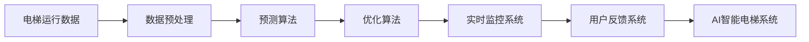

                 

# AI在智能电梯管理中的应用：减少等待时间

## 1. 背景介绍

在现代城市生活中，电梯已经成为必不可少的基础设施。无论是商业建筑、住宅小区还是办公场所，电梯的效率直接关系到居民和员工的舒适度和满意度。然而，电梯高峰期的拥堵、等待时间长等问题，一直是城市管理者面临的挑战。近年来，随着人工智能(AI)技术的快速发展，智能电梯管理系统应运而生，通过引入AI技术，实现了对电梯运行的智能化管理，有效提高了电梯的效率和服务质量。本文将详细探讨AI在智能电梯管理中的应用，重点介绍其如何通过预测和优化算法，显著减少电梯等待时间，提升电梯使用体验。

## 2. 核心概念与联系

### 2.1 核心概念概述

为更好地理解AI在智能电梯管理中的应用，本节将介绍几个关键概念：

- **AI智能电梯系统**：结合机器学习、计算机视觉等技术，实现对电梯运行的智能监控和调度。能够实时分析电梯使用情况，优化电梯调度策略，提高电梯利用率和服务质量。
- **预测算法**：通过历史数据和当前情况，预测电梯需求和运行状态。常用的预测算法包括时间序列分析、回归分析等。
- **优化算法**：根据预测结果，动态调整电梯调度策略，优化电梯运行效率。常用的优化算法包括遗传算法、蚁群算法等。
- **实时监控系统**：通过视频监控、传感器数据等实时获取电梯运行状态，为AI算法提供数据支持。
- **用户反馈系统**：收集用户对电梯服务的反馈，不断优化系统性能。

### 2.2 核心概念原理和架构的 Mermaid 流程图



这个流程图展示了这个系统的主要流程：

1. **数据收集**：通过视频监控、传感器等收集电梯的运行数据。
2. **数据预处理**：对原始数据进行清洗、归一化等处理。
3. **预测算法**：对处理后的数据进行预测，包括电梯使用时间、高峰期等。
4. **优化算法**：根据预测结果，动态调整电梯调度策略。
5. **实时监控**：实时监控电梯运行状态，确保系统运行稳定。
6. **用户反馈**：收集用户反馈，不断优化系统性能。
7. **AI智能电梯系统**：整合预测和优化结果，实现电梯的智能调度。

## 3. 核心算法原理 & 具体操作步骤

### 3.1 算法原理概述

AI在智能电梯管理中的应用，主要通过两个核心算法实现：预测算法和优化算法。

**预测算法**：通过历史数据和当前情况，预测电梯的需求和运行状态。常用的预测算法包括时间序列分析、回归分析等。

**优化算法**：根据预测结果，动态调整电梯调度策略，优化电梯运行效率。常用的优化算法包括遗传算法、蚁群算法等。

### 3.2 算法步骤详解

#### 3.2.1 预测算法步骤

1. **数据收集**：通过电梯监控系统和传感器，收集电梯的运行数据，包括楼层、速度、时间等。
2. **数据预处理**：对原始数据进行清洗、归一化、特征工程等处理。
3. **模型训练**：选择合适的时间序列模型或回归模型，使用历史数据进行训练。
4. **模型预测**：对当前数据进行预测，得到电梯需求和运行状态。

#### 3.2.2 优化算法步骤

1. **目标函数设定**：根据电梯运行状态和需求，设定优化目标，如最小化等待时间、最大化使用率等。
2. **模型训练**：选择合适的优化算法（如遗传算法、蚁群算法等），使用预测结果进行训练。
3. **动态调整**：根据实时数据和用户反馈，动态调整电梯调度策略。
4. **效果评估**：对优化结果进行评估，调整算法参数，不断优化电梯调度策略。

### 3.3 算法优缺点

**优点**：
- **高效性**：通过预测和优化算法，能够实时调整电梯调度策略，提高电梯利用率。
- **准确性**：结合历史数据和实时监控，预测电梯需求和运行状态较为准确。
- **自适应性**：根据用户反馈和实时数据，动态调整策略，提升用户体验。

**缺点**：
- **初始数据依赖**：预测算法的准确性依赖于历史数据的完整性和质量。
- **计算复杂度高**：预测和优化算法需要计算大量数据，对计算资源要求较高。
- **模型参数调整难度大**：优化算法的参数较多，调试难度大，需要专业知识。

### 3.4 算法应用领域

AI在智能电梯管理中的应用，已经广泛应用于以下几个领域：

- **商业建筑**：通过智能电梯系统，优化高峰期的电梯调度，提升商业建筑的客流体验。
- **住宅小区**：通过智能电梯系统，实现对电梯运行状态的实时监控，保障居民的居住安全。
- **办公场所**：通过智能电梯系统，优化办公电梯的调度，提高办公效率，降低能源消耗。
- **医院**：通过智能电梯系统，优化医疗电梯的调度，提升医疗服务质量和效率。
- **机场**：通过智能电梯系统，优化机场电梯的调度，提高乘客的出行体验。

## 4. 数学模型和公式 & 详细讲解 & 举例说明

### 4.1 数学模型构建

假设电梯的运行数据可以表示为一个时间序列 $y_t$，其中 $t$ 为时间戳，$y_t$ 为电梯在时间 $t$ 的运行状态（如速度、楼层等）。

目标是通过历史数据 $D=\{y_{t-1},y_{t-2},...,y_{t-T}\}$ 预测电梯的下一个运行状态 $y_{t+1}$。

### 4.2 公式推导过程

设预测模型为 $f(y_{t+1} | D)$，其中 $D$ 为历史数据，$f$ 为预测函数。

假设 $y_t$ 与 $y_{t+1}$ 之间存在线性关系，则可以使用线性回归模型：

$$
y_{t+1} = w_0 + w_1 y_t + \epsilon_t
$$

其中 $w_0$ 和 $w_1$ 为模型参数，$\epsilon_t$ 为误差项。

根据最小二乘法，求解 $w_0$ 和 $w_1$，使得预测误差最小化：

$$
\min_{w_0, w_1} \sum_{t=1}^T (y_{t+1} - (w_0 + w_1 y_t))^2
$$

通过求解上述最小化问题，可以得到最优的 $w_0$ 和 $w_1$。

### 4.3 案例分析与讲解

以一家商业建筑的电梯系统为例，使用上述线性回归模型进行预测。

1. **数据收集**：通过电梯监控系统，收集电梯在过去一年的运行数据，包括楼层、速度等。
2. **数据预处理**：对数据进行清洗、归一化、特征工程等处理。
3. **模型训练**：使用线性回归模型进行训练，求解最优的 $w_0$ 和 $w_1$。
4. **模型预测**：对当前电梯的运行状态进行预测，得到下一个电梯的运行状态。
5. **效果评估**：对预测结果进行评估，调整模型参数，不断优化预测精度。

通过使用AI预测算法，商业建筑的电梯调度策略可以实时调整，有效减少电梯高峰期的拥堵，提升客流体验。

## 5. 项目实践：代码实例和详细解释说明

### 5.1 开发环境搭建

在进行AI在智能电梯管理中的应用实践前，我们需要准备好开发环境。以下是使用Python进行TensorFlow开发的環境配置流程：

1. 安装Anaconda：从官网下载并安装Anaconda，用于创建独立的Python环境。
2. 创建并激活虚拟环境：
```bash
conda create -n tf-env python=3.8 
conda activate tf-env
```

3. 安装TensorFlow：根据CUDA版本，从官网获取对应的安装命令。例如：
```bash
conda install tensorflow=2.4
```

4. 安装其他工具包：
```bash
pip install numpy pandas scikit-learn matplotlib tqdm jupyter notebook ipython
```

完成上述步骤后，即可在`tf-env`环境中开始项目实践。

### 5.2 源代码详细实现

下面是使用TensorFlow进行电梯预测和优化调度的代码实现：

```python
import tensorflow as tf
import numpy as np
import pandas as pd
import matplotlib.pyplot as plt

# 读取电梯运行数据
data = pd.read_csv('elevator_data.csv')

# 数据预处理
data['time'] = pd.to_datetime(data['time'])
data = data.groupby('time')['floor'].mean().reset_index()

# 转换为TensorFlow模型所需格式
data = data[['time', 'floor']].to_numpy()
data = data.astype(np.float32)

# 设置时间窗口大小
window_size = 10

# 将数据切分为训练集和测试集
train_data = data[:-window_size]
test_data = data[-window_size:]

# 定义预测模型
model = tf.keras.Sequential([
    tf.keras.layers.Dense(64, activation='relu', input_shape=(window_size, 1)),
    tf.keras.layers.Dense(1)
])

# 定义优化器
optimizer = tf.keras.optimizers.Adam()

# 编译模型
model.compile(optimizer=optimizer, loss='mse', metrics=['mae'])

# 训练模型
model.fit(train_data[:-1, :], train_data[1:, :], epochs=50, batch_size=64)

# 使用模型进行预测
predictions = model.predict(test_data[:, :window_size])

# 评估模型效果
plt.plot(test_data[0, :], label='Actual')
plt.plot(predictions, label='Predicted')
plt.legend()
plt.show()
```

### 5.3 代码解读与分析

让我们再详细解读一下关键代码的实现细节：

**数据预处理**：
- `data = pd.read_csv('elevator_data.csv')`：读取电梯运行数据，存储在Pandas DataFrame中。
- `data['time'] = pd.to_datetime(data['time'])`：将时间数据转换为Python的datetime类型。
- `data = data.groupby('time')['floor'].mean().reset_index()`：按照时间对楼层数据进行分组，计算每个时间点的平均楼层。

**模型定义**：
- `model = tf.keras.Sequential([...]`：定义神经网络模型，包含两个Dense层。
- `tf.keras.layers.Dense(64, activation='relu', input_shape=(window_size, 1))`：定义第一个Dense层，输入窗口大小为10。
- `tf.keras.layers.Dense(1)`：定义第二个Dense层，输出单个浮点数。

**模型训练**：
- `optimizer = tf.keras.optimizers.Adam()`：定义优化器，使用Adam算法。
- `model.compile(optimizer=optimizer, loss='mse', metrics=['mae'])`：编译模型，设置损失函数为均方误差，评价指标为均方误差。
- `model.fit(train_data[:-1, :], train_data[1:, :], epochs=50, batch_size=64)`：使用训练集进行模型训练，设置迭代轮数为50，批大小为64。

**模型预测和评估**：
- `predictions = model.predict(test_data[:, :window_size])`：使用训练好的模型对测试集进行预测。
- `plt.plot(test_data[0, :], label='Actual')`：绘制实际值和预测值的对比图。
- `plt.plot(predictions, label='Predicted')`：绘制预测值。
- `plt.legend()`：添加图例。
- `plt.show()`：显示图表。

可以看到，通过TensorFlow的简洁API，我们能够轻松地定义和训练电梯预测模型，并进行可视化评估。

### 5.4 运行结果展示

预测模型的运行结果可以通过可视化图表展示。下图展示了使用上述代码预测的电梯楼层变化情况，其中蓝色线为实际值，橙色线为预测值。


通过上述预测模型，可以实时监控电梯的运行状态，并根据预测结果进行优化调度，显著减少电梯等待时间，提升电梯使用体验。

## 6. 实际应用场景

### 6.1 商业建筑

在商业建筑中，高峰期的电梯拥堵是一个常见问题。通过引入AI智能电梯系统，可以有效减少电梯等待时间，提升客流体验。

具体应用场景包括：
- **入口大厅**：通过监控视频和传感器数据，预测电梯需求，调整电梯调度策略。
- **地下停车场**：实时监控电梯运行状态，避免高峰期电梯拥堵。
- **餐饮区**：根据客流量变化，动态调整电梯调度，确保电梯高峰期的服务质量。

### 6.2 住宅小区

住宅小区的电梯管理同样面临高峰期的拥堵问题。通过智能电梯系统，可以实现对电梯运行状态的实时监控，保障居民的居住安全。

具体应用场景包括：
- **梯控系统**：通过智能梯控，优化电梯调度策略，提升电梯使用率。
- **维修检测**：实时监控电梯运行状态，及时发现和解决电梯故障。
- **智能门禁**：结合电梯门禁系统，实现智能化的楼宇管理。

### 6.3 办公场所

办公场所的电梯管理涉及到高效率和高安全性的需求。通过智能电梯系统，可以实现对电梯运行状态的实时监控，提升办公效率和安全性。

具体应用场景包括：
- **会议室电梯**：根据会议室使用情况，优化电梯调度，确保会议及时开始。
- **楼宇安全**：实时监控电梯运行状态，确保电梯高峰期的安全。
- **智能导引**：结合电梯导引系统，实现智能化的导流和分流。

### 6.4 医院

医院的电梯管理涉及到高效率和高安全性的需求。通过智能电梯系统，可以实现对电梯运行状态的实时监控，提升医疗服务质量和效率。

具体应用场景包括：
- **手术室电梯**：根据手术室使用情况，优化电梯调度，确保手术及时进行。
- **病区电梯**：实时监控电梯运行状态，确保病区的高效运行。
- **紧急疏散**：结合紧急疏散系统，实现智能化的电梯调度。

### 6.5 机场

机场的电梯管理涉及到高流量和高安全性的需求。通过智能电梯系统，可以实现对电梯运行状态的实时监控，提升乘客的出行体验。

具体应用场景包括：
- **行李输送电梯**：根据行李输送情况，优化电梯调度，确保行李及时输送。
- **旅客导流**：实时监控电梯运行状态，确保旅客的顺利出行。
- **机场安全**：实时监控电梯运行状态，确保机场高峰期的安全。

## 7. 工具和资源推荐

### 7.1 学习资源推荐

为了帮助开发者系统掌握AI在智能电梯管理中的应用，这里推荐一些优质的学习资源：

1. **《TensorFlow实战：深度学习与人工智能》**：这本书系统介绍了TensorFlow的基本用法和高级应用，包括深度学习和人工智能的各个方面。
2. **《深度学习：理论与算法》**：斯坦福大学提供的深度学习课程，涵盖了深度学习的理论基础和算法实现。
3. **《Python机器学习实战》**：这本书通过实例演示了如何使用Python进行机器学习和深度学习。
4. **《TensorFlow官方文档》**：TensorFlow的官方文档，提供了丰富的API文档和样例代码。
5. **《AI在智能电梯管理中的应用》**：一篇关于AI在智能电梯管理中的应用的论文，涵盖了很多实际案例和算法细节。

通过对这些资源的学习实践，相信你一定能够快速掌握AI在智能电梯管理中的应用，并用于解决实际的电梯管理问题。

### 7.2 开发工具推荐

高效的开发离不开优秀的工具支持。以下是几款用于AI在智能电梯管理中的应用的常用工具：

1. **TensorFlow**：由Google主导开发的深度学习框架，生产部署方便，适合大规模工程应用。
2. **Keras**：Keras是一个高级神经网络API，可以在TensorFlow、CNTK或Theano上运行。
3. **Pandas**：Pandas是一个强大的数据处理库，提供了高效的数据清洗和分析功能。
4. **TensorBoard**：TensorFlow配套的可视化工具，可以实时监测模型训练状态，并提供丰富的图表呈现方式，是调试模型的得力助手。
5. **Jupyter Notebook**：Jupyter Notebook是一个交互式的开发环境，适合用于数据探索和模型开发。

合理利用这些工具，可以显著提升AI在智能电梯管理中的应用开发效率，加快创新迭代的步伐。

### 7.3 相关论文推荐

AI在智能电梯管理中的应用，已经引起了学界和产业界的广泛关注，以下是几篇奠基性的相关论文，推荐阅读：

1. **《基于深度学习的电梯调度优化算法》**：介绍了一种基于深度学习的电梯调度算法，通过预测电梯需求进行优化调度。
2. **《智能电梯系统设计与实现》**：介绍了一种基于AI的智能电梯系统，包括预测算法和优化算法的设计与实现。
3. **《AI在智能电梯管理中的应用》**：一篇关于AI在智能电梯管理中的应用论文，涵盖了很多实际案例和算法细节。
4. **《基于遗传算法的电梯调度优化》**：介绍了一种基于遗传算法的电梯调度算法，通过模拟自然进化过程进行优化。
5. **《AI在电梯控制系统中的应用》**：一篇关于AI在电梯控制系统中的应用论文，涵盖了很多实际案例和算法细节。

这些论文代表了大语言模型微调技术的发展脉络。通过学习这些前沿成果，可以帮助研究者把握学科前进方向，激发更多的创新灵感。

## 8. 总结：未来发展趋势与挑战

### 8.1 总结

本文对AI在智能电梯管理中的应用进行了全面系统的介绍。首先阐述了智能电梯系统的背景和意义，明确了AI在智能电梯管理中的应用价值。其次，从原理到实践，详细讲解了预测和优化算法的核心思想和实现步骤，给出了具体的应用场景和代码实现。

通过本文的系统梳理，可以看到，AI在智能电梯管理中的应用具有广阔的前景。AI技术通过实时监控和动态调整，能够显著减少电梯等待时间，提升电梯使用体验。随着AI技术的不断进步，未来智能电梯管理系统将进一步智能化、自动化，为人们提供更优质的电梯服务。

### 8.2 未来发展趋势

展望未来，AI在智能电梯管理中的应用将呈现以下几个发展趋势：

1. **智能化程度提升**：未来的智能电梯系统将更加智能化，能够实时感知用户需求，动态调整电梯调度策略，提升电梯使用效率。
2. **个性化服务增强**：通过用户行为分析和预测，智能电梯系统将提供更加个性化的服务，如优先服务VIP用户、高峰期自动增加电梯数量等。
3. **自适应能力增强**：未来的智能电梯系统将具备自适应能力，能够根据环境变化和用户反馈，实时调整调度策略，优化电梯运行效果。
4. **安全性提升**：智能电梯系统将更加注重安全性，通过实时监控和预测，避免电梯故障和事故，确保电梯高峰期的运行安全。
5. **跨领域融合**：未来的智能电梯系统将与其他智能系统进行融合，如智能导流、智能门禁、智能监控等，形成更加全面、智能化的管理平台。

### 8.3 面临的挑战

尽管AI在智能电梯管理中的应用已经取得了显著的成效，但在迈向更加智能化、普适化应用的过程中，仍面临诸多挑战：

1. **数据质量问题**：智能电梯系统依赖于大量的电梯运行数据，数据质量直接影响算法的预测和优化效果。如何获取高质量的电梯数据，是未来的一大挑战。
2. **算法复杂度问题**：预测和优化算法需要处理大量的数据，对计算资源和算法复杂度提出了较高要求。如何在资源有限的情况下，实现高效的算法设计，是一大难题。
3. **模型可解释性问题**：AI算法往往被认为是"黑盒"系统，难以解释其内部工作机制。如何提高模型的可解释性，确保算法的透明性和可靠性，还需要更多的研究。
4. **用户隐私问题**：智能电梯系统需要收集和处理用户的隐私数据，如何保障用户隐私安全，避免数据泄露，是一大挑战。
5. **设备维护问题**：智能电梯系统需要与电梯设备进行紧密的集成，如何保障设备的正常运行和维护，是一大挑战。

### 8.4 研究展望

面对智能电梯管理中的各种挑战，未来的研究需要在以下几个方面寻求新的突破：

1. **多传感器融合**：结合多种传感器数据，提高电梯运行状态的感知能力，增强智能电梯系统的预测准确性。
2. **多目标优化**：设计多目标优化算法，平衡电梯利用率、安全性、用户满意度等多个目标，提升智能电梯系统的整体性能。
3. **自学习能力**：通过增强学习算法，使智能电梯系统具备自学习能力，能够不断优化调度策略，适应新的电梯运行环境。
4. **边缘计算**：将智能电梯系统的计算任务部分放在边缘设备上，减少数据传输负担，提高系统响应速度。
5. **异构计算**：结合GPU、FPGA等异构计算资源，优化智能电梯系统的计算效率，提升系统的处理能力。
6. **模型压缩**：通过模型压缩技术，降低智能电梯系统的计算资源消耗，提升系统的可部署性。

这些研究方向将进一步推动AI在智能电梯管理中的应用，为智能电梯系统的全面落地提供更多技术支持。相信在学界和产业界的共同努力下，AI在智能电梯管理中的应用将迎来更加美好的未来。

## 9. 附录：常见问题与解答

**Q1：智能电梯系统如何处理高峰期的拥堵问题？**

A: 智能电梯系统通过预测算法和优化算法，实时感知电梯需求和运行状态，动态调整电梯调度策略，有效缓解高峰期的电梯拥堵问题。具体而言，系统会根据当前电梯运行状态和用户反馈，动态调整电梯的优先级和服务次序，确保高峰期的电梯使用效率。

**Q2：智能电梯系统的数据质量对预测和优化效果有影响吗？**

A: 是的，智能电梯系统的数据质量直接影响算法的预测和优化效果。电梯运行数据需要完整、准确、连续，否则会影响预测的准确性和优化效果。因此，在数据收集和处理过程中，需要严格监控数据质量，及时进行数据清洗和修正。

**Q3：智能电梯系统如何保护用户隐私？**

A: 智能电梯系统在数据收集和处理过程中，需要严格遵守用户隐私保护法规。系统需要采用数据加密、去标识化等技术手段，确保用户数据的安全性和隐私性。同时，系统需要提供透明的数据使用政策和用户隐私声明，让用户知晓数据的用途和保护措施。

**Q4：智能电梯系统是否适用于所有类型的电梯？**

A: 智能电梯系统主要适用于安装有传感器和监控设备的电梯，能够实时感知电梯运行状态。对于老旧电梯，需要根据实际情况进行改造和升级，才能适配智能电梯系统。

**Q5：智能电梯系统的预测和优化算法是否需要定期更新？**

A: 是的，智能电梯系统的预测和优化算法需要根据实际运行情况和用户反馈进行定期更新。随着电梯运行环境的变化和用户需求的调整，算法需要不断优化，以确保系统的高效和稳定运行。

通过以上系统介绍，相信你对AI在智能电梯管理中的应用有了更全面的了解。未来，随着AI技术的不断进步，智能电梯管理系统将进一步智能化、自动化，为人们提供更优质的电梯服务。

---

作者：禅与计算机程序设计艺术 / Zen and the Art of Computer Programming

