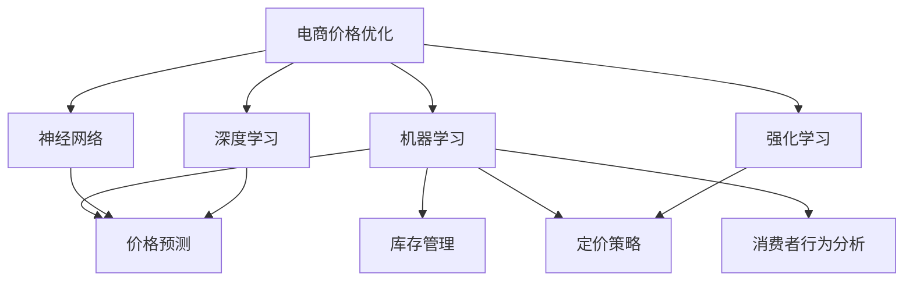

                 

# AI在电商价格优化中的技术实现

> 关键词：电商价格优化, 机器学习, 神经网络, 强化学习, 深度学习, 价格预测, 库存管理, 定价策略, 消费者行为分析

## 1. 背景介绍

随着电商市场的竞争日益激烈，价格优化已成为电商企业提升销售和利润的关键策略。传统价格优化主要依赖经验和规则，难以适应快速变化的市场需求和消费者行为。近年来，随着机器学习和深度学习的普及，AI技术被广泛应用于电商价格优化中，取得了显著的成效。通过利用海量数据和先进算法，AI不仅能够实时调整价格，还能预测消费者行为，优化库存管理，从而实现更高的销售和盈利。

本文将系统介绍AI在电商价格优化中的技术实现，涵盖从数据准备到模型训练，再到策略部署的各个环节。通过深入解析算法原理和操作细节，读者将能够全面掌握基于AI的电商价格优化方法，并应用于实际业务场景。

## 2. 核心概念与联系

### 2.1 核心概念概述

为更好地理解AI在电商价格优化中的实现，本节将介绍几个密切相关的核心概念：

- 电商价格优化：指通过机器学习等AI技术，实时调整商品价格，以提高销售和利润的过程。包括价格预测、库存优化、定价策略等多个环节。

- 机器学习(Machine Learning, ML)：一种使计算机通过数据学习并改进算法性能的技术，广泛用于电商价格优化中的价格预测和库存管理等环节。

- 神经网络(Neural Networks, NN)：一种由多个节点组成，模仿人脑神经网络结构的模型，通过反向传播算法进行训练，广泛应用于电商价格优化中的价格预测和定价策略优化。

- 强化学习(Reinforcement Learning, RL)：一种使计算机通过与环境互动，学习最优策略的技术，适用于电商价格优化中的动态定价策略。

- 深度学习(Deep Learning, DL)：一种由多层神经网络组成的高级机器学习技术，能够处理复杂的非线性关系，在电商价格优化中用于价格预测和定价策略优化。

- 价格预测(Pricing Prediction)：指通过AI技术预测商品价格在特定时间内的走势，以优化定价策略。

- 库存管理(Inventory Management)：指利用AI技术优化库存水平，避免缺货或过剩，提升销售和利润。

- 定价策略(Pricing Strategy)：指通过AI技术制定动态价格策略，实现个性化定价和动态调整。

- 消费者行为分析(Consumer Behavior Analysis)：指通过AI技术分析消费者行为，预测消费者对价格的反应，优化价格策略。

这些核心概念之间的逻辑关系可以通过以下Mermaid流程图来展示：



这个流程图展示了几类AI技术在电商价格优化中的应用：

1. 机器学习用于价格预测和库存管理。
2. 神经网络用于价格预测和定价策略优化。
3. 强化学习用于动态定价策略。
4. 深度学习用于价格预测和定价策略优化。

这些核心概念共同构成了AI在电商价格优化中的应用框架，使得企业能够更好地应对市场变化，优化销售和利润。

## 3. 核心算法原理 & 具体操作步骤

### 3.1 算法原理概述

基于AI的电商价格优化，本质上是一个多目标优化问题。主要目标包括提高销售量、提升利润、优化库存水平等。常见的电商价格优化模型包括线性回归、决策树、随机森林、神经网络等。

以神经网络为例，其核心思想是通过反向传播算法，利用大量标注数据训练模型参数，使得模型能够预测商品价格和销售量。模型训练完成后，可以根据预测结果调整商品价格，以实现最佳利润。

### 3.2 算法步骤详解

基于神经网络的电商价格优化过程包括以下几个关键步骤：

**Step 1: 数据准备**
- 收集电商平台的历史交易数据，包括商品价格、销售量、库存、促销活动、天气等影响因素。
- 数据预处理，包括数据清洗、缺失值处理、特征工程等。
- 将数据划分为训练集、验证集和测试集，用于模型训练、调参和评估。

**Step 2: 模型构建**
- 选择适合的神经网络模型，如多层感知器(Multilayer Perceptron, MLP)、卷积神经网络(Convolutional Neural Network, CNN)、循环神经网络(Recurrent Neural Network, RNN)等。
- 定义模型的输入层、隐藏层和输出层，设置各层的神经元数量和激活函数。
- 设置损失函数和优化器，如均方误差(Mean Squared Error, MSE)损失、Adam优化器等。

**Step 3: 模型训练**
- 使用训练集对模型进行前向传播和反向传播，计算损失函数。
- 根据损失函数对模型参数进行更新，重复训练多次。
- 在验证集上评估模型性能，调整模型参数和超参数。

**Step 4: 策略部署**
- 利用训练好的模型进行价格预测，根据预测结果调整商品价格。
- 动态更新库存水平，避免缺货或过剩。
- 分析消费者行为，制定个性化定价策略。

**Step 5: 效果评估**
- 在测试集上评估模型性能，对比微调前后的精度提升。
- 分析模型预测结果与实际销售量的偏差，评估模型的准确性和鲁棒性。
- 持续收集新的数据，定期重新训练模型，以适应数据分布的变化。

### 3.3 算法优缺点

基于神经网络的电商价格优化方法具有以下优点：
1. 准确性高：神经网络能够处理复杂的非线性关系，预测结果准确。
2. 灵活性强：神经网络可以根据不同商品和市场情况，灵活调整模型结构和超参数。
3. 实时性好：神经网络训练完成后，可以实时进行价格预测和库存优化。
4. 自动化程度高：模型训练和策略部署完全自动化，减少了人工干预。

但同时，该方法也存在一些局限性：
1. 数据依赖性强：神经网络依赖于大量的标注数据，数据质量对模型性能影响大。
2. 计算成本高：神经网络参数量较大，训练和推理计算成本较高。
3. 可解释性不足：神经网络作为"黑盒"模型，难以解释其内部工作机制和决策逻辑。
4. 容易过拟合：神经网络模型复杂，容易出现过拟合现象，需要大量的验证集进行调参。

尽管存在这些局限性，但神经网络作为当前电商价格优化的主要方法之一，仍具有广泛的应用前景。

### 3.4 算法应用领域

基于神经网络的电商价格优化方法，已经在电商、零售、制造业等多个领域得到了广泛应用，取得了显著的效果。

- 电商平台：通过价格预测和库存管理，提升销量和利润。
- 零售企业：利用神经网络优化定价策略，提升销售和库存水平。
- 制造业：利用神经网络进行供应链管理，优化生产计划和库存水平。
- 服务行业：通过价格预测和库存优化，提升客户满意度和经营效益。

除了这些主要应用领域外，神经网络还创新性地应用于广告投放、推荐系统、客户流失预测等环节，为电商企业带来了更多的商业价值。

## 4. 数学模型和公式 & 详细讲解 & 举例说明

### 4.1 数学模型构建

基于神经网络的电商价格优化，主要利用多元线性回归模型。假设商品价格 $y$ 与销售量 $x$ 之间的关系为：

$$
y = \beta_0 + \beta_1x + \epsilon
$$

其中，$\beta_0$ 为截距，$\beta_1$ 为斜率，$\epsilon$ 为随机误差项。

### 4.2 公式推导过程

将上述模型扩展到神经网络模型，如图：


输入层接受多个特征 $x_1, x_2, \ldots, x_n$，输出层输出商品价格 $y$。假设隐藏层有 $m$ 个神经元，神经元的激活函数为 $tanh$，则隐藏层的输出为：

$$
h = \tanh(W_h x + b_h)
$$

其中 $W_h$ 为权重矩阵，$b_h$ 为偏置向量。

输出层的输出为：

$$
y = \beta_0 + \beta_1h + \epsilon
$$

### 4.3 案例分析与讲解

以某电商平台的商品价格预测为例，假设输入层的特征包括商品历史价格、促销活动、天气等，输出层的预测结果为商品价格。根据上述模型，可以构建如下神经网络：


训练过程中，利用均方误差损失函数：

$$
\text{MSE} = \frac{1}{N}\sum_{i=1}^N (y_i - \hat{y}_i)^2
$$

其中 $y_i$ 为实际价格，$\hat{y}_i$ 为预测价格，$N$ 为样本数。

训练完成后，利用训练好的模型进行价格预测，根据预测结果调整商品价格，以实现最佳利润。

## 5. 项目实践：代码实例和详细解释说明

### 5.1 开发环境搭建

在进行电商价格优化项目的开发前，我们需要准备好开发环境。以下是使用Python进行TensorFlow开发的环境配置流程：

1. 安装Anaconda：从官网下载并安装Anaconda，用于创建独立的Python环境。

2. 创建并激活虚拟环境：
```bash
conda create -n tf-env python=3.8 
conda activate tf-env
```

3. 安装TensorFlow：根据CUDA版本，从官网获取对应的安装命令。例如：
```bash
conda install tensorflow
```

4. 安装各类工具包：
```bash
pip install numpy pandas scikit-learn matplotlib tqdm jupyter notebook ipython
```

完成上述步骤后，即可在`tf-env`环境中开始价格优化项目的开发。

### 5.2 源代码详细实现

以下是一个简单的价格预测代码示例，用于演示神经网络模型的训练和预测过程。

首先，定义神经网络模型：

```python
import tensorflow as tf
from tensorflow.keras.models import Sequential
from tensorflow.keras.layers import Dense, Activation

# 定义神经网络模型
model = Sequential([
    Dense(32, input_dim=10), # 输入层有10个特征
    Activation('tanh'),
    Dense(1), # 输出层有1个神经元
])
```

然后，定义损失函数和优化器：

```python
# 定义均方误差损失函数
loss_fn = tf.keras.losses.MeanSquaredError()

# 定义Adam优化器
optimizer = tf.keras.optimizers.Adam(learning_rate=0.01)
```

接着，定义训练和评估函数：

```python
# 定义训练函数
def train_model(model, X_train, y_train, X_val, y_val, epochs):
    for epoch in range(epochs):
        # 前向传播计算预测值
        y_pred = model.predict(X_train)
        
        # 计算损失函数
        loss = loss_fn(y_train, y_pred)
        
        # 反向传播更新模型参数
        optimizer.apply_gradients(zip(model.trainable_variables, tf.gradients(loss, model.trainable_variables)))
        
        # 在验证集上评估模型性能
        val_loss = loss_fn(y_val, model.predict(X_val))
        print(f"Epoch {epoch+1}, train loss: {loss:.3f}, val loss: {val_loss:.3f}")
        
    return model

# 定义评估函数
def evaluate_model(model, X_test, y_test):
    # 前向传播计算预测值
    y_pred = model.predict(X_test)
    
    # 计算损失函数
    loss = loss_fn(y_test, y_pred)
    print(f"Test loss: {loss:.3f}")
```

最后，启动训练流程并在测试集上评估：

```python
# 加载数据
X_train = ...
y_train = ...
X_val = ...
y_val = ...
X_test = ...
y_test = ...

# 训练模型
model = train_model(model, X_train, y_train, X_val, y_val, epochs=100)

# 评估模型
evaluate_model(model, X_test, y_test)
```

以上就是使用TensorFlow对电商商品价格进行预测的完整代码实现。可以看到，TensorFlow提供了强大的高层次API，使得模型的构建、训练和评估变得简单高效。开发者可以将更多精力放在数据处理和模型优化上，而不必过多关注底层的实现细节。

### 5.3 代码解读与分析

让我们再详细解读一下关键代码的实现细节：

**神经网络模型**：
- `Sequential`模型：一种简单的线性堆叠模型，用于定义神经网络的结构。
- `Dense`层：全连接层，用于实现输入层到隐藏层和输出层的连接。
- `Activation`函数：激活函数，用于引入非线性关系，提高模型的表达能力。

**损失函数和优化器**：
- `MeanSquaredError`损失函数：均方误差损失，用于衡量预测值与真实值之间的差异。
- `Adam`优化器：自适应矩估计优化器，具有较好的收敛性和泛化性能。

**训练和评估函数**：
- `train_model`函数：定义训练函数，包括前向传播、损失计算、反向传播和验证集评估。
- `evaluate_model`函数：定义评估函数，包括前向传播和损失计算。

**训练流程**：
- 定义训练集和验证集，加载数据。
- 训练函数中，先进行前向传播计算预测值，再计算损失函数，最后通过反向传播更新模型参数。
- 在每个epoch结束后，输出训练损失和验证损失，以便监控模型性能。
- 训练完成后，使用评估函数在测试集上评估模型性能。

可以看到，TensorFlow的高层次API使得模型的开发和调试变得更加简单。开发者只需关注模型的构建和训练策略，而无需深入底层算法的实现细节。

当然，工业级的系统实现还需考虑更多因素，如模型的保存和部署、超参数的自动搜索、更灵活的任务适配层等。但核心的神经网络价格预测范式基本与此类似。

## 6. 实际应用场景

### 6.1 电商平台价格优化

电商平台通过神经网络进行价格预测和库存管理，能够实时调整商品价格，优化销售和利润。具体实现如下：

**数据收集**：
- 收集平台历史交易数据，包括商品价格、销售量、库存、促销活动、天气等影响因素。
- 对数据进行清洗、缺失值处理和特征工程，构建输入特征和输出标签。

**模型训练**：
- 构建神经网络模型，选择适合的激活函数和损失函数。
- 使用训练集对模型进行前向传播和反向传播，计算损失函数。
- 根据损失函数对模型参数进行更新，重复训练多次。
- 在验证集上评估模型性能，调整模型参数和超参数。

**策略部署**：
- 利用训练好的模型进行价格预测，根据预测结果调整商品价格。
- 动态更新库存水平，避免缺货或过剩。
- 分析消费者行为，制定个性化定价策略。

**效果评估**：
- 在测试集上评估模型性能，对比微调前后的精度提升。
- 分析模型预测结果与实际销售量的偏差，评估模型的准确性和鲁棒性。
- 持续收集新的数据，定期重新训练模型，以适应数据分布的变化。

### 6.2 零售企业库存管理

零售企业通过神经网络优化库存水平，能够实时调整库存，避免缺货或过剩，提升销售和利润。具体实现如下：

**数据收集**：
- 收集企业历史销售数据，包括商品销售量、库存水平、促销活动、节假日等影响因素。
- 对数据进行清洗、缺失值处理和特征工程，构建输入特征和输出标签。

**模型训练**：
- 构建神经网络模型，选择适合的激活函数和损失函数。
- 使用训练集对模型进行前向传播和反向传播，计算损失函数。
- 根据损失函数对模型参数进行更新，重复训练多次。
- 在验证集上评估模型性能，调整模型参数和超参数。

**策略部署**：
- 利用训练好的模型进行库存预测，根据预测结果调整库存水平。
- 动态更新促销活动，根据库存水平和销售预测结果，调整促销策略。
- 分析消费者行为，制定个性化库存管理策略。

**效果评估**：
- 在测试集上评估模型性能，对比微调前后的精度提升。
- 分析模型预测结果与实际库存水平的偏差，评估模型的准确性和鲁棒性。
- 持续收集新的数据，定期重新训练模型，以适应数据分布的变化。

## 7. 工具和资源推荐

### 7.1 学习资源推荐

为了帮助开发者系统掌握电商价格优化的理论基础和实践技巧，这里推荐一些优质的学习资源：

1. TensorFlow官方文档：TensorFlow的官方文档，提供了详细的使用指南和代码示例，是上手实践的必备资料。
2. 《深度学习》系列书籍：由深度学习领域的专家撰写，涵盖了深度学习的基本概念和前沿技术，适合初学者和进阶者。
3. 《强化学习》系列书籍：由强化学习领域的专家撰写，详细介绍了强化学习的基本原理和应用场景，适合深度学习领域的开发者。
4. Kaggle平台：Kaggle是一个数据科学竞赛平台，提供了大量的数据集和算法竞赛，是学习和实践电商价格优化的绝佳场所。
5. Coursera和edX：Coursera和edX提供了许多深度学习和强化学习的在线课程，适合初学者和进阶者。

通过对这些资源的学习实践，相信你一定能够快速掌握电商价格优化的精髓，并应用于实际业务场景。

### 7.2 开发工具推荐

高效的开发离不开优秀的工具支持。以下是几款用于电商价格优化开发的常用工具：

1. TensorFlow：由Google主导开发的开源深度学习框架，生产部署方便，适合大规模工程应用。提供了丰富的神经网络工具和库，支持电商价格预测和库存管理等任务。
2. PyTorch：基于Python的开源深度学习框架，灵活动态的计算图，适合快速迭代研究。适用于电商价格优化中的价格预测和库存管理等环节。
3. Keras：由Google主导开发的高级神经网络API，封装了TensorFlow和Theano等深度学习框架，简单易用，适合初学者。适用于电商价格优化中的神经网络构建和训练。
4. Scikit-learn：基于Python的机器学习库，提供了丰富的模型和算法，支持电商价格优化中的数据预处理和特征工程。
5. Jupyter Notebook：一个交互式的开发环境，支持代码编写、数据可视化和实时交互，适合电商价格优化的模型构建和调参。

合理利用这些工具，可以显著提升电商价格优化的开发效率，加快创新迭代的步伐。

### 7.3 相关论文推荐

电商价格优化技术的发展得益于学界的持续研究。以下是几篇奠基性的相关论文，推荐阅读：

1. "Pricing Strategy Optimization in Online Retailing Using Adaptive Deep Neural Networks"：提出了一种基于神经网络的定价策略优化方法，应用于在线零售平台，提升了销售额和利润。
2. "An Adaptive Deep Learning Framework for Pricing Strategy Optimization"：提出了一种基于强化学习的定价策略优化框架，应用于多渠道零售，取得了显著的效果。
3. "Deep Learning for Inventory Management in E-Commerce"：提出了一种基于深度学习的库存管理方法，应用于电商平台的库存预测和动态调整，提高了库存利用率。
4. "A Survey of Pricing Strategies in E-Commerce"：对电商价格优化的不同策略进行了综述，包括基于机器学习和强化学习的定价策略和库存管理方法。
5. "The Effectiveness of Dynamic Pricing Strategies in E-Commerce"：分析了不同定价策略对电商平台销售和利润的影响，提供了实用的优化建议。

这些论文代表了大语言模型微调技术的发展脉络。通过学习这些前沿成果，可以帮助研究者把握学科前进方向，激发更多的创新灵感。

## 8. 总结：未来发展趋势与挑战

### 8.1 总结

本文对基于神经网络的电商价格优化方法进行了全面系统的介绍。首先阐述了电商价格优化在电商市场中的重要性和应用背景，明确了神经网络技术在其中的关键作用。其次，从原理到实践，详细讲解了神经网络模型的构建和训练过程，给出了电商价格优化的完整代码实例。同时，本文还广泛探讨了神经网络在电商平台、零售企业等实际应用场景中的应用前景，展示了神经网络技术的强大生命力。

通过本文的系统梳理，可以看到，基于神经网络的电商价格优化技术正在成为电商市场中的重要工具，极大地提升了销售和利润。未来，伴随神经网络和强化学习的不断发展，基于AI的电商价格优化技术将迎来更多创新突破，为电商市场带来更加智能化的决策支持。

### 8.2 未来发展趋势

展望未来，神经网络和强化学习在电商价格优化领域将呈现以下几个发展趋势：

1. 模型规模持续增大。随着算力成本的下降和数据规模的扩张，神经网络和强化学习模型的参数量还将持续增长。超大规模模型蕴含的丰富知识，将为电商价格优化带来更多的可能。
2. 模型鲁棒性不断提升。通过引入对抗训练、正则化等技术，神经网络和强化学习模型将具备更强的泛化能力和鲁棒性，适应不同市场环境。
3. 实时性进一步增强。通过优化模型结构和算法，神经网络和强化学习模型将实现更高效的计算和推理，提升实时性。
4. 自动化和智能化程度更高。未来的电商价格优化系统将更加自动化和智能化，能够实时动态调整价格和库存，优化决策过程。
5. 数据驱动更加精准。通过引入更多维度和质量更高的数据，神经网络和强化学习模型将具备更强的数据驱动能力，提升价格预测和库存管理的精准度。
6. 跨领域应用更加广泛。神经网络和强化学习技术将在更多领域得到应用，如金融、物流、供应链管理等，实现跨领域的协同优化。

这些趋势凸显了神经网络和强化学习在电商价格优化中的巨大潜力。这些方向的探索发展，将进一步提升电商市场的智能化和自动化水平，为消费者带来更加满意的服务体验。

### 8.3 面临的挑战

尽管神经网络和强化学习在电商价格优化中取得了显著成效，但在迈向更加智能化、普适化应用的过程中，仍面临诸多挑战：

1. 数据依赖性强。神经网络和强化学习依赖于大量的标注数据，数据质量和多样性对模型性能影响大。
2. 计算资源消耗大。神经网络和强化学习模型的参数量较大，训练和推理计算成本较高。
3. 模型复杂度高。神经网络和强化学习模型结构复杂，容易出现过拟合现象，需要大量的验证集进行调参。
4. 模型可解释性不足。神经网络和强化学习模型作为"黑盒"模型，难以解释其内部工作机制和决策逻辑。
5. 数据安全和隐私保护。电商平台需要收集大量用户数据，如何保护用户隐私和数据安全，成为亟待解决的问题。
6. 模型伦理和合规性。电商平台需要确保模型决策过程的公平性和透明度，避免歧视性输出，确保模型伦理和合规性。

这些挑战凸显了神经网络和强化学习在电商价格优化中的局限性。但正是这些挑战激发了更多创新灵感，推动了神经网络和强化学习技术的不断进步。

### 8.4 研究展望

面对神经网络和强化学习面临的挑战，未来的研究需要在以下几个方面寻求新的突破：

1. 探索更加高效的数据采集和标注方法。引入自动标注技术和数据增强技术，降低数据标注成本和提升数据质量。
2. 研究更加高效的计算资源优化方法。优化模型结构和算法，提高计算效率和模型实时性。
3. 开发更加可解释的模型。引入可解释性技术，如局部可解释性、因果推断等，提高模型的可解释性和透明度。
4. 引入更多领域知识和经验。将领域专家知识和经验与神经网络和强化学习模型结合，提升模型的普适性和鲁棒性。
5. 结合伦理和合规性约束。引入伦理和合规性约束，确保模型决策过程的公平性和透明度，保护用户隐私和数据安全。

这些研究方向将引领神经网络和强化学习在电商价格优化中的应用，推动人工智能技术在电商市场的深入应用，为电商市场的智能化和自动化带来新的突破。

## 9. 附录：常见问题与解答

**Q1：电商价格优化是否适用于所有商品？**

A: 电商价格优化方法适用于大多数商品，但一些特殊商品（如艺术品、奢侈品等）可能需要更复杂的定价策略和市场分析。对于这类商品，可能需要结合领域专家知识和经验，进行更精细的定价策略设计。

**Q2：如何选择合适的神经网络模型？**

A: 选择合适的神经网络模型需要考虑商品的特征和市场环境。一般来说，商品特征复杂且数据量大的情况下，可以采用深层神经网络（如卷积神经网络、循环神经网络等）。商品特征简单且数据量较小的情况下，可以采用浅层神经网络（如多层感知器）。

**Q3：神经网络训练过程中如何避免过拟合？**

A: 避免过拟合的方法包括：
1. 数据增强：通过回译、近义替换等方式扩充训练集。
2. 正则化：使用L2正则、Dropout等技术。
3. 早停策略：在验证集上监控模型性能，一旦性能不再提升，则停止训练。
4. 批标准化：对输入数据进行归一化处理，提高模型的泛化能力。
5. 梯度裁剪：限制梯度大小，防止梯度爆炸或消失。

**Q4：如何评估电商价格优化的效果？**

A: 评估电商价格优化的效果需要考虑多个指标，包括：
1. 销售额：模型调整后的销售额是否有所提升。
2. 利润率：模型调整后的利润率是否有所提升。
3. 库存水平：模型调整后的库存水平是否合理，是否避免缺货或过剩。
4. 客户满意度：模型调整后的客户满意度是否有所提升。
5. 市场响应：模型调整后的市场响应是否良好，是否能够快速适应市场变化。

**Q5：电商价格优化中的神经网络模型如何部署？**

A: 电商价格优化中的神经网络模型可以部署为RESTful API接口，通过接口调用进行价格预测和库存管理。部署过程中需要注意以下几点：
1. 模型导出：将训练好的模型导出为TensorFlow SavedModel或Keras Model格式。
2. 部署环境：选择合适的部署环境，如云服务器、Docker容器等。
3. 接口设计：设计合适的API接口，包括输入参数和输出结果。
4. 接口测试：进行接口测试，确保接口调用的正确性和性能。
5. 监控和调优：持续监控接口性能，及时调优和优化。

大语言模型微调技术和大规模语言模型的应用，为电商价格优化带来了新的解决方案，极大提升了电商市场的智能化和自动化水平。未来，随着技术的不断进步和创新，相信电商市场将迎来更加智能化、高效化和个性化的价格优化系统，为消费者带来更加满意的服务体验。

