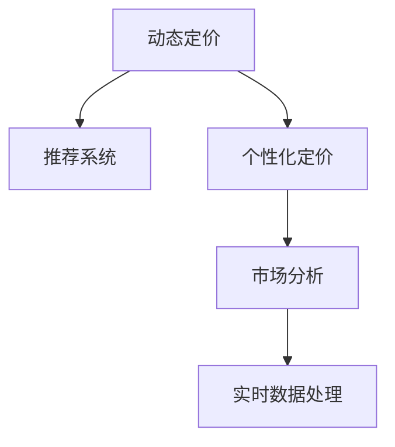

                 

# AI在电商动态定价中的创新应用

> 关键词：人工智能,动态定价,推荐系统,个性化定价,电商平台

## 1. 背景介绍

### 1.1 问题由来
随着电商平台的兴起，动态定价成为各大电商企业争相探索的领域。动态定价不仅影响着企业的销售收入和利润，还关系到用户体验和市场竞争力。传统的静态定价策略难以应对复杂多变的市场需求，无法最大化企业的收益。

近年来，随着人工智能技术的飞速发展，电商企业开始采用AI技术来优化动态定价策略，实现基于用户行为、市场状况等实时因素的个性化定价。AI技术，特别是机器学习和深度学习技术，为电商企业提供了新的解决方案，在提升销售转化率、优化库存管理、增强用户粘性等方面取得了显著成效。

### 1.2 问题核心关键点
动态定价的核心在于如何利用用户历史行为、市场趋势、竞品信息等实时数据，实时调整产品价格，以最大化企业的收益。AI技术通过建立模型，对输入数据进行建模和预测，实现动态定价。关键点包括：

- **用户行为分析**：通过分析用户的历史购买记录、浏览行为等数据，预测用户的购买意愿和价格敏感度。
- **市场状况感知**：实时监控市场供需变化、竞争对手动态等，调整产品价格，以应对市场波动。
- **个性化定价**：针对不同用户群体和不同时间段，设置差异化的价格策略，提升用户满意度。

### 1.3 问题研究意义
动态定价能够显著提升电商企业的销售效率和盈利能力，同时增强用户体验和品牌竞争力。AI技术的引入，使得动态定价更精准、更灵活，能够适应快速变化的市场环境，为企业带来更多的商业机会。

## 2. 核心概念与联系

### 2.1 核心概念概述

为更好地理解AI在电商动态定价中的应用，本节将介绍几个密切相关的核心概念：

- **动态定价(Dynamic Pricing)**：指根据市场需求、市场竞争、用户行为等实时因素，实时调整产品价格的过程。目标是最大化企业的利润或收益。
- **推荐系统(Recommender System)**：通过分析用户历史行为、兴趣偏好等数据，预测用户可能感兴趣的产品，进行个性化推荐。推荐系统常用于电商平台的个性化推荐、广告投放等场景。
- **个性化定价(Personalized Pricing)**：根据用户的行为数据，为不同用户设定差异化的价格策略。目的是提升用户满意度和购买转化率。
- **市场分析(Market Analysis)**：通过分析市场供需、竞争情况等数据，预测市场趋势和价格波动，为动态定价提供依据。
- **实时数据处理(Real-time Data Processing)**：对实时数据进行高效处理和分析，支持动态定价和个性化推荐等实时业务。

这些核心概念之间的逻辑关系可以通过以下Mermaid流程图来展示：



这个流程图展示了大语言模型的核心概念及其之间的关系：

1. 动态定价通过实时数据处理和市场分析，获取市场状况和用户行为数据。
2. 推荐系统利用用户行为数据进行个性化推荐，辅助动态定价。
3. 个性化定价针对不同用户设定差异化价格策略，提升用户体验和转化率。

这些概念共同构成了AI在电商动态定价中的主要应用框架，使其能够在各种场景下发挥强大的预测和优化能力。

## 3. 核心算法原理 & 具体操作步骤
### 3.1 算法原理概述

AI在电商动态定价中的应用，主要基于机器学习和深度学习技术。其核心思想是：通过建立模型，实时分析市场数据和用户行为，预测用户需求和市场趋势，并据此调整产品价格，以最大化企业的收益。

具体而言，AI动态定价流程如下：

1. **数据采集**：从电商平台获取实时数据，如用户浏览记录、购买历史、市场供需状况、竞品价格等。
2. **模型训练**：利用历史数据训练预测模型，对市场趋势和用户行为进行建模和预测。
3. **价格调整**：根据实时数据和预测结果，实时调整产品价格，优化销售策略。
4. **效果评估**：实时监控和评估定价策略的效果，进行反馈调整。

### 3.2 算法步骤详解

以下是AI在电商动态定价中使用的典型算法步骤：

**Step 1: 数据采集与预处理**

- 采集电商平台上的实时数据，如用户浏览行为、购买记录、市场供需状况、竞品价格等。
- 对采集到的数据进行清洗、归一化等预处理，去除噪声，保证数据质量。

**Step 2: 特征工程**

- 从采集到的数据中提取特征，如用户年龄、性别、购买频率、浏览时长等。
- 使用特征选择技术，如主成分分析(PCA)、卡方检验等，选择对目标变量影响较大的特征。

**Step 3: 模型训练**

- 选择合适的模型，如线性回归、随机森林、神经网络等。
- 利用历史数据对模型进行训练，通过交叉验证等技术优化模型参数。
- 模型训练过程中，可以使用正则化技术、集成学习等方法提升模型的泛化能力。

**Step 4: 价格预测与调整**

- 对实时数据进行特征提取和处理，输入训练好的模型进行价格预测。
- 根据预测结果和市场状况，实时调整产品价格。

**Step 5: 效果评估与反馈**

- 实时监控和评估定价策略的效果，如订单量、销售额、利润率等指标。
- 根据评估结果，进行模型优化和参数调整，反馈到模型训练过程。

### 3.3 算法优缺点

AI在电商动态定价中的应用，具有以下优点：

- **精准性高**：基于大量历史数据和实时数据的训练，模型能够准确预测市场需求和用户行为，实现精准定价。
- **实时性强**：实时分析市场和用户数据，能够快速调整价格策略，应对市场变化。
- **灵活性高**：模型可以根据不同用户和市场状况，设置差异化价格策略，提升用户体验和转化率。

同时，该方法也存在一些局限性：

- **数据依赖性强**：模型效果依赖于数据质量，如果数据采集和处理不当，可能导致模型预测偏差。
- **模型复杂度高**：深度学习模型参数量庞大，训练和推理复杂，需要较高的计算资源。
- **模型风险高**：模型预测存在不确定性，价格调整不当可能导致市场反响剧烈。

尽管存在这些局限性，但就目前而言，AI动态定价仍是最主流的电商定价策略之一。未来相关研究将集中在如何进一步优化数据处理、提升模型性能、降低计算成本、增强模型鲁棒性等方面。

### 3.4 算法应用领域

AI在电商动态定价中的应用，已在各大电商平台得到广泛应用，包括：

- **亚马逊(Amazon)**：利用AI技术优化商品定价策略，提升销售额和用户满意度。
- **阿里巴巴(Alibaba)**：通过AI分析用户行为和市场趋势，实现个性化定价和精准推荐。
- **京东(JD.com)**：利用AI技术实时监控市场变化，调整商品价格，优化库存管理。
- **淘宝(Taobao)**：通过AI推荐系统，精准推送商品信息，提升用户购买转化率。

除了上述这些典型应用外，AI动态定价还被创新性地应用到更多场景中，如库存优化、智能客服、用户体验改进等，为电商平台带来了新的商业机会和用户价值。

## 4. 数学模型和公式 & 详细讲解 & 举例说明

### 4.1 数学模型构建

本节将使用数学语言对AI在电商动态定价中的预测模型进行更加严格的刻画。

假设电商平台中的某商品 $i$ 的市场需求为 $D_i$，价格为 $p_i$，市场竞争强度为 $C_i$，用户行为数据为 $X$，则动态定价的目标是最大化销售利润，即：

$$
\max_{p_i, D_i, C_i} \sum_{i}(p_i - c_i)D_i - \frac{1}{2}\alpha\sum_{i}D_i^2
$$

其中 $c_i$ 为商品的成本，$\alpha$ 为价格波动惩罚系数，用于控制价格波动幅度，避免市场动荡。

根据上述目标函数，构建动态定价的优化模型，并利用机器学习算法进行求解。

### 4.2 公式推导过程

以线性回归模型为例，推导价格预测的公式。

假设市场数据 $X$ 和价格 $p$ 之间的关系为：

$$
p_i = \beta_0 + \beta_1X_{i1} + \beta_2X_{i2} + \cdots + \beta_kX_{ik} + \epsilon_i
$$

其中 $\beta_0, \beta_1, \cdots, \beta_k$ 为模型参数，$\epsilon_i$ 为随机噪声。

利用最小二乘法，求解模型参数 $\beta$：

$$
\hat{\beta} = \arg\min_{\beta} \sum_{i}(p_i - \hat{p}_i)^2
$$

其中 $\hat{p}_i = \beta_0 + \beta_1X_{i1} + \beta_2X_{i2} + \cdots + \beta_kX_{ik}$。

根据上述公式，可以求解出每个市场数据点对应的价格预测值。

### 4.3 案例分析与讲解

以下通过一个实际案例，详细讲解AI在电商动态定价中的应用：

**案例背景**：一家电商平台销售某商品，希望通过AI技术优化定价策略，提升销售额和利润率。

**数据采集与预处理**：
- 采集平台上的用户浏览记录、购买历史、市场供需状况、竞品价格等数据。
- 对采集到的数据进行清洗和归一化，去除噪声，保证数据质量。

**特征工程**：
- 从采集到的数据中提取特征，如用户年龄、性别、购买频率、浏览时长、商品评价、市场供需状况等。
- 使用PCA等特征选择技术，选择对目标变量影响较大的特征。

**模型训练**：
- 利用历史数据对线性回归模型进行训练，通过交叉验证等技术优化模型参数。
- 模型训练过程中，使用正则化技术，如L2正则，避免过拟合。

**价格预测与调整**：
- 对实时数据进行特征提取和处理，输入训练好的模型进行价格预测。
- 根据预测结果和市场状况，实时调整商品价格。

**效果评估与反馈**：
- 实时监控和评估定价策略的效果，如订单量、销售额、利润率等指标。
- 根据评估结果，进行模型优化和参数调整，反馈到模型训练过程。

通过以上步骤，该电商平台实现了动态定价，实时调整商品价格，显著提升了销售额和利润率。

## 5. 项目实践：代码实例和详细解释说明

### 5.1 开发环境搭建

在进行动态定价实践前，我们需要准备好开发环境。以下是使用Python进行TensorFlow开发的典型环境配置流程：

1. 安装Anaconda：从官网下载并安装Anaconda，用于创建独立的Python环境。

2. 创建并激活虚拟环境：
```bash
conda create -n tf-env python=3.8 
conda activate tf-env
```

3. 安装TensorFlow：根据CUDA版本，从官网获取对应的安装命令。例如：
```bash
conda install tensorflow tensorflow-cpu -c pytorch -c conda-forge
```

4. 安装各类工具包：
```bash
pip install numpy pandas scikit-learn matplotlib tqdm jupyter notebook ipython
```

完成上述步骤后，即可在`tf-env`环境中开始动态定价实践。

### 5.2 源代码详细实现

下面我以一个简单的案例为例，展示如何使用TensorFlow进行动态定价模型的开发。

首先，定义模型参数和损失函数：

```python
import tensorflow as tf

# 定义模型参数
def create_model(input_dim):
    model = tf.keras.Sequential([
        tf.keras.layers.Dense(64, activation='relu', input_shape=(input_dim,)),
        tf.keras.layers.Dense(1)
    ])
    return model

# 定义损失函数
def create_loss():
    return tf.keras.losses.MSE()
```

然后，定义数据加载和预处理函数：

```python
def load_and_preprocess_data(data_path):
    # 加载数据
    data = pd.read_csv(data_path)

    # 数据预处理
    data['price'] = (data['price'] - data['price'].mean()) / data['price'].std()
    data['features'] = data.drop('price', axis=1)

    return data['features'], data['price']
```

接着，定义模型训练和预测函数：

```python
def train_model(model, train_features, train_price, epochs=100, batch_size=32):
    # 编译模型
    model.compile(optimizer=tf.keras.optimizers.Adam(), loss=create_loss())

    # 训练模型
    model.fit(train_features, train_price, epochs=epochs, batch_size=batch_size, validation_split=0.2)

    # 返回模型
    return model

def predict_price(model, features):
    return model.predict(features)
```

最后，启动训练流程并在测试集上评估：

```python
# 加载数据
train_features, train_price = load_and_preprocess_data('train.csv')

# 创建模型
model = create_model(train_features.shape[1])

# 训练模型
model = train_model(model, train_features, train_price)

# 加载测试数据
test_features, _ = load_and_preprocess_data('test.csv')

# 预测价格
predicted_price = predict_price(model, test_features)

# 输出预测结果
print(predicted_price)
```

以上就是使用TensorFlow进行动态定价模型的完整代码实现。可以看到，TensorFlow提供了强大的API支持，使得模型开发和训练变得简洁高效。

### 5.3 代码解读与分析

让我们再详细解读一下关键代码的实现细节：

**load_and_preprocess_data函数**：
- 定义了数据加载和预处理的过程，包括读取CSV文件、数据归一化等。

**train_model函数**：
- 定义了模型训练和编译的过程，使用了Adam优化器和MSE损失函数。
- 在训练过程中，通过交叉验证评估模型性能，设置验证集比例为20%。

**predict_price函数**：
- 定义了模型预测的过程，将特征输入模型，返回预测价格。

**主函数**：
- 在主函数中，先加载训练数据和测试数据，进行预处理。
- 创建并训练模型，最后使用测试数据进行预测，输出预测结果。

可以看到，TensorFlow提供了完整的模型开发和训练框架，使得动态定价模型的实现变得简单高效。开发者可以将更多精力放在数据处理和业务逻辑上，而不必过多关注底层实现细节。

当然，工业级的系统实现还需考虑更多因素，如模型的保存和部署、超参数的自动搜索、更灵活的任务适配层等。但核心的动态定价范式基本与此类似。

## 6. 实际应用场景

### 6.1 智能客服系统

动态定价技术可以应用于智能客服系统的构建。传统的客服系统往往需要配备大量人力，高峰期响应缓慢，且一致性和专业性难以保证。通过动态定价，根据用户的实时行为和需求，调整服务价格，可以显著提升客服系统的响应速度和用户满意度。

在技术实现上，可以收集用户的历史通话记录、问题类型、响应时长等数据，建立动态定价模型。根据用户的行为数据，动态调整服务价格，使系统能够更精准地响应用户需求，提供更优质的服务。

### 6.2 金融服务

金融服务行业中的交易定价，通常需要实时监控市场行情和用户需求。动态定价技术可以应用于股票交易、外汇交易等场景，实时调整价格，提升交易效率和收益。

例如，在股票交易中，动态定价模型可以根据实时行情、用户订单量和竞品报价，动态调整股票价格，使交易价格更符合市场供需。通过实时动态定价，金融机构可以更好地控制交易风险，提升收益。

### 6.3 旅游业

旅游业中的景点门票定价、酒店价格调整等，也需要实时响应市场需求。动态定价技术可以应用于景点门票、酒店预订等场景，根据用户的预订情况、节假日、季节变化等因素，动态调整价格。

例如，在旅游旺季，动态定价模型可以根据用户需求和景区容纳量，动态调整门票价格，提升旅游体验和景区收入。通过实时动态定价，旅游企业可以更好地控制供需平衡，优化资源配置。

### 6.4 未来应用展望

随着动态定价技术的不断进步，其在更多行业领域的应用前景将更加广阔。未来，动态定价技术将深度融合到更多智能系统中，提升系统的智能化水平，增强用户体验和品牌竞争力。

在智慧医疗领域，动态定价技术可以应用于医疗服务收费，根据患者的病情和治疗需求，动态调整医疗服务价格，提升医疗服务的个性化和精准化。

在智能制造领域，动态定价技术可以应用于生产线的调度和设备维护，根据生产需求和设备状态，动态调整生产计划和维护策略，优化生产效率和设备利用率。

在智慧农业领域，动态定价技术可以应用于农产品的销售定价，根据市场供需和季节变化，动态调整农产品价格，提升农民收入和市场竞争力。

总之，动态定价技术将在更多垂直行业中得到广泛应用，为企业带来更高的经济效益和用户价值。相信随着技术的不断进步和应用场景的不断拓展，动态定价技术将为智能系统的发展注入新的活力。

## 7. 工具和资源推荐

### 7.1 学习资源推荐

为了帮助开发者系统掌握动态定价的理论基础和实践技巧，这里推荐一些优质的学习资源：

1. 《机器学习实战》书籍：全面介绍了机器学习的基本概念和算法，包括回归、分类、聚类等。
2. 《深度学习》课程：斯坦福大学开设的深度学习课程，涵盖神经网络、卷积神经网络、循环神经网络等基本原理和应用。
3. TensorFlow官方文档：TensorFlow的官方文档，提供了丰富的模型开发和训练样例，适合快速上手。
4. Kaggle平台：数据科学竞赛平台，可以参与实际项目，积累经验，提升实战能力。
5. GitHub仓库：多个动态定价模型的代码实现，可供学习和参考。

通过对这些资源的学习实践，相信你一定能够快速掌握动态定价的精髓，并用于解决实际的业务问题。

### 7.2 开发工具推荐

高效的开发离不开优秀的工具支持。以下是几款用于动态定价开发的常用工具：

1. Python：开源的编程语言，具有强大的数据处理和建模能力，适合动态定价等数据分析任务。
2. TensorFlow：由Google主导开发的深度学习框架，生产部署方便，适合大规模工程应用。
3. Keras：基于TensorFlow的高级API，简单易用，适合快速原型开发和模型训练。
4. Scikit-learn：Python的机器学习库，提供了丰富的模型和算法，适合数据预处理和特征工程。
5. Pandas：数据处理库，适合数据清洗、转换和分析，方便数据预处理。

合理利用这些工具，可以显著提升动态定价模型的开发效率，加快创新迭代的步伐。

### 7.3 相关论文推荐

动态定价技术的快速发展，离不开学界的持续研究。以下是几篇奠基性的相关论文，推荐阅读：

1. "Dynamic Pricing: Mechanism Design and Implementation"（机制设计与实施）：提出了动态定价的理论基础和实现方法，是动态定价领域的经典之作。
2. "Revenue Optimization: A New Approach to Price Adaptation"（收益优化：价格适应的新方法）：提出了一种基于市场的动态定价模型，以优化收益。
3. "Data-Driven Dynamic Pricing in Online Environments"（数据驱动的在线动态定价）：介绍了在线动态定价的基本方法和技术挑战。
4. "Real-Time Dynamic Pricing for Revenue and Demand Management"（实时动态定价：收益与需求管理）：提出了一种基于机器学习的实时动态定价方法，用于优化需求和收益。
5. "Customer-Level Dynamic Pricing in Airline Revenue Management"（客户级别的动态定价在航空收益管理中）：讨论了客户级别的动态定价方法，用于提升航空公司的收益。

这些论文代表了大动态定价技术的发展脉络。通过学习这些前沿成果，可以帮助研究者把握学科前进方向，激发更多的创新灵感。

## 8. 总结：未来发展趋势与挑战

### 8.1 总结

本文对AI在电商动态定价中的应用进行了全面系统的介绍。首先阐述了动态定价在电商平台的背景和意义，明确了AI技术在优化定价策略中的独特价值。其次，从原理到实践，详细讲解了动态定价的数学模型和关键算法步骤，给出了动态定价任务开发的完整代码实例。同时，本文还广泛探讨了动态定价技术在智能客服、金融服务、旅游业等多个行业领域的应用前景，展示了动态定价技术的广泛应用潜力。此外，本文精选了动态定价技术的各类学习资源，力求为读者提供全方位的技术指引。

通过本文的系统梳理，可以看到，AI动态定价技术正在成为电商平台的重要范式，极大地提升了电商企业的销售效率和盈利能力，同时增强了用户体验和品牌竞争力。未来，伴随动态定价技术的不断发展，其在更多垂直行业中得到应用的可能性将不断增加，为智能系统的发展注入新的活力。

### 8.2 未来发展趋势

展望未来，动态定价技术将呈现以下几个发展趋势：

1. **模型复杂度提升**：随着深度学习技术的发展，动态定价模型的复杂度将不断提高，以适应更复杂的市场环境和用户行为。未来模型将更加精确和灵活，能够更好地应对市场变化。
2. **实时性增强**：未来的动态定价模型将更加注重实时数据处理，能够在毫秒级别对市场变化做出响应，提升定价的实时性和准确性。
3. **多模态融合**：未来的动态定价模型将融合多种数据来源，如市场数据、用户数据、社交媒体数据等，进行多模态融合，提升定价的全面性和准确性。
4. **个性化加强**：动态定价模型将更加注重个性化定价，根据用户的不同需求和行为特征，设定差异化的价格策略，提升用户体验和转化率。
5. **跨领域应用**：动态定价技术将从电商领域延伸到更多垂直行业，如金融、旅游、医疗等，成为各行业中的核心竞争力。
6. **透明度提升**：未来的动态定价模型将更加注重定价过程的透明度，通过可解释性算法和用户反馈机制，提升模型的可解释性和用户信任度。

以上趋势凸显了动态定价技术的广阔前景。这些方向的探索发展，必将进一步提升动态定价系统的性能和应用范围，为智能系统的发展注入新的活力。

### 8.3 面临的挑战

尽管动态定价技术已经取得了显著成果，但在迈向更加智能化、普适化应用的过程中，它仍面临着诸多挑战：

1. **数据依赖性强**：模型效果依赖于数据质量，如果数据采集和处理不当，可能导致模型预测偏差。
2. **计算资源需求高**：深度学习模型参数量庞大，训练和推理复杂，需要较高的计算资源。
3. **模型鲁棒性不足**：模型预测存在不确定性，价格调整不当可能导致市场反响剧烈。
4. **隐私和安全问题**：动态定价模型需要收集和处理用户数据，存在隐私和安全风险，需要加强数据保护和隐私管理。

尽管存在这些挑战，但通过不断优化模型、提升计算资源、加强隐私保护等措施，动态定价技术有望进一步提升其应用效果和安全性。

### 8.4 研究展望

面对动态定价技术所面临的种种挑战，未来的研究需要在以下几个方面寻求新的突破：

1. **数据增强技术**：通过数据增强技术，提升数据质量和多样性，降低模型对单一数据源的依赖。
2. **轻量级模型**：开发轻量级动态定价模型，减少计算资源消耗，提升模型的实时性和可扩展性。
3. **多模态融合**：融合多模态数据，提升定价的全面性和准确性，适应多领域应用需求。
4. **模型解释性**：开发可解释性算法，提升动态定价模型的透明度和用户信任度。
5. **隐私保护技术**：加强隐私保护技术，保护用户数据，提升动态定价系统的安全性。

这些研究方向的探索，必将引领动态定价技术迈向更高的台阶，为智能系统的发展提供更加坚实的技术保障。

## 9. 附录：常见问题与解答

**Q1：动态定价模型需要多少标注数据？**

A: 动态定价模型对标注数据的需求相对较少，但高质量标注数据仍然是提升模型效果的关键。一般建议收集至少几百个有代表性的数据点作为训练样本，确保模型的泛化能力。

**Q2：动态定价模型是否需要频繁更新？**

A: 动态定价模型需要根据市场变化和用户行为实时更新，以保持模型的准确性和实时性。因此，模型更新频率应根据市场变化和用户行为变化来确定，通常为几小时到几日不等。

**Q3：动态定价模型是否需要人工干预？**

A: 动态定价模型通常需要人工干预和调整，特别是在市场波动较大或模型性能不佳时。通过人工干预，可以及时调整模型参数，优化定价策略。

**Q4：动态定价模型是否需要考虑用户隐私？**

A: 动态定价模型需要收集和处理用户数据，因此隐私保护是不可忽视的问题。应采用数据脱敏、差分隐私等技术，保护用户隐私，提升系统的安全性。

**Q5：动态定价模型如何处理突发事件？**

A: 动态定价模型需要考虑突发事件的影响，如节假日、市场动荡等。可以设计特殊事件处理机制，根据突发事件进行模型调整和定价策略优化。

这些问题的解答，希望能够帮助你更好地理解和应用动态定价技术，在实际项目中取得理想的效果。

---

作者：禅与计算机程序设计艺术 / Zen and the Art of Computer Programming

