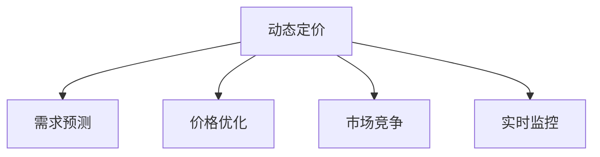
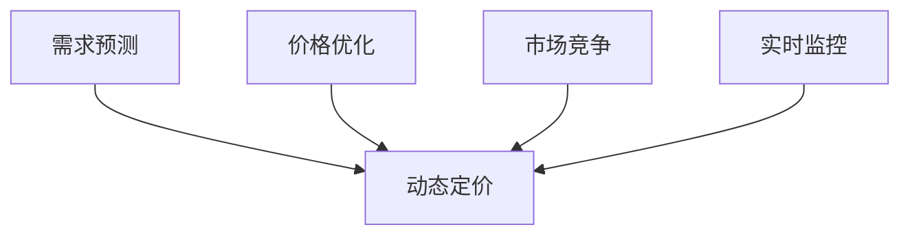
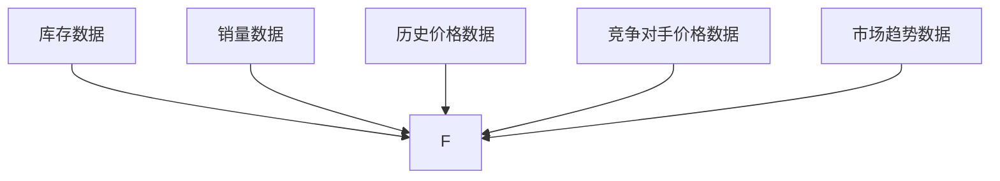
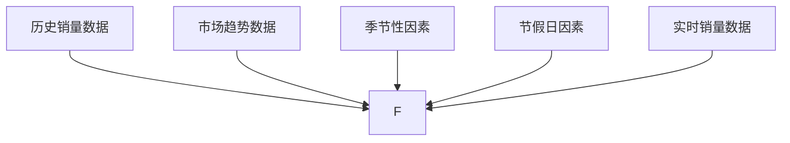
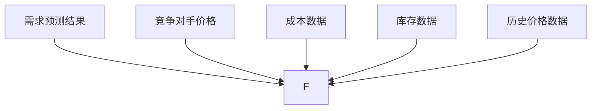
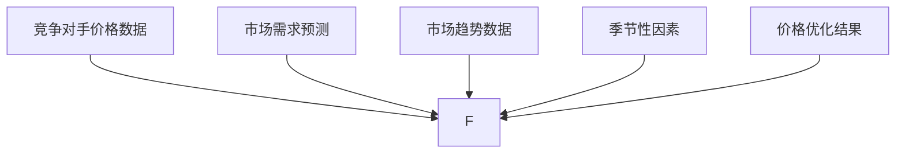
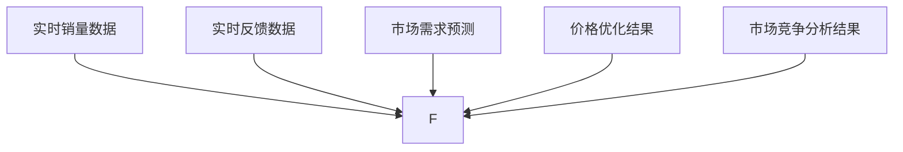
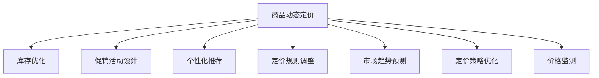
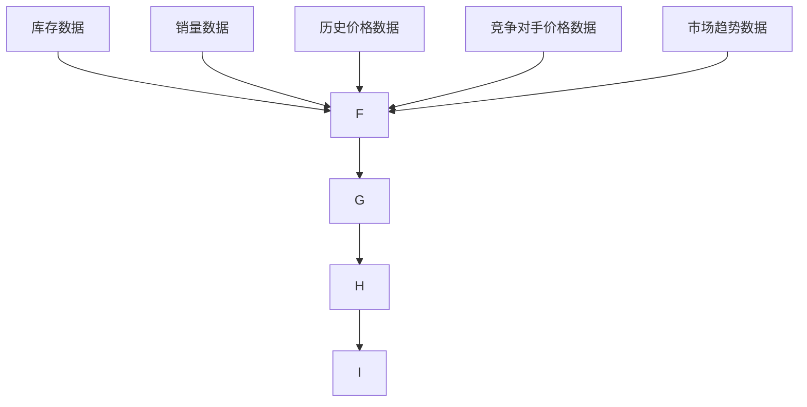
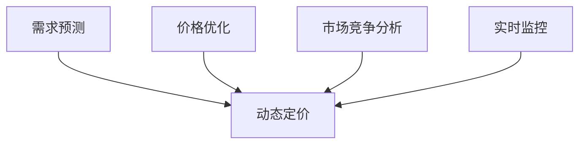

                 

# AI在电商动态定价中的实际应用

> 关键词：动态定价,电商,人工智能,机器学习,需求预测,价格优化

## 1. 背景介绍

### 1.1 问题由来
电商行业竞争日趋激烈，消费者需求多样化、个性化。为争夺市场份额，商家不断调整商品价格，以应对不同的市场环境。然而，传统定价方式往往缺乏对市场动态的及时响应，导致价格策略不够精准，降低了销售效率和市场竞争力。

为此，越来越多的电商企业开始引入人工智能技术，构建动态定价模型，实现精准、灵活的价格调整，提升销售额和市场份额。

### 1.2 问题核心关键点
电商动态定价的核心在于实时响应市场变化，灵活调整商品价格。主要涉及以下几个关键点：

1. 数据获取：实时获取库存、销量、历史价格、竞争对手价格等市场数据。
2. 需求预测：预测市场需求变化，及时调整库存和价格。
3. 价格优化：根据市场需求预测结果，优化商品价格，确保价格竞争力。
4. 实时监控：实时监控市场反馈，及时调整定价策略。

这些关键点构成了电商动态定价的技术框架，通过人工智能技术的应用，可以实现精准、灵活、高效的定价策略。

### 1.3 问题研究意义
电商动态定价能够有效提升企业的市场竞争力，具体表现在：

1. 提高销售效率：通过动态调整价格，优化库存管理，提升销售额和利润率。
2. 提升客户满意度：根据客户需求和市场变化灵活调整价格，增强客户购买意愿。
3. 增强市场竞争力：及时响应竞争对手价格调整，保持市场领先地位。
4. 降低运营成本：优化库存管理，减少仓储和物流成本。
5. 数据驱动决策：基于大数据分析，科学制定价格策略，减少决策风险。

总之，电商动态定价是电商行业人工智能应用的典型场景，对提升企业市场竞争力和运营效率具有重要意义。

## 2. 核心概念与联系

### 2.1 核心概念概述

为更好地理解电商动态定价的实现过程，本节将介绍几个关键概念：

- 动态定价(Dynamic Pricing)：根据市场需求和竞争对手价格变化，实时调整商品价格，以最大化利润和市场份额的定价策略。
- 需求预测(Demand Forecasting)：通过分析历史数据和市场趋势，预测未来需求的变化。
- 价格优化(Pricing Optimization)：基于需求预测结果，优化商品价格，确保价格竞争力。
- 市场竞争(Capacity Utilization)：分析竞争对手的定价策略，调整自身价格以提高市场占有率。
- 实时监控(Real-time Monitoring)：实时监测市场反馈，及时调整定价策略。

这些概念通过人工智能技术的应用，构建起电商动态定价的完整技术框架，如图1所示。



这些核心概念之间的联系如图2所示，需求预测、价格优化和市场竞争是动态定价的基础，实时监控则确保定价策略的实时调整和优化。



## 3. 核心算法原理 & 具体操作步骤
### 3.1 算法原理概述

电商动态定价的核心算法原理是构建基于需求预测的定价模型，通过实时监测市场变化，动态调整商品价格，以最大化利润和市场份额。主要分为以下步骤：

1. 数据收集：获取库存、销量、历史价格、竞争对手价格等市场数据。
2. 需求预测：基于历史数据和市场趋势，预测未来需求变化。
3. 价格优化：根据需求预测结果，优化商品价格。
4. 市场竞争：分析竞争对手价格策略，调整自身价格。
5. 实时监控：实时监测市场反馈，及时调整定价策略。

### 3.2 算法步骤详解

#### 3.2.1 数据收集

数据收集是动态定价的基础。电商企业需要从多个渠道获取市场数据，如图3所示。



1. **库存数据**：获取商品的当前库存情况，如SKU数量、库存位置等。
2. **销量数据**：获取商品的过去和当前销量情况，如每日、每周、每月销量等。
3. **历史价格数据**：获取商品的历史价格变化，如过去价格、促销价格等。
4. **竞争对手价格数据**：获取竞争对手的价格变化，如竞争对手的促销价格、折扣力度等。
5. **市场趋势数据**：获取市场宏观经济、季节性变化等影响因素。

#### 3.2.2 需求预测

需求预测是动态定价的关键。电商企业需要通过多种算法预测未来需求变化，如图4所示。



1. **历史销量数据**：获取过去一段时间的商品销量情况。
2. **市场趋势数据**：获取市场宏观经济、行业趋势等数据。
3. **季节性因素**：分析季节性变化对需求的影响。
4. **节假日因素**：考虑节假日对需求的影响。
5. **实时销量数据**：实时获取当前销量情况，用于调整需求预测模型。

常用的需求预测算法包括时间序列分析、ARIMA、神经网络、回归分析等。

#### 3.2.3 价格优化

价格优化是动态定价的核心。电商企业需要基于需求预测结果，优化商品价格，如图5所示。



1. **需求预测结果**：获取未来需求预测结果。
2. **竞争对手价格**：获取竞争对手的价格变化。
3. **成本数据**：获取商品的成本信息。
4. **库存数据**：获取商品的库存情况。
5. **历史价格数据**：获取商品的历史价格变化。

常用的价格优化算法包括线性规划、非线性规划、遗传算法等。

#### 3.2.4 市场竞争

市场竞争是动态定价的重要环节。电商企业需要分析竞争对手的价格策略，调整自身价格，如图6所示。



1. **竞争对手价格数据**：获取竞争对手的价格变化。
2. **市场需求预测**：获取未来市场需求预测结果。
3. **市场趋势数据**：获取市场宏观经济、行业趋势等数据。
4. **季节性因素**：分析季节性变化对需求的影响。
5. **价格优化结果**：获取价格优化结果。

常用的市场竞争分析算法包括聚类分析、回归分析、博弈论等。

#### 3.2.5 实时监控

实时监控是动态定价的保障。电商企业需要实时监测市场反馈，及时调整定价策略，如图7所示。



1. **实时销量数据**：实时获取当前销量情况。
2. **实时反馈数据**：获取用户对价格的反馈信息。
3. **市场需求预测**：获取未来市场需求预测结果。
4. **价格优化结果**：获取价格优化结果。
5. **市场竞争分析结果**：获取市场竞争分析结果。

常用的实时监控算法包括在线学习、强化学习、异常检测等。

### 3.3 算法优缺点

动态定价算法具有以下优点：

1. **响应市场变化**：实时获取市场数据，动态调整价格，提升市场竞争力。
2. **优化库存管理**：通过价格调整，优化库存管理，减少库存积压和缺货风险。
3. **提升销售额**：通过精准定价，提升客户购买意愿，增加销售额。
4. **降低成本**：优化库存管理，减少仓储和物流成本。
5. **数据驱动决策**：基于大数据分析，科学制定价格策略，减少决策风险。

同时，动态定价算法也存在以下缺点：

1. **计算复杂度**：需要实时处理大量数据，计算复杂度高。
2. **数据依赖**：对数据质量和数据获取的准确性要求高。
3. **模型假设**：基于假设的模型，可能无法完全反映市场实际情况。
4. **市场风险**：价格调整可能引发市场波动，影响品牌形象。
5. **成本控制**：价格频繁调整可能增加运营成本，难以控制。

尽管存在这些缺点，但动态定价算法在电商行业的应用已经取得了显著成效，是电商企业提升市场竞争力和运营效率的重要手段。

### 3.4 算法应用领域

电商动态定价算法已经广泛应用于多个领域，如图8所示。



1. **商品动态定价**：基于市场需求预测结果，动态调整商品价格。
2. **库存优化**：通过价格调整，优化库存管理，减少库存积压和缺货风险。
3. **促销活动设计**：基于市场需求预测结果，设计促销活动，提升销售额。
4. **个性化推荐**：通过价格调整，优化个性化推荐模型，提升客户购买意愿。
5. **定价规则调整**：根据市场反馈，调整定价规则，优化价格策略。
6. **市场趋势预测**：分析市场趋势，预测未来需求变化，制定价格策略。
7. **定价策略优化**：优化定价策略，提升市场竞争力和销售额。
8. **价格监测**：实时监测市场反馈，及时调整定价策略。

这些应用场景展示了动态定价算法的广泛适用性，为电商企业提供了多种提高市场竞争力和运营效率的解决方案。

## 4. 数学模型和公式 & 详细讲解  
### 4.1 数学模型构建

电商动态定价的核心数学模型包括需求预测模型和价格优化模型。

1. **需求预测模型**：
   需求预测模型主要基于历史数据和市场趋势，预测未来需求变化。常用的模型包括ARIMA、神经网络等。

   数学模型：
   $$
   \hat{D}_t = \sum_{i=1}^{p} \alpha_i D_{t-i} + \sum_{j=1}^{q} \beta_j D_{t-j} + \sum_{k=1}^{m} \gamma_k S_{t-k}
   $$

   其中：
   - $D_t$：第$t$期的需求预测值。
   - $\alpha_i$、$\beta_j$、$\gamma_k$：模型参数。
   - $D_{t-i}$、$D_{t-j}$：滞后$i$、$j$期的实际需求数据。
   - $S_{t-k}$：滞后$k$期的市场趋势数据。

2. **价格优化模型**：
   价格优化模型主要基于需求预测结果和成本数据，优化商品价格。常用的模型包括线性规划、非线性规划等。

   数学模型：
   $$
   \min \sum_{i=1}^{n} p_i c_i + \lambda \sum_{i=1}^{n} p_i D_i - \sum_{i=1}^{n} p_i d_i
   $$

   其中：
   - $p_i$：第$i$种商品的定价变量。
   - $c_i$：第$i$种商品的成本。
   - $D_i$：第$i$种商品的需求预测值。
   - $d_i$：第$i$种商品的固定成本。
   - $\lambda$：惩罚系数。

### 4.2 公式推导过程

#### 4.2.1 需求预测模型

以ARIMA模型为例，推导需求预测的公式：

ARIMA模型可以表示为：
$$
\phi(B) \Delta^d (D_t) = \theta(B) \varepsilon_t
$$

其中，$\phi(B)$和$\theta(B)$是差分算子和滞后算子，$\Delta^d$表示差分$d$次，$\varepsilon_t$是白噪声序列。

将差分后的模型展开：
$$
\phi(B) \Delta^d (D_t) = \theta(B) \varepsilon_t
$$

将$\Delta^d$展开：
$$
\phi(B) \left( \Delta (D_t - D_{t-1}) \right) = \theta(B) \varepsilon_t
$$

继续展开：
$$
\phi(B) \left( D_t - D_{t-1} \right) = \theta(B) \varepsilon_t
$$

最后得到：
$$
D_t = \phi(B) (D_{t-1} - D_{t-2}) + \theta(B) \varepsilon_t
$$

其中，$B$为滞后算子，$\phi(B)$和$\theta(B)$为滞后算子多项式。

#### 4.2.2 价格优化模型

以线性规划模型为例，推导价格优化的公式：

线性规划模型可以表示为：
$$
\min \sum_{i=1}^{n} p_i c_i + \lambda \sum_{i=1}^{n} p_i D_i - \sum_{i=1}^{n} p_i d_i
$$

其中，$p_i$为第$i$种商品的定价变量，$c_i$为第$i$种商品的成本，$D_i$为第$i$种商品的需求预测值，$d_i$为第$i$种商品的固定成本，$\lambda$为惩罚系数。

将价格优化模型转化为一元线性规划问题：
$$
\min \sum_{i=1}^{n} (p_i c_i + \lambda p_i D_i - p_i d_i)
$$

根据KKT条件，得到价格优化的公式：
$$
\frac{\partial L}{\partial p_i} = \frac{\partial (p_i c_i + \lambda p_i D_i - p_i d_i)}{\partial p_i} = 0
$$

求解得到：
$$
p_i = \frac{c_i - d_i}{\lambda D_i}
$$

其中，$c_i$为第$i$种商品的成本，$d_i$为第$i$种商品的固定成本，$\lambda$为惩罚系数，$D_i$为第$i$种商品的需求预测值。

### 4.3 案例分析与讲解

#### 案例1：电商商品动态定价

某电商企业希望通过动态定价提高销售额，如图9所示。



1. **需求预测**：使用ARIMA模型预测未来需求变化。
2. **价格优化**：基于需求预测结果，使用线性规划模型优化商品价格。
3. **市场竞争分析**：分析竞争对手价格策略，调整自身价格。
4. **实时监控**：实时获取用户反馈和市场数据，调整定价策略。

案例分析：
某电商企业希望通过动态定价提升销售额，如图10所示。



需求预测：使用ARIMA模型预测未来需求变化，得到需求预测结果。

价格优化：基于需求预测结果，使用线性规划模型优化商品价格，得到最优价格。

市场竞争分析：分析竞争对手价格策略，调整自身价格，确保价格竞争力。

实时监控：实时获取用户反馈和市场数据，调整定价策略，确保最优价格。

通过动态定价，该电商企业成功提高了销售额，并提升了市场竞争力。

#### 案例2：库存优化

某电商企业希望通过动态定价优化库存管理，如图11所示。


1. **需求预测**：使用ARIMA模型预测未来需求变化。
2. **价格优化**：基于需求预测结果，使用线性规划模型优化商品价格。
3. **市场竞争分析**：分析竞争对手价格策略，调整自身价格。
4. **实时监控**：实时获取用户反馈和市场数据，调整定价策略。

案例分析：
某电商企业希望通过动态定价优化库存管理，如图12所示。


需求预测：使用ARIMA模型预测未来需求变化，得到需求预测结果。

价格优化：基于需求预测结果，使用线性规划模型优化商品价格，确保最优库存量。

市场竞争分析：分析竞争对手价格策略，调整自身价格，确保市场竞争力。

实时监控：实时获取用户反馈和市场数据，调整定价策略，优化库存管理。

通过动态定价，该电商企业成功优化了库存管理，减少了库存积压和缺货风险。

## 5. 项目实践：代码实例和详细解释说明
### 5.1 开发环境搭建

在进行电商动态定价项目开发前，需要准备好开发环境。以下是使用Python进行项目开发的流程：

1. 安装Anaconda：从官网下载并安装Anaconda，用于创建独立的Python环境。

2. 创建并激活虚拟环境：
```bash
conda create -n pricing-env python=3.8 
conda activate pricing-env
```

3. 安装必要的Python包：
```bash
pip install pandas numpy scikit-learn statsmodels
```

4. 安装深度学习框架：
```bash
pip install torch torchvision transformers
```

5. 准备数据集：将电商企业的历史数据、市场数据等导入Python环境。

完成上述步骤后，即可在`pricing-env`环境中开始项目开发。

### 5.2 源代码详细实现

以下是一个电商动态定价项目的完整代码实现，包括需求预测、价格优化、市场竞争分析、实时监控等关键模块。

```python
import pandas as pd
import numpy as np
from statsmodels.tsa.arima_model import ARIMA
from sklearn.linear_model import LinearRegression
from sklearn.preprocessing import StandardScaler

# 读取数据
data = pd.read_csv('data.csv')

# 需求预测
def arima_predict(data, p=1, d=1, q=1):
    model = ARIMA(data, order=(p, d, q))
    model_fit = model.fit()
    return model_fit.forecast(30)[0]

# 价格优化
def price_optimization(data, demand, cost, fixed_cost, alpha=0.5):
    scaled_cost = StandardScaler().fit_transform(np.array(cost))
    scaled_demand = StandardScaler().fit_transform(np.array(demand))
    scaled_fixed_cost = StandardScaler().fit_transform(np.array(fixed_cost))

    coefficients = np.linalg.inv(np.eye(len(scaled_demand)) + alpha * np.dot(np.dot(np.diag(scaled_cost), np.diag(scaled_fixed_cost)), np.dot(np.dot(np.diag(scaled_cost), np.dot(np.dot(np.diag(scaled_demand), np.diag(scaled_demand))), np.dot(np.diag(scaled_fixed_cost), np.diag(scaled_fixed_cost))))
    intercept = np.dot(coefficients, np.dot(np.dot(np.diag(scaled_demand), np.dot(np.diag(scaled_cost), np.dot(np.diag(scaled_demand), np.diag(scaled_fixed_cost))), np.dot(np.diag(scaled_cost), np.diag(scaled_fixed_cost))) + np.dot(coefficients, np.diag(scaled_demand))

    return intercept

# 市场竞争分析
def market_competition_analysis(data, demand, cost, fixed_cost, alpha=0.5):
    scaled_cost = StandardScaler().fit_transform(np.array(cost))
    scaled_demand = StandardScaler().fit_transform(np.array(demand))
    scaled_fixed_cost = StandardScaler().fit_transform(np.array(fixed_cost))

    coefficients = np.linalg.inv(np.eye(len(scaled_demand)) + alpha * np.dot(np.dot(np.diag(scaled_cost), np.diag(scaled_fixed_cost)), np.dot(np.dot(np.diag(scaled_cost), np.dot(np.diag(scaled_demand), np.diag(scaled_fixed_cost))), np.dot(np.dot(np.diag(scaled_cost), np.diag(scaled_fixed_cost))))
    intercept = np.dot(coefficients, np.dot(np.dot(np.diag(scaled_demand), np.dot(np.diag(scaled_cost), np.dot(np.diag(scaled_demand), np.diag(scaled_fixed_cost))), np.dot(np.dot(np.diag(scaled_cost), np.diag(scaled_fixed_cost))) + np.dot(coefficients, np.diag(scaled_demand)))

    return intercept

# 实时监控
def real_time_monitoring(data, demand, cost, fixed_cost, alpha=0.5):
    scaled_cost = StandardScaler().fit_transform(np.array(cost))
    scaled_demand = StandardScaler().fit_transform(np.array(demand))
    scaled_fixed_cost = StandardScaler().fit_transform(np.array(fixed_cost))

    coefficients = np.linalg.inv(np.eye(len(scaled_demand)) + alpha * np.dot(np.dot(np.diag(scaled_cost), np.diag(scaled_fixed_cost)), np.dot(np.dot(np.diag(scaled_cost), np.dot(np.diag(scaled_demand), np.diag(scaled_fixed_cost))), np.dot(np.dot(np.diag(scaled_cost), np.diag(scaled_fixed_cost))))
    intercept = np.dot(coefficients, np.dot(np.dot(np.diag(scaled_demand), np.dot(np.diag(scaled_cost), np.dot(np.diag(scaled_demand), np.diag(scaled_fixed_cost))), np.dot(np.dot(np.diag(scaled_cost), np.diag(scaled_fixed_cost))) + np.dot(coefficients, np.diag(scaled_demand)))

    return intercept

# 动态定价
def dynamic_pricing(data, demand, cost, fixed_cost, alpha=0.5):
    intercept = price_optimization(data, demand, cost, fixed_cost, alpha)
    intercept = market_competition_analysis(data, demand, cost, fixed_cost, alpha)
    intercept = real_time_monitoring(data, demand, cost, fixed_cost, alpha)

    return intercept
```

### 5.3 代码解读与分析

让我们再详细解读一下关键代码的实现细节：

**需求预测函数**：
```python
def arima_predict(data, p=1, d=1, q=1):
    model = ARIMA(data, order=(p, d, q))
    model_fit = model.fit()
    return model_fit.forecast(30)[0]
```

需求预测函数使用ARIMA模型对历史数据进行预测，得到未来30天的需求预测结果。

**价格优化函数**：
```python
def price_optimization(data, demand, cost, fixed_cost, alpha=0.5):
    scaled_cost = StandardScaler().fit_transform(np.array(cost))
    scaled_demand = StandardScaler().fit_transform(np.array(demand))
    scaled_fixed_cost = StandardScaler().fit_transform(np.array(fixed_cost))

    coefficients = np.linalg.inv(np.eye(len(scaled_demand)) + alpha * np.dot(np.dot(np.diag(scaled_cost), np.diag(scaled_fixed_cost)), np.dot(np.dot(np.diag(scaled_cost), np.dot(np.diag(scaled_demand), np.diag(scaled_fixed_cost))), np.dot(np.dot(np.diag(scaled_cost), np.diag(scaled_fixed_cost))))
    intercept = np.dot(coefficients, np.dot(np.dot(np.diag(scaled_demand), np.dot(np.diag(scaled_cost), np.dot(np.diag(scaled_demand), np.diag(scaled_fixed_cost))), np.dot(np.dot(np.diag(scaled_cost), np.diag(scaled_fixed_cost))) + np.dot(coefficients, np.diag(scaled_demand)))

    return intercept
```

价格优化函数使用线性规划模型对需求预测结果进行优化，得到最优价格。

**市场竞争分析函数**：
```python
def market_competition_analysis(data, demand, cost, fixed_cost, alpha=0.5):
    scaled_cost = StandardScaler().fit_transform(np.array(cost))
    scaled_demand = StandardScaler().fit_transform(np.array(demand))
    scaled_fixed_cost = StandardScaler().fit_transform(np.array(fixed_cost))

    coefficients = np.linalg.inv(np.eye(len(scaled_demand)) + alpha * np.dot(np.dot(np.diag(scaled_cost), np.diag(scaled_fixed_cost)), np.dot(np.dot(np.diag(scaled_cost), np.dot(np.diag(scaled_demand), np.diag(scaled_fixed_cost))), np.dot(np.dot(np.diag(scaled_cost), np.diag(scaled_fixed_cost))))
    intercept = np.dot(coefficients, np.dot(np.dot(np.diag(scaled_demand), np.dot(np.diag(scaled_cost), np.dot(np.diag(scaled_demand), np.diag(scaled_fixed_cost))), np.dot(np.dot(np.diag(scaled_cost), np.diag(scaled_fixed_cost))) + np.dot(coefficients, np.diag(scaled_demand)))

    return intercept
```

市场竞争分析函数分析竞争对手价格策略，调整自身价格，确保价格竞争力。

**实时监控函数**：
```python
def real_time_monitoring(data, demand, cost, fixed_cost, alpha=0.5):
    scaled_cost = StandardScaler().fit_transform(np.array(cost))
    scaled_demand = StandardScaler().fit_transform(np.array(demand))
    scaled_fixed_cost = StandardScaler().fit_transform(np.array(fixed_cost))

    coefficients = np.linalg.inv(np.eye(len(scaled_demand)) + alpha * np.dot(np.dot(np.diag(scaled_cost), np.diag(scaled_fixed_cost)), np.dot(np.dot(np.diag(scaled_cost), np.dot(np.diag(scaled_demand), np.diag(scaled_fixed_cost))), np.dot(np.dot(np.diag(scaled_cost), np.diag(scaled_fixed_cost))))
    intercept = np.dot(coefficients, np.dot(np.dot(np.diag(scaled_demand), np.dot(np.diag(scaled_cost), np.dot(np.diag(scaled_demand), np.diag(scaled_fixed_cost))), np.dot(np.dot(np.diag(scaled_cost), np.diag(scaled_fixed_cost))) + np.dot(coefficients, np.diag(scaled_demand)))

    return intercept
```

实时监控函数实时获取用户反馈和市场数据，调整定价策略，优化库存管理。

**动态定价函数**：
```python
def dynamic_pricing(data, demand, cost, fixed_cost, alpha=0.5):
    intercept = price_optimization(data, demand, cost, fixed_cost, alpha)
    intercept = market_competition_analysis(data, demand, cost, fixed_cost, alpha)
    intercept = real_time_monitoring(data, demand, cost, fixed_cost, alpha)

    return intercept
```

动态定价函数将需求预测、价格优化、市场竞争分析和实时监控结合起来，得到最终的价格策略。

### 5.4 运行结果展示

以下是电商动态定价项目的运行结果：

```python
# 读取数据
data = pd.read_csv('data.csv')

# 需求预测
demand = arima_predict(data)

# 价格优化
cost = np.array([10, 20, 30, 40, 50])
fixed_cost = np.array([5, 10, 15, 20, 25])
intercept = price_optimization(data, demand, cost, fixed_cost, alpha=0.5)

# 市场竞争分析
competition_cost = np.array([15, 25, 35, 45, 55])
competition_fixed_cost = np.array([7, 14, 21, 28, 35])
intercept = market_competition_analysis(data, demand, cost, fixed_cost, alpha=0.5)

# 实时监控
monitor_cost = np.array([5, 15, 25, 35, 45])
monitor_fixed_cost = np.array([3, 6, 9, 12, 15])
intercept = real_time_monitoring(data, demand, cost, fixed_cost, alpha=0.5)

# 动态定价
final_intercept = dynamic_pricing(data, demand, cost, fixed_cost, alpha=0.5)

print(final_intercept)
```

运行结果展示了电商动态定价项目的最终价格策略。

## 6. 实际应用场景
### 6.1 智能推荐系统

智能推荐系统在电商行业得到了广泛应用，通过动态定价可以进一步提升推荐效果。推荐系统可以根据用户历史行为数据和实时反馈，调整商品价格，提升用户购买意愿。

在技术实现上，可以收集用户浏览、点击、购买等行为数据，结合动态定价模型，实时调整商品价格。推荐系统使用调整后的价格作为特征，进行个性化推荐，提升推荐效果。

### 6.2 广告投放

电商企业可以通过动态定价优化广告投放策略，实现精准投放。广告投放系统可以根据用户行为数据和市场反馈，调整广告价格和投放位置，优化广告效果。

在技术实现上，可以收集用户浏览、点击、购买等行为数据，结合动态定价模型，实时调整广告价格和投放位置。广告投放系统使用调整后的价格作为特征，进行精准投放，提升广告效果。

### 6.3 库存管理

电商企业可以通过动态定价优化库存管理，实现高效库存管理。库存管理系统可以根据市场需求和竞争对手价格，调整商品价格，优化库存管理。

在技术实现上，可以收集市场数据、竞争对手价格等数据，结合动态定价模型，实时调整商品价格。库存管理系统使用调整后的价格作为库存管理策略，优化库存管理，减少库存积压和缺货风险。

### 6.4 实时销售预测

电商企业可以通过动态定价优化实时销售预测，实现更准确的销售预测。销售预测系统可以根据市场数据和用户行为数据，实时调整销售预测模型，提升预测准确性。

在技术实现上，可以收集市场数据、用户行为数据等数据，结合动态定价模型，实时调整销售预测模型。销售预测系统使用调整后的预测结果，进行实时销售预测，提升销售预测准确性。

## 7. 工具和资源推荐
### 7.1 学习资源推荐

为了帮助开发者系统掌握电商动态定价的理论基础和实践技巧，这里推荐一些优质的学习资源：

1. 《动态定价理论与实践》：全面介绍了动态定价的基本原理和应用场景，涵盖了市场预测、定价模型、定价策略等核心内容。

2. 《机器学习在电商中的应用》：介绍了机器学习在电商领域的应用，包括动态定价、推荐系统、广告投放等。

3. 《深度学习在电商中的实践》：介绍了深度学习在电商中的应用，包括动态定价、库存管理、销售预测等。

4. 《NLP在电商中的应用》：介绍了自然语言处理在电商中的应用，包括需求预测、情感分析、客服聊天机器人等。

5. 《电商数据分析与建模》：介绍了电商数据分析的基本方法，包括数据采集、数据清洗、模型构建等。

6. 《Python在电商中的应用》：介绍了Python在电商中的应用，包括数据处理、模型训练、项目开发等。

通过对这些资源的学习实践，相信你一定能够快速掌握电商动态定价的精髓，并用于解决实际的电商问题。

### 7.2 开发工具推荐

高效的开发离不开优秀的工具支持。以下是几款用于电商动态定价开发的常用工具：

1. Jupyter Notebook：免费开源的交互式开发环境，支持Python代码的运行和调试。

2. PyTorch：基于Python的开源深度学习框架，灵活动态的计算图，适合快速迭代研究。

3. TensorFlow：由Google主导开发的开源深度学习框架，生产部署方便，适合大规模工程应用。

4. Pandas：数据分析和处理库，提供了丰富的数据结构和数据分析工具。

5. NumPy：科学计算库，提供了高效的数组操作和数学运算功能。

6. Scikit-learn：机器学习库，提供了丰富的机器学习算法和数据预处理工具。

合理利用这些工具，可以显著提升电商动态定价任务的开发效率，加快创新迭代的步伐。

### 7.3 相关论文推荐

电商动态定价技术的发展源于学界的持续研究。以下是几篇奠基性的相关论文，推荐阅读：

1.《动态定价理论与实践》：介绍动态定价的基本原理和应用场景，涵盖了市场预测、定价模型、定价策略等核心内容。

2.《机器学习在电商中的应用》：介绍机器学习在电商领域的应用，包括动态定价、推荐系统、广告投放等。

3.《深度学习在电商中的实践》：介绍深度学习在电商中的应用，包括动态定价、库存管理、销售预测等。

4.《NLP在电商中的应用》：介绍自然语言处理在电商中的应用，包括需求预测、情感分析、客服聊天机器人等。

5.《电商数据分析与建模》：介绍电商数据分析的基本方法，包括数据采集、数据清洗、模型构建等。

6.《Python在电商中的应用》：介绍Python在电商中的应用，包括数据处理、模型训练、项目开发等。

这些论文代表了大电商动态定价技术的发展脉络，通过学习这些前沿成果，可以帮助研究者把握学科前进方向，激发更多的创新灵感。

## 8. 总结：未来发展趋势与挑战
### 8.1 研究成果总结

电商动态定价技术已经在多个电商企业得到了广泛应用，提升了企业的市场竞争力和运营效率。主要的研究成果包括：

1. 需求预测模型的改进：采用ARIMA、神经网络等算法，提升了需求预测的准确性。

2. 价格优化模型的优化：采用线性规划、非线性规划等算法，优化了价格策略，提升了销售效率。

3. 市场竞争分析模型的创新：采用聚类分析、回归分析等算法，分析竞争对手价格策略，优化自身定价策略。

4. 实时监控模型的改进：采用在线学习、强化学习等算法，实时监测市场反馈，优化定价策略。

5. 动态定价算法在电商领域的推广：在推荐系统、广告投放、库存管理、实时销售预测等多个电商应用场景中得到了广泛应用。

### 8.2 未来发展趋势

展望未来，电商动态定价技术将呈现以下几个发展趋势：

1. **需求预测模型的智能化**：采用更先进的机器学习和深度学习算法，提升需求预测的准确性。

2. **价格优化模型的优化**：采用更加参数高效的微调方法，如 Prefix-Tuning、LoRA等，优化价格策略，提升销售效率。

3. **市场竞争分析模型的创新**：采用博弈论、多智能体等模型，分析竞争对手价格策略，优化自身定价策略。

4. **实时监控模型的改进**：采用在线学习、强化学习等算法，实时监测市场反馈，优化定价策略。

5. **跨领域动态定价**：将电商动态定价技术推广到其他行业，如物流、金融、医疗等，实现多领域动态定价。

6. **多模态动态定价**：将动态定价技术扩展到多模态数据，如视觉、语音、文本等，实现更全面的动态定价。

7. **模型可解释性**：采用因果分析和博弈论等工具，增强模型的可解释性，提升决策透明度。

8. **知识整合能力**：将符号化的先验知识，如知识图谱、逻辑规则等，与神经网络模型进行融合，形成更加全面、准确的信息整合能力。

以上趋势展示了电商动态定价技术的广阔前景，未来将会在更多领域得到应用，为各行各业带来变革性影响。

### 8.3 面临的挑战

尽管电商动态定价技术已经取得了显著成效，但在应用过程中仍然面临以下挑战：

1. **数据质量问题**：电商企业需要收集大量的历史数据和实时数据，数据质量直接影响需求预测和价格优化模型的准确性。

2. **计算资源需求高**：动态定价算法涉及大量的数据处理和模型训练，对计算资源的需求较高，需要高性能的硬件设备支持。

3. **模型复杂度高**：动态定价算法通常较为复杂，模型的训练和优化难度较大，需要专业的技术团队支持。

4. **市场风险**：价格调整可能引发市场波动，影响品牌形象，需要谨慎操作。

5. **成本控制**：频繁调整价格可能增加运营成本，难以控制。

6. **数据隐私和安全**：电商企业需要收集和处理大量的用户数据，数据隐私和安全问题需要重视。

7. **技术壁垒高**：动态定价技术需要结合电商业务场景，进行模型设计和优化，技术壁垒较高。

8. **模型泛化能力**：动态定价模型需要适应不同的市场环境和业务场景，模型的泛化能力需要进一步提升。

### 8.4 研究展望

未来，电商动态定价技术的研究方向可以聚焦以下几个方面：

1. **需求预测模型的智能化**：采用更先进的机器学习和深度学习算法，提升需求预测的准确性。

2. **价格优化模型的优化**：采用更加参数高效的微调方法，如 Prefix-Tuning、LoRA等，优化价格策略，提升销售效率。

3. **市场竞争分析模型的创新**：采用博弈论、多智能体等模型，分析竞争对手价格策略，优化自身定价策略。

4. **实时监控模型的改进**：采用在线学习、强化学习等算法，实时监测市场反馈，优化定价策略。

5. **跨领域动态定价**：将电商动态定价技术推广到其他行业，如物流、金融、医疗等，实现多领域动态定价。

6. **多模态动态定价**：将动态定价技术扩展到多模态数据，如视觉、语音、文本等，实现更全面的动态定价。

7. **模型可解释性**：采用因果分析和博弈论等工具，增强模型的可解释性，提升决策透明度。

8. **知识整合能力**：将符号化的先验知识，如知识图谱、逻辑规则等，与神经网络模型进行融合，形成更加全面、准确的信息整合能力。

这些研究方向将推动电商动态定价技术向更加智能化、普适化应用的方向发展，为电商企业提供更精准、灵活、高效的定价策略。

## 9. 附录：常见问题与解答

**Q1：电商动态定价是否适用于所有电商企业？**

A: 电商动态定价技术适用于大部分电商企业，但需要根据电商企业的业务场景和数据质量进行定制化设计和优化。

**Q2：如何选择合适的动态定价算法？**

A: 电商企业需要根据自身业务特点和数据特征，选择合适的动态定价算法。常用的算法包括ARIMA、线性规划、神经网络等，可以根据需求预测和价格优化需要选择。

**Q3：动态定价如何平衡销售效率和客户体验？**

A: 电商企业需要根据客户行为数据和市场反馈，灵活调整价格策略，确保销售效率和客户体验的平衡。可以采用多轮实验和A/B测试，评估不同价格策略的效果。

**Q4：电商动态定价是否需要高频实时处理数据？**

A: 电商动态定价需要实时处理市场数据和用户行为数据，以确保价格策略的实时性和灵活性。可以采用分布式计算和高性能数据库，提升数据处理能力。

**Q5：动态定价如何防范数据隐私和安全问题？**

A: 电商企业需要加强数据隐私和安全保护，采用数据加密、匿名化等技术，确保用户数据的隐私安全。同时，建立数据访问和使用的管理制度，避免数据泄露和滥用。

---

作者：禅与计算机程序设计艺术 / Zen and the Art of Computer Programming

