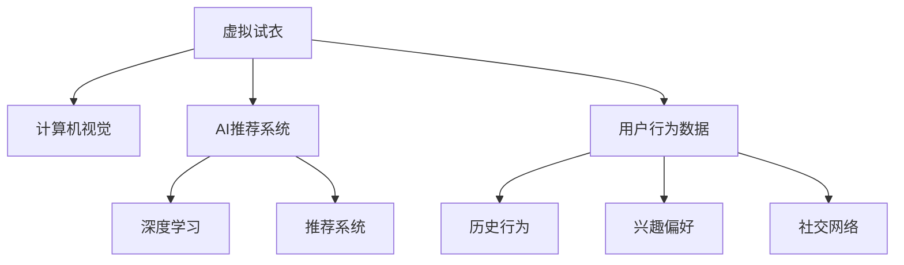

                 

# AI在虚拟服装定制中的应用：个性化时尚

> 关键词：虚拟试衣,人工智能,计算机视觉,深度学习,推荐系统,个性化定制

## 1. 背景介绍

### 1.1 问题由来
随着科技的进步和消费者需求的提升，服装行业正经历着深刻变革。传统的服装制造和零售模式已难以满足个性化、时尚化的消费需求。虚拟服装定制技术应运而生，通过虚拟试衣、AI推荐系统等手段，为消费者提供无缝、即时的个性化购物体验。

### 1.2 问题核心关键点
虚拟服装定制的核心在于实现对消费者个性化需求的精准把握和高效匹配。AI技术在此过程中起到了关键作用，从计算机视觉、深度学习到推荐系统，均是支持虚拟服装定制的重要技术支撑。

### 1.3 问题研究意义
本文聚焦于虚拟服装定制中的AI应用，特别是虚拟试衣和个性化推荐系统的实现原理与技术细节，以期为该领域的深入研究和工程实践提供指导。

## 2. 核心概念与联系

### 2.1 核心概念概述

为更好地理解虚拟服装定制中的AI应用，本节将介绍几个密切相关的核心概念：

- **虚拟试衣**：指利用计算机视觉技术和AI模型，通过摄像头、照片或三维扫描等方式获取用户的身材数据和尺寸信息，模拟用户试穿服装的体验，为用户提供最匹配的服装款式和尺码建议。
- **AI推荐系统**：指通过分析用户的历史行为数据、兴趣偏好、社交网络等信息，推荐最符合用户需求的服装商品，提高购物体验和满意度。
- **计算机视觉**：指利用摄像头、图像传感器等设备，捕捉和分析现实世界的视觉信息，实现图像识别、对象检测、姿态估计等视觉处理任务。
- **深度学习**：指基于多层神经网络的学习范式，通过大量标注数据进行模型训练，实现高精度的视觉和推荐任务。
- **推荐系统**：指通过分析和建模用户行为数据，为用户推荐个性化商品的系统，旨在提高用户满意度、增加用户粘性。

这些核心概念之间的逻辑关系可以通过以下Mermaid流程图来展示：



这个流程图展示了几类AI技术在虚拟服装定制中的作用：

1. 虚拟试衣利用计算机视觉技术获取用户数据。
2. AI推荐系统结合深度学习对用户进行个性化推荐。
3. 推荐系统利用用户行为数据进行分析和建模。

这些核心概念共同构成了虚拟服装定制的技术框架，为实现个性化时尚提供了坚实的基础。

## 3. 核心算法原理 & 具体操作步骤
### 3.1 算法原理概述

虚拟服装定制中的AI应用主要围绕两个方面：虚拟试衣和个性化推荐。其中，虚拟试衣需要利用计算机视觉技术和深度学习模型对用户三维体型进行建模，并生成虚拟试衣效果；个性化推荐则依赖深度学习模型对用户历史行为进行建模，从而推荐符合其兴趣的商品。

### 3.2 算法步骤详解

#### 3.2.1 虚拟试衣

虚拟试衣的算法步骤主要包括以下几个环节：

1. **用户数据采集**：通过摄像头、手机相机、三维扫描等方式，采集用户全身或局部图像。
2. **图像预处理**：对采集到的图像进行去噪、裁剪、归一化等处理，以提高后续处理的效果。
3. **体型分析**：利用计算机视觉技术（如边缘检测、轮廓提取等）获取用户的身高、体重、胸围、腰围等关键身体特征。
4. **三维重建**：通过深度学习模型（如3D GAN）生成用户的三维虚拟人体模型。
5. **试衣模拟**：将服装的三维模型与虚拟人体模型进行组合，模拟用户试穿效果，并生成多视角展示。
6. **推荐优化**：根据虚拟试衣结果，向用户推荐最匹配的服装款式和尺码。

#### 3.2.2 个性化推荐

个性化推荐的算法步骤主要包括以下几个环节：

1. **数据收集**：收集用户的历史购买记录、浏览行为、评价反馈等数据。
2. **特征提取**：对用户数据进行预处理和特征提取，如用户兴趣向量、商品标签向量等。
3. **模型训练**：使用深度学习模型（如协同过滤、序列推荐模型、神经网络等）对用户行为数据进行建模。
4. **推荐生成**：根据用户历史行为和实时兴趣，生成个性化推荐列表。
5. **推荐优化**：通过A/B测试、点击率预估等手段，优化推荐算法的效果。

### 3.3 算法优缺点

虚拟服装定制中的AI应用具有以下优点：

1. **提升用户体验**：通过虚拟试衣和个性化推荐，用户可以在家中获得与实体店相似的购物体验，大大提升购物效率和满意度。
2. **降低试错成本**：用户可以通过虚拟试衣提前筛选不合适款式的服装，减少实际试穿次数和退货率。
3. **提高个性化匹配度**：利用深度学习模型对用户行为数据进行建模，可以更准确地推荐符合其兴趣的商品。

同时，这些应用也存在以下局限性：

1. **数据隐私问题**：用户数据采集和存储涉及隐私保护，需要严格遵守相关法律法规。
2. **技术门槛较高**：涉及计算机视觉、深度学习、推荐系统等前沿技术，对技术团队的技术能力有较高要求。
3. **计算资源消耗大**：虚拟试衣和深度学习模型对计算资源需求较高，需要高性能的硬件设备和优化算法。
4. **推荐效果受限**：模型训练和推荐效果受到用户数据质量和多样性的影响，需要进行大量数据预处理和模型优化。

### 3.4 算法应用领域

虚拟服装定制中的AI应用不仅限于虚拟试衣和个性化推荐，还扩展到商品搜索、智能客服等多个环节，涵盖了服装电商的各个方面：

- **商品搜索**：利用自然语言处理和计算机视觉技术，实现高效的服装搜索和过滤。
- **智能客服**：通过AI模型实现自动回复和问题理解，提高客户服务效率和满意度。
- **库存管理**：通过数据分析和预测模型，优化库存管理和供应链调度。

这些AI应用极大地提升了服装电商的运营效率和用户体验，成为行业发展的重要驱动力。

## 4. 数学模型和公式 & 详细讲解  
### 4.1 数学模型构建

本节将使用数学语言对虚拟服装定制中的AI应用进行更加严格的刻画。

记用户三维体型为 $\mathbf{x} \in \mathbb{R}^n$，服装三维模型为 $\mathbf{y} \in \mathbb{R}^m$。虚拟试衣的目标是通过深度学习模型 $f(\mathbf{x}, \mathbf{y})$，生成虚拟试衣效果 $\mathbf{z} \in \mathbb{R}^k$。

对于个性化推荐，设用户历史行为数据为 $\mathbf{u} \in \mathbb{R}^{d}$，商品标签数据为 $\mathbf{v} \in \mathbb{R}^{e}$。推荐系统的目标是通过深度学习模型 $g(\mathbf{u}, \mathbf{v})$，生成推荐结果 $\mathbf{r} \in \mathbb{R}^{f}$。

### 4.2 公式推导过程

对于虚拟试衣，我们假设深度学习模型 $f$ 为编码器-解码器结构，其中 $\mathbf{z}$ 为虚拟试衣结果的表示向量。模型的输入为 $\mathbf{x}$ 和 $\mathbf{y}$，输出为 $\mathbf{z}$。模型的损失函数为均方误差：

$$
L_f(\theta) = \frac{1}{N} \sum_{i=1}^N (\mathbf{z}_i - \hat{\mathbf{z}}_i)^2
$$

其中 $\hat{\mathbf{z}}_i$ 为模型预测的虚拟试衣结果。

对于个性化推荐，我们假设推荐系统 $g$ 使用协同过滤模型，其中 $\mathbf{r}$ 为推荐结果的评分向量。模型的输入为 $\mathbf{u}$ 和 $\mathbf{v}$，输出为 $\mathbf{r}$。模型的损失函数为均方误差：

$$
L_g(\theta) = \frac{1}{N} \sum_{i=1}^N (\mathbf{r}_i - \hat{\mathbf{r}}_i)^2
$$

其中 $\hat{\mathbf{r}}_i$ 为模型预测的推荐评分。

### 4.3 案例分析与讲解

**案例分析：虚拟试衣**

假设我们收集了1000名用户的全身图像数据，并使用计算机视觉技术提取了他们的身高、体重、胸围、腰围等身体特征。使用3D GAN模型生成用户的三维虚拟人体模型。接着，将用户选择的两款服装的三维模型与其虚拟人体模型进行组合，生成虚拟试衣效果。最后，根据虚拟试衣效果向用户推荐最匹配的尺码。

**案例分析：个性化推荐**

假设我们收集了1000名用户在电商平台上的历史购买记录和浏览行为数据，提取了他们的兴趣标签和商品标签。使用深度学习模型（如协同过滤、序列推荐模型等）对这些数据进行建模，生成推荐结果。通过A/B测试，优化推荐算法的效果，并将推荐结果展示给用户。

## 5. 项目实践：代码实例和详细解释说明
### 5.1 开发环境搭建

在进行虚拟服装定制的AI应用开发前，我们需要准备好开发环境。以下是使用Python进行PyTorch开发的环境配置流程：

1. 安装Anaconda：从官网下载并安装Anaconda，用于创建独立的Python环境。

2. 创建并激活虚拟环境：
```bash
conda create -n vfx-env python=3.8 
conda activate vfx-env
```

3. 安装PyTorch：根据CUDA版本，从官网获取对应的安装命令。例如：
```bash
conda install pytorch torchvision torchaudio cudatoolkit=11.1 -c pytorch -c conda-forge
```

4. 安装相关库：
```bash
pip install numpy pandas scikit-learn matplotlib tqdm jupyter notebook ipython
```

5. 安装ModelScope：用于加载和使用预训练模型，支持模型微调等操作。

完成上述步骤后，即可在`vfx-env`环境中开始AI应用开发。

### 5.2 源代码详细实现

下面以虚拟试衣和个性化推荐系统为例，给出使用PyTorch进行虚拟服装定制的PyTorch代码实现。

**虚拟试衣**

首先，定义虚拟试衣的模型类：

```python
import torch
from torch import nn
from torchvision.models import resnet50

class VirtualTryonModel(nn.Module):
    def __init__(self):
        super(VirtualTryonModel, self).__init__()
        self.encoder = resnet50(pretrained=True)
        self.decoder = nn.Sequential(
            nn.Linear(2048, 512),
            nn.ReLU(),
            nn.Linear(512, 1024),
            nn.ReLU(),
            nn.Linear(1024, 3)
        )
        
    def forward(self, x, y):
        x = self.encoder(x)
        x = self.decoder(x)
        return x
```

然后，定义损失函数和优化器：

```python
from torch import optim

def virtual_tryon_loss(model, x, y):
    return nn.MSELoss()(model(x, y), y)

optimizer = optim.Adam(model.parameters(), lr=1e-3)
```

接着，训练虚拟试衣模型：

```python
import torch
from torch.utils.data import DataLoader

# 数据集准备
train_dataset = ...
test_dataset = ...

# 模型训练
model.train()
for epoch in range(10):
    for x, y in train_loader:
        optimizer.zero_grad()
        loss = virtual_tryon_loss(model, x, y)
        loss.backward()
        optimizer.step()
```

**个性化推荐**

接下来，定义个性化推荐模型：

```python
class RecommendationModel(nn.Module):
    def __init__(self):
        super(RecommendationModel, self).__init__()
        self.encoder = nn.Sequential(
            nn.Linear(100, 512),
            nn.ReLU(),
            nn.Linear(512, 256),
            nn.ReLU()
        )
        self.decoder = nn.Sequential(
            nn.Linear(256, 128),
            nn.ReLU(),
            nn.Linear(128, 1)
        )
        
    def forward(self, u, v):
        u = self.encoder(u)
        v = self.decoder(v)
        return u @ v.T
```

然后，定义损失函数和优化器：

```python
def recommendation_loss(model, u, v, r):
    return nn.MSELoss()(model(u, v), r)

optimizer = optim.Adam(model.parameters(), lr=1e-3)
```

最后，训练个性化推荐模型：

```python
# 数据集准备
train_dataset = ...
test_dataset = ...

# 模型训练
model.train()
for epoch in range(10):
    for u, v, r in train_loader:
        optimizer.zero_grad()
        loss = recommendation_loss(model, u, v, r)
        loss.backward()
        optimizer.step()
```

### 5.3 代码解读与分析

让我们再详细解读一下关键代码的实现细节：

**虚拟试衣模型类**

- `__init__`方法：初始化编码器和解码器。
- `forward`方法：前向传播，将输入的图像数据和服装模型数据通过编码器和解码器，输出虚拟试衣结果。

**个性化推荐模型类**

- `__init__`方法：初始化编码器和解码器。
- `forward`方法：前向传播，将用户和商品的数据通过编码器和解码器，输出推荐结果。

**虚拟试衣训练**

- `virtual_tryon_loss`方法：计算虚拟试衣模型的损失函数。
- `optimizer.zero_grad()`：清除梯度。
- `loss.backward()`：反向传播计算梯度。
- `optimizer.step()`：更新模型参数。

**个性化推荐训练**

- `recommendation_loss`方法：计算个性化推荐模型的损失函数。
- `optimizer.zero_grad()`：清除梯度。
- `loss.backward()`：反向传播计算梯度。
- `optimizer.step()`：更新模型参数。

## 6. 实际应用场景
### 6.1 智能服装定制

虚拟服装定制技术可以广泛应用于智能服装定制中，帮助消费者在购买前体验不同款式的服装效果，从而减少试穿次数和退货率。具体而言，用户可以通过虚拟试衣功能，在不同尺寸、颜色、款式之间快速切换，进行试穿对比，最终选择最适合自己的服装。

### 6.2 个性化推荐

个性化推荐系统可以根据用户的浏览历史、评价反馈等信息，实时推荐符合其兴趣的服装商品。例如，用户浏览了某款连衣裙后，系统可以推荐相似款式的其他连衣裙，或者推荐该款连衣裙的配饰。个性化推荐还能结合当前流行趋势，向用户推荐最新的时尚单品，提升购物体验和满意度。

### 6.3 智能客服

智能客服系统可以结合虚拟试衣和个性化推荐，为用户提供更加精准的购物建议和问题解答。例如，用户询问某款服装的尺码问题时，智能客服可以调用虚拟试衣功能，推荐最匹配的尺码，同时根据用户的历史行为数据，推荐其他相关商品，提升客户满意度。

### 6.4 未来应用展望

随着AI技术的不断发展，虚拟服装定制将在更多领域得到应用，为服装行业带来变革性影响：

- **跨界融合**：虚拟服装定制技术将与其他AI技术融合，如虚拟现实(VR)、增强现实(AR)等，提供更加沉浸式、交互式的购物体验。
- **个性化体验**：通过深度学习模型对用户行为数据进行深入分析，实现更加精准的个性化推荐，提升用户满意度和忠诚度。
- **智能设计**：利用AI技术进行服装设计和款式预测，帮助设计师快速生成创意，提升设计效率和创新能力。
- **供应链优化**：通过数据分析和预测模型，优化库存管理和供应链调度，减少资源浪费，提高运营效率。

未来，虚拟服装定制技术将成为服装行业的重要组成部分，为消费者带来更加个性化、高效、便捷的购物体验，同时为商家带来更多的市场机会和竞争优势。

## 7. 工具和资源推荐
### 7.1 学习资源推荐

为了帮助开发者系统掌握虚拟服装定制中的AI应用，这里推荐一些优质的学习资源：

1. **《深度学习》课程**：斯坦福大学Andrew Ng教授的在线课程，介绍了深度学习的基本概念和核心算法。
2. **《计算机视觉：现代方法》书籍**：Russell H. Smith等作者，系统介绍了计算机视觉的各个方面，包括图像处理、特征提取、物体检测等。
3. **《自然语言处理》课程**：Coursera上的自然语言处理课程，介绍了自然语言处理的基本理论和应用技术。
4. **ModelScope官方文档**：提供了大量预训练模型的API接口和微调样例，方便开发者快速上手。
5. **GitHub开源项目**：提供了虚拟试衣和个性化推荐系统的代码实现和文档，可供参考学习。

通过这些资源的学习实践，相信你一定能够快速掌握虚拟服装定制中的AI技术，并用于解决实际的商业问题。

### 7.2 开发工具推荐

高效的开发离不开优秀的工具支持。以下是几款用于虚拟服装定制的AI应用开发的常用工具：

1. **PyTorch**：基于Python的开源深度学习框架，灵活的动态图，适合快速迭代研究。
2. **TensorFlow**：由Google主导开发的开源深度学习框架，生产部署方便，适合大规模工程应用。
3. **ModelScope**：阿里云提供的多模态预训练模型库，支持虚拟试衣和个性化推荐等应用。
4. **Weights & Biases**：模型训练的实验跟踪工具，可以记录和可视化模型训练过程中的各项指标，方便对比和调优。
5. **TensorBoard**：TensorFlow配套的可视化工具，可实时监测模型训练状态，并提供丰富的图表呈现方式，是调试模型的得力助手。

合理利用这些工具，可以显著提升虚拟服装定制的开发效率，加快创新迭代的步伐。

### 7.3 相关论文推荐

虚拟服装定制中的AI应用涉及多个领域的前沿研究，以下是几篇奠基性的相关论文，推荐阅读：

1. **《虚拟试衣中的计算机视觉技术》**：该论文介绍了虚拟试衣中的计算机视觉技术，包括人体检测、姿态估计、三维重建等。
2. **《个性化推荐系统中的深度学习模型》**：该论文介绍了个性化推荐系统中的深度学习模型，包括协同过滤、序列推荐模型等。
3. **《跨模态深度学习在虚拟试衣中的应用》**：该论文介绍了跨模态深度学习在虚拟试衣中的应用，包括虚拟试衣与虚拟现实、增强现实的结合。

这些论文代表了大语言模型微调技术的发展脉络。通过学习这些前沿成果，可以帮助研究者把握学科前进方向，激发更多的创新灵感。

## 8. 总结：未来发展趋势与挑战
### 8.1 总结

本文对虚拟服装定制中的AI应用进行了全面系统的介绍。首先阐述了虚拟试衣和个性化推荐系统在虚拟服装定制中的重要性，明确了AI技术在提升用户体验、降低试错成本、提高个性化匹配度等方面的独特价值。其次，从原理到实践，详细讲解了虚拟试衣和个性化推荐系统的数学模型和算法步骤，给出了完整的代码实例。同时，本文还广泛探讨了虚拟服装定制技术在智能服装定制、个性化推荐、智能客服等多个行业领域的应用前景，展示了AI技术的巨大潜力。此外，本文精选了虚拟服装定制技术的学习资源、开发工具和相关论文，力求为读者提供全方位的技术指引。

通过本文的系统梳理，可以看到，虚拟服装定制技术通过AI技术的应用，实现了个性化、高效、便捷的购物体验，成为服装行业的重要发展方向。未来，伴随AI技术的进一步发展，虚拟服装定制技术将更加智能化、普适化，为服装行业带来更加深刻的变革。

### 8.2 未来发展趋势

展望未来，虚拟服装定制技术将呈现以下几个发展趋势：

1. **跨界融合**：虚拟服装定制技术将与其他AI技术深度融合，如虚拟现实(VR)、增强现实(AR)等，提供更加沉浸式、交互式的购物体验。
2. **个性化体验**：通过深度学习模型对用户行为数据进行深入分析，实现更加精准的个性化推荐，提升用户满意度和忠诚度。
3. **智能设计**：利用AI技术进行服装设计和款式预测，帮助设计师快速生成创意，提升设计效率和创新能力。
4. **供应链优化**：通过数据分析和预测模型，优化库存管理和供应链调度，减少资源浪费，提高运营效率。

以上趋势凸显了虚拟服装定制技术的广阔前景。这些方向的探索发展，必将进一步提升用户购物体验，同时为商家带来更多的市场机会和竞争优势。

### 8.3 面临的挑战

尽管虚拟服装定制技术已经取得了瞩目成就，但在迈向更加智能化、普适化应用的过程中，它仍面临着诸多挑战：

1. **数据隐私问题**：用户数据采集和存储涉及隐私保护，需要严格遵守相关法律法规。
2. **技术门槛较高**：涉及计算机视觉、深度学习、推荐系统等前沿技术，对技术团队的技术能力有较高要求。
3. **计算资源消耗大**：虚拟试衣和深度学习模型对计算资源需求较高，需要高性能的硬件设备和优化算法。
4. **推荐效果受限**：模型训练和推荐效果受到用户数据质量和多样性的影响，需要进行大量数据预处理和模型优化。

正视虚拟服装定制面临的这些挑战，积极应对并寻求突破，将是技术不断进步的重要保障。相信随着学界和产业界的共同努力，这些挑战终将一一被克服，虚拟服装定制技术必将在构建人机协同的智能时代中扮演越来越重要的角色。

### 8.4 未来突破

面对虚拟服装定制面临的种种挑战，未来的研究需要在以下几个方面寻求新的突破：

1. **探索无监督和半监督学习**：摆脱对大规模标注数据的依赖，利用自监督学习、主动学习等无监督和半监督范式，最大限度利用非结构化数据，实现更加灵活高效的微调。
2. **研究参数高效和计算高效的微调范式**：开发更加参数高效的微调方法，在固定大部分预训练参数的同时，只更新极少量的任务相关参数。同时优化微调模型的计算图，减少前向传播和反向传播的资源消耗，实现更加轻量级、实时性的部署。
3. **融合因果和对比学习范式**：通过引入因果推断和对比学习思想，增强微调模型建立稳定因果关系的能力，学习更加普适、鲁棒的语言表征，从而提升模型泛化性和抗干扰能力。
4. **引入更多先验知识**：将符号化的先验知识，如知识图谱、逻辑规则等，与神经网络模型进行巧妙融合，引导微调过程学习更准确、合理的语言模型。同时加强不同模态数据的整合，实现视觉、语音等多模态信息与文本信息的协同建模。
5. **结合因果分析和博弈论工具**：将因果分析方法引入微调模型，识别出模型决策的关键特征，增强输出解释的因果性和逻辑性。借助博弈论工具刻画人机交互过程，主动探索并规避模型的脆弱点，提高系统稳定性。
6. **纳入伦理道德约束**：在模型训练目标中引入伦理导向的评估指标，过滤和惩罚有偏见、有害的输出倾向。同时加强人工干预和审核，建立模型行为的监管机制，确保输出符合人类价值观和伦理道德。

这些研究方向的探索，必将引领虚拟服装定制技术迈向更高的台阶，为构建安全、可靠、可解释、可控的智能系统铺平道路。面向未来，虚拟服装定制技术还需要与其他AI技术进行更深入的融合，如知识表示、因果推理、强化学习等，多路径协同发力，共同推动自然语言理解和智能交互系统的进步。只有勇于创新、敢于突破，才能不断拓展语言模型的边界，让智能技术更好地造福人类社会。

## 9. 附录：常见问题与解答

**Q1：虚拟试衣和个性化推荐的主要区别是什么？**

A: 虚拟试衣通过计算机视觉和深度学习技术，生成虚拟试衣效果，帮助用户选择最匹配的服装款式和尺码。而个性化推荐则通过分析用户行为数据，生成符合用户兴趣的推荐列表，提升购物体验和满意度。

**Q2：虚拟试衣和个性化推荐需要哪些数据？**

A: 虚拟试衣需要用户的三维身体数据和服装的三维模型数据。个性化推荐需要用户的历史行为数据和商品标签数据。

**Q3：虚拟试衣和个性化推荐的实现难点是什么？**

A: 虚拟试衣的难点在于计算机视觉技术的复杂性和深度学习模型的训练优化。个性化推荐的难点在于用户行为数据的收集和特征提取，以及推荐模型的训练和优化。

**Q4：虚拟试衣和个性化推荐在实际应用中有哪些优势？**

A: 虚拟试衣的优势在于能够提供即时、便捷的试衣体验，减少试穿次数和退货率。个性化推荐的优势在于能够根据用户兴趣提供精准的推荐，提升购物体验和满意度。

**Q5：虚拟试衣和个性化推荐需要哪些计算资源？**

A: 虚拟试衣和个性化推荐对计算资源的需求较高，特别是深度学习模型和推荐系统，需要高性能的硬件设备和优化算法。

这些问题的回答，展示了虚拟试衣和个性化推荐在虚拟服装定制中的重要性，以及它们在实际应用中的优势和难点。相信通过本文的学习，读者可以对这些技术有更深入的理解，并将其应用到实际工程中。

---

作者：禅与计算机程序设计艺术 / Zen and the Art of Computer Programming

