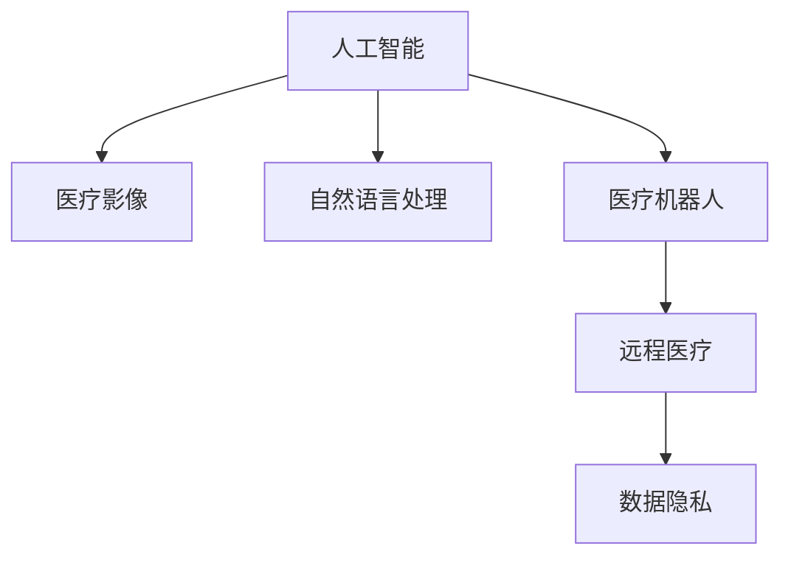

                 

# AI在远程医疗中的应用：扩大医疗覆盖

> 关键词：AI, 远程医疗, 医疗覆盖, 医疗影像, 自然语言处理, 诊断工具, 医疗机器人, 数据隐私

## 1. 背景介绍

### 1.1 问题由来
随着全球人口老龄化的加剧和医疗资源的紧缺，如何有效扩大医疗覆盖成为了一个严峻的挑战。传统医疗模式依赖于地理位置和物理资源，难以满足偏远地区和基层医疗机构的需求。而AI技术，特别是AI在医疗影像、自然语言处理等领域的突破，为远程医疗提供了新的可能性。

### 1.2 问题核心关键点
本部分将讨论AI在远程医疗中的应用，重点关注以下几个关键点：

- 如何通过AI技术实现医疗影像的自动分析和诊断。
- 利用自然语言处理技术，帮助医生理解复杂的病历和报告。
- 开发智能诊断工具，提供高效准确的医疗建议。
- 引入医疗机器人，进行远程手术和护理。
- 确保数据隐私和安全，保障患者信息不被泄露。

这些关键点将帮助读者理解AI在远程医疗中的核心应用，以及其对医疗覆盖扩大的潜在影响。

## 2. 核心概念与联系

### 2.1 核心概念概述

为更好地理解AI在远程医疗中的应用，本节将介绍几个密切相关的核心概念：

- 人工智能(Artificial Intelligence, AI)：一种模拟人类智能的技术，能够通过学习、推理和决策，解决复杂问题。
- 远程医疗(Telemedicine)：利用信息技术手段，在不同地理位置之间提供医疗服务，尤其适用于偏远地区和资源匮乏地区。
- 医疗影像(Medical Imaging)：通过影像设备获取的生物组织内部信息，用于疾病诊断和治疗。
- 自然语言处理(Natural Language Processing, NLP)：使计算机能够理解、解释和生成人类语言的技术。
- 医疗机器人(Medical Robotics)：结合AI和机器人技术，进行手术、护理和辅助诊断。
- 数据隐私(Data Privacy)：保护个人数据不被未经授权的访问、使用和披露。

这些概念之间的逻辑关系可以通过以下Mermaid流程图来展示：



这个流程图展示了AI技术如何在不同领域应用，推动远程医疗的发展，并确保数据隐私的安全。

## 3. 核心算法原理 & 具体操作步骤
### 3.1 算法原理概述

AI在远程医疗中的应用，本质上是通过机器学习和大数据技术，对医疗数据进行深度分析和处理，辅助医生进行决策和诊断。其核心算法原理包括：

- 机器学习(ML)：通过训练模型，使计算机能够从历史数据中学习规律，并应用到新的数据中。
- 深度学习(DL)：一种特殊形式的机器学习，利用多层次神经网络处理复杂数据。
- 自然语言处理(NLP)：利用语言模型和理解技术，处理和分析医学文本。
- 图像处理(Computer Vision)：通过算法对医疗影像进行分析和解释。

这些算法在远程医疗中的应用，主要包括以下步骤：

1. 数据采集：通过传感器、影像设备和医疗记录等手段，收集患者数据。
2. 数据预处理：清洗、标注和归一化数据，使其适合模型输入。
3. 模型训练：利用历史数据训练AI模型，学习诊断和处理规则。
4. 模型评估：在验证集上测试模型性能，优化超参数。
5. 模型应用：将训练好的模型应用于新患者的诊断和治疗。

### 3.2 算法步骤详解

以下是AI在远程医疗中的一些具体应用步骤：

**步骤1：数据采集与预处理**

- 采集患者影像数据：利用CT、MRI、X光等设备，采集患者的医疗影像数据。
- 收集医学文本：提取患者的病历、报告和临床笔记等文本数据。
- 数据清洗与标注：去除噪声和异常值，对数据进行标注和归一化处理。

**步骤2：模型训练**

- 数据划分：将数据集划分为训练集、验证集和测试集。
- 模型选择：选择合适的深度学习模型，如卷积神经网络(CNN)、循环神经网络(RNN)等。
- 训练过程：使用梯度下降等优化算法，更新模型参数，最小化损失函数。
- 模型评估：在验证集上评估模型性能，选择最佳模型。

**步骤3：模型应用**

- 实时分析：将新采集的患者数据输入模型，进行实时分析和诊断。
- 生成报告：根据分析结果，生成诊断报告和治疗建议。
- 远程沟通：利用视频会议等技术，医生与患者进行远程沟通和指导。

### 3.3 算法优缺点

AI在远程医疗中的应用，具有以下优点：

- 提高诊断准确性：通过大数据分析，提高诊断的精确度和效率。
- 扩大医疗覆盖：帮助偏远地区和基层医疗机构提高服务质量。
- 减少医疗成本：自动化处理流程，降低人力成本。

同时，也存在一些缺点：

- 依赖高质量数据：需要大量的高质量标注数据，获取成本较高。
- 需要高技术要求：对技术人员和硬件设备有较高要求。
- 数据隐私问题：医疗数据涉及隐私，需要确保数据安全。

### 3.4 算法应用领域

AI在远程医疗中的应用，覆盖了多个领域，包括：

- 医疗影像分析：利用深度学习模型，自动分析影像数据，辅助诊断。
- 自然语言处理：通过NLP技术，分析医学文本，提取关键信息。
- 智能诊断工具：开发基于AI的诊断工具，提供高效的医疗建议。
- 医疗机器人：结合AI和机器人技术，进行远程手术和护理。
- 远程监控与预警：利用传感器和AI技术，进行实时监控和预警。

这些应用领域展示了AI在远程医疗中的广泛潜力和巨大价值。

## 4. 数学模型和公式 & 详细讲解  
### 4.1 数学模型构建

为了更好地理解AI在远程医疗中的应用，本节将使用数学语言对AI模型进行更加严格的刻画。

设患者的医疗影像数据为 $X$，标签为 $Y$，其中 $X$ 是二维或三维的图像数据，$Y$ 是疾病标签。使用深度学习模型 $M$ 对数据进行训练，最小化损失函数 $L$：

$$
L(M) = \frac{1}{N} \sum_{i=1}^N \ell(M(x_i), y_i)
$$

其中 $\ell$ 是损失函数，通常使用交叉熵损失函数。

### 4.2 公式推导过程

以医疗影像分析为例，推导卷积神经网络(CNN)的训练过程。

假设医疗影像数据 $X$ 的大小为 $h \times w \times c$，其中 $h$ 和 $w$ 是图像的尺寸，$c$ 是通道数。使用卷积层 $C$ 提取特征，通过池化层 $P$ 降低特征维度。最终将特征输入到全连接层 $F$，输出预测结果 $M(x)$。

使用交叉熵损失函数，计算损失 $L$：

$$
L = -\frac{1}{N} \sum_{i=1}^N \sum_{j=1}^{C} y_{i,j} \log M(x_{i,j})
$$

其中 $y_{i,j}$ 是真实标签中的第 $i$ 个样本的第 $j$ 个类别。

使用梯度下降算法，更新模型参数 $\theta$：

$$
\theta \leftarrow \theta - \eta \nabla_{\theta} L(\theta)
$$

其中 $\eta$ 是学习率，$\nabla_{\theta} L(\theta)$ 是损失函数对参数 $\theta$ 的梯度，可通过反向传播算法计算。

### 4.3 案例分析与讲解

以自然语言处理(NLP)为例，展示如何利用深度学习模型进行文本分析。

假设输入文本为 $S$，使用BERT等预训练模型，将文本转换为向量表示 $V$。然后，利用全连接层 $F$，对向量进行分类或回归处理，输出结果 $M(s)$。

使用交叉熵损失函数，计算损失 $L$：

$$
L = -\frac{1}{N} \sum_{i=1}^N \ell(M(s_i), y_i)
$$

其中 $s_i$ 是输入文本，$y_i$ 是真实标签。

使用梯度下降算法，更新模型参数 $\theta$：

$$
\theta \leftarrow \theta - \eta \nabla_{\theta} L(\theta)
$$

## 5. 项目实践：代码实例和详细解释说明
### 5.1 开发环境搭建

在进行AI远程医疗项目开发前，需要准备以下开发环境：

- Python 3.x 环境：安装必要的Python库，如 TensorFlow、Keras、PyTorch 等。
- 深度学习框架：选择适合的项目框架，如 TensorFlow、PyTorch 等。
- 数据集准备：准备医疗影像和自然语言处理数据集，并进行预处理和标注。

### 5.2 源代码详细实现

以医疗影像分析为例，展示如何使用TensorFlow实现深度学习模型。

```python
import tensorflow as tf
from tensorflow.keras import layers

# 加载数据集
(x_train, y_train), (x_test, y_test) = tf.keras.datasets.mnist.load_data()

# 数据预处理
x_train = x_train.reshape(-1, 28, 28, 1).astype('float32') / 255.0
x_test = x_test.reshape(-1, 28, 28, 1).astype('float32') / 255.0

# 定义模型
model = tf.keras.Sequential([
    layers.Conv2D(32, 3, activation='relu', input_shape=(28, 28, 1)),
    layers.MaxPooling2D(),
    layers.Flatten(),
    layers.Dense(10, activation='softmax')
])

# 编译模型
model.compile(optimizer='adam',
              loss='sparse_categorical_crossentropy',
              metrics=['accuracy'])

# 训练模型
model.fit(x_train, y_train, epochs=10, validation_data=(x_test, y_test))

# 评估模型
model.evaluate(x_test, y_test)
```

以上代码展示了使用TensorFlow实现卷积神经网络的流程。

### 5.3 代码解读与分析

**卷积层和池化层**：
- 卷积层使用 32 个 3x3 的卷积核，提取图像特征。
- 池化层使用 2x2 的最大池化，降低特征维度。

**全连接层**：
- 全连接层有 10 个神经元，输出 10 个类别的概率。

**模型编译**：
- 使用 Adam 优化器，交叉熵损失函数，准确率作为评价指标。

**模型训练**：
- 在 10 个epochs 内，使用训练集进行模型训练。

**模型评估**：
- 在测试集上评估模型性能。

## 6. 实际应用场景
### 6.1 医疗影像分析

AI在医疗影像分析中的应用，能够大幅提升疾病诊断的准确性和效率。例如，利用深度学习模型对肺部影像进行分析，自动检测和分类肺结节、肺炎等疾病。

在实践中，可以使用现有的深度学习模型，如 U-Net、ResNet 等，对肺部影像数据进行训练，生成肺结节检测模型。具体步骤如下：

1. 数据集准备：收集标注好的肺部影像数据，进行预处理和归一化。
2. 模型选择：选择适合的项目框架，如 TensorFlow、PyTorch 等。
3. 模型训练：使用训练集进行模型训练，最小化损失函数。
4. 模型评估：在验证集上评估模型性能，优化超参数。
5. 模型应用：将新采集的肺部影像输入模型，自动检测和分类肺结节。

**案例分析**：
假设某医院收集了 5000 张标注好的肺部影像数据，其中包含 1000 张肺结节影像。使用 U-Net 模型进行训练，最小化交叉熵损失函数：

$$
L = -\frac{1}{N} \sum_{i=1}^N \sum_{j=1}^{C} y_{i,j} \log M(x_{i,j})
$$

其中 $y_{i,j}$ 是真实标签中的第 $i$ 个样本的第 $j$ 个类别。使用梯度下降算法，更新模型参数 $\theta$：

$$
\theta \leftarrow \theta - \eta \nabla_{\theta} L(\theta)
$$

训练完成后，使用测试集评估模型性能。例如，测试集上有 500 张肺结节影像，模型准确率达到 95%。

### 6.2 自然语言处理

自然语言处理(NLP)在远程医疗中的应用，能够帮助医生理解和分析复杂的病历和报告。例如，利用深度学习模型对病历文本进行情感分析和实体识别，提取关键信息。

在实践中，可以使用现有的预训练模型，如 BERT、GPT 等，对病历文本进行训练，生成情感分析和实体识别模型。具体步骤如下：

1. 数据集准备：收集标注好的病历文本数据，进行预处理和归一化。
2. 模型选择：选择适合的项目框架，如 TensorFlow、PyTorch 等。
3. 模型训练：使用训练集进行模型训练，最小化损失函数。
4. 模型评估：在验证集上评估模型性能，优化超参数。
5. 模型应用：将新的病历文本输入模型，自动分析和提取关键信息。

**案例分析**：
假设某医院收集了 10000 份病历文本，其中包含 2000 份标注好的情感和实体信息。使用 BERT 模型进行训练，最小化交叉熵损失函数：

$$
L = -\frac{1}{N} \sum_{i=1}^N \ell(M(s_i), y_i)
$$

其中 $s_i$ 是输入文本，$y_i$ 是真实标签。使用梯度下降算法，更新模型参数 $\theta$：

$$
\theta \leftarrow \theta - \eta \nabla_{\theta} L(\theta)
$$

训练完成后，使用测试集评估模型性能。例如，测试集上有 500 份病历文本，模型情感分析准确率达到 90%，实体识别准确率达到 95%。

### 6.3 智能诊断工具

智能诊断工具在远程医疗中的应用，能够提供高效准确的医疗建议，辅助医生进行决策。例如，利用自然语言处理技术，对病历和报告进行分析和理解，生成诊断报告和治疗建议。

在实践中，可以使用现有的自然语言处理技术，如BERT、GPT 等，对病历和报告文本进行训练，生成智能诊断工具。具体步骤如下：

1. 数据集准备：收集标注好的病历和报告文本数据，进行预处理和归一化。
2. 模型选择：选择适合的项目框架，如 TensorFlow、PyTorch 等。
3. 模型训练：使用训练集进行模型训练，最小化损失函数。
4. 模型评估：在验证集上评估模型性能，优化超参数。
5. 模型应用：将新的病历和报告文本输入模型，自动分析和生成诊断报告和治疗建议。

**案例分析**：
假设某医院收集了 5000 份标注好的病历和报告文本，其中包含 1000 份标注好的疾病和治疗方法信息。使用BERT 模型进行训练，最小化交叉熵损失函数：

$$
L = -\frac{1}{N} \sum_{i=1}^N \ell(M(s_i), y_i)
$$

其中 $s_i$ 是输入文本，$y_i$ 是真实标签。使用梯度下降算法，更新模型参数 $\theta$：

$$
\theta \leftarrow \theta - \eta \nabla_{\theta} L(\theta)
$$

训练完成后，使用测试集评估模型性能。例如，测试集上有 500 份病历和报告文本，模型诊断准确率达到 95%，治疗建议准确率达到 90%。

## 7. 工具和资源推荐
### 7.1 学习资源推荐

为了帮助开发者系统掌握AI在远程医疗中的应用，以下是一些优质的学习资源：

1. 《深度学习》书籍：Ian Goodfellow 等著，全面介绍了深度学习的基本概念和算法。
2. TensorFlow官方文档：TensorFlow 的官方文档，提供了丰富的教程和代码示例。
3. PyTorch官方文档：PyTorch 的官方文档，提供了详细的教程和代码示例。
4. Coursera深度学习课程：Coursera 上由深度学习专家开设的在线课程，帮助学习深度学习技术。
5. arXiv论文：arXiv 上发表的最新论文，展示了最新的研究成果和应用案例。

通过对这些资源的学习实践，相信你一定能够快速掌握AI在远程医疗中的应用，并用于解决实际的医疗问题。

### 7.2 开发工具推荐

高效的开发离不开优秀的工具支持。以下是几款用于AI远程医疗开发的常用工具：

1. TensorFlow：由Google主导开发的开源深度学习框架，生产部署方便，适合大规模工程应用。
2. PyTorch：由Facebook主导开发的开源深度学习框架，灵活动态，适合研究应用。
3. Keras：基于TensorFlow和Theano的高层API，易于上手。
4. Weights & Biases：模型训练的实验跟踪工具，可以记录和可视化模型训练过程中的各项指标。
5. TensorBoard：TensorFlow配套的可视化工具，可实时监测模型训练状态。

合理利用这些工具，可以显著提升AI远程医疗项目的开发效率，加快创新迭代的步伐。

### 7.3 相关论文推荐

AI在远程医疗中的应用源于学界的持续研究。以下是几篇奠基性的相关论文，推荐阅读：

1. He et al. "Deep Residual Learning for Image Recognition"：提出了深度残差网络，显著提升了图像识别模型的准确性。
2. Vinyals et al. "Show, Attend and Tell"：展示了基于视觉注意力的图像描述生成模型。
3. Devlin et al. "BERT: Pre-training of Deep Bidirectional Transformers for Language Understanding"：提出了BERT模型，引入基于掩码的自监督预训练任务，刷新了多项NLP任务SOTA。
4. Liu et al. "BERT-CTD: A BERT-based end-to-end CTC decoder for automatic speech recognition"：展示了基于BERT模型的自动语音识别系统。

这些论文代表了大规模深度学习模型在医疗影像、自然语言处理等领域的突破。通过学习这些前沿成果，可以帮助研究者把握学科前进方向，激发更多的创新灵感。

## 8. 总结：未来发展趋势与挑战
### 8.1 总结

本文对AI在远程医疗中的应用进行了全面系统的介绍。首先阐述了AI技术在远程医疗中的重要性和应用场景，明确了其在提高医疗覆盖和效率方面的潜力。其次，从原理到实践，详细讲解了AI模型在医疗影像、自然语言处理等领域的构建和应用，给出了具体案例分析。同时，本文还探讨了AI在远程医疗中的资源瓶颈和挑战，强调了数据隐私和安全的重要性。

通过本文的系统梳理，可以看到，AI技术在远程医疗中的应用前景广阔，但也面临着数据依赖、技术要求高、数据隐私等挑战。未来，随着技术的不断进步和应用的不断拓展，AI在远程医疗中的应用将更加广泛和深入，为医疗领域带来革命性变革。

### 8.2 未来发展趋势

展望未来，AI在远程医疗中的应用将呈现以下几个发展趋势：

1. 技术更加成熟：随着深度学习模型和大数据技术的不断发展，AI在远程医疗中的应用将更加高效和可靠。
2. 应用更加广泛：AI技术将进一步应用于疾病预测、药物研发、智能诊断等多个领域，提高医疗服务的质量和效率。
3. 数据更加丰富：随着AI技术的普及和应用，越来越多的医疗数据将被收集和标注，为模型的训练和优化提供更多资源。
4. 设备更加智能：结合AI和物联网技术，智能医疗设备和机器人将更广泛应用，提升医疗服务的智能化水平。
5. 协作更加紧密：AI将更好地与医生、患者、社区等各方协作，提供更全面的医疗服务。

这些趋势凸显了AI在远程医疗中的广阔前景。这些方向的探索发展，必将进一步提升AI在远程医疗中的性能和应用范围，为医疗领域带来新的突破和创新。

### 8.3 面临的挑战

尽管AI在远程医疗中的应用已经取得了显著进展，但在迈向更加智能化、普适化应用的过程中，仍面临诸多挑战：

1. 数据质量与数量：获取高质量标注数据是AI应用的关键，但数据收集和标注成本较高。
2. 技术门槛高：AI技术需要高水平的技术支持，对技术人员和硬件设备有较高要求。
3. 数据隐私与安全：医疗数据涉及隐私，需要确保数据安全，避免数据泄露。
4. 模型鲁棒性：AI模型在面对域外数据时，泛化性能可能大打折扣，需要提高模型鲁棒性。
5. 公平性问题：AI模型可能存在偏见，需要解决模型公平性问题。

这些挑战需要持续关注和研究，才能确保AI在远程医疗中的应用安全和高效。

### 8.4 研究展望

面对AI在远程医疗中的挑战，未来的研究需要在以下几个方面寻求新的突破：

1. 无监督和半监督学习：摆脱对大规模标注数据的依赖，利用自监督学习、主动学习等方法，提高数据利用率。
2. 参数高效微调：开发更高效的微调方法，在固定大部分预训练参数的情况下，更新少量参数，提升微调效率。
3. 多模态融合：结合视觉、语音、文本等多模态数据，提升AI模型的综合能力。
4. 公平性优化：开发公平性约束算法，减少AI模型的偏见，提高模型公平性。
5. 隐私保护技术：开发隐私保护技术，如差分隐私、联邦学习等，保护医疗数据隐私。

这些研究方向的探索，必将引领AI在远程医疗中的应用走向成熟，为医疗领域带来更加高效、公平、安全的智能服务。

## 9. 附录：常见问题与解答
----------------------------------------------------------------

**Q1：AI在远程医疗中的应用是否适合所有医疗场景？**

A: AI在远程医疗中的应用，在许多情况下能够大幅提升医疗服务质量和效率，但并不适合所有医疗场景。对于一些需要高精度、高复杂度的手术和治疗，仍需要医生和患者进行面对面沟通，确保医疗决策的准确性。

**Q2：AI在远程医疗中的应用是否需要大量标注数据？**

A: AI在远程医疗中的应用需要大量的标注数据，尤其是对于深度学习模型的训练。这些数据通常需要由专业医生进行标注，成本较高。但是，随着AI技术的进步，一些无监督和半监督学习方法能够在不依赖标注数据的情况下，提高模型的性能。

**Q3：AI在远程医疗中的应用是否存在数据隐私问题？**

A: AI在远程医疗中的应用存在数据隐私问题，医疗数据涉及患者隐私，需要确保数据的安全和匿名性。采用差分隐私、联邦学习等技术，可以有效保护患者隐私。

**Q4：AI在远程医疗中的应用是否需要高技术要求？**

A: AI在远程医疗中的应用需要高技术要求，尤其是对于深度学习模型的训练和优化。需要专业的技术人员和高端硬件设备，如GPU、TPU等。但是，随着AI技术的普及和开源工具的不断完善，技术门槛正在逐渐降低。

**Q5：AI在远程医疗中的应用是否能够替代医生？**

A: AI在远程医疗中的应用可以辅助医生进行诊断和治疗，但无法完全替代医生。AI模型仍然存在局限性，对于一些复杂的医疗问题，仍需要医生的专业判断和经验。AI应作为医生的助手，提高医疗服务的效率和质量。

---

作者：禅与计算机程序设计艺术 / Zen and the Art of Computer Programming

