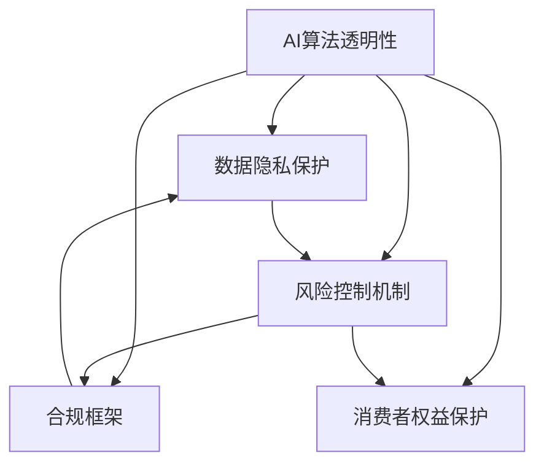

                 

# AI在金融领域的监管应对策略

在金融领域，人工智能（AI）的应用已经逐渐渗透到风险控制、资产管理、客户服务等多个环节。AI技术的引入，不仅提高了金融服务的效率和质量，也带来了新的监管挑战。本文将从背景介绍、核心概念与联系、核心算法原理与具体操作步骤、数学模型与详细讲解、项目实践与代码实现、实际应用场景与未来展望、工具与资源推荐、总结与发展趋势、常见问题与解答等多个角度，探讨AI在金融领域的监管应对策略。

## 1. 背景介绍

### 1.1 问题由来
金融行业的数字化转型正处于关键时期。随着大数据、云计算、区块链等技术的兴起，金融机构纷纷布局AI系统，以应对市场竞争和技术变革的双重挑战。AI技术在金融领域的广泛应用，不仅显著提升了金融服务效率和质量，也带来了监管层面的新问题。

- **金融稳定与市场公平**：AI算法的不透明性可能导致监管难以评估模型决策的合理性，影响市场公平性。
- **数据隐私与安全**：AI系统的数据依赖性强，数据隐私和安全风险不容忽视。
- **风险控制与合规**：AI算法决策的复杂性增加了金融风险的控制难度，同时需要符合合规要求。
- **消费者权益保护**：AI在金融服务中的应用，涉及消费者权益保护，需要监管机构制定相应法规。

### 1.2 问题核心关键点
- **算法透明性**：确保AI算法的决策过程可解释，便于监管审查。
- **数据隐私保护**：规范AI系统的数据使用，保护消费者隐私。
- **风险控制机制**：建立合理的风险控制框架，应对AI系统的复杂性。
- **合规框架**：制定AI系统合规要求，确保其符合法律法规。
- **消费者权益保护**：确保AI在金融服务中的应用，不会侵犯消费者权益。

## 2. 核心概念与联系

### 2.1 核心概念概述

为更好地理解AI在金融领域的监管应对策略，本节将介绍几个密切相关的核心概念：

- **AI算法透明性**：指算法的决策过程能够被清楚地解释，便于监管机构和消费者理解。
- **数据隐私保护**：确保在AI系统中，个人数据的使用受到严格的保护，避免数据泄露和滥用。
- **风险控制机制**：建立一套完整的风险评估和监控体系，识别和应对AI系统带来的潜在风险。
- **合规框架**：包括但不限于隐私保护、公平性、透明度等监管要求，确保AI系统符合法律法规。
- **消费者权益保护**：保护消费者在金融服务中使用AI技术的权利，避免滥用。

这些核心概念之间的逻辑关系可以通过以下Mermaid流程图来展示：



这个流程图展示了一些核心概念及其之间的关系：

1. AI算法的透明性是数据隐私保护的前提，也是合规框架和消费者权益保护的基础。
2. 风险控制机制需要在合规框架下建立，确保AI系统不会对市场稳定性和消费者权益构成威胁。
3. 合规框架不仅包括隐私保护，还涉及AI算法的公平性和透明性要求。
4. 消费者权益保护则是对AI应用的最高要求，确保金融服务的公平性和安全性。

## 3. 核心算法原理 & 具体操作步骤

### 3.1 算法原理概述

AI在金融领域的监管应对策略，主要基于以下核心算法原理：

1. **可解释AI（XAI）**：通过特征归因、模型可视化等方法，提高AI算法的透明性，便于监管和消费者理解。
2. **隐私保护技术**：如差分隐私、联邦学习等，确保数据在使用过程中的隐私保护。
3. **风险评估与监控**：建立AI系统的风险评估模型和监控机制，及时识别并应对潜在风险。
4. **合规框架制定**：制定AI系统的合规要求，确保其符合法律法规，保护消费者权益。

### 3.2 算法步骤详解

#### 3.2.1 可解释AI（XAI）

**步骤1：选择合适的可解释AI方法**  
- 根据AI系统复杂度，选择适合的解释方法，如LIME、SHAP等。

**步骤2：数据预处理**  
- 对输入数据进行归一化、标准化等处理，确保模型输入的一致性。

**步骤3：特征归因与可视化**  
- 使用LIME、SHAP等方法，对模型输出进行特征归因，确定关键特征及其对输出的影响。
- 使用模型可视化工具，如图表、热力图等，展示模型内部决策过程。

**步骤4：评估与反馈**  
- 根据监管和消费者反馈，调整模型和解释方法，确保透明性和可理解性。

#### 3.2.2 隐私保护技术

**步骤1：选择合适的隐私保护技术**  
- 根据数据使用场景，选择适合的隐私保护技术，如差分隐私、联邦学习等。

**步骤2：数据匿名化**  
- 对数据进行匿名化处理，确保数据无法追溯到个人身份。

**步骤3：安全传输与存储**  
- 使用加密技术，确保数据在传输和存储过程中的安全。

**步骤4：隐私审计**  
- 定期对数据使用过程进行隐私审计，确保隐私保护措施的有效性。

#### 3.2.3 风险评估与监控

**步骤1：建立风险评估模型**  
- 根据AI系统的特点，建立相应的风险评估模型，识别潜在的风险点。

**步骤2：实施风险监控**  
- 实时监控AI系统的输出和行为，识别异常情况，及时采取措施。

**步骤3：风险预警与处置**  
- 根据风险监控结果，制定预警机制，及时进行风险处置。

#### 3.2.4 合规框架制定

**步骤1：制定合规要求**  
- 根据法律法规，制定AI系统的合规要求，确保其合法合规。

**步骤2：合规审计与评估**  
- 定期对AI系统进行合规审计，确保其符合法规要求。

**步骤3：合规培训与反馈**  
- 对相关人员进行合规培训，收集反馈，持续改进合规体系。

### 3.3 算法优缺点

AI在金融领域的监管应对策略，具有以下优点：

1. **提高监管效率**：通过AI技术，可以高效地识别和监控潜在风险，提高监管效率。
2. **提升服务质量**：AI系统可以实时分析市场数据，提高金融服务的精准性和效率。
3. **增强透明度**：通过可解释AI技术，提高算法的透明性，便于监管和消费者理解。
4. **保护消费者权益**：通过合规框架，保护消费者在金融服务中的权益。

但同时也存在一些缺点：

1. **技术复杂性**：AI系统复杂度高，监管技术也需不断适应新的技术发展。
2. **隐私风险**：数据隐私保护要求高，需要投入大量资源和技术。
3. **合规难度**：合规要求复杂，不同国家和地区的法规可能存在差异，需进行全球合规。

### 3.4 算法应用领域

AI在金融领域的监管应对策略，主要应用于以下几个方面：

1. **风险管理**：通过AI系统，实时监控市场风险，预测风险事件，制定应对措施。
2. **欺诈检测**：使用AI算法，分析交易数据，识别欺诈行为，保护金融资产。
3. **信用评估**：利用AI模型，评估客户的信用风险，优化信贷审批流程。
4. **客户服务**：通过AI聊天机器人，提供24/7的客户服务，提升客户体验。
5. **市场分析**：使用AI模型，分析市场数据，预测市场趋势，辅助投资决策。

## 4. 数学模型和公式 & 详细讲解 & 举例说明

### 4.1 数学模型构建

#### 4.1.1 可解释AI（XAI）模型

设AI系统为 $M$，输入数据为 $x$，输出为 $y$。可解释AI模型的目标是通过特征 $X$ 解释模型输出 $y$。

**模型构建**：
$$
y = f(M(x), X)
$$

其中 $M$ 为AI模型，$f$ 为解释函数，$X$ 为特征集。

**特征归因**：
使用LIME、SHAP等方法，对模型输出进行特征归因，确定关键特征及其对输出的影响。

**模型可视化**：
通过图表、热力图等工具，展示模型内部决策过程，提高透明性。

#### 4.1.2 差分隐私模型

设数据集为 $D$，隐私参数为 $\epsilon$，数据表示为 $x_i$。差分隐私的数学模型为：
$$
P(M(x_i)) \approx P(M(x_j))
$$

其中 $M$ 为差分隐私算法，$x_i, x_j$ 为数据点，$\epsilon$ 为隐私参数。

**差分隐私算法**：
- 通过添加噪声，确保模型输出对数据的微小变化不敏感，保护数据隐私。

#### 4.1.3 风险评估模型

设AI系统为 $M$，输入数据为 $x$，输出为 $y$。风险评估模型的目标是通过模型输出 $y$ 评估风险。

**模型构建**：
$$
R = g(M(x))
$$

其中 $R$ 为风险评估结果，$g$ 为风险评估函数。

**风险监控**：
通过实时监控AI系统输出，识别异常情况，及时采取措施。

#### 4.1.4 合规框架模型

设合规要求为 $C$，AI系统为 $M$，输出为 $y$。合规框架模型的目标是通过合规要求 $C$ 评估AI系统 $M$ 的合规性。

**模型构建**：
$$
C = h(M(y))
$$

其中 $h$ 为合规评估函数。

**合规审计与评估**：
定期对AI系统进行合规审计，确保其符合法规要求。

### 4.2 公式推导过程

#### 4.2.1 可解释AI（XAI）公式推导

**特征归因公式**：
$$
\delta_i = \frac{\partial f}{\partial x_i}
$$

其中 $\delta_i$ 为特征归因结果，$f$ 为模型输出函数，$x_i$ 为特征。

**模型可视化公式**：
$$
H_i = \frac{\partial f}{\partial x_i}
$$

其中 $H_i$ 为模型可视化结果，$f$ 为模型输出函数，$x_i$ 为特征。

#### 4.2.2 差分隐私公式推导

**差分隐私公式**：
$$
P(M(x_i)) = \frac{1}{2} e^{-\frac{\epsilon}{2\Delta}}
$$

其中 $P(M(x_i))$ 为差分隐私保护结果，$\epsilon$ 为隐私参数，$\Delta$ 为数据变化范围。

**差分隐私算法**：
通过添加噪声 $\eta$，确保模型输出对数据的微小变化不敏感。

$$
M(x_i + \eta) \approx M(x_i)
$$

#### 4.2.3 风险评估公式推导

**风险评估公式**：
$$
R = \max(R_i)
$$

其中 $R_i$ 为单个数据点的风险评估结果。

**风险监控公式**：
$$
R_t = \sum_i R_i
$$

其中 $R_t$ 为时间 $t$ 内的风险评估结果。

#### 4.2.4 合规框架公式推导

**合规框架公式**：
$$
C = \sum_i C_i
$$

其中 $C_i$ 为单个数据点的合规评估结果。

**合规审计与评估公式**：
$$
A = C - C_{\text{合规}}
$$

其中 $A$ 为合规审计结果，$C$ 为合规评估结果，$C_{\text{合规}}$ 为合规要求。

### 4.3 案例分析与讲解

#### 4.3.1 可解释AI（XAI）案例

**案例1：信用评估系统**

一家银行使用AI系统评估客户的信用风险。通过LIME算法对模型输出进行特征归因，确定关键特征如收入、负债等。同时，使用模型可视化工具展示模型内部决策过程，确保决策透明。

**案例2：欺诈检测系统**

一家金融公司使用AI系统检测信用卡欺诈行为。通过SHAP算法对模型输出进行特征归因，确定关键特征如交易金额、交易地点等。使用图表展示模型决策过程，确保透明性和可理解性。

#### 4.3.2 差分隐私案例

**案例1：金融数据保护**

一家金融机构使用差分隐私技术保护客户数据。通过添加噪声，确保模型输出对数据的微小变化不敏感。在模型训练和推理过程中，严格遵守隐私保护要求，确保客户数据的安全。

**案例2：市场数据分析**

一家投资公司使用差分隐私技术分析市场数据。通过差分隐私算法保护数据隐私，确保市场分析结果对数据的变化不敏感。同时，使用差分隐私结果进行市场预测，确保预测结果的可靠性。

#### 4.3.3 风险评估案例

**案例1：信用风险评估**

一家银行使用风险评估模型评估客户的信用风险。通过实时监控AI系统输出，识别异常情况，及时采取措施，如调整信用额度。建立风险预警机制，确保信用评估的准确性和及时性。

**案例2：市场波动预测**

一家投资公司使用风险评估模型预测市场波动。通过实时监控AI系统输出，识别异常情况，及时采取措施，如调整投资组合。建立风险预警机制，确保市场预测的准确性和及时性。

#### 4.3.4 合规框架案例

**案例1：隐私保护合规**

一家金融机构制定隐私保护合规框架，确保AI系统符合隐私保护法规。通过合规审计，确保AI系统的隐私保护措施的有效性。对相关人员进行隐私保护培训，提高合规意识。

**案例2：公平性合规**

一家银行制定公平性合规框架，确保AI系统的公平性。通过合规审计，确保AI系统在信用评估中的公平性。对相关人员进行公平性培训，提高合规意识。

## 5. 项目实践：代码实例和详细解释说明

### 5.1 开发环境搭建

在进行AI在金融领域的监管应对策略实践前，我们需要准备好开发环境。以下是使用Python进行PyTorch开发的环境配置流程：

1. 安装Anaconda：从官网下载并安装Anaconda，用于创建独立的Python环境。

2. 创建并激活虚拟环境：
```bash
conda create -n pytorch-env python=3.8 
conda activate pytorch-env
```

3. 安装PyTorch：根据CUDA版本，从官网获取对应的安装命令。例如：
```bash
conda install pytorch torchvision torchaudio cudatoolkit=11.1 -c pytorch -c conda-forge
```

4. 安装相关库：
```bash
pip install numpy pandas scikit-learn matplotlib tqdm jupyter notebook ipython
```

完成上述步骤后，即可在`pytorch-env`环境中开始实践。

### 5.2 源代码详细实现

以下是一个简化的可解释AI（XAI）案例的代码实现：

```python
import torch
from torch.utils.data import Dataset
from sklearn.linear_model import LogisticRegression
from sklearn.metrics import accuracy_score
from lime import lime_tabular
from sklearn.ensemble import RandomForestClassifier

class CreditData(Dataset):
    def __init__(self, features, labels):
        self.features = features
        self.labels = labels
        
    def __len__(self):
        return len(self.features)
    
    def __getitem__(self, item):
        return self.features[item], self.labels[item]

# 加载数据
X_train, X_test, y_train, y_test = train_test_split(X, y, test_size=0.2, random_state=42)

# 训练模型
model = LogisticRegression()
model.fit(X_train, y_train)

# 计算准确率
acc_train = accuracy_score(y_train, model.predict(X_train))
acc_test = accuracy_score(y_test, model.predict(X_test))
print(f'Train Accuracy: {acc_train:.3f}, Test Accuracy: {acc_test:.3f}')

# 特征归因
interpreter = lime_tabular.LimeTabularExplainer(X_train, feature_names=feature_names, class_names=['default', 'non-default'], verbose=False)
exp = interpreter.explain_instance(X_train[0], model.predict_proba, num_features=5)

# 模型可视化
linter = lime_tabular.LimeTabularExplainer(X_train, feature_names=feature_names, class_names=['default', 'non-default'], verbose=False)
visualization = linter.explain_instance(X_train[0], model.predict_proba, num_features=5)

# 输出解释结果
print(exp.as_list())
print(visualization.as_list())
```

### 5.3 代码解读与分析

让我们再详细解读一下关键代码的实现细节：

**CreditData类**：
- `__init__`方法：初始化特征和标签数据。
- `__len__`方法：返回数据集的样本数量。
- `__getitem__`方法：对单个样本进行处理，返回模型所需的输入。

**特征归因**：
- 使用LIME算法对模型输出进行特征归因，确定关键特征及其对输出的影响。

**模型可视化**：
- 使用模型可视化工具，如图表、热力图等，展示模型内部决策过程，提高透明性。

## 6. 实际应用场景

### 6.1 智能投顾系统

智能投顾系统通过AI算法，根据用户的历史投资行为和市场数据，提供个性化的投资建议。系统需要保证透明性和合规性，确保用户权益和市场公平。

**透明性实现**：
- 使用可解释AI技术，展示模型决策过程和关键特征。
- 对用户进行定期培训，确保其理解模型输出。

**合规性实现**：
- 制定合规框架，确保系统符合法律法规。
- 定期进行合规审计，确保合规要求得到遵守。

### 6.2 欺诈检测系统

欺诈检测系统通过AI算法，分析交易数据，识别异常行为，保护金融资产。系统需要保证透明性和隐私保护，确保用户数据的安全。

**透明性实现**：
- 使用差分隐私技术，保护用户数据隐私。
- 对用户进行定期培训，确保其理解模型输出。

**隐私保护实现**：
- 使用差分隐私算法，确保模型输出对数据的微小变化不敏感。
- 对用户进行隐私保护培训，提高其隐私意识。

### 6.3 风险控制系统

风险控制系统通过AI算法，实时监控市场数据，预测风险事件，制定应对措施。系统需要保证透明性和合规性，确保市场稳定性和用户权益。

**透明性实现**：
- 使用可解释AI技术，展示模型决策过程和关键特征。
- 对用户进行定期培训，确保其理解模型输出。

**合规性实现**：
- 制定合规框架，确保系统符合法律法规。
- 定期进行合规审计，确保合规要求得到遵守。

### 6.4 未来应用展望

随着AI技术的不断进步，AI在金融领域的监管应对策略将呈现以下几个发展趋势：

1. **自动化监管**：通过AI技术，实现监管任务的自动化，提高监管效率和准确性。
2. **多模态监管**：结合图像、语音等多种模态数据，提高监管的全面性和精确性。
3. **动态监管**：实时监控市场变化，动态调整监管策略，提高监管的适应性。
4. **跨境监管**：建立全球性的合规框架，确保AI系统在全球范围内的合规性。
5. **区块链技术**：利用区块链技术，确保数据的安全性和透明性，提高监管的可信度。

以上趋势凸显了AI在金融领域的监管应对策略的广阔前景。这些方向的探索发展，必将进一步提升金融监管的效率和效果，构建更加安全、公平、透明的金融生态系统。

## 7. 工具和资源推荐

### 7.1 学习资源推荐

为了帮助开发者系统掌握AI在金融领域的监管应对策略的理论基础和实践技巧，这里推荐一些优质的学习资源：

1. **《人工智能金融》（Artificial Intelligence in Finance）**：介绍AI在金融领域的多种应用，包括风险管理、欺诈检测、信用评估等。

2. **《金融数据科学》（Financial Data Science）**：详细介绍金融领域的数据科学方法，包括数据清洗、特征工程、模型选择等。

3. **《AI金融监管》（AI Financial Regulation）**：深入探讨AI在金融监管中的应用，包括算法透明性、隐私保护、风险控制等。

4. **Coursera《人工智能与金融》课程**：由全球知名大学教授授课，涵盖AI在金融领域的多种应用，包括风险管理、欺诈检测、信用评估等。

5. **Kaggle《金融数据分析》竞赛**：通过实际案例，学习AI在金融领域的多种应用，包括数据清洗、特征工程、模型选择等。

通过对这些资源的学习实践，相信你一定能够快速掌握AI在金融领域的监管应对策略，并用于解决实际的金融问题。

### 7.2 开发工具推荐

高效的开发离不开优秀的工具支持。以下是几款用于AI在金融领域的监管应对策略开发的常用工具：

1. **PyTorch**：基于Python的开源深度学习框架，灵活动态的计算图，适合快速迭代研究。

2. **TensorFlow**：由Google主导开发的开源深度学习框架，生产部署方便，适合大规模工程应用。

3. **HuggingFace Transformers库**：提供多种预训练语言模型，支持NLP任务的微调。

4. **TensorBoard**：TensorFlow配套的可视化工具，可实时监测模型训练状态，并提供丰富的图表呈现方式。

5. **Jupyter Notebook**：支持交互式编程，便于实验研究和结果展示。

6. **Weights & Biases**：模型训练的实验跟踪工具，可以记录和可视化模型训练过程中的各项指标，方便对比和调优。

合理利用这些工具，可以显著提升AI在金融领域的监管应对策略的开发效率，加快创新迭代的步伐。

### 7.3 相关论文推荐

AI在金融领域的监管应对策略的研究源于学界的持续研究。以下是几篇奠基性的相关论文，推荐阅读：

1. **《AI在金融中的透明性与公平性》（Transparency and Fairness in AI Financial Services）**：探讨AI在金融领域的透明性和公平性问题，提出可解释AI和差分隐私等解决方案。

2. **《金融数据的隐私保护技术》（Privacy Protection Technologies for Financial Data）**：详细介绍差分隐私、联邦学习等隐私保护技术，讨论其在金融领域的应用。

3. **《基于AI的金融风险评估》（AI-Based Financial Risk Assessment）**：介绍AI系统在金融风险评估中的应用，包括风险评估模型和监控机制。

4. **《AI系统的合规性框架》（Compliance Framework for AI Systems）**：提出AI系统的合规要求，包括隐私保护、公平性、透明性等，讨论其在金融领域的应用。

5. **《金融AI的伦理与安全》（Ethics and Security of AI in Finance）**：探讨金融AI的伦理问题，提出应对策略，包括数据隐私保护、模型可解释性等。

这些论文代表了大语言模型微调技术的发展脉络。通过学习这些前沿成果，可以帮助研究者把握学科前进方向，激发更多的创新灵感。

## 8. 总结：未来发展趋势与挑战

### 8.1 研究成果总结

本文对AI在金融领域的监管应对策略进行了全面系统的介绍。首先阐述了AI在金融领域的应用背景和核心关键点，明确了透明性、隐私保护、风险控制、合规框架和消费者权益保护在AI系统中的应用。其次，从原理到实践，详细讲解了AI在金融领域的监管应对策略的数学模型和操作步骤，给出了具体的代码实现示例。同时，本文还探讨了AI在金融领域的实际应用场景和未来发展趋势，推荐了相关的学习资源、开发工具和学术论文，为AI在金融领域的监管应对策略的进一步研究提供了全面的指导。

通过本文的系统梳理，可以看到，AI在金融领域的监管应对策略，正在逐步构建一个透明、公平、安全的金融生态系统。通过不断优化算法、工具和资源，AI技术在金融领域的应用将进一步拓展，为金融行业的数字化转型提供强大的技术支持。

### 8.2 未来发展趋势

展望未来，AI在金融领域的监管应对策略将呈现以下几个发展趋势：

1. **自动化监管**：通过AI技术，实现监管任务的自动化，提高监管效率和准确性。
2. **多模态监管**：结合图像、语音等多种模态数据，提高监管的全面性和精确性。
3. **动态监管**：实时监控市场变化，动态调整监管策略，提高监管的适应性。
4. **跨境监管**：建立全球性的合规框架，确保AI系统在全球范围内的合规性。
5. **区块链技术**：利用区块链技术，确保数据的安全性和透明性，提高监管的可信度。

这些趋势凸显了AI在金融领域的监管应对策略的广阔前景。这些方向的探索发展，必将进一步提升金融监管的效率和效果，构建更加安全、公平、透明的金融生态系统。

### 8.3 面临的挑战

尽管AI在金融领域的监管应对策略已经取得了显著进展，但在迈向更加智能化、普适化应用的过程中，仍面临诸多挑战：

1. **技术复杂性**：AI系统复杂度高，监管技术也需不断适应新的技术发展。
2. **隐私风险**：数据隐私保护要求高，需要投入大量资源和技术。
3. **合规难度**：合规要求复杂，不同国家和地区的法规可能存在差异，需进行全球合规。
4. **系统安全**：AI系统易受到攻击和滥用，需建立有效的安全防护机制。
5. **用户教育**：用户对AI系统的理解和信任度有待提高，需进行广泛的用户教育。

### 8.4 研究展望

面对AI在金融领域的监管应对策略所面临的挑战，未来的研究需要在以下几个方面寻求新的突破：

1. **自动化监管技术**：开发更高效的自动化监管算法，提高监管效率。
2. **隐私保护技术**：开发更先进的隐私保护算法，确保数据安全。
3. **合规框架优化**：制定更合理的合规要求，确保系统合规性。
4. **系统安全性**：开发更安全的AI系统，防范攻击和滥用。
5. **用户教育机制**：建立有效的用户教育机制，提高用户对AI系统的理解和信任。

这些研究方向的探索，必将引领AI在金融领域的监管应对策略迈向更高的台阶，为构建安全、可靠、可解释、可控的金融系统提供更强大的技术支持。面向未来，AI在金融领域的监管应对策略需要与其他金融技术进行更深入的融合，如知识表示、因果推理、强化学习等，多路径协同发力，共同推动金融行业的数字化转型。

## 9. 附录：常见问题与解答

**Q1：AI在金融领域的应用有哪些？**

A: AI在金融领域的应用非常广泛，包括但不限于以下几个方面：

1. **风险管理**：通过AI算法，实时监控市场风险，预测风险事件，制定应对措施。
2. **欺诈检测**：使用AI算法，分析交易数据，识别异常行为，保护金融资产。
3. **信用评估**：利用AI模型，评估客户的信用风险，优化信贷审批流程。
4. **客户服务**：通过AI聊天机器人，提供24/7的客户服务，提升客户体验。
5. **市场分析**：使用AI模型，分析市场数据，预测市场趋势，辅助投资决策。

**Q2：AI在金融领域的透明性如何实现？**

A: AI在金融领域的透明性主要通过以下方法实现：

1. **可解释AI（XAI）**：通过特征归因、模型可视化等方法，提高AI算法的透明性，便于监管和消费者理解。
2. **公开数据和模型**：公开数据和模型，使外部研究人员和监管机构能够进行审查和评估。
3. **用户培训**：对用户进行培训，使其理解AI系统的决策过程和关键特征。

**Q3：AI在金融领域的隐私保护如何实现？**

A: AI在金融领域的隐私保护主要通过以下方法实现：

1. **差分隐私**：通过添加噪声，确保模型输出对数据的微小变化不敏感，保护数据隐私。
2. **联邦学习**：在数据不集中存储的情况下，进行分布式模型训练，保护数据隐私。
3. **数据匿名化**：对数据进行匿名化处理，确保数据无法追溯到个人身份。

**Q4：AI在金融领域的风险控制机制如何建立？**

A: AI在金融领域的风险控制机制主要通过以下方法建立：

1. **风险评估模型**：建立风险评估模型，识别潜在的风险点。
2. **实时监控**：实时监控AI系统的输出和行为，识别异常情况，及时采取措施。
3. **风险预警与处置**：根据风险监控结果，制定预警机制，及时进行风险处置。

**Q5：AI在金融领域的合规框架如何制定？**

A: AI在金融领域的合规框架主要通过以下方法制定：

1. **法律法规遵循**：确保AI系统符合相关法律法规。
2. **隐私保护要求**：制定隐私保护要求，确保数据隐私安全。
3. **公平性要求**：确保AI系统在决策过程中的公平性。
4. **透明度要求**：确保AI系统的决策过程透明可解释。

**Q6：AI在金融领域的未来发展方向有哪些？**

A: AI在金融领域的未来发展方向主要包括以下几个方面：

1. **自动化监管**：通过AI技术，实现监管任务的自动化，提高监管效率和准确性。
2. **多模态监管**：结合图像、语音等多种模态数据，提高监管的全面性和精确性。
3. **动态监管**：实时监控市场变化，动态调整监管策略，提高监管的适应性。
4. **跨境监管**：建立全球性的合规框架，确保AI系统在全球范围内的合规性。
5. **区块链技术**：利用区块链技术，确保数据的安全性和透明性，提高监管的可信度。

这些方向将推动AI在金融领域的监管应对策略不断进步，为构建更加安全、公平、透明的金融生态系统提供坚实的技术基础。

**Q7：AI在金融领域的监管应对策略有哪些挑战？**

A: AI在金融领域的监管应对策略面临的挑战主要包括以下几个方面：

1. **技术复杂性**：AI系统复杂度高，监管技术也需不断适应新的技术发展。
2. **隐私风险**：数据隐私保护要求高，需要投入大量资源和技术。
3. **合规难度**：合规要求复杂，不同国家和地区的法规可能存在差异，需进行全球合规。
4. **系统安全**：AI系统易受到攻击和滥用，需建立有效的安全防护机制。
5. **用户教育**：用户对AI系统的理解和信任度有待提高，需进行广泛的用户教育。

只有正视这些挑战，并积极应对，才能推动AI在金融领域的监管应对策略不断进步，为构建安全、可靠、可解释、可控的智能系统提供坚实的基础。

**Q8：AI在金融领域的监管应对策略有哪些成功案例？**

A: AI在金融领域的监管应对策略已经有一些成功的案例，包括但不限于以下几个方面：

1. **信用评分模型**：通过AI算法，优化信贷审批流程，提高信用评分准确性。
2. **欺诈检测系统**：使用AI算法，分析交易数据，识别异常行为，保护金融资产。
3. **市场风险预测系统**：通过AI模型，分析市场数据，预测市场趋势，辅助投资决策。
4. **客户服务系统**：通过AI聊天机器人，提供24/7的客户服务，提升客户体验。
5. **自动化监管系统**：通过AI技术，实现监管任务的自动化，提高监管效率。

这些成功案例展示了AI在金融领域的广泛应用和巨大潜力，为AI在金融领域的进一步发展提供了宝贵的经验。

**Q9：AI在金融领域的监管应对策略有哪些发展趋势？**

A: AI在金融领域的监管应对策略的发展趋势主要包括以下几个方面：

1. **自动化监管**：通过AI技术，实现监管任务的自动化，提高监管效率和准确性。
2. **多模态监管**：结合图像、语音等多种模态数据，提高监管的全面性和精确性。
3. **动态监管**：实时监控市场变化，动态调整监管策略，提高监管的适应性。
4. **跨境监管**：建立全球性的合规框架，确保AI系统在全球范围内的合规性。
5. **区块链技术**：利用区块链技术，确保数据的安全性和透明性，提高监管的可信度。

这些趋势凸显了AI在金融领域的监管应对策略的广阔前景，推动AI在金融领域的不断进步，为构建更加安全、公平、透明的金融生态系统提供坚实的基础。

作者：禅与计算机程序设计艺术 / Zen and the Art of Computer Programming

