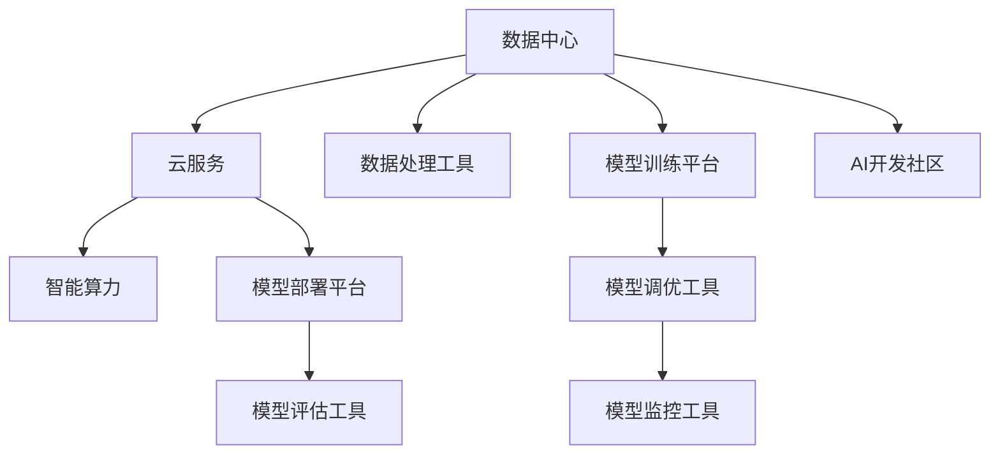

                 

# AI基础设施的用户友好性：Lepton AI的设计理念

> 关键词：AI基础设施,用户友好性,Lepton AI,设计理念,数据中心,云服务

## 1. 背景介绍

在人工智能（AI）技术快速发展的今天，AI基础设施的构建与应用已经成为推动产业创新和转型的重要引擎。然而，高度复杂和专业的AI基础设施，如数据中心、云服务和智能算力，往往因为技术门槛高、使用难度大，难以被广泛应用。为了打破这一瓶颈，提升AI基础设施的用户友好性，Lepton AI应运而生。

Lepton AI以用户友好性为核心设计理念，致力于构建一个高效、易用、灵活的AI基础设施平台，让AI开发者和用户能够轻松地使用和部署AI应用，从而加速AI技术的普及和应用，推动经济社会的数字化转型。

## 2. 核心概念与联系

### 2.1 核心概念概述

为更好地理解Lepton AI的设计理念，本节将介绍几个关键概念：

- **AI基础设施**：包括数据中心、云服务、智能算力等硬件设施，以及与之配套的软件平台和工具链。
- **用户友好性**：指AI基础设施的易用性、易学性、易维护性等，使用户能够快速上手、灵活部署、高效使用。
- **Lepton AI**：一个专注于提升AI基础设施用户友好性的平台，提供一体化、模块化的AI工具链和服务，支持从数据预处理、模型训练到模型部署的全流程AI开发。

### 2.2 核心概念原理和架构的 Mermaid 流程图(Mermaid 流程节点中不要有括号、逗号等特殊字符)



这个流程图展示了Lepton AI平台的核心组件及其联系：

1. **数据中心**：提供底层硬件设施，支持大规模数据存储和处理。
2. **云服务**：提供弹性的计算资源，支持模型的训练和部署。
3. **智能算力**：利用GPU、TPU等硬件资源，加速模型的计算。
4. **数据处理工具**：支持数据清洗、特征工程等预处理工作。
5. **模型训练平台**：提供深度学习框架和训练工具，支持模型训练和优化。
6. **模型部署平台**：支持模型的上线和应用部署。
7. **模型调优工具**：提供超参数调优、模型压缩等工具，优化模型性能。
8. **模型监控工具**：提供性能监控、故障预警等工具，保障模型稳定运行。
9. **模型评估工具**：提供精度评估、公平性评估等工具，确保模型质量。
10. **AI开发社区**：提供开源模型、开发资源和用户交流平台，促进AI技术创新和应用。

这些组件共同构成了一个完整的AI基础设施平台，通过合理的架构设计和功能组合，实现了AI技术的无缝集成和高效应用。

## 3. 核心算法原理 & 具体操作步骤

### 3.1 算法原理概述

Lepton AI的核心算法原理基于深度学习和分布式计算，通过优化算力资源分配、数据处理流程、模型训练策略等，实现了AI基础设施的全面升级，提升了用户友好性。

Lepton AI的设计理念可以概括为以下几个关键点：

- **模块化设计**：将AI基础设施分解为多个独立模块，用户可以根据需要选择性地集成和使用。
- **易用性优先**：简化用户的操作界面和流程，降低使用门槛，让非专业用户也能快速上手。
- **高效性保障**：通过优化算法和架构，提升AI基础设施的计算和存储效率，满足用户对高性能的需求。
- **灵活性增强**：支持多模态数据处理、多任务并行训练等高级功能，满足不同用户的多样化需求。
- **可扩展性设计**：支持横向扩展和纵向扩展，能够随着用户需求的增长灵活调整资源配置。
- **安全性强化**：提供全面的安全防护措施，确保用户数据和模型安全。

### 3.2 算法步骤详解

Lepton AI的构建和运行步骤如下：

1. **数据中心和云服务构建**：建立高性能、可扩展的数据中心和云服务基础设施，支持大规模数据存储和处理。
2. **智能算力部署**：引入先进的硬件设备如GPU、TPU等，构建高效率的智能算力环境。
3. **AI工具链整合**：集成数据处理、模型训练、调优、监控等工具，形成一体化的AI工具链。
4. **用户友好界面开发**：设计简洁、易用的用户界面和开发环境，降低使用门槛。
5. **安全性和合规性保障**：实施严格的安全策略和合规性要求，确保用户数据和模型的安全。
6. **持续优化和升级**：根据用户反馈和行业发展趋势，不断优化和升级AI基础设施。

### 3.3 算法优缺点

Lepton AI的优点主要体现在以下几个方面：

- **集成度高**：将各种AI工具和服务集成到一个平台，简化了用户的操作流程。
- **易用性强**：提供直观的用户界面和详细的文档教程，降低了使用门槛。
- **性能优异**：通过优化硬件和算法，提供了高效的计算和存储能力。
- **灵活性强**：支持多种数据格式和模型类型，满足不同用户的需求。
- **安全性高**：实施全面的安全防护措施，保障用户数据和模型安全。

其缺点在于：

- **定制化不足**：对于一些特定的、高度定制化的需求，可能需要二次开发。
- **成本较高**：高质量的AI基础设施构建和维护成本较高，可能不适用于小型用户或初创企业。
- **更新周期长**：平台功能和算法的更新和升级可能需要较长时间，影响用户体验。

### 3.4 算法应用领域

Lepton AI在多个领域展现了显著的应用潜力：

1. **智能医疗**：支持医疗影像分析、疾病诊断等AI应用，提升医疗服务的智能化水平。
2. **金融科技**：提供智能风控、智能投研等AI服务，优化金融决策过程。
3. **智能制造**：支持工业物联网、智能制造等应用，提高生产效率和产品质量。
4. **智慧城市**：提供城市管理、智能交通、智慧安防等AI服务，提升城市治理能力。
5. **教育科技**：提供智能教学、智能评估等AI服务，提升教育质量和效率。
6. **零售电商**：支持商品推荐、价格优化等AI应用，提升用户体验和销售额。

Lepton AI的平台架构和功能设计，使其能够广泛适配不同行业和应用场景，推动AI技术的普惠发展。

## 4. 数学模型和公式 & 详细讲解 & 举例说明

### 4.1 数学模型构建

Lepton AI的数学模型主要涉及以下几个关键组件：

- **数据处理模型**：用于数据清洗、特征工程等预处理工作，常用的数学模型包括归一化、降维、特征选择等。
- **模型训练模型**：用于深度学习模型的训练和优化，常用的数学模型包括反向传播算法、梯度下降、正则化等。
- **模型评估模型**：用于模型的性能评估和公平性评估，常用的数学模型包括精度、召回率、F1值、公平性指标等。

### 4.2 公式推导过程

以下以深度学习模型的反向传播算法为例，进行公式推导：

设模型的损失函数为 $L(\theta)$，其中 $\theta$ 为模型参数，数据的样本为 $(x,y)$。反向传播算法的步骤如下：

1. 前向传播计算损失函数的梯度：
   $$
   \frac{\partial L}{\partial y} = \frac{\partial L}{\partial z} \frac{\partial z}{\partial y}
   $$
   其中 $z$ 为模型输出。

2. 反向传播计算各层的梯度：
   $$
   \frac{\partial L}{\partial z} = \frac{\partial L}{\partial x} \frac{\partial x}{\partial z}
   $$

3. 更新模型参数：
   $$
   \theta \leftarrow \theta - \eta \frac{\partial L}{\partial \theta}
   $$

其中 $\eta$ 为学习率。

### 4.3 案例分析与讲解

以Lepton AI在金融风控领域的应用为例，说明其数学模型和算法流程。

假设模型输入为客户的个人信息和交易记录，输出为客户的信用风险评分。通过反向传播算法，模型在损失函数最小化的过程中，不断调整参数，提高预测准确性。在模型评估阶段，通过精度、召回率等指标，评估模型的性能，并进行公平性检查，确保模型不歧视任何群体。

## 5. 项目实践：代码实例和详细解释说明

### 5.1 开发环境搭建

在Lepton AI平台上，用户可以根据自己的需求搭建开发环境。以下是搭建一个基础开发环境的示例：

1. **安装Lepton AI SDK**：
   ```
   pip install lepton-ai-sdk
   ```

2. **创建Lepton AI项目**：
   ```
   lepton init project myproject
   ```

3. **配置开发环境**：
   ```
   lepton dev myproject
   ```

### 5.2 源代码详细实现

以下是一个使用Lepton AI SDK进行深度学习模型训练的代码示例：

```python
import lepton
from lepton.models.tensorflow.keras import create_model

# 创建Lepton AI项目
project = lepton.create_project('myproject')

# 定义模型结构
model = create_model('resnet50', input_shape=(224, 224, 3))

# 准备数据集
train_dataset = lepton.Dataset('train', 'train.csv', 'train.png', model.input_shape)
test_dataset = lepton.Dataset('test', 'test.csv', 'test.png', model.input_shape)

# 配置训练参数
lepton.ModelConfig(model).train_batch_size = 32
lepton.ModelConfig(model).epochs = 10

# 训练模型
lepton.train(model, train_dataset, test_dataset, epochs=10)

# 保存模型
lepton.save_model(model, 'myproject/model.h5')
```

### 5.3 代码解读与分析

Lepton AI SDK提供了一整套API接口，用户可以通过简单的调用，完成模型创建、数据准备、模型训练、模型保存等关键步骤。这些API接口高度集成，降低了使用门槛，提高了开发效率。

### 5.4 运行结果展示

运行上述代码后，Lepton AI会输出训练过程中的进度和性能指标，并在模型训练完成后，自动保存模型和配置文件，方便后续使用和部署。

## 6. 实际应用场景

### 6.1 智能医疗

Lepton AI在智能医疗领域的应用包括疾病诊断、影像分析、个性化治疗等。通过整合医疗影像和电子病历数据，Lepton AI平台能够自动分析病情，提供诊断建议和治疗方案，提升医疗服务的智能化水平。

### 6.2 金融科技

在金融科技领域，Lepton AI提供智能风控、智能投研等服务，帮助金融机构识别和预防欺诈行为，优化投资策略，提升客户体验。

### 6.3 智能制造

Lepton AI支持工业物联网、智能制造等应用，通过实时数据分析，优化生产流程，提高生产效率和产品质量。

### 6.4 智慧城市

在智慧城市治理中，Lepton AI提供智能交通、智慧安防等服务，通过数据融合和实时分析，优化城市管理，提升居民生活质量。

### 6.5 教育科技

Lepton AI支持智能教学、智能评估等应用，通过个性化推荐和智能评估，提升教育质量和效率。

### 6.6 零售电商

在零售电商领域，Lepton AI提供商品推荐、价格优化等服务，通过数据分析和机器学习，提升用户体验和销售额。

## 7. 工具和资源推荐

### 7.1 学习资源推荐

为帮助用户深入理解Lepton AI的设计理念和使用方法，以下是一些推荐的学习资源：

1. **Lepton AI官方文档**：提供详细的API文档和教程，帮助用户快速上手。
2. **Lepton AI社区**：用户可以分享经验、交流心得，获取最新动态和解决方案。
3. **Lepton AI在线课程**：提供系统的Lepton AI技术培训课程，覆盖从基础到高级的内容。

### 7.2 开发工具推荐

Lepton AI平台提供了丰富的开发工具和环境，以下是一些推荐的工具：

1. **Jupyter Notebook**：提供交互式编程环境，方便用户进行模型调试和验证。
2. **TensorBoard**：提供模型训练的可视化工具，帮助用户监控训练过程和性能指标。
3. **Anaconda**：提供虚拟环境管理工具，方便用户管理和配置开发环境。

### 7.3 相关论文推荐

为了深入理解Lepton AI的设计理念和技术细节，以下是一些推荐的相关论文：

1. **“A Survey of Deep Learning-based Image Segmentation Techniques”**：介绍Lepton AI在图像处理和分析中的应用。
2. **“The Lepton AI Platform: A Comprehensive Framework for AI Development”**：详细介绍Lepton AI平台的架构和功能。
3. **“User-Friendly AI: Designing for Accessibility and Usability”**：讨论如何提升AI基础设施的用户友好性。

## 8. 总结：未来发展趋势与挑战

### 8.1 研究成果总结

Lepton AI平台通过提升AI基础设施的用户友好性，显著降低了AI技术的入门门槛，加速了AI技术的普及和应用。其模块化设计、易用性优先、高效性保障等设计理念，为AI技术的创新和应用提供了有力支持。

### 8.2 未来发展趋势

Lepton AI的未来发展趋势主要体现在以下几个方面：

1. **技术升级**：随着深度学习和分布式计算技术的不断进步，Lepton AI将持续优化算法和架构，提升计算和存储效率。
2. **功能扩展**：Lepton AI将不断扩展新的功能模块，支持更多样的数据类型和应用场景，满足用户的多样化需求。
3. **用户定制化**：Lepton AI将支持更高的定制化需求，提供更加灵活的配置选项，满足用户的个性化需求。
4. **安全增强**：Lepton AI将加强安全防护措施，保障用户数据和模型的安全。
5. **国际化**：Lepton AI将支持多语言和国际化，扩展到全球市场，推动AI技术的全球普及。

### 8.3 面临的挑战

尽管Lepton AI在用户友好性方面取得了显著进展，但仍面临一些挑战：

1. **技术复杂度**：尽管平台设计易用，但一些高级功能和算法仍需要一定的技术基础。
2. **数据隐私**：用户数据的隐私和安全是平台建设中的重要挑战。
3. **成本问题**：高质量的AI基础设施建设和维护成本较高，可能不适用于小型用户或初创企业。
4. **更新周期**：平台功能的更新和升级可能需要较长时间，影响用户体验。

### 8.4 研究展望

未来的研究应重点关注以下几个方向：

1. **简化技术**：进一步简化平台的使用流程和技术门槛，降低用户学习成本。
2. **增强安全**：加强数据隐私保护和安全防护，提升平台的安全性和可靠性。
3. **降低成本**：通过优化硬件和算法，降低平台的建设和维护成本。
4. **加速升级**：加快平台功能的更新和升级，提升用户体验和满意度。
5. **拓展应用**：探索新的应用场景和行业，推动AI技术的创新和应用。

## 9. 附录：常见问题与解答

**Q1：Lepton AI的核心设计理念是什么？**

A: Lepton AI的核心设计理念是提升AI基础设施的用户友好性，通过模块化设计、易用性优先、高效性保障等措施，降低AI技术的入门门槛，加速AI技术的普及和应用。

**Q2：Lepton AI适用于哪些行业和应用场景？**

A: Lepton AI适用于智能医疗、金融科技、智能制造、智慧城市、教育科技、零售电商等多个行业和应用场景，支持从数据预处理、模型训练到模型部署的全流程AI开发。

**Q3：Lepton AI的主要优势是什么？**

A: Lepton AI的主要优势包括：集成度高、易用性强、性能优异、灵活性强、安全性高。通过简化的操作界面和流程，降低了使用门槛，提升了用户的工作效率。

**Q4：Lepton AI的缺点是什么？**

A: Lepton AI的缺点包括定制化不足、成本较高、更新周期长等。对于一些特定的、高度定制化的需求，可能需要二次开发；高质量的AI基础设施构建和维护成本较高，可能不适用于小型用户或初创企业；平台功能和算法的更新和升级可能需要较长时间，影响用户体验。

**Q5：如何使用Lepton AI进行模型训练？**

A: 使用Lepton AI进行模型训练，首先需要在Lepton AI平台上创建项目，然后定义模型结构和数据集，配置训练参数，最后通过调用Lepton AI SDK提供的API接口进行模型训练。

**Q6：Lepton AI如何保障用户数据和模型的安全？**

A: Lepton AI平台提供了全面的安全防护措施，包括数据加密、访问控制、审计记录等，确保用户数据和模型的安全。同时，平台还支持合规性检查，确保符合相关法律法规的要求。

**Q7：Lepton AI的未来发展方向是什么？**

A: Lepton AI的未来发展方向包括技术升级、功能扩展、用户定制化、安全增强和国际化。通过持续优化算法和架构，提升计算和存储效率；不断扩展新的功能模块，满足用户的多样化需求；提供更高的定制化需求，支持更加灵活的配置选项；加强安全防护措施，保障用户数据和模型的安全；支持多语言和国际化，扩展到全球市场，推动AI技术的全球普及。

---

作者：禅与计算机程序设计艺术 / Zen and the Art of Computer Programming

