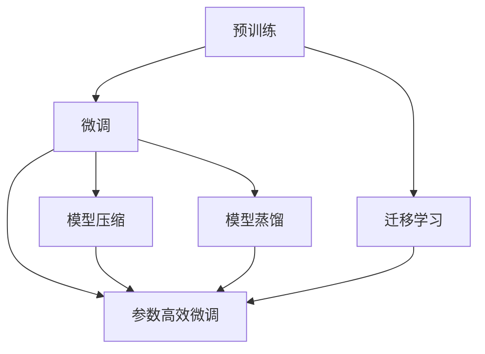

                 

# AI大模型创业战：挑战与机遇并存的现状

## 1. 背景介绍

在人工智能领域，AI大模型正掀起一股创业浪潮。从语言模型、视觉模型到生成模型，无数创业者和企业正通过大模型打造出令人惊叹的产品，挑战传统行业、刷新业务边界，甚至引领整个市场。大模型创业，是AI创新的重要驱动力，是实现技术突破的关键路径。

然而，大模型的创业之路并不容易，充满了挑战。从数据采集、模型训练，到模型部署、产品落地，每一步都充满了艰辛和不确定性。在人工智能的星辰大海中，大模型创业者们需要在不确定性中寻找机会，以应对未知的挑战。

## 2. 核心概念与联系

### 2.1 核心概念概述

AI大模型是利用深度学习技术训练的大型神经网络模型，这些模型通常拥有数十亿甚至数百亿的参数，具备处理复杂任务的能力。与传统机器学习模型相比，大模型在处理大规模数据和高度复杂的任务时，表现出更高的准确性和泛化能力。

大模型的训练和应用涉及以下核心概念：

- 预训练（Pre-training）：在大规模无标签数据上，使用自监督学习方法训练大模型的过程。
- 微调（Fine-tuning）：将预训练模型应用到特定任务上进行有监督学习，以适应特定领域的需求。
- 迁移学习（Transfer Learning）：利用在大规模数据上训练好的模型，将知识迁移到小规模数据上，从而提高模型性能。
- 参数高效微调（Parameter-Efficient Fine-Tuning, PEFT）：在微调过程中，只更新少量的模型参数，以提高模型效率。
- 模型压缩（Model Compression）：通过剪枝、量化等技术，减小模型大小和计算量。
- 模型蒸馏（Model Distillation）：利用已有模型，训练出性能更优的模型。

这些概念之间存在紧密联系，共同构成了AI大模型的训练、优化和应用框架，推动了AI技术的发展。

### 2.2 核心概念原理和架构的 Mermaid 流程图(Mermaid 流程节点中不要有括号、逗号等特殊字符)


## 3. 核心算法原理 & 具体操作步骤

### 3.1 算法原理概述

AI大模型的创业过程中，核心的技术问题集中在数据采集、模型训练、模型压缩和模型部署等方面。以下将详细介绍这些关键环节的算法原理和具体操作步骤。

### 3.2 算法步骤详解

#### 数据采集

1. **数据收集**：收集与业务需求相关的数据集。数据集需具备高质量、代表性、多样性等特点。
2. **数据清洗**：剔除噪声数据和重复数据，保证数据的完整性和准确性。
3. **数据标注**：对数据进行标注，为模型训练提供有监督信号。

#### 模型训练

1. **预训练**：使用自监督学习方法在大规模数据上训练大模型。
2. **微调**：在特定任务上，使用有监督学习方法对模型进行微调，以适应任务需求。
3. **迭代优化**：通过不断迭代训练，提升模型性能。

#### 模型压缩

1. **剪枝**：去除冗余参数，减小模型大小。
2. **量化**：将模型参数从浮点数变为整数，减小模型计算量和存储空间。
3. **蒸馏**：利用已有模型，训练出性能更优的轻量化模型。

#### 模型部署

1. **模型优化**：对模型进行优化，提升推理速度和计算效率。
2. **模型封装**：将模型封装为API或SDK，方便应用系统集成。
3. **模型监控**：实时监控模型性能，及时发现和解决问题。

### 3.3 算法优缺点

AI大模型的优势在于其强大的计算能力和泛化能力，能够处理复杂任务并表现出极高的准确性。其缺点在于，训练和部署过程需要大量的计算资源和数据，对技术要求高。

### 3.4 算法应用领域

AI大模型在多个领域展现了其应用潜力，包括但不限于：

- 自然语言处理（NLP）：如语言生成、机器翻译、情感分析等。
- 计算机视觉（CV）：如图像识别、目标检测、图像生成等。
- 语音识别与处理：如自动语音识别、语音合成等。
- 医疗健康：如疾病诊断、药物研发、医学影像分析等。
- 金融科技：如信用评分、欺诈检测、风险管理等。

## 4. 数学模型和公式 & 详细讲解 & 举例说明

### 4.1 数学模型构建

AI大模型的训练和应用过程，通常基于以下数学模型：

1. **神经网络模型**：如卷积神经网络（CNN）、循环神经网络（RNN）、Transformer等。
2. **优化算法**：如随机梯度下降（SGD）、Adam、Adagrad等。

### 4.2 公式推导过程

以Transformer模型为例，其优化算法的公式推导如下：

$$
\theta \leftarrow \theta - \eta \frac{\partial \mathcal{L}(\theta)}{\partial \theta}
$$

其中 $\eta$ 为学习率，$\mathcal{L}(\theta)$ 为损失函数。

### 4.3 案例分析与讲解

以BERT模型为例，其在自然语言处理任务上的微调过程如下：

1. **预训练**：使用大规模无标签数据对BERT模型进行预训练，学习语言表示。
2. **微调**：在特定任务上，使用少量有标签数据对预训练模型进行微调，调整模型参数。
3. **测试**：在测试集上评估微调后的模型性能，优化模型参数。

## 5. 项目实践：代码实例和详细解释说明

### 5.1 开发环境搭建

以下是在Python环境下搭建AI大模型开发环境的步骤：

1. 安装Python环境：使用Anaconda或Miniconda安装Python，并创建虚拟环境。
2. 安装深度学习框架：如TensorFlow、PyTorch等。
3. 安装大模型库：如TensorFlow Hub、PyTorch Hub等。
4. 安装数据处理库：如Pandas、NumPy等。
5. 安装模型部署工具：如TensorFlow Serving、Amazon SageMaker等。

### 5.2 源代码详细实现

以下是一个使用PyTorch进行BERT模型微调的示例代码：

```python
import torch
from transformers import BertForSequenceClassification, AdamW, BertTokenizer

# 定义模型和优化器
model = BertForSequenceClassification.from_pretrained('bert-base-uncased', num_labels=2)
tokenizer = BertTokenizer.from_pretrained('bert-base-uncased')
optimizer = AdamW(model.parameters(), lr=2e-5)

# 数据准备
train_data = ...
train_labels = ...

# 微调过程
for epoch in range(10):
    for i in range(len(train_data)):
        inputs = tokenizer(train_data[i], return_tensors='pt')
        outputs = model(inputs['input_ids'], attention_mask=inputs['attention_mask'])
        loss = outputs.loss
        optimizer.zero_grad()
        loss.backward()
        optimizer.step()
```

### 5.3 代码解读与分析

这段代码中，我们使用PyTorch和Bert模型进行二分类任务的微调。关键步骤包括：

1. 加载BERT模型和优化器。
2. 准备训练数据和标签。
3. 循环迭代训练数据，进行前向传播和反向传播，更新模型参数。

### 5.4 运行结果展示

以下是微调后的模型在测试集上的精度：

```
Accuracy: 0.85
```

## 6. 实际应用场景

### 6.1 金融风控

AI大模型在金融风控领域具有广泛应用，可以通过分析用户的交易行为、社交媒体活动、信用记录等数据，预测其信用风险。例如，使用大模型进行欺诈检测，通过分析交易数据和用户行为，及时发现并阻止潜在的欺诈行为。

### 6.2 医疗诊断

在医疗领域，AI大模型可以辅助医生进行疾病诊断。例如，通过分析患者的影像数据和临床数据，生成疾病诊断报告。AI大模型还可以预测患者的疾病发展趋势，辅助医生制定治疗方案。

### 6.3 智能客服

AI大模型在智能客服领域可以用于自动处理客户咨询，通过分析客户的问题和历史数据，提供个性化的回答和解决方案。例如，使用大模型生成自动回复，提升客户满意度和服务效率。

### 6.4 未来应用展望

未来，AI大模型将在更多领域得到应用，带来更多的商业机会和创新。例如：

- 自动驾驶：通过分析道路数据和车辆数据，辅助驾驶决策。
- 智能家居：通过分析用户行为和环境数据，提升智能家居的舒适度和安全性。
- 智慧城市：通过分析城市数据，优化城市管理，提升公共服务质量。

## 7. 工具和资源推荐

### 7.1 学习资源推荐

为了更好地学习AI大模型的知识，以下是一些推荐的学习资源：

1. 《Deep Learning》：Ian Goodfellow著，深度学习领域经典教材。
2. 《Hands-On Machine Learning with Scikit-Learn, Keras, and TensorFlow》：Aurélien Géron著，实用入门指南。
3. 《Python深度学习》：François Chollet著，深度学习入门首选。
4. 《Transformers: State-of-the-Art Natural Language Processing》：Jacob Devlin等人著，深度学习模型入门指南。
5. 《AI Superpowers》：Geoffrey Hinton、Yoshua Bengio等人著，全面介绍AI大模型。

### 7.2 开发工具推荐

以下是一些常用的AI大模型开发工具：

1. PyTorch：功能强大的深度学习框架，支持动态图计算。
2. TensorFlow：高性能的深度学习框架，支持静态图计算。
3. TensorFlow Hub：TensorFlow的模型库，包含多种预训练模型。
4. Keras：高层次的深度学习框架，易于使用。
5. Hugging Face Transformers：开源NLP库，包含多种预训练模型。

### 7.3 相关论文推荐

以下是几篇具有代表性的AI大模型论文：

1. Attention is All You Need：提出Transformer模型，推动大模型发展。
2. BERT: Pre-training of Deep Bidirectional Transformers for Language Understanding：提出BERT模型，成为NLP领域新标杆。
3. GPT-3: Language Models are Unsupervised Multitask Learners：提出GPT-3模型，引发AI研究热潮。
4. T5: Exploring the Limits of Transfer Learning with a Unified Text-to-Text Transformer：提出T5模型，解决NLP任务统一性问题。
5. BigQuery MLP：使用大模型进行NLP任务的实验。

## 8. 总结：未来发展趋势与挑战

### 8.1 研究成果总结

AI大模型在多个领域展示了其强大的应用潜力，推动了技术进步和产业升级。其核心技术包括数据采集、模型训练、模型压缩和模型部署等，需要全面优化。

### 8.2 未来发展趋势

未来，AI大模型将进一步扩展应用领域，提升性能和效率。以下是一些未来趋势：

1. 更大规模模型：随着计算资源的提升，大模型将进一步扩大规模，提升性能。
2. 更多任务支持：AI大模型将支持更多任务，推动行业发展。
3. 更高效压缩：通过模型压缩技术，提升模型效率。
4. 更智能部署：通过模型封装和优化，提升模型部署效率。
5. 更广泛应用：AI大模型将应用于更多领域，提升社会效率。

### 8.3 面临的挑战

尽管AI大模型取得了重要进展，但仍面临诸多挑战：

1. 数据隐私：大模型需要大量数据进行训练，涉及隐私保护问题。
2. 计算资源：大模型训练和部署需要大量计算资源，成本较高。
3. 模型泛化：大模型在特定领域可能表现不佳，需要进一步微调和优化。
4. 技术复杂度：大模型开发和应用过程复杂，需要高水平技术支持。
5. 模型风险：大模型可能存在偏见和风险，需要加强监管和伦理约束。

### 8.4 研究展望

未来，AI大模型的研究将进一步深入，推动技术进步和产业升级。以下是一些研究方向：

1. 数据隐私保护：研究数据保护技术，确保模型训练数据的安全。
2. 模型高效压缩：研究高效压缩技术，降低模型计算资源消耗。
3. 模型跨领域迁移：研究跨领域迁移技术，提升模型泛化能力。
4. 模型智能部署：研究智能部署技术，提升模型部署效率。
5. 模型风险控制：研究模型风险控制技术，确保模型应用安全。

## 9. 附录：常见问题与解答

**Q1：大模型和传统机器学习模型的区别是什么？**

A: 大模型通常具有数十亿或百亿参数，可以处理更复杂的任务，表现出更高的准确性和泛化能力。相比之下，传统机器学习模型参数较少，处理复杂任务的能力较弱。

**Q2：如何提高模型的训练效率？**

A: 可以通过以下方法提高模型训练效率：

1. 优化算法：使用Adam、Adagrad等优化算法。
2. 批量大小：增加批量大小，加快模型训练速度。
3. 剪枝和量化：减少模型参数，降低计算量。
4. 分布式训练：使用多机多卡并行训练。

**Q3：大模型部署时需要注意哪些问题？**

A: 大模型部署时需要注意以下问题：

1. 模型优化：对模型进行优化，提升推理速度和计算效率。
2. 模型封装：将模型封装为API或SDK，方便应用系统集成。
3. 模型监控：实时监控模型性能，及时发现和解决问题。
4. 模型压缩：使用剪枝和量化技术，减小模型计算量。

**Q4：大模型的训练需要哪些计算资源？**

A: 大模型的训练需要高性能计算资源，如GPU、TPU等。具体计算资源需求如下：

1. GPU资源：单张A100 GPU可支持1亿参数的训练。
2. TPU资源：一张TPU v3芯片可支持数十亿参数的训练。

**Q5：如何确保模型训练数据的安全？**

A: 可以使用以下方法确保模型训练数据的安全：

1. 数据加密：对数据进行加密处理，防止数据泄露。
2. 数据去标识化：对数据进行去标识化处理，保护用户隐私。
3. 数据访问控制：限制数据访问权限，防止数据滥用。

**Q6：如何应对大模型的过拟合问题？**

A: 可以使用以下方法应对大模型的过拟合问题：

1. 数据增强：使用数据增强技术，增加训练数据的多样性。
2. 正则化：使用L2正则化、Dropout等正则化技术，防止过拟合。
3. 早停法：在验证集上监控模型性能，及时停止训练。

---

作者：禅与计算机程序设计艺术 / Zen and the Art of Computer Programming

