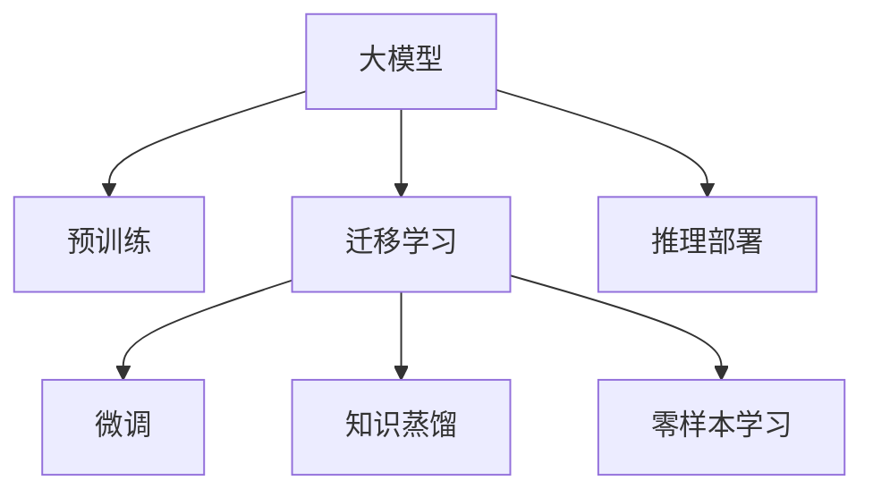

                 

## 1. 背景介绍

随着人工智能技术的迅猛发展，大模型（Large Models），特别是基于深度学习的预训练模型，逐渐成为AI创业的焦点。这些大模型通过在海量数据上预训练，具备强大的学习能力，能够在自然语言处理（NLP）、计算机视觉（CV）、语音识别等领域取得卓越性能。同时，大模型也被广泛用于推荐系统、搜索引擎、智能客服等领域，助力各行业的数字化转型升级。

### 1.1 问题的由来

AI大模型的兴起，使得创业公司可以更快速地推出基于AI的产品和服务，降低技术门槛，缩短产品开发周期。同时，大模型的高性能也吸引了资本的关注，推动了AI领域的投资热潮。然而，大模型的应用并非一帆风顺，也面临许多挑战。

首先，大模型的开发和训练需要巨大的计算资源和数据资源，这对于中小企业来说是一大挑战。其次，尽管大模型在许多任务上取得了显著进展，但其效果与人类专家的性能仍有差距，无法完全替代人类专家的工作。此外，大模型的可解释性和安全性问题也日益突出，引起了社会的广泛关注。

### 1.2 问题核心关键点

大模型创业的核心问题可以归结为以下几点：

1. **资源需求**：大模型的开发和训练需要高性能的计算资源，包括GPU、TPU等，这对中小企业是一大挑战。
2. **性能提升**：尽管大模型在一些任务上表现出色，但仍需进一步提升其效果，特别是在可解释性和安全性方面。
3. **应用落地**：如何将大模型高效地集成到实际应用中，提升用户体验和业务价值。
4. **数据隐私**：大模型的训练和应用需要大量的数据，如何在保护用户隐私的前提下进行数据收集和处理。

## 2. 核心概念与联系

### 2.1 核心概念概述

为更好地理解AI大模型创业，本节将介绍几个关键概念：

1. **大模型（Large Models）**：指通过深度学习技术在大规模数据集上进行预训练的模型，如BERT、GPT-3等。这些模型具备强大的语言、图像、声音处理能力，适用于多种AI应用场景。

2. **预训练（Pre-training）**：指在大规模无标签数据上，通过自监督学习任务训练通用模型，使其具备基础的泛化能力。预训练是构建高性能AI模型的基础。

3. **迁移学习（Transfer Learning）**：将预训练模型应用于特定任务，通过微调等方式提升模型在特定任务上的性能。迁移学习使得大模型可以应用于更广泛的任务领域。

4. **微调（Fine-tuning）**：在预训练模型的基础上，使用特定任务的标注数据进行有监督学习，调整模型参数以适应新任务。微调是大模型应用于实际业务场景的关键步骤。

5. **知识蒸馏（Knowledge Distillation）**：通过将大模型的知识（如权重、特征）蒸馏到轻量级模型中，使得轻量级模型也能具备较高的性能。知识蒸馏有助于大模型在资源受限的场景下推广应用。

6. **零样本学习（Zero-shot Learning）**：指模型在未见过的数据上直接进行预测，不需要任何训练。零样本学习利用大模型的泛化能力，在缺乏标注数据的情况下仍能取得不错的效果。

### 2.2 核心概念原理和架构的 Mermaid 流程图



## 3. 核心算法原理 & 具体操作步骤

### 3.1 算法原理概述

AI大模型的创业核心在于如何高效地将大模型应用于实际业务场景。这一过程通常包括预训练、迁移学习和微调三个步骤。其中，微调是使大模型适应特定任务的关键。

预训练阶段，大模型在无标签数据上通过自监督学习任务进行训练，学习到通用的语言、图像等表示。迁移学习阶段，将预训练模型应用于特定任务，通过微调等方式，进一步调整模型参数，以适应新任务的特征。微调的过程通常包括选择适当的网络结构、设计任务损失函数、优化器和正则化技术等，以防止过拟合和提升模型性能。

### 3.2 算法步骤详解

AI大模型的创业主要包括以下步骤：

**Step 1: 数据准备**

1. 收集标注数据：根据目标任务，收集足够的标注数据。标注数据可以是文本、图像、音频等多种形式。
2. 数据预处理：清洗数据，去除噪声，进行数据增强，如回译、数据扩增等，以增加数据多样性。
3. 数据划分：将数据划分为训练集、验证集和测试集，确保数据分布的一致性。

**Step 2: 模型选择与初始化**

1. 选择合适的预训练模型：如BERT、GPT等，根据任务类型选择相应的模型架构。
2. 加载预训练模型：利用已有的预训练模型进行初始化，避免从头开始训练。
3. 设置模型参数：包括学习率、优化器、批大小等，根据任务需求进行配置。

**Step 3: 模型微调**

1. 微调模型：使用训练集进行有监督学习，调整模型参数以适应新任务。
2. 验证集评估：周期性地在验证集上评估模型性能，防止过拟合。
3. 模型优化：根据评估结果调整模型参数，优化模型性能。

**Step 4: 模型部署与优化**

1. 模型部署：将微调后的模型部署到生产环境中，用于实际业务场景。
2. 性能优化：根据实际使用情况，对模型进行性能优化，如剪枝、量化等。
3. 监控与维护：实时监控模型性能，定期维护更新，确保模型在实际使用中的稳定性。

### 3.3 算法优缺点

AI大模型的创业方法具有以下优点：

1. **高效性**：利用已有的大模型进行微调，可以显著减少从头训练所需的时间和资源。
2. **泛化能力强**：大模型通过预训练学习到通用的知识，能够在特定任务上快速适应，提升模型性能。
3. **灵活性高**：不同的任务可以设计不同的微调方案，灵活应对各种业务需求。

同时，也存在一些缺点：

1. **数据需求高**：微调需要足够的标注数据，数据收集和标注成本较高。
2. **模型复杂度高**：大模型参数量巨大，对计算资源和存储资源的要求较高。
3. **可解释性差**：大模型内部机制复杂，难以解释其决策过程。
4. **安全性问题**：大模型可能学习到有害信息，存在潜在的安全隐患。

### 3.4 算法应用领域

AI大模型在多个领域得到了广泛应用，包括但不限于：

1. **NLP领域**：用于文本分类、情感分析、问答系统、机器翻译等任务，提升文本处理的精度和效率。
2. **CV领域**：用于图像分类、目标检测、图像生成等任务，推动计算机视觉技术的进步。
3. **医疗领域**：用于疾病诊断、医学影像分析、患者监测等任务，提升医疗服务的智能化水平。
4. **金融领域**：用于股票分析、信用评估、风险管理等任务，优化金融决策和客户服务。
5. **智能客服**：用于智能客服系统，提升客户咨询体验和问题解决效率。
6. **推荐系统**：用于个性化推荐，提升用户体验和业务价值。

## 4. 数学模型和公式 & 详细讲解 & 举例说明

### 4.1 数学模型构建

AI大模型的创业主要涉及数学模型构建、公式推导和案例分析。

**损失函数（Loss Function）**：
定义模型在样本 $(x,y)$ 上的损失函数为 $\ell(M_{\theta}(x),y)$，其中 $M_{\theta}(x)$ 为模型在输入 $x$ 上的输出，$y$ 为真实标签。常见的损失函数包括交叉熵损失、均方误差损失等。

**梯度下降（Gradient Descent）**：
利用梯度下降算法，最小化损失函数。设损失函数对模型参数 $\theta$ 的梯度为 $\nabla_{\theta}\mathcal{L}(\theta)$，则参数更新公式为：
$$
\theta \leftarrow \theta - \eta \nabla_{\theta}\mathcal{L}(\theta)
$$
其中 $\eta$ 为学习率。

### 4.2 公式推导过程

以文本分类任务为例，推导交叉熵损失函数及其梯度。

假设模型 $M_{\theta}$ 在输入 $x$ 上的输出为 $\hat{y}=M_{\theta}(x) \in [0,1]$，表示样本属于正类的概率。真实标签 $y \in \{0,1\}$。则二分类交叉熵损失函数定义为：
$$
\ell(M_{\theta}(x),y) = -[y\log \hat{y} + (1-y)\log (1-\hat{y})]
$$

将其代入经验风险公式，得：
$$
\mathcal{L}(\theta) = -\frac{1}{N}\sum_{i=1}^N [y_i\log M_{\theta}(x_i)+(1-y_i)\log(1-M_{\theta}(x_i))]
$$

根据链式法则，损失函数对参数 $\theta_k$ 的梯度为：
$$
\frac{\partial \mathcal{L}(\theta)}{\partial \theta_k} = -\frac{1}{N}\sum_{i=1}^N (\frac{y_i}{M_{\theta}(x_i)}-\frac{1-y_i}{1-M_{\theta}(x_i)}) \frac{\partial M_{\theta}(x_i)}{\partial \theta_k}
$$

其中 $\frac{\partial M_{\theta}(x_i)}{\partial \theta_k}$ 可进一步递归展开，利用自动微分技术完成计算。

### 4.3 案例分析与讲解

**NLP领域的应用案例**：
在情感分析任务中，利用BERT模型进行微调。假设输入文本为正向评论，输出标签为1；输入文本为负向评论，输出标签为0。则微调过程如下：

1. 数据准备：收集大量带有情感标签的评论，划分为训练集、验证集和测试集。
2. 模型选择：选择BERT模型作为预训练模型。
3. 微调模型：使用训练集进行微调，优化模型参数。
4. 验证集评估：周期性地在验证集上评估模型性能，防止过拟合。
5. 测试集测试：在测试集上测试微调后模型的效果。

## 5. 项目实践：代码实例和详细解释说明

### 5.1 开发环境搭建

在进行AI大模型创业实践前，我们需要准备好开发环境。以下是使用Python进行TensorFlow开发的环境配置流程：

1. 安装Anaconda：从官网下载并安装Anaconda，用于创建独立的Python环境。

2. 创建并激活虚拟环境：
```bash
conda create -n tensorflow-env python=3.8 
conda activate tensorflow-env
```

3. 安装TensorFlow：根据CUDA版本，从官网获取对应的安装命令。例如：
```bash
conda install tensorflow tensorflow-gpu -c conda-forge
```

4. 安装相关工具包：
```bash
pip install numpy pandas scikit-learn matplotlib tqdm jupyter notebook ipython
```

完成上述步骤后，即可在`tensorflow-env`环境中开始创业实践。

### 5.2 源代码详细实现

这里我们以情感分析任务为例，给出使用TensorFlow对BERT模型进行微调的代码实现。

首先，定义情感分析任务的数据处理函数：

```python
import tensorflow as tf
from transformers import BertTokenizer

class SentimentDataset(tf.data.Dataset):
    def __init__(self, texts, labels, tokenizer):
        self.texts = texts
        self.labels = labels
        self.tokenizer = tokenizer
        self.max_len = 128
        
    def __len__(self):
        return len(self.texts)
    
    def __getitem__(self, item):
        text = self.texts[item]
        label = self.labels[item]
        
        encoding = self.tokenizer(text, return_tensors='tf', max_length=self.max_len, padding='max_length', truncation=True)
        input_ids = encoding['input_ids']
        attention_mask = encoding['attention_mask']
        
        # 对token-wise的标签进行编码
        encoded_labels = [1 if label == 1 else 0 for label in self.labels] 
        encoded_labels.extend([0] * (self.max_len - len(encoded_labels)))
        labels = tf.convert_to_tensor(encoded_labels, dtype=tf.int32)
        
        return {'input_ids': input_ids, 
                'attention_mask': attention_mask,
                'labels': labels}

# 标签与id的映射
label2id = {1: 1, 0: 0}
id2label = {v: k for k, v in label2id.items()}

# 创建dataset
tokenizer = BertTokenizer.from_pretrained('bert-base-uncased')

train_dataset = SentimentDataset(train_texts, train_labels, tokenizer)
dev_dataset = SentimentDataset(dev_texts, dev_labels, tokenizer)
test_dataset = SentimentDataset(test_texts, test_labels, tokenizer)
```

然后，定义模型和优化器：

```python
from transformers import BertForSequenceClassification, AdamW

model = BertForSequenceClassification.from_pretrained('bert-base-uncased', num_labels=2)

optimizer = AdamW(model.parameters(), lr=2e-5)
```

接着，定义训练和评估函数：

```python
from tqdm import tqdm
from sklearn.metrics import accuracy_score

device = tf.device('cuda') if tf.cuda.is_available() else tf.device('cpu')
model.to(device)

def train_epoch(model, dataset, batch_size, optimizer):
    dataloader = tf.data.Dataset.from_tensor_slices(dataset).shuffle(buffer_size=1000).batch(batch_size)
    model.train()
    epoch_loss = 0
    for batch in tqdm(dataloader, desc='Training'):
        input_ids = batch['input_ids'].to(device)
        attention_mask = batch['attention_mask'].to(device)
        labels = batch['labels'].to(device)
        model.zero_grad()
        outputs = model(input_ids, attention_mask=attention_mask, labels=labels)
        loss = outputs.loss
        epoch_loss += loss.numpy().item()
        loss.backward()
        optimizer.step()
    return epoch_loss / len(dataloader)

def evaluate(model, dataset, batch_size):
    dataloader = tf.data.Dataset.from_tensor_slices(dataset).batch(batch_size)
    model.eval()
    preds, labels = [], []
    with tf.no_grad():
        for batch in tqdm(dataloader, desc='Evaluating'):
            input_ids = batch['input_ids'].to(device)
            attention_mask = batch['attention_mask'].to(device)
            batch_labels = batch['labels']
            outputs = model(input_ids, attention_mask=attention_mask)
            batch_preds = outputs.logits.argmax(dim=1).numpy().tolist()
            batch_labels = batch_labels.numpy().tolist()
            for pred, label in zip(batch_preds, batch_labels):
                preds.append(pred)
                labels.append(label)
                
    return accuracy_score(labels, preds)

```

最后，启动训练流程并在测试集上评估：

```python
epochs = 5
batch_size = 16

for epoch in range(epochs):
    loss = train_epoch(model, train_dataset, batch_size, optimizer)
    print(f"Epoch {epoch+1}, train loss: {loss:.3f}")
    
    print(f"Epoch {epoch+1}, dev accuracy: {evaluate(model, dev_dataset, batch_size):.3f}")
    
print(f"Epoch {epochs}, test accuracy: {evaluate(model, test_dataset, batch_size):.3f}")
```

以上就是使用TensorFlow对BERT进行情感分析任务微调的完整代码实现。可以看到，TensorFlow与BERT模型结合，实现了高效的模型微调流程。

### 5.3 代码解读与分析

让我们再详细解读一下关键代码的实现细节：

**SentimentDataset类**：
- `__init__`方法：初始化文本、标签、分词器等关键组件。
- `__len__`方法：返回数据集的样本数量。
- `__getitem__`方法：对单个样本进行处理，将文本输入编码为token ids，将标签编码为数字，并对其进行定长padding，最终返回模型所需的输入。

**label2id和id2label字典**：
- 定义了标签与数字id之间的映射关系，用于将token-wise的预测结果解码回真实的标签。

**训练和评估函数**：
- 使用TensorFlow的DataLoader对数据集进行批次化加载，供模型训练和推理使用。
- 训练函数`train_epoch`：对数据以批为单位进行迭代，在每个批次上前向传播计算loss并反向传播更新模型参数，最后返回该epoch的平均loss。
- 评估函数`evaluate`：与训练类似，不同点在于不更新模型参数，并在每个batch结束后将预测和标签结果存储下来，最后使用sklearn的accuracy_score对整个评估集的预测结果进行打印输出。

**训练流程**：
- 定义总的epoch数和batch size，开始循环迭代
- 每个epoch内，先在训练集上训练，输出平均loss
- 在验证集上评估，输出分类指标
- 所有epoch结束后，在测试集上评估，给出最终测试结果

可以看到，TensorFlow结合BERT模型使得情感分析任务的微调代码实现变得简洁高效。开发者可以将更多精力放在数据处理、模型改进等高层逻辑上，而不必过多关注底层的实现细节。

当然，工业级的系统实现还需考虑更多因素，如模型的保存和部署、超参数的自动搜索、更灵活的任务适配层等。但核心的微调范式基本与此类似。

## 6. 实际应用场景

### 6.1 智能客服系统

基于AI大模型的智能客服系统可以广泛应用在各行各业，提升客户咨询体验和问题解决效率。传统的客服系统依赖大量人工服务，响应速度慢且成本高。智能客服系统通过大模型的微调，能够快速响应客户咨询，解答各类常见问题，极大地提升了客户满意度。

在技术实现上，可以收集企业内部的历史客服对话记录，将问题和最佳答复构建成监督数据，在此基础上对BERT等预训练模型进行微调。微调后的模型能够自动理解用户意图，匹配最合适的答案模板进行回复。对于客户提出的新问题，还可以接入检索系统实时搜索相关内容，动态组织生成回答。如此构建的智能客服系统，能大幅提升客户咨询体验和问题解决效率。

### 6.2 金融舆情监测

金融机构需要实时监测市场舆论动向，以便及时应对负面信息传播，规避金融风险。传统的人工监测方式成本高、效率低，难以应对网络时代海量信息爆发的挑战。基于AI大模型的文本分类和情感分析技术，为金融舆情监测提供了新的解决方案。

具体而言，可以收集金融领域相关的新闻、报道、评论等文本数据，并对其进行主题标注和情感标注。在此基础上对预训练语言模型进行微调，使其能够自动判断文本属于何种主题，情感倾向是正面、中性还是负面。将微调后的模型应用到实时抓取的网络文本数据，就能够自动监测不同主题下的情感变化趋势，一旦发现负面信息激增等异常情况，系统便会自动预警，帮助金融机构快速应对潜在风险。

### 6.3 个性化推荐系统

当前的推荐系统往往只依赖用户的历史行为数据进行物品推荐，无法深入理解用户的真实兴趣偏好。基于AI大模型的个性化推荐系统可以更好地挖掘用户行为背后的语义信息，从而提供更精准、多样的推荐内容。

在实践中，可以收集用户浏览、点击、评论、分享等行为数据，提取和用户交互的物品标题、描述、标签等文本内容。将文本内容作为模型输入，用户的后续行为（如是否点击、购买等）作为监督信号，在此基础上微调预训练语言模型。微调后的模型能够从文本内容中准确把握用户的兴趣点。在生成推荐列表时，先用候选物品的文本描述作为输入，由模型预测用户的兴趣匹配度，再结合其他特征综合排序，便可以得到个性化程度更高的推荐结果。

### 6.4 未来应用展望

随着AI大模型的不断进步，其在更多领域的应用前景将更加广阔。

在智慧医疗领域，基于AI大模型的问答系统、病历分析、药物研发等应用将提升医疗服务的智能化水平，辅助医生诊疗，加速新药开发进程。

在智能教育领域，微调技术可应用于作业批改、学情分析、知识推荐等方面，因材施教，促进教育公平，提高教学质量。

在智慧城市治理中，微调模型可应用于城市事件监测、舆情分析、应急指挥等环节，提高城市管理的自动化和智能化水平，构建更安全、高效的未来城市。

此外，在企业生产、社会治理、文娱传媒等众多领域，基于大模型微调的人工智能应用也将不断涌现，为经济社会发展注入新的动力。

## 7. 工具和资源推荐

### 7.1 学习资源推荐

为了帮助开发者系统掌握AI大模型的创业技术，这里推荐一些优质的学习资源：

1. TensorFlow官方文档：提供了TensorFlow的详细教程和API文档，是学习TensorFlow的好帮手。
2. PyTorch官方文档：提供了PyTorch的详细教程和API文档，是学习深度学习的重要资源。
3. HuggingFace官方文档：提供了丰富的预训练模型和微调样例代码，是学习NLP技术的重要资料。
4. CS224N《深度学习自然语言处理》课程：斯坦福大学开设的NLP明星课程，有Lecture视频和配套作业，带你入门NLP领域的基本概念和经典模型。
5. 《自然语言处理入门与实践》书籍：清华大学出版社出版的入门书籍，详细介绍了NLP的基本概念和实践方法。

通过对这些资源的学习实践，相信你一定能够快速掌握AI大模型的创业精髓，并用于解决实际的NLP问题。

### 7.2 开发工具推荐

高效的开发离不开优秀的工具支持。以下是几款用于AI大模型创业开发的常用工具：

1. TensorFlow：由Google主导开发的开源深度学习框架，生产部署方便，适合大规模工程应用。
2. PyTorch：基于Python的开源深度学习框架，灵活动态的计算图，适合快速迭代研究。
3. Weights & Biases：模型训练的实验跟踪工具，可以记录和可视化模型训练过程中的各项指标，方便对比和调优。
4. Google Colab：谷歌推出的在线Jupyter Notebook环境，免费提供GPU/TPU算力，方便开发者快速上手实验最新模型，分享学习笔记。

合理利用这些工具，可以显著提升AI大模型创业的开发效率，加快创新迭代的步伐。

### 7.3 相关论文推荐

AI大模型的创业涉及众多前沿研究领域，以下是几篇奠基性的相关论文，推荐阅读：

1. Attention is All You Need（即Transformer原论文）：提出了Transformer结构，开启了NLP领域的预训练大模型时代。
2. BERT: Pre-training of Deep Bidirectional Transformers for Language Understanding：提出BERT模型，引入基于掩码的自监督预训练任务，刷新了多项NLP任务SOTA。
3. Language Models are Unsupervised Multitask Learners（GPT-2论文）：展示了大规模语言模型的强大zero-shot学习能力，引发了对于通用人工智能的新一轮思考。
4. Knowledge Distillation：介绍了知识蒸馏方法，通过将大模型的知识蒸馏到轻量级模型中，使得轻量级模型也能具备较高的性能。
5. Zero-Shot Learning with Pre-trained Language Models：介绍了零样本学习技术，利用大模型的泛化能力，在缺乏标注数据的情况下仍能取得不错的效果。
6. An End-to-End Approach for Multi-Modal Speech and Video Sentiment Analysis：介绍了多模态情感分析方法，通过融合视觉、语音等多模态信息，提升情感分析的精度。

这些论文代表了大模型创业的发展脉络。通过学习这些前沿成果，可以帮助研究者把握学科前进方向，激发更多的创新灵感。

## 8. 总结：未来发展趋势与挑战

### 8.1 研究成果总结

AI大模型的创业技术在过去几年中取得了显著进展，特别是在NLP、CV等领域，大模型通过微调提升了模型的泛化能力和业务价值。以下是一些主要的研究成果：

1. 预训练模型的应用范围不断扩大，从NLP扩展到CV、语音等领域。
2. 微调技术不断发展，出现了参数高效微调、知识蒸馏、零样本学习等新方法。
3. 多模态融合技术逐渐成熟，推动了情感分析、智能客服、推荐系统等领域的发展。
4. 大模型的性能不断提升，推动了更多应用场景的落地。

### 8.2 未来发展趋势

展望未来，AI大模型的创业技术将呈现以下几个发展趋势：

1. **模型规模持续增大**：随着算力成本的下降和数据规模的扩张，预训练语言模型的参数量还将持续增长，大模型的泛化能力和表示能力将进一步提升。
2. **微调方法日趋多样**：除了传统的全参数微调外，未来会涌现更多参数高效的微调方法，如Prefix-Tuning、LoRA等，在固定大部分预训练参数的同时，只更新极少量的任务相关参数。
3. **持续学习成为常态**：随着数据分布的不断变化，微调模型也需要持续学习新知识以保持性能。如何在不遗忘原有知识的同时，高效吸收新样本信息，将成为重要的研究课题。
4. **少样本学习和跨领域迁移能力增强**：未来的微调模型将更好地利用大模型的泛化能力，在更少的标注样本上也能实现理想的微调效果。
5. **多模态融合更加深入**：多模态信息融合技术将进一步提升模型对现实世界的理解和建模能力，推动跨模态交互和协同处理的发展。
6. **模型的可解释性加强**：未来的微调模型将更好地解释其内部工作机制和决策逻辑，提升系统的透明性和可信度。

### 8.3 面临的挑战

尽管AI大模型的创业技术取得了显著进展，但在迈向更加智能化、普适化应用的过程中，仍面临诸多挑战：

1. **数据需求高**：微调需要足够的标注数据，数据收集和标注成本较高，特别是在长尾应用场景中。
2. **模型复杂度高**：大模型参数量巨大，对计算资源和存储资源的要求较高。
3. **可解释性差**：大模型内部机制复杂，难以解释其决策过程，尤其在医疗、金融等高风险应用中。
4. **安全性问题**：大模型可能学习到有害信息，存在潜在的安全隐患，需要加强数据隐私保护和模型监管。
5. **部署效率低**：大模型的推理速度慢，内存占用大，需要优化模型结构和压缩技术，以提升部署效率。
6. **模型更新成本高**：在数据分布变化时，需要重新微调模型，更新成本较高。

### 8.4 研究展望

面对AI大模型创业所面临的挑战，未来的研究需要在以下几个方面寻求新的突破：

1. **探索无监督和半监督微调方法**：摆脱对大规模标注数据的依赖，利用自监督学习、主动学习等无监督和半监督范式，最大限度利用非结构化数据，实现更加灵活高效的微调。
2. **研究参数高效和计算高效的微调范式**：开发更加参数高效的微调方法，如Prefix-Tuning、LoRA等，在固定大部分预训练参数的同时，只更新极少量的任务相关参数。同时优化微调模型的计算图，减少前向传播和反向传播的资源消耗，实现更加轻量级、实时性的部署。
3. **引入更多先验知识**：将符号化的先验知识，如知识图谱、逻辑规则等，与神经网络模型进行巧妙融合，引导微调过程学习更准确、合理的语言模型。同时加强不同模态数据的整合，实现视觉、语音等多模态信息与文本信息的协同建模。
4. **结合因果分析和博弈论工具**：将因果分析方法引入微调模型，识别出模型决策的关键特征，增强输出解释的因果性和逻辑性。借助博弈论工具刻画人机交互过程，主动探索并规避模型的脆弱点，提高系统稳定性。
5. **纳入伦理道德约束**：在模型训练目标中引入伦理导向的评估指标，过滤和惩罚有偏见、有害的输出倾向。同时加强人工干预和审核，建立模型行为的监管机制，确保输出符合人类价值观和伦理道德。

这些研究方向的探索，必将引领AI大模型创业技术迈向更高的台阶，为构建安全、可靠、可解释、可控的智能系统铺平道路。面向未来，AI大模型创业技术还需要与其他人工智能技术进行更深入的融合，如知识表示、因果推理、强化学习等，多路径协同发力，共同推动自然语言理解和智能交互系统的进步。只有勇于创新、敢于突破，才能不断拓展大模型的边界，让智能技术更好地造福人类社会。

## 9. 附录：常见问题与解答

**Q1：AI大模型创业的资源需求高，如何降低资源成本？**

A: 资源需求高是大模型创业的一个主要挑战。以下是一些降低资源成本的策略：

1. **优化模型结构**：使用剪枝、量化等技术，减少模型参数量和计算资源消耗。
2. **模型压缩**：采用模型压缩技术，如TensorFlow Lite、PyTorch Mobile等，将大模型转化为轻量级模型，降低内存和存储需求。
3. **分布式训练**：利用分布式训练技术，将模型参数分布在多个计算节点上，提高训练效率。
4. **云计算**：利用云平台提供的GPU、TPU等高性能计算资源，降低本地资源需求。

通过以上措施，可以有效降低AI大模型创业的资源成本，推动技术在更多场景下应用。

**Q2：AI大模型的效果与人类专家相比如何？**

A: AI大模型在许多任务上已经取得了卓越的性能，特别是在大规模数据上。然而，与人类专家的性能相比，AI大模型仍存在差距。这主要体现在以下方面：

1. **解释能力**：大模型难以解释其内部工作机制和决策逻辑，无法像人类专家那样通过经验进行判断和推理。
2. **常识推理**：大模型在处理涉及常识、背景知识的任务时，容易受到数据和模型本身的知识限制。
3. **创造力**：人类专家具备更强的创造力和想象力，能够应对未知的、新奇的问题，而大模型在这些问题上可能表现不足。

尽管存在这些差距，AI大模型通过不断优化和微调，正在逐步缩小与人类专家的差距，提升其在实际应用中的表现。

**Q3：AI大模型的可解释性如何提升？**

A: 大模型的可解释性一直是一个重要问题。以下是一些提升大模型可解释性的策略：

1. **因果分析**：通过引入因果推断方法，识别出模型决策的关键特征，解释其内部工作机制和决策逻辑。
2. **对抗样本**：使用对抗样本攻击模型，分析模型在特定输入下的行为，揭示其脆弱点和决策依据。
3. **模型压缩**：通过模型压缩技术，如知识蒸馏、剪枝等，将大模型转化为轻量级模型，便于解释和理解。
4. **规则融合**：将符号化的先验知识，如知识图谱、逻辑规则等，与神经网络模型进行融合，引导模型学习更准确、合理的语言模型。

这些策略可以帮助提升AI大模型的可解释性，增强其透明性和可信度。

**Q4：AI大模型在部署时需要注意哪些问题？**

A: 将AI大模型部署到实际应用中，需要注意以下问题：

1. **模型裁剪**：去除不必要的层和参数，减小模型尺寸，加快推理速度。
2. **量化加速**：将浮点模型转为定点模型，压缩存储空间，提高计算效率。
3. **服务化封装**：将模型封装为标准化服务接口，便于集成调用。
4. **弹性伸缩**：根据请求流量动态调整资源配置，平衡服务质量和成本。
5. **监控与维护**：实时采集系统指标，设置异常告警阈值，确保服务稳定性。
6. **安全防护**：采用访问鉴权、数据脱敏等措施，保障数据和模型安全。

通过以上措施，可以有效提升AI大模型的部署效率和稳定性，确保其在实际应用中的可靠性。

---

作者：禅与计算机程序设计艺术 / Zen and the Art of Computer Programming

