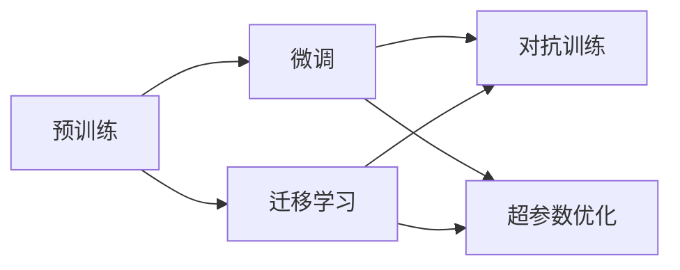

                 

# AI大模型创业：如何应对未来市场挑战？

## 1. 背景介绍

### 1.1 问题由来

近年来，随着人工智能技术的快速发展，AI大模型在众多领域的应用取得了显著成效。从语音识别、图像识别到自然语言处理，AI大模型已经展现出了强大的潜力。随着技术的不断进步，AI大模型正逐渐从学术界走向工业界，成为各大企业争相布局的重要方向。然而，AI大模型的开发和应用面临着诸多挑战，如数据隐私、模型可解释性、应用场景的拓展等。本文将深入探讨AI大模型创业过程中所面临的市场挑战，并提出一些应对策略，帮助企业在AI大模型创业道路上走得更远。

### 1.2 问题核心关键点

AI大模型创业的核心关键点主要包括以下几个方面：

1. **数据隐私保护**：如何在保证用户数据隐私的前提下，有效地利用用户数据进行模型训练。
2. **模型可解释性**：如何使AI大模型的决策过程变得透明，便于用户理解和信任。
3. **应用场景拓展**：如何将AI大模型应用到更多实际场景中，提升其商业价值。
4. **技术创新**：如何在模型架构、算法优化等方面进行创新，提升模型的性能和效率。
5. **市场竞争**：如何在激烈的市场竞争中，保持自身的竞争优势。

## 2. 核心概念与联系

### 2.1 核心概念概述

为了更好地理解AI大模型创业，首先需要明确一些核心概念：

- **AI大模型**：指通过大规模数据集进行预训练，具有强大的学习能力，能够处理各种复杂任务的深度学习模型。如BERT、GPT等。
- **预训练**：指在大规模无标签数据上训练模型，使其能够学习到通用的语言/视觉特征。
- **微调**：指在预训练模型的基础上，使用特定任务的数据集进行有监督学习，以适应该任务。
- **迁移学习**：指将一个领域学到的知识迁移到另一个领域，以提高模型在新领域的性能。
- **对抗训练**：指在训练过程中引入对抗样本，提高模型的鲁棒性。
- **超参数优化**：指通过调整模型的超参数（如学习率、批大小等），优化模型的性能。

这些概念之间存在紧密的联系。预训练模型通过大规模无标签数据学习到通用的特征，为微调提供了良好的基础。微调和迁移学习进一步提升了模型在特定任务上的表现，而对抗训练和超参数优化则进一步提升了模型的鲁棒性和性能。

### 2.2 核心概念原理和架构的 Mermaid 流程图



## 3. 核心算法原理 & 具体操作步骤

### 3.1 算法原理概述

AI大模型的创业过程中，核心算法原理主要涉及以下几个方面：

- **预训练模型选择**：根据任务需求选择合适的预训练模型，如BERT、GPT等。
- **数据集准备**：收集和准备特定任务的数据集，划分为训练集、验证集和测试集。
- **模型微调**：在预训练模型的基础上，使用特定任务的数据集进行微调，以适应该任务。
- **模型评估**：使用验证集和测试集评估模型的性能，不断调整模型参数以提高模型效果。

### 3.2 算法步骤详解

AI大模型创业的算法步骤主要包括以下几个方面：

1. **数据集准备**：收集和准备特定任务的数据集，划分为训练集、验证集和测试集。数据集的质量直接影响模型的训练效果，因此需要确保数据集的代表性、多样性和规模。

2. **模型选择**：根据任务需求选择合适的预训练模型。常用的预训练模型包括BERT、GPT等，可以根据任务的复杂程度选择不同的模型。

3. **模型微调**：在预训练模型的基础上，使用特定任务的数据集进行微调。微调过程中需要注意选择合适的学习率、批次大小等超参数，以避免过拟合和欠拟合。

4. **模型评估**：使用验证集和测试集评估模型的性能，包括准确率、召回率、F1值等指标。根据评估结果不断调整模型参数，以提高模型效果。

5. **模型部署**：将训练好的模型部署到实际应用场景中，进行线上测试和优化。

### 3.3 算法优缺点

AI大模型的创业过程中，算法优缺点主要体现在以下几个方面：

#### 优点：

- **性能提升**：通过微调，模型在特定任务上的性能可以得到显著提升。
- **泛化能力强**：预训练模型通过大规模数据学习到通用的特征，具有较强的泛化能力。
- **灵活性高**：可以根据具体任务需求进行模型微调，提高模型的适应性。

#### 缺点：

- **数据依赖**：微调过程需要大量的标注数据，标注成本较高。
- **资源消耗大**：预训练模型和微调过程需要大量的计算资源和存储空间。
- **模型复杂**：大模型结构复杂，调试和维护难度较大。

### 3.4 算法应用领域

AI大模型的创业过程中，算法应用领域主要包括以下几个方面：

- **自然语言处理**：包括文本分类、命名实体识别、情感分析等任务。
- **计算机视觉**：包括图像分类、目标检测、图像生成等任务。
- **语音识别**：包括语音转文字、语音合成等任务。
- **推荐系统**：包括商品推荐、内容推荐等任务。

## 4. 数学模型和公式 & 详细讲解 & 举例说明

### 4.1 数学模型构建

AI大模型的数学模型主要涉及以下几个方面：

- **损失函数**：用于衡量模型预测与真实标签之间的差异。常用的损失函数包括交叉熵损失、均方误差损失等。
- **优化器**：用于更新模型参数。常用的优化器包括SGD、Adam等。
- **超参数**：影响模型训练过程的参数，如学习率、批次大小、训练轮数等。

### 4.2 公式推导过程

以二分类任务为例，假设模型输出为 $y = M_{\theta}(x)$，其中 $M_{\theta}$ 为预训练模型，$\theta$ 为模型参数，$x$ 为输入数据，$y$ 为标签。常用的损失函数为交叉熵损失：

$$
L(y,\hat{y}) = -(y\log\hat{y} + (1-y)\log(1-\hat{y}))
$$

其中，$\hat{y}$ 为模型预测的概率值。在模型训练过程中，通过最小化损失函数来更新模型参数。常用的优化器为Adam：

$$
\theta \leftarrow \theta - \eta \frac{\partial L(y,\hat{y})}{\partial \theta}
$$

其中，$\eta$ 为学习率。超参数的调整需要通过实验进行，一般建议从小值开始逐步增大，以达到较好的训练效果。

### 4.3 案例分析与讲解

以情感分析任务为例，假设有一个情感分析数据集，包含若干条带有情感标签的文本数据。使用预训练模型BERT进行微调，步骤如下：

1. **数据预处理**：将文本数据转化为BERT模型所需的格式，如分词、编码等。
2. **模型微调**：在微调过程中，将文本数据作为输入，将情感标签作为输出，使用交叉熵损失函数进行训练。
3. **模型评估**：在测试集上评估模型的性能，如准确率、召回率等。
4. **模型部署**：将训练好的模型部署到实际应用场景中，进行线上测试和优化。

## 5. 项目实践：代码实例和详细解释说明

### 5.1 开发环境搭建

1. **环境配置**：安装Python、PyTorch、TensorFlow等深度学习框架，以及相关的预训练模型库。
2. **数据准备**：收集和准备特定任务的数据集，划分为训练集、验证集和测试集。
3. **模型训练**：使用预训练模型进行微调，优化模型参数。
4. **模型评估**：在测试集上评估模型的性能，调整超参数以优化模型。
5. **模型部署**：将训练好的模型部署到实际应用场景中，进行线上测试和优化。

### 5.2 源代码详细实现

以BERT模型进行情感分析任务为例，代码实现如下：

```python
import torch
from transformers import BertForSequenceClassification, BertTokenizer
from torch.utils.data import Dataset, DataLoader
from sklearn.metrics import accuracy_score

# 数据准备
class TextDataset(Dataset):
    def __init__(self, texts, labels):
        self.texts = texts
        self.labels = labels
        self.tokenizer = BertTokenizer.from_pretrained('bert-base-uncased')
        
    def __len__(self):
        return len(self.texts)
    
    def __getitem__(self, idx):
        text = self.texts[idx]
        label = self.labels[idx]
        encoding = self.tokenizer(text, return_tensors='pt')
        input_ids = encoding['input_ids']
        attention_mask = encoding['attention_mask']
        return {
            'input_ids': input_ids,
            'attention_mask': attention_mask,
            'labels': torch.tensor([label], dtype=torch.long)
        }

# 模型训练
class TextModel:
    def __init__(self, model, device):
        self.model = model
        self.device = device
        
    def train(self, dataset, batch_size, epochs, learning_rate):
        self.model.to(self.device)
        dataloader = DataLoader(dataset, batch_size=batch_size, shuffle=True)
        optimizer = torch.optim.Adam(self.model.parameters(), lr=learning_rate)
        for epoch in range(epochs):
            for batch in dataloader:
                input_ids = batch['input_ids'].to(self.device)
                attention_mask = batch['attention_mask'].to(self.device)
                labels = batch['labels'].to(self.device)
                optimizer.zero_grad()
                outputs = self.model(input_ids, attention_mask=attention_mask)
                loss = outputs.loss
                loss.backward()
                optimizer.step()
            print(f'Epoch {epoch+1}, loss: {loss.item()}')

# 模型评估
class TextModel:
    def __init__(self, model, device):
        self.model = model
        self.device = device
        
    def evaluate(self, dataset, batch_size, device):
        dataloader = DataLoader(dataset, batch_size=batch_size, shuffle=False)
        self.model.eval()
        preds = []
        labels = []
        with torch.no_grad():
            for batch in dataloader:
                input_ids = batch['input_ids'].to(self.device)
                attention_mask = batch['attention_mask'].to(self.device)
                labels = batch['labels'].to(self.device)
                outputs = self.model(input_ids, attention_mask=attention_mask)
                batch_preds = outputs.logits.argmax(dim=1).to('cpu').tolist()
                batch_labels = labels.to('cpu').tolist()
                preds.extend(batch_preds)
                labels.extend(batch_labels)
        return accuracy_score(labels, preds)

# 数据集和模型实例
dataset = TextDataset(texts, labels)
model = BertForSequenceClassification.from_pretrained('bert-base-uncased', num_labels=2)
model = TextModel(model, device)

# 模型训练
model.train(dataset, batch_size=16, epochs=5, learning_rate=2e-5)

# 模型评估
model.evaluate(dataset, batch_size=16, device='cpu')
```

### 5.3 代码解读与分析

代码实现中，我们首先定义了一个`TextDataset`类，用于准备数据集。然后定义了一个`TextModel`类，用于训练和评估模型。在训练过程中，我们使用Adam优化器进行参数更新，并在每个epoch结束时打印损失值。在评估过程中，我们使用sklearn的`accuracy_score`计算模型的准确率。

## 6. 实际应用场景

### 6.1 智能客服系统

智能客服系统是AI大模型应用的重要场景之一。通过微调，我们可以构建一个能够自然流畅地回答客户咨询的智能客服系统。具体实现如下：

1. **数据准备**：收集历史客服对话记录，提取问题和最佳答复。
2. **模型训练**：使用预训练模型进行微调，训练模型对问题和答复进行匹配。
3. **模型部署**：将训练好的模型部署到智能客服系统中，实时回答客户咨询。

### 6.2 金融舆情监测

金融舆情监测是AI大模型在金融领域的重要应用之一。通过微调，我们可以构建一个能够实时监测金融舆情的系统，帮助金融机构快速应对负面信息传播，规避金融风险。具体实现如下：

1. **数据准备**：收集金融领域相关的新闻、报道、评论等文本数据，并对其进行主题标注和情感标注。
2. **模型训练**：使用预训练模型进行微调，训练模型对文本进行主题分类和情感分析。
3. **模型部署**：将训练好的模型部署到金融舆情监测系统中，实时监测舆情变化趋势。

### 6.3 个性化推荐系统

个性化推荐系统是AI大模型的另一个重要应用场景。通过微调，我们可以构建一个能够根据用户兴趣和历史行为，推荐相关商品或内容的系统。具体实现如下：

1. **数据准备**：收集用户浏览、点击、评论、分享等行为数据，提取和用户交互的物品标题、描述、标签等文本内容。
2. **模型训练**：使用预训练模型进行微调，训练模型对用户兴趣进行匹配。
3. **模型部署**：将训练好的模型部署到个性化推荐系统中，为用户推荐相关商品或内容。

## 7. 工具和资源推荐

### 7.1 学习资源推荐

为了帮助开发者掌握AI大模型创业的技术，推荐以下学习资源：

1. **《深度学习》课程**：斯坦福大学深度学习课程，涵盖深度学习的基本概念和算法。
2. **《自然语言处理》课程**：斯坦福大学自然语言处理课程，涵盖自然语言处理的基本概念和算法。
3. **《Python深度学习》书籍**：由Francois Chollet著，介绍了使用Keras进行深度学习的实践。
4. **《TensorFlow官方文档》**：TensorFlow官方文档，提供丰富的API文档和教程。
5. **《PyTorch官方文档》**：PyTorch官方文档，提供丰富的API文档和教程。

### 7.2 开发工具推荐

为了提高AI大模型创业的开发效率，推荐以下开发工具：

1. **PyTorch**：基于Python的深度学习框架，提供灵活的计算图和丰富的预训练模型库。
2. **TensorFlow**：由Google开发的深度学习框架，提供灵活的计算图和丰富的预训练模型库。
3. **Jupyter Notebook**：用于编写和执行Python代码的交互式工具。
4. **GitHub**：代码托管和版本控制平台，方便开发者协作开发。

### 7.3 相关论文推荐

为了深入了解AI大模型创业的技术，推荐以下相关论文：

1. **《BERT: Pre-training of Deep Bidirectional Transformers for Language Understanding》**：BERT模型的相关论文，介绍了BERT模型的结构和训练方法。
2. **《Attention is All You Need》**：Transformer模型的相关论文，介绍了Transformer模型的结构和训练方法。
3. **《Adaptive Low-Rank Adaptation for Parameter-Efficient Fine-Tuning》**：参数高效微调的论文，介绍了适配器（Adapter）等参数高效微调方法。
4. **《Language Models are Unsupervised Multitask Learners》**：GPT-2模型的相关论文，介绍了GPT-2模型的结构和训练方法。

## 8. 总结：未来发展趋势与挑战

### 8.1 研究成果总结

AI大模型创业已经取得了显著的进展，主要体现在以下几个方面：

- **预训练模型的发展**：预训练模型的参数规模和性能得到了显著提升，如BERT、GPT等模型。
- **微调技术的应用**：微调技术在NLP、计算机视觉等领域得到了广泛应用，提升了模型的性能和效率。
- **模型可解释性的研究**：模型可解释性的研究逐渐深入，有助于提升用户对模型的信任。

### 8.2 未来发展趋势

未来，AI大模型创业将继续保持以下发展趋势：

1. **模型规模持续增大**：预训练模型的参数规模将继续增大，模型性能和泛化能力将进一步提升。
2. **多模态任务的扩展**：AI大模型将逐渐扩展到图像、语音等多模态任务，提升模型的应用范围。
3. **模型的通用性提升**：AI大模型将在更多领域得到应用，提升模型的通用性和普适性。
4. **模型的可解释性增强**：模型可解释性的研究将进一步深入，提升用户对模型的理解和信任。

### 8.3 面临的挑战

AI大模型创业在发展过程中，面临以下挑战：

1. **数据隐私问题**：如何在保护用户隐私的前提下，利用用户数据进行模型训练。
2. **模型可解释性问题**：如何使模型的决策过程透明，便于用户理解和信任。
3. **应用场景的拓展**：如何将AI大模型应用到更多实际场景中，提升其商业价值。
4. **技术创新的难度**：如何在模型架构、算法优化等方面进行创新，提升模型的性能和效率。

### 8.4 研究展望

为了应对这些挑战，未来的研究需要在以下几个方面进行突破：

1. **数据隐私保护技术**：开发数据隐私保护技术，如差分隐私、联邦学习等，保护用户数据隐私。
2. **模型可解释性方法**：开发模型可解释性方法，如LIME、SHAP等，提升用户对模型的理解和信任。
3. **多模态任务的研究**：研究多模态任务的模型构建和训练方法，提升模型的应用范围。
4. **技术创新的突破**：在模型架构、算法优化等方面进行创新，提升模型的性能和效率。

## 9. 附录：常见问题与解答

**Q1: 如何选择合适的预训练模型？**

A: 根据任务需求选择合适的预训练模型。如自然语言处理任务可以选择BERT、GPT等模型，计算机视觉任务可以选择ResNet、Inception等模型。

**Q2: 如何优化模型的超参数？**

A: 通过实验确定合适的超参数。一般建议从较小的超参数值开始，逐步增大超参数，观察模型性能的变化。

**Q3: 如何提高模型的泛化能力？**

A: 增加训练数据的多样性，使用数据增强技术，如回译、近义替换等。

**Q4: 如何保护用户数据隐私？**

A: 使用差分隐私、联邦学习等技术，保护用户数据隐私。

**Q5: 如何提高模型的可解释性？**

A: 使用LIME、SHAP等技术，提高模型的可解释性。

---

作者：禅与计算机程序设计艺术 / Zen and the Art of Computer Programming

