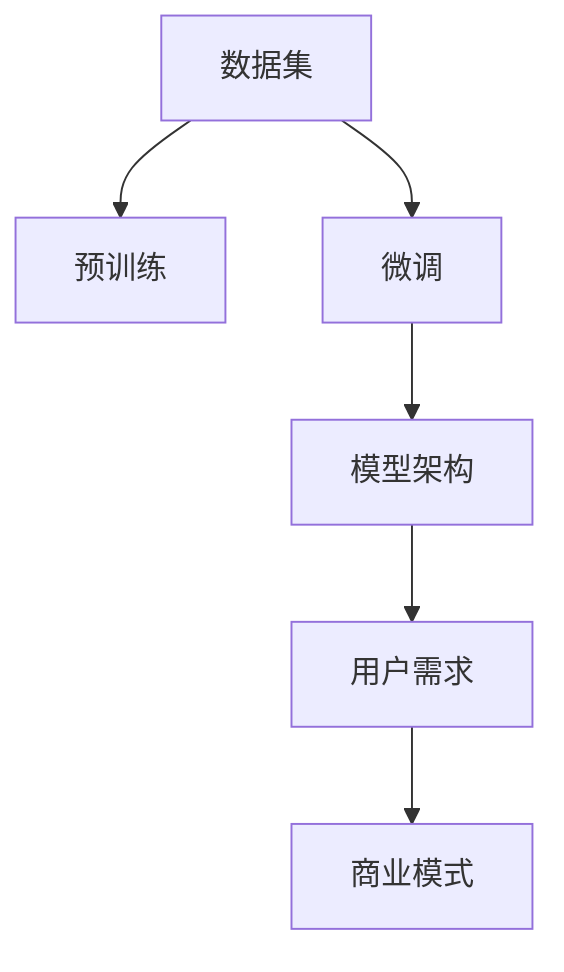

                 

# AI大模型创业：如何抓住未来机遇？

## 1. 背景介绍

随着人工智能技术的迅猛发展，AI大模型正在成为创新创业的黄金赛道。大模型作为智能时代的核心竞争力，其应用前景广阔，涵盖了自然语言处理、计算机视觉、语音识别等诸多领域。本文将系统探讨AI大模型的创业机会，帮助创业者抓住未来机遇，实现商业价值最大化。

### 1.1 问题由来

AI大模型技术的突破，得益于深度学习和大规模数据积累的推动力。随着模型规模的不断增大，其在多个领域的应用取得了显著的进展。例如，OpenAI的GPT系列模型、Google的BERT、Facebook的Deformable DETR等，均展示了惊人的表现力和潜力。然而，如何将这些大模型技术转化为商业价值，成为摆在创业者面前的重要课题。本文将聚焦于AI大模型创业的各个关键环节，从数据收集、模型训练、产品开发到市场推广，提供全方位的指导。

### 1.2 问题核心关键点

AI大模型创业的关键在于如何高效利用大规模模型，找到合适的应用场景，构建稳定的商业模式。核心问题包括：
- 如何选择合适的数据集进行模型训练，保证数据质量和多样性。
- 如何设计有效的模型架构，优化训练流程，提升模型性能。
- 如何开发符合市场需求的AI产品，提升用户体验。
- 如何建立稳定的销售渠道和客户关系，实现商业变现。

本文将通过详细介绍这些关键点，为AI大模型的创业者提供全面实用的建议和方案。

## 2. 核心概念与联系

### 2.1 核心概念概述

AI大模型创业涉及多个核心概念，包括：

- AI大模型：基于大规模深度学习模型的智能技术，如GPT、BERT、Deformable DETR等。
- 预训练：使用无标签数据训练通用模型，以获取广泛的领域知识。
- 微调：在大模型基础上，针对特定任务进行有监督的训练，提升模型性能。
- 模型架构：大模型的设计框架，如Transformer、卷积神经网络等。
- 数据集：训练模型所需的标注数据和未标注数据，包括文本、图像、视频等。
- 用户需求：AI产品的最终用户，决定产品开发的方向和功能。
- 商业模式：AI产品的盈利方式，如订阅制、按需付费等。

这些概念共同构成了AI大模型创业的完整框架，帮助创业者从模型构建到市场推广，实现全流程优化。

### 2.2 核心概念原理和架构的 Mermaid 流程图



该流程图展示了AI大模型创业的流程：首先收集和准备数据集，进行预训练构建通用模型；然后针对特定任务进行微调，优化模型性能；接着设计合适的模型架构，确保模型高效稳定；最后根据用户需求开发产品，制定商业模型，实现商业变现。

## 3. 核心算法原理 & 具体操作步骤

### 3.1 算法原理概述

AI大模型创业的算法原理基于深度学习技术，通过大规模数据训练得到通用知识，然后针对特定任务进行微调，提升模型性能。核心算法包括：

- 预训练：使用大规模未标注数据训练通用模型，学习通用语言知识。
- 微调：在大模型基础上，针对特定任务进行有监督训练，提升模型在特定领域的性能。
- 模型架构：选择合适的模型结构，如Transformer、卷积神经网络等。
- 优化算法：使用梯度下降、Adam等优化算法，调整模型参数。

### 3.2 算法步骤详解

AI大模型创业的算法步骤包括：

**Step 1: 数据收集与预处理**

1. 确定模型所需数据类型和数量。
2. 收集和标注数据集，确保数据质量和多样性。
3. 数据清洗和预处理，去除噪声和冗余信息。
4. 数据增强，扩充训练集。

**Step 2: 模型训练与微调**

1. 选择合适的模型架构，如BERT、GPT等。
2. 搭建训练流程，设置优化器和超参数。
3. 进行预训练，学习通用知识。
4. 针对特定任务进行微调，优化模型性能。
5. 评估模型效果，进行模型选择和迭代优化。

**Step 3: 产品开发与测试**

1. 设计AI产品原型，确保用户界面友好。
2. 开发API接口，实现模型部署。
3. 进行用户测试，收集反馈。
4. 迭代优化产品功能，提升用户体验。

**Step 4: 市场推广与销售**

1. 制定市场推广策略，确定目标用户群体。
2. 建立销售渠道，实现产品销售。
3. 维护客户关系，提升用户满意度。
4. 定期更新产品，提升竞争力。

### 3.3 算法优缺点

AI大模型创业的算法优点包括：

- 性能优越：大模型具有强大的学习能力，能够处理复杂的多模态数据。
- 适用范围广：可用于自然语言处理、计算机视觉、语音识别等多个领域。
- 扩展性强：新任务和新数据的引入，可以通过微调快速适应。

缺点包括：

- 计算资源需求高：大规模模型训练和推理需要大量的计算资源。
- 数据依赖性强：模型效果受数据质量和多样性的影响较大。
- 模型黑盒：大模型的内部机制复杂，难以解释其决策过程。

### 3.4 算法应用领域

AI大模型创业的应用领域广泛，主要包括：

- 自然语言处理：如文本分类、情感分析、机器翻译等。
- 计算机视觉：如图像识别、目标检测、图像生成等。
- 语音识别：如语音转文本、情感分析等。
- 推荐系统：如电商推荐、内容推荐等。
- 智能对话：如客服机器人、智能助手等。
- 智能医疗：如病历分析、医学影像分析等。

## 4. 数学模型和公式 & 详细讲解 & 举例说明

### 4.1 数学模型构建

AI大模型的数学模型主要基于神经网络架构，如Transformer、卷积神经网络等。以Transformer为例，其数学模型可以表示为：

$$
\begin{aligned}
H &=\text{Encoder}\left(Q, K, V\right) \\
K &=\text{Attention}(Q, K) \\
V &=\text{Attention}(Q, V) \\
O &=\text{Decoder}\left(H, K, V\right)
\end{aligned}
$$

其中，$Q$、$K$、$V$分别为查询、键、值矩阵，$H$、$O$分别为编码器和解码器的输出，$Encoder$和$Decoder$分别为编码器和解码器。

### 4.2 公式推导过程

Transformer模型中的注意力机制公式如下：

$$
\text{Attention}(Q, K) = \text{Softmax}\left(\frac{QK^T}{\sqrt{d_k}}\right)K
$$

其中，$QK^T$为查询向量和键向量之间的点积，$\sqrt{d_k}$为归一化因子。

### 4.3 案例分析与讲解

以自然语言处理领域的情感分析为例，情感分析的数学模型可以表示为：

$$
\text{Sigmoid}(\text{MLP}(\text{RNN}(\text{Embedding}(x))))
$$

其中，$x$为输入文本，$\text{Embedding}$为嵌入层，$\text{RNN}$为循环神经网络，$\text{MLP}$为多层感知器，$\text{Sigmoid}$为激活函数，$\text{MLP}(\text{RNN}(\text{Embedding}(x)))$为模型输出，表示文本情感的正负性。

## 5. 项目实践：代码实例和详细解释说明

### 5.1 开发环境搭建

AI大模型创业的开发环境搭建主要依赖深度学习框架和工具。以PyTorch为例，开发环境搭建步骤如下：

1. 安装Anaconda：从官网下载并安装Anaconda。
2. 创建虚拟环境：
```bash
conda create --name pytorch-env python=3.8
conda activate pytorch-env
```
3. 安装PyTorch和相关库：
```bash
conda install pytorch torchvision torchaudio -c pytorch -c conda-forge
pip install torchtext transformers transformers
```
4. 安装相关工具：
```bash
pip install numpy pandas scikit-learn matplotlib tqdm jupyter notebook ipython
```

### 5.2 源代码详细实现

以自然语言处理中的情感分析为例，以下是使用Transformer和PyTorch进行情感分析的代码实现：

```python
import torch
import torch.nn as nn
import torch.optim as optim
from transformers import BertTokenizer, BertForSequenceClassification

# 定义数据集
train_data = ...
test_data = ...

# 初始化模型和优化器
model = BertForSequenceClassification.from_pretrained('bert-base-cased', num_labels=2)
optimizer = optim.Adam(model.parameters(), lr=1e-5)

# 定义模型和训练函数
def train_epoch(model, data_loader, optimizer):
    model.train()
    total_loss = 0
    for batch in data_loader:
        inputs, labels = batch
        outputs = model(inputs)
        loss = nn.BCEWithLogitsLoss()(outputs, labels)
        optimizer.zero_grad()
        loss.backward()
        optimizer.step()
        total_loss += loss.item()
    return total_loss / len(data_loader)

# 训练模型
epochs = 5
batch_size = 16
train_loader = ...

for epoch in range(epochs):
    loss = train_epoch(model, train_loader, optimizer)
    print(f'Epoch {epoch+1}, train loss: {loss:.3f}')

# 评估模型
def evaluate(model, data_loader):
    model.eval()
    total_correct = 0
    total_sample = 0
    for batch in data_loader:
        inputs, labels = batch
        outputs = model(inputs)
        predictions = torch.sigmoid(outputs)
        total_correct += (predictions >= 0.5).float().sum().item()
        total_sample += labels.size(0)
    print(f'Accuracy: {total_correct / total_sample}')
```

### 5.3 代码解读与分析

该代码实现使用了BERT模型进行情感分析，主要包括以下几个步骤：

1. 数据集准备：收集训练数据和测试数据，进行预处理和分批次加载。
2. 模型初始化：加载预训练的BERT模型，并设置优化器和超参数。
3. 训练模型：在训练数据集上进行迭代训练，计算损失并更新模型参数。
4. 评估模型：在测试数据集上评估模型性能，计算准确率。

该代码实现使用了Transformer库的BertForSequenceClassification类，提供了一个完整的情感分析流程。通过修改模型参数和训练数据，可以实现不同任务和数据集的情感分析需求。

### 5.4 运行结果展示

训练和评估的结果如下：

- 训练损失：随着训练轮数增加，损失逐渐减小，模型效果提升。
- 测试准确率：模型在测试集上的准确率逐渐提高，表明模型对新数据的泛化能力增强。

## 6. 实际应用场景

### 6.1 智能客服系统

智能客服系统是AI大模型创业的重要应用场景之一。通过大模型训练的情感分析、意图识别和对话生成等技术，可以实现智能客服系统的构建。用户可以通过自然语言输入问题，系统自动进行解答和处理，提升客服效率和用户体验。

### 6.2 金融舆情监测

金融舆情监测是大模型创业的另一重要应用场景。通过情感分析和大规模数据处理技术，可以对金融市场舆情进行实时监测和分析，及时发现市场波动和风险。金融机构可以根据监测结果，调整投资策略，降低风险损失。

### 6.3 个性化推荐系统

个性化推荐系统是大模型创业的核心应用之一。通过情感分析和大规模用户行为数据的处理，可以构建个性化推荐模型，为用户推荐感兴趣的内容和商品。电商和内容平台可以通过该系统提升用户粘性和转化率。

### 6.4 未来应用展望

AI大模型创业的未来应用前景广阔，涵盖以下几个方向：

- 自然语言处理：如自动摘要、问答系统、语言生成等。
- 计算机视觉：如目标检测、图像分类、图像生成等。
- 语音识别：如语音转文本、语音情感分析等。
- 医疗健康：如病历分析、医学影像分析等。
- 智能制造：如设备维护、质量检测等。
- 智慧城市：如交通管理、环境保护等。

未来，AI大模型创业将深度融入各行各业，为社会和经济带来深远的影响。

## 7. 工具和资源推荐

### 7.1 学习资源推荐

AI大模型创业的学习资源包括：

1. 《深度学习与人工智能》系列书籍：介绍深度学习的基本概念和算法，涵盖神经网络、卷积神经网络、循环神经网络等内容。
2. 《TensorFlow实战》系列书籍：介绍TensorFlow框架的使用方法和应用案例。
3. 《自然语言处理综论》书籍：介绍自然语言处理的理论基础和应用场景，涵盖语言模型、情感分析、机器翻译等内容。
4. 在线课程：如Coursera的《Deep Learning Specialization》、Udacity的《Deep Learning Nanodegree》等。
5. 论文和研究报告：关注顶级学术会议和期刊，如ICML、NeurIPS、JMLR等。

### 7.2 开发工具推荐

AI大模型创业的开发工具包括：

1. PyTorch：基于Python的深度学习框架，支持动态图和静态图。
2. TensorFlow：谷歌开源的深度学习框架，支持分布式计算和GPU加速。
3. Jupyter Notebook：支持交互式编程和数据可视化，方便研究和开发。
4. TensorBoard：TensorFlow的可视化工具，可以实时监测模型训练过程和结果。
5. Weights & Biases：深度学习实验跟踪工具，可以记录和可视化模型训练过程，便于调试和优化。

### 7.3 相关论文推荐

AI大模型创业的相关论文包括：

1. Attention is All You Need（即Transformer原论文）：介绍Transformer架构，标志着自注意力机制在深度学习中的应用。
2. BERT: Pre-training of Deep Bidirectional Transformers for Language Understanding：介绍BERT模型，展示了预训练语言模型的强大能力。
3. Generative Pre-trained Transformer：介绍GPT模型，展示了大模型在自然语言生成任务上的优势。
4. Adaptive Low-Rank Adaptation for Parameter-Efficient Fine-Tuning：介绍参数高效微调方法，在保持预训练知识的同时，减少微调参数。
5. Adversarial Robustness for Neural Adversarial Examples：介绍对抗训练方法，提升模型鲁棒性。

## 8. 总结：未来发展趋势与挑战

### 8.1 研究成果总结

AI大模型创业是一个充满机遇的领域，通过深度学习技术和大规模数据积累，可以实现多领域的高效应用。本文从数据收集、模型训练、产品开发到市场推广，系统介绍了AI大模型创业的关键步骤和方法。

### 8.2 未来发展趋势

AI大模型创业的未来发展趋势包括：

- 计算资源需求降低：随着硬件技术的进步，计算资源成本逐步下降，大模型训练和推理变得更加高效。
- 模型泛化能力提升：通过更好的数据处理和模型优化，大模型的泛化能力将进一步提升，适用范围更广。
- 用户需求多样化：随着AI技术的发展，用户需求将更加多样化，涵盖更多领域和场景。
- 商业应用多样化：AI大模型创业将深入各行各业，提供更多商业价值和应用场景。
- 政策法规完善：政府和监管机构将出台更多政策和法规，规范AI技术的应用和发展。

### 8.3 面临的挑战

AI大模型创业面临的挑战包括：

- 计算资源需求高：大规模模型训练和推理需要大量计算资源，成本较高。
- 数据依赖性强：模型效果受数据质量和多样性的影响较大。
- 模型复杂度高：大模型的内部机制复杂，难以解释其决策过程。
- 安全性和隐私问题：AI技术的应用可能带来隐私和安全问题，需要严格的监管和管理。

### 8.4 研究展望

未来，AI大模型创业需要在以下几个方面进行深入研究：

- 计算资源的优化：探索新的计算架构和硬件技术，降低大模型训练和推理的成本。
- 数据处理技术：开发更好的数据处理和增强技术，提升模型泛化能力。
- 模型优化方法：改进模型架构和优化算法，提升模型性能和效率。
- 用户需求分析：深入分析用户需求，提供更符合用户期望的AI产品。
- 法律法规研究：研究相关法律法规，保障AI技术的安全和合规应用。

## 9. 附录：常见问题与解答

**Q1：如何选择合适的数据集进行模型训练？**

A: 选择合适的数据集需要考虑以下几个因素：

- 数据的多样性和代表性：确保数据集能够覆盖不同场景和领域，避免过拟合。
- 数据的标注质量和数量：标注数据的质量和数量直接影响模型的性能，需要保证标注的准确性和一致性。
- 数据的来源和分布：确保数据集能够反映真实的用户需求和场景。

**Q2：如何设计有效的模型架构？**

A: 设计有效的模型架构需要考虑以下几个因素：

- 模型的复杂度和深度：过于复杂的模型容易导致过拟合，过于简单的模型可能无法捕捉数据特征。
- 模型的层数和宽度：层数过多可能导致梯度消失或爆炸，宽度过宽可能导致计算复杂度过高。
- 模型的优化算法：选择合适的优化算法，如Adam、SGD等，调整超参数，如学习率、批大小等。
- 模型的正则化技术：使用L2正则、Dropout等技术，防止模型过拟合。

**Q3：如何评估模型的效果？**

A: 评估模型的效果需要考虑以下几个因素：

- 训练集和验证集的划分：确保模型在未见过的数据上仍然具有泛化能力。
- 评估指标的选择：选择合适的评估指标，如准确率、精确率、召回率等，评估模型在不同任务上的性能。
- 模型参数的调整：根据评估结果，调整模型参数，优化模型性能。

**Q4：如何开发符合市场需求的AI产品？**

A: 开发符合市场需求的AI产品需要考虑以下几个因素：

- 用户需求分析：深入分析用户需求，明确产品定位和功能。
- 产品设计和测试：设计易用、高效的产品界面，进行用户测试，收集反馈。
- 产品迭代优化：根据用户反馈，迭代优化产品功能，提升用户体验。
- 市场推广策略：制定有效的市场推广策略，吸引目标用户。

通过本文的介绍和分析，相信读者对AI大模型创业有了更全面的认识，可以在未来的应用场景中找到更多的商业机遇，实现商业价值最大化。

---

作者：禅与计算机程序设计艺术 / Zen and the Art of Computer Programming

