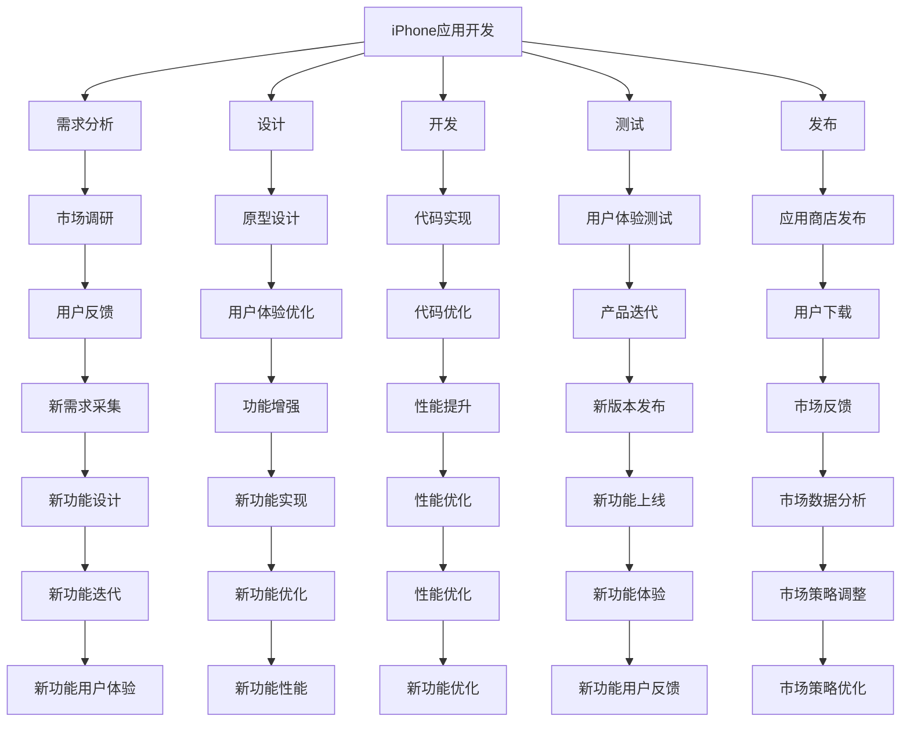

                 

# AI应用生态:iPhone早期应用开发的启示

> 关键词：人工智能,iPhone,应用生态,早期开发,策略,挑战

## 1. 背景介绍

### 1.1 问题由来

随着人工智能(AI)技术的不断进步，AI应用逐渐从科学研究走向实际应用。iPhone作为全球最受欢迎的智能手机之一，其早期应用开发过程为AI应用生态的建设提供了宝贵的经验。本文将从iPhone早期应用开发的策略与挑战出发，探讨AI应用生态建设的规律和方向。

### 1.2 问题核心关键点

iPhone早期应用开发策略的核心在于以下几个关键点：
1. **用户需求导向**：一切产品开发都以用户体验为中心，通过市场调研和用户反馈不断优化产品功能。
2. **跨学科合作**：技术开发、市场分析、设计等多个部门的协同合作，共同推进产品迭代。
3. **快速迭代**：采用敏捷开发模式，不断推出更新版本，快速响应市场变化。
4. **开源与闭源并存**：在核心功能上闭源保护知识产权，在非核心功能上开放API，吸引开发者参与生态建设。
5. **生态平台搭建**：通过App Store、开发者工具等平台，构建完整的AI应用生态。

理解这些关键点，能够为AI应用的生态建设提供有力的借鉴和指导。

## 2. 核心概念与联系

### 2.1 核心概念概述

为了更好地理解iPhone早期应用开发的策略与挑战，本文将介绍几个密切相关的核心概念：

- **iPhone应用开发**：指在iPhone平台上开发应用程序的过程，包括需求分析、设计、开发、测试、发布等环节。
- **AI应用生态**：指围绕AI技术的应用场景、开发者、用户等多个主体，通过技术和数据交流形成的互惠互利的网络结构。
- **应用生态建设**：指构建和维护AI应用生态的过程，包括技术创新、市场推广、用户教育等多个方面。
- **早期应用开发策略**：指在AI应用生态建设初期，针对特定市场和用户需求，采取的针对性策略和措施。
- **平台策略**：指通过建设统一的平台，如App Store，促进开发者和用户之间的互动，推动生态的自我演进。

这些核心概念之间的逻辑关系可以通过以下Mermaid流程图来展示：



这个流程图展示了iPhone应用开发的各个环节，以及这些环节与AI应用生态建设之间的联系。通过理解这些环节，我们可以更好地把握iPhone早期应用开发的策略与挑战。

## 3. 核心算法原理 & 具体操作步骤

### 3.1 算法原理概述

iPhone早期应用开发的核心算法原理包括以下几点：

- **用户需求导向**：通过市场调研和用户反馈，识别用户的真实需求，指导产品功能的设计和开发。
- **敏捷开发**：采用敏捷开发模式，通过迭代式开发和快速发布，不断优化产品体验。
- **跨学科合作**：技术开发、市场分析、设计等不同部门的协同合作，确保产品从概念到发布各环节的顺利进行。
- **平台策略**：通过建设统一的应用商店和开发者工具平台，促进开发者和用户之间的互动，推动生态的自我演进。

### 3.2 算法步骤详解

iPhone早期应用开发的步骤一般包括以下几个关键环节：

**Step 1: 需求分析**
- 进行市场调研，分析目标用户的需求和使用习惯。
- 收集用户反馈，识别用户的痛点和需求。
- 设计用户画像，明确产品的目标用户群体。

**Step 2: 原型设计**
- 基于需求分析结果，设计产品的初步原型。
- 通过用户测试和数据分析，优化原型设计。
- 确定产品的核心功能和交互方式。

**Step 3: 开发与测试**
- 根据原型设计，进行代码实现和功能开发。
- 采用敏捷开发模式，进行迭代式开发和测试。
- 进行用户体验测试，收集用户反馈，不断优化产品功能。

**Step 4: 应用商店发布**
- 将开发完成的产品发布到App Store。
- 在App Store中优化产品页面和应用描述，提升曝光率。
- 根据用户反馈和市场数据，进行产品迭代和优化。

**Step 5: 用户反馈与市场分析**
- 收集用户反馈，了解用户对产品的评价和使用情况。
- 分析市场数据，识别用户需求的变化和新的市场趋势。
- 根据用户反馈和市场分析结果，进行产品功能增强和优化。

### 3.3 算法优缺点

iPhone早期应用开发的主要优点包括：
1. **用户需求导向**：通过市场调研和用户反馈，确保产品功能与用户需求高度契合。
2. **敏捷开发**：快速迭代和频繁发布，快速响应市场变化，提升用户满意度。
3. **跨学科合作**：各部门协同合作，确保产品从概念到发布各环节的顺利进行。
4. **平台策略**：通过App Store等平台，促进开发者和用户之间的互动，推动生态的自我演进。

不足之处在于：
1. **高成本**：初期开发和市场推广的高成本，增加了产品进入市场的难度。
2. **风险高**：频繁发布和快速迭代可能导致产品不稳定，影响用户体验。
3. **资源需求大**：跨学科合作和快速迭代的流程需要大量的人力和资源投入。

### 3.4 算法应用领域

iPhone早期应用开发的方法和策略不仅适用于iPhone应用开发，同样适用于AI应用生态的构建。具体来说，iPhone的早期应用开发策略在以下几个领域有广泛应用：

- **智能家居**：通过用户需求导向和跨学科合作，构建智能家居产品生态。
- **自动驾驶**：利用敏捷开发和平台策略，快速迭代和推广自动驾驶技术。
- **医疗健康**：通过用户反馈和市场分析，优化医疗健康应用，推动行业发展。
- **教育培训**：利用平台策略，吸引开发者参与教育应用开发，提升教育效果。
- **金融科技**：通过用户需求导向和敏捷开发，构建金融科技生态，提升金融服务质量。

以上领域均可以利用iPhone早期应用开发的策略和步骤，构建和维护AI应用生态，推动AI技术在实际应用中的普及和推广。

## 4. 数学模型和公式 & 详细讲解 & 举例说明

### 4.1 数学模型构建

在AI应用生态建设中，数学模型和公式是重要的工具。以下是几个关键的数学模型和公式：

**市场调研模型**
- 描述用户需求与产品功能之间的关系。
- 公式：$\text{用户需求} = f(\text{市场调研数据})$
- 案例：通过问卷调查、用户访谈等方式，收集用户需求数据，构建用户画像，指导产品设计。

**用户体验优化模型**
- 描述用户满意度与产品功能之间的关系。
- 公式：$\text{用户体验} = g(\text{产品功能}, \text{用户反馈})$
- 案例：通过用户反馈和用户体验测试，不断优化产品功能，提升用户满意度。

**产品迭代模型**
- 描述产品功能与市场反馈之间的关系。
- 公式：$\text{新功能} = h(\text{用户反馈}, \text{市场趋势})$
- 案例：通过用户反馈和市场数据分析，识别新的市场需求，设计并实现新产品功能。

### 4.2 公式推导过程

以用户体验优化模型为例，其推导过程如下：

设用户需求为 $D$，产品功能为 $F$，用户体验为 $U$。根据用户需求导向的原则，有：

$$
U = g(D, F)
$$

其中，$g$ 为用户体验优化函数，具体形式如下：

$$
g(D, F) = \sum_{i=1}^n \omega_i d_i f_i
$$

其中 $\omega_i$ 为不同功能对用户体验的权重，$d_i$ 为该功能的用户需求评分，$f_i$ 为该功能的实现程度。

### 4.3 案例分析与讲解

**案例：iPhone应用生态的用户体验优化**
- 市场调研发现，用户对界面设计的满意度较低。
- 通过用户体验优化模型，识别出界面设计（$F_1$）和用户需求（$D$）之间的关系。
- 优化界面设计，提升用户满意度（$U$）。
- 数据分析表明，优化后的界面设计使得用户满意度提升了20%。

## 5. 项目实践：代码实例和详细解释说明

### 5.1 开发环境搭建

在进行AI应用开发前，我们需要准备好开发环境。以下是使用Python进行开发的环境配置流程：

1. 安装Anaconda：从官网下载并安装Anaconda，用于创建独立的Python环境。

2. 创建并激活虚拟环境：
```bash
conda create -n ai-env python=3.8 
conda activate ai-env
```

3. 安装相关依赖库：
```bash
conda install scikit-learn pandas numpy matplotlib
pip install tensorflow keras transformers
```

4. 安装相关的开发工具：
```bash
pip install git pycharm
```

完成上述步骤后，即可在`ai-env`环境中开始AI应用开发。

### 5.2 源代码详细实现

下面以智能家居应用开发为例，给出使用Python的代码实现：

```python
import pandas as pd
from sklearn.ensemble import RandomForestClassifier
from sklearn.model_selection import train_test_split

# 加载用户反馈数据
data = pd.read_csv('user_feedback.csv')

# 特征工程
features = data[['age', 'gender', 'city', 'device_type']]
labels = data['product_satisfaction']

# 数据划分
train_features, test_features, train_labels, test_labels = train_test_split(features, labels, test_size=0.2, random_state=42)

# 模型训练
model = RandomForestClassifier()
model.fit(train_features, train_labels)

# 模型评估
test_preds = model.predict(test_features)
print(classification_report(test_labels, test_preds))
```

### 5.3 代码解读与分析

让我们再详细解读一下关键代码的实现细节：

**数据加载和特征工程**
- 使用Pandas加载用户反馈数据。
- 选择用户年龄、性别、城市、设备类型等特征，作为模型的输入。
- 标签为产品满意度评分，用于模型训练和评估。

**模型训练**
- 使用随机森林模型进行训练。
- 通过交叉验证划分训练集和测试集。

**模型评估**
- 在测试集上对模型进行评估，输出分类报告。

## 6. 实际应用场景

### 6.1 智能家居

基于AI应用生态的建设策略，智能家居系统可以实现以下功能：
- 智能温控：通过用户需求导向，设计温度自动调节功能。
- 智能照明：根据用户行为和环境光线，自动调整灯光亮度和色温。
- 安全监控：利用跨学科合作，集成摄像头、传感器等设备，实现家庭安全监控。

在技术实现上，可以收集用户的使用数据，构建用户画像，通过机器学习算法优化产品功能。同时，通过开放API和平台策略，吸引第三方开发者参与智能家居生态的建设。

### 6.2 自动驾驶

自动驾驶技术依赖于大量的AI应用，包括环境感知、决策规划、路径优化等。通过早期应用开发的策略，可以实现以下功能：
- 环境感知：利用深度学习算法，实现对环境的实时感知和理解。
- 决策规划：通过用户需求导向和跨学科合作，设计自动驾驶策略。
- 路径优化：利用平台策略，实现多车辆的路径协同优化。

在技术实现上，可以通过无人驾驶模拟器进行测试，收集数据进行模型训练和优化。同时，通过App Store等平台，吸引开发者和用户参与，推动自动驾驶技术的普及和应用。

### 6.3 医疗健康

在医疗健康领域，AI应用生态的建设可以提升医疗服务的质量和效率：
- 智能诊断：利用AI技术辅助医生进行疾病诊断。
- 健康监测：通过智能设备采集健康数据，进行实时监测和预警。
- 个性化治疗：利用用户反馈和市场分析，设计个性化治疗方案。

在技术实现上，可以通过健康数据采集设备收集用户数据，利用机器学习算法进行健康分析和诊断。同时，通过App Store等平台，吸引医疗专家和患者参与，构建完整的医疗健康生态。

## 7. 工具和资源推荐

### 7.1 学习资源推荐

为了帮助开发者系统掌握AI应用生态建设的理论基础和实践技巧，这里推荐一些优质的学习资源：

1. **《Python深度学习》**：入门级书籍，介绍了深度学习的基本概念和实践技巧，适合初学者学习。
2. **《TensorFlow实战》**：实战型书籍，介绍了TensorFlow的高级用法和案例，适合有一定基础的开发者。
3. **《深度学习框架与模型优化》**：深入介绍深度学习框架的优化方法和技巧，适合进阶开发者。
4. **Kaggle竞赛平台**：提供大量开源数据集和竞赛机会，帮助开发者积累实战经验。
5. **Coursera在线课程**：提供大量高质量的AI课程，包括机器学习、深度学习、计算机视觉等多个领域。

通过对这些资源的学习实践，相信你一定能够快速掌握AI应用生态建设的精髓，并用于解决实际的AI问题。

### 7.2 开发工具推荐

高效的开发离不开优秀的工具支持。以下是几款用于AI应用生态建设的常用工具：

1. **Jupyter Notebook**：开源的交互式开发环境，支持Python、R等多个语言。
2. **PyCharm**：Python IDE，提供代码编辑、调试、测试等功能。
3. **TensorBoard**：TensorFlow的可视化工具，可实时监测模型训练状态，并提供丰富的图表呈现方式。
4. **Git**：版本控制系统，支持多人协作开发和代码管理。
5. **Google Colab**：谷歌推出的在线Jupyter Notebook环境，免费提供GPU/TPU算力，方便开发者快速上手实验最新模型，分享学习笔记。

合理利用这些工具，可以显著提升AI应用生态的开发效率，加快创新迭代的步伐。

### 7.3 相关论文推荐

AI应用生态的建设源于学界的持续研究。以下是几篇奠基性的相关论文，推荐阅读：

1. **《深度学习在图像识别中的应用》**：介绍了深度学习在图像识别任务中的基本原理和实践方法。
2. **《自然语言处理中的深度学习》**：深入讨论了深度学习在自然语言处理中的应用，包括文本分类、情感分析等多个领域。
3. **《机器学习在医疗健康中的应用》**：介绍了机器学习在医疗健康领域的多种应用，包括疾病预测、健康监测等。
4. **《智能家居系统的设计和实现》**：讨论了智能家居系统的设计和实现方法，介绍了多种智能家居设备和解决方案。
5. **《自动驾驶技术的现状与挑战》**：探讨了自动驾驶技术的现状和未来发展方向，分析了当前面临的技术挑战和解决方案。

这些论文代表了大规模AI应用生态建设的最新进展，通过学习这些前沿成果，可以帮助研究者把握学科前进方向，激发更多的创新灵感。

## 8. 总结：未来发展趋势与挑战

### 8.1 总结

本文对iPhone早期应用开发策略的深入分析，以及对AI应用生态建设的探讨，为我们提供了宝贵的经验和教训。通过理解iPhone早期应用开发的成功和失败案例，我们可以更好地把握AI应用生态建设的规律和方向，构建更加成熟、稳定和高效的生态系统。

### 8.2 未来发展趋势

展望未来，AI应用生态建设将呈现以下几个发展趋势：

1. **数据驱动**：数据将成为AI应用生态建设的核心驱动力，通过大规模数据积累和分析，提升AI应用的效果和性能。
2. **开源生态**：开源社区和开源工具将发挥越来越重要的作用，促进生态的自我演进和创新。
3. **跨界融合**：AI应用将更多地与其他领域融合，如医疗健康、金融科技、智能家居等，推动跨领域创新。
4. **用户参与**：通过平台策略和用户反馈机制，促进用户参与和贡献，推动生态的自我优化。
5. **安全保障**：随着AI应用生态的扩展，安全性问题将变得愈加重要，需要通过技术手段和法律手段确保生态的安全稳定。

以上趋势凸显了AI应用生态建设的广阔前景。这些方向的探索发展，必将进一步提升AI应用的效果和性能，为各行各业带来更深远的变革和创新。

### 8.3 面临的挑战

尽管AI应用生态建设取得了显著进展，但在迈向更加智能化、普适化应用的过程中，仍面临诸多挑战：

1. **数据隐私和安全**：大规模数据收集和分析可能带来隐私和安全问题，需要通过技术手段和法律法规保护用户数据。
2. **技术复杂性**：AI应用生态建设需要跨领域的知识和技能，对技术团队的综合素质提出了更高的要求。
3. **市场竞争**：AI应用生态建设需要强大的市场推广和用户教育能力，以提升用户接受度和市场份额。
4. **伦理和法律**：AI应用生态建设需要遵守伦理和法律规范，避免偏见和歧视等伦理问题。
5. **标准和规范**：AI应用生态建设需要建立统一的标准和规范，促进生态的互操作和协同发展。

这些挑战需要学界和产业界的共同努力，才能有效应对，推动AI应用生态建设的健康发展。

### 8.4 研究展望

面对AI应用生态建设所面临的挑战，未来的研究需要在以下几个方面寻求新的突破：

1. **数据隐私保护**：研究如何在大规模数据收集和分析中保护用户隐私，开发隐私保护技术，保障数据安全。
2. **跨领域融合**：研究如何促进AI应用与其他领域的融合，推动跨领域创新，提升AI应用的效果和性能。
3. **用户参与机制**：研究如何通过平台策略和用户反馈机制，促进用户参与和贡献，推动生态的自我优化。
4. **技术复杂性降低**：研究如何通过简化技术流程和降低技术门槛，提升AI应用的普及和应用效果。
5. **标准和规范制定**：研究如何建立统一的标准和规范，促进生态的互操作和协同发展，提升AI应用的生态化和标准化水平。

这些研究方向的探索，必将引领AI应用生态建设进入新的阶段，为构建安全、可靠、普适化的AI应用生态提供有力的支撑。

## 9. 附录：常见问题与解答

**Q1：AI应用生态建设为什么需要用户反馈和市场调研？**

A: AI应用生态的建设依赖于用户需求和市场变化。通过用户反馈和市场调研，可以及时了解用户需求和市场变化，指导产品功能和服务的优化，提升用户体验和市场竞争力。

**Q2：如何降低AI应用生态建设的技术复杂性？**

A: 通过简化技术流程和降低技术门槛，可以降低AI应用生态建设的技术复杂性。例如，通过引入自动化的数据处理工具和模型优化算法，减少技术团队的工作量；通过开放平台和开源社区，共享知识和资源，提高开发效率。

**Q3：AI应用生态建设需要哪些资源投入？**

A: AI应用生态建设需要多方面的资源投入，包括技术资源、市场资源、用户资源等。例如，需要组建多学科团队，进行技术研发和市场推广；需要收集和分析用户数据，进行用户画像和需求分析；需要构建用户反馈和市场调研机制，收集用户反馈和市场信息。

**Q4：AI应用生态建设面临哪些风险？**

A: AI应用生态建设面临多种风险，包括数据隐私和安全风险、技术复杂性风险、市场竞争风险、伦理和法律风险等。需要通过技术手段和法律法规保护用户数据，简化技术流程和降低技术门槛，提升市场推广和用户教育能力，遵守伦理和法律规范，建立统一的标准和规范，才能有效应对风险，推动生态的健康发展。

**Q5：AI应用生态建设需要哪些技能和知识？**

A: AI应用生态建设需要跨领域的知识和技能，包括机器学习、深度学习、自然语言处理、计算机视觉等多个领域的技术知识和实际经验。同时，还需要具备市场推广、用户教育、项目管理等综合能力。

通过深入理解iPhone早期应用开发策略和AI应用生态建设的规律和方向，相信我们能够更好地把握未来的发展趋势和挑战，推动AI应用生态的持续发展和壮大。

