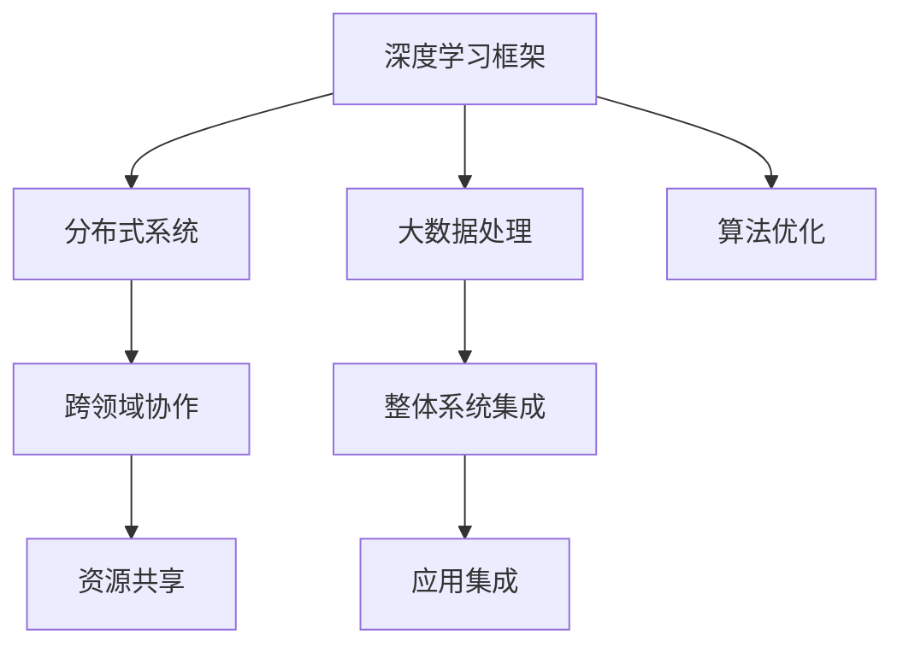
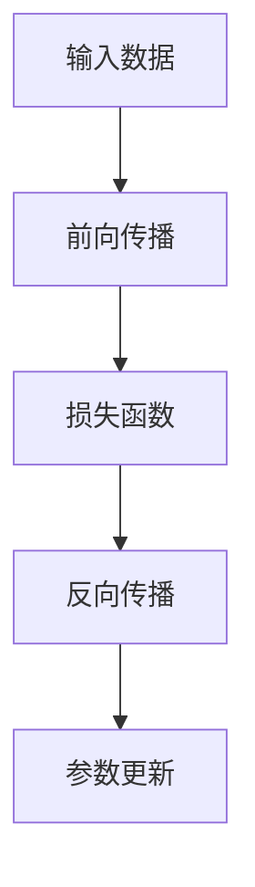
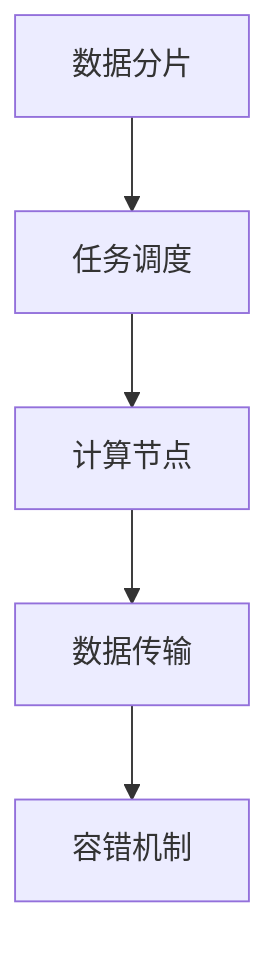
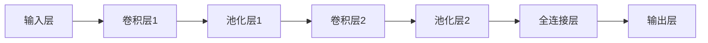
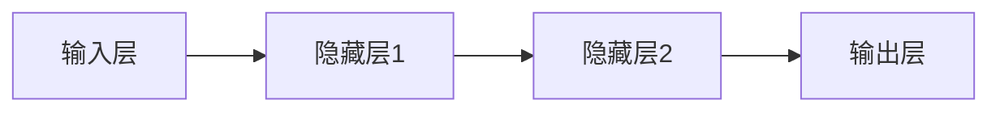

                 

# AI底层创新体系的整体构建

> 关键词：AI底层创新体系, 深度学习, 机器学习, 算法优化, 分布式系统, 大数据, 跨领域协同

## 1. 背景介绍

### 1.1 问题由来

人工智能（AI）作为当代科技发展的重要趋势，正在加速改变各个行业的运行模式和产业结构。AI底层创新体系，即AI技术的核心基础架构，包括深度学习框架、分布式系统、大数据处理技术等，是实现AI应用的关键。然而，由于缺乏全局视角和整体设计，当前AI底层创新体系存在诸多局限性和挑战，如计算资源不足、算法效率低、系统复杂度高、跨领域协作困难等问题。

这些问题不仅限制了AI技术的进一步发展和应用，也阻碍了产业界对AI技术的有效利用。为了应对这些挑战，本文将从AI底层创新体系的构建角度出发，详细阐述其在深度学习、算法优化、分布式系统、大数据处理等方面的核心技术、应用现状及未来发展趋势。

### 1.2 问题核心关键点

AI底层创新体系的构建需要从多个维度进行深入分析，具体包括：

- 深度学习框架的设计与优化。
- 分布式系统的高效构建与协同。
- 大数据处理技术的创新与应用。
- 跨领域协作的机制与方法。
- 整体系统的整合与集成。

本文将围绕以上核心关键点展开论述，力求从整体视角出发，提供一个全面、系统的AI底层创新体系构建方案。

## 2. 核心概念与联系

### 2.1 核心概念概述

为了更好地理解AI底层创新体系的构建，本节将介绍几个密切相关的核心概念：

- **深度学习框架**：如TensorFlow、PyTorch、MXNet等，提供强大的深度学习模型构建与优化能力，是AI应用开发的基础。
- **分布式系统**：包括计算集群、消息队列、存储系统等，支持大规模数据处理和模型训练，是AI系统高效运行的关键。
- **大数据处理技术**：如Hadoop、Spark等，提供数据存储、处理和分析能力，是数据驱动AI应用的重要基础。
- **跨领域协同**：通过数据共享、算法互用、平台集成等方式，促进不同领域间的深度合作，加速AI技术的多领域应用。
- **整体系统集成**：将深度学习、分布式系统、大数据处理等技术有机整合，形成一个功能完备、稳定高效的整体AI创新体系。

这些核心概念之间的逻辑关系可以通过以下Mermaid流程图来展示：



这个流程图展示了几项关键技术之间的联系：

1. 深度学习框架是AI应用开发的基础。
2. 分布式系统支持大规模数据处理和模型训练。
3. 大数据处理技术提供数据存储与分析能力。
4. 跨领域协同促进不同领域间的深度合作。
5. 整体系统集成构成完整的AI创新体系。
6. 算法优化提升模型性能。
7. 资源共享提高系统资源利用效率。
8. 应用集成实现AI技术的广泛应用。

这些核心概念共同构成了AI底层创新体系的构建框架，使其能够高效、稳定地支撑AI技术的广泛应用。通过理解这些核心概念，我们可以更好地把握AI底层创新体系的构建方法和实践方向。

## 3. 核心算法原理 & 具体操作步骤

### 3.1 算法原理概述

AI底层创新体系的构建涉及多种核心技术，包括深度学习、分布式计算、大数据处理等。其中，深度学习框架和分布式系统的原理和操作流程如下：

#### 3.1.1 深度学习框架

深度学习框架提供了强大的模型构建和优化能力，其核心原理是通过反向传播算法训练神经网络模型，优化模型参数以最小化损失函数。这一过程通常包括前向传播、损失计算、反向传播、参数更新等步骤，如图：



其中，前向传播计算模型输出，损失函数衡量预测与实际结果之间的差异，反向传播计算梯度，参数更新优化模型。

#### 3.1.2 分布式系统

分布式系统通过多台计算节点协同工作，提供高性能计算和大规模数据处理能力。其核心原理包括任务调度、数据分片、通信机制、容错机制等，如图：



其中，数据分片将大任务划分为多个子任务，任务调度确定计算节点的执行顺序，数据传输确保数据在节点之间高效传输，容错机制保障系统稳定运行。

### 3.2 算法步骤详解

AI底层创新体系的构建一般包括以下关键步骤：

**Step 1: 技术选型与规划**

- 选择合适的深度学习框架、分布式系统和大数据处理技术。
- 确定系统的整体架构和设计原则，包括可扩展性、高可用性、安全性等。
- 制定详细技术栈规划，确定各个组件的版本、依赖关系等。

**Step 2: 系统部署与初始化**

- 搭建计算集群、存储系统、消息队列等基础设施。
- 安装深度学习框架、分布式系统、大数据处理工具。
- 进行系统初始化配置，包括网络设置、权限管理、日志配置等。

**Step 3: 模型构建与训练**

- 选择合适的模型结构，如卷积神经网络（CNN）、循环神经网络（RNN）、Transformer等。
- 构建深度学习模型，包括定义网络结构、设置损失函数、优化器等。
- 将模型导入分布式系统，进行并行训练，优化模型参数。

**Step 4: 数据处理与存储**

- 对原始数据进行清洗、标注、转换等预处理操作。
- 将处理后的数据进行分片、存储，方便分布式系统进行数据访问和计算。
- 配置大数据处理工具，进行数据管理和分析。

**Step 5: 系统集成与优化**

- 将深度学习模型、分布式系统、大数据处理技术进行有机整合，构建完整的AI创新体系。
- 优化系统性能，包括资源调度和内存管理、算法优化和系统调优等。
- 进行系统测试，确保系统的稳定性和可靠性。

**Step 6: 应用部署与监控**

- 将AI系统部署到生产环境，并进行性能测试和压力测试。
- 设置监控工具，实时监测系统指标，及时发现和解决问题。
- 进行应用集成和集成测试，确保系统的功能完整性和兼容性。

### 3.3 算法优缺点

AI底层创新体系的构建具有以下优点：

- **高效性**：通过分布式系统和大数据处理技术，提供了强大的计算能力和数据处理能力，支持大规模数据训练和模型优化。
- **可扩展性**：系统的设计原则通常强调可扩展性，通过添加更多节点和优化系统架构，可以轻松应对更多的数据和计算需求。
- **灵活性**：深度学习框架和分布式系统的灵活性较高，支持多种模型和算法，满足不同应用场景的需求。

同时，该体系也存在一些局限性：

- **复杂性**：系统的构建和维护较为复杂，需要专业的技术团队和管理经验。
- **资源消耗**：大规模数据处理和模型训练需要大量的计算资源和存储资源。
- **跨领域协作困难**：不同领域的专家通常使用不同的工具和技术，难以进行深度协作。

尽管存在这些局限性，AI底层创新体系的构建依然是AI技术实现的关键，其高效性、可扩展性和灵活性为AI应用提供了坚实的基础。

### 3.4 算法应用领域

AI底层创新体系的应用领域非常广泛，包括但不限于以下几个方面：

- **计算机视觉**：如图像分类、目标检测、图像生成等。深度学习框架和分布式系统提供了强大的图像处理能力，支持大规模的图像数据处理和模型训练。
- **自然语言处理**：如语音识别、机器翻译、情感分析等。大数据处理技术提供了丰富的文本数据资源，分布式系统支持大规模文本处理和模型训练。
- **智能推荐系统**：如电商平台推荐、新闻内容推荐等。大数据处理技术提供了用户行为数据，深度学习框架和分布式系统支持模型训练和推荐策略优化。
- **金融风控**：如信用评估、欺诈检测等。分布式系统提供了高效的数据处理和计算能力，大数据处理技术支持多维数据的处理和分析。
- **医疗健康**：如疾病预测、医学影像分析等。深度学习框架和大数据处理技术提供了丰富的医疗数据资源，支持医学研究和应用。

除了以上这些领域外，AI底层创新体系还被广泛应用于自动驾驶、智能制造、智慧城市、智能安防等多个前沿领域，推动了各行业的数字化转型和智能化升级。

## 4. 数学模型和公式 & 详细讲解 & 举例说明

### 4.1 数学模型构建

AI底层创新体系的构建需要建立在坚实的数学模型基础之上。以下是深度学习框架和分布式系统的数学模型构建：

#### 4.1.1 深度学习框架的数学模型

深度学习框架的数学模型基于反向传播算法，其核心原理是利用梯度下降算法优化模型参数。以卷积神经网络（CNN）为例，其数学模型如下：

设输入数据为 $\mathbf{x}$，网络结构如图：



则前向传播过程为：

$$
y = F(z)
$$

其中，$z$ 为网络输入，$y$ 为网络输出。

反向传播过程为：

$$
\frac{\partial L}{\partial \theta} = \frac{\partial L}{\partial y} \frac{\partial y}{\partial z} \frac{\partial z}{\partial \theta}
$$

其中，$L$ 为损失函数，$\theta$ 为模型参数。

通过反向传播，可以计算梯度，并使用梯度下降算法更新模型参数：

$$
\theta \leftarrow \theta - \eta \nabla_{\theta}L
$$

其中，$\eta$ 为学习率。

#### 4.1.2 分布式系统的数学模型

分布式系统的数学模型涉及任务调度、数据分片、通信机制、容错机制等。以Apache Spark为例，其核心数学模型如下：

- **任务调度模型**：任务调度模型基于任务依赖关系和数据分片情况，生成任务执行计划。

- **数据分片模型**：数据分片模型将大数据集划分为多个小数据集，方便并行处理。

- **通信机制模型**：通信机制模型描述不同计算节点之间的数据传输方式和效率。

- **容错机制模型**：容错机制模型通过数据冗余和任务重试等方式，确保系统稳定运行。

### 4.2 公式推导过程

以下我们以深度学习框架的反向传播算法为例，推导其数学公式。

设深度学习模型的输入数据为 $\mathbf{x}$，网络结构如图：



则前向传播过程为：

$$
\mathbf{h}_1 = f_1(\mathbf{x}, \theta_1)
$$

$$
\mathbf{h}_2 = f_2(\mathbf{h}_1, \theta_2)
$$

$$
\mathbf{y} = f_3(\mathbf{h}_2, \theta_3)
$$

其中，$f_i$ 为第 $i$ 层的激活函数，$\theta_i$ 为第 $i$ 层的权重参数。

损失函数为：

$$
L(\mathbf{y}, \mathbf{y}') = \frac{1}{2}(\mathbf{y} - \mathbf{y}')^2
$$

其中，$\mathbf{y}'$ 为真实标签。

反向传播过程中，梯度的计算如下：

$$
\frac{\partial L}{\partial \theta_3} = \frac{\partial L}{\partial \mathbf{y}} \frac{\partial \mathbf{y}}{\partial \mathbf{h}_2} \frac{\partial \mathbf{h}_2}{\partial \mathbf{h}_1} \frac{\partial \mathbf{h}_1}{\partial \theta_1}
$$

其中，$\frac{\partial L}{\partial \mathbf{y}}$ 为损失函数对输出层的梯度，$\frac{\partial \mathbf{y}}{\partial \mathbf{h}_2}$ 为激活函数对输出层的梯度，$\frac{\partial \mathbf{h}_2}{\partial \mathbf{h}_1}$ 为激活函数对隐藏层的梯度，$\frac{\partial \mathbf{h}_1}{\partial \theta_1}$ 为激活函数对输入层的梯度。

### 4.3 案例分析与讲解

以AlphaGo为例，分析其底层创新体系的构建过程。

AlphaGo的核心创新点在于其深度学习框架、分布式系统和大数据处理技术的有机整合。其底层创新体系构建步骤如下：

1. **深度学习框架选择**：AlphaGo采用了TensorFlow框架，利用其强大的计算图和自动微分功能，高效构建和优化神经网络模型。
2. **分布式系统设计**：AlphaGo在多台计算节点上并行训练神经网络，使用TensorFlow的分布式训练功能，提高训练效率。
3. **大数据处理技术应用**：AlphaGo利用多台机器进行大规模数据处理，存储和管理训练数据，确保数据的完整性和一致性。
4. **跨领域协作机制**：AlphaGo通过与围棋专家合作，利用专家的知识经验指导模型训练和优化。

通过这一系列的创新，AlphaGo实现了在围棋领域的超人类水平表现，标志着深度学习、分布式系统和大数据处理技术的成熟应用。

## 5. 项目实践：代码实例和详细解释说明

### 5.1 开发环境搭建

在进行AI底层创新体系的构建和优化实践中，需要准备好开发环境。以下是使用Python和TensorFlow进行深度学习项目开发的流程：

1. 安装Anaconda：从官网下载并安装Anaconda，用于创建独立的Python环境。

2. 创建并激活虚拟环境：
```bash
conda create -n pytorch-env python=3.8 
conda activate pytorch-env
```

3. 安装TensorFlow：
```bash
conda install tensorflow -c conda-forge
```

4. 安装必要的第三方库：
```bash
pip install numpy scipy matplotlib scikit-learn h5py tensorboard
```

5. 设置TensorFlow GPU环境：
```bash
pip install tensorflow-gpu -c https://pypi.org/simple
```

6. 安装CUDA和cuDNN：
```bash
conda install -c conda-forge cudatoolkit=10.0
conda install -c conda-forge cudnn=8.1
```

完成上述步骤后，即可在`pytorch-env`环境中开始深度学习项目开发。

### 5.2 源代码详细实现

以下是使用TensorFlow实现卷积神经网络（CNN）图像分类项目的完整代码实现。

```python
import tensorflow as tf
from tensorflow.keras import layers, models

# 定义CNN模型
model = models.Sequential([
    layers.Conv2D(32, (3, 3), activation='relu', input_shape=(28, 28, 1)),
    layers.MaxPooling2D((2, 2)),
    layers.Conv2D(64, (3, 3), activation='relu'),
    layers.MaxPooling2D((2, 2)),
    layers.Flatten(),
    layers.Dense(64, activation='relu'),
    layers.Dense(10, activation='softmax')
])

# 编译模型
model.compile(optimizer='adam',
              loss='sparse_categorical_crossentropy',
              metrics=['accuracy'])

# 加载数据集
(x_train, y_train), (x_test, y_test) = tf.keras.datasets.mnist.load_data()

# 数据预处理
x_train = x_train.reshape((60000, 28, 28, 1))
x_train, x_test = x_train / 255.0, x_test / 255.0

# 训练模型
model.fit(x_train, y_train, epochs=5, batch_size=64, validation_data=(x_test, y_test))
```

### 5.3 代码解读与分析

让我们再详细解读一下关键代码的实现细节：

- `Sequential`类：定义了一个按顺序排列的神经网络层。
- `Conv2D`层：定义了卷积层，参数为卷积核大小和数量。
- `MaxPooling2D`层：定义了池化层，参数为池化窗口大小。
- `Flatten`层：将多维数据展平为一维数据。
- `Dense`层：定义了全连接层，参数为节点数和激活函数。
- `model.compile`：编译模型，设置优化器、损失函数和评估指标。
- `fit`方法：训练模型，设置训练数据、批次大小、迭代轮数等参数。

可以看出，TensorFlow提供了强大的API和工具，可以方便地进行深度学习模型的构建和训练。通过理解这些代码实现，可以更好地掌握深度学习模型的开发和优化方法。

## 6. 实际应用场景

### 6.1 医疗影像分析

医疗影像分析是AI底层创新体系的一个重要应用场景。通过深度学习框架和分布式系统，可以实现对医学影像的高效分析和诊断。

具体而言，可以收集大量医学影像数据，将其作为深度学习模型的训练样本。通过卷积神经网络（CNN）等模型，训练出高精度的医学影像分类、分割和检测模型。将模型部署到分布式系统中，利用多台机器进行大规模图像处理和分析，提高诊断效率和准确性。

例如，IBM Watson Health使用TensorFlow和Keras进行医学影像分析，能够快速准确地诊断多种疾病，如乳腺癌、肺癌等。

### 6.2 智能交通系统

智能交通系统是AI底层创新体系的另一个重要应用场景。通过分布式系统和大数据处理技术，可以实现交通流量预测、实时路况监控、智能调度等功能。

具体而言，可以收集交通流量数据、天气数据、车辆位置数据等，进行实时分析和处理。通过卷积神经网络（CNN）和长短期记忆网络（LSTM）等模型，训练出交通流量预测和路况监控模型。将模型部署到分布式系统中，利用多台机器进行大规模数据处理和分析，实现实时监控和智能调度。

例如，阿里云智能交通系统使用TensorFlow和Keras进行交通流量预测和实时监控，能够提供准确的交通预测和优化方案，提升城市交通管理水平。

### 6.3 智能推荐系统

智能推荐系统是AI底层创新体系在电商、新闻等领域的典型应用。通过深度学习框架和大数据处理技术，可以实现个性化推荐、广告投放等任务。

具体而言，可以收集用户行为数据、商品数据、新闻数据等，进行数据清洗和预处理。通过深度学习模型，如协同过滤、神经网络等，训练出高精度的推荐模型。将模型部署到分布式系统中，利用多台机器进行大规模数据处理和分析，实现个性化推荐和广告投放。

例如，京东使用TensorFlow和Keras进行电商推荐系统构建，能够提供精准的个性化推荐服务，提升用户体验和销售额。

### 6.4 未来应用展望

随着AI底层创新体系的不断发展，未来的应用场景将更加广泛，包括但不限于以下几个方面：

- **自动驾驶**：通过深度学习框架和大数据处理技术，实现车辆自主导航和路径规划，提升交通安全和效率。
- **智慧农业**：通过深度学习框架和分布式系统，进行农业数据收集和分析，提升农业生产效率和资源利用率。
- **智能制造**：通过深度学习框架和大数据处理技术，实现生产流程优化和质量控制，提升制造业的生产力和竞争力。
- **智慧城市**：通过深度学习框架和分布式系统，实现城市数据收集和分析，提升城市管理水平和居民生活质量。
- **智能安防**：通过深度学习框架和大数据处理技术，实现安全监控和预警，提升公共安全保障水平。

以上应用场景将进一步拓展AI底层创新体系的应用范围，推动各行业的数字化转型和智能化升级。

## 7. 工具和资源推荐

### 7.1 学习资源推荐

为了帮助开发者系统掌握AI底层创新体系的构建理论，以下是一些优质的学习资源：

1. 《深度学习》书籍：Ian Goodfellow等人编写，全面介绍了深度学习的基本概念和算法，是深度学习入门的经典教材。
2. TensorFlow官方文档：提供了丰富的深度学习框架和工具的详细文档和示例代码，是TensorFlow学习的重要参考资料。
3. Keras官方文档：提供了高层次的深度学习API和工具，帮助用户快速构建和训练深度学习模型。
4. PyTorch官方文档：提供了动态计算图的深度学习框架，支持高效模型构建和训练。
5. 《分布式系统》课程：Stanford大学开设的分布式系统课程，详细介绍了分布式系统的设计和实现原理，适合深度学习工程师学习。

通过对这些资源的学习实践，相信你一定能够全面掌握AI底层创新体系的构建方法和实践技巧。

### 7.2 开发工具推荐

高效的开发离不开优秀的工具支持。以下是几款用于AI底层创新体系开发的常用工具：

1. TensorFlow：Google开源的深度学习框架，提供了强大的计算图和自动微分功能，支持大规模模型训练和优化。
2. PyTorch：Facebook开源的深度学习框架，提供了动态计算图和灵活的API设计，适合研究和实验。
3. Hadoop：Apache开源的大数据处理框架，支持大规模数据存储和处理。
4. Spark：Apache开源的分布式计算框架，支持高并发和低延迟的数据处理。
5. Docker：开源的容器化技术，方便模型的打包和部署。
6. Jupyter Notebook：开源的交互式编程工具，支持多语言混合编程和代码共享。

合理利用这些工具，可以显著提升AI底层创新体系的开发效率，加快创新迭代的步伐。

### 7.3 相关论文推荐

AI底层创新体系的发展离不开学界的持续研究。以下是几篇奠基性的相关论文，推荐阅读：

1. Google Brain Team的《Deep Neural Networks for Image Recognition》：提出了卷积神经网络（CNN）架构，用于图像分类和识别任务。
2. Yann LeCun等人发表的《Backpropagation Applied to Handwritten Zip Code Recognition》：首次提出了反向传播算法，为深度学习训练提供了重要工具。
3. TensarFlow团队的《TensorFlow: A System for Large-Scale Machine Learning》：介绍了TensorFlow架构和设计理念，是深度学习框架的重要参考。
4. Facebook AI团队的《Convolutional Neural Networks for Sentence Classification》：提出了基于卷积神经网络（CNN）的文本分类模型，用于情感分析等任务。
5. Google AI团队的《Inception-Net: Scaling Inception Networks》：提出了Inception架构，用于图像分类和目标检测等任务。

这些论文代表了大规模深度学习和大数据处理技术的发展脉络，是深入理解AI底层创新体系的必读文献。

## 8. 总结：未来发展趋势与挑战

### 8.1 研究成果总结

本文对AI底层创新体系的构建进行了全面系统的介绍。通过分析深度学习框架、分布式系统、大数据处理等核心技术，详细阐述了AI底层创新体系的构建方法和应用场景。具体内容包括：

- 深度学习框架的设计与优化。
- 分布式系统的构建与协同。
- 大数据处理技术的创新与应用。
- 跨领域协同的机制与方法。
- 整体系统的整合与集成。

通过本文的介绍，读者可以全面理解AI底层创新体系的构建方法，掌握深度学习、分布式系统、大数据处理等关键技术的应用。

### 8.2 未来发展趋势

展望未来，AI底层创新体系的发展将呈现以下几个趋势：

1. **深度学习框架的创新**：未来的深度学习框架将更加灵活、易用，支持更多的模型和算法。同时，框架将加入更多优化技术和工具，提高模型训练和推理效率。
2. **分布式系统的优化**：未来的分布式系统将更加高效、可扩展，支持更多的硬件平台和计算模式。同时，系统将加入更多容错机制和调度算法，提高系统的稳定性和可靠性。
3. **大数据处理技术的创新**：未来的大数据处理技术将更加高效、实时，支持更多的数据格式和处理模式。同时，技术将加入更多优化算法和工具，提高数据处理和分析的效率。
4. **跨领域协同机制的优化**：未来的跨领域协同机制将更加灵活、高效，支持更多的领域和数据源。同时，机制将加入更多协作工具和平台，提高协作效率和效果。
5. **整体系统的整合与集成**：未来的整体系统将更加无缝、灵活，支持更多的技术和工具。同时，系统将加入更多集成和优化工具，提高系统的整体性能和用户体验。

这些趋势将推动AI底层创新体系不断进步，为AI技术在更多领域的应用提供坚实的技术支持。

### 8.3 面临的挑战

尽管AI底层创新体系的发展取得了显著进展，但在迈向更加智能化、普适化应用的过程中，仍面临诸多挑战：

1. **计算资源瓶颈**：大规模模型训练和分布式系统运行需要大量的计算资源和存储资源，现有的硬件设备可能难以满足需求。
2. **数据质量问题**：深度学习模型的训练需要大量高质量数据，数据获取和标注成本较高，数据质量和多样性不足。
3. **算法效率问题**：深度学习算法本身具有较高的计算复杂度，在大规模数据处理和模型训练过程中，算法效率有待进一步提升。
4. **系统复杂性**：AI底层创新体系涉及多种技术和工具，系统的构建和维护较为复杂，需要专业的技术团队和管理经验。
5. **跨领域协作困难**：不同领域的专家通常使用不同的工具和技术，难以进行深度协作，影响系统的整体效果。

尽管存在这些挑战，AI底层创新体系的构建依然是AI技术实现的关键，其高效性、可扩展性和灵活性为AI应用提供了坚实的基础。未来需要从计算资源、数据质量、算法效率、系统复杂性和跨领域协作等多个方面进行持续优化，以实现AI技术的广泛应用和深入发展。

### 8.4 研究展望

面向未来，AI底层创新体系的研究将从以下几个方面寻求新的突破：

1. **计算资源的优化**：通过硬件加速、算法优化和模型压缩等技术，进一步提升计算资源利用效率。
2. **数据质量的提升**：通过数据增强、数据清洗和数据生成等技术，提高数据质量和多样性，降低数据标注成本。
3. **算法效率的提升**：通过模型优化、算法改进和硬件加速等技术，提高深度学习算法的计算效率和性能。
4. **系统复杂性的降低**：通过集成优化、自动化调优和平台化开发等技术，降低系统的复杂性和维护成本。
5. **跨领域协作的加强**：通过统一数据格式、共享模型和工具等技术，加强不同领域之间的协作，提升系统的整体效果。

这些研究方向的探索，将推动AI底层创新体系向更高层次发展，为AI技术的广泛应用提供更坚实的技术基础。

## 9. 附录：常见问题与解答

**Q1：AI底层创新体系的核心组件有哪些？**

A: AI底层创新体系的核心组件包括深度学习框架、分布式系统、大数据处理技术等。这些组件协同工作，提供深度学习模型的构建和优化能力，支持大规模数据处理和模型训练，提供数据存储和分析能力。

**Q2：如何选择合适的深度学习框架？**

A: 选择合适的深度学习框架需要考虑多方面因素，包括框架的灵活性、易用性、性能、社区支持等。TensorFlow、PyTorch、Keras等框架各有优劣，应根据具体需求进行选择。

**Q3：分布式系统如何提高计算效率？**

A: 分布式系统通过多台计算节点协同工作，提供高性能计算和大规模数据处理能力。通过任务调度、数据分片、通信机制、容错机制等设计，可以有效提高计算效率和系统可靠性。

**Q4：大数据处理技术如何优化数据处理流程？**

A: 大数据处理技术通过Hadoop、Spark等工具，提供高效的数据存储、处理和分析能力。通过数据分片、任务调度、数据压缩等技术，优化数据处理流程，提高数据处理和分析效率。

**Q5：AI底层创新体系的应用场景有哪些？**

A: AI底层创新体系的应用场景非常广泛，包括计算机视觉、自然语言处理、智能推荐系统、金融风控、医疗健康等多个领域。通过深度学习框架、分布式系统、大数据处理等技术的有机整合，实现AI技术的高效应用和创新。

以上是关于AI底层创新体系的全面介绍和未来展望，希望能够为读者提供深入的理论基础和实践指南。AI底层创新体系是AI技术实现的关键，掌握其核心技术和构建方法，将为AI应用的广泛推广和深入发展奠定坚实基础。

