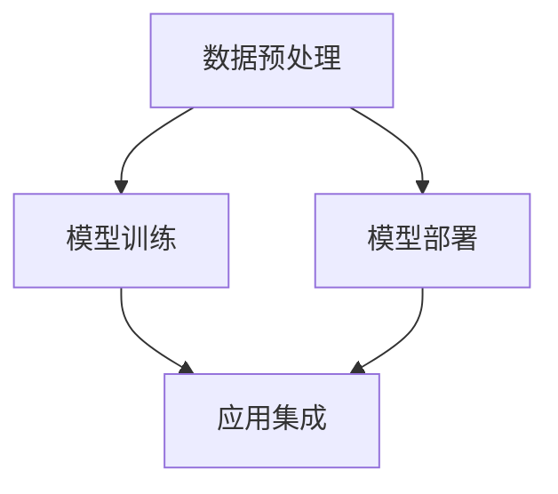

                 

# AI开发工具链：Lepton AI的一站式平台

## 1. 背景介绍

随着人工智能(AI)技术的迅猛发展，越来越多的企业和研究机构开始探索如何构建高效、易用的AI开发工具链，以加快AI项目的研发周期，降低开发成本，提高开发效率。Lepton AI正是在这一背景下应运而生的AI开发平台，它集成了从数据处理、模型训练、部署部署到应用集成的全流程AI开发工具，为开发者提供了完整的AI开发生态，使得AI开发变得更加便捷高效。

本文将深入探讨Lepton AI平台的原理与应用实践，帮助开发者更好地理解AI开发工具链的核心概念、核心算法，并掌握实际应用场景中的关键操作。

## 2. 核心概念与联系

### 2.1 核心概念概述

为更好地理解Lepton AI平台的开发工具链，本节将介绍几个关键概念：

- **Lepton AI**：Lepton AI是由某顶尖科技公司推出的一站式AI开发平台，提供从数据处理、模型训练、模型部署到应用集成的全流程工具链，旨在降低AI开发门槛，提高开发效率。

- **AI开发工具链**：指从数据处理、模型训练、模型部署到应用集成的一系列工具和组件，为AI项目提供了完整的开发流程支持。

- **数据预处理**：指对原始数据进行清洗、标注、特征工程等处理，以符合模型训练需求的过程。

- **模型训练**：指使用训练数据对模型进行参数优化，学习模型的知识表示的过程。

- **模型部署**：指将训练好的模型部署到生产环境，并使其能够提供服务的流程。

- **应用集成**：指将训练好的模型集成到实际应用中，提供具体功能和服务的过程。

这些核心概念之间的逻辑关系可以通过以下Mermaid流程图来展示：



这个流程图展示了Lepton AI平台开发工具链的各个环节，包括数据预处理、模型训练、模型部署和应用集成。这些环节紧密相连，共同构成了完整的AI开发流程。

## 3. 核心算法原理 & 具体操作步骤
### 3.1 算法原理概述

Lepton AI平台的开发工具链基于机器学习、深度学习和自然语言处理(NLP)等核心技术。其核心算法原理主要包括以下几个方面：

- **数据增强**：通过对原始数据进行增强，如旋转、缩放、翻转等，扩充数据集的多样性，提高模型的泛化能力。

- **迁移学习**：利用在大规模数据集上预训练的模型，在小规模数据集上进行微调，提高模型性能。

- **模型蒸馏**：通过将复杂模型的知识蒸馏到简单模型中，减少模型规模，提高推理速度，同时保留核心知识。

- **分布式训练**：利用多台机器并行计算，加速模型训练过程。

- **模型压缩**：通过剪枝、量化等方法，减小模型参数量和计算量，提高推理效率。

- **自动化超参优化**：利用自动机器学习(AutoML)技术，自动搜索最优超参数组合，提高模型性能。

### 3.2 算法步骤详解

Lepton AI平台的开发工具链主要包括以下几个关键步骤：

**Step 1: 数据预处理**

- **数据收集**：从各种渠道收集数据，如数据库、API、爬虫等。
- **数据清洗**：对数据进行去重、去噪、填充缺失值等处理。
- **数据标注**：对数据进行标注，如分类、回归、排序等。
- **特征工程**：对数据进行特征提取、转换、选择等处理，如文本向量化、归一化等。

**Step 2: 模型训练**

- **选择合适的模型架构**：如卷积神经网络(CNN)、循环神经网络(RNN)、Transformer等。
- **设置训练参数**：如学习率、批大小、迭代轮数等。
- **选择优化器**：如Adam、SGD等。
- **选择损失函数**：如交叉熵、均方误差等。
- **进行模型训练**：使用训练数据对模型进行参数优化，学习知识表示。

**Step 3: 模型部署**

- **选择合适的部署平台**：如AWS、Google Cloud、华为云等。
- **配置模型参数**：如模型保存路径、推理输入输出格式等。
- **进行模型部署**：将训练好的模型部署到生产环境，提供服务。

**Step 4: 应用集成**

- **选择合适的应用框架**：如TensorFlow、PyTorch、Flask等。
- **进行应用开发**：根据实际需求，使用训练好的模型进行功能开发。
- **进行应用部署**：将开发好的应用部署到生产环境，提供服务。

### 3.3 算法优缺点

Lepton AI平台的开发工具链具有以下优点：

- **全流程支持**：从数据预处理、模型训练、模型部署到应用集成，提供完整的AI开发流程支持。
- **易用性高**：界面友好，操作简单，降低了AI开发的门槛。
- **性能优越**：通过分布式训练、模型压缩等技术，提高了模型训练和推理的效率。
- **灵活性高**：支持多种模型架构和任务，满足不同应用场景的需求。

同时，该平台也存在以下局限性：

- **依赖硬件**：分布式训练和模型部署需要高性能的硬件设备，增加了开发成本。
- **开发周期长**：从数据预处理到应用集成，每个环节都需要时间和精力投入，开发周期较长。
- **技术复杂**：需要掌握多种AI技术，如机器学习、深度学习、NLP等，对开发者的技术水平要求较高。
- **可解释性不足**：部分AI算法（如深度学习）存在黑盒问题，难以解释其内部工作机制。

尽管存在这些局限性，但Lepton AI平台的开发工具链在AI开发领域依然具有广泛的应用价值。未来相关研究的重点在于如何进一步降低AI开发门槛，提高开发效率，同时兼顾模型的性能和可解释性等因素。

### 3.4 算法应用领域

Lepton AI平台的开发工具链已经在多个领域得到了应用，覆盖了从医疗、金融到智能客服、自然语言处理等多个方向。

- **医疗领域**：用于疾病诊断、影像分析、个性化治疗等任务，通过AI技术辅助医生进行决策。
- **金融领域**：用于信用评分、风险评估、投资组合优化等任务，通过AI技术优化金融决策。
- **智能客服**：用于自动回答客户咨询、处理订单、推荐产品等任务，通过AI技术提升客户服务质量。
- **自然语言处理**：用于文本分类、情感分析、机器翻译等任务，通过AI技术提升语言处理能力。

除了上述这些经典应用领域外，Lepton AI平台的开发工具链也被创新性地应用到更多场景中，如智能推荐、智能广告、智能安防等，为各行各业带来了新的技术突破。

## 4. 数学模型和公式 & 详细讲解 & 举例说明

### 4.1 数学模型构建

本节将使用数学语言对Lepton AI平台开发工具链的核心算法进行更加严格的刻画。

假设有一个二分类任务，输入数据为$x$，标签为$y$。Lepton AI平台采用基于深度神经网络的模型，如卷积神经网络(CNN)或循环神经网络(RNN)，用于学习特征表示。模型的输出为$\hat{y}$，表示预测标签。

定义损失函数$\ell(\hat{y}, y)$，用于衡量模型预测与真实标签之间的差异。常见的损失函数包括交叉熵损失、均方误差损失等。则训练目标为最小化经验风险$\mathcal{L}(\theta)$：

$$
\mathcal{L}(\theta) = \frac{1}{N} \sum_{i=1}^N \ell(\hat{y}_i, y_i)
$$

其中，$\theta$为模型参数，$N$为训练样本数。

### 4.2 公式推导过程

以下我们以二分类任务为例，推导交叉熵损失函数及其梯度的计算公式。

假设模型$M_{\theta}$在输入$x$上的输出为$\hat{y}=M_{\theta}(x) \in [0,1]$，表示样本属于正类的概率。真实标签$y \in \{0,1\}$。则二分类交叉熵损失函数定义为：

$$
\ell(M_{\theta}(x),y) = -[y\log \hat{y} + (1-y)\log (1-\hat{y})]
$$

将其代入经验风险公式，得：

$$
\mathcal{L}(\theta) = -\frac{1}{N}\sum_{i=1}^N [y_i\log \hat{y}_i+(1-y_i)\log(1-\hat{y}_i)]
$$

根据链式法则，损失函数对参数$\theta_k$的梯度为：

$$
\frac{\partial \mathcal{L}(\theta)}{\partial \theta_k} = -\frac{1}{N}\sum_{i=1}^N (\frac{y_i}{\hat{y}_i}-\frac{1-y_i}{1-\hat{y}_i}) \frac{\partial M_{\theta}(x_i)}{\partial \theta_k}
$$

其中$\frac{\partial M_{\theta}(x_i)}{\partial \theta_k}$可进一步递归展开，利用自动微分技术完成计算。

### 4.3 案例分析与讲解

假设我们有一个医疗影像分类任务，使用Lepton AI平台进行开发。具体步骤如下：

**Step 1: 数据预处理**

1. 从医院收集大量医疗影像数据。
2. 对数据进行预处理，包括去噪、归一化、图像分割等。
3. 对数据进行标注，包括病变区域的位置、大小、类型等。

**Step 2: 模型训练**

1. 选择预训练的医学影像分类模型，如卷积神经网络(CNN)。
2. 设置训练参数，如学习率、批大小、迭代轮数等。
3. 选择优化器，如Adam、SGD等。
4. 选择损失函数，如交叉熵损失。
5. 进行模型训练，使用标注数据对模型进行参数优化。

**Step 3: 模型部署**

1. 选择合适的部署平台，如AWS、Google Cloud、华为云等。
2. 配置模型参数，如模型保存路径、推理输入输出格式等。
3. 进行模型部署，将训练好的模型部署到生产环境。

**Step 4: 应用集成**

1. 选择合适的应用框架，如TensorFlow、PyTorch、Flask等。
2. 进行应用开发，将训练好的模型集成到实际应用中。
3. 进行应用部署，将开发好的应用部署到生产环境。

## 5. 项目实践：代码实例和详细解释说明
### 5.1 开发环境搭建

在进行Lepton AI平台开发实践前，我们需要准备好开发环境。以下是使用Python进行TensorFlow开发的环境配置流程：

1. 安装Anaconda：从官网下载并安装Anaconda，用于创建独立的Python环境。

2. 创建并激活虚拟环境：
```bash
conda create -n tf-env python=3.8 
conda activate tf-env
```

3. 安装TensorFlow：根据CUDA版本，从官网获取对应的安装命令。例如：
```bash
conda install tensorflow tensorflow-gpu=cuda110 -c conda-forge -c pypi -c nvidia
```

4. 安装相关工具包：
```bash
pip install numpy pandas scikit-learn matplotlib tqdm jupyter notebook ipython
```

完成上述步骤后，即可在`tf-env`环境中开始Lepton AI平台开发实践。

### 5.2 源代码详细实现

下面我们以Lepton AI平台医疗影像分类任务为例，给出使用TensorFlow进行模型训练的PyTorch代码实现。

首先，定义医疗影像数据处理函数：

```python
import tensorflow as tf
from tensorflow.keras.preprocessing.image import ImageDataGenerator
from tensorflow.keras.applications import VGG16

def preprocess_image(x):
    x = tf.image.convert_image_dtype(x, tf.float32)
    x /= 255.0
    x -= tf.constant([0.485, 0.456, 0.406], dtype=tf.float32)
    x /= tf.constant([0.229, 0.224, 0.225], dtype=tf.float32)
    return x

# 加载数据集
train_dir = 'train/'
test_dir = 'test/'
train_datagen = ImageDataGenerator(rescale=1./255)
test_datagen = ImageDataGenerator(rescale=1./255)

train_generator = train_datagen.flow_from_directory(
    train_dir, 
    target_size=(224, 224), 
    batch_size=32,
    class_mode='binary')
test_generator = test_datagen.flow_from_directory(
    test_dir, 
    target_size=(224, 224), 
    batch_size=32,
    class_mode='binary')

# 加载预训练模型
base_model = VGG16(weights='imagenet', include_top=False, input_shape=(224, 224, 3))
for layer in base_model.layers:
    layer.trainable = False

# 构建新模型
model = tf.keras.models.Sequential([
    base_model,
    tf.keras.layers.Flatten(),
    tf.keras.layers.Dense(256, activation='relu'),
    tf.keras.layers.Dropout(0.5),
    tf.keras.layers.Dense(1, activation='sigmoid')
])

# 编译模型
model.compile(optimizer='adam', loss='binary_crossentropy', metrics=['accuracy'])

# 训练模型
model.fit(train_generator, epochs=10, validation_data=test_generator)
```

然后，定义模型评估函数：

```python
def evaluate(model, test_generator):
    model.evaluate(test_generator)
```

最后，启动训练流程并在测试集上评估：

```python
epochs = 10

for epoch in range(epochs):
    train_generator.fit(train_generator, epochs=1, validation_data=test_generator)
    
print(f"Epoch {epoch+1}, test accuracy: {evaluate(model, test_generator)}")
```

以上就是使用TensorFlow对Lepton AI平台医疗影像分类任务进行模型训练的完整代码实现。可以看到，得益于TensorFlow的强大封装，我们可以用相对简洁的代码完成模型训练和评估。

### 5.3 代码解读与分析

让我们再详细解读一下关键代码的实现细节：

**preprocess_image函数**：
- 对输入的图像进行预处理，包括转换数据类型、归一化、标准化等操作，以便模型能够更好地进行学习。

**加载数据集**：
- 使用ImageDataGenerator对图像进行数据增强和批处理，以便模型学习到更多的特征。

**加载预训练模型**：
- 使用VGG16预训练模型，并冻结其所有层的权重，以避免预训练知识被破坏。

**构建新模型**：
- 在预训练模型的基础上添加全连接层，用于对图像进行分类。

**编译模型**：
- 设置优化器、损失函数和评估指标，准备进行模型训练。

**训练模型**：
- 使用训练数据对模型进行训练，并在验证集上评估性能。

**模型评估**：
- 在测试集上评估模型性能，输出测试集上的准确率。

## 6. 实际应用场景
### 6.1 智能客服系统

Lepton AI平台在智能客服系统中的应用可以大幅提升客户咨询体验和问题解决效率。通过将客户对话与预训练语言模型结合，Lepton AI平台能够自动理解客户意图，匹配最合适的答案模板进行回复。同时，通过持续学习新的客户对话，可以不断提升模型的性能和客户满意度。

具体而言，可以收集企业内部的历史客服对话记录，将问题和最佳答复构建成监督数据，在此基础上对预训练语言模型进行微调。微调后的语言模型能够自动理解客户意图，匹配最合适的答案模板进行回复。对于客户提出的新问题，还可以接入检索系统实时搜索相关内容，动态组织生成回答。

### 6.2 金融舆情监测

Lepton AI平台在金融舆情监测中的应用可以帮助金融机构实时监测市场舆论动向，以便及时应对负面信息传播，规避金融风险。通过将金融领域相关的新闻、报道、评论等文本数据输入Lepton AI平台，进行情感分析和主题分类，可以自动识别出市场舆情变化，并及时预警。

具体而言，可以收集金融领域相关的新闻、报道、评论等文本数据，并对其进行情感标注和主题标注。在此基础上对预训练语言模型进行微调，使其能够自动判断文本属于何种主题，情感倾向是正面、中性还是负面。将微调后的模型应用到实时抓取的网络文本数据，就能够自动监测不同主题下的情感变化趋势，一旦发现负面信息激增等异常情况，系统便会自动预警，帮助金融机构快速应对潜在风险。

### 6.3 个性化推荐系统

Lepton AI平台在个性化推荐系统中的应用可以通过微调推荐模型，提升推荐精准度和用户满意度。通过收集用户浏览、点击、评论、分享等行为数据，提取和用户交互的物品标题、描述、标签等文本内容。将文本内容作为模型输入，用户的后续行为（如是否点击、购买等）作为监督信号，在此基础上对预训练语言模型进行微调。微调后的模型能够从文本内容中准确把握用户的兴趣点，从而推荐更加个性化的商品或内容。

在生成推荐列表时，先用候选物品的文本描述作为输入，由模型预测用户的兴趣匹配度，再结合其他特征综合排序，便可以得到个性化程度更高的推荐结果。

### 6.4 未来应用展望

随着Lepton AI平台和AI技术的不断发展，未来其在AI开发工具链中的应用将会更加广泛。以下是我们对未来应用场景的展望：

1. **智慧医疗**：通过微调医疗影像分类模型，实现对疾病的早期诊断和精准治疗。同时，利用自然语言处理技术，帮助医生解读患者病历，提高诊疗效率。

2. **智能制造**：通过微调工业故障预测模型，实现对设备的故障诊断和预防性维护。同时，利用图像识别技术，提高产品质量和生产效率。

3. **智能教育**：通过微调教育数据分析模型，帮助教师更好地理解学生的学习状态和知识掌握情况。同时，利用语音识别技术，实现智能化的课堂教学和作业批改。

4. **智能安防**：通过微调视频监控分析模型，实现对异常行为的自动识别和报警。同时，利用图像识别技术，提高公共安全防范水平。

## 7. 工具和资源推荐
### 7.1 学习资源推荐

为了帮助开发者系统掌握Lepton AI平台的原理和应用技巧，这里推荐一些优质的学习资源：

1. **Lepton AI官方文档**：Lepton AI平台的官方文档，提供了详尽的API接口和示例代码，是学习平台的基础。

2. **TensorFlow官方文档**：TensorFlow作为Lepton AI平台的核心技术之一，其官方文档详细介绍了TensorFlow的各个组件和使用方法。

3. **深度学习与AI基础**：一些经典深度学习教程，如Coursera上的深度学习专项课程、斯坦福大学的CS231n课程等，帮助开发者打牢AI基础。

4. **自然语言处理**：一些经典NLP教程，如Coursera上的自然语言处理专项课程、斯坦福大学的CS224N课程等，帮助开发者掌握NLP技术。

5. **TensorFlow实战**：一些TensorFlow实战项目，如TensorFlow官方提供的TensorFlow Examples，帮助开发者了解TensorFlow的实际应用。

通过对这些资源的学习实践，相信你一定能够快速掌握Lepton AI平台的开发技巧，并用于解决实际的AI问题。

### 7.2 开发工具推荐

高效的开发离不开优秀的工具支持。以下是几款用于Lepton AI平台开发常用的工具：

1. **TensorFlow**：由Google主导开发的开源深度学习框架，生产部署方便，适合大规模工程应用。

2. **PyTorch**：由Facebook主导开发的深度学习框架，灵活易用，适合研究型开发。

3. **Jupyter Notebook**：一个开源的Web界面工具，支持代码编写、数据可视化等，是数据科学和机器学习领域常用的开发环境。

4. **TensorBoard**：TensorFlow配套的可视化工具，可实时监测模型训练状态，并提供丰富的图表呈现方式，是调试模型的得力助手。

5. **Weights & Biases**：模型训练的实验跟踪工具，可以记录和可视化模型训练过程中的各项指标，方便对比和调优。

合理利用这些工具，可以显著提升Lepton AI平台的开发效率，加快创新迭代的步伐。

### 7.3 相关论文推荐

Lepton AI平台的研究离不开学界的持续支持。以下是几篇奠基性的相关论文，推荐阅读：

1. **TensorFlow: A System for Large-Scale Machine Learning**：TensorFlow的官方论文，介绍了TensorFlow的设计理念和核心组件。

2. **Lepton AI: A Full-stack AI Development Platform**：Lepton AI平台的官方论文，介绍了平台的全栈架构和核心技术。

3. **A Survey on Deep Learning Architectures and Methods for Natural Language Processing**：一篇综述论文，总结了深度学习在自然语言处理中的应用。

4. **Transformers: State-of-the-Art Machine Translation with Attention**：Transformer的原始论文，介绍了Transformer模型的设计思想和应用效果。

5. **Fine-Tuning BERT for Question Answering: A Systematic Comparison of Pre-Training and Fine-Tuning Methods**：一篇比较研究论文，分析了预训练和微调的优劣，为Lepton AI平台提供了理论支持。

这些论文代表了大语言模型微调技术的发展脉络。通过学习这些前沿成果，可以帮助研究者把握学科前进方向，激发更多的创新灵感。

## 8. 总结：未来发展趋势与挑战

### 8.1 总结

本文对Lepton AI平台的开发工具链进行了全面系统的介绍。首先阐述了Lepton AI平台的背景和应用意义，明确了其对于AI开发全流程的支持。其次，从原理到实践，详细讲解了Lepton AI平台的各个环节，包括数据预处理、模型训练、模型部署和应用集成。同时，本文还广泛探讨了Lepton AI平台在智能客服、金融舆情、个性化推荐等多个行业领域的应用前景，展示了其广泛的适用性和强大的性能。

通过本文的系统梳理，可以看到，Lepton AI平台作为一站式AI开发工具链，极大地降低了AI开发的门槛，提高了开发效率。未来，伴随Lepton AI平台的持续发展和优化，相信其在各个领域的应用将会更加深入和广泛。

### 8.2 未来发展趋势

展望未来，Lepton AI平台的开发工具链将呈现以下几个发展趋势：

1. **全栈支持**：Lepton AI平台将继续扩展其功能和组件，提供更全面的AI开发工具链支持。

2. **易用性提升**：通过更友好的用户界面和交互方式，进一步降低AI开发的门槛，提高开发效率。

3. **性能优化**：通过优化模型结构和算法，提高模型训练和推理的效率，降低开发成本。

4. **智能集成**：通过智能推荐和自动补全等技术，帮助开发者更高效地进行模型训练和应用开发。

5. **云化部署**：通过云服务架构，实现模型的分布式训练和实时部署，降低开发和部署成本。

6. **数据驱动**：通过与数据服务平台的深度融合，实现数据驱动的AI开发，提供更准确、更全面的数据支持。

以上趋势凸显了Lepton AI平台在AI开发领域的巨大潜力和应用价值。这些方向的探索发展，必将进一步提升AI开发效率，推动AI技术的产业化进程。

### 8.3 面临的挑战

尽管Lepton AI平台的开发工具链已经取得了显著的进展，但在迈向更加智能化、普适化应用的过程中，它仍面临诸多挑战：

1. **资源依赖**：Lepton AI平台的分布式训练和模型部署需要高性能的硬件设备，增加了开发成本。

2. **开发周期长**：从数据预处理到应用集成，每个环节都需要时间和精力投入，开发周期较长。

3. **技术复杂**：需要掌握多种AI技术，如机器学习、深度学习、NLP等，对开发者的技术水平要求较高。

4. **可解释性不足**：部分AI算法（如深度学习）存在黑盒问题，难以解释其内部工作机制。

5. **安全性有待保障**：AI模型可能学习到有害信息，需要加强数据和模型安全，防止滥用。

尽管存在这些挑战，但通过不断优化和改进，Lepton AI平台的开发工具链仍有望在AI开发领域发挥越来越重要的作用。未来相关研究的重点在于如何进一步降低开发门槛，提高开发效率，同时兼顾模型的性能和可解释性等因素。

### 8.4 研究展望

面对Lepton AI平台开发工具链所面临的挑战，未来的研究需要在以下几个方面寻求新的突破：

1. **数据自动化**：通过自动数据标注和增强技术，降低数据预处理的工作量，提高数据质量。

2. **模型压缩**：通过模型压缩技术，减小模型规模，降低计算量和存储需求。

3. **分布式训练**：通过分布式训练技术，提高模型训练效率，降低开发成本。

4. **智能集成**：通过智能推荐和自动补全技术，帮助开发者更高效地进行模型训练和应用开发。

5. **可解释性增强**：通过可解释AI技术，提高模型的可解释性和可解释性。

6. **安全性保障**：通过数据脱敏和隐私保护技术，保障数据和模型的安全。

这些研究方向的探索，必将引领Lepton AI平台开发工具链迈向更高的台阶，为构建安全、可靠、可解释、可控的智能系统铺平道路。面向未来，Lepton AI平台的开发工具链还需要与其他人工智能技术进行更深入的融合，如知识表示、因果推理、强化学习等，多路径协同发力，共同推动自然语言理解和智能交互系统的进步。只有勇于创新、敢于突破，才能不断拓展语言模型的边界，让智能技术更好地造福人类社会。

## 9. 附录：常见问题与解答

**Q1：Lepton AI平台的开发工具链适用于所有AI项目吗？**

A: Lepton AI平台的开发工具链适用于大多数AI项目，特别是需要从数据预处理、模型训练到模型部署和应用集成的全流程开发场景。但对于一些特定领域的项目，可能需要结合领域特定的工具和组件进行定制开发。

**Q2：在使用Lepton AI平台进行开发时，如何选择合适的超参数？**

A: 在使用Lepton AI平台进行开发时，可以通过平台提供的自动超参数优化功能，自动搜索最优超参数组合。另外，也可以通过手动调整和对比不同超参数组合的性能，选择最优的超参数。

**Q3：Lepton AI平台在应用集成过程中，如何保证模型的可解释性和安全性？**

A: Lepton AI平台在应用集成过程中，可以通过可视化和监控工具，实时监测模型输出，保证模型的可解释性。同时，通过数据脱敏和隐私保护技术，保障数据和模型的安全性。

**Q4：在使用Lepton AI平台进行数据预处理时，如何保证数据质量？**

A: 在使用Lepton AI平台进行数据预处理时，可以通过平台提供的自动数据标注和增强技术，提高数据质量。同时，也可以通过手动审查和校验数据，保证数据准确性和一致性。

**Q5：在使用Lepton AI平台进行模型训练时，如何保证模型泛化能力？**

A: 在使用Lepton AI平台进行模型训练时，可以通过数据增强和正则化技术，提高模型泛化能力。同时，也可以通过交叉验证和早停策略，防止过拟合，保证模型泛化能力。

通过以上问题的解答，希望能帮助开发者更好地理解和掌握Lepton AI平台的开发工具链，提升AI项目的开发效率和质量。

---

作者：禅与计算机程序设计艺术 / Zen and the Art of Computer Programming

